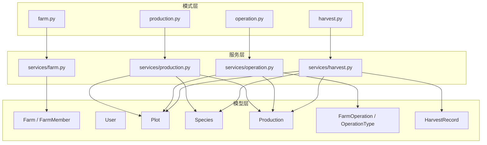
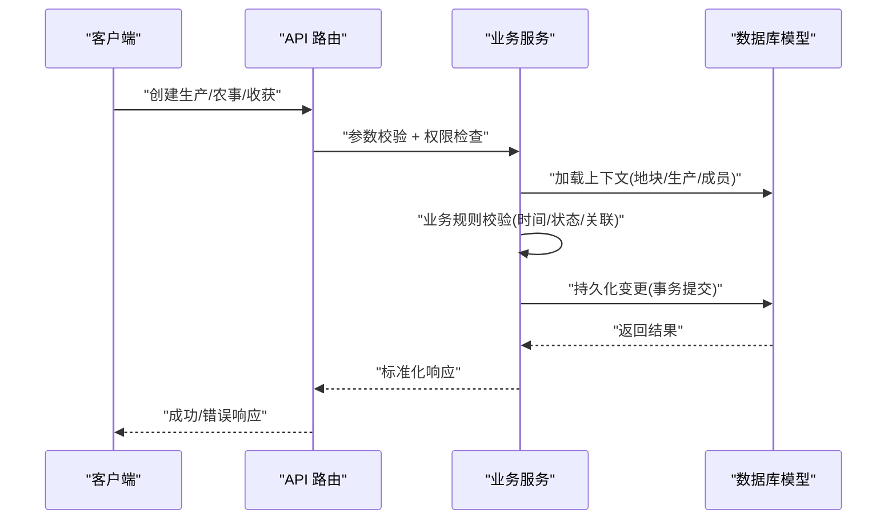
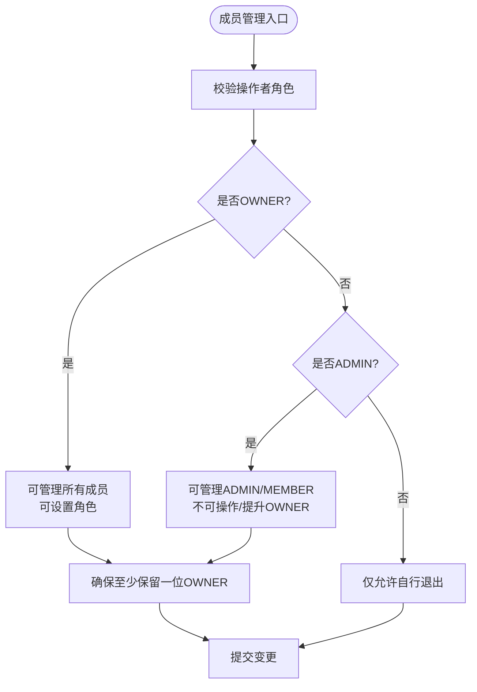
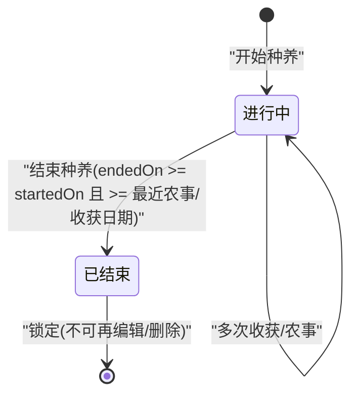
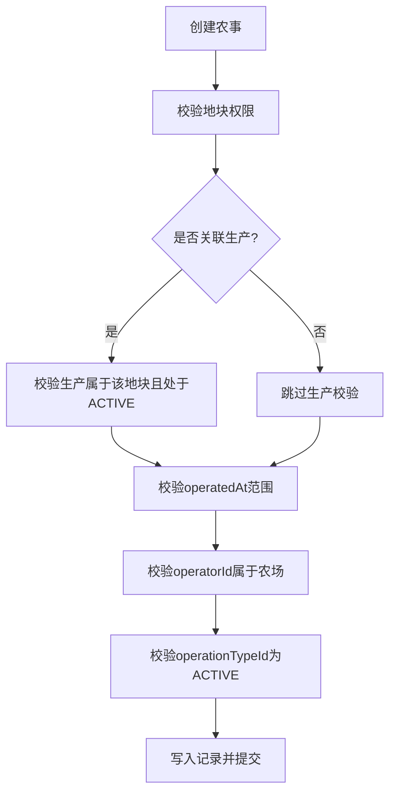
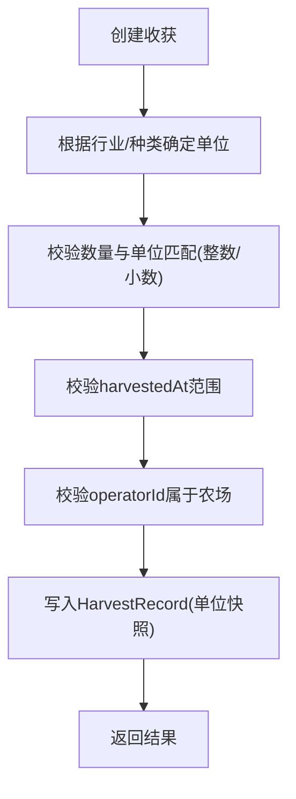
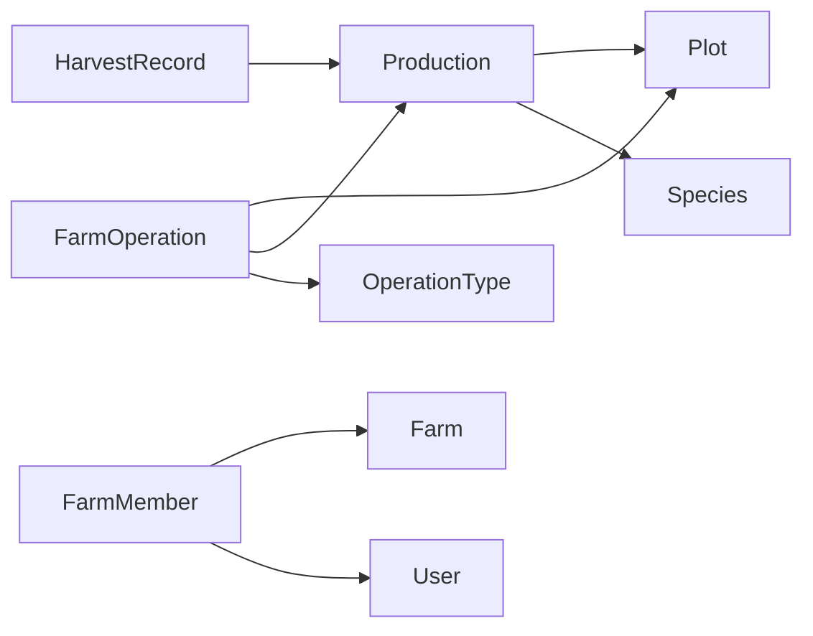

# 业务规则

<cite>
**本文引用的文件**
- [apps/api/app/models/farm.py](file://apps/api/app/models/farm.py)
- [apps/api/app/models/user.py](file://apps/api/app/models/user.py)
- [apps/api/app/models/plot.py](file://apps/api/app/models/plot.py)
- [apps/api/app/models/species.py](file://apps/api/app/models/species.py)
- [apps/api/app/models/production.py](file://apps/api/app/models/production.py)
- [apps/api/app/models/operation.py](file://apps/api/app/models/operation.py)
- [apps/api/app/models/harvest.py](file://apps/api/app/models/harvest.py)
- [apps/api/app/schemas/farm.py](file://apps/api/app/schemas/farm.py)
- [apps/api/app/schemas/production.py](file://apps/api/app/schemas/production.py)
- [apps/api/app/schemas/operation.py](file://apps/api/app/schemas/operation.py)
- [apps/api/app/schemas/harvest.py](file://apps/api/app/schemas/harvest.py)
- [apps/api/app/services/farm.py](file://apps/api/app/services/farm.py)
- [apps/api/app/services/production.py](file://apps/api/app/services/production.py)
- [apps/api/app/services/operation.py](file://apps/api/app/services/operation.py)
- [apps/api/app/services/harvest.py](file://apps/api/app/services/harvest.py)
- [docs/mvp/02-domain-model.md](file://docs/mvp/02-domain-model.md)
- [docs/mvp/03-business-rules.md](file://docs/mvp/03-business-rules.md)
</cite>

## 目录
1. [简介](#简介)
2. [项目结构](#项目结构)
3. [核心组件](#核心组件)
4. [架构总览](#架构总览)
5. [详细组件分析](#详细组件分析)
6. [依赖关系分析](#依赖关系分析)
7. [性能考虑](#性能考虑)
8. [故障排查指南](#故障排查指南)
9. [结论](#结论)
10. [附录](#附录)

## 简介
本业务规则文档面向 Pocket Farm 系统，聚焦农场协作管理的权限控制模型、角色定义与访问控制策略；农业生产业务流程（生产状态流转、约束与数据完整性）；农事活动记录的关联关系、时间序列管理与验证规则；收获统计的计算逻辑、质量评估维度与数据分析视角；并给出典型业务场景的实现要点与异常处理策略。文档内容严格基于仓库中的领域模型、服务实现与 MVP 业务规则说明进行提炼与归纳。

## 项目结构
后端采用分层设计：
- 模型层：定义用户、农场、成员、地块、种类、生产、农事、收获等实体及枚举。
- 模式层：定义请求/响应校验与序列化规则。
- 服务层：封装业务规则、权限校验、事务边界与一致性约束。
- 文档层：MVP 领域模型与业务规则说明。

图表来源
- [apps/api/app/models/farm.py:12-59](file://apps/api/app/models/farm.py#L12-L59)
- [apps/api/app/models/user.py:10-28](file://apps/api/app/models/user.py#L10-L28)
- [apps/api/app/models/plot.py:14-54](file://apps/api/app/models/plot.py#L14-L54)
- [apps/api/app/models/species.py:12-35](file://apps/api/app/models/species.py#L12-L35)
- [apps/api/app/models/production.py:13-79](file://apps/api/app/models/production.py#L13-L79)
- [apps/api/app/models/operation.py:13-80](file://apps/api/app/models/operation.py#L13-L80)
- [apps/api/app/models/harvest.py:13-48](file://apps/api/app/models/harvest.py#L13-L48)
- [apps/api/app/schemas/farm.py:14-166](file://apps/api/app/schemas/farm.py#L14-L166)
- [apps/api/app/schemas/production.py:15-198](file://apps/api/app/schemas/production.py#L15-L198)
- [apps/api/app/schemas/operation.py:15-122](file://apps/api/app/schemas/operation.py#L15-L122)
- [apps/api/app/schemas/harvest.py:15-111](file://apps/api/app/schemas/harvest.py#L15-L111)
- [apps/api/app/services/farm.py:33-264](file://apps/api/app/services/farm.py#L33-L264)
- [apps/api/app/services/production.py:164-446](file://apps/api/app/services/production.py#L164-L446)
- [apps/api/app/services/operation.py:139-307](file://apps/api/app/services/operation.py#L139-L307)
- [apps/api/app/services/harvest.py:134-281](file://apps/api/app/services/harvest.py#L134-L281)

章节来源
- [docs/mvp/02-domain-model.md:5-78](file://docs/mvp/02-domain-model.md#L5-L78)

## 核心组件
- 用户与农场成员：用户通过手机号唯一标识；农场成员角色为 OWNER、ADMIN、MEMBER，支持多 OWNER 且至少保留一位 OWNER。
- 地块：属于农场，可记录面积与边界信息，作为生产与农事的物理载体。
- 种类与行业：种类决定行业与个体单位，影响表单字段与收获单位派生。
- 生产：一次完整种养生命周期，状态 ACTIVE/ENDED，受时间与关联记录约束。
- 农事：记录地块作业行为，可关联具体生产或整块地，类型由系统维护。
- 收获：必须归属具体生产，支持多次收获，不改变生产状态。

章节来源
- [apps/api/app/models/farm.py:12-59](file://apps/api/app/models/farm.py#L12-L59)
- [apps/api/app/models/plot.py:14-54](file://apps/api/app/models/plot.py#L14-L54)
- [apps/api/app/models/species.py:12-35](file://apps/api/app/models/species.py#L12-L35)
- [apps/api/app/models/production.py:13-79](file://apps/api/app/models/production.py#L13-L79)
- [apps/api/app/models/operation.py:13-80](file://apps/api/app/models/operation.py#L13-L80)
- [apps/api/app/models/harvest.py:13-48](file://apps/api/app/models/harvest.py#L13-L48)
- [docs/mvp/02-domain-model.md:131-165](file://docs/mvp/02-domain-model.md#L131-L165)
- [docs/mvp/02-domain-model.md:318-411](file://docs/mvp/02-domain-model.md#L318-L411)
- [docs/mvp/02-domain-model.md:460-566](file://docs/mvp/02-domain-model.md#L460-L566)

## 架构总览
下图展示从 API 到服务再到模型的调用链与关键校验点。

图表来源
- [apps/api/app/services/production.py:164-217](file://apps/api/app/services/production.py#L164-L217)
- [apps/api/app/services/operation.py:139-181](file://apps/api/app/services/operation.py#L139-L181)
- [apps/api/app/services/harvest.py:134-178](file://apps/api/app/services/harvest.py#L134-L178)
- [apps/api/app/models/production.py:43-79](file://apps/api/app/models/production.py#L43-L79)
- [apps/api/app/models/operation.py:37-80](file://apps/api/app/models/operation.py#L37-L80)
- [apps/api/app/models/harvest.py:13-48](file://apps/api/app/models/harvest.py#L13-L48)

## 详细组件分析

### 权限控制与角色管理
- 角色定义：OWNER、ADMIN、MEMBER。
- 成员管理规则：
  - 添加成员仅支持已注册用户，按手机号精确查找。
  - 角色操作矩阵：
    - OWNER 可操作其他 OWNER、ADMIN、MEMBER，并可设置对应角色。
    - ADMIN 可操作 ADMIN、MEMBER，不能操作或提升 OWNER。
    - MEMBER 仅可自行退出。
  - 约束：农场始终至少保留一位 OWNER；ADMIN 不可操作 OWNER；OWNER 可在仍有其他 OWNER 时退出。
- 资源级权限：
  - OWNER/ADMIN/MEMBER 对农场、地块、生产、农事、收获具备不同读写能力，详见业务规则文档。

图表来源
- [apps/api/app/services/farm.py:94-113](file://apps/api/app/services/farm.py#L94-L113)
- [apps/api/app/services/farm.py:181-231](file://apps/api/app/services/farm.py#L181-L231)
- [apps/api/app/services/farm.py:234-264](file://apps/api/app/services/farm.py#L234-L264)
- [docs/mvp/03-business-rules.md:16-37](file://docs/mvp/03-business-rules.md#L16-L37)
- [docs/mvp/03-business-rules.md:46-75](file://docs/mvp/03-business-rules.md#L46-L75)

章节来源
- [apps/api/app/models/farm.py:12-59](file://apps/api/app/models/farm.py#L12-L59)
- [apps/api/app/schemas/farm.py:44-73](file://apps/api/app/schemas/farm.py#L44-L73)
- [apps/api/app/services/farm.py:33-264](file://apps/api/app/services/farm.py#L33-L264)
- [docs/mvp/03-business-rules.md:16-75](file://docs/mvp/03-business-rules.md#L16-L75)

### 生产业务流程与状态流转
- 开始种养：创建 Production，必填 speciesId、plotId、startedOn；农业/林业需种植标准、种植方式、作业方式；牧业需入栏数量与日龄；渔业需养殖数量与作业方式。
- 生产状态：ACTIVE 与 ENDED。结束生产需满足 endedOn 不早于 startedOn，且不早于任何关联农事与收获的业务日期。
- 同地块允许多条 ACTIVE 生产；已结束生产不可再次结束或新增正常收获。
- 生产编辑限制：若存在关联农事或收获，禁止修改 plotId、speciesId、startedOn。

图表来源
- [apps/api/app/services/production.py:164-217](file://apps/api/app/services/production.py#L164-L217)
- [apps/api/app/services/production.py:403-446](file://apps/api/app/services/production.py#L403-L446)
- [apps/api/app/models/production.py:13-79](file://apps/api/app/models/production.py#L13-L79)
- [docs/mvp/03-business-rules.md:96-133](file://docs/mvp/03-business-rules.md#L96-L133)
- [docs/mvp/03-business-rules.md:424-515](file://docs/mvp/03-business-rules.md#L424-L515)

章节来源
- [apps/api/app/schemas/production.py:15-152](file://apps/api/app/schemas/production.py#L15-L152)
- [apps/api/app/services/production.py:164-446](file://apps/api/app/services/production.py#L164-L446)
- [docs/mvp/03-business-rules.md:96-133](file://docs/mvp/03-business-rules.md#L96-L133)
- [docs/mvp/03-business-rules.md:424-515](file://docs/mvp/03-business-rules.md#L424-L515)

### 农事活动记录与时间序列管理
- 农事基础信息：operationTypeId、plotId、workMethod、operatedAt、operatorId、remark。
- 关联关系：
  - 首先属于 Plot；productionId 可选，用于追溯至具体生产。
  - 未关联生产也可记录（如翻耕、清沟等）。
- 时间校验：
  - operatedAt 不得晚于当前时间；若关联生产，则不得早于 startedOn。
- 操作人校验：operatorId 必须属于该地块所属农场。
- 类型管理：仅可使用 ACTIVE 的 OperationType；下架不影响历史展示与编辑。

图表来源
- [apps/api/app/services/operation.py:139-181](file://apps/api/app/services/operation.py#L139-L181)
- [apps/api/app/services/operation.py:222-289](file://apps/api/app/services/operation.py#L222-L289)
- [apps/api/app/models/operation.py:13-80](file://apps/api/app/models/operation.py#L13-L80)
- [apps/api/app/schemas/operation.py:15-84](file://apps/api/app/schemas/operation.py#L15-L84)
- [docs/mvp/03-business-rules.md:232-317](file://docs/mvp/03-business-rules.md#L232-L317)

章节来源
- [apps/api/app/services/operation.py:139-307](file://apps/api/app/services/operation.py#L139-L307)
- [apps/api/app/schemas/operation.py:15-122](file://apps/api/app/schemas/operation.py#L15-L122)
- [docs/mvp/03-business-rules.md:232-317](file://docs/mvp/03-business-rules.md#L232-L317)

### 收获统计、质量评估与分析维度
- 收获必须归属具体 Production，不允许只针对 Plot 创建收获。
- 单位派生：
  - 农业、渔业固定使用 KG。
  - 林业、牧业使用 Species.individual_unit。
  - 客户端不可传入 unit，创建时保存为历史快照，后续仅允许修改 quantity。
- 数量规则：
  - 重量类允许小数；个体类必须为整数。
- 时间校验：
  - harvestedAt 不得晚于当前时间，且不得早于 production.startedOn。
- 质量评估：
  - 支持 grade、productName、remark 等选填字段，用于质量分级与备注。
- 统计与分析维度建议：
  - 按生产维度聚合收获总量与频次。
  - 按地块维度汇总产量趋势。
  - 按行业/种类维度比较产出效率。
  - 结合预计亩产与实际收获对比评估效益。
  - 按作业方式（人工/机械）分析成本与效率。

图表来源
- [apps/api/app/services/harvest.py:134-178](file://apps/api/app/services/harvest.py#L134-L178)
- [apps/api/app/services/harvest.py:204-263](file://apps/api/app/services/harvest.py#L204-L263)
- [apps/api/app/models/harvest.py:13-48](file://apps/api/app/models/harvest.py#L13-L48)
- [apps/api/app/schemas/harvest.py:15-111](file://apps/api/app/schemas/harvest.py#L15-L111)
- [docs/mvp/03-business-rules.md:320-395](file://docs/mvp/03-business-rules.md#L320-L395)

章节来源
- [apps/api/app/services/harvest.py:134-281](file://apps/api/app/services/harvest.py#L134-L281)
- [apps/api/app/schemas/harvest.py:15-111](file://apps/api/app/schemas/harvest.py#L15-L111)
- [docs/mvp/03-business-rules.md:320-395](file://docs/mvp/03-business-rules.md#L320-L395)

### 数据完整性与时间约束
- 时间基准：
  - 业务时区默认 Asia/Shanghai；API datetime 使用带时区 ISO 8601，后端转换为 UTC 存储，返回携带时区偏移。
- 约束要点：
  - startedOn 不得晚于今天。
  - endedOn 不得晚于今天，且不得早于 startedOn 与最近关联农事/收获的业务日期。
  - 农事与收获的时间不得早于对应生产的 startedOn，且不晚于当前时间。
  - 纯地块农事时间不得晚于当前时间。
- 纠错与删除：
  - ACTIVE 生产在无可关联农事与收获时可编辑核心字段或删除。
  - 关联 ENDED 生产后，其农事与收获记录锁定，不可新增、修改或删除。

章节来源
- [apps/api/app/services/production.py:403-446](file://apps/api/app/services/production.py#L403-L446)
- [apps/api/app/services/operation.py:33-44](file://apps/api/app/services/operation.py#L33-L44)
- [apps/api/app/services/harvest.py:58-69](file://apps/api/app/services/harvest.py#L58-L69)
- [docs/mvp/03-business-rules.md:580-609](file://docs/mvp/03-business-rules.md#L580-L609)

### 典型业务场景与异常处理
- 场景一：开始种养失败（字段缺失或不适用）
  - 触发条件：行业不适用字段被传入或缺少必填字段。
  - 处理：返回 422 校验错误，提示缺失或不适用字段。
- 场景二：结束生产冲突（已结束或时间非法）
  - 触发条件：生产已 ENDED 或 endedOn 早于 startedOn/最近农事或收获。
  - 处理：返回 409 业务冲突或 422 校验错误。
- 场景三：农事类型不可用
  - 触发条件：选择 DISABLED 的 OperationType。
  - 处理：返回 409 业务冲突。
- 场景四：收获单位不匹配
  - 触发条件：个体单位传入小数。
  - 处理：返回 422 校验错误。
- 场景五：操作人不属于农场
  - 触发条件：operatorId 非当前农场成员。
  - 处理：返回 422 校验错误。

章节来源
- [apps/api/app/services/production.py:220-365](file://apps/api/app/services/production.py#L220-L365)
- [apps/api/app/services/operation.py:83-96](file://apps/api/app/services/operation.py#L83-L96)
- [apps/api/app/services/harvest.py:45-56](file://apps/api/app/services/harvest.py#L45-L56)
- [apps/api/app/services/harvest.py:71-84](file://apps/api/app/services/harvest.py#L71-L84)
- [docs/mvp/03-business-rules.md:580-609](file://docs/mvp/03-business-rules.md#L580-L609)

## 依赖关系分析
- 模型间依赖：
  - Production 依赖 Plot、Species。
  - FarmOperation 依赖 Plot、Production、OperationType。
  - HarvestRecord 依赖 Production。
  - FarmMember 依赖 Farm、User。
- 服务间依赖：
  - 生产服务依赖地块与种类服务以获取上下文。
  - 农事与收获服务依赖生产服务进行权限与状态校验。
- 外部依赖：
  - 数据库外键约束保证引用完整性。
  - 时区与日期库用于时间规范化与校验。

图表来源
- [apps/api/app/models/production.py:43-79](file://apps/api/app/models/production.py#L43-L79)
- [apps/api/app/models/operation.py:37-80](file://apps/api/app/models/operation.py#L37-L80)
- [apps/api/app/models/harvest.py:13-48](file://apps/api/app/models/harvest.py#L13-L48)
- [apps/api/app/models/farm.py:12-59](file://apps/api/app/models/farm.py#L12-L59)

章节来源
- [apps/api/app/models/production.py:43-79](file://apps/api/app/models/production.py#L43-L79)
- [apps/api/app/models/operation.py:37-80](file://apps/api/app/models/operation.py#L37-L80)
- [apps/api/app/models/harvest.py:13-48](file://apps/api/app/models/harvest.py#L13-L48)
- [apps/api/app/models/farm.py:12-59](file://apps/api/app/models/farm.py#L12-L59)

## 性能考虑
- 查询优化：
  - 列表接口使用分页与排序，减少全表扫描。
  - 聚合查询使用 count 与 join 优化。
- 事务与锁：
  - 成员管理使用行级锁 with_for_update 避免并发冲突。
  - 生产结束与编辑使用锁保障一致性。
- 索引：
  - 常用外键字段建立索引以提升关联查询性能。
- 时区处理：
  - 统一转换至 UTC 存储，减少时区不一致导致的计算开销。

[本节提供通用指导，无需特定文件来源]

## 故障排查指南
- 常见错误码：
  - 404 未找到：资源不存在或无权限访问。
  - 403 禁止：角色不足或越权操作。
  - 409 业务冲突：状态不符或约束违反（如重复成员、已结束生产编辑）。
  - 422 校验错误：字段缺失、格式错误或业务规则不满足。
- 排查步骤：
  - 检查请求参数是否符合 Schema 定义。
  - 确认用户角色与资源归属关系。
  - 核对时间字段与时区格式。
  - 查看关联记录是否存在（如农事、收获）以判断编辑/删除限制。
  - 关注服务层抛出的 AppException 消息定位问题。

章节来源
- [apps/api/app/core/error_codes.py](file://apps/api/app/core/error_codes.py)
- [apps/api/app/core/exceptions.py](file://apps/api/app/core/exceptions.py)
- [apps/api/app/services/farm.py:21-31](file://apps/api/app/services/farm.py#L21-L31)
- [apps/api/app/services/production.py:28-37](file://apps/api/app/services/production.py#L28-L37)
- [apps/api/app/services/operation.py:17-26](file://apps/api/app/services/operation.py#L17-L26)
- [apps/api/app/services/harvest.py:29-38](file://apps/api/app/services/harvest.py#L29-L38)

## 结论
Pocket Farm 通过清晰的领域模型与服务层规则，实现了农场协作的权限控制、生产流程的状态机管理、农事与收获的时序一致性以及收获统计的可分析性。系统在 MVP 阶段聚焦核心能力，兼顾扩展性与数据完整性，为后续功能演进奠定基础。

[本节为总结性内容，无需特定文件来源]

## 附录
- 术语对照：
  - 农业/林业：开始种植、采收、结束种植。
  - 牧业：开始养殖、出栏、结束养殖。
  - 渔业：开始养殖、捕捞、结束养殖。
- 单位与数值规则：
  - 重量类（KG）允许小数；个体类（HEAD/FEATHER/PIECE/PLANT/TAIL）必须整数。
- 分析维度建议：
  - 生产周期、产量趋势、作业方式对比、预计与实际产出差异。

章节来源
- [docs/mvp/03-business-rules.md:198-228](file://docs/mvp/03-business-rules.md#L198-L228)
- [docs/mvp/02-domain-model.md:219-243](file://docs/mvp/02-domain-model.md#L219-L243)