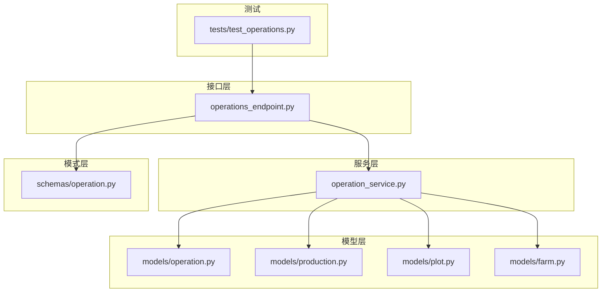
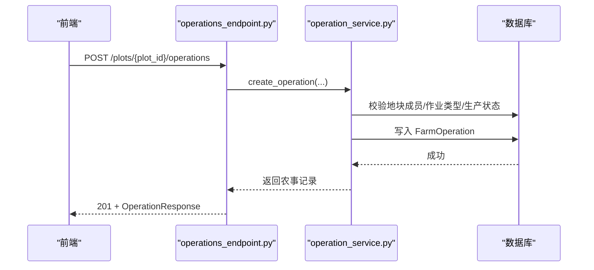
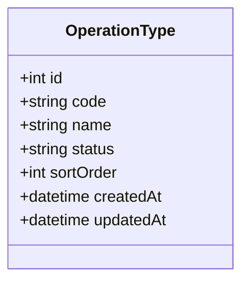
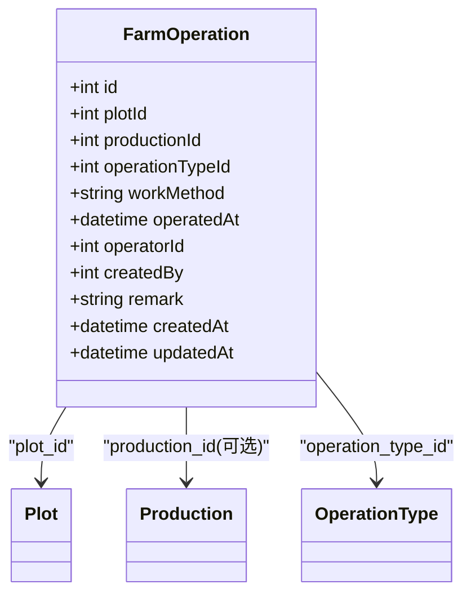
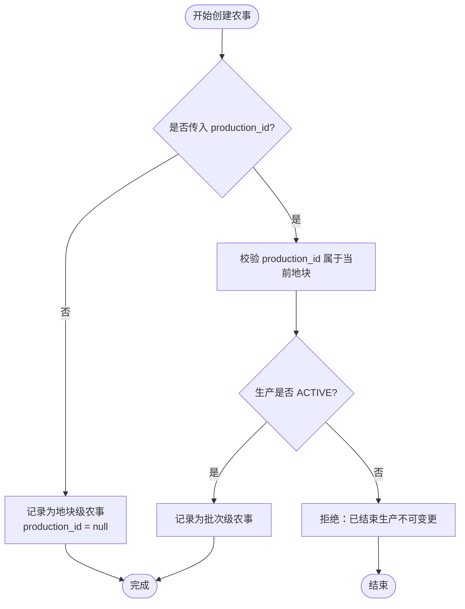
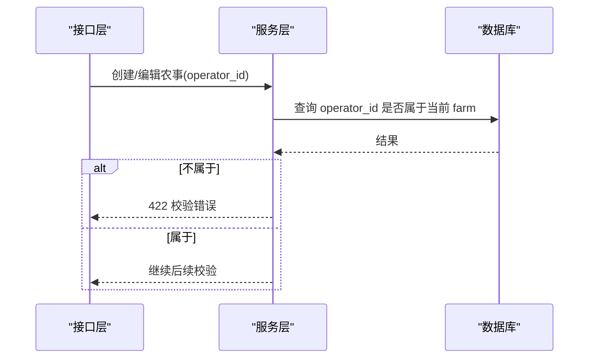
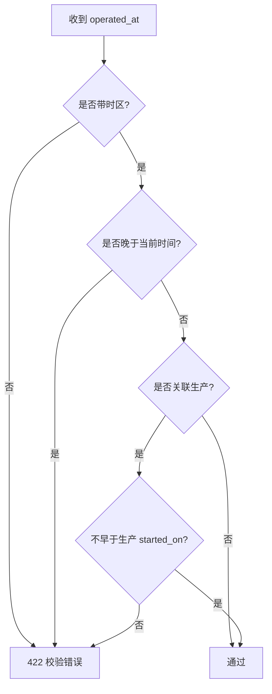
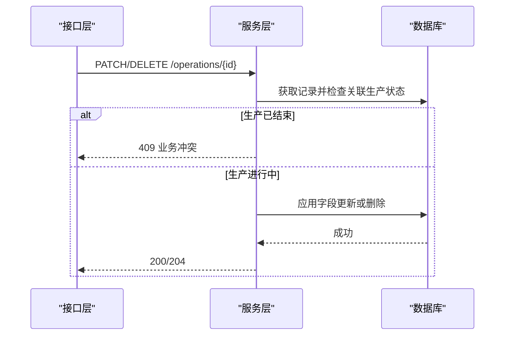
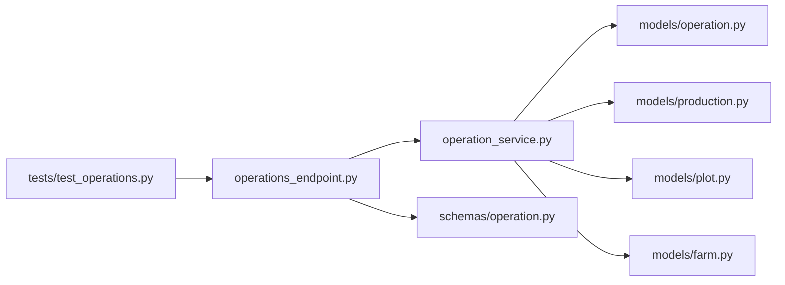

# 农事活动管理

<cite>
**本文引用的文件**
- [operation.py](file://apps/api/app/models/operation.py)
- [production.py](file://apps/api/app/models/production.py)
- [plot.py](file://apps/api/app/models/plot.py)
- [farm.py](file://apps/api/app/models/farm.py)
- [error_codes.py](file://apps/api/app/core/error_codes.py)
- [operation_schema.py](file://apps/api/app/schemas/operation.py)
- [operation_service.py](file://apps/api/app/services/operation.py)
- [operations_endpoint.py](file://apps/api/app/api/v1/endpoints/operations.py)
- [test_operations.py](file://apps/api/tests/test_operations.py)
- [业务规则文档](file://docs/mvp/03-business-rules.md)
- [领域模型文档](file://docs/mvp/02-domain-model.md)
</cite>

## 目录
1. [简介](#简介)
2. [项目结构](#项目结构)
3. [核心组件](#核心组件)
4. [架构总览](#架构总览)
5. [详细组件分析](#详细组件分析)
6. [依赖关系分析](#依赖关系分析)
7. [性能考虑](#性能考虑)
8. [故障排查指南](#故障排查指南)
9. [结论](#结论)
10. [附录：业务流程与数据示例](#附录：业务流程与数据示例)

## 简介
本文件面向 Pocket Farm 系统的“农事活动管理”能力，围绕 FarmOperation 的业务规则展开，覆盖作业类型管理、农事记录创建与编辑删除、与地块和生产的关系、无生产时的地块级农事与有生产时的批次级农事记录、作业人员权限校验、作业时间校验、作业方式默认设置、以及与已结束生产的锁定关系。文末提供完整业务流程与数据处理示例，便于前后端协同与测试验证。

## 项目结构
后端采用分层设计：
- 模型层：定义数据库表结构与枚举（如 OperationType、FarmOperation、Production、Plot、FarmMember）。
- 模式层：定义请求/响应数据结构与字段校验（如 CreateOperationRequest、UpdateOperationRequest）。
- 服务层：实现核心业务逻辑（如创建、查询、更新、删除农事；权限与时间校验；与生产状态联动）。
- 接口层：暴露 REST API（列表、创建、编辑、删除、作业类型分页等）。
- 测试：覆盖关键业务规则（作业类型禁用、时间校验、权限校验、结束生产后的锁定等）。

图表来源
- [operations_endpoint.py:1-168](file://apps/api/app/api/v1/endpoints/operations.py#L1-L168)
- [operation_service.py:1-307](file://apps/api/app/services/operation.py#L1-L307)
- [operation.py:1-80](file://apps/api/app/models/operation.py#L1-L80)
- [production.py:1-79](file://apps/api/app/models/production.py#L1-L79)
- [plot.py:1-54](file://apps/api/app/models/plot.py#L1-L54)
- [farm.py:1-59](file://apps/api/app/models/farm.py#L1-L59)
- [operation_schema.py:1-122](file://apps/api/app/schemas/operation.py#L1-L122)
- [test_operations.py:1-378](file://apps/api/tests/test_operations.py#L1-L378)

章节来源
- [operations_endpoint.py:1-168](file://apps/api/app/api/v1/endpoints/operations.py#L1-L168)
- [operation_service.py:1-307](file://apps/api/app/services/operation.py#L1-L307)
- [operation.py:1-80](file://apps/api/app/models/operation.py#L1-L80)
- [production.py:1-79](file://apps/api/app/models/production.py#L1-L79)
- [plot.py:1-54](file://apps/api/app/models/plot.py#L1-L54)
- [farm.py:1-59](file://apps/api/app/models/farm.py#L1-L59)
- [operation_schema.py:1-122](file://apps/api/app/schemas/operation.py#L1-L122)
- [test_operations.py:1-378](file://apps/api/tests/test_operations.py#L1-L378)

## 核心组件
- 作业类型管理：OperationType 维护作业类型元数据与状态（ACTIVE/DISABLED），仅 ACTIVE 类型可用于新建或改选。
- 农事记录：FarmOperation 关联 Plot（必填）与可选 Production；记录作业方式、作业时间、操作人、创建人、备注等。
- 生产关联：当存在 ACTIVE 的 Production 时，可建立批次级农事；否则为地块级农事（production_id 为空）。
- 权限校验：operator_id 必须属于当前 Plot 所属 Farm 的成员；创建/编辑均会校验。
- 时间校验：operated_at 不得晚于当前时间；若关联 Production，则不得早于其 started_on。
- 默认值：work_method 默认为 MANUAL；operated_at 未传时使用当前时间；operator_id 未传时使用当前用户。
- 锁定机制：与 ENDED 的 Production 关联的农事记录不可新增、修改或删除。

章节来源
- [operation.py:18-80](file://apps/api/app/models/operation.py#L18-L80)
- [production.py:13-32](file://apps/api/app/models/production.py#L13-L32)
- [operation_schema.py:15-84](file://apps/api/app/schemas/operation.py#L15-L84)
- [operation_service.py:33-96,139-181,222-307:33-96](file://apps/api/app/services/operation.py#L33-L96)
- [business_rules.md:232-318,580-609:232-318](file://docs/mvp/03-business-rules.md#L232-L318)
- [domain_model.md:460-503,584-611:460-503](file://docs/mvp/02-domain-model.md#L460-L503)

## 架构总览
农事活动管理的调用链路从前端到后端依次为：接口层接收请求并做基础参数绑定，服务层执行权限、时间与业务规则校验，持久化后返回统一响应。

图表来源
- [operations_endpoint.py:91-113](file://apps/api/app/api/v1/endpoints/operations.py#L91-L113)
- [operation_service.py:139-181](file://apps/api/app/services/operation.py#L139-L181)

章节来源
- [operations_endpoint.py:63-168](file://apps/api/app/api/v1/endpoints/operations.py#L63-L168)
- [operation_service.py:117-181](file://apps/api/app/services/operation.py#L117-L181)

## 详细组件分析

### 作业类型管理（OperationType）
- 作用：集中维护农事类型（如翻耕、施肥、灌溉等），支持启用/禁用。
- 规则：
  - 列表接口仅返回 ACTIVE 类型。
  - 新建或改选农事时，只能使用 ACTIVE 的作业类型；禁用类型将拒绝创建/改选。
- 数据模型关键字段：id、code、name、status、sort_order、created_at、updated_at。

图表来源
- [operation.py:18-35](file://apps/api/app/models/operation.py#L18-L35)
- [operation_service.py:83-114](file://apps/api/app/services/operation.py#L83-L114)
- [operations_endpoint.py:148-168](file://apps/api/app/api/v1/endpoints/operations.py#L148-L168)

章节来源
- [operation.py:18-35](file://apps/api/app/models/operation.py#L18-L35)
- [operation_service.py:83-114](file://apps/api/app/services/operation.py#L83-L114)
- [operations_endpoint.py:148-168](file://apps/api/app/api/v1/endpoints/operations.py#L148-L168)

### 农事记录（FarmOperation）
- 作用：记录一次农事行为，归属地块并可关联具体生产批次。
- 关键字段：
  - plot_id：必填，指向地块。
  - production_id：可空；为空表示地块级农事；非空表示批次级农事。
  - operation_type_id：必填，指向作业类型。
  - work_method：默认 MANUAL。
  - operated_at：默认当前时间；带时区校验。
  - operator_id：实际执行人，需属于当前地块所属农场成员。
  - created_by：系统自动写入，不可由前端传入。
  - remark：可选备注。
- 列表：按作业时间倒序展示。

图表来源
- [operation.py:37-80](file://apps/api/app/models/operation.py#L37-L80)
- [operation_schema.py:86-105](file://apps/api/app/schemas/operation.py#L86-L105)
- [operation_service.py:117-181](file://apps/api/app/services/operation.py#L117-L181)

章节来源
- [operation.py:37-80](file://apps/api/app/models/operation.py#L37-L80)
- [operation_schema.py:86-105](file://apps/api/app/schemas/operation.py#L86-L105)
- [operation_service.py:117-181](file://apps/api/app/services/operation.py#L117-L181)

### 与地块、生产的关联逻辑
- 地块级农事：当没有 ACTIVE 的生产时，或选择 production_id 为空，记录为地块级农事。
- 批次级农事：当存在 ACTIVE 的生产且显式传入 production_id 时，记录为批次级农事；后端校验该生产必须属于当前地块。
- 多生产并存：同一地块可同时存在多条 ACTIVE 生产，农事记录通过 production_id 精确归属。

图表来源
- [operation_service.py:61-80](file://apps/api/app/services/operation.py#L61-L80)
- [operation_service.py:139-181](file://apps/api/app/services/operation.py#L139-L181)
- [business_rules.md:305-318](file://docs/mvp/03-business-rules.md#L305-L318)

章节来源
- [operation_service.py:61-80](file://apps/api/app/services/operation.py#L61-L80)
- [operation_service.py:139-181](file://apps/api/app/services/operation.py#L139-L181)
- [business_rules.md:305-318](file://docs/mvp/03-business-rules.md#L305-L318)

### 作业人员权限验证
- 创建/编辑时，operator_id 必须属于当前地块所属农场成员；否则返回校验错误。
- 列表/编辑/删除均需当前用户具备对应资源访问权限（通过地块成员关系校验）。

图表来源
- [operation_service.py:46-59](file://apps/api/app/services/operation.py#L46-L59)
- [operation_service.py:139-181](file://apps/api/app/services/operation.py#L139-L181)
- [operation_service.py:222-289](file://apps/api/app/services/operation.py#L222-L289)

章节来源
- [operation_service.py:46-59](file://apps/api/app/services/operation.py#L46-L59)
- [operation_service.py:139-181](file://apps/api/app/services/operation.py#L139-L181)
- [operation_service.py:222-289](file://apps/api/app/services/operation.py#L222-L289)

### 作业时间校验规则
- operated_at 必须带时区；若未传则使用当前时间。
- 不得晚于当前时间。
- 若关联生产，不得早于该生产的 started_on。

图表来源
- [operation_schema.py:9-12](file://apps/api/app/schemas/operation.py#L9-L12)
- [operation_service.py:29-44](file://apps/api/app/services/operation.py#L29-L44)

章节来源
- [operation_schema.py:9-12](file://apps/api/app/schemas/operation.py#L9-L12)
- [operation_service.py:29-44](file://apps/api/app/services/operation.py#L29-L44)

### 作业方式的默认设置
- 默认值为 MANUAL（人工）。
- 可在创建或编辑时显式指定 MECHANICAL（机械）。

章节来源
- [operation.py:59](file://apps/api/app/models/operation.py#L59)
- [operation_schema.py:26-30](file://apps/api/app/schemas/operation.py#L26-L30)
- [business_rules.md:253-269](file://docs/mvp/03-business-rules.md#L253-L269)

### 农事记录的编辑与删除限制
- 编辑：
  - 可修改 production_id、operation_type_id、work_method、operated_at、operator_id、remark。
  - 若修改 operation_type_id，新类型必须为 ACTIVE。
  - 若修改 production_id，仍需满足生产归属与状态校验。
  - 若修改 operated_at，仍需满足时间校验。
- 删除：允许删除，但若关联的生产已结束，则禁止删除。
- 锁定：与 ENDED 的生产关联的农事记录不可新增、修改或删除。

图表来源
- [operation_service.py:207-219](file://apps/api/app/services/operation.py#L207-L219)
- [operation_service.py:222-307](file://apps/api/app/services/operation.py#L222-L307)
- [operations_endpoint.py:116-145](file://apps/api/app/api/v1/endpoints/operations.py#L116-L145)

章节来源
- [operation_service.py:207-219](file://apps/api/app/services/operation.py#L207-L219)
- [operation_service.py:222-307](file://apps/api/app/services/operation.py#L222-L307)
- [operations_endpoint.py:116-145](file://apps/api/app/api/v1/endpoints/operations.py#L116-L145)

### 与已结束生产的锁定关系
- 一旦生产被结束（ENDED），与其关联的农事记录将被锁定：
  - 不允许再为该生产新增农事。
  - 不允许修改或删除已存在的与该生产关联的农事。
- 纯地块级农事（production_id 为空）不受生产结束影响，但仍受时间校验约束。

章节来源
- [operation_service.py:61-80](file://apps/api/app/services/operation.py#L61-L80)
- [operation_service.py:207-219](file://apps/api/app/services/operation.py#L207-L219)
- [business_rules.md:498-515](file://docs/mvp/03-business-rules.md#L498-L515)

## 依赖关系分析
- 接口层依赖服务层进行业务处理，服务层依赖模型层进行数据读写。
- 服务层对权限、时间、状态的校验贯穿创建、编辑、删除全流程。
- 测试用例覆盖了作业类型禁用、时间校验、权限校验、结束生产锁定等关键路径。

图表来源
- [operations_endpoint.py:1-168](file://apps/api/app/api/v1/endpoints/operations.py#L1-L168)
- [operation_service.py:1-307](file://apps/api/app/services/operation.py#L1-L307)
- [operation.py:1-80](file://apps/api/app/models/operation.py#L1-L80)
- [production.py:1-79](file://apps/api/app/models/production.py#L1-L79)
- [plot.py:1-54](file://apps/api/app/models/plot.py#L1-L54)
- [farm.py:1-59](file://apps/api/app/models/farm.py#L1-L59)
- [operation_schema.py:1-122](file://apps/api/app/schemas/operation.py#L1-L122)
- [test_operations.py:1-378](file://apps/api/tests/test_operations.py#L1-L378)

章节来源
- [operations_endpoint.py:1-168](file://apps/api/app/api/v1/endpoints/operations.py#L1-L168)
- [operation_service.py:1-307](file://apps/api/app/services/operation.py#L1-L307)
- [test_operations.py:1-378](file://apps/api/tests/test_operations.py#L1-L378)

## 性能考虑
- 列表查询使用分页与排序（按作业时间倒序），减少不必要的数据传输。
- 权限与状态校验在数据库层通过外键与索引优化（如 plot_id、production_id、operation_type_id 索引）。
- 并发安全：编辑/删除时对生产记录加锁，避免竞态条件导致的状态不一致。

[本节为通用指导，不直接分析具体文件]

## 故障排查指南
- 422 校验错误：
  - operated_at 未带时区或晚于当前时间。
  - 关联生产时 operated_at 早于生产开始日期。
  - operator_id 不属于当前地块所属农场。
  - 作业类型无效或已禁用。
  - 生产 ID 与地块不匹配。
- 409 业务冲突：
  - 尝试对已结束生产新增/修改/删除农事。
  - 使用已禁用的作业类型创建或改选。
- 404 未找到：
  - 农事记录不存在或当前用户无权访问。

章节来源
- [operation_service.py:17-26](file://apps/api/app/services/operation.py#L17-L26)
- [operation_service.py:33-96](file://apps/api/app/services/operation.py#L33-L96)
- [operation_service.py:184-219](file://apps/api/app/services/operation.py#L184-L219)
- [error_codes.py:1-13](file://apps/api/app/core/error_codes.py#L1-L13)

## 结论
Pocket Farm 的农事活动管理以 FarmOperation 为核心，围绕地块与生产构建灵活的记录体系：无生产时为地块级农事，有生产时为批次级农事。系统通过严格的权限校验、时间校验与作业类型状态控制，确保数据的准确性与一致性；同时通过生产结束锁定机制，保障历史数据的不可变性。整体设计清晰、可扩展，适合 MVP 阶段快速落地与后续演进。

[本节为总结性内容，不直接分析具体文件]

## 附录：业务流程与数据示例

### 典型流程一：空闲地块记录农事（地块级）
- 场景：地块无 ACTIVE 生产，记录翻耕。
- 步骤：
  - 调用创建接口，传入 operation_type_id、production_id=null。
  - 默认 work_method=MANUAL，operated_at=当前时间，operator_id=当前用户。
  - 列表按 operated_at 倒序显示。
- 参考测试：
  - [test_operations.py:175-211](file://apps/api/tests/test_operations.py#L175-L211)

章节来源
- [test_operations.py:175-211](file://apps/api/tests/test_operations.py#L175-L211)
- [operation_service.py:139-181](file://apps/api/app/services/operation.py#L139-L181)

### 典型流程二：有生产时记录批次级农事
- 场景：地块存在 ACTIVE 生产，记录施肥。
- 步骤：
  - 传入 operation_type_id、production_id=对应生产ID。
  - 校验 production_id 属于当前地块；operated_at 不早于生产开始日期且不晚于当前时间。
  - 可指定 work_method=MECHANICAL。
- 参考测试：
  - [test_operations.py:213-262](file://apps/api/tests/test_operations.py#L213-L262)

章节来源
- [test_operations.py:213-262](file://apps/api/tests/test_operations.py#L213-L262)
- [operation_service.py:61-80](file://apps/api/app/services/operation.py#L61-L80)
- [operation_service.py:139-181](file://apps/api/app/services/operation.py#L139-L181)

### 典型流程三：作业类型禁用与列表过滤
- 场景：某作业类型被禁用后不再出现在列表，且无法用于新建或改选。
- 步骤：
  - 列表接口仅返回 ACTIVE 类型。
  - 创建或编辑时若选择禁用类型，返回业务冲突。
- 参考测试：
  - [test_operations.py:151-173](file://apps/api/tests/test_operations.py#L151-L173)

章节来源
- [test_operations.py:151-173](file://apps/api/tests/test_operations.py#L151-L173)
- [operation_service.py:83-114](file://apps/api/app/services/operation.py#L83-L114)

### 典型流程四：权限校验与越权保护
- 场景：非农场成员不能操作；成员可被指定为操作人。
- 步骤：
  - 创建时传入 operator_id，后端校验其属于当前农场。
  - 非成员尝试查看/编辑/删除农事返回未找到。
- 参考测试：
  - [test_operations.py:264-320](file://apps/api/tests/test_operations.py#L264-L320)

章节来源
- [test_operations.py:264-320](file://apps/api/tests/test_operations.py#L264-L320)
- [operation_service.py:46-59](file://apps/api/app/services/operation.py#L46-L59)

### 典型流程五：生产结束后锁定农事
- 场景：生产结束后，不能再为该生产新增/修改/删除农事。
- 步骤：
  - 结束生产后，尝试新增/编辑/删除关联农事返回业务冲突。
  - 纯地块级农事仍可正常操作（仍受时间校验约束）。
- 参考测试：
  - [test_operations.py:322-378](file://apps/api/tests/test_operations.py#L322-L378)

章节来源
- [test_operations.py:322-378](file://apps/api/tests/test_operations.py#L322-L378)
- [operation_service.py:207-219](file://apps/api/app/services/operation.py#L207-L219)
- [operation_service.py:222-307](file://apps/api/app/services/operation.py#L222-L307)

### 数据处理示例（字段说明）
- 创建请求关键字段：
  - operationTypeId：必填，作业类型ID。
  - productionId：可空；为空表示地块级农事；非空表示批次级农事。
  - workMethod：默认 MANUAL。
  - operatedAt：可选；带时区的 ISO 8601；未传则用当前时间。
  - operatorId：可选；默认当前用户；必须属于当前农场。
  - remark：可选，最长 1000 字符。
- 响应关键字段：
  - id、plotId、productionId、operationType、workMethod、operatedAt、operatorId、createdBy、remark、createdAt、updatedAt。

章节来源
- [operation_schema.py:15-105](file://apps/api/app/schemas/operation.py#L15-L105)
- [operations_endpoint.py:47-60](file://apps/api/app/api/v1/endpoints/operations.py#L47-L60)