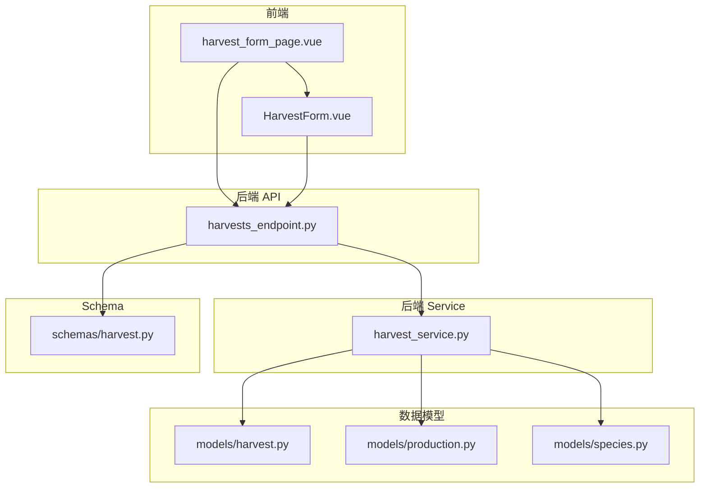
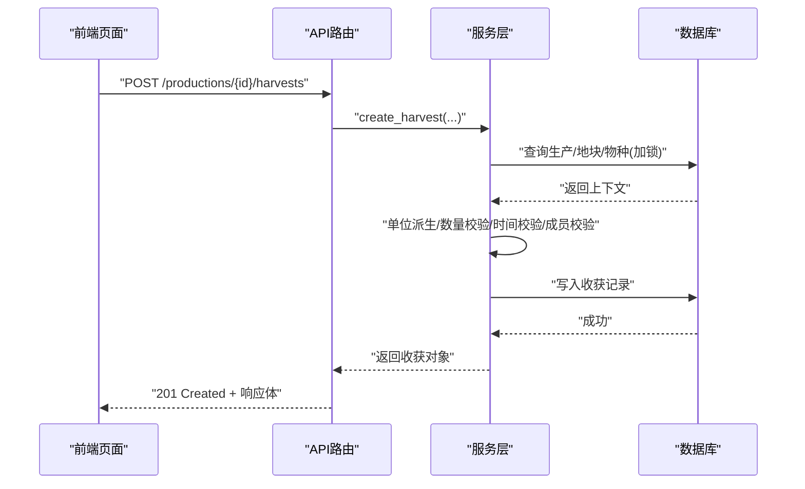
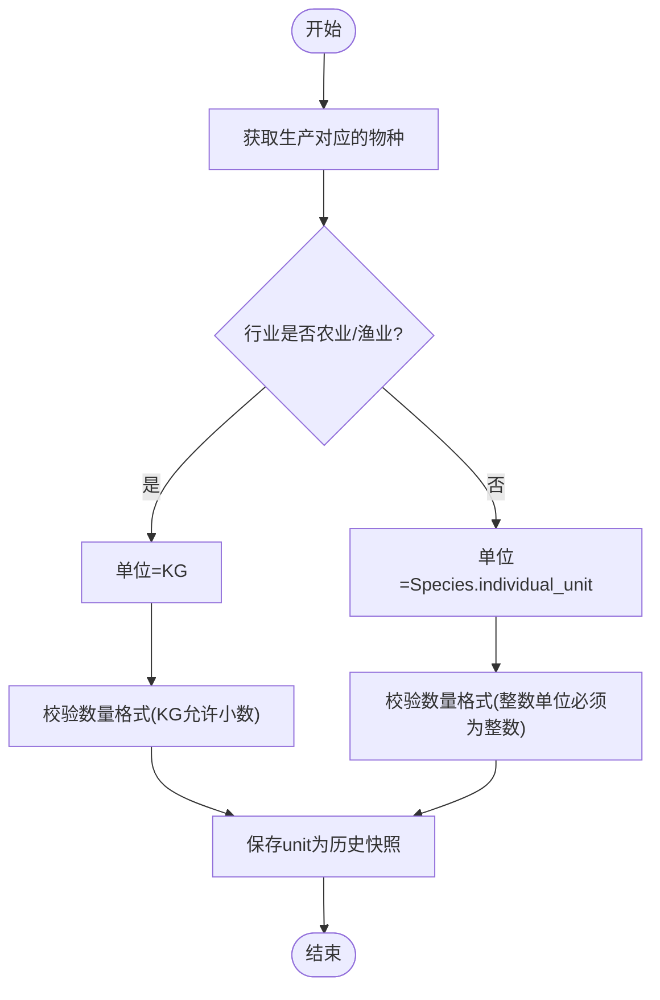
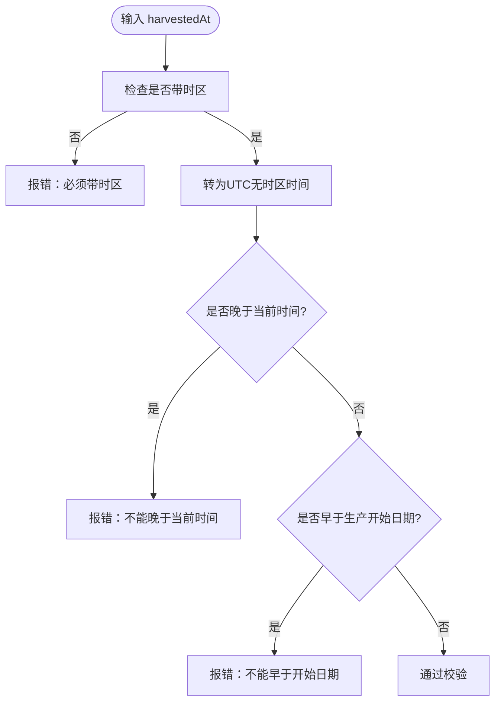
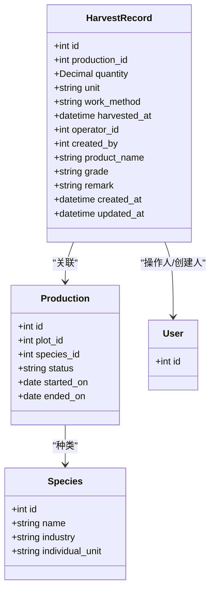

# 收获统计管理

<cite>
**本文引用的文件**
- [harvest.py](file://apps/api/app/models/harvest.py)
- [production.py](file://apps/api/app/models/production.py)
- [species.py](file://apps/api/app/models/species.py)
- [harvest_schema.py](file://apps/api/app/schemas/harvest.py)
- [harvest_service.py](file://apps/api/app/services/harvest.py)
- [harvests_endpoint.py](file://apps/api/app/api/v1/endpoints/harvests.py)
- [business_rules.md](file://docs/mvp/03-business-rules.md)
- [HarvestForm.vue](file://apps/miniapp/src/components/HarvestForm.vue)
- [harvest_form_page.vue](file://apps/miniapp/src/pages/harvests/form.vue)
</cite>

## 目录
1. [引言](#引言)
2. [项目结构](#项目结构)
3. [核心组件](#核心组件)
4. [架构总览](#架构总览)
5. [详细组件分析](#详细组件分析)
6. [依赖关系分析](#依赖关系分析)
7. [性能与一致性](#性能与一致性)
8. [故障排查指南](#故障排查指南)
9. [结论](#结论)
10. [附录：数据模型与字段说明](#附录数据模型与字段说明)

## 引言
本文件面向 Pocket Farm 系统的“收获统计管理”能力，围绕 HarvestRecord 的业务规则、单位规范、时间校验、质量评估、次数管理与数据分析维度进行系统化说明。重点明确以下原则：
- 收获记录必须关联具体生产（Production），而非地块（Plot）。
- 不同行业对收获的术语差异由前端展示处理，后端统一为 HarvestRecord。
- 一次生产可有多条收获记录；创建或修改收获不会结束生产；已结束的生产不允许再新增或修改收获。
- 单位自动派生并受数量格式约束；支持按行业的质量等级与备注记录。
- 提供基于生产维度的分页查询与按地块聚合的统计能力。

## 项目结构
收获功能在后端采用分层设计：API 路由层负责参数绑定与响应封装；服务层实现业务规则与数据访问；数据模型层定义持久化结构与枚举；Schema 层负责请求/响应校验与序列化。小程序前端通过表单组件完成录入，并在页面中组织上下文与交互流程。

图表来源
- [harvests_endpoint.py:1-163](file://apps/api/app/api/v1/endpoints/harvests.py#L1-L163)
- [harvest_service.py:1-281](file://apps/api/app/services/harvest.py#L1-L281)
- [harvest.py:13-48](file://apps/api/app/models/harvest.py#L13-L48)
- [production.py:13-79](file://apps/api/app/models/production.py#L13-L79)
- [species.py:12-35](file://apps/api/app/models/species.py#L12-L35)
- [harvest_schema.py:15-111](file://apps/api/app/schemas/harvest.py#L15-L111)

章节来源
- [harvests_endpoint.py:1-163](file://apps/api/app/api/v1/endpoints/harvests.py#L1-L163)
- [harvest_service.py:1-281](file://apps/api/app/services/harvest.py#L1-L281)
- [harvest.py:13-48](file://apps/api/app/models/harvest.py#L13-L48)
- [production.py:13-79](file://apps/api/app/models/production.py#L13-L79)
- [species.py:12-35](file://apps/api/app/models/species.py#L12-L35)
- [harvest_schema.py:15-111](file://apps/api/app/schemas/harvest.py#L15-L111)

## 核心组件
- HarvestRecord 数据模型：定义收获记录的数据库表结构与字段约束，包括与 Production 的外键关联、数量与单位、作业方式、采收时间、操作人、产品信息、等级与备注等。
- 业务服务：实现创建、更新、删除、列表查询等核心逻辑，包含单位派生、数量校验、时间校验、权限校验与状态保护。
- API 路由：暴露 RESTful 接口，负责参数解析、响应包装与分页输出。
- Schema：定义请求体与响应体的校验规则，包括时区要求、数值范围、长度限制与别名映射。
- 前端表单：根据行业与生产信息动态展示术语、单位与帮助文案，并进行客户端侧基础校验。

章节来源
- [harvest.py:13-48](file://apps/api/app/models/harvest.py#L13-L48)
- [harvest_service.py:45-69](file://apps/api/app/services/harvest.py#L45-L69)
- [harvests_endpoint.py:66-163](file://apps/api/app/api/v1/endpoints/harvests.py#L66-L163)
- [harvest_schema.py:15-111](file://apps/api/app/schemas/harvest.py#L15-L111)
- [HarvestForm.vue:105-173](file://apps/miniapp/src/components/HarvestForm.vue#L105-L173)

## 架构总览
下图展示了从前端到后端的完整调用链与关键校验点。

图表来源
- [harvests_endpoint.py:86-109](file://apps/api/app/api/v1/endpoints/harvests.py#L86-L109)
- [harvest_service.py:134-178](file://apps/api/app/services/harvest.py#L134-L178)

章节来源
- [harvests_endpoint.py:86-109](file://apps/api/app/api/v1/endpoints/harvests.py#L86-L109)
- [harvest_service.py:134-178](file://apps/api/app/services/harvest.py#L134-L178)

## 详细组件分析

### 业务规则与约束
- 收获必须关联具体生产：HarvestRecord.production_id 为必填外键，禁止仅针对地块创建收获。
- 一次生产可多次收获：同一 production_id 允许多条 HarvestRecord，用于记录分批采收/捕捞/出栏。
- 收获不结束生产：创建或修改收获不会改变 Production.status；只有显式“结束种养”才会将状态置为 ENDED。
- 已结束生产的限制：ENDED 状态下不允许新增、修改或删除收获记录。
- 时间约束：harvestedAt 不得晚于当前时间，且不得早于生产开始日期。
- 操作人校验：operatorId 必须属于生产所属农场；未传时默认使用当前用户。
- 产品名默认：若未填写 productName，则默认使用对应 Species.name。
- 等级与备注：grade 与 remark 为选填，不强制默认值。

章节来源
- [business_rules.md:320-395](file://docs/mvp/03-business-rules.md#L320-L395)
- [business_rules.md:398-514](file://docs/mvp/03-business-rules.md#L398-L514)
- [harvest_service.py:58-69](file://apps/api/app/services/harvest.py#L58-L69)
- [harvest_service.py:147-178](file://apps/api/app/services/harvest.py#L147-L178)

### 单位规范与自动派生
- 单位来源：根据 Production 关联的 Species.industry 与 individual_unit 自动派生。
- 重量型行业：农业与渔业使用 KG；其他行业使用 Species.individual_unit。
- 数量格式：整数单位（如 HEAD、FEATHER、PIECE、PLANT、TAIL）必须为整数；KG 允许小数。
- 不可修改单位：创建后 unit 作为历史快照保存，后续仅允许修改 quantity 等字段，不允许更改 unit。

图表来源
- [harvest_service.py:18-56](file://apps/api/app/services/harvest.py#L18-L56)
- [species.py:12-35](file://apps/api/app/models/species.py#L12-L35)
- [production.py:34-41](file://apps/api/app/models/production.py#L34-L41)

章节来源
- [harvest_service.py:18-56](file://apps/api/app/services/harvest.py#L18-L56)
- [species.py:12-35](file://apps/api/app/models/species.py#L12-L35)
- [production.py:34-41](file://apps/api/app/models/production.py#L34-L41)

### 时间校验与补录
- harvestedAt 必须带时区；后端转换为 UTC 无时区时间存储，返回时携带时区偏移。
- 补录规则：允许在 ACTIVE 生产中补录过去数据，但 harvestedAt 不得晚于当前时间，且不早于 startedOn。
- 前端限制：日期选择器最小值为生产开始日期；时间组合后不得晚于当前时间。

图表来源
- [harvest_schema.py:9-12](file://apps/api/app/schemas/harvest.py#L9-L12)
- [harvest_service.py:41-63](file://apps/api/app/services/harvest.py#L41-L63)
- [HarvestForm.vue:216-278](file://apps/miniapp/src/components/HarvestForm.vue#L216-L278)

章节来源
- [harvest_schema.py:9-12](file://apps/api/app/schemas/harvest.py#L9-L12)
- [harvest_service.py:41-63](file://apps/api/app/services/harvest.py#L41-L63)
- [HarvestForm.vue:216-278](file://apps/miniapp/src/components/HarvestForm.vue#L216-L278)

### 质量评估与产品元信息
- 产品名称：可选；未填写时默认使用 Species.name。
- 等级：可选；不自动默认任何业务事实（如“特等品”）。
- 备注：可选；用于补充说明。
- 作业方式：可选；默认 MANUAL，支持 MANUAL/MECHANICAL。

章节来源
- [harvest_service.py:163-174](file://apps/api/app/services/harvest.py#L163-L174)
- [business_rules.md:356-395](file://docs/mvp/03-business-rules.md#L356-L395)
- [harvest_schema.py:15-48](file://apps/api/app/schemas/harvest.py#L15-L48)

### 次数管理与生命周期
- 一次生产可有多条收获记录，用于记录多批次产出。
- 创建/修改/删除收获均不会改变生产状态；只有“结束种养”才会将状态置为 ENDED。
- 已结束生产锁定：不再允许新增、修改或删除收获记录。

章节来源
- [business_rules.md:398-514](file://docs/mvp/03-business-rules.md#L398-L514)
- [harvest_service.py:66-69](file://apps/api/app/services/harvest.py#L66-L69)
- [harvest_service.py:204-281](file://apps/api/app/services/harvest.py#L204-L281)

### 前端术语与单位展示
- 术语：农业/林业显示“采收”，渔业显示“捕捞”，牧业显示“出栏”。
- 单位：农业/渔业固定 KG；林业/牧业使用 Species.individual_unit。
- 帮助文案：根据单位类型提示是否允许小数或必须为整数。
- 操作人：默认当前用户，可从农场成员中选择；后端会校验其归属。

章节来源
- [HarvestForm.vue:149-173](file://apps/miniapp/src/components/HarvestForm.vue#L149-L173)
- [harvest_form_page.vue:78-86](file://apps/miniapp/src/pages/harvests/form.vue#L78-L86)
- [business_rules.md:198-228](file://docs/mvp/03-business-rules.md#L198-L228)

## 依赖关系分析
- HarvestRecord 依赖 Production（外键）、User（操作人与创建人）。
- 服务层依赖 Production、Plot、FarmMember、Species 以完成权限与单位派生。
- API 层依赖 Schema 进行请求/响应校验与序列化。
- 前端依赖服务层提供的接口与数据模型，结合生产上下文渲染表单。

图表来源
- [harvest.py:13-48](file://apps/api/app/models/harvest.py#L13-L48)
- [production.py:43-79](file://apps/api/app/models/production.py#L43-L79)
- [species.py:27-35](file://apps/api/app/models/species.py#L27-L35)

章节来源
- [harvest.py:13-48](file://apps/api/app/models/harvest.py#L13-L48)
- [production.py:43-79](file://apps/api/app/models/production.py#L43-L79)
- [species.py:27-35](file://apps/api/app/models/species.py#L27-L35)

## 性能与一致性
- 并发安全：创建收获时对生产上下文加锁，避免并发修改导致的状态不一致。
- 查询优化：按生产或地块维度分页查询收获记录，使用排序与偏移控制。
- 事务边界：创建/更新/删除均在会话内提交，保证数据一致性。
- 时间处理：统一转换为 UTC 无时区存储，减少跨时区问题。

章节来源
- [harvest_service.py:147-152](file://apps/api/app/services/harvest.py#L147-L152)
- [harvest_service.py:86-131](file://apps/api/app/services/harvest.py#L86-L131)
- [harvest_service.py:175-178](file://apps/api/app/services/harvest.py#L175-L178)

## 故障排查指南
- 404 未找到：收获记录不存在或无权限访问。
- 409 业务冲突：尝试修改已结束生产的收获记录。
- 422 校验错误：
  - 数量小于等于 0。
  - 整数单位传入小数。
  - harvestedAt 不带时区或超出时间范围。
  - operatorId 不属于生产所属农场。
- 前端常见提示：
  - 未选择生产。
  - 数量格式不正确。
  - 收获日期早于开始日期或晚于当前时间。
  - 未选择操作人。

章节来源
- [harvest_service.py:29-38](file://apps/api/app/services/harvest.py#L29-L38)
- [harvest_service.py:45-63](file://apps/api/app/services/harvest.py#L45-L63)
- [harvest_service.py:71-84](file://apps/api/app/services/harvest.py#L71-L84)
- [HarvestForm.vue:248-278](file://apps/miniapp/src/components/HarvestForm.vue#L248-L278)

## 结论
Pocket Farm 的收获统计管理以 Production 为核心，确保收获记录的可追溯性与准确性。通过严格的单位派生与数量校验、时间约束与权限校验，系统在不同行业中提供了统一的底层模型与灵活的前端展示。一次生产的多条收获记录支持多批次产出统计，同时保障已结束生产的锁定与一致性。基于生产与地块的查询能力，为后续的数据分析与报表提供坚实基础。

## 附录：数据模型与字段说明
- HarvestRecord
  - production_id：必填，关联具体生产。
  - quantity：必填，大于 0；单位决定数值格式。
  - unit：自动派生，创建后不可修改。
  - work_method：可选，默认 MANUAL。
  - harvested_at：必填，带时区；后端转 UTC 存储。
  - operator_id：必填，属于生产所属农场。
  - created_by：后端自动写入，不可修改。
  - product_name：可选，默认 Species.name。
  - grade：可选，不自动默认。
  - remark：可选。
- Production
  - status：ACTIVE/ENDED；收获不改变状态。
  - started_on：harvested_at 不得早于此日期。
- Species
  - industry：决定单位派生策略。
  - individual_unit：非重量型行业的单位来源。

章节来源
- [harvest.py:13-48](file://apps/api/app/models/harvest.py#L13-L48)
- [production.py:43-79](file://apps/api/app/models/production.py#L43-L79)
- [species.py:27-35](file://apps/api/app/models/species.py#L27-L35)
- [harvest_schema.py:90-111](file://apps/api/app/schemas/harvest.py#L90-L111)