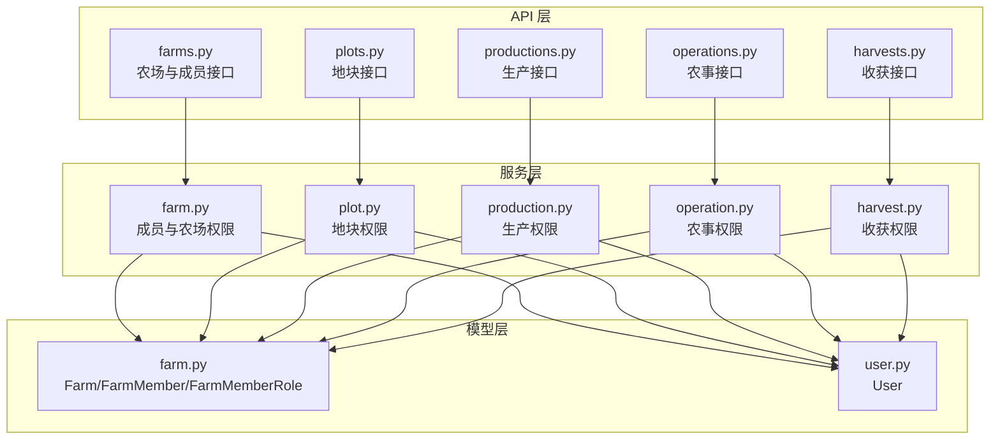
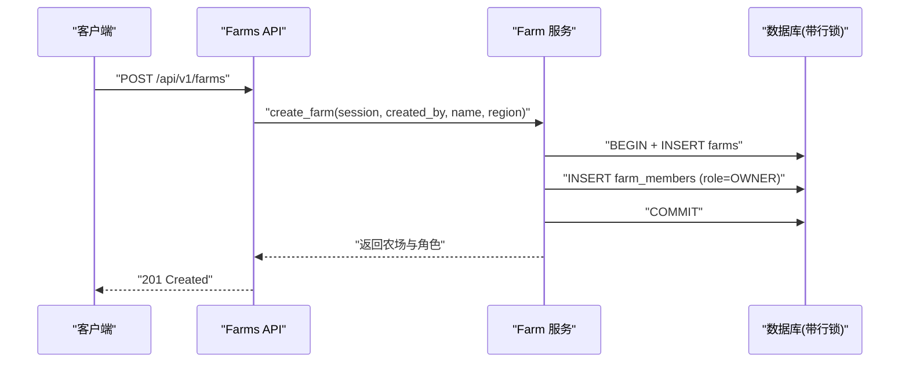
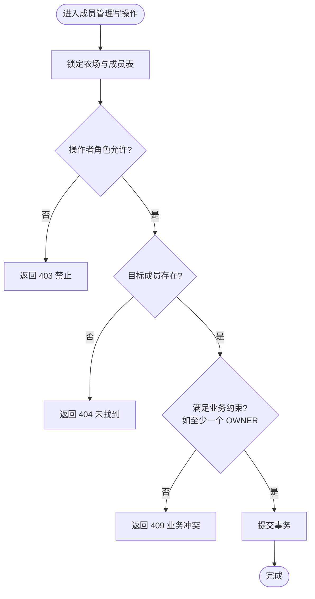
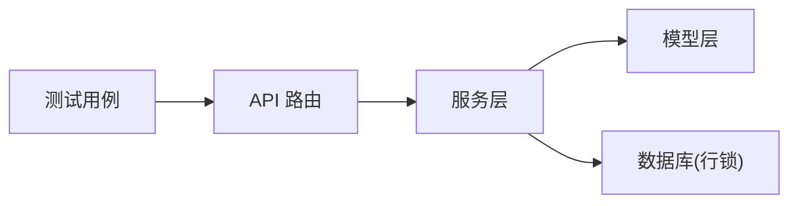

# 权限控制规则

<cite>
**本文引用的文件**
- [apps/api/app/models/farm.py](file://apps/api/app/models/farm.py)
- [apps/api/app/models/user.py](file://apps/api/app/models/user.py)
- [apps/api/app/services/farm.py](file://apps/api/app/services/farm.py)
- [apps/api/app/api/v1/endpoints/farms.py](file://apps/api/app/api/v1/endpoints/farms.py)
- [apps/api/app/services/plot.py](file://apps/api/app/services/plot.py)
- [apps/api/app/services/production.py](file://apps/api/app/services/production.py)
- [apps/api/app/services/harvest.py](file://apps/api/app/services/harvest.py)
- [apps/api/app/services/operation.py](file://apps/api/app/services/operation.py)
- [apps/api/tests/test_farms.py](file://apps/api/tests/test_farms.py)
- [apps/api/tests/test_operations.py](file://apps/api/tests/test_operations.py)
- [apps/api/tests/test_harvests.py](file://apps/api/tests/test_harvests.py)
- [apps/api/tests/test_productions.py](file://apps/api/tests/test_productions.py)
- [docs/mvp/03-business-rules.md](file://docs/mvp/03-business-rules.md)
- [apps/miniapp/src/pages/farms/members.vue](file://apps/miniapp/src/pages/farms/members.vue)
- [apps/miniapp/src/pages/farms/detail.vue](file://apps/miniapp/src/pages/farms/detail.vue)
</cite>

## 目录
1. [简介](#简介)
2. [项目结构](#项目结构)
3. [核心组件](#核心组件)
4. [架构总览](#架构总览)
5. [详细组件分析](#详细组件分析)
6. [依赖关系分析](#依赖关系分析)
7. [性能与一致性](#性能与一致性)
8. [故障排查指南](#故障排查指南)
9. [结论](#结论)
10. [附录：权限矩阵与场景示例](#附录权限矩阵与场景示例)

## 简介
本文件面向 Pocket Farm 系统的权限控制规则，聚焦农场协作管理中的角色定义（OWNER、ADMIN、MEMBER）与权限矩阵，说明成员管理的操作约束与权限验证逻辑，并覆盖对农场、地块、生产、农事、收获等资源的访问与操作权限。文档同时解释后端权限检查机制、事务中校验的重要性，以及前端按钮状态与后端权限验证的关系，并提供具体权限场景示例和异常处理策略。

## 项目结构
Pocket Farm 的权限控制主要分布在以下层次：
- 数据模型层：定义农场、成员、用户等实体及角色枚举。
- 服务层：实现资源级权限校验、业务约束与事务性更新。
- 接口层：路由到服务方法，统一返回响应格式。
- 前端：根据当前用户在农场中的角色进行界面能力展示，但所有关键权限仍在后端校验。

图表来源
- [apps/api/app/api/v1/endpoints/farms.py:1-200](file://apps/api/app/api/v1/endpoints/farms.py#L1-L200)
- [apps/api/app/services/farm.py:1-264](file://apps/api/app/services/farm.py#L1-L264)
- [apps/api/app/services/plot.py:1-223](file://apps/api/app/services/plot.py#L1-L223)
- [apps/api/app/services/production.py:1-446](file://apps/api/app/services/production.py#L1-L446)
- [apps/api/app/services/harvest.py:1-281](file://apps/api/app/services/harvest.py#L1-L281)
- [apps/api/app/services/operation.py:61-95](file://apps/api/app/services/operation.py#L61-L95)
- [apps/api/app/models/farm.py:1-59](file://apps/api/app/models/farm.py#L1-L59)
- [apps/api/app/models/user.py:1-28](file://apps/api/app/models/user.py#L1-L28)

章节来源
- [apps/api/app/models/farm.py:12-15](file://apps/api/app/models/farm.py#L12-L15)
- [apps/api/app/models/user.py:15-21](file://apps/api/app/models/user.py#L15-L21)
- [docs/mvp/03-business-rules.md:46-75](file://docs/mvp/03-business-rules.md#L46-L75)

## 核心组件
- 角色定义：通过枚举明确 OWNER、ADMIN、MEMBER 三种角色。
- 成员管理：创建农场时自动将创建者设为 OWNER；成员列表、添加、修改角色、移除、退出均受严格权限与约束限制。
- 资源访问：所有资源（农场、地块、生产、农事、收获）在读取或写入前都会基于“当前用户是否属于该农场”进行鉴权。
- 权限校验：服务层集中实现权限与业务约束，使用数据库行锁保证并发安全。

章节来源
- [apps/api/app/models/farm.py:12-15](file://apps/api/app/models/farm.py#L12-L15)
- [apps/api/app/services/farm.py:33-53](file://apps/api/app/services/farm.py#L33-L53)
- [apps/api/app/services/farm.py:73-112](file://apps/api/app/services/farm.py#L73-L112)
- [apps/api/app/services/plot.py:42-44](file://apps/api/app/services/plot.py#L42-L44)
- [apps/api/app/services/production.py:141-161](file://apps/api/app/services/production.py#L141-L161)
- [apps/api/app/services/harvest.py:134-178](file://apps/api/app/services/harvest.py#L134-L178)

## 架构总览
权限控制贯穿 API 到服务再到模型的调用链。每个写操作在进入持久化之前，都会先完成身份识别、资源归属校验、角色权限校验与业务约束校验，必要时使用数据库行锁避免竞态条件。

图表来源
- [apps/api/app/api/v1/endpoints/farms.py:78-90](file://apps/api/app/api/v1/endpoints/farms.py#L78-L90)
- [apps/api/app/services/farm.py:33-53](file://apps/api/app/services/farm.py#L33-L53)

## 详细组件分析

### 角色与权限矩阵
- 角色：
  - OWNER：可编辑农场、管理成员、管理地块、开始种养、农事、收获、结束种养。
  - ADMIN：可管理成员、管理地块、开始种养、农事、收获、结束种养。
  - MEMBER：可查看、开始种养、农事、收获、结束种养。
- 成员管理约束：
  - 一个农场可有多个 OWNER，但必须至少保留一位 OWNER。
  - ADMIN 不能操作 OWNER，也不能把成员提升为 OWNER。
  - OWNER 可先将其他成员提升为 OWNER，再降级或退出；不提供单独“转移所有权”接口。
  - ADMIN 和 MEMBER 可自行退出；OWNER 仅在仍有其他 OWNER 时可退出。
  - 上述约束必须在后端事务中校验，不能仅依赖前端按钮状态。

章节来源
- [docs/mvp/03-business-rules.md:22-36](file://docs/mvp/03-business-rules.md#L22-L36)
- [docs/mvp/03-business-rules.md:46-75](file://docs/mvp/03-business-rules.md#L46-L75)

### 成员管理权限与事务校验
- 添加成员：需要 OWNER 或 ADMIN；ADMIN 不可创建 OWNER；重复成员返回冲突；未知用户返回未找到。
- 修改角色：需要 OWNER 或 ADMIN；ADMIN 不可操作 OWNER；若目标为 OWNER 且降为其他角色，需确保农场仍至少有一个 OWNER。
- 移除成员：需要 OWNER 或 ADMIN；同样需满足至少一个 OWNER 的约束。
- 退出农场：MEMBER 可自行退出；OWNER 退出需满足至少一个 OWNER 的条件。
- 并发安全：成员相关写操作使用 with_for_update 锁定农场与成员表，防止并发下越权或违反约束。

图表来源
- [apps/api/app/services/farm.py:73-112](file://apps/api/app/services/farm.py#L73-L112)
- [apps/api/app/services/farm.py:181-264](file://apps/api/app/services/farm.py#L181-L264)

章节来源
- [apps/api/app/services/farm.py:181-264](file://apps/api/app/services/farm.py#L181-L264)
- [apps/api/tests/test_farms.py:108-152](file://apps/api/tests/test_farms.py#L108-L152)
- [apps/api/tests/test_farms.py:154-285](file://apps/api/tests/test_farms.py#L154-L285)

### 地块权限
- 列表与详情：仅农场成员可访问。
- 创建与编辑：需要 OWNER 或 ADMIN；否则返回禁止。
- 并发安全：编辑时使用行锁保护。

章节来源
- [apps/api/app/services/plot.py:57-104](file://apps/api/app/services/plot.py#L57-L104)
- [apps/api/app/services/plot.py:186-223](file://apps/api/app/services/plot.py#L186-L223)

### 生产权限
- 列表与详情：通过生产关联的地块与农场成员关系进行鉴权，非成员无法访问。
- 创建：需具备所在地块所属农场的成员资格；按行业字段进行必填/选填校验。
- 编辑：已结束的生产不可编辑；已有关联农事或收获时，核心字段（地块、物种、开始时间）不可更改。
- 删除：已结束的生产不可删除；有关联农事或收获的生产不可删除。
- 结束：已结束的生产不可再次结束；结束日期不得早于开始日期，也不得早于最近一次农事或收获的业务日期。

章节来源
- [apps/api/app/services/production.py:112-161](file://apps/api/app/services/production.py#L112-L161)
- [apps/api/app/services/production.py:164-217](file://apps/api/app/services/production.py#L164-L217)
- [apps/api/app/services/production.py:220-365](file://apps/api/app/services/production.py#L220-L365)
- [apps/api/app/services/production.py:368-445](file://apps/api/app/services/production.py#L368-L445)
- [apps/api/tests/test_productions.py:287-312](file://apps/api/tests/test_productions.py#L287-L312)

### 农事权限
- 归属：农事首先属于地块；即使没有生产也可记录农事。
- 生产关联：可选；若指定生产，则必须属于当前地块，且生产必须处于 ACTIVE 状态。
- 操作人校验：operatorId 必须属于当前农场；createdBy 由后端从认证信息获取，前端不可传入。
- 类型校验：只能使用 ACTIVE 的操作类型；下架不影响既有记录。

章节来源
- [apps/api/app/services/operation.py:61-95](file://apps/api/app/services/operation.py#L61-L95)
- [apps/api/tests/test_operations.py:222-260](file://apps/api/tests/test_operations.py#L222-L260)
- [apps/api/tests/test_operations.py:264-334](file://apps/api/tests/test_operations.py#L264-L334)

### 收获权限
- 归属：收获必须属于具体生产，不能只针对地块创建。
- 数量与单位：按物种派生单位；重量类单位允许小数，个体类单位必须整数；数量必须大于零。
- 时间边界： harvestedAt 不得晚于当前时间，不早于生产开始时间。
- 操作人校验：operatorId 必须属于生产所属农场；createdBy 由后端从认证信息获取。
- 状态约束：已结束的生产不允许新增或修改收获记录。

章节来源
- [apps/api/app/services/harvest.py:134-178](file://apps/api/app/services/harvest.py#L134-L178)
- [apps/api/app/services/harvest.py:204-281](file://apps/api/app/services/harvest.py#L204-L281)
- [apps/api/tests/test_harvests.py:233-259](file://apps/api/tests/test_harvests.py#L233-L259)

### 前端按钮状态与后端权限验证的关系
- 前端会根据当前用户在农场中的角色（myRole）控制按钮显示与可用性，例如：
  - 只有 OWNER 可编辑农场设置。
  - OWNER 或 ADMIN 可管理成员。
  - 管理员不可操作农场主。
- 但前端能力展示仅为体验优化，所有关键权限与约束在后端强制校验；若前端绕过，后端仍会返回相应错误码。

章节来源
- [apps/miniapp/src/pages/farms/detail.vue:98-103](file://apps/miniapp/src/pages/farms/detail.vue#L98-L103)
- [apps/miniapp/src/pages/farms/members.vue:168-172](file://apps/miniapp/src/pages/farms/members.vue#L168-L172)
- [apps/api/tests/test_farms.py:137-152](file://apps/api/tests/test_farms.py#L137-L152)

## 依赖关系分析
- 服务层强依赖模型层的角色枚举与实体关系，通过 JOIN 查询确保“资源-农场-成员”的一致性。
- 接口层依赖服务层封装的权限与业务逻辑，不直接操作数据库。
- 测试用例覆盖了越权访问、角色限制、业务约束与并发场景，保障权限规则的正确性。

图表来源
- [apps/api/app/api/v1/endpoints/farms.py:1-200](file://apps/api/app/api/v1/endpoints/farms.py#L1-L200)
- [apps/api/app/services/farm.py:1-264](file://apps/api/app/services/farm.py#L1-L264)
- [apps/api/app/models/farm.py:1-59](file://apps/api/app/models/farm.py#L1-L59)
- [apps/api/tests/test_farms.py:108-285](file://apps/api/tests/test_farms.py#L108-L285)

章节来源
- [apps/api/app/services/farm.py:73-112](file://apps/api/app/services/farm.py#L73-L112)
- [apps/api/app/services/plot.py:186-223](file://apps/api/app/services/plot.py#L186-L223)
- [apps/api/app/services/production.py:141-161](file://apps/api/app/services/production.py#L141-L161)
- [apps/api/app/services/harvest.py:134-178](file://apps/api/app/services/harvest.py#L134-L178)

## 性能与一致性
- 行锁：成员管理、生产编辑、收获编辑等写操作使用 with_for_update 锁定相关行，避免并发下的权限与约束冲突。
- 事务：创建农场与初始成员在同一事务中完成，保证原子性。
- 查询优化：列表接口使用分页与排序，减少不必要的数据传输。
- 建议：在高并发场景下，尽量将权限校验与业务约束集中在服务层，避免重复计算；对热点资源（如农场成员表）的写操作保持短事务。

章节来源
- [apps/api/app/services/farm.py:73-91](file://apps/api/app/services/farm.py#L73-L91)
- [apps/api/app/services/farm.py:33-53](file://apps/api/app/services/farm.py#L33-L53)
- [apps/api/app/services/plot.py:198-208](file://apps/api/app/services/plot.py#L198-L208)
- [apps/api/app/services/production.py:240-245](file://apps/api/app/services/production.py#L240-L245)
- [apps/api/app/services/harvest.py:218-223](file://apps/api/app/services/harvest.py#L218-L223)

## 故障排查指南
- 403 禁止：
  - 非成员尝试访问农场资源。
  - 普通成员尝试管理成员或地块。
  - ADMIN 尝试操作 OWNER 或创建 OWNER。
- 404 未找到：
  - 非成员访问农场、地块、生产、收获等资源。
  - 添加成员时手机号对应的用户不存在。
- 409 业务冲突：
  - 重复添加成员。
  - 试图删除最后一个 OWNER。
  - 已结束的生产被编辑或删除。
  - 结束日期早于农事或收获的业务日期。
- 422 校验错误：
  - 必填字段缺失或值不符合行业要求。
  - 数量单位与数值类型不匹配。
  - 时间字段超出允许范围。

章节来源
- [apps/api/app/services/farm.py:21-30](file://apps/api/app/services/farm.py#L21-L30)
- [apps/api/app/services/farm.py:181-264](file://apps/api/app/services/farm.py#L181-L264)
- [apps/api/app/services/production.py:28-37](file://apps/api/app/services/production.py#L28-L37)
- [apps/api/app/services/harvest.py:29-38](file://apps/api/app/services/harvest.py#L29-L38)
- [apps/api/tests/test_farms.py:108-285](file://apps/api/tests/test_farms.py#L108-L285)
- [apps/api/tests/test_operations.py:222-334](file://apps/api/tests/test_operations.py#L222-L334)
- [apps/api/tests/test_harvests.py:233-259](file://apps/api/tests/test_harvests.py#L233-L259)

## 结论
Pocket Farm 的权限控制以“角色+资源归属”为核心，通过服务层集中校验与数据库行锁保证一致性与安全性。前端仅做能力展示，真正的权限与约束在后端强制执行。成员管理、地块、生产、农事、收获等模块均遵循统一的鉴权模式，并通过测试用例覆盖常见越权与业务冲突场景。建议在后续扩展中继续保持这一模式，确保新增资源与功能也遵循相同的权限与事务规范。

## 附录：权限矩阵与场景示例

### 权限矩阵
- 农场：
  - OWNER：编辑农场。
  - ADMIN/MEMBER：无编辑权限。
- 成员管理：
  - OWNER：可管理所有成员（包括 OWNER、ADMIN、MEMBER）。
  - ADMIN：可管理 ADMIN、MEMBER，不可操作 OWNER，不可创建 OWNER。
  - MEMBER：仅可退出农场。
- 地块：
  - OWNER/ADMIN：创建与编辑。
  - MEMBER：查看。
- 生产：
  - 所有成员：创建、编辑（受约束）、结束。
  - 已结束：不可编辑/删除。
- 农事：
  - 所有成员：创建与编辑（受约束），operatorId 必须属于农场。
- 收获：
  - 所有成员：创建与编辑（受约束），operatorId 必须属于农场。

章节来源
- [docs/mvp/03-business-rules.md:46-75](file://docs/mvp/03-business-rules.md#L46-L75)
- [apps/api/app/services/farm.py:94-112](file://apps/api/app/services/farm.py#L94-L112)
- [apps/api/app/services/plot.py:42-44](file://apps/api/app/services/plot.py#L42-L44)
- [apps/api/app/services/production.py:220-365](file://apps/api/app/services/production.py#L220-L365)
- [apps/api/app/services/harvest.py:134-178](file://apps/api/app/services/harvest.py#L134-L178)

### 典型场景
- 场景一：非成员尝试访问农场详情
  - 行为：返回 404 NOT_FOUND。
  - 原因：服务层通过“农场-成员”关系过滤，非成员视为未找到。
- 场景二：ADMIN 尝试编辑农场
  - 行为：返回 403 FORBIDDEN。
  - 原因：仅 OWNER 可编辑农场信息。
- 场景三：ADMIN 尝试创建 OWNER
  - 行为：返回 403 FORBIDDEN。
  - 原因：ADMIN 不能创建 OWNER。
- 场景四：尝试删除最后一个 OWNER
  - 行为：返回 409 BUSINESS_CONFLICT。
  - 原因：农场必须至少保留一位 OWNER。
- 场景五：成员退出农场
  - 行为：MEMBER 可成功退出；OWNER 退出需满足至少一个 OWNER。
- 场景六：生产结束后尝试新增收获
  - 行为：返回 409 BUSINESS_CONFLICT。
  - 原因：已结束的生产不允许变更收获记录。
- 场景七：农事 operatorId 不属于农场
  - 行为：返回 422 VALIDATION_ERROR。
  - 原因：operatorId 必须属于生产所属农场。

章节来源
- [apps/api/tests/test_farms.py:108-152](file://apps/api/tests/test_farms.py#L108-L152)
- [apps/api/tests/test_farms.py:154-285](file://apps/api/tests/test_farms.py#L154-L285)
- [apps/api/tests/test_operations.py:264-334](file://apps/api/tests/test_operations.py#L264-L334)
- [apps/api/tests/test_harvests.py:233-259](file://apps/api/tests/test_harvests.py#L233-L259)
- [apps/api/tests/test_productions.py:287-312](file://apps/api/tests/test_productions.py#L287-L312)