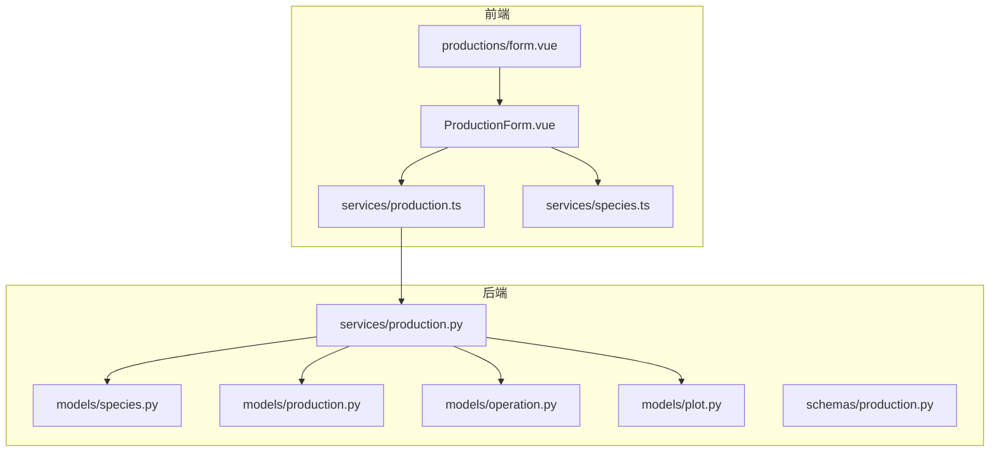
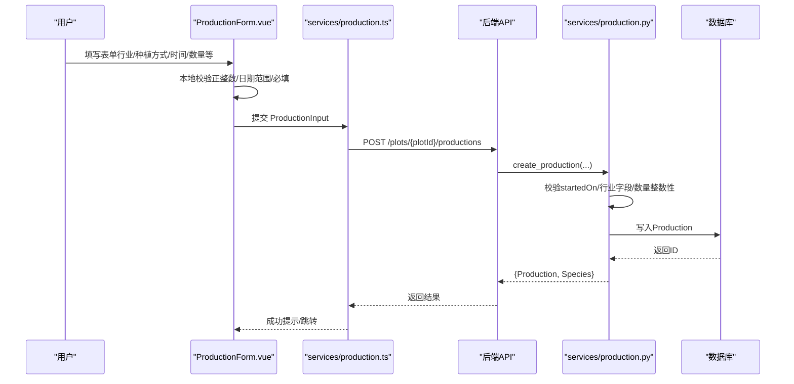
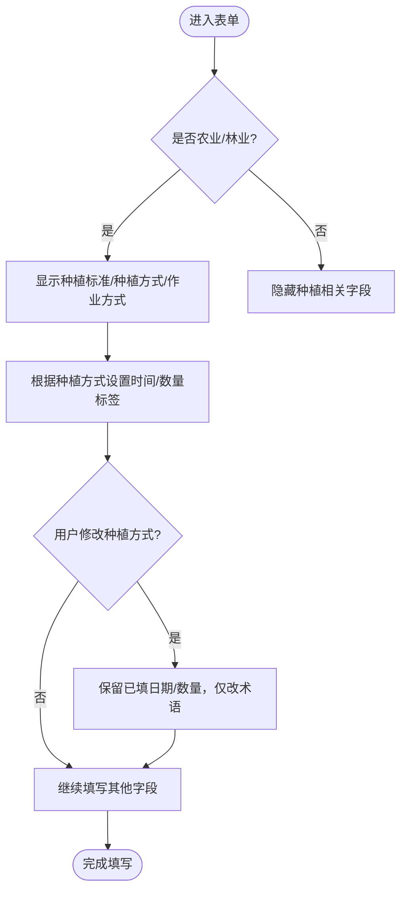
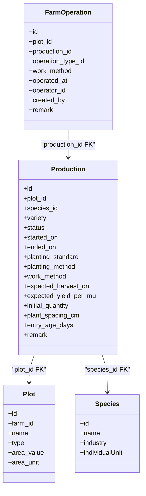

# 农业林业生产流程

<cite>
**本文引用的文件**
- [production.py](file://apps/api/app/models/production.py)
- [production_schema.py](file://apps/api/app/schemas/production.py)
- [production_service.py](file://apps/api/app/services/production.py)
- [species_model.py](file://apps/api/app/models/species.py)
- [operation_model.py](file://apps/api/app/models/operation.py)
- [plot_model.py](file://apps/api/app/models/plot.py)
- [ProductionForm.vue](file://apps/miniapp/src/components/ProductionForm.vue)
- [production_page_form.vue](file://apps/miniapp/src/pages/productions/form.vue)
- [production_service_ts.ts](file://apps/miniapp/src/services/production.ts)
- [species_service_ts.ts](file://apps/miniapp/src/services/species.ts)
- [业务规则文档.md](file://docs/mvp/03-business-rules.md)
</cite>

## 目录
1. [引言](#引言)
2. [项目结构](#项目结构)
3. [核心组件](#核心组件)
4. [架构总览](#架构总览)
5. [详细组件分析](#详细组件分析)
6. [依赖关系分析](#依赖关系分析)
7. [性能考虑](#性能考虑)
8. [故障排查指南](#故障排查指南)
9. [结论](#结论)
10. [附录](#附录)

## 引言
本文件面向 Pocket Farm 系统的农业与林业生产流程，聚焦以下目标：
- 说明农业与林业统一使用 Species 的固定个体单位，不提供“单位选择器”的设计原则。
- 解释种植方式（移栽 vs 播种）对时间字段和数量字段的影响，以及切换种植方式时不清空已填数据的业务规则。
- 明确农业必填字段、选填字段；林业在农业基础上增加数量要求，但不提供预计亩产。
- 给出完整的表单验证规则与前端术语展示逻辑。

## 项目结构
后端采用领域模型 + Pydantic Schema + Service 的分层设计：
- 模型层：定义生产记录、物种、地块、作业等数据表结构与枚举。
- Schema 层：定义请求/响应校验与序列化别名。
- 服务层：实现创建、更新、结束等业务校验与事务操作。

前端基于 Vue 组件化表单：
- ProductionForm 负责按行业与种植方式动态渲染字段、术语与校验。
- productions/form.vue 页面负责加载地块、组装提交参数并调用后端接口。

图表来源
- [ProductionForm.vue:1-613](file://apps/miniapp/src/components/ProductionForm.vue#L1-L613)
- [production_page_form.vue:1-181](file://apps/miniapp/src/pages/productions/form.vue#L1-L181)
- [production_service_ts.ts:1-121](file://apps/miniapp/src/services/production.ts#L1-L121)
- [species_service_ts.ts:1-34](file://apps/miniapp/src/services/species.ts#L1-L34)
- [production_service.py:1-446](file://apps/api/app/services/production.py#L1-L446)
- [production_schema.py:1-198](file://apps/api/app/schemas/production.py#L1-L198)
- [production_model.py:1-79](file://apps/api/app/models/production.py#L1-L79)
- [species_model.py:1-35](file://apps/api/app/models/species.py#L1-L35)
- [operation_model.py:1-80](file://apps/api/app/models/operation.py#L1-L80)
- [plot_model.py:1-54](file://apps/api/app/models/plot.py#L1-L54)

章节来源
- [production_model.py:1-79](file://apps/api/app/models/production.py#L1-L79)
- [production_schema.py:1-198](file://apps/api/app/schemas/production.py#L1-L198)
- [production_service.py:1-446](file://apps/api/app/services/production.py#L1-L446)
- [species_model.py:1-35](file://apps/api/app/models/species.py#L1-L35)
- [operation_model.py:1-80](file://apps/api/app/models/operation.py#L1-L80)
- [plot_model.py:1-54](file://apps/api/app/models/plot.py#L1-L54)
- [ProductionForm.vue:1-613](file://apps/miniapp/src/components/ProductionForm.vue#L1-L613)
- [production_page_form.vue:1-181](file://apps/miniapp/src/pages/productions/form.vue#L1-L181)
- [production_service_ts.ts:1-121](file://apps/miniapp/src/services/production.ts#L1-L121)
- [species_service_ts.ts:1-34](file://apps/miniapp/src/services/species.ts#L1-L34)
- [业务规则文档.md:96-133](file://docs/mvp/03-business-rules.md#L96-L133)

## 核心组件
- 生产记录模型：包含种植标准、种植方式、作业方式、预计采收时间、预计亩产、初始数量、株间距、入栏日龄等字段。
- 物种模型：定义行业与固定个体单位，作为所有行业的统一计量基础。
- 生产服务：实现跨行业校验、创建/更新/结束生产记录的完整业务规则。
- 前端表单：根据行业与种植方式动态展示术语、必填项与数值校验。

章节来源
- [production_model.py:43-79](file://apps/api/app/models/production.py#L43-L79)
- [species_model.py:12-35](file://apps/api/app/models/species.py#L12-L35)
- [production_service.py:63-103](file://apps/api/app/services/production.py#L63-L103)
- [ProductionForm.vue:201-293](file://apps/miniapp/src/components/ProductionForm.vue#L201-L293)

## 架构总览
下图展示了从前端到后端的端到端流程，包括字段映射、校验与落库。

图表来源
- [ProductionForm.vue:418-469](file://apps/miniapp/src/components/ProductionForm.vue#L418-L469)
- [production_service_ts.ts:74-80](file://apps/miniapp/src/services/production.ts#L74-L80)
- [production_service.py:164-217](file://apps/api/app/services/production.py#L164-L217)

## 详细组件分析

### 统一固定个体单位的设计原则
- 设计原则：农业与林业均使用 Species.individual_unit 作为固定单位，不在前端提供“单位选择器”。这保证了数据一致性与统计口径统一。
- 前端体现：表单中的数量字段单位由 species.individualUnit 决定，如“株”“头”“羽”等。
- 后端体现：创建/更新时对 initialQuantity 进行整数性校验，确保与所选物种单位匹配。

章节来源
- [species_model.py:19-35](file://apps/api/app/models/species.py#L19-L35)
- [production_service.py:75-77](file://apps/api/app/services/production.py#L75-L77)
- [ProductionForm.vue:97-115](file://apps/miniapp/src/components/ProductionForm.vue#L97-L115)

### 种植方式对时间与数量的影响及术语切换规则
- 术语切换：当种植方式为 TRANSPLANT 时，时间字段显示为“移栽时间”，数量字段显示为“移栽数量”；当为 DIRECT_SEEDING 时，显示为“播种时间”“播种数量”。
- 业务规则：切换种植方式仅改变术语，不清空已填日期或数量。
- 前端实现：通过计算属性动态生成 startedOnLabel 与 initialQuantityLabel，并在监听种植方式变化时保留已有值。

图表来源
- [ProductionForm.vue:269-293](file://apps/miniapp/src/components/ProductionForm.vue#L269-L293)
- [ProductionForm.vue:367-379](file://apps/miniapp/src/components/ProductionForm.vue#L367-L379)
- [业务规则文档.md:115-133](file://docs/mvp/03-business-rules.md#L115-L133)

章节来源
- [ProductionForm.vue:269-293](file://apps/miniapp/src/components/ProductionForm.vue#L269-L293)
- [ProductionForm.vue:367-379](file://apps/miniapp/src/components/ProductionForm.vue#L367-L379)
- [业务规则文档.md:115-133](file://docs/mvp/03-business-rules.md#L115-L133)

### 农业必填与选填字段
- 必填字段：
  - speciesId：种类标识
  - plotId：地块标识
  - plantingStandard：种植标准（普通/绿色/有机）
  - plantingMethod：种植方式（移栽/直播）
  - startedOn：根据种植方式显示为“移栽时间”或“播种时间”
  - workMethod：作业方式（人工/机械）
- 选填字段：
  - variety：品种
  - expectedHarvestOn：预计采收时间
  - expectedYieldPerMu：预计亩产（仅农业，单位固定“公斤/亩”）
  - plantSpacingCm：株间距（单位固定“厘米”）
  - remark：备注
- 前端校验：
  - 日期范围：预计采收时间需不早于开始时间
  - 数值校验：预计亩产、株间距若填写则必须大于 0
  - 必填校验：上述农业必填项缺失将阻止提交

章节来源
- [production_schema.py:15-70](file://apps/api/app/schemas/production.py#L15-L70)
- [production_service.py:78-86](file://apps/api/app/services/production.py#L78-L86)
- [ProductionForm.vue:127-156](file://apps/miniapp/src/components/ProductionForm.vue#L127-L156)
- [ProductionForm.vue:418-469](file://apps/miniapp/src/components/ProductionForm.vue#L418-L469)

### 林业在农业基础上的差异
- 新增必填：initialQuantity（即“移栽数量”或“播种数量”，取决于种植方式），单位为 Species.individualUnit。
- 不提供的字段：expectedYieldPerMu（林业不展示也不保存预计亩产）。
- 其他字段与农业一致：种植标准、种植方式、作业方式、预计采收时间、株间距等。

章节来源
- [production_service.py:83-86](file://apps/api/app/services/production.py#L83-L86)
- [ProductionForm.vue:107-115](file://apps/miniapp/src/components/ProductionForm.vue#L107-L115)
- [ProductionForm.vue:140-147](file://apps/miniapp/src/components/ProductionForm.vue#L140-L147)
- [业务规则文档.md:128-133](file://docs/mvp/03-business-rules.md#L128-L133)

### 表单验证规则汇总
- 通用校验：
  - startedOn 不得晚于今天
  - endedOn 不得晚于今天且不得早于 startedOn
  - initialQuantity 必须为正整数（与物种单位匹配）
  - expectedYieldPerMu、plantSpacingCm 若填写则必须大于 0
- 行业特定校验：
  - 农业/林业：plantingStandard、plantingMethod、workMethod 必填；entryAgeDays 禁止
  - 林业：initialQuantity 必填；expectedYieldPerMu 禁止
  - 牧业：initialQuantity、entryAgeDays 必填；workMethod 禁止
  - 渔业：initialQuantity、workMethod 必填；plantingStandard、plantingMethod、expectedHarvestOn、expectedYieldPerMu、plantSpacingCm 禁止
- 前端交互：
  - 提交前进行本地校验，错误以 Toast 提示
  - 提交成功后清空脏标记并跳转

章节来源
- [production_service.py:44-103](file://apps/api/app/services/production.py#L44-L103)
- [production_service.py:403-445](file://apps/api/app/services/production.py#L403-L445)
- [ProductionForm.vue:418-469](file://apps/miniapp/src/components/ProductionForm.vue#L418-L469)
- [业务规则文档.md:580-593](file://docs/mvp/03-business-rules.md#L580-L593)

### 前端术语展示逻辑
- 行业术语：
  - AGRICULTURE/FORESTRY：开始种植、采收、结束种植
  - LIVESTOCK：开始养殖、出栏、结束养殖
  - FISHERY：开始养殖、捕捞、结束养殖
- 字段术语：
  - startedOn：根据行业与种植方式显示为“移栽时间”“播种时间”“入栏时间”“养殖时间”
  - initialQuantity：根据行业与种植方式显示为“移栽数量”“播种数量”“入栏数量”“养殖数量”
  - 单位：由 species.individualUnit 决定，如“株”“头”“羽”等
- 实现要点：
  - 使用 computed 属性动态生成标签
  - 监听种植方式变化仅更新术语，不清空数据
  - 通过 FixedUnitNumberField 组件统一数值输入与单位展示

章节来源
- [ProductionForm.vue:201-219](file://apps/miniapp/src/components/ProductionForm.vue#L201-L219)
- [ProductionForm.vue:269-293](file://apps/miniapp/src/components/ProductionForm.vue#L269-L293)
- [业务规则文档.md:198-228](file://docs/mvp/03-business-rules.md#L198-L228)

## 依赖关系分析
- 模型依赖：
  - Production 依赖 Plot、Species，并通过外键关联
  - FarmOperation 可关联 Production，用于农事追溯
- 服务依赖：
  - 生产服务依赖 Plot、Species、FarmOperation、HarvestRecord 进行权限与一致性校验
- 前端依赖：
  - ProductionForm 依赖 services/production.ts 与 services/species.ts 的类型与服务方法
  - productions/form.vue 负责页面级数据加载与提交

图表来源
- [production_model.py:43-79](file://apps/api/app/models/production.py#L43-L79)
- [plot_model.py:31-54](file://apps/api/app/models/plot.py#L31-L54)
- [species_model.py:27-35](file://apps/api/app/models/species.py#L27-L35)
- [operation_model.py:37-80](file://apps/api/app/models/operation.py#L37-L80)

章节来源
- [production_model.py:43-79](file://apps/api/app/models/production.py#L43-L79)
- [plot_model.py:31-54](file://apps/api/app/models/plot.py#L31-L54)
- [species_model.py:27-35](file://apps/api/app/models/species.py#L27-L35)
- [operation_model.py:37-80](file://apps/api/app/models/operation.py#L37-L80)

## 性能考虑
- 数据库查询：
  - 列表查询使用分页与排序，减少数据传输量
  - 更新/删除前计数检查避免全表扫描
- 前端交互：
  - 本地校验减少无效请求
  - 懒加载与条件渲染提升首屏性能

[本节为通用指导，无需具体文件引用]

## 故障排查指南
- 常见错误：
  - startedOn 晚于今天：检查系统时区与日期选择器
  - initialQuantity 非整数：确认单位与输入格式
  - 林业填写了预计亩产：移除该字段
  - 农业/林业未填写作业方式：补填 workMethod
- 定位步骤：
  - 查看前端 Toast 提示信息
  - 检查后端返回的错误码与消息
  - 核对数据库约束与业务规则

章节来源
- [production_service.py:44-103](file://apps/api/app/services/production.py#L44-L103)
- [ProductionForm.vue:418-469](file://apps/miniapp/src/components/ProductionForm.vue#L418-L469)

## 结论
Pocket Farm 通过统一的 Species 固定个体单位与严格的行业字段校验，实现了农业与林业生产流程的一致性与可扩展性。种植方式的术语切换不影响已填数据，提升了用户体验。前端与后端协同确保了数据完整性与业务规则的正确执行。

[本节为总结性内容，无需具体文件引用]

## 附录
- 关键术语对照：
  - 农业/林业：开始种植、采收、结束种植
  - 牧业：开始养殖、出栏、结束养殖
  - 渔业：开始养殖、捕捞、结束养殖
- 字段映射：
  - startedOn → 移栽时间/播种时间/入栏时间/养殖时间
  - initialQuantity → 移栽数量/播种数量/入栏数量/养殖数量
  - unit → 由 species.individualUnit 决定

[本节为补充信息，无需具体文件引用]