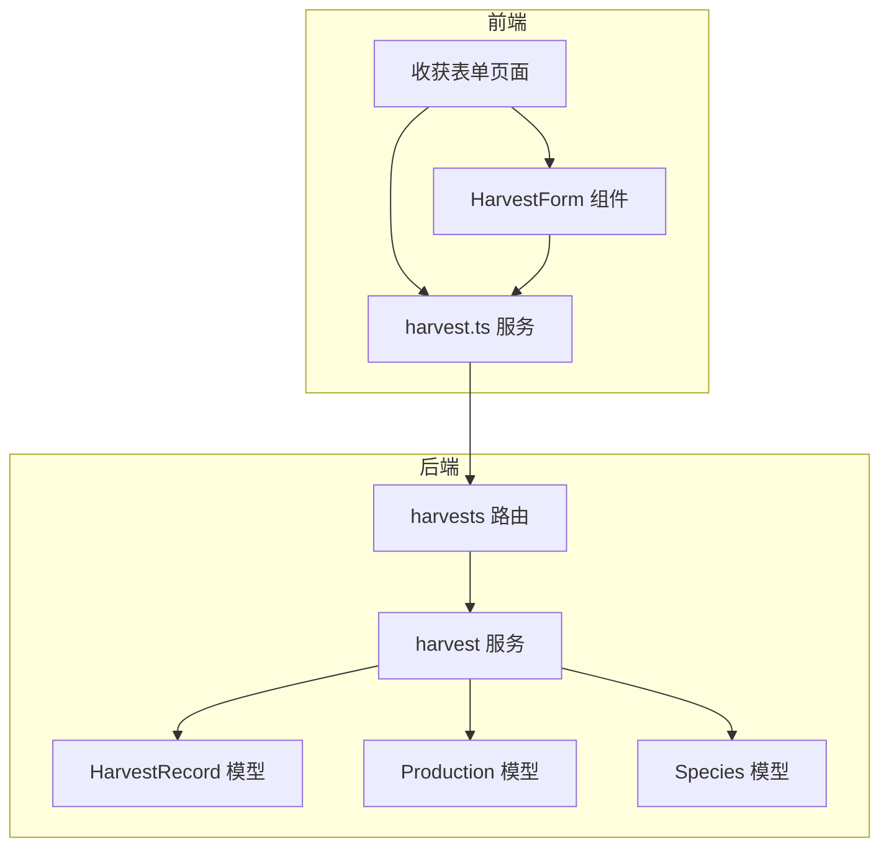
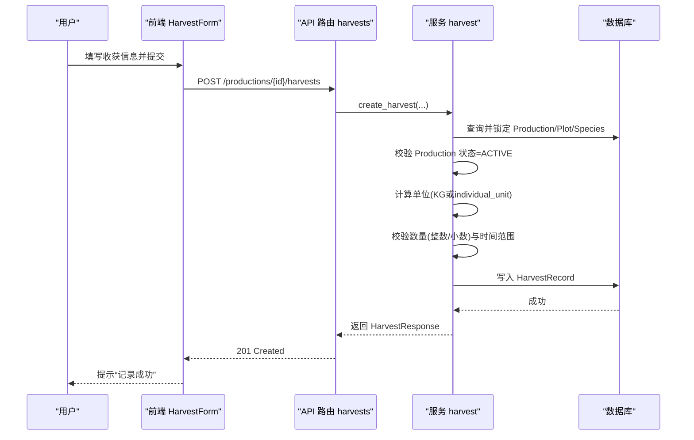
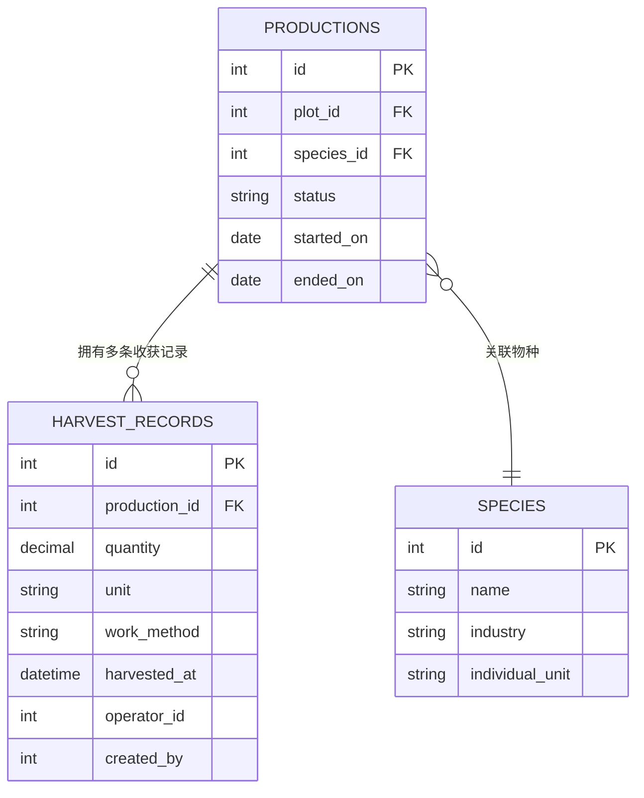
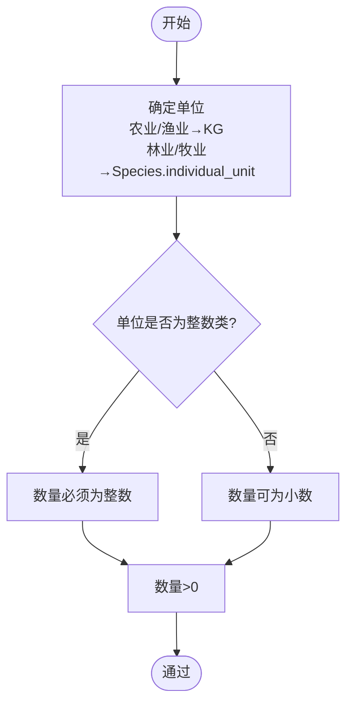
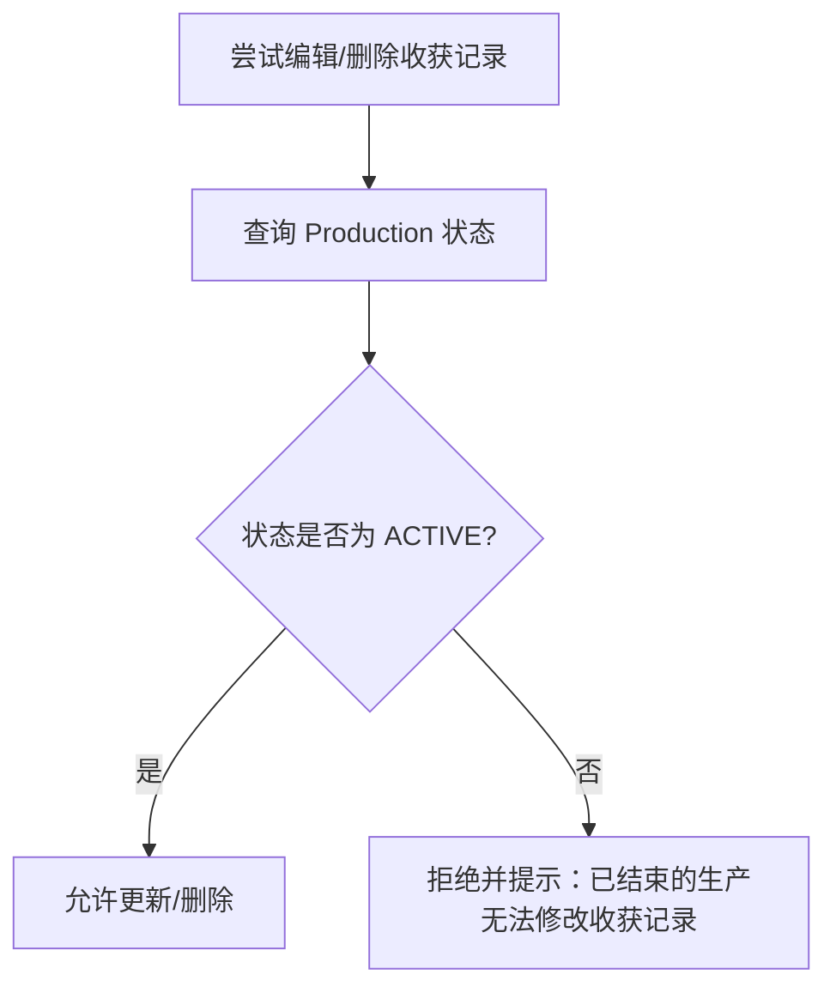
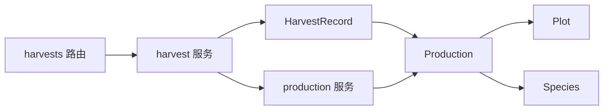

# 收获管理流程

<cite>
**本文引用的文件**
- [harvest.py](file://apps/api/app/models/harvest.py)
- [production.py](file://apps/api/app/models/production.py)
- [species.py](file://apps/api/app/models/species.py)
- [harvest_schema.py](file://apps/api/app/schemas/harvest.py)
- [harvest_service.py](file://apps/api/app/services/harvest.py)
- [production_service.py](file://apps/api/app/services/production.py)
- [harvests_endpoint.py](file://apps/api/app/api/v1/endpoints/harvests.py)
- [harvest_form_page.vue](file://apps/miniapp/src/pages/harvests/form.vue)
- [HarvestForm.vue](file://apps/miniapp/src/components/HarvestForm.vue)
- [harvest_service_ts.ts](file://apps/miniapp/src/services/harvest.ts)
</cite>

## 目录
1. [简介](#简介)
2. [项目结构](#项目结构)
3. [核心组件](#核心组件)
4. [架构总览](#架构总览)
5. [详细组件分析](#详细组件分析)
6. [依赖关系分析](#依赖关系分析)
7. [性能考虑](#性能考虑)
8. [故障排查指南](#故障排查指南)
9. [结论](#结论)

## 简介
本文件面向 Pocket Farm 系统的“收获管理”能力，围绕 HarvestRecord 与 Production 的业务约束、不同行业的收获术语与数量单位规则、一次 Production 可多次 Harvest 的分批次记录方式、以及纠错与锁定策略进行系统化说明。文档同时覆盖前后端关键实现位置，便于读者快速定位代码并理解业务流转。

## 项目结构
收获相关的关键代码分布在后端 API（模型、Schema、服务、路由）与前端小程序（页面、表单组件、服务层）中：
- 后端
  - 数据模型：HarvestRecord、Production、Species
  - 请求/响应 Schema：Create/Update/Response/Page
  - 业务服务：创建、查询、更新、删除收获记录；生产结束校验
  - API 路由：按 Production 或 Plot 维度列出收获；创建/编辑/删除收获
- 前端
  - 页面：收获表单页，支持选择具体 Production，展示行业化文案
  - 组件：HarvestForm 负责字段校验、单位提示、日期时间输入、操作人选择
  - 服务：调用后端 REST 接口，封装类型定义

图表来源
- [harvests_endpoint.py:66-163](file://apps/api/app/api/v1/endpoints/harvests.py#L66-L163)
- [harvest_service.py:86-281](file://apps/api/app/services/harvest.py#L86-L281)
- [harvest.py:13-48](file://apps/api/app/models/harvest.py#L13-L48)
- [production.py:13-79](file://apps/api/app/models/production.py#L13-L79)
- [species.py:12-35](file://apps/api/app/models/species.py#L12-L35)
- [HarvestForm.vue:105-173](file://apps/miniapp/src/components/HarvestForm.vue#L105-L173)
- [harvest_form_page.vue:12-82](file://apps/miniapp/src/pages/harvests/form.vue#L12-L82)

章节来源
- [harvests_endpoint.py:66-163](file://apps/api/app/api/v1/endpoints/harvests.py#L66-L163)
- [harvest_service.py:86-281](file://apps/api/app/services/harvest.py#L86-L281)
- [harvest.py:13-48](file://apps/api/app/models/harvest.py#L13-L48)
- [production.py:13-79](file://apps/api/app/models/production.py#L13-L79)
- [species.py:12-35](file://apps/api/app/models/species.py#L12-L35)
- [HarvestForm.vue:105-173](file://apps/miniapp/src/components/HarvestForm.vue#L105-L173)
- [harvest_form_page.vue:12-82](file://apps/miniapp/src/pages/harvests/form.vue#L12-L82)

## 核心组件
- HarvestRecord：绑定到具体 Production，记录采收/捕捞/出栏的数量、单位、作业方式、时间、操作人等。
- Production：代表一次种养过程，包含状态（ACTIVE/ENDED）、开始/结束日期、所属地块、物种等。
- Species：定义行业与个体单位，决定收获时的默认单位与是否允许小数。
- 服务层：统一校验数量、单位、时间、权限，并执行创建/更新/删除；在结束生产时校验不能早于最近一次收获时间。
- 前端：根据行业动态显示“采收/捕捞/出栏”，自动确定单位与整数/小数限制，确保用户输入合法。

章节来源
- [harvest.py:13-48](file://apps/api/app/models/harvest.py#L13-L48)
- [production.py:13-79](file://apps/api/app/models/production.py#L13-L79)
- [species.py:12-35](file://apps/api/app/models/species.py#L12-L35)
- [harvest_service.py:45-69](file://apps/api/app/services/harvest.py#L45-L69)
- [HarvestForm.vue:149-173](file://apps/miniapp/src/components/HarvestForm.vue#L149-L173)

## 架构总览
以下序列图展示了“为某次 Production 记录一次收获”的端到端流程，包括权限校验、数量与单位校验、时间校验、落库与返回。

图表来源
- [harvests_endpoint.py:86-109](file://apps/api/app/api/v1/endpoints/harvests.py#L86-L109)
- [harvest_service.py:134-178](file://apps/api/app/services/harvest.py#L134-L178)
- [production_service.py:141-161](file://apps/api/app/services/production.py#L141-L161)

## 详细组件分析

### 业务约束：HarvestRecord 必须属于具体 Production
- 数据模型层面：HarvestRecord 通过 production_id 外键关联到 Productions，禁止直接针对 Plot 创建收获记录。
- 查询层面：提供按 Production 和按 Plot 两个维度的列表接口，但创建/更新/删除均基于 Production 上下文。
- 权限层面：所有操作需验证当前用户对所属 Farm 的成员身份，确保跨农场不可篡改。

图表来源
- [harvest.py:13-48](file://apps/api/app/models/harvest.py#L13-L48)
- [production.py:43-79](file://apps/api/app/models/production.py#L43-L79)
- [species.py:27-35](file://apps/api/app/models/species.py#L27-L35)

章节来源
- [harvest.py:13-48](file://apps/api/app/models/harvest.py#L13-L48)
- [harvests_endpoint.py:66-129](file://apps/api/app/api/v1/endpoints/harvests.py#L66-L129)
- [harvest_service.py:86-131](file://apps/api/app/services/harvest.py#L86-L131)

### 行业术语差异：农业/林业用“采收”，渔业用“捕捞”，牧业用“出栏”
- 前端根据 Production.industry 动态切换文案：
  - 农业、林业：使用“采收”
  - 渔业：使用“捕捞”
  - 牧业：使用“出栏”
- 该逻辑体现在表单页与表单组件中，用于标题、字段标签与提示信息。

章节来源
- [harvest_form_page.vue:78-82](file://apps/miniapp/src/pages/harvests/form.vue#L78-L82)
- [HarvestForm.vue:149-159](file://apps/miniapp/src/components/HarvestForm.vue#L149-L159)

### 数量字段与单位规则：KG 允许小数，其他单位必须为整数
- 单位来源：
  - 农业、渔业：固定使用 KG（重量），允许小数。
  - 林业、牧业：使用 Species.individual_unit（如 HEAD/FEATHER/PIECE/PLANT/TAIL），必须为整数。
- 后端校验：
  - 若单位为整数类集合，则要求数量为整数；否则允许小数。
  - 数量必须大于 0。
- 前端校验：
  - 根据单位动态提示“公斤可填小数”或“按种类固定为某单位，请填写整数”。
  - 对非 KG 单位强制匹配整数正则。

图表来源
- [harvest_service.py:18-55](file://apps/api/app/services/harvest.py#L18-L55)
- [HarvestForm.vue:161-173](file://apps/miniapp/src/components/HarvestForm.vue#L161-L173)

章节来源
- [harvest_service.py:18-55](file://apps/api/app/services/harvest.py#L18-L55)
- [HarvestForm.vue:161-173](file://apps/miniapp/src/components/HarvestForm.vue#L161-L173)

### 一次 Production 可多次 Harvest：分批次采收记录
- 设计要点：
  - HarvestRecord 与 Production 为一对多关系，同一 Production 可有多条收获记录。
  - 每次记录独立的时间、数量、等级、备注等，适合分批次采收/捕捞/出栏场景。
- 前端支持：
  - 在 Production 详情页可查看其收获记录列表，支持新增、编辑、删除（受状态约束）。
  - 表单页明确提示“保存后不会自动结束种养”，强调记录不改变生产状态。

章节来源
- [harvest.py:13-48](file://apps/api/app/models/harvest.py#L13-L48)
- [harvests_endpoint.py:66-129](file://apps/api/app/api/v1/endpoints/harvests.py#L66-L129)
- [harvest_form_page.vue:12-16](file://apps/miniapp/src/pages/harvests/form.vue#L12-L16)

### 收获不会结束种养：只有明确执行结束操作才会改变 Production 状态
- 业务规则：
  - 创建/更新/删除收获记录仅影响收获表，不修改 Production 状态。
  - 结束生产由专门的“结束生产”流程完成，且结束日期不得早于最近一次收获时间。
- 前端提示：
  - 表单页描述明确“保存后不会自动结束种养”。

章节来源
- [harvest_service.py:134-178](file://apps/api/app/services/harvest.py#L134-L178)
- [production_service.py:403-445](file://apps/api/app/services/production.py#L403-L445)
- [harvest_form_page.vue:12-16](file://apps/miniapp/src/pages/harvests/form.vue#L12-L16)

### 纠错规则：ACTIVE 可编辑删除，ENDED 后锁定
- 后端保护：
  - 对已结束的 Production（ENDED），任何对收获记录的变更都会拒绝，并返回业务冲突错误。
- 前端保护：
  - 加载编辑页面时，若发现对应 Production 已结束，将提示无法编辑并阻止提交。

图表来源
- [harvest_service.py:66-69](file://apps/api/app/services/harvest.py#L66-L69)
- [harvest_service.py:204-281](file://apps/api/app/services/harvest.py#L204-L281)
- [harvest_form_page.vue:126-135](file://apps/miniapp/src/pages/harvests/form.vue#L126-L135)

章节来源
- [harvest_service.py:66-69](file://apps/api/app/services/harvest.py#L66-L69)
- [harvest_service.py:204-281](file://apps/api/app/services/harvest.py#L204-L281)
- [harvest_form_page.vue:126-135](file://apps/miniapp/src/pages/harvests/form.vue#L126-L135)

## 依赖关系分析
- 模型依赖
  - HarvestRecord 依赖 Production（外键）与 User（操作人/创建者）。
  - Production 依赖 Plot 与 Species。
  - Species 决定行业与个体单位，间接决定收获单位与数值格式。
- 服务依赖
  - harvest 服务依赖 production 服务获取 Production/Plot/Species 上下文与成员权限。
  - production 服务在结束生产时读取 HarvestRecord 的最大 harvested_at，保证结束日期不早于最近收获。
- API 路由
  - 路由层只做参数绑定与响应包装，核心校验与事务在 service 层。

图表来源
- [harvest.py:13-48](file://apps/api/app/models/harvest.py#L13-L48)
- [production.py:43-79](file://apps/api/app/models/production.py#L43-L79)
- [species.py:27-35](file://apps/api/app/models/species.py#L27-L35)
- [harvest_service.py:134-178](file://apps/api/app/services/harvest.py#L134-L178)
- [production_service.py:403-445](file://apps/api/app/services/production.py#L403-L445)
- [harvests_endpoint.py:66-163](file://apps/api/app/api/v1/endpoints/harvests.py#L66-L163)

章节来源
- [harvest_service.py:134-178](file://apps/api/app/services/harvest.py#L134-L178)
- [production_service.py:403-445](file://apps/api/app/services/production.py#L403-L445)
- [harvests_endpoint.py:66-163](file://apps/api/app/api/v1/endpoints/harvests.py#L66-L163)

## 性能考虑
- 列表查询分页：后端对收获记录列表采用分页查询，避免一次性加载过多数据。
- 并发安全：创建/更新/删除收获记录时对 Production 加锁（行级锁），防止并发修改导致的状态不一致。
- 索引优化：HarvestRecord 的 production_id、operator_id 建立索引，提升按生产与操作人查询效率。

章节来源
- [harvests_endpoint.py:66-129](file://apps/api/app/api/v1/endpoints/harvests.py#L66-L129)
- [harvest_service.py:147-152](file://apps/api/app/services/harvest.py#L147-L152)
- [harvest.py:16-32](file://apps/api/app/models/harvest.py#L16-L32)

## 故障排查指南
- 常见错误与原因
  - 数量非法：小于等于 0，或在整数单位下出现小数。
  - 时间非法：harvestedAt 晚于当前时间，或早于 Production.startedOn。
  - 权限问题：operatorId 不属于该 Production 所属农场。
  - 状态锁定：Production 已结束时尝试编辑/删除收获记录。
- 定位建议
  - 检查前端表单的单位与数值校验提示是否正确触发。
  - 查看后端返回的错误码与消息，确认是校验错误还是业务冲突。
  - 核对 Production 状态与结束日期，确认是否已执行结束操作。

章节来源
- [harvest_service.py:45-69](file://apps/api/app/services/harvest.py#L45-L69)
- [harvest_service.py:204-281](file://apps/api/app/services/harvest.py#L204-L281)
- [HarvestForm.vue:248-287](file://apps/miniapp/src/components/HarvestForm.vue#L248-L287)

## 结论
Pocket Farm 的收获管理以 Production 为核心，严格约束 HarvestRecord 必须归属具体生产批次；针对不同行业采用差异化术语与单位规则，既贴合业务又保障数据一致性；支持一次生产多次收获，满足分批次采收/捕捞/出栏的实际场景；并通过 ACTIVE/ENDED 状态控制编辑与删除权限，确保历史数据的完整性与可追溯性。前端通过动态文案与强校验提升用户体验与数据质量，后端通过服务层集中校验与锁机制保障一致性与并发安全。