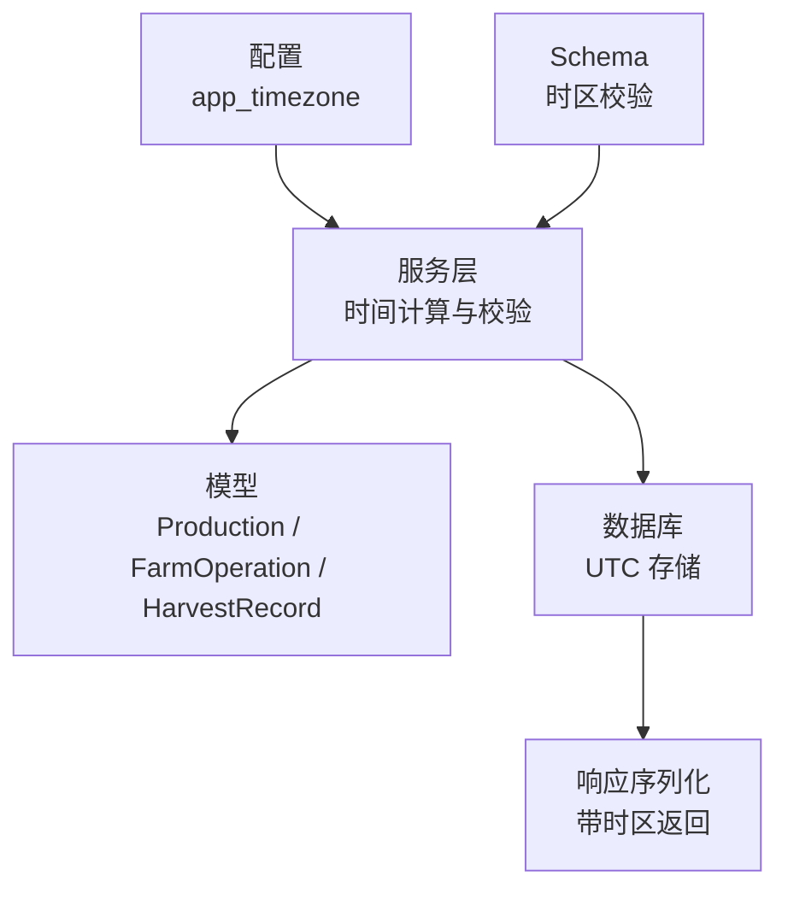
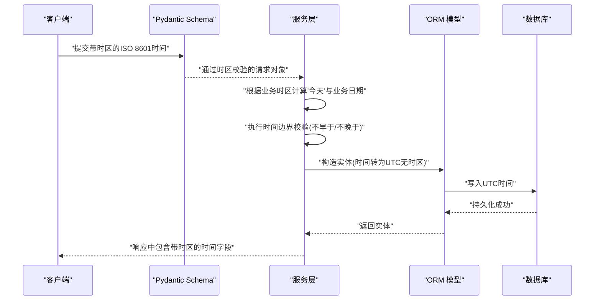
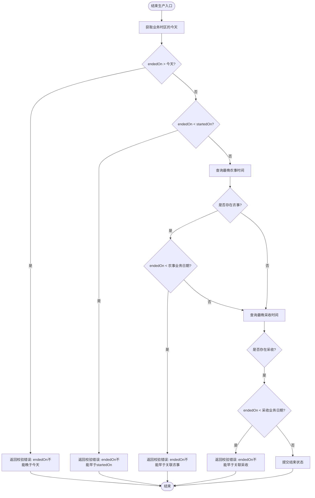
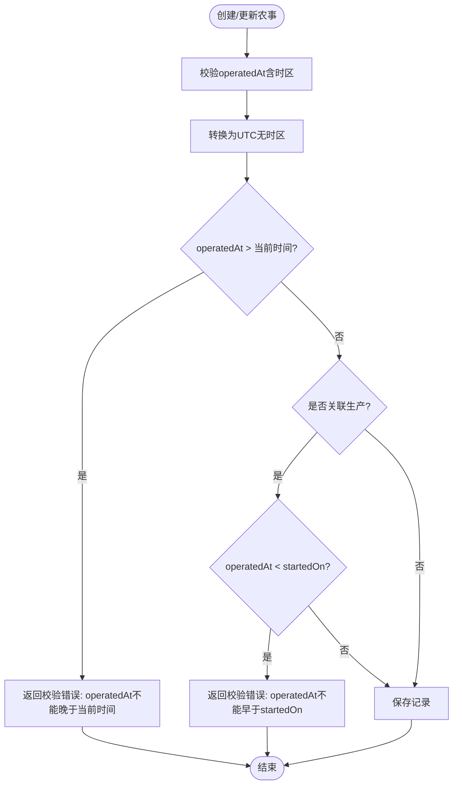
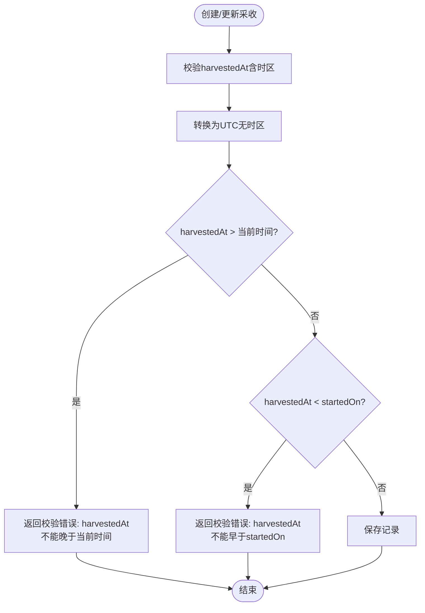
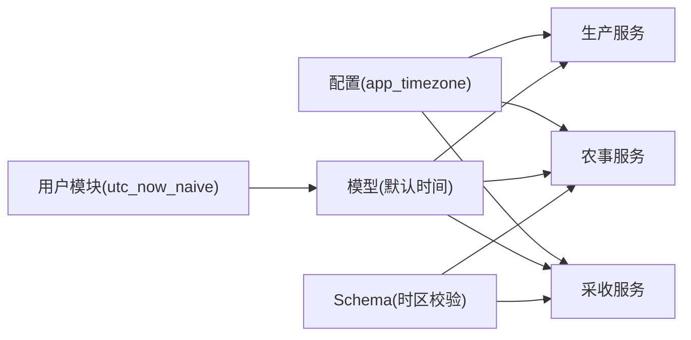

# 时间校验与补录规则

<cite>
**本文引用的文件**
- [apps/api/app/core/config.py](file://apps/api/app/core/config.py)
- [apps/api/app/models/production.py](file://apps/api/app/models/production.py)
- [apps/api/app/models/operation.py](file://apps/api/app/models/operation.py)
- [apps/api/app/models/harvest.py](file://apps/api/app/models/harvest.py)
- [apps/api/app/schemas/production.py](file://apps/api/app/schemas/production.py)
- [apps/api/app/schemas/operation.py](file://apps/api/app/schemas/operation.py)
- [apps/api/app/schemas/harvest.py](file://apps/api/app/schemas/harvest.py)
- [apps/api/app/services/production.py](file://apps/api/app/services/production.py)
- [apps/api/app/services/operation.py](file://apps/api/app/services/operation.py)
- [apps/api/app/services/harvest.py](file://apps/api/app/services/harvest.py)
- [apps/api/app/models/user.py](file://apps/api/app/models/user.py)
</cite>

## 目录
1. [简介](#简介)
2. [项目结构](#项目结构)
3. [核心组件](#核心组件)
4. [架构总览](#架构总览)
5. [详细组件分析](#详细组件分析)
6. [依赖关系分析](#依赖关系分析)
7. [性能考虑](#性能考虑)
8. [故障排查指南](#故障排查指南)
9. [结论](#结论)

## 简介
本文件说明 Pocket Farm 系统的时间校验与补录规则，覆盖以下业务约束：
- 进行中的 Production 允许补录过去数据，但所有时间都不得晚于当前时间。
- Production.startedOn 不能晚于今天（业务日）。
- Production.endedOn 不能晚于今天，且需满足与关联记录的业务约束。
- 关联 Production 的 FarmOperation.operatedAt 不早于 startedOn 且不晚于当前时间。
- HarvestRecord.harvestedAt 不早于 startedOn 且不晚于当前时间。
- 纯地块（未关联 Production）的 FarmOperation.operatedAt 不晚于当前时间。
- MVP 默认业务时区为 Asia/Shanghai；API 的 datetime 使用带时区的 ISO 8601 格式；后端转换为 UTC 保存，返回时携带时区偏移。
- 包含时间校验异常的处理和错误提示机制。

## 项目结构
围绕时间校验的关键代码分布在模型、Schema、服务层与配置中：
- 配置：应用时区设置。
- 模型：定义生产、农事操作、采收记录的字段类型与默认值。
- Schema：对请求参数进行校验，包括时区要求。
- 服务：实现具体业务校验逻辑（如“不早于开始”“不晚于当前”等），并负责时区转换与持久化。

**图表来源**
- [apps/api/app/core/config.py:5-22](file://apps/api/app/core/config.py#L5-L22)
- [apps/api/app/services/production.py:40-51](file://apps/api/app/services/production.py#L40-L51)
- [apps/api/app/models/production.py:43-79](file://apps/api/app/models/production.py#L43-L79)
- [apps/api/app/models/operation.py:37-80](file://apps/api/app/models/operation.py#L37-L80)
- [apps/api/app/models/harvest.py:13-48](file://apps/api/app/models/harvest.py#L13-L48)

**章节来源**
- [apps/api/app/core/config.py:5-22](file://apps/api/app/core/config.py#L5-L22)

## 核心组件
- 配置与时区
  - 应用默认时区为 Asia/Shanghai，用于计算“今天”和业务日期。
- 模型
  - Production：started_on、ended_on 为日期；created_at/updated_at 为带默认值的 UTC 时间。
  - FarmOperation：operated_at 为时间戳，默认当前 UTC 时间。
  - HarvestRecord：harvested_at 为时间戳，默认当前 UTC 时间。
- Schema
  - Operation/Harvest 的 datetime 字段强制要求带时区偏移，否则抛出校验错误。
- 服务
  - 统一将传入的带时区时间转换为 UTC 无时区时间存储。
  - 基于业务时区计算“今天”，并进行各类时间边界校验。
  - 在结束生产时，确保 ended_on 不早于关联的最晚农事或采收时间。

**章节来源**
- [apps/api/app/models/production.py:43-79](file://apps/api/app/models/production.py#L43-L79)
- [apps/api/app/models/operation.py:37-80](file://apps/api/app/models/operation.py#L37-L80)
- [apps/api/app/models/harvest.py:13-48](file://apps/api/app/models/harvest.py#L13-L48)
- [apps/api/app/schemas/operation.py:9-12](file://apps/api/app/schemas/operation.py#L9-L12)
- [apps/api/app/schemas/harvest.py:9-12](file://apps/api/app/schemas/harvest.py#L9-L12)
- [apps/api/app/services/production.py:40-51](file://apps/api/app/services/production.py#L40-L51)
- [apps/api/app/services/operation.py:29-43](file://apps/api/app/services/operation.py#L29-L43)
- [apps/api/app/services/harvest.py:41-63](file://apps/api/app/services/harvest.py#L41-L63)
- [apps/api/app/models/user.py:10-12](file://apps/api/app/models/user.py#L10-L12)

## 架构总览
下图展示了从 API 请求到数据落库的完整时间处理流程，包括时区转换、业务校验与错误返回。

**图表来源**
- [apps/api/app/schemas/operation.py:9-12](file://apps/api/app/schemas/operation.py#L9-L12)
- [apps/api/app/schemas/harvest.py:9-12](file://apps/api/app/schemas/harvest.py#L9-L12)
- [apps/api/app/services/production.py:40-51](file://apps/api/app/services/production.py#L40-L51)
- [apps/api/app/services/operation.py:29-43](file://apps/api/app/services/operation.py#L29-L43)
- [apps/api/app/services/harvest.py:41-63](file://apps/api/app/services/harvest.py#L41-L63)
- [apps/api/app/models/user.py:10-12](file://apps/api/app/models/user.py#L10-L12)

## 详细组件分析

### 生产记录（Production）时间规则
- 创建与更新
  - started_on 必须不晚于“今天”（按业务时区计算的日期）。
  - 若涉及核心字段变更（plot_id/species_id/started_on），当已存在农事或采收记录时不允许修改，以保证历史一致性。
- 结束生产
  - ended_on 默认取当天（业务时区），且不得晚于今天。
  - ended_on 不得早于 production.started_on。
  - 若存在关联农事或采收记录，ended_on 不得早于其中最晚的一条记录对应的业务日期。

**图表来源**
- [apps/api/app/services/production.py:40-51](file://apps/api/app/services/production.py#L40-L51)
- [apps/api/app/services/production.py:403-445](file://apps/api/app/services/production.py#L403-L445)

**章节来源**
- [apps/api/app/services/production.py:44-51](file://apps/api/app/services/production.py#L44-L51)
- [apps/api/app/services/production.py:164-217](file://apps/api/app/services/production.py#L164-L217)
- [apps/api/app/services/production.py:220-365](file://apps/api/app/services/production.py#L220-L365)
- [apps/api/app/services/production.py:403-445](file://apps/api/app/services/production.py#L403-L445)
- [apps/api/app/models/production.py:43-79](file://apps/api/app/models/production.py#L43-L79)

### 农事操作（FarmOperation）时间规则
- 时区要求
  - operatedAt 必须包含时区偏移，否则 Schema 校验失败。
- 时间边界
  - operatedAt 不得晚于当前时间（以 UTC 比较）。
  - 若关联了 Production，则 operatedAt 不得早于该生产的 startedOn（以业务日对齐后比较）。
  - 若未关联 Production（纯地块操作），仅受“不晚于当前时间”限制。
- 时区与存储
  - 传入的带时区时间会转换为 UTC 无时区时间存储。

**图表来源**
- [apps/api/app/schemas/operation.py:9-12](file://apps/api/app/schemas/operation.py#L9-L12)
- [apps/api/app/services/operation.py:29-43](file://apps/api/app/services/operation.py#L29-L43)
- [apps/api/app/services/operation.py:139-181](file://apps/api/app/services/operation.py#L139-L181)
- [apps/api/app/services/operation.py:222-289](file://apps/api/app/services/operation.py#L222-L289)

**章节来源**
- [apps/api/app/schemas/operation.py:9-12](file://apps/api/app/schemas/operation.py#L9-L12)
- [apps/api/app/services/operation.py:29-43](file://apps/api/app/services/operation.py#L29-L43)
- [apps/api/app/services/operation.py:139-181](file://apps/api/app/services/operation.py#L139-L181)
- [apps/api/app/services/operation.py:222-289](file://apps/api/app/services/operation.py#L222-L289)

### 采收记录（HarvestRecord）时间规则
- 时区要求
  - harvestedAt 必须包含时区偏移，否则 Schema 校验失败。
- 时间边界
  - harvestedAt 不得晚于当前时间（以 UTC 比较）。
  - harvestedAt 不得早于关联 Production 的 startedOn（以业务日对齐后比较）。
- 时区与存储
  - 传入的带时区时间会转换为 UTC 无时区时间存储。

**图表来源**
- [apps/api/app/schemas/harvest.py:9-12](file://apps/api/app/schemas/harvest.py#L9-L12)
- [apps/api/app/services/harvest.py:41-63](file://apps/api/app/services/harvest.py#L41-L63)
- [apps/api/app/services/harvest.py:134-178](file://apps/api/app/services/harvest.py#L134-L178)
- [apps/api/app/services/harvest.py:204-263](file://apps/api/app/services/harvest.py#L204-L263)

**章节来源**
- [apps/api/app/schemas/harvest.py:9-12](file://apps/api/app/schemas/harvest.py#L9-L12)
- [apps/api/app/services/harvest.py:41-63](file://apps/api/app/services/harvest.py#L41-L63)
- [apps/api/app/services/harvest.py:134-178](file://apps/api/app/services/harvest.py#L134-L178)
- [apps/api/app/services/harvest.py:204-263](file://apps/api/app/services/harvest.py#L204-L263)

### 时区与时间基准
- 业务时区
  - 默认 Asia/Shanghai，用于计算“今天”与业务日期。
- 时间基准
  - “当前时间”以 UTC 为准进行比较（避免跨时区歧义）。
  - “业务日期”通过将 UTC 时间转换到业务时区后取日期部分。
- 存储与返回
  - 数据库存储 UTC 无时区时间。
  - 响应序列化时保留时区信息（由框架/序列化器处理）。

**章节来源**
- [apps/api/app/core/config.py:5-22](file://apps/api/app/core/config.py#L5-L22)
- [apps/api/app/services/production.py:40-51](file://apps/api/app/services/production.py#L40-L51)
- [apps/api/app/services/operation.py:29-30](file://apps/api/app/services/operation.py#L29-L30)
- [apps/api/app/services/harvest.py:41-42](file://apps/api/app/services/harvest.py#L41-L42)
- [apps/api/app/models/user.py:10-12](file://apps/api/app/models/user.py#L10-L12)

## 依赖关系分析
- 配置依赖
  - 服务层依赖 app_timezone 计算业务日期。
- 模型依赖
  - Production/FarmOperation/HarvestRecord 均依赖用户模块提供的 utc_now_naive 作为默认时间。
- Schema 与服务耦合
  - Schema 负责输入侧时区校验；服务负责业务侧时间边界校验与转换。
- 服务间调用
  - 农事与采收服务在创建/更新时会读取关联的生产记录，以确保时间一致性。

**图表来源**
- [apps/api/app/core/config.py:5-22](file://apps/api/app/core/config.py#L5-L22)
- [apps/api/app/models/user.py:10-12](file://apps/api/app/models/user.py#L10-L12)
- [apps/api/app/schemas/operation.py:9-12](file://apps/api/app/schemas/operation.py#L9-L12)
- [apps/api/app/schemas/harvest.py:9-12](file://apps/api/app/schemas/harvest.py#L9-L12)

**章节来源**
- [apps/api/app/core/config.py:5-22](file://apps/api/app/core/config.py#L5-L22)
- [apps/api/app/models/user.py:10-12](file://apps/api/app/models/user.py#L10-L12)
- [apps/api/app/schemas/operation.py:9-12](file://apps/api/app/schemas/operation.py#L9-L12)
- [apps/api/app/schemas/harvest.py:9-12](file://apps/api/app/schemas/harvest.py#L9-L12)

## 性能考虑
- 时间比较均为 O(1)，主要开销来自数据库查询（如查询最晚农事/采收时间）。
- 结束生产时的两次聚合查询（max）在索引良好的情况下性能可接受。
- 建议确保 farm_operations.harvest_records 相关时间字段有合适索引以提升查询效率。

[本节提供通用指导，无需特定文件引用]

## 故障排查指南
- 常见错误与含义
  - “startedOn cannot be later than today.”：提交的开始日期超过业务时区的今天。
  - “endedOn cannot be later than today.”：结束日期超过业务时区的今天。
  - “endedOn cannot be earlier than production.startedOn.”：结束日期早于开始日期。
  - “endedOn cannot be earlier than an associated farm operation.”：结束日期早于关联农事的业务日期。
  - “endedOn cannot be earlier than an associated harvest record.”：结束日期早于关联采收的业务日期。
  - “operatedAt cannot be later than the current time.”：农事时间晚于当前时间。
  - “operatedAt cannot be earlier than production.startedOn.”：农事时间早于生产开始日期。
  - “harvestedAt cannot be later than the current time.”：采收时间晚于当前时间。
  - “harvestedAt cannot be earlier than production.startedOn.”：采收时间早于生产开始日期。
  - “operatedAt must include a timezone offset.”：农事时间缺少时区。
  - “harvestedAt must include a timezone offset.”：采收时间缺少时区。
- 定位步骤
  - 检查请求中的 datetime 是否带时区（ISO 8601）。
  - 确认业务时区配置是否正确（Asia/Shanghai）。
  - 核对关联记录的 startedOn 与最晚农事/采收时间。
  - 查看服务层抛出的 AppException 消息，对应上述错误码与提示。

**章节来源**
- [apps/api/app/services/production.py:44-51](file://apps/api/app/services/production.py#L44-L51)
- [apps/api/app/services/production.py:403-445](file://apps/api/app/services/production.py#L403-L445)
- [apps/api/app/services/operation.py:29-43](file://apps/api/app/services/operation.py#L29-L43)
- [apps/api/app/services/harvest.py:41-63](file://apps/api/app/services/harvest.py#L41-L63)
- [apps/api/app/schemas/operation.py:9-12](file://apps/api/app/schemas/operation.py#L9-L12)
- [apps/api/app/schemas/harvest.py:9-12](file://apps/api/app/schemas/harvest.py#L9-L12)

## 结论
Pocket Farm 的时间校验体系通过“Schema 时区校验 + 服务层业务校验 + UTC 存储”三层保障数据一致性与合规性。MVP 阶段采用 Asia/Shanghai 作为业务时区，确保“今天”的计算符合本地业务习惯；同时以 UTC 作为内部时间基准，避免跨时区问题。对于进行中的生产，系统支持补录过去数据，但严格限制所有时间不得晚于当前时间，并在结束生产时保证与关联记录的一致性。遵循本文规则可有效减少时间相关的数据错误与争议。