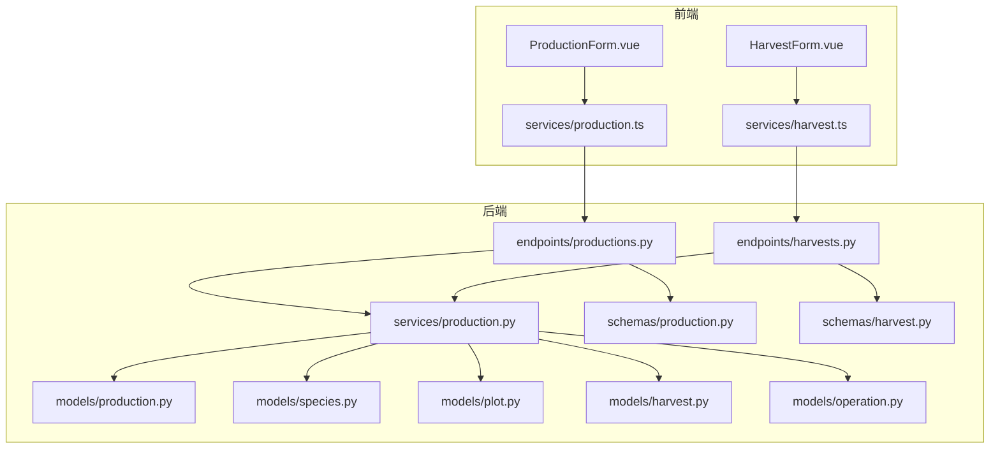
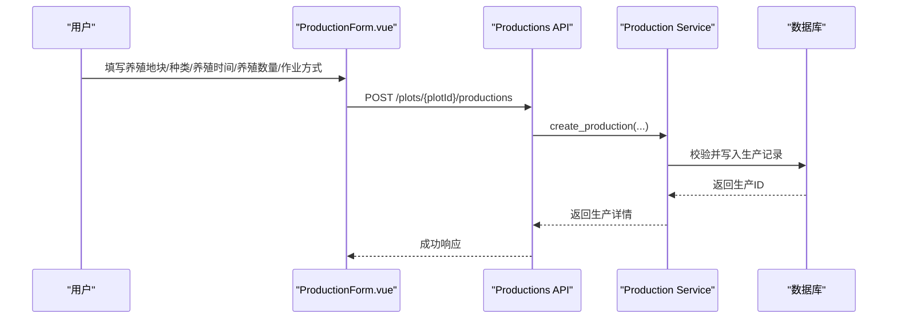
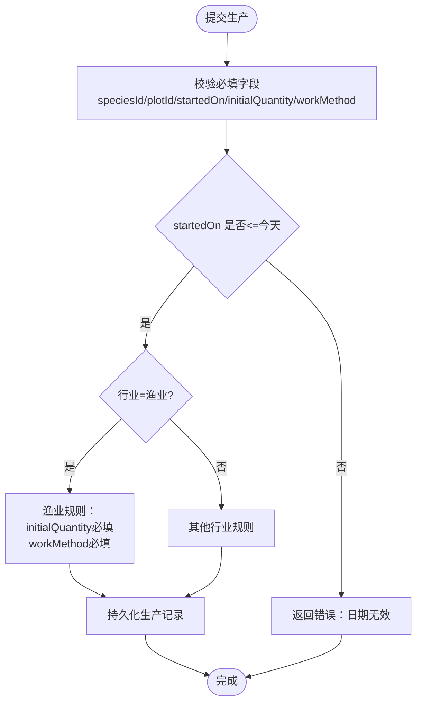
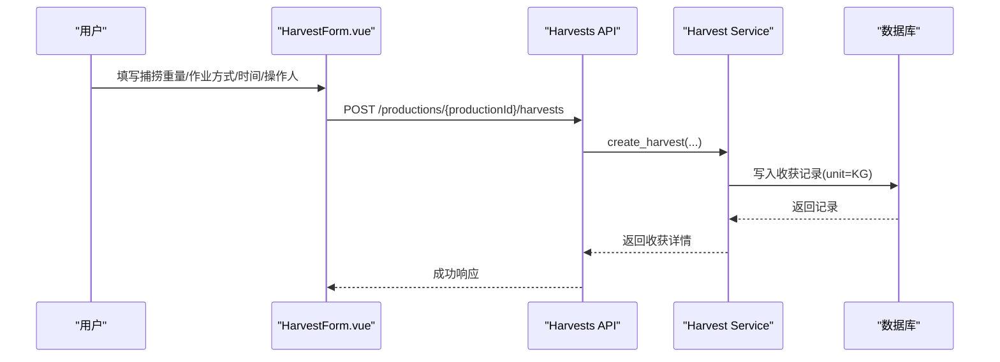
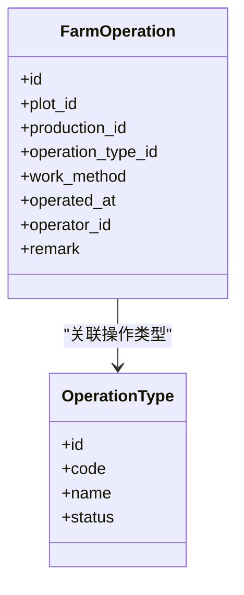
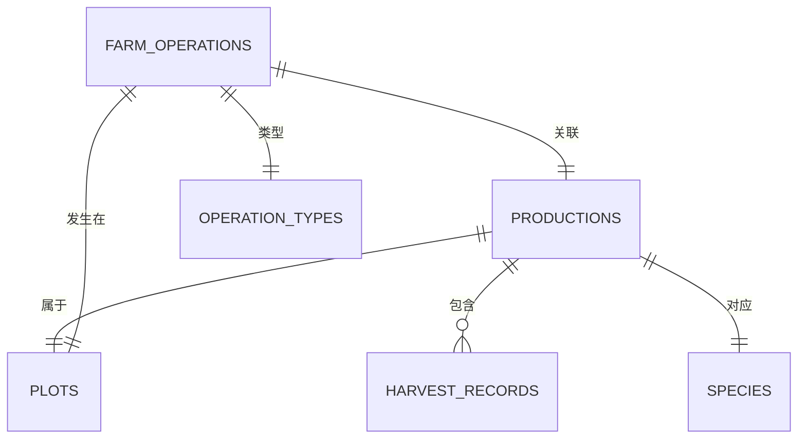

# 渔业生产流程

<cite>
**本文引用的文件**
- [production.py](file://apps/api/app/models/production.py)
- [species.py](file://apps/api/app/models/species.py)
- [plot.py](file://apps/api/app/models/plot.py)
- [harvest.py](file://apps/api/app/models/harvest.py)
- [operation.py](file://apps/api/app/models/operation.py)
- [production_service.py](file://apps/api/app/services/production.py)
- [production_schema.py](file://apps/api/app/schemas/production.py)
- [harvest_schema.py](file://apps/api/app/schemas/harvest.py)
- [productions_endpoint.py](file://apps/api/app/api/v1/endpoints/productions.py)
- [harvests_endpoint.py](file://apps/api/app/api/v1/endpoints/harvests.py)
- [production_form.vue](file://apps/miniapp/src/components/ProductionForm.vue)
- [harvest_form.vue](file://apps/miniapp/src/components/HarvestForm.vue)
- [production_service_ts.ts](file://apps/miniapp/src/services/production.ts)
- [harvest_service_ts.ts](file://apps/miniapp/src/services/harvest.ts)
- [test_phase9_workflows.py](file://apps/api/tests/test_phase9_workflows.py)
- [test_harvests.py](file://apps/api/tests/test_harvests.py)
- [migration_refine_production_industry_fields.py](file://apps/api/alembic/versions/093fa42fe3ad_refine_production_industry_fields.py)
- [migration_manage_operation_types.py](file://apps/api/alembic/versions/54698bd6b5f1_manage_operation_types.py)
</cite>

## 目录
1. [简介](#简介)
2. [项目结构](#项目结构)
3. [核心组件](#核心组件)
4. [架构总览](#架构总览)
5. [详细组件分析](#详细组件分析)
6. [依赖关系分析](#依赖关系分析)
7. [性能考虑](#性能考虑)
8. [故障排查指南](#故障排查指南)
9. [结论](#结论)
10. [附录](#附录)

## 简介
本文件面向 Pocket Farm 系统的渔业生产流程，聚焦前端术语与业务规则：
- 前端术语映射：Plot→养殖地块、startedOn→养殖时间、initialQuantity→养殖数量。
- 渔业必填字段：speciesId（种类）、plotId（养殖地块）、startedOn（养殖时间）、initialQuantity（养殖数量）、workMethod（作业方式）均为必填项。
- 单位规则：养殖数量的单位由 Species 的 individualUnit 固定带出；但收获记录在农业与渔业统一使用 KG（公斤），可记录小数。
- 作业方式默认：MANUAL（人工）。
- 与农业、林业的差异：渔业不要求种植标准与种植方式，也不支持预计亩产与株间距等种植相关字段；渔业支持清塘、换水、投料、测水温等渔业特有农事活动。
- 收获术语：渔业收获在前端显示为“捕捞”，重量单位为 KG。

## 项目结构
后端采用分层架构：API 路由层 → 服务层 → 模型层；数据通过 Pydantic Schema 校验并序列化。前端基于 Vue 组件与 TypeScript 服务封装 API。

**图示来源**
- [productions_endpoint.py:71-128](file://apps/api/app/api/v1/endpoints/productions.py#L71-L128)
- [harvests_endpoint.py:66-109](file://apps/api/app/api/v1/endpoints/harvests.py#L66-L109)
- [production_service.py:164-217](file://apps/api/app/services/production.py#L164-L217)
- [production_schema.py:15-70](file://apps/api/app/schemas/production.py#L15-L70)
- [harvest_schema.py:15-48](file://apps/api/app/schemas/harvest.py#L15-L48)
- [production.py:43-79](file://apps/api/app/models/production.py#L43-L79)
- [species.py:27-35](file://apps/api/app/models/species.py#L27-L35)
- [plot.py:31-54](file://apps/api/app/models/plot.py#L31-L54)
- [harvest.py:13-48](file://apps/api/app/models/harvest.py#L13-L48)
- [operation.py:37-80](file://apps/api/app/models/operation.py#L37-L80)

**章节来源**
- [productions_endpoint.py:71-198](file://apps/api/app/api/v1/endpoints/productions.py#L71-L198)
- [harvests_endpoint.py:66-163](file://apps/api/app/api/v1/endpoints/harvests.py#L66-L163)
- [production_service.py:164-446](file://apps/api/app/services/production.py#L164-L446)
- [production_schema.py:15-198](file://apps/api/app/schemas/production.py#L15-L198)
- [harvest_schema.py:15-111](file://apps/api/app/schemas/harvest.py#L15-L111)
- [production.py:43-79](file://apps/api/app/models/production.py#L43-L79)
- [species.py:27-35](file://apps/api/app/models/species.py#L27-L35)
- [plot.py:31-54](file://apps/api/app/models/plot.py#L31-L54)
- [harvest.py:13-48](file://apps/api/app/models/harvest.py#L13-L48)
- [operation.py:37-80](file://apps/api/app/models/operation.py#L37-L80)

## 核心组件
- 生产（Production）：承载一次养殖生命周期，包含地块、种类、开始时间、作业方式、初始数量等。
- 种类（Species）：定义行业类型与个体单位，渔业种类的单位用于前端展示与校验提示。
- 养殖地块（Plot）：渔业对应 POND（鱼塘）类型。
- 收获记录（HarvestRecord）：记录每次捕捞的重量、作业方式、时间、操作人等。
- 农事操作（FarmOperation）：记录换水、投料、清塘、测水温等渔业特有农事。

关键要点：
- 渔业必填字段校验在服务层按行业区分，渔业要求 initialQuantity 与 workMethod 必填。
- 收获记录 unit 在农业与渔业固定为 KG，其他行业按种类单位。
- 作业方式默认 MANUAL。

**章节来源**
- [production_service.py:63-103](file://apps/api/app/services/production.py#L63-L103)
- [harvest_schema.py:15-48](file://apps/api/app/schemas/harvest.py#L15-L48)
- [harvest.py:13-48](file://apps/api/app/models/harvest.py#L13-L48)
- [operation.py:37-80](file://apps/api/app/models/operation.py#L37-L80)
- [species.py:27-35](file://apps/api/app/models/species.py#L27-L35)

## 架构总览
以下时序图展示从前端创建渔业生产到记录农事与捕捞的完整调用链。

**图示来源**
- [production_form.vue:21-35](file://apps/miniapp/src/components/ProductionForm.vue#L21-L35)
- [production_service_ts.ts:74-80](file://apps/miniapp/src/services/production.ts#L74-L80)
- [productions_endpoint.py:100-128](file://apps/api/app/api/v1/endpoints/productions.py#L100-L128)
- [production_service.py:164-217](file://apps/api/app/services/production.py#L164-L217)

## 详细组件分析

### 生产创建与校验（渔业）
- 必填字段：speciesId、plotId、startedOn、initialQuantity、workMethod。
- startedOn 不得晚于当天。
- initialQuantity 需为正数；当种类单位要求整数时，前端会限制输入格式。
- 作业方式默认 MANUAL。

**图示来源**
- [production_service.py:44-103](file://apps/api/app/services/production.py#L44-L103)
- [production_schema.py:15-70](file://apps/api/app/schemas/production.py#L15-L70)

**章节来源**
- [production_service.py:164-217](file://apps/api/app/services/production.py#L164-L217)
- [production_schema.py:15-70](file://apps/api/app/schemas/production.py#L15-L70)

### 收获记录（渔业“捕捞”）
- 渔业收获术语为“捕捞”，重量单位固定为 KG，允许小数。
- 作业方式默认 MANUAL。
- 前端根据 production.industry 动态决定 quantityFieldLabel 与 actionLabel。

**图示来源**
- [harvest_form.vue:149-173](file://apps/miniapp/src/components/HarvestForm.vue#L149-L173)
- [harvest_service_ts.ts:67-76](file://apps/miniapp/src/services/harvest.ts#L67-L76)
- [harvests_endpoint.py:86-109](file://apps/api/app/api/v1/endpoints/harvests.py#L86-L109)
- [harvest_schema.py:15-48](file://apps/api/app/schemas/harvest.py#L15-L48)

**章节来源**
- [harvest_form.vue:149-173](file://apps/miniapp/src/components/HarvestForm.vue#L149-L173)
- [harvests_endpoint.py:86-109](file://apps/api/app/api/v1/endpoints/harvests.py#L86-L109)
- [harvest_schema.py:15-48](file://apps/api/app/schemas/harvest.py#L15-L48)

### 农事活动（渔业特有）
- 渔业支持换水、投料、清塘、测水温等操作类型。
- 这些操作与生产关联，用于记录养殖过程中的管理动作。

**图示来源**
- [operation.py:37-80](file://apps/api/app/models/operation.py#L37-L80)
- [migration_manage_operation_types.py:57-66](file://apps/api/alembic/versions/54698bd6b5f1_manage_operation_types.py#L57-L66)

**章节来源**
- [operation.py:37-80](file://apps/api/app/models/operation.py#L37-L80)
- [migration_manage_operation_types.py:57-66](file://apps/api/alembic/versions/54698bd6b5f1_manage_operation_types.py#L57-L66)

### 前端术语与字段说明
- Plot→养殖地块：表单中显示“地块”，选择后绑定 plotId。
- startedOn→养殖时间：渔业场景下标签为“养殖时间”。
- initialQuantity→养殖数量：渔业场景下标签为“养殖数量”，单位由种类单位决定（前端展示用 species.individualUnit）。
- 作业方式：默认“人工”（MANUAL），渔业场景下需要选择。

**章节来源**
- [production_form.vue:279-290](file://apps/miniapp/src/components/ProductionForm.vue#L279-L290)
- [production_form.vue:117-125](file://apps/miniapp/src/components/ProductionForm.vue#L117-L125)
- [production_service_ts.ts:40-53](file://apps/miniapp/src/services/production.ts#L40-L53)

### 渔业与农业、林业的异同
- 相同点：
  - 都围绕 Production 进行全生命周期管理（开始、作业、收获、结束）。
  - 都支持作业方式（MANUAL/MECHANICAL）。
- 不同点：
  - 农业/林业需要种植标准与种植方式，渔业不需要。
  - 农业/林业可能涉及预计亩产、株间距等种植参数，渔业不涉及。
  - 渔业收获单位固定为 KG，农业也使用 KG；林业/牧业按种类单位。
  - 渔业支持清塘、换水、投料、测水温等特有农事操作。

**章节来源**
- [production_service.py:25-103](file://apps/api/app/services/production.py#L25-L103)
- [harvest_form.vue:149-173](file://apps/miniapp/src/components/HarvestForm.vue#L149-L173)
- [migration_manage_operation_types.py:57-66](file://apps/api/alembic/versions/54698bd6b5f1_manage_operation_types.py#L57-L66)

## 依赖关系分析
- 生产与服务：
  - 生产创建/更新/结束均经过服务层校验，依据种类行业执行差异化规则。
- 收获与服务：
  - 收获记录的 unit 在农业与渔业固定为 KG，其他行业按种类单位。
- 模型关系：
  - Production 关联 Plot 与 Species。
  - HarvestRecord 关联 Production。
  - FarmOperation 关联 Plot 与 Production，并通过 OperationType 描述具体农事。

**图示来源**
- [production.py:43-79](file://apps/api/app/models/production.py#L43-L79)
- [harvest.py:13-48](file://apps/api/app/models/harvest.py#L13-L48)
- [plot.py:31-54](file://apps/api/app/models/plot.py#L31-L54)
- [species.py:27-35](file://apps/api/app/models/species.py#L27-L35)
- [operation.py:37-80](file://apps/api/app/models/operation.py#L37-L80)

**章节来源**
- [production.py:43-79](file://apps/api/app/models/production.py#L43-L79)
- [harvest.py:13-48](file://apps/api/app/models/harvest.py#L13-L48)
- [plot.py:31-54](file://apps/api/app/models/plot.py#L31-L54)
- [species.py:27-35](file://apps/api/app/models/species.py#L27-L35)
- [operation.py:37-80](file://apps/api/app/models/operation.py#L37-L80)

## 性能考虑
- 列表查询分页：生产与收获列表均支持 page/pageSize，避免一次性加载大量数据。
- 数据库索引：生产与收获的 production_id、plot_id 等常用查询字段已建立索引，提升检索效率。
- 事务与锁：编辑生产时锁定记录，防止并发修改导致的数据不一致。

[本节提供通用指导，无需特定文件引用]

## 故障排查指南
- 常见校验错误：
  - startedOn 晚于今天：检查日期选择器与系统时间。
  - initialQuantity 非正数或不符合单位整数要求：检查输入格式与种类单位。
  - workMethod 未选择：确保作业方式为必填。
  - endedOn 早于最早农事/收获时间：结束生产时需满足时间约束。
- 收获单位异常：
  - 渔业/农业收获单位应为 KG；若出现其他单位，检查前端传入的 production.industry 是否正确。
- 农事操作无法删除生产：
  - 存在农事或收获记录的生产不可删除，需先处理关联数据。

**章节来源**
- [production_service.py:44-103](file://apps/api/app/services/production.py#L44-L103)
- [production_service.py:403-446](file://apps/api/app/services/production.py#L403-L446)
- [harvest_schema.py:15-48](file://apps/api/app/schemas/harvest.py#L15-L48)
- [test_phase9_workflows.py:185-208](file://apps/api/tests/test_phase9_workflows.py#L185-L208)
- [test_harvests.py:311-352](file://apps/api/tests/test_harvests.py#L311-L352)

## 结论
Pocket Farm 的渔业生产流程以 Production 为核心，结合 Plot、Species、HarvestRecord 与 FarmOperation 构建完整的养殖生命周期管理。系统在前后端协同上实现了：
- 明确的术语映射与字段要求（养殖地块、养殖时间、养殖数量、作业方式）。
- 严格的行业差异化校验（渔业必填 initialQuantity 与 workMethod）。
- 统一的收获单位规则（渔业与农业使用 KG）。
- 丰富的渔业特有农事支持（清塘、换水、投料、测水温）。
通过这些设计，系统既保证了数据的规范性，又提升了用户体验与可操作性。

## 附录
- 渔业特有农事操作类型参考：换水、投料、清塘、测水温。
- 迁移脚本对种类单位的影响：渔业种类单位在迁移中被设置为 TAIL，但收获记录在农业与渔业统一使用 KG。

**章节来源**
- [migration_manage_operation_types.py:57-66](file://apps/api/alembic/versions/54698bd6b5f1_manage_operation_types.py#L57-L66)
- [migration_refine_production_industry_fields.py:21-59](file://apps/api/alembic/versions/093fa42fe3ad_refine_production_industry_fields.py#L21-L59)