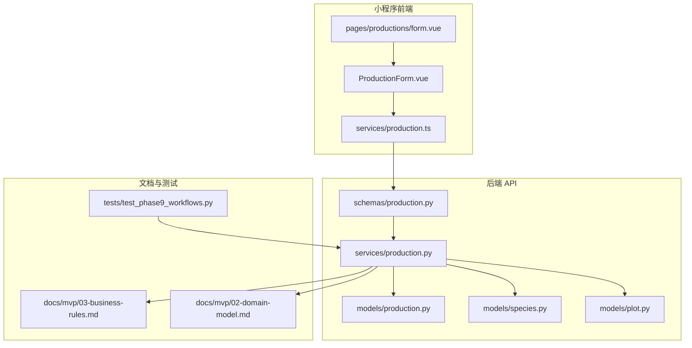
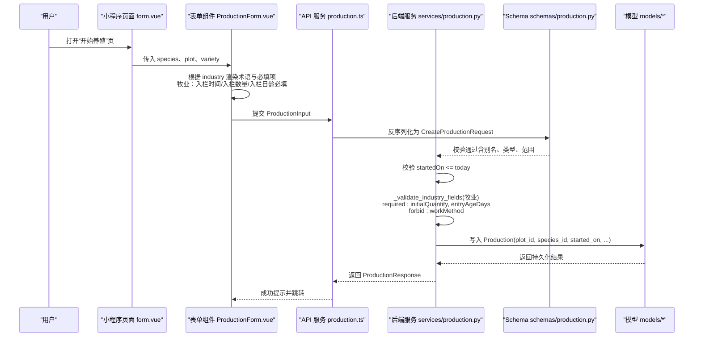
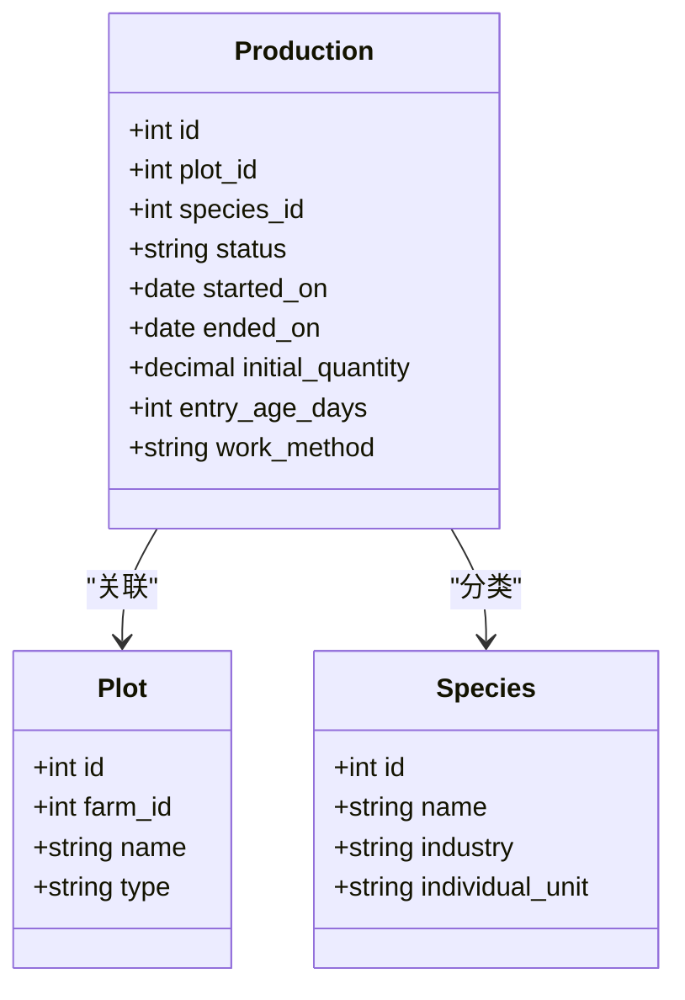
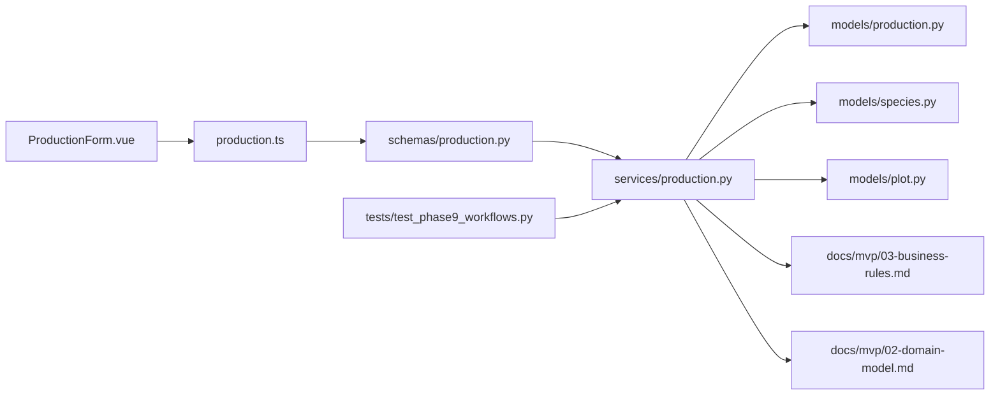

# 牧业生产流程

<cite>
**本文引用的文件**
- [production.py](file://apps/api/app/models/production.py)
- [production.py](file://apps/api/app/schemas/production.py)
- [production.py](file://apps/api/app/services/production.py)
- [species.py](file://apps/api/app/models/species.py)
- [plot.py](file://apps/api/app/models/plot.py)
- [ProductionForm.vue](file://apps/miniapp/src/components/ProductionForm.vue)
- [form.vue](file://apps/miniapp/src/pages/productions/form.vue)
- [production.ts](file://apps/miniapp/src/services/production.ts)
- [03-business-rules.md](file://docs/mvp/03-business-rules.md)
- [02-domain-model.md](file://docs/mvp/02-domain-model.md)
- [test_phase9_workflows.py](file://apps/api/tests/test_phase9_workflows.py)
</cite>

## 目录
1. [简介](#简介)
2. [项目结构](#项目结构)
3. [核心组件](#核心组件)
4. [架构总览](#架构总览)
5. [详细组件分析](#详细组件分析)
6. [依赖关系分析](#依赖关系分析)
7. [性能与约束](#性能与约束)
8. [故障排查指南](#故障排查指南)
9. [结论](#结论)
10. [附录](#附录)

## 简介
本文件面向 Pocket Farm 系统的“牧业”行业，聚焦 MVP 阶段的“出栏”业务闭环。文档从前端术语转换、必填字段校验、单位固定规则、workMethod 不展示原因、内部编号自动生成机制，到后端校验与数据流转进行系统化说明，帮助产品、前后端开发与测试快速对齐实现细节。

## 项目结构
围绕牧业生产流程，涉及的关键代码与文档分布如下：
- 领域模型与枚举：生产记录、种类、地块等数据库模型定义
- 请求/响应 Schema：字段别名、序列化、必填校验
- 服务层：创建/更新/结束生产的业务校验与事务处理
- 小程序前端：表单渲染、术语映射、单位显示、提交参数构造
- 业务规则文档：MVP 阶段对牧业的范围与约束说明
- 端到端测试：覆盖“开始养殖—农事—出栏—结束养殖”的完整链路

图表来源
- [ProductionForm.vue:1-613](file://apps/miniapp/src/components/ProductionForm.vue#L1-L613)
- [form.vue:1-181](file://apps/miniapp/src/pages/productions/form.vue#L1-L181)
- [production.ts:1-121](file://apps/miniapp/src/services/production.ts#L1-L121)
- [production.py](file://apps/api/app/schemas/production.py)
- [production.py](file://apps/api/app/services/production.py)
- [production.py](file://apps/api/app/models/production.py)
- [species.py](file://apps/api/app/models/species.py)
- [plot.py](file://apps/api/app/models/plot.py)
- [03-business-rules.md:136-168](file://docs/mvp/03-business-rules.md#L136-L168)
- [02-domain-model.md:219-243](file://docs/mvp/02-domain-model.md#L219-L243)
- [test_phase9_workflows.py:211-235](file://apps/api/tests/test_phase9_workflows.py#L211-L235)

章节来源
- [ProductionForm.vue:1-613](file://apps/miniapp/src/components/ProductionForm.vue#L1-L613)
- [form.vue:1-181](file://apps/miniapp/src/pages/productions/form.vue#L1-L181)
- [production.ts:1-121](file://apps/miniapp/src/services/production.ts#L1-L121)
- [production.py](file://apps/api/app/schemas/production.py)
- [production.py](file://apps/api/app/services/production.py)
- [production.py](file://apps/api/app/models/production.py)
- [species.py](file://apps/api/app/models/species.py)
- [plot.py](file://apps/api/app/models/plot.py)
- [03-business-rules.md:136-168](file://docs/mvp/03-business-rules.md#L136-L168)
- [02-domain-model.md:219-243](file://docs/mvp/02-domain-model.md#L219-L243)
- [test_phase9_workflows.py:211-235](file://apps/api/tests/test_phase9_workflows.py#L211-L235)

## 核心组件
- 前端表单组件：根据 Species.industry 动态切换术语与必填项，牧业场景下将 Plot→栏舍、startedOn→入栏时间、initialQuantity→入栏数量，并强制要求 entryAgeDays（入栏日龄）。
- 后端 Schema：通过 AliasChoices 兼容驼峰/下划线字段；按行业执行差异化必填校验；对牧业禁止 workMethod。
- 后端服务：创建/更新/结束生产时进行权限、时间、关联资源校验；对牧业强制 initialQuantity 与 entryAgeDays 必填，且 initialQuantity 必须为整数。
- 领域模型：Production 统一承载农业/林业/牧业/渔业；Species 提供个体单位；Plot 支持 BARN（栏舍）类型。
- 业务规则文档：明确 MVP 仅处理“出栏”，暂不处理鸡蛋、牛奶等过程产出；内部生产编号由系统自动生成，不暴露用户填写批次号。

章节来源
- [ProductionForm.vue:201-290](file://apps/miniapp/src/components/ProductionForm.vue#L201-L290)
- [production.py](file://apps/api/app/schemas/production.py)
- [production.py](file://apps/api/app/services/production.py)
- [production.py](file://apps/api/app/models/production.py)
- [species.py](file://apps/api/app/models/species.py)
- [plot.py](file://apps/api/app/models/plot.py)
- [03-business-rules.md:136-168](file://docs/mvp/03-business-rules.md#L136-L168)

## 架构总览
下图展示了从前端到后端的牧业生产创建与结束的核心调用链，以及关键校验点。

图表来源
- [form.vue:96-116](file://apps/miniapp/src/pages/productions/form.vue#L96-L116)
- [ProductionForm.vue:418-468](file://apps/miniapp/src/components/ProductionForm.vue#L418-L468)
- [production.ts:74-80](file://apps/miniapp/src/services/production.ts#L74-L80)
- [production.py](file://apps/api/app/schemas/production.py)
- [production.py](file://apps/api/app/services/production.py)
- [production.py](file://apps/api/app/models/production.py)

章节来源
- [form.vue:96-116](file://apps/miniapp/src/pages/productions/form.vue#L96-L116)
- [ProductionForm.vue:418-468](file://apps/miniapp/src/components/ProductionForm.vue#L418-L468)
- [production.ts:74-80](file://apps/miniapp/src/services/production.ts#L74-L80)
- [production.py](file://apps/api/app/schemas/production.py)
- [production.py](file://apps/api/app/services/production.py)
- [production.py](file://apps/api/app/models/production.py)

## 详细组件分析

### 前端术语转换与表单行为
- 术语映射
  - Plot → 栏舍：在表单中通过 plotMeta 与选择器文案体现，BARN 类型对应“栏舍”。
  - startedOn → 入栏时间：isLivestock 时标签改为“入栏时间”。
  - initialQuantity → 入栏数量：isLivestock 时标签改为“入栏数量”。
- 必填与单位
  - 入栏日龄（entryAgeDays）：牧业必填，非负整数；前端在提交前校验并提示。
  - 入栏数量（initialQuantity）：牧业必填，且必须为整数；单位由 Species.individual_unit 自动带出（猪牛羊为“头”，鸡鸭为“羽”）。
- 作业方式（workMethod）
  - 牧业不展示也不提交 workMethod；前端仅在种植业或渔业显示该字段。
- 其他字段
  - 品种（variety）、备注（remark）保留为选填。
  - 预计采收时间、亩产、株间距不适用于牧业，前端不会展示。

章节来源
- [ProductionForm.vue:201-290](file://apps/miniapp/src/components/ProductionForm.vue#L201-L290)
- [ProductionForm.vue:418-468](file://apps/miniapp/src/components/ProductionForm.vue#L418-L468)
- [03-business-rules.md:136-168](file://docs/mvp/03-business-rules.md#L136-L168)

### 后端 Schema 与校验
- 字段别名与序列化
  - 使用 AliasChoices 同时接受 camelCase 与 snake_case 输入，并以 camelCase 输出给前端。
- 行业差异化校验
  - 种植业（农业/林业）：plantingStandard、plantingMethod、workMethod 必填；禁止 entryAgeDays。
  - 牧业：initialQuantity、entryAgeDays 必填；禁止 workMethod；initialQuantity 必须为整数。
  - 渔业：initialQuantity、workMethod 必填。
- 时间校验
  - startedOn 不得晚于今天；endedOn 不得晚于今天且不早于 startedOn 及关联业务日期。

章节来源
- [production.py](file://apps/api/app/schemas/production.py)
- [production.py](file://apps/api/app/services/production.py)

### 领域模型与数据流
- Production
  - 关键字段：plot_id、species_id、status、started_on、ended_on、initial_quantity、entry_age_days、work_method（牧业为空）。
  - 状态：ACTIVE、ENDED。
- Species
  - 关键字段：name、industry、individual_unit。
  - 个体单位：HEAD（头）、FEATHER（羽）、PIECE（只）、PLANT（株）、TAIL（尾）。
- Plot
  - 类型包含 BARN（栏舍），用于牧业场景。

图表来源
- [production.py](file://apps/api/app/models/production.py)
- [species.py](file://apps/api/app/models/species.py)
- [plot.py](file://apps/api/app/models/plot.py)

章节来源
- [production.py](file://apps/api/app/models/production.py)
- [species.py](file://apps/api/app/models/species.py)
- [plot.py](file://apps/api/app/models/plot.py)

### MVP 业务范围与限制
- 仅处理“出栏”：牧业 MVP 阶段只支持出栏收获，不处理鸡蛋、牛奶、羊毛、羽毛、肉类等过程产出。
- 内部生产编号：如需生产编号，由系统自动生成；不提供用户填写批次号的入口。
- 结束种养：结束后 Production.status=ENDED，ended_on 需满足时间与关联业务约束。

章节来源
- [03-business-rules.md:136-168](file://docs/mvp/03-business-rules.md#L136-L168)
- [03-business-rules.md:320-353](file://docs/mvp/03-business-rules.md#L320-L353)
- [03-business-rules.md:424-445](file://docs/mvp/03-business-rules.md#L424-L445)

### 端到端工作流验证
- 测试覆盖了“开始养殖—农事—出栏—结束养殖”的完整链路，并断言出栏数量的单位为 HEAD（猪牛羊）或 FEATHER（鸡鸭），符合 Species.individual_unit 派生规则。

章节来源
- [test_phase9_workflows.py:211-235](file://apps/api/tests/test_phase9_workflows.py#L211-L235)

## 依赖关系分析
- 前端依赖
  - ProductionForm 根据 Species.industry 决定术语与必填项；提交时构造 ProductionInput。
  - services/production.ts 负责与后端 API 交互，字段名采用驼峰命名。
- 后端依赖
  - Schema 负责字段别名与基础校验；Service 负责行业差异化校验、时间校验、关联资源校验与事务提交。
  - Model 定义表结构与字段约束；Species 提供个体单位；Plot 提供栏舍类型。
- 文档与测试
  - 业务规则文档定义 MVP 范围与约束；端到端测试验证全流程一致性。

图表来源
- [ProductionForm.vue:1-613](file://apps/miniapp/src/components/ProductionForm.vue#L1-L613)
- [production.ts:1-121](file://apps/miniapp/src/services/production.ts#L1-L121)
- [production.py](file://apps/api/app/schemas/production.py)
- [production.py](file://apps/api/app/services/production.py)
- [production.py](file://apps/api/app/models/production.py)
- [species.py](file://apps/api/app/models/species.py)
- [plot.py](file://apps/api/app/models/plot.py)
- [03-business-rules.md:136-168](file://docs/mvp/03-business-rules.md#L136-L168)
- [02-domain-model.md:219-243](file://docs/mvp/02-domain-model.md#L219-L243)
- [test_phase9_workflows.py:211-235](file://apps/api/tests/test_phase9_workflows.py#L211-L235)

章节来源
- [ProductionForm.vue:1-613](file://apps/miniapp/src/components/ProductionForm.vue#L1-L613)
- [production.ts:1-121](file://apps/miniapp/src/services/production.ts#L1-L121)
- [production.py](file://apps/api/app/schemas/production.py)
- [production.py](file://apps/api/app/services/production.py)
- [production.py](file://apps/api/app/models/production.py)
- [species.py](file://apps/api/app/models/species.py)
- [plot.py](file://apps/api/app/models/plot.py)
- [03-business-rules.md:136-168](file://docs/mvp/03-business-rules.md#L136-L168)
- [02-domain-model.md:219-243](file://docs/mvp/02-domain-model.md#L219-L243)
- [test_phase9_workflows.py:211-235](file://apps/api/tests/test_phase9_workflows.py#L211-L235)

## 性能与约束
- 时间与时区
  - 后端以配置时区计算“今天”，所有时间不得晚于当前时间；关联业务日期需满足先后顺序。
- 数据完整性
  - 已结束的 Production 不可编辑或删除；存在农事或收获记录时，核心字段（plotId、speciesId、startedOn）不可修改。
- 单位与数值
  - 个体单位必须为整数；KG 允许小数；单位由后端派生并作为历史快照，客户端不可传入。

章节来源
- [production.py](file://apps/api/app/services/production.py)
- [02-domain-model.md:219-243](file://docs/mvp/02-domain-model.md#L219-L243)
- [03-business-rules.md:424-445](file://docs/mvp/03-business-rules.md#L424-L445)

## 故障排查指南
- 常见错误与定位
  - “startedOn 不能晚于今天”：检查前端选择的入栏时间是否超过当前日期。
  - “initialQuantity 必须为整数”：检查入栏数量是否为正整数。
  - “entryAgeDays 必填”：检查是否填写了入栏日龄。
  - “workMethod 不适用于牧业”：检查是否误传了作业方式。
  - “endedOn 不能早于关联农事/收获日期”：检查结束日期与已有记录的先后关系。
- 排查步骤
  - 确认前端表单是否正确根据 Species.industry 渲染必填项与术语。
  - 核对提交的字段名是否符合驼峰约定（如 speciesId、startedOn、initialQuantity、entryAgeDays）。
  - 查看后端日志中的校验错误信息，定位具体字段与规则。

章节来源
- [production.py](file://apps/api/app/services/production.py)
- [ProductionForm.vue:418-468](file://apps/miniapp/src/components/ProductionForm.vue#L418-L468)

## 结论
Pocket Farm 的牧业 MVP 以统一的 Production 模型承载多行业差异，通过前端术语适配与后端行业校验，确保“栏舍—入栏时间—入栏数量—入栏日龄”的必填约束与单位一致性。MVP 仅处理“出栏”，不开放过程产出；内部生产编号由系统生成，避免用户维护批次号。整体设计兼顾扩展性与可维护性，便于后续接入更多行业能力。

## 附录
- 关键术语对照
  - Plot → 栏舍
  - startedOn → 入栏时间
  - initialQuantity → 入栏数量
  - entryAgeDays → 入栏日龄（必填）
- 固定单位
  - 猪、牛、羊：头（HEAD）
  - 鸡、鸭：羽（FEATHER）
- 不适用字段
  - workMethod：牧业不展示、不保存
  - plantingStandard/plantingMethod/expectedHarvestOn/expectedYieldPerMu/plantSpacingCm：不适用于牧业

章节来源
- [03-business-rules.md:136-168](file://docs/mvp/03-business-rules.md#L136-L168)
- [02-domain-model.md:219-243](file://docs/mvp/02-domain-model.md#L219-L243)
- [ProductionForm.vue:201-290](file://apps/miniapp/src/components/ProductionForm.vue#L201-L290)