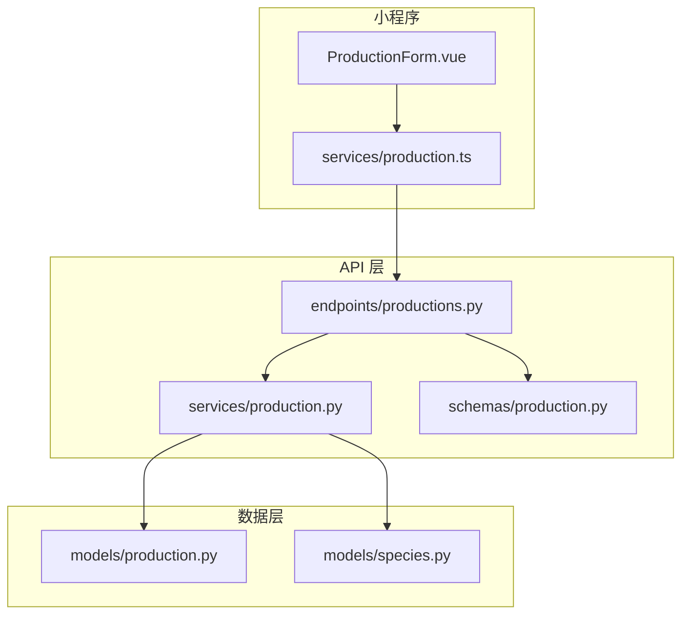
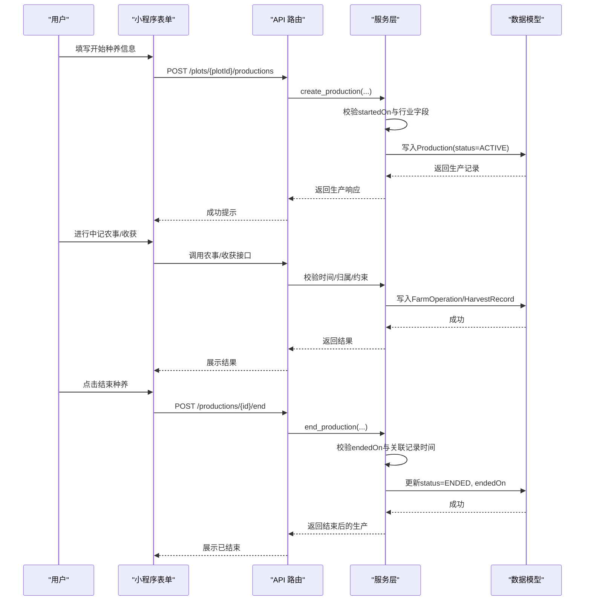
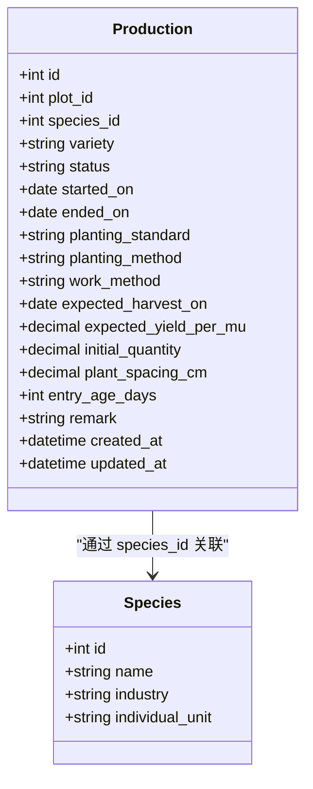
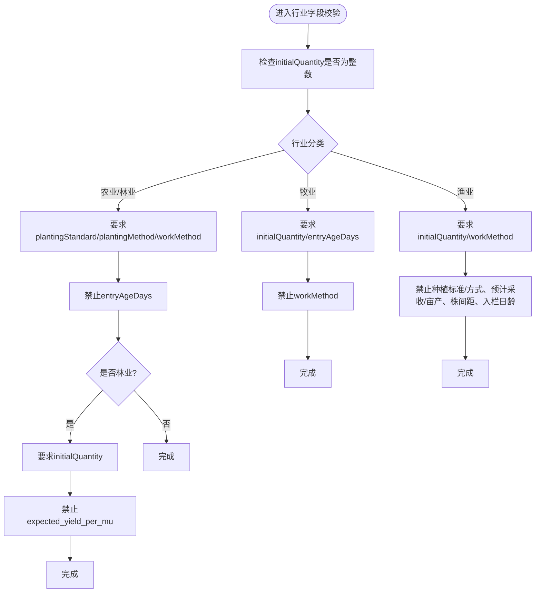
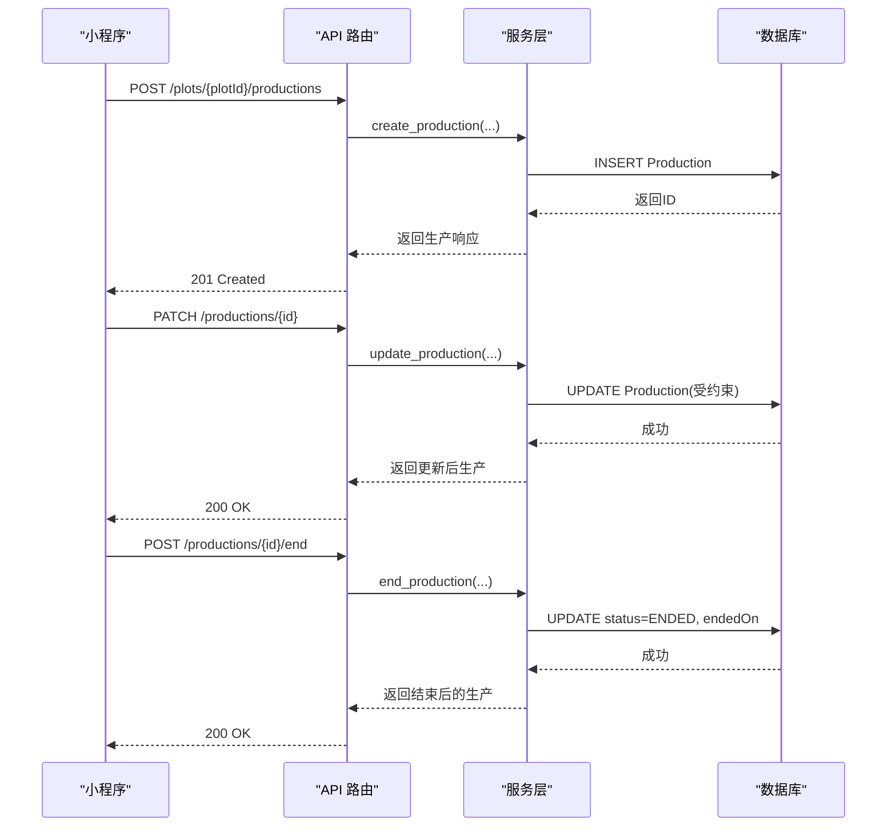
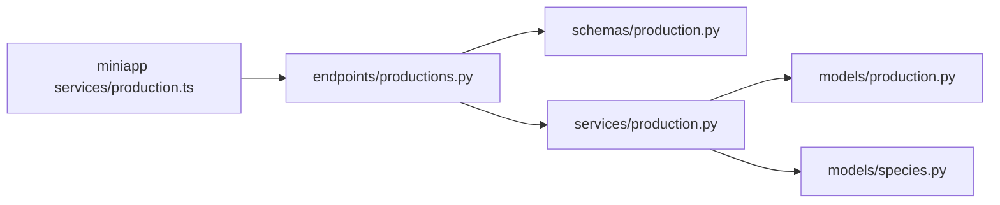

# 生产业务流程

<cite>
**本文引用的文件**   
- [production.py](file://apps/api/app/models/production.py)
- [species.py](file://apps/api/app/models/species.py)
- [production_schema.py](file://apps/api/app/schemas/production.py)
- [production_service.py](file://apps/api/app/services/production.py)
- [productions_endpoint.py](file://apps/api/app/api/v1/endpoints/productions.py)
- [business_rules.md](file://docs/mvp/03-business-rules.md)
- [domain_model.md](file://docs/mvp/02-domain-model.md)
- [production_form.vue](file://apps/miniapp/src/pages/productions/form.vue)
- [production_client.ts](file://apps/miniapp/src/services/production.ts)
</cite>

## 目录
1. [简介](#简介)
2. [项目结构](#项目结构)
3. [核心组件](#核心组件)
4. [架构总览](#架构总览)
5. [详细组件分析](#详细组件分析)
6. [依赖关系分析](#依赖关系分析)
7. [性能与一致性](#性能与一致性)
8. [故障排查指南](#故障排查指南)
9. [结论](#结论)
10. [附录：行业字段与术语对照](#附录行业字段与术语对照)

## 简介
本文件面向 Pocket Farm 系统的“生产”模块，覆盖农业生产、林业、牧业、渔业的统一业务模型与差异化规则，说明从开始种养、进行中到结束种养的完整生命周期管理，以及时间校验、补录限制、数据完整性保证。文档同时给出各行业的特殊字段要求、业务流程示例与异常处理策略，帮助前后端与测试人员一致理解并实现系统行为。

## 项目结构
生产相关能力由后端 API、领域服务、数据模型与前端小程序共同构成：
- 数据模型层定义生产记录、状态枚举、种植标准、作业方式等基础类型。
- 请求/响应模式层负责字段校验、别名映射与序列化。
- 服务层封装跨表校验、行业字段约束、时间与业务日期转换、事务性更新。
- 接口层暴露 RESTful 路由，承载创建、查询、编辑、删除、结束等操作。
- 小程序侧提供表单页面与服务调用，按行业展示不同术语与必填项。

图表来源
- [productions_endpoint.py:71-198](file://apps/api/app/api/v1/endpoints/productions.py#L71-L198)
- [production_service.py:164-446](file://apps/api/app/services/production.py#L164-L446)
- [production_schema.py:15-198](file://apps/api/app/schemas/production.py#L15-L198)
- [production.py:43-79](file://apps/api/app/models/production.py#L43-L79)
- [species.py:12-35](file://apps/api/app/models/species.py#L12-L35)

章节来源
- [productions_endpoint.py:71-198](file://apps/api/app/api/v1/endpoints/productions.py#L71-L198)
- [production_service.py:164-446](file://apps/api/app/services/production.py#L164-L446)
- [production_schema.py:15-198](file://apps/api/app/schemas/production.py#L15-L198)
- [production.py:43-79](file://apps/api/app/models/production.py#L43-L79)
- [species.py:12-35](file://apps/api/app/models/species.py#L12-L35)

## 核心组件
- 生产记录模型：包含地块、物种、品种、状态、起止时间、种植标准/方式、作业方式、预计采收时间、预计亩产、初始数量、株间距、入栏日龄、备注等。
- 状态枚举：ACTIVE（进行中）、ENDED（已结束）。
- 行业与单位：农业、林业、牧业、渔业；个体单位用于数量语义。
- 请求/响应模式：创建、更新、结束、分页列表、详情返回，含字段别名与序列化。
- 服务逻辑：权限校验、行业字段约束、时间校验、关联操作/收获的时间约束、锁定更新、提交事务。
- 接口路由：按地块或生产 ID 进行 CRUD 与结束操作。
- 小程序表单：根据行业动态展示术语与必填项，支持选择地块、提交开始种养。

章节来源
- [production.py:13-79](file://apps/api/app/models/production.py#L13-L79)
- [species.py:12-35](file://apps/api/app/models/species.py#L12-L35)
- [production_schema.py:15-198](file://apps/api/app/schemas/production.py#L15-L198)
- [production_service.py:63-103](file://apps/api/app/services/production.py#L63-L103)
- [productions_endpoint.py:71-198](file://apps/api/app/api/v1/endpoints/productions.py#L71-L198)
- [production_form.vue:21-35](file://apps/miniapp/src/pages/productions/form.vue#L21-L35)

## 架构总览
生产流程贯穿“开始种养 → 进行中 → 结束种养”，期间可多次农事与收获，但收获不自动结束生产。结束需显式调用结束接口，且受时间与关联记录约束。

图表来源
- [productions_endpoint.py:100-187](file://apps/api/app/api/v1/endpoints/productions.py#L100-L187)
- [production_service.py:164-446](file://apps/api/app/services/production.py#L164-L446)
- [production.py:43-79](file://apps/api/app/models/production.py#L43-L79)

## 详细组件分析

### 生产数据模型与状态
- 状态：ACTIVE 表示进行中，ENDED 表示已结束。
- 关键字段：plot_id、species_id、variety、started_on、ended_on、planting_standard、planting_method、work_method、expected_harvest_on、expected_yield_per_mu、initial_quantity、plant_spacing_cm、entry_age_days、remark。
- 时间戳：created_at、updated_at 自动维护。

图表来源
- [production.py:43-79](file://apps/api/app/models/production.py#L43-L79)
- [species.py:27-35](file://apps/api/app/models/species.py#L27-L35)

章节来源
- [production.py:43-79](file://apps/api/app/models/production.py#L43-L79)
- [species.py:12-35](file://apps/api/app/models/species.py#L12-L35)

### 请求与响应模式
- 创建请求：支持多种字段别名，包含物种、品种、开始时间、种植标准/方式、作业方式、预计采收时间、预计亩产、初始数量、株间距、入栏日龄、备注。
- 更新请求：仅允许更新部分字段，核心字段变更受约束。
- 结束请求：仅需结束时间，默认今天。
- 响应：包含物种名称、行业、个体单位、生产字段、时间戳等。

章节来源
- [production_schema.py:15-198](file://apps/api/app/schemas/production.py#L15-L198)

### 服务层：行业字段校验与时间约束
- 行业字段校验：
  - 农业/林业：必须填写种植标准、种植方式、作业方式；林业还需初始数量，禁止预计亩产；禁止入栏日龄。
  - 牧业：必须初始数量与入栏日龄；禁止作业方式；禁止种植标准/方式、预计采收/亩产、株间距。
  - 渔业：必须初始数量与作业方式；禁止种植标准/方式、预计采收/亩产、株间距、入栏日龄。
- 时间校验：
  - started_on 不得晚于当天。
  - ended_on 不得晚于当天，且不得早于 started_on。
  - ended_on 不得早于该生产已有关联农事与收获的业务日期。
- 业务日期转换：使用配置时区将 UTC 时间转换为业务日期进行比较。

图表来源
- [production_service.py:63-103](file://apps/api/app/services/production.py#L63-L103)

章节来源
- [production_service.py:44-103](file://apps/api/app/services/production.py#L44-L103)

### 接口层：生产生命周期操作
- 创建生产：POST /plots/{plot_id}/productions，调用服务层创建并返回生产详情。
- 查询生产：GET /plots/{plot_id}/productions，支持按状态过滤与分页。
- 获取详情：GET /productions/{production_id}。
- 编辑生产：PATCH /productions/{production_id}，核心字段变更受约束。
- 结束生产：POST /productions/{production_id}/end，设置状态为 ENDED 并记录结束时间。
- 删除生产：DELETE /productions/{production_id}，仅在无关联农事与收获且未结束时允许。

图表来源
- [productions_endpoint.py:100-198](file://apps/api/app/api/v1/endpoints/productions.py#L100-L198)
- [production_service.py:164-446](file://apps/api/app/services/production.py#L164-L446)

章节来源
- [productions_endpoint.py:71-198](file://apps/api/app/api/v1/endpoints/productions.py#L71-L198)
- [production_service.py:164-446](file://apps/api/app/services/production.py#L164-L446)

### 小程序表单与服务调用
- 表单页：加载地块信息，选择种类与品种，提交开始种养。
- 服务调用：封装创建、查询、更新、删除、结束生产的请求方法，类型定义与后端一致。
- 交互反馈：成功提示与错误提示，未保存变更保护。

章节来源
- [production_form.vue:21-35](file://apps/miniapp/src/pages/productions/form.vue#L21-L35)
- [production_client.ts:4-121](file://apps/miniapp/src/services/production.ts#L4-L121)

## 依赖关系分析
- 接口层依赖服务层与模式层，服务层依赖数据模型与物种枚举。
- 服务层对农事与收获存在间接依赖（在结束与编辑时校验关联记录），确保数据一致性。
- 小程序依赖客户端服务封装，遵循统一的类型定义。

图表来源
- [productions_endpoint.py:1-32](file://apps/api/app/api/v1/endpoints/productions.py#L1-L32)
- [production_service.py:1-24](file://apps/api/app/services/production.py#L1-L24)
- [production_schema.py:1-13](file://apps/api/app/schemas/production.py#L1-L13)
- [production_client.ts:1-10](file://apps/miniapp/src/services/production.ts#L1-L10)

章节来源
- [productions_endpoint.py:1-32](file://apps/api/app/api/v1/endpoints/productions.py#L1-L32)
- [production_service.py:1-24](file://apps/api/app/services/production.py#L1-L24)
- [production_schema.py:1-13](file://apps/api/app/schemas/production.py#L1-L13)
- [production_client.ts:1-10](file://apps/miniapp/src/services/production.ts#L1-L10)

## 性能与一致性
- 列表查询使用排序与分页，优先显示 ACTIVE 生产并按开始时间与 ID 降序。
- 更新与结束操作使用行级锁（with_for_update）避免并发冲突。
- 时间比较基于配置时区的业务日期，减少时区不一致导致的边界问题。
- 建议在生产高峰期关注数据库连接池与索引使用，确保 plot_id、species_id、status 等常用查询字段有合适索引。

[本节为通用指导，无需特定文件引用]

## 故障排查指南
常见错误与定位：
- 时间校验失败：started_on 或 ended_on 晚于当天，或 ended_on 早于关联农事/收获的业务日期。
- 行业字段缺失或不适用：如农业/林业缺少种植标准/方式/作业方式，牧业缺少初始数量/入栏日龄，渔业缺少作业方式等。
- 已结束生产不可编辑或删除：状态为 ENDED 的生产不允许再次结束、编辑核心字段或删除。
- 关联记录约束：已有农事或收获记录时，不能修改 plot_id、species_id、started_on；也不能删除生产。
- 权限与归属：操作需属于当前农场成员，跨农场移动地块不被允许。

章节来源
- [production_service.py:44-103](file://apps/api/app/services/production.py#L44-L103)
- [production_service.py:220-446](file://apps/api/app/services/production.py#L220-L446)
- [business_rules.md:424-514](file://docs/mvp/03-business-rules.md#L424-L514)

## 结论
Pocket Farm 的生产模块以统一模型支撑多行业差异，通过严格的服务层校验保障数据完整性与业务一致性。生命周期清晰：开始种养创建 ACTIVE 记录，进行中可多次农事与收获，结束种养需显式操作并满足时间与关联约束。前端按行业展示术语与必填项，提升用户体验与准确性。建议在后续迭代中持续完善农事与收获的关联校验与可视化追踪。

[本节为总结，无需特定文件引用]

## 附录：行业字段与术语对照
- 农业/林业：
  - 必填：种植标准、种植方式、作业方式；林业还需初始数量。
  - 可选：品种、预计采收时间、株间距、备注；农业可填预计亩产。
  - 术语：开始种植、采收、结束种植。
- 牧业：
  - 必填：初始数量、入栏日龄。
  - 可选：品种、备注。
  - 术语：开始养殖、出栏、结束养殖。
- 渔业：
  - 必填：初始数量、作业方式。
  - 可选：品种、备注。
  - 术语：开始养殖、捕捞、结束养殖。

章节来源
- [business_rules.md:115-196](file://docs/mvp/03-business-rules.md#L115-L196)
- [business_rules.md:198-228](file://docs/mvp/03-business-rules.md#L198-L228)
- [production_service.py:63-103](file://apps/api/app/services/production.py#L63-L103)