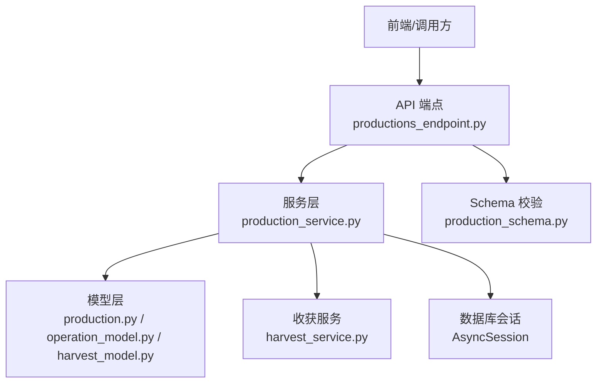
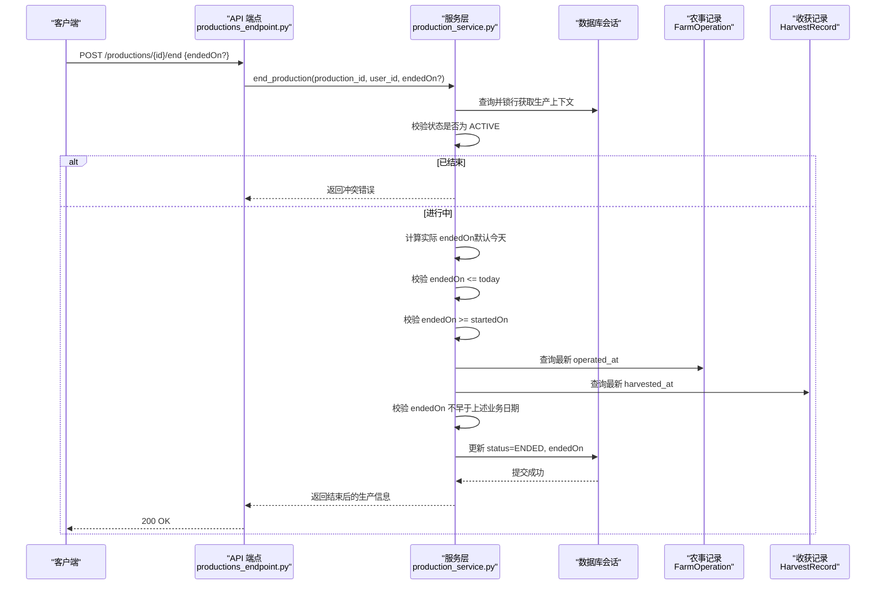
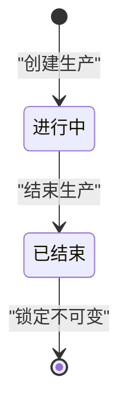
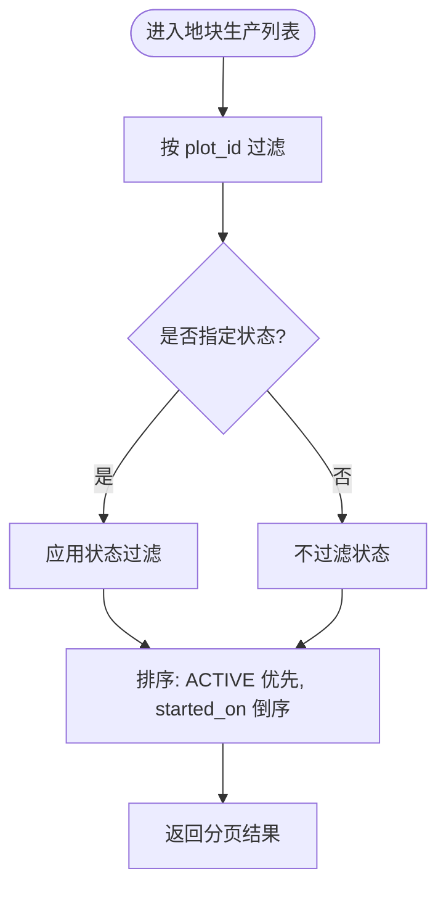
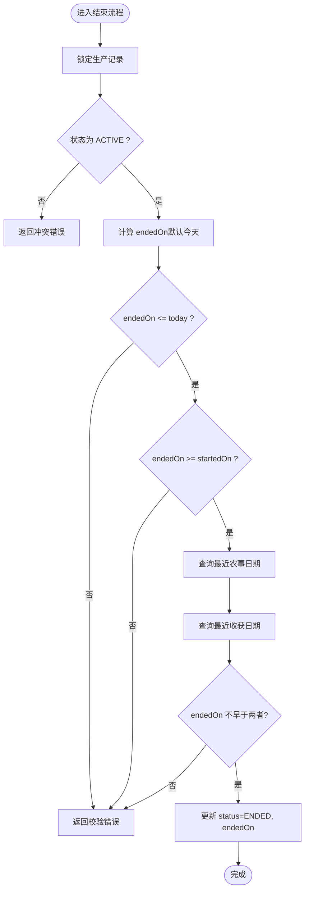
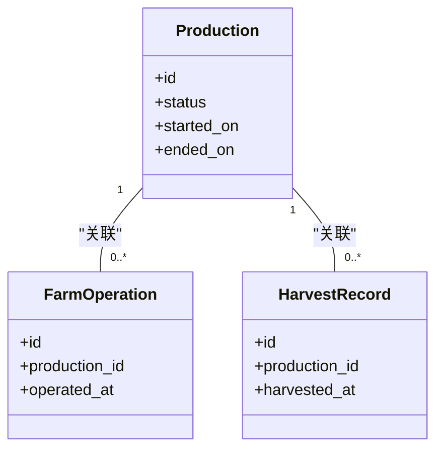
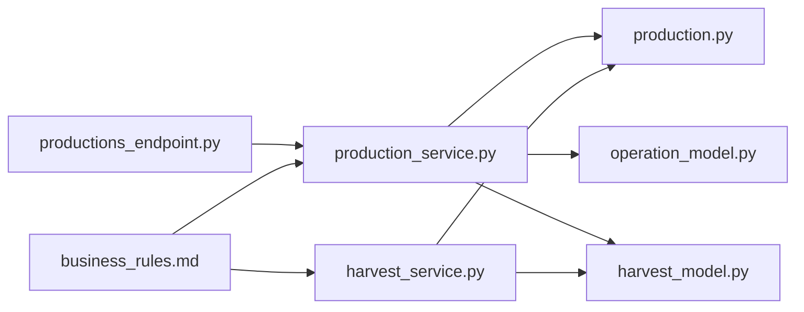

# 生产生命周期管理

<cite>
**本文引用的文件**
- [production.py](file://apps/api/app/models/production.py)
- [production_service.py](file://apps/api/app/services/production.py)
- [production_schema.py](file://apps/api/app/schemas/production.py)
- [productions_endpoint.py](file://apps/api/app/api/v1/endpoints/productions.py)
- [operation_model.py](file://apps/api/app/models/operation.py)
- [harvest_model.py](file://apps/api/app/models/harvest.py)
- [harvest_service.py](file://apps/api/app/services/harvest.py)
- [business_rules.md](file://docs/mvp/03-business-rules.md)
- [test_productions.py](file://apps/api/tests/test_productions.py)
</cite>

## 目录
1. [简介](#简介)
2. [项目结构](#项目结构)
3. [核心组件](#核心组件)
4. [架构总览](#架构总览)
5. [详细组件分析](#详细组件分析)
6. [依赖关系分析](#依赖关系分析)
7. [性能考虑](#性能考虑)
8. [故障排查指南](#故障排查指南)
9. [结论](#结论)
10. [附录](#附录)

## 简介
本文件面向 Pocket Farm 系统的“生产（Production）”生命周期管理，聚焦从开始种养到进行中再到结束养种的完整流程。重点说明：
- ACTIVE 状态的约束与同地块多 ACTIVE Production 的支持
- 结束养种操作的验证规则（endedOn 不能晚于今天、必须满足 endedOn >= startedOn、不早于关联农事和收获的业务日期）
- 已结束 Production 的锁定机制（不可再次结束、不可新增正常 Harvest、关联的 FarmOperation 与 HarvestRecord 同时锁定）
- 未收获也可结束的异常业务场景（种植失败、作物清除、养殖中止等）

## 项目结构
后端采用分层设计：API 端点负责路由与参数绑定，服务层封装业务校验与事务操作，模型层定义数据表结构与枚举，Schema 层负责请求/响应数据契约。测试覆盖关键业务流程与边界条件。

图表来源
- [productions_endpoint.py:71-198](file://apps/api/app/api/v1/endpoints/productions.py#L71-L198)
- [production_service.py:164-446](file://apps/api/app/services/production.py#L164-L446)
- [production_schema.py:15-198](file://apps/api/app/schemas/production.py#L15-L198)
- [operation_model.py:37-80](file://apps/api/app/models/operation.py#L37-L80)
- [harvest_model.py:13-48](file://apps/api/app/models/harvest.py#L13-L48)

章节来源
- [productions_endpoint.py:71-198](file://apps/api/app/api/v1/endpoints/productions.py#L71-L198)
- [production_service.py:164-446](file://apps/api/app/services/production.py#L164-L446)
- [production_schema.py:15-198](file://apps/api/app/schemas/production.py#L15-L198)
- [operation_model.py:37-80](file://apps/api/app/models/operation.py#L37-L80)
- [harvest_model.py:13-48](file://apps/api/app/models/harvest.py#L13-L48)

## 核心组件
- 生产状态与字段
  - 状态枚举：ACTIVE、ENDED
  - 关键字段：started_on、ended_on、status、plot_id、species_id 等
- 服务层能力
  - 创建生产（默认 ACTIVE）
  - 编辑生产（受限于是否已有农事/收获）
  - 删除生产（仅 ACTIVE 且无关联记录）
  - 结束生产（严格时间校验与业务日期约束）
- 收获服务
  - 创建/更新/删除收获记录时要求生产处于 ACTIVE
- 业务规则文档
  - 明确结束规则、同地块多 ACTIVE 支持、锁定策略等

章节来源
- [production.py:13-79](file://apps/api/app/models/production.py#L13-L79)
- [production_service.py:164-446](file://apps/api/app/services/production.py#L164-L446)
- [harvest_service.py:134-281](file://apps/api/app/services/harvest.py#L134-L281)
- [business_rules.md:424-514](file://docs/mvp/03-business-rules.md#L424-L514)

## 架构总览
以下序列图展示“结束生产”的端到端调用链与关键校验点。

图表来源
- [productions_endpoint.py:174-187](file://apps/api/app/api/v1/endpoints/productions.py#L174-L187)
- [production_service.py:403-446](file://apps/api/app/services/production.py#L403-L446)
- [operation_model.py:37-80](file://apps/api/app/models/operation.py#L37-L80)
- [harvest_model.py:13-48](file://apps/api/app/models/harvest.py#L13-L48)

## 详细组件分析

### 生产状态机与流转
- 初始状态：创建生产时默认 ACTIVE
- 结束状态：通过结束接口将状态改为 ENDED，并写入 endedOn
- 约束要点：
  - 只有 ACTIVE 的生产可被结束
  - 结束一次后不可再次结束
  - 结束不自动创建额外记录，仅修改现有生产记录

图表来源
- [production_service.py:164-217](file://apps/api/app/services/production.py#L164-L217)
- [production_service.py:403-446](file://apps/api/app/services/production.py#L403-L446)

章节来源
- [production_service.py:164-217](file://apps/api/app/services/production.py#L164-L217)
- [production_service.py:403-446](file://apps/api/app/services/production.py#L403-L446)

### 同地块多 ACTIVE Production 的支持
- 系统允许同一地块存在多条 ACTIVE 生产（例如不同作物或批次）
- 列表查询按状态优先排序，ACTIVE 在前，并按 started_on 倒序
- 业务上所有涉及“当前生产”的操作需基于 production_id 精确访问，避免混淆

图表来源
- [production_service.py:112-138](file://apps/api/app/services/production.py#L112-L138)

章节来源
- [production_service.py:112-138](file://apps/api/app/services/production.py#L112-L138)
- [business_rules.md:562-577](file://docs/mvp/03-business-rules.md#L562-L577)

### 结束生产的验证规则与时序
结束生产的核心校验包括：
- 只能对 ACTIVE 生产执行结束
- endedOn 不能晚于今天（使用配置时区计算）
- endedOn 必须 >= startedOn
- endedOn 不得早于该生产关联的最近一次农事 operated_at 的业务日期
- endedOn 不得早于该生产关联的最近一次收获 harvested_at 的业务日期

图表来源
- [production_service.py:403-446](file://apps/api/app/services/production.py#L403-L446)
- [operation_model.py:37-80](file://apps/api/app/models/operation.py#L37-L80)
- [harvest_model.py:13-48](file://apps/api/app/models/harvest.py#L13-L48)

章节来源
- [production_service.py:403-446](file://apps/api/app/services/production.py#L403-L446)
- [business_rules.md:424-445](file://docs/mvp/03-business-rules.md#L424-L445)

### 已结束生产的锁定机制
- 不可再次结束：服务层在结束前检查状态，非 ACTIVE 直接拒绝
- 不可新增正常 Harvest：收获服务在创建/更新/删除收获时要求生产为 ACTIVE，否则拒绝
- 关联记录锁定：业务规则明确，生产结束后其关联的 FarmOperation 与 HarvestRecord 同时锁定，不允许新增、修改或删除

图表来源
- [operation_model.py:37-80](file://apps/api/app/models/operation.py#L37-L80)
- [harvest_model.py:13-48](file://apps/api/app/models/harvest.py#L13-L48)
- [harvest_service.py:134-178](file://apps/api/app/services/harvest.py#L134-L178)
- [business_rules.md:498-514](file://docs/mvp/03-business-rules.md#L498-L514)

章节来源
- [production_service.py:403-446](file://apps/api/app/services/production.py#L403-L446)
- [harvest_service.py:134-178](file://apps/api/app/services/harvest.py#L134-L178)
- [business_rules.md:498-514](file://docs/mvp/03-business-rules.md#L498-L514)

### 未收获也可结束的异常场景
- 业务规则明确允许“开始→0次收获→结束”，用于种植失败、作物清除、养殖中止等场景
- 结束流程不强制要求存在 HarvestRecord，只要满足时间约束即可

章节来源
- [business_rules.md:448-465](file://docs/mvp/03-business-rules.md#L448-L465)
- [production_service.py:403-446](file://apps/api/app/services/production.py#L403-L446)

### 编辑与删除的限制
- 编辑限制：
  - 已结束生产不可编辑
  - 若已存在农事或收获记录，则禁止修改 plot_id、species_id、started_on 等核心字段
- 删除限制：
  - 已结束生产不可删除
  - 有农事或收获记录的生产不可删除

章节来源
- [production_service.py:220-365](file://apps/api/app/services/production.py#L220-L365)
- [production_service.py:368-401](file://apps/api/app/services/production.py#L368-L401)
- [business_rules.md:596-609](file://docs/mvp/03-business-rules.md#L596-L609)

## 依赖关系分析
- 端点依赖服务层进行业务校验与持久化
- 服务层依赖模型层进行数据访问与约束
- 收获服务在生产结束时会受到生产状态影响，确保一致性
- 业务规则文档作为权威依据，指导实现细节

图表来源
- [productions_endpoint.py:71-198](file://apps/api/app/api/v1/endpoints/productions.py#L71-L198)
- [production_service.py:164-446](file://apps/api/app/services/production.py#L164-L446)
- [harvest_service.py:134-281](file://apps/api/app/services/harvest.py#L134-L281)
- [business_rules.md:424-514](file://docs/mvp/03-business-rules.md#L424-L514)

章节来源
- [productions_endpoint.py:71-198](file://apps/api/app/api/v1/endpoints/productions.py#L71-L198)
- [production_service.py:164-446](file://apps/api/app/services/production.py#L164-L446)
- [harvest_service.py:134-281](file://apps/api/app/services/harvest.py#L134-L281)
- [business_rules.md:424-514](file://docs/mvp/03-business-rules.md#L424-L514)

## 性能考虑
- 结束流程中查询最近农事与收获日期使用聚合函数，减少全表扫描开销
- 列表查询使用 case 排序与分页，提升大数据量下的表现
- 使用 with_for_update 锁定行，避免并发下重复结束或非法编辑

[本节为通用性能建议，不直接分析具体代码片段]

## 故障排查指南
常见错误与定位方法：
- 404 未找到：用户无权访问或资源不存在（如非农场成员尝试结束他人生产）
- 409 业务冲突：生产已结束、重复结束、试图编辑/删除已结束生产
- 422 校验错误：startedOn/endedOn 时间非法、数量格式不符、必填字段缺失

定位步骤：
- 检查请求中的 endedOn 是否超过当天
- 检查 endedOn 与 startedOn 的大小关系
- 检查是否存在农事或收获记录，以及其业务日期是否晚于 endedOn
- 确认用户权限与所属农场

章节来源
- [production_service.py:403-446](file://apps/api/app/services/production.py#L403-L446)
- [harvest_service.py:134-178](file://apps/api/app/services/harvest.py#L134-L178)
- [test_productions.py:361-412](file://apps/api/tests/test_productions.py#L361-L412)

## 结论
Pocket Farm 的生产生命周期管理以 ACTIVE/ENDED 为核心状态，围绕严格的日期与业务约束保障数据一致性与业务正确性。系统支持同地块多 ACTIVE 生产，并在结束时锁定相关农事与收获记录，防止后续误操作。未收获也可结束的规则覆盖了种植失败、作物清除、养殖中止等异常场景，确保业务闭环。

[本节为总结性内容，不直接分析具体代码片段]

## 附录
- 关键 API 路径参考
  - 开始种养：POST /plots/{plot_id}/productions
  - 结束生产：POST /productions/{production_id}/end
  - 编辑生产：PATCH /productions/{production_id}
  - 删除生产：DELETE /productions/{production_id}
  - 查看生产：GET /productions/{production_id}
  - 地块生产列表：GET /plots/{plot_id}/productions

章节来源
- [productions_endpoint.py:71-198](file://apps/api/app/api/v1/endpoints/productions.py#L71-L198)
- [production_schema.py:15-198](file://apps/api/app/schemas/production.py#L15-L198)