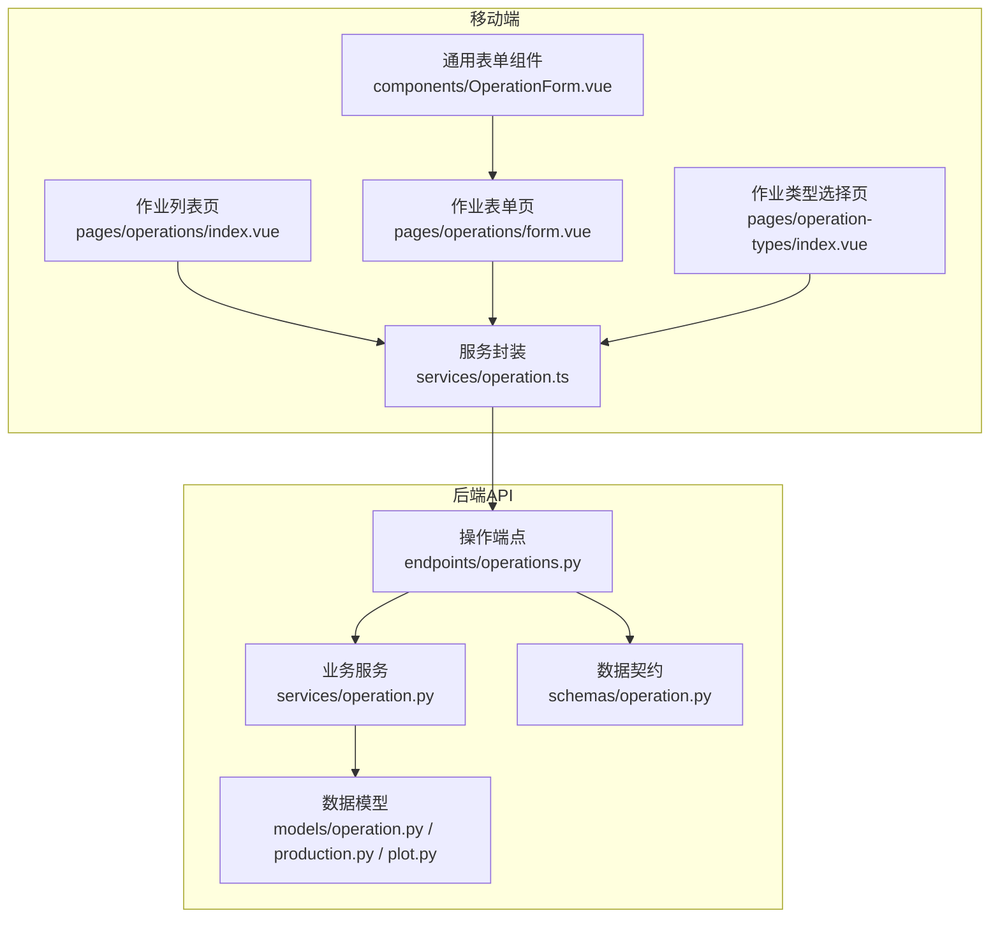
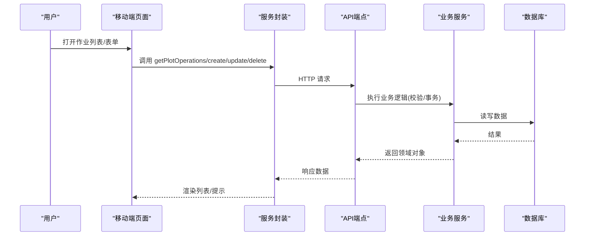
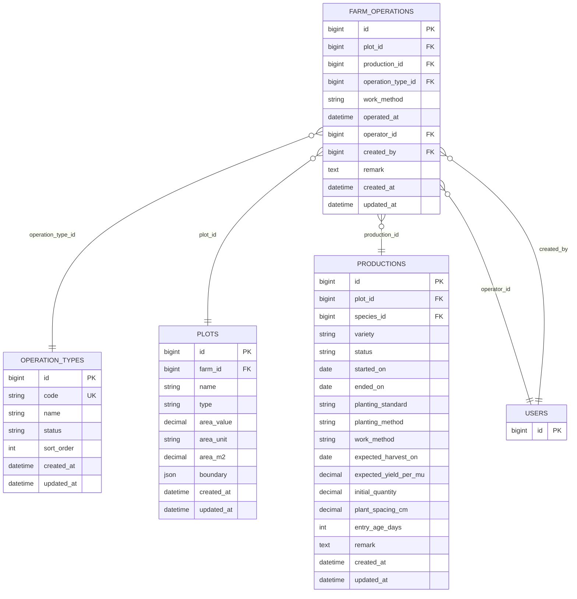
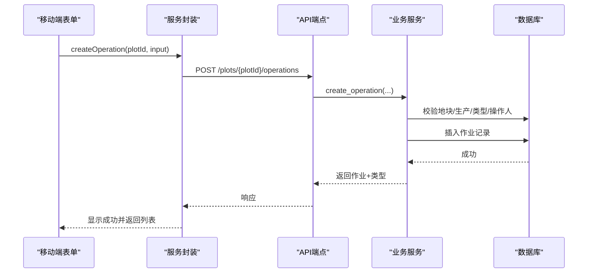
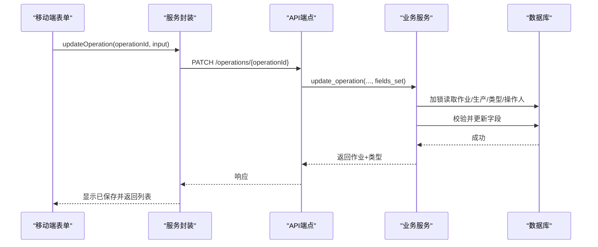
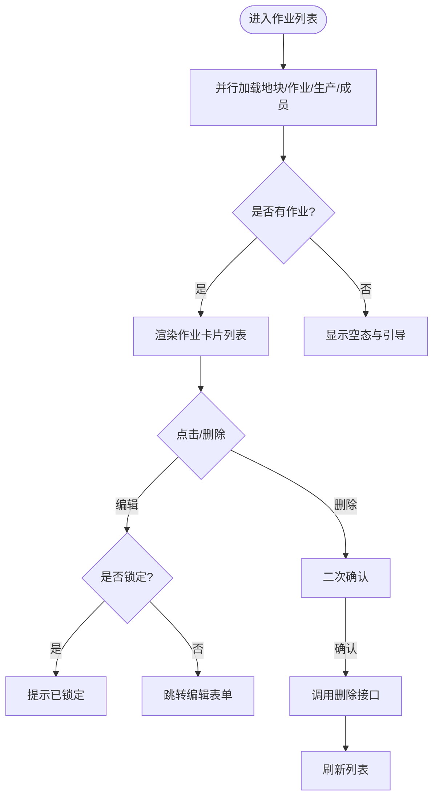
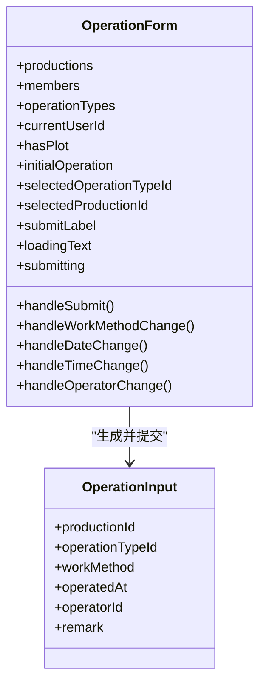
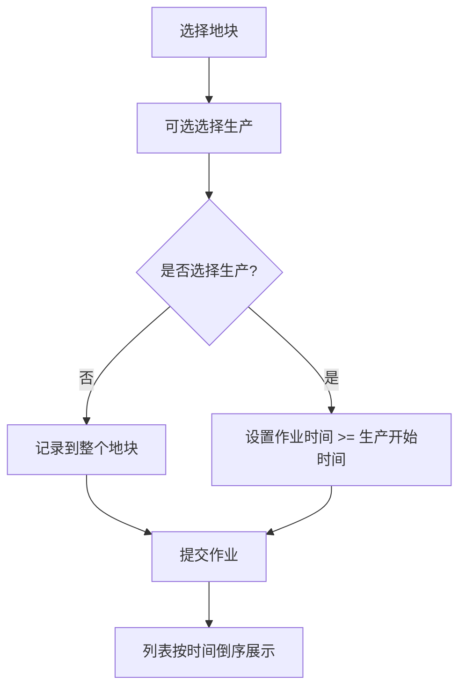
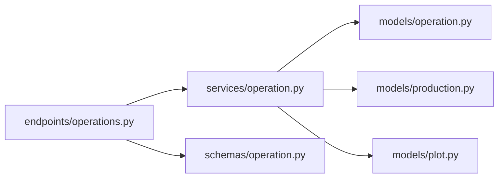

# 作业记录模块

<cite>
**本文引用的文件**
- [apps/api/app/models/operation.py](file://apps/api/app/models/operation.py)
- [apps/api/app/schemas/operation.py](file://apps/api/app/schemas/operation.py)
- [apps/api/app/services/operation.py](file://apps/api/app/services/operation.py)
- [apps/api/app/api/v1/endpoints/operations.py](file://apps/api/app/api/v1/endpoints/operations.py)
- [apps/api/app/models/production.py](file://apps/api/app/models/production.py)
- [apps/api/app/models/plot.py](file://apps/api/app/models/plot.py)
- [apps/miniapp/src/pages/operations/index.vue](file://apps/miniapp/src/pages/operations/index.vue)
- [apps/miniapp/src/pages/operations/form.vue](file://apps/miniapp/src/pages/operations/form.vue)
- [apps/miniapp/src/components/OperationForm.vue](file://apps/miniapp/src/components/OperationForm.vue)
- [apps/miniapp/src/pages/operation-types/index.vue](file://apps/miniapp/src/pages/operation-types/index.vue)
- [apps/miniapp/src/services/operation.ts](file://apps/miniapp/src/services/operation.ts)
</cite>

## 目录
1. [简介](#简介)
2. [项目结构](#项目结构)
3. [核心组件](#核心组件)
4. [架构总览](#架构总览)
5. [详细组件分析](#详细组件分析)
6. [依赖关系分析](#依赖关系分析)
7. [性能与可扩展性](#性能与可扩展性)
8. [故障排查指南](#故障排查指南)
9. [结论](#结论)
10. [附录](#附录)

## 简介
本模块为 Pocket Farm 的“作业记录”功能，用于记录和管理农事活动（如施肥、灌溉、打药等），并支持按地块维度进行查询、编辑与删除。作业可关联到具体生产批次（生产），也可仅记录到整个地块。系统提供作业类型标准化管理、时间线展示、移动端表单采集、权限校验与锁定机制，确保数据一致性与可追溯性。

## 项目结构
后端采用 FastAPI + SQLAlchemy 异步服务分层：模型层定义实体与枚举；Schema 层负责请求/响应校验与序列化；Service 层实现业务规则与事务；Endpoint 层暴露 REST API。前端基于 uni-app（Vue）构建移动端页面与服务调用封装。

**图表来源**
- [apps/miniapp/src/pages/operations/index.vue:1-359](file://apps/miniapp/src/pages/operations/index.vue#L1-L359)
- [apps/miniapp/src/pages/operations/form.vue:1-335](file://apps/miniapp/src/pages/operations/form.vue#L1-L335)
- [apps/miniapp/src/components/OperationForm.vue:1-364](file://apps/miniapp/src/components/OperationForm.vue#L1-L364)
- [apps/miniapp/src/pages/operation-types/index.vue:1-83](file://apps/miniapp/src/pages/operation-types/index.vue#L1-L83)
- [apps/miniapp/src/services/operation.ts:1-91](file://apps/miniapp/src/services/operation.ts#L1-L91)
- [apps/api/app/api/v1/endpoints/operations.py:1-168](file://apps/api/app/api/v1/endpoints/operations.py#L1-L168)
- [apps/api/app/services/operation.py:1-307](file://apps/api/app/services/operation.py#L1-L307)
- [apps/api/app/models/operation.py:1-80](file://apps/api/app/models/operation.py#L1-L80)
- [apps/api/app/models/production.py:1-79](file://apps/api/app/models/production.py#L1-L79)
- [apps/api/app/models/plot.py:1-54](file://apps/api/app/models/plot.py#L1-L54)
- [apps/api/app/schemas/operation.py:1-122](file://apps/api/app/schemas/operation.py#L1-L122)

**章节来源**
- [apps/api/app/models/operation.py:1-80](file://apps/api/app/models/operation.py#L1-L80)
- [apps/api/app/models/production.py:1-79](file://apps/api/app/models/production.py#L1-L79)
- [apps/api/app/models/plot.py:1-54](file://apps/api/app/models/plot.py#L1-L54)
- [apps/api/app/schemas/operation.py:1-122](file://apps/api/app/schemas/operation.py#L1-L122)
- [apps/api/app/services/operation.py:1-307](file://apps/api/app/services/operation.py#L1-L307)
- [apps/api/app/api/v1/endpoints/operations.py:1-168](file://apps/api/app/api/v1/endpoints/operations.py#L1-L168)
- [apps/miniapp/src/pages/operations/index.vue:1-359](file://apps/miniapp/src/pages/operations/index.vue#L1-L359)
- [apps/miniapp/src/pages/operations/form.vue:1-335](file://apps/miniapp/src/pages/operations/form.vue#L1-L335)
- [apps/miniapp/src/components/OperationForm.vue:1-364](file://apps/miniapp/src/components/OperationForm.vue#L1-L364)
- [apps/miniapp/src/pages/operation-types/index.vue:1-83](file://apps/miniapp/src/pages/operation-types/index.vue#L1-L83)
- [apps/miniapp/src/services/operation.ts:1-91](file://apps/miniapp/src/services/operation.ts#L1-L91)

## 核心组件
- 数据模型
  - 作业类型 OperationType：包含编码、名称、状态、排序等，用于标准化作业分类。
  - 农场作业 FarmOperation：记录一次农事活动，关联地块、生产、作业类型、作业方式、作业时间、操作人、备注等。
- 数据契约
  - Create/Update 请求体与响应体，统一字段命名与校验（含时区校验）。
- 业务服务
  - 创建/更新/删除作业、分页查询作业与作业类型、权限与一致性校验（地块归属、生产状态、操作人归属、时间约束）。
- API 端点
  - 获取作业列表、创建作业、编辑作业、删除作业、获取作业类型。
- 移动端
  - 作业列表页：展示作业卡片、锁定状态、删除确认。
  - 作业表单页：选择地块、作业类型、关联生产、作业方式、日期时间、操作人、备注。
  - 作业类型选择页：网格展示可用类型，返回选中项。
  - 服务封装：对后端接口进行统一请求封装与类型定义。

**章节来源**
- [apps/api/app/models/operation.py:1-80](file://apps/api/app/models/operation.py#L1-L80)
- [apps/api/app/schemas/operation.py:1-122](file://apps/api/app/schemas/operation.py#L1-L122)
- [apps/api/app/services/operation.py:1-307](file://apps/api/app/services/operation.py#L1-L307)
- [apps/api/app/api/v1/endpoints/operations.py:1-168](file://apps/api/app/api/v1/endpoints/operations.py#L1-L168)
- [apps/miniapp/src/pages/operations/index.vue:1-359](file://apps/miniapp/src/pages/operations/index.vue#L1-L359)
- [apps/miniapp/src/pages/operations/form.vue:1-335](file://apps/miniapp/src/pages/operations/form.vue#L1-L335)
- [apps/miniapp/src/components/OperationForm.vue:1-364](file://apps/miniapp/src/components/OperationForm.vue#L1-L364)
- [apps/miniapp/src/pages/operation-types/index.vue:1-83](file://apps/miniapp/src/pages/operation-types/index.vue#L1-L83)
- [apps/miniapp/src/services/operation.ts:1-91](file://apps/miniapp/src/services/operation.ts#L1-L91)

## 架构总览
作业记录模块遵循“前端页面 -> 服务封装 -> 后端端点 -> 业务服务 -> 数据模型”的分层架构。移动端通过服务封装发起 HTTP 请求，后端端点进行参数绑定与鉴权，交由服务层执行复杂校验与持久化，最终返回结构化响应。

**图表来源**
- [apps/miniapp/src/services/operation.ts:55-90](file://apps/miniapp/src/services/operation.ts#L55-L90)
- [apps/api/app/api/v1/endpoints/operations.py:63-168](file://apps/api/app/api/v1/endpoints/operations.py#L63-L168)
- [apps/api/app/services/operation.py:139-307](file://apps/api/app/services/operation.py#L139-L307)

## 详细组件分析

### 数据模型与关系
- 作业类型 OperationType
  - 关键字段：code、name、status、sort_order、created_at、updated_at
  - 用途：标准化作业分类，供前端选择与后端校验。
- 农场作业 FarmOperation
  - 关键字段：plot_id、production_id、operation_type_id、work_method、operated_at、operator_id、created_by、remark
  - 关联：
    - 地块 Plot：通过 plot_id 外键关联
    - 生产 Production：可选关联 production_id
    - 作业类型 OperationType：通过 operation_type_id 外键关联
    - 用户 User：operator_id、created_by
- 生产 Production
  - 关键字段：started_on、ended_on、status、work_method 等
  - 作用：限定作业时间范围与可编辑性。
- 地块 Plot
  - 关键字段：farm_id、name、type、area_*、boundary
  - 作用：作业记录的基本空间单元。

**图表来源**
- [apps/api/app/models/operation.py:18-80](file://apps/api/app/models/operation.py#L18-L80)
- [apps/api/app/models/production.py:43-79](file://apps/api/app/models/production.py#L43-L79)
- [apps/api/app/models/plot.py:31-54](file://apps/api/app/models/plot.py#L31-L54)

**章节来源**
- [apps/api/app/models/operation.py:18-80](file://apps/api/app/models/operation.py#L18-L80)
- [apps/api/app/models/production.py:43-79](file://apps/api/app/models/production.py#L43-L79)
- [apps/api/app/models/plot.py:31-54](file://apps/api/app/models/plot.py#L31-L54)

### API 端点与数据契约
- 获取作业列表
  - GET /plots/{plot_id}/operations?page=...&pageSize=...
  - 返回分页的作业列表，包含作业类型详情。
- 创建作业
  - POST /plots/{plot_id}/operations
  - 请求体包含作业类型、生产、作业方式、作业时间、操作人、备注。
- 编辑作业
  - PATCH /operations/{operation_id}
  - 支持部分更新，服务端根据 fields_set 判断变更字段。
- 删除作业
  - DELETE /operations/{operation_id}
- 获取作业类型
  - GET /operation-types?page=...&pageSize=...
  - 返回活跃的作业类型分页。

数据契约要点
- 时间字段需带时区信息，服务端会转换为 UTC 无时区存储。
- 作业类型必须存在且处于激活状态。
- 作业时间与生产开始时间的约束：不得早于生产开始时间，不得晚于当前时间。
- 操作人必须属于地块所属农场。

**章节来源**
- [apps/api/app/api/v1/endpoints/operations.py:63-168](file://apps/api/app/api/v1/endpoints/operations.py#L63-L168)
- [apps/api/app/schemas/operation.py:15-122](file://apps/api/app/schemas/operation.py#L15-L122)
- [apps/api/app/services/operation.py:33-96](file://apps/api/app/services/operation.py#L33-L96)

### 业务流程与时序

#### 创建作业时序

**图表来源**
- [apps/miniapp/src/components/OperationForm.vue:250-280](file://apps/miniapp/src/components/OperationForm.vue#L250-L280)
- [apps/miniapp/src/services/operation.ts:69-75](file://apps/miniapp/src/services/operation.ts#L69-L75)
- [apps/api/app/api/v1/endpoints/operations.py:91-113](file://apps/api/app/api/v1/endpoints/operations.py#L91-L113)
- [apps/api/app/services/operation.py:139-181](file://apps/api/app/services/operation.py#L139-L181)

#### 编辑作业时序

**图表来源**
- [apps/miniapp/src/pages/operations/form.vue:220-240](file://apps/miniapp/src/pages/operations/form.vue#L220-L240)
- [apps/miniapp/src/services/operation.ts:77-85](file://apps/miniapp/src/services/operation.ts#L77-L85)
- [apps/api/app/api/v1/endpoints/operations.py:116-135](file://apps/api/app/api/v1/endpoints/operations.py#L116-L135)
- [apps/api/app/services/operation.py:222-289](file://apps/api/app/services/operation.py#L222-L289)

### 作业列表与时间线
- 列表展示
  - 按作业时间倒序排列，每条记录显示作业类型图标与名称、作业时间、关联生产或“整个地块”、操作人与记录人。
  - 若作业关联的生产已结束，则标记为“已锁定”，不可编辑或删除。
- 空态与错误态
  - 无作业时展示引导文案与“记农事”按钮。
  - 加载失败提供重试入口。

**图表来源**
- [apps/miniapp/src/pages/operations/index.vue:140-211](file://apps/miniapp/src/pages/operations/index.vue#L140-L211)

**章节来源**
- [apps/miniapp/src/pages/operations/index.vue:1-359](file://apps/miniapp/src/pages/operations/index.vue#L1-L359)

### 作业表单与类型管理
- 表单字段
  - 作业类型：必填，从作业类型选择页选取。
  - 关联生产：选填，默认记录到整个地块；若关联生产，则作业时间不得早于生产开始时间。
  - 作业方式：人工/机械。
  - 作业日期与时间：必填，组合为 ISO 字符串提交。
  - 操作人：必填，从农场成员中选择。
  - 备注：选填，最大长度限制。
- 类型管理
  - 作业类型选择页以网格形式展示可用类型，点击后通过事件通道回传选中项。
  - 后端仅返回激活状态的作业类型。

**图表来源**
- [apps/miniapp/src/components/OperationForm.vue:96-119](file://apps/miniapp/src/components/OperationForm.vue#L96-L119)
- [apps/miniapp/src/components/OperationForm.vue:250-280](file://apps/miniapp/src/components/OperationForm.vue#L250-L280)
- [apps/miniapp/src/services/operation.ts:44-51](file://apps/miniapp/src/services/operation.ts#L44-L51)

**章节来源**
- [apps/miniapp/src/components/OperationForm.vue:1-364](file://apps/miniapp/src/components/OperationForm.vue#L1-L364)
- [apps/miniapp/src/pages/operation-types/index.vue:1-83](file://apps/miniapp/src/pages/operation-types/index.vue#L1-L83)
- [apps/miniapp/src/services/operation.ts:44-91](file://apps/miniapp/src/services/operation.ts#L44-L91)

### 作业与生产、地块的关联与时间线管理
- 关联关系
  - 作业必须属于某个地块；可选关联到该地块下的某次生产。
  - 当作业关联生产时，其时间不得早于生产的开始时间；若生产已结束，作业将被锁定，禁止编辑与删除。
- 时间线管理
  - 列表按作业时间倒序展示，便于回溯历史。
  - 表单中日期选择器受生产开始时间约束，避免非法录入。

**图表来源**
- [apps/miniapp/src/components/OperationForm.vue:199-207](file://apps/miniapp/src/components/OperationForm.vue#L199-L207)
- [apps/api/app/services/operation.py:33-44](file://apps/api/app/services/operation.py#L33-L44)
- [apps/api/app/services/operation.py:61-80](file://apps/api/app/services/operation.py#L61-L80)

**章节来源**
- [apps/api/app/services/operation.py:33-80](file://apps/api/app/services/operation.py#L33-L80)
- [apps/miniapp/src/components/OperationForm.vue:199-207](file://apps/miniapp/src/components/OperationForm.vue#L199-L207)

### 作业类型标准化
- 后端仅返回激活状态的作业类型，保证前端只可选择有效类型。
- 前端以图标+名称的方式展示类型，提升识别度。
- 作业类型具备排序字段，便于统一展示顺序。

**章节来源**
- [apps/api/app/services/operation.py:99-114](file://apps/api/app/services/operation.py#L99-L114)
- [apps/miniapp/src/pages/operation-types/index.vue:45-65](file://apps/miniapp/src/pages/operation-types/index.vue#L45-L65)

### 作业统计分析与历史记录追溯
- 统计分析
  - 可通过分页接口获取作业列表，结合前端或外部工具进行汇总（如按作业类型、操作人、时间段统计）。
  - 由于接口支持分页与总数，适合做基础统计报表。
- 历史追溯
  - 作业记录包含操作人、记录人、作业时间、备注等信息，配合生产关联可实现批次级追溯。
  - 列表按时间倒序展示，便于快速定位最近作业。

[本节为概念性说明，不直接分析具体文件]

### 移动端数据采集优化方案
- 表单体验
  - 使用本地 picker 选择日期与时间，减少输入错误。
  - 自动填充当前日期与时间，降低录入成本。
  - 操作人默认选择当前用户，减少选择步骤。
- 网络与并发
  - 列表页并行加载地块、作业、生产、成员，缩短首屏时间。
  - 提交时禁用重复提交，防止重复请求。
- 错误处理
  - 未授权自动跳转登录。
  - 加载失败提供重试入口。
  - 删除前二次确认，避免误删。

**章节来源**
- [apps/miniapp/src/pages/operations/index.vue:140-168](file://apps/miniapp/src/pages/operations/index.vue#L140-L168)
- [apps/miniapp/src/pages/operations/form.vue:102-176](file://apps/miniapp/src/pages/operations/form.vue#L102-L176)
- [apps/miniapp/src/components/OperationForm.vue:127-188](file://apps/miniapp/src/components/OperationForm.vue#L127-L188)

## 依赖关系分析
- 耦合与内聚
  - 端点层仅负责参数绑定与响应包装，业务逻辑集中在服务层，内聚度高。
  - 服务层依赖模型与外部服务（地块、生产、用户），通过函数式接口解耦。
- 外部依赖
  - 数据库：MySQL（通过 SQLAlchemy 异步会话）。
  - 前端组件库：uni-app 与 uv-ui 组件。
- 潜在循环依赖
  - 当前代码未发现循环导入；服务层通过显式 import 依赖模型与其他服务。

**图表来源**
- [apps/api/app/api/v1/endpoints/operations.py:1-168](file://apps/api/app/api/v1/endpoints/operations.py#L1-L168)
- [apps/api/app/services/operation.py:1-307](file://apps/api/app/services/operation.py#L1-L307)
- [apps/api/app/models/operation.py:1-80](file://apps/api/app/models/operation.py#L1-L80)
- [apps/api/app/models/production.py:1-79](file://apps/api/app/models/production.py#L1-L79)
- [apps/api/app/models/plot.py:1-54](file://apps/api/app/models/plot.py#L1-L54)
- [apps/api/app/schemas/operation.py:1-122](file://apps/api/app/schemas/operation.py#L1-L122)

**章节来源**
- [apps/api/app/api/v1/endpoints/operations.py:1-168](file://apps/api/app/api/v1/endpoints/operations.py#L1-L168)
- [apps/api/app/services/operation.py:1-307](file://apps/api/app/services/operation.py#L1-L307)

## 性能与可扩展性
- 查询性能
  - 列表查询使用分页与排序，避免全量拉取。
  - 作业列表按 operated_at 与 id 降序，利于索引利用。
- 并发与一致性
  - 编辑与删除时使用行级锁（with_for_update），防止并发修改导致不一致。
- 可扩展建议
  - 增加更多筛选条件（按作业类型、操作人、时间段）。
  - 引入缓存层（如 Redis）缓存热点作业类型与地块信息。
  - 对大数据量场景考虑分表或归档策略。

[本节为通用指导，不直接分析具体文件]

## 故障排查指南
- 常见错误
  - 未授权：401，前端自动跳转登录。
  - 资源不存在：404，检查 ID 与权限。
  - 业务冲突：409，如尝试修改已结束生产的作业。
  - 参数校验失败：422，如时间不带时区、作业类型无效、操作人不属于农场。
- 排查步骤
  - 检查前端请求参数是否符合 Schema 要求（特别是时间与时区）。
  - 查看后端日志中的错误码与消息。
  - 确认作业关联的生产状态与地块归属。
  - 在列表中确认作业是否被锁定（关联生产已结束）。

**章节来源**
- [apps/api/app/services/operation.py:17-27](file://apps/api/app/services/operation.py#L17-L27)
- [apps/api/app/services/operation.py:61-96](file://apps/api/app/services/operation.py#L61-L96)
- [apps/miniapp/src/pages/operations/index.vue:107-110](file://apps/miniapp/src/pages/operations/index.vue#L107-L110)
- [apps/miniapp/src/pages/operations/form.vue:97-100](file://apps/miniapp/src/pages/operations/form.vue#L97-L100)

## 结论
作业记录模块通过标准化的作业类型、严格的权限与一致性校验、以及友好的移动端表单，实现了农事活动的可靠记录与追溯。系统在设计上注重前后端职责分离、数据契约清晰、业务流程闭环，具备良好的可维护性与扩展性。未来可进一步增强筛选与统计能力，并结合缓存与分片策略提升大规模数据下的性能表现。

[本节为总结性内容，不直接分析具体文件]

## 附录
- 关键接口路径
  - 获取作业列表：GET /plots/{plot_id}/operations
  - 创建作业：POST /plots/{plot_id}/operations
  - 编辑作业：PATCH /operations/{operation_id}
  - 删除作业：DELETE /operations/{operation_id}
  - 获取作业类型：GET /operation-types

**章节来源**
- [apps/api/app/api/v1/endpoints/operations.py:63-168](file://apps/api/app/api/v1/endpoints/operations.py#L63-L168)
- [apps/miniapp/src/services/operation.ts:55-90](file://apps/miniapp/src/services/operation.ts#L55-L90)