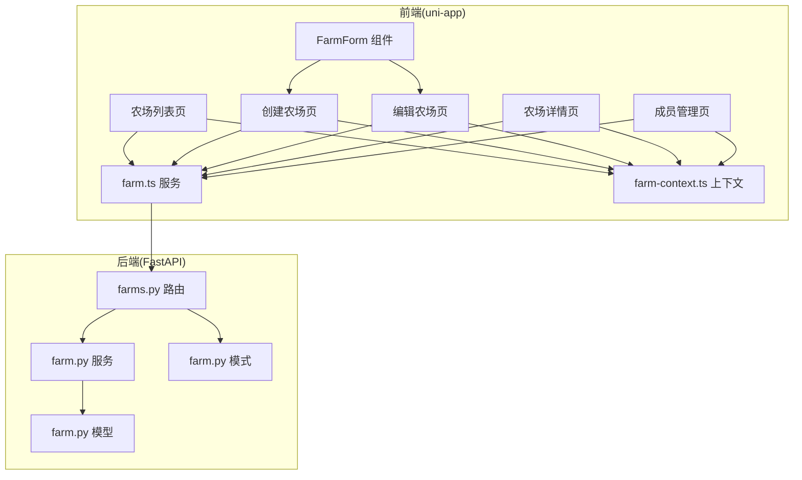
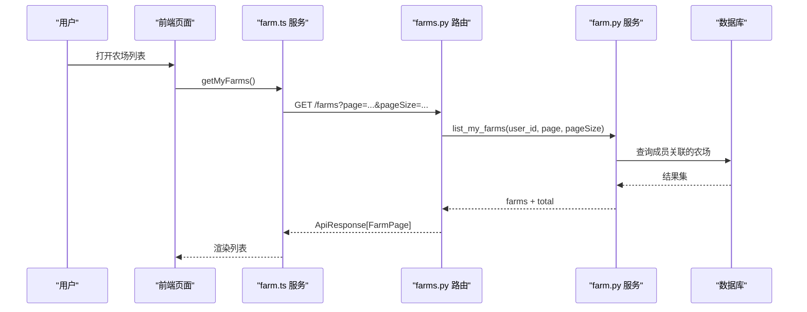
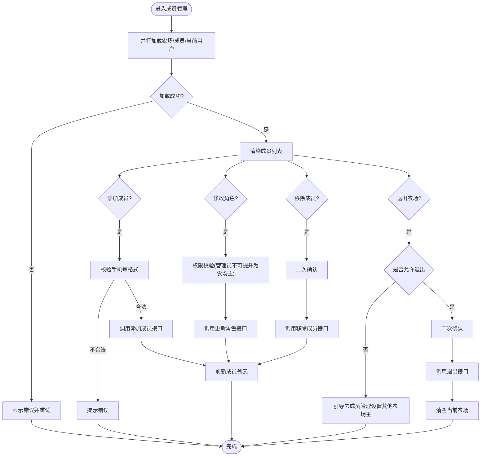
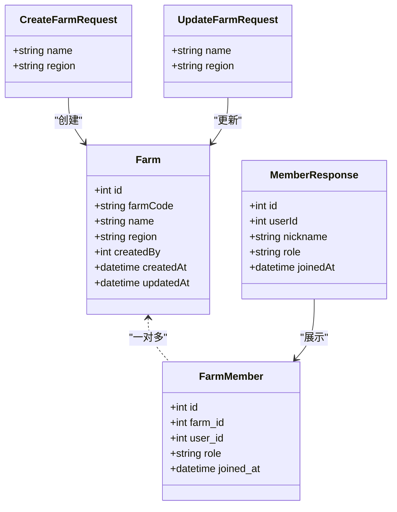

# 农场管理模块

<cite>
**本文引用的文件**
- [apps/api/app/models/farm.py](file://apps/api/app/models/farm.py)
- [apps/api/app/schemas/farm.py](file://apps/api/app/schemas/farm.py)
- [apps/api/app/services/farm.py](file://apps/api/app/services/farm.py)
- [apps/api/app/api/v1/endpoints/farms.py](file://apps/api/app/api/v1/endpoints/farms.py)
- [apps/miniapp/src/pages/farms/index.vue](file://apps/miniapp/src/pages/farms/index.vue)
- [apps/miniapp/src/pages/farms/create.vue](file://apps/miniapp/src/pages/farms/create.vue)
- [apps/miniapp/src/pages/farms/edit.vue](file://apps/miniapp/src/pages/farms/edit.vue)
- [apps/miniapp/src/pages/farms/detail.vue](file://apps/miniapp/src/pages/farms/detail.vue)
- [apps/miniapp/src/pages/farms/members.vue](file://apps/miniapp/src/pages/farms/members.vue)
- [apps/miniapp/src/components/FarmForm.vue](file://apps/miniapp/src/components/FarmForm.vue)
- [apps/miniapp/src/services/farm.ts](file://apps/miniapp/src/services/farm.ts)
- [apps/miniapp/src/services/farm-context.ts](file://apps/miniapp/src/services/farm-context.ts)
</cite>

## 目录
1. [简介](#简介)
2. [项目结构](#项目结构)
3. [核心组件](#核心组件)
4. [架构总览](#架构总览)
5. [详细组件分析](#详细组件分析)
6. [依赖关系分析](#依赖关系分析)
7. [性能与可用性](#性能与可用性)
8. [故障排查指南](#故障排查指南)
9. [结论](#结论)
10. [附录：API 参考](#附录api-参考)

## 简介
本模块为 Pocket Farm 的“农场管理”能力，覆盖农场的完整生命周期（创建、编辑、删除/退出、详情展示）以及成员协作（邀请、权限分配、角色控制）。前端基于 uni-app + Vue 实现列表页、创建表单、编辑界面、详情页与成员管理；后端基于 FastAPI + SQLAlchemy 提供 RESTful API，并通过服务层封装业务规则、权限校验与数据一致性。

## 项目结构
- 后端（API）
  - 模型：农场与成员实体、角色枚举
  - Schema：请求/响应数据结构与校验
  - 服务：农场 CRUD、成员管理、权限与并发安全
  - 路由：REST 端点，统一返回 ApiResponse
- 前端（小程序）
  - 页面：农场列表、创建、编辑、详情、成员管理
  - 组件：可复用的农场表单
  - 服务：HTTP 封装、农场相关接口调用、当前农场上下文状态同步

图表来源
- [apps/miniapp/src/pages/farms/index.vue:1-233](file://apps/miniapp/src/pages/farms/index.vue#L1-L233)
- [apps/miniapp/src/pages/farms/create.vue:1-77](file://apps/miniapp/src/pages/farms/create.vue#L1-L77)
- [apps/miniapp/src/pages/farms/edit.vue:1-150](file://apps/miniapp/src/pages/farms/edit.vue#L1-L150)
- [apps/miniapp/src/pages/farms/detail.vue:1-339](file://apps/miniapp/src/pages/farms/detail.vue#L1-L339)
- [apps/miniapp/src/pages/farms/members.vue:1-482](file://apps/miniapp/src/pages/farms/members.vue#L1-L482)
- [apps/miniapp/src/components/FarmForm.vue:1-150](file://apps/miniapp/src/components/FarmForm.vue#L1-L150)
- [apps/miniapp/src/services/farm.ts:1-121](file://apps/miniapp/src/services/farm.ts#L1-L121)
- [apps/miniapp/src/services/farm-context.ts:1-94](file://apps/miniapp/src/services/farm-context.ts#L1-L94)
- [apps/api/app/api/v1/endpoints/farms.py:1-200](file://apps/api/app/api/v1/endpoints/farms.py#L1-L200)
- [apps/api/app/services/farm.py:1-264](file://apps/api/app/services/farm.py#L1-L264)
- [apps/api/app/models/farm.py:1-59](file://apps/api/app/models/farm.py#L1-L59)
- [apps/api/app/schemas/farm.py:1-166](file://apps/api/app/schemas/farm.py#L1-L166)

章节来源
- [apps/api/app/models/farm.py:1-59](file://apps/api/app/models/farm.py#L1-L59)
- [apps/api/app/schemas/farm.py:1-166](file://apps/api/app/schemas/farm.py#L1-L166)
- [apps/api/app/services/farm.py:1-264](file://apps/api/app/services/farm.py#L1-L264)
- [apps/api/app/api/v1/endpoints/farms.py:1-200](file://apps/api/app/api/v1/endpoints/farms.py#L1-L200)
- [apps/miniapp/src/services/farm.ts:1-121](file://apps/miniapp/src/services/farm.ts#L1-L121)
- [apps/miniapp/src/services/farm-context.ts:1-94](file://apps/miniapp/src/services/farm-context.ts#L1-L94)

## 核心组件
- 数据模型
  - 农场：编号、名称、地区、创建人、时间戳
  - 成员：所属农场、用户、角色、加入时间
  - 角色：农场主、管理员、成员
- 请求/响应模式
  - 农场创建/更新请求体、分页列表、成员增删改查等
- 服务层
  - 事务性创建农场并自动授予创建者“农场主”角色
  - 成员管理的加锁与权限校验（防并发冲突、保护至少一个农场主）
- 前端页面
  - 列表、创建、编辑、详情、成员管理
  - 表单复用组件与未保存变更守卫
- 状态上下文
  - 当前农场选择与持久化，列表刷新后智能回退

章节来源
- [apps/api/app/models/farm.py:12-59](file://apps/api/app/models/farm.py#L12-L59)
- [apps/api/app/schemas/farm.py:14-73](file://apps/api/app/schemas/farm.py#L14-L73)
- [apps/api/app/services/farm.py:33-264](file://apps/api/app/services/farm.py#L33-L264)
- [apps/miniapp/src/components/FarmForm.vue:1-150](file://apps/miniapp/src/components/FarmForm.vue#L1-L150)
- [apps/miniapp/src/services/farm-context.ts:1-94](file://apps/miniapp/src/services/farm-context.ts#L1-L94)

## 架构总览
农场管理采用前后端分离的分层架构：
- 前端通过 services/farm.ts 调用后端 /farms 系列端点
- 路由层负责鉴权、参数校验、调用服务层
- 服务层封装业务规则、并发安全与异常映射
- 数据层使用 SQLAlchemy ORM 操作数据库

图表来源
- [apps/miniapp/src/pages/farms/index.vue:81-97](file://apps/miniapp/src/pages/farms/index.vue#L81-L97)
- [apps/miniapp/src/services/farm.ts:48-52](file://apps/miniapp/src/services/farm.ts#L48-L52)
- [apps/api/app/api/v1/endpoints/farms.py:58-75](file://apps/api/app/api/v1/endpoints/farms.py#L58-L75)
- [apps/api/app/services/farm.py:115-134](file://apps/api/app/services/farm.py#L115-L134)

## 详细组件分析

### 农场列表页
- 功能
  - 加载当前用户参与的农场列表（分页），显示名称、角色标签、是否当前农场
  - 空态提示与重试按钮
  - 点击跳转至创建农场页
- 交互流程
  - onShow 触发加载，失败时区分 401 未授权跳转登录
  - 成功则同步可用农场到上下文，便于后续选择当前农场
- UI 要点
  - 卡片式列表行，右侧箭头导航
  - 当前农场标记“当前”徽章
  - 底部“＋ 创建农场”入口

章节来源
- [apps/miniapp/src/pages/farms/index.vue:1-233](file://apps/miniapp/src/pages/farms/index.vue#L1-L233)
- [apps/miniapp/src/services/farm.ts:48-52](file://apps/miniapp/src/services/farm.ts#L48-L52)
- [apps/miniapp/src/services/farm-context.ts:54-62](file://apps/miniapp/src/services/farm-context.ts#L54-L62)

### 创建农场
- 功能
  - 表单包含名称（必填）、地区（选填）
  - 提交后自动成为该农场“农场主”，并设置当前农场
- 交互流程
  - 校验名称非空
  - 调用创建接口，成功后提示并跳转列表
  - 401 时清理令牌并跳转登录
- UI 要点
  - 复用 FarmForm 组件
  - 顶部说明文案引导用户理解角色

章节来源
- [apps/miniapp/src/pages/farms/create.vue:1-77](file://apps/miniapp/src/pages/farms/create.vue#L1-L77)
- [apps/miniapp/src/components/FarmForm.vue:1-150](file://apps/miniapp/src/components/FarmForm.vue#L1-L150)
- [apps/miniapp/src/services/farm.ts:54-60](file://apps/miniapp/src/services/farm.ts#L54-L60)
- [apps/api/app/api/v1/endpoints/farms.py:78-90](file://apps/api/app/api/v1/endpoints/farms.py#L78-L90)
- [apps/api/app/services/farm.py:33-53](file://apps/api/app/services/farm.py#L33-L53)

### 编辑农场
- 功能
  - 加载当前农场信息，支持修改名称和地区
  - 仅“农场主”可编辑
  - 未保存变更守卫，避免误关闭丢失修改
- 交互流程
  - 进入页面加载农场详情
  - 提交后更新本地与上下文中的当前农场
  - 错误处理与重试
- UI 要点
  - 复用 FarmForm，预填初始值
  - 保存按钮带 loading 状态

章节来源
- [apps/miniapp/src/pages/farms/edit.vue:1-150](file://apps/miniapp/src/pages/farms/edit.vue#L1-L150)
- [apps/miniapp/src/components/FarmForm.vue:1-150](file://apps/miniapp/src/components/FarmForm.vue#L1-L150)
- [apps/miniapp/src/services/farm.ts:66-72](file://apps/miniapp/src/services/farm.ts#L66-L72)
- [apps/api/app/api/v1/endpoints/farms.py:103-118](file://apps/api/app/api/v1/endpoints/farms.py#L103-L118)
- [apps/api/app/services/farm.py:137-155](file://apps/api/app/services/farm.py#L137-L155)

### 农场详情
- 功能
  - 展示农场基本信息、编号、当前角色
  - 根据角色显示“基本信息”编辑入口、“成员管理”入口
  - “危险操作”区提供退出农场
- 交互流程
  - 并行加载农场信息与成员列表，统计农场主数量以限制退出
  - 退出前二次确认，成功后清空当前农场并返回
- UI 要点
  - 角色徽章、分区标题、危险操作高亮
  - 无权限时隐藏敏感入口

章节来源
- [apps/miniapp/src/pages/farms/detail.vue:1-339](file://apps/miniapp/src/pages/farms/detail.vue#L1-L339)
- [apps/miniapp/src/services/farm.ts:62-64](file://apps/miniapp/src/services/farm.ts#L62-L64)
- [apps/miniapp/src/services/farm.ts:74-82](file://apps/miniapp/src/services/farm.ts#L74-L82)
- [apps/api/app/api/v1/endpoints/farms.py:93-100](file://apps/api/app/api/v1/endpoints/farms.py#L93-L100)
- [apps/api/app/api/v1/endpoints/farms.py:121-139](file://apps/api/app/api/v1/endpoints/farms.py#L121-L139)

### 成员管理
- 功能
  - 列出成员（昵称、角色、加入时间），支持按角色筛选显示
  - 添加成员：通过手机号精确查找已注册用户并分配角色
  - 修改成员角色：受权限约束（管理员不可操作或提升为农场主）
  - 移除成员：受权限约束且保证至少一个农场主
  - 退出农场：非唯一农场主时可退出
- 交互流程
  - 加载农场、成员、当前用户信息
  - 添加成员时校验手机号格式，成功后刷新列表
  - 修改角色与移除成员均带确认与错误提示
- UI 要点
  - 成员头像首字、自身标识“我”
  - 角色下拉选择器与删除图标
  - 添加区域输入框聚焦态样式

图表来源
- [apps/miniapp/src/pages/farms/members.vue:183-283](file://apps/miniapp/src/pages/farms/members.vue#L183-L283)
- [apps/miniapp/src/services/farm.ts:84-120](file://apps/miniapp/src/services/farm.ts#L84-L120)
- [apps/api/app/api/v1/endpoints/farms.py:142-199](file://apps/api/app/api/v1/endpoints/farms.py#L142-L199)
- [apps/api/app/services/farm.py:181-264](file://apps/api/app/services/farm.py#L181-L264)

章节来源
- [apps/miniapp/src/pages/farms/members.vue:1-482](file://apps/miniapp/src/pages/farms/members.vue#L1-L482)
- [apps/miniapp/src/services/farm.ts:74-120](file://apps/miniapp/src/services/farm.ts#L74-L120)
- [apps/api/app/api/v1/endpoints/farms.py:121-199](file://apps/api/app/api/v1/endpoints/farms.py#L121-L199)
- [apps/api/app/services/farm.py:158-264](file://apps/api/app/services/farm.py#L158-L264)

### 表单组件 FarmForm
- 功能
  - 农场名称（必填）、地区（选填）
  - 支持初始值回填、输入变化通知父组件
  - 提交事件携带标准化数据
- 设计要点
  - 聚焦态边框高亮
  - 统一的按钮样式与 loading 文案

章节来源
- [apps/miniapp/src/components/FarmForm.vue:1-150](file://apps/miniapp/src/components/FarmForm.vue#L1-L150)

### 当前农场上下文
- 功能
  - 维护当前选择的农场摘要（id、名称、角色等）
  - 持久化到本地存储，应用启动恢复
  - 列表刷新后智能回退：优先保留当前农场，否则取第一个有效农场
- 使用场景
  - 列表页加载后同步可用农场
  - 创建/编辑后更新当前农场
  - 退出农场后清空上下文

章节来源
- [apps/miniapp/src/services/farm-context.ts:1-94](file://apps/miniapp/src/services/farm-context.ts#L1-L94)
- [apps/miniapp/src/pages/farms/index.vue:81-101](file://apps/miniapp/src/pages/farms/index.vue#L81-L101)
- [apps/miniapp/src/pages/farms/create.vue:33-56](file://apps/miniapp/src/pages/farms/create.vue#L33-L56)
- [apps/miniapp/src/pages/farms/edit.vue:88-117](file://apps/miniapp/src/pages/farms/edit.vue#L88-L117)
- [apps/miniapp/src/pages/farms/detail.vue:149-183](file://apps/miniapp/src/pages/farms/detail.vue#L149-L183)

## 依赖关系分析
- 前端依赖
  - 页面依赖 services/farm.ts 进行网络请求
  - 页面依赖 farm-context.ts 管理当前农场状态
  - 表单组件被创建/编辑页面复用
- 后端依赖
  - 路由依赖服务层进行业务编排
  - 服务层依赖模型与模式进行数据建模与校验
  - 服务层内部对成员管理加锁，确保并发安全

图表来源
- [apps/api/app/models/farm.py:18-59](file://apps/api/app/models/farm.py#L18-L59)
- [apps/api/app/schemas/farm.py:14-73](file://apps/api/app/schemas/farm.py#L14-L73)

章节来源
- [apps/api/app/models/farm.py:18-59](file://apps/api/app/models/farm.py#L18-L59)
- [apps/api/app/schemas/farm.py:14-73](file://apps/api/app/schemas/farm.py#L14-L73)

## 性能与可用性
- 并发与一致性
  - 成员管理使用行级锁（with_for_update）防止竞态条件
  - 创建农场时生成唯一编号，冲突时重试有限次数
- 列表与分页
  - 列表接口支持分页参数，减少单次数据量
- 前端体验
  - 加载态、错误态与重试按钮提升可用性
  - 未保存变更守卫避免误操作丢失数据
  - 并行请求减少等待时间（如详情页同时拉取农场与成员）

[本节为通用指导，无需特定文件引用]

## 故障排查指南
- 401 未授权
  - 现象：所有页面在获取数据时报 401
  - 处理：清理本地令牌并跳转登录页
  - 涉及位置：各页面统一处理逻辑
- 无法退出农场
  - 现象：提示需先设置其他农场主
  - 原因：当前为唯一农场主，不允许退出
  - 解决：前往成员管理将他人提升为农场主后再退出
- 添加成员失败
  - 可能原因：手机号格式不正确、用户未注册、已是成员
  - 处理：检查输入、确认用户存在、查看成员列表
- 修改角色失败
  - 可能原因：权限不足（管理员不可提升为农场主）、目标不存在
  - 处理：确认操作者角色与目标角色组合是否符合规则

章节来源
- [apps/miniapp/src/pages/farms/index.vue:76-97](file://apps/miniapp/src/pages/farms/index.vue#L76-L97)
- [apps/miniapp/src/pages/farms/create.vue:28-56](file://apps/miniapp/src/pages/farms/create.vue#L28-L56)
- [apps/miniapp/src/pages/farms/edit.vue:60-117](file://apps/miniapp/src/pages/farms/edit.vue#L60-L117)
- [apps/miniapp/src/pages/farms/detail.vue:102-183](file://apps/miniapp/src/pages/farms/detail.vue#L102-L183)
- [apps/miniapp/src/pages/farms/members.vue:212-275](file://apps/miniapp/src/pages/farms/members.vue#L212-L275)
- [apps/api/app/services/farm.py:21-31](file://apps/api/app/services/farm.py#L21-L31)
- [apps/api/app/services/farm.py:181-264](file://apps/api/app/services/farm.py#L181-L264)

## 结论
农场管理模块围绕“农场”与“成员”两个核心概念，提供了从创建到协作的全链路能力。后端通过严谨的权限与并发控制保障数据安全，前端通过清晰的页面分工与可复用组件提升开发效率与用户体验。建议后续扩展：
- 增加邀请码/二维码分享机制，简化成员邀请流程
- 引入操作日志，记录关键成员变更
- 优化大图/富文本信息的加载策略，进一步提升性能

[本节为总结性内容，无需特定文件引用]

## 附录：API 参考
- 获取我的农场列表
  - 方法：GET
  - 路径：/farms
  - 参数：page, pageSize
  - 返回：ApiResponse[FarmPage]
- 创建农场
  - 方法：POST
  - 路径：/farms
  - 请求体：CreateFarmRequest
  - 返回：ApiResponse[FarmResponse]
- 获取农场详情
  - 方法：GET
  - 路径：/farms/{farm_id}
  - 返回：ApiResponse[FarmResponse]
- 编辑农场
  - 方法：PATCH
  - 路径：/farms/{farm_id}
  - 请求体：UpdateFarmRequest
  - 返回：ApiResponse[FarmResponse]
- 获取农场成员列表
  - 方法：GET
  - 路径：/farms/{farm_id}/members
  - 参数：page, pageSize
  - 返回：ApiResponse[MemberPage]
- 添加成员
  - 方法：POST
  - 路径：/farms/{farm_id}/members
  - 请求体：CreateMemberRequest
  - 返回：ApiResponse[MemberResponse]
- 修改成员角色
  - 方法：PATCH
  - 路径：/farms/{farm_id}/members/{member_id}
  - 请求体：UpdateMemberRequest
  - 返回：ApiResponse[MemberResponse]
- 退出农场
  - 方法：DELETE
  - 路径：/farms/{farm_id}/members/me
  - 返回：204 No Content
- 移除成员
  - 方法：DELETE
  - 路径：/farms/{farm_id}/members/{member_id}
  - 返回：204 No Content

章节来源
- [apps/api/app/api/v1/endpoints/farms.py:58-199](file://apps/api/app/api/v1/endpoints/farms.py#L58-L199)
- [apps/miniapp/src/services/farm.ts:48-120](file://apps/miniapp/src/services/farm.ts#L48-L120)