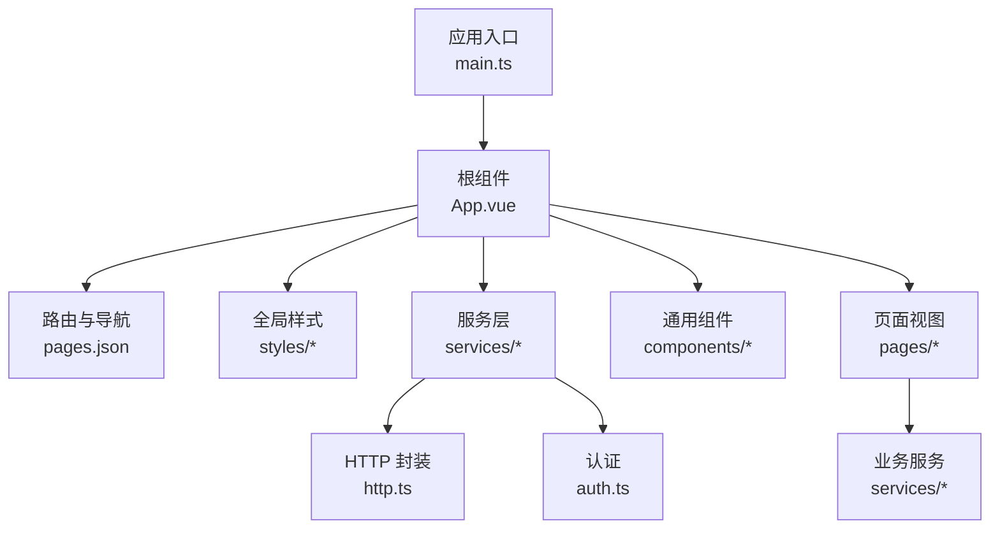
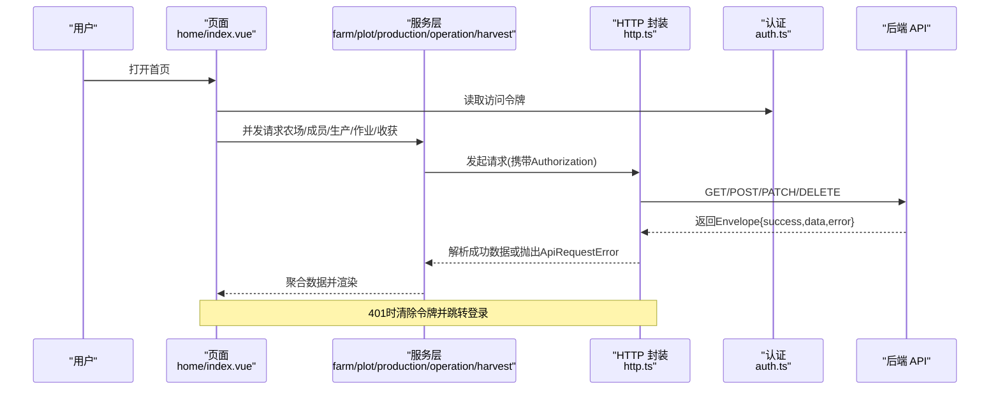
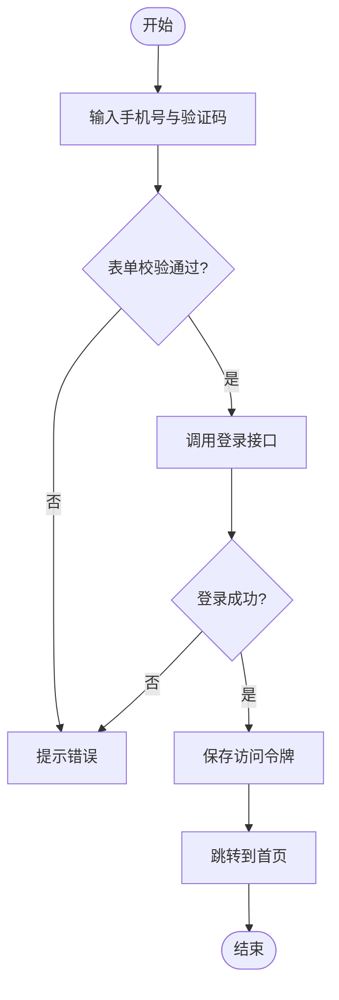
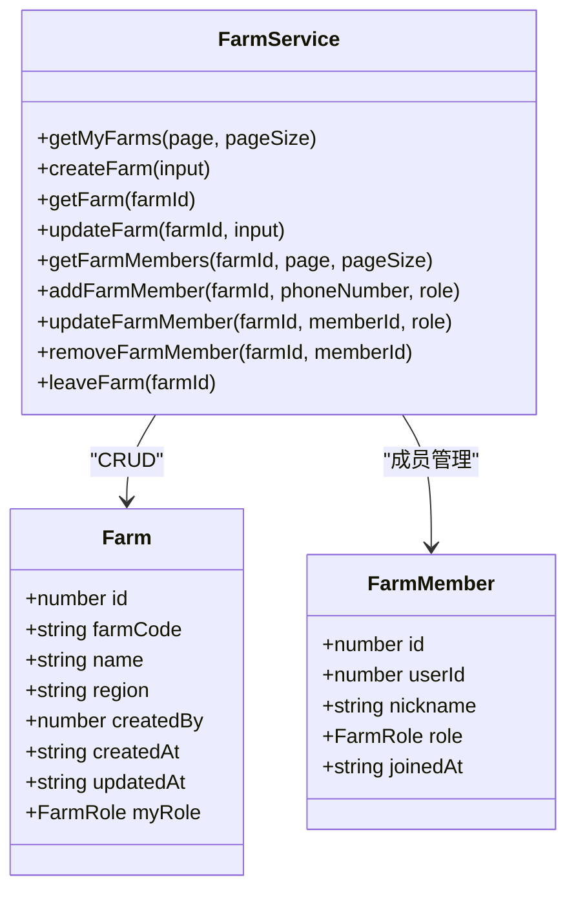
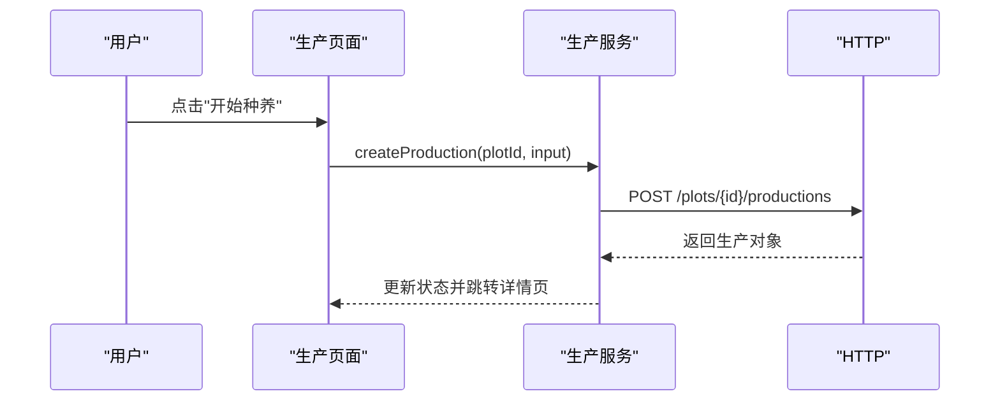
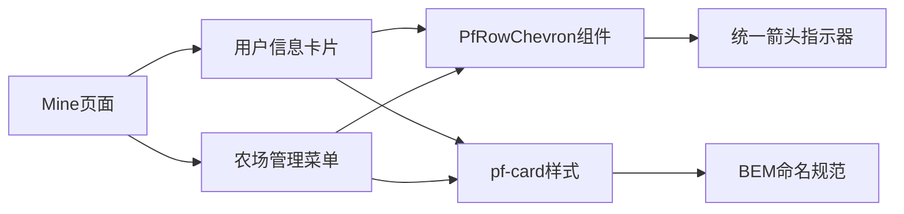
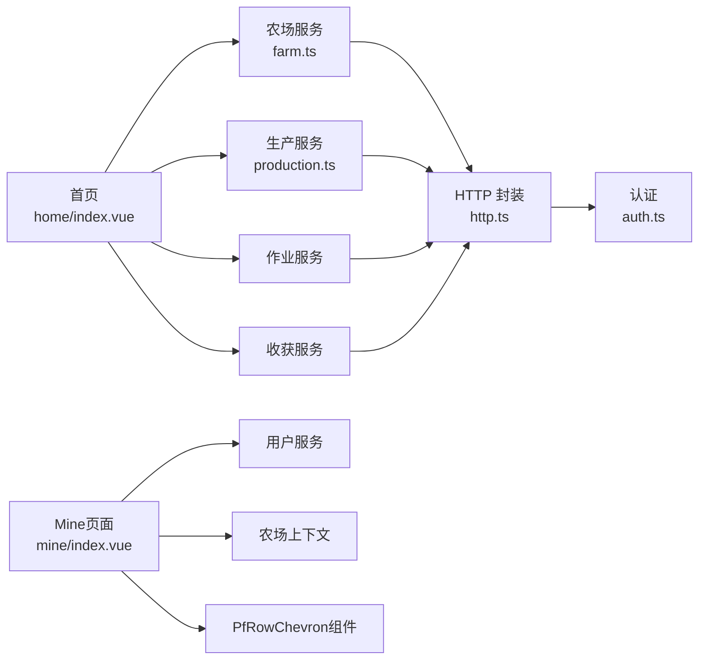

# 前端应用

<cite>
**本文引用的文件**
- [package.json](file://apps/miniapp/package.json)
- [main.ts](file://apps/miniapp/src/main.ts)
- [App.vue](file://apps/miniapp/src/App.vue)
- [pages.json](file://apps/miniapp/src/pages.json)
- [manifest.json](file://apps/miniapp/src/manifest.json)
- [http.ts](file://apps/miniapp/src/services/http.ts)
- [auth.ts](file://apps/miniapp/src/services/auth.ts)
- [useCustomHeader.ts](file://apps/miniapp/src/composables/useCustomHeader.ts)
- [pocket-farm.scss](file://apps/miniapp/src/styles/pocket-farm.scss)
- [design-tokens.scss](file://apps/miniapp/src/styles/design-tokens.scss)
- [home/index.vue](file://apps/miniapp/src/pages/home/index.vue)
- [mine/index.vue](file://apps/miniapp/src/pages/mine/index.vue)
- [farm/index.vue](file://apps/miniapp/src/pages/farm/index.vue)
- [PfPageHeader.vue](file://apps/miniapp/src/components/PfPageHeader.vue)
- [PfRowChevron.vue](file://apps/miniapp/src/components/PfRowChevron.vue)
- [farm.ts](file://apps/miniapp/src/services/farm.ts)
- [production.ts](file://apps/miniapp/src/services/production.ts)
</cite>

## 更新摘要
**变更内容**
- Mine页面进行了重大UI重构，从扁平布局改为卡片式设计
- 引入统一的PfRowChevron组件和BEM命名规范
- 增强了视觉一致性和用户体验，与首页和农场标签页保持一致的设计语言
- 更新了样式系统和组件复用模式

## 目录
1. [简介](#简介)
2. [项目结构](#项目结构)
3. [核心组件](#核心组件)
4. [架构总览](#架构总览)
5. [详细组件分析](#详细组件分析)
6. [依赖关系分析](#依赖关系分析)
7. [性能考虑](#性能考虑)
8. [故障排查指南](#故障排查指南)
9. [结论](#结论)
10. [附录](#附录)

## 简介
本技术文档面向 Pocket Farm 前端应用（基于 Vue 3 与 UniApp），聚焦移动端多端适配、跨平台兼容与用户体验优化。文档覆盖：
- 组件层次结构与页面路由设计
- 状态管理与上下文方案（农场上下文）
- 认证流程与鉴权拦截
- 功能模块实现要点：农场管理、地块管理、生产跟踪、作业记录、收获管理
- 样式体系与主题定制（Design Tokens）
- 开发规范与最佳实践

## 项目结构
前端工程位于 apps/miniapp，采用 UniApp + Vue 3 的模块化组织方式：
- 入口与全局配置
  - main.ts：创建 SSR 应用实例
  - App.vue：应用生命周期、全局样式引入、登录态初始化跳转
  - pages.json：页面路由、TabBar、全局导航栏样式
  - manifest.json：各平台打包与权限配置
- 业务层
  - services：HTTP 封装、认证、领域服务（农场、地块、生产、作业、收获等）
  - composables：可复用逻辑（自定义导航头高度计算）
  - components：通用 UI 组件（页面头部、行箭头等）
  - styles：Design Tokens 与全局样式
  - pages：按功能域划分的页面
- 静态资源与工具
  - static：图标与图片
  - utils：数值格式化等工具函数

**图表来源**
- [main.ts:1-9](file://apps/miniapp/src/main.ts#L1-L9)
- [App.vue:1-25](file://apps/miniapp/src/App.vue#L1-L25)
- [pages.json:1-217](file://apps/miniapp/src/pages.json#L1-L217)
- [http.ts:1-106](file://apps/miniapp/src/services/http.ts#L1-L106)
- [auth.ts:1-18](file://apps/miniapp/src/services/auth.ts#L1-L18)

**章节来源**
- [main.ts:1-9](file://apps/miniapp/src/main.ts#L1-L9)
- [App.vue:1-25](file://apps/miniapp/src/App.vue#L1-L25)
- [pages.json:1-217](file://apps/miniapp/src/pages.json#L1-L217)
- [manifest.json:1-70](file://apps/miniapp/src/manifest.json#L1-L70)

## 核心组件
- 应用启动与鉴权跳转
  - 应用启动时检查本地访问令牌，若存在则直接跳转到首页；否则停留在登录页
- 统一 HTTP 客户端
  - 自动附加 Authorization 请求头
  - 统一错误包装为 ApiRequestError，包含 code、statusCode、details
  - 对 204、2xx+success 响应进行解包处理
- 认证存储
  - 使用 uni.setStorageSync 存取访问令牌
  - 提供 has/get/set/clear 方法
- 自定义导航头
  - 动态计算状态栏高度与胶囊按钮区域，适配微信小程序等平台
- 页面头部组件
  - 支持标题、副标题、返回按钮、居中或 Tab 模式
  - 结合 useCustomHeader 保证在不同平台下布局一致
- **新增** PfRowChevron 组件
  - 统一的行箭头指示器组件，用于列表项导航提示
  - 标准化箭头样式和尺寸，确保视觉一致性

**章节来源**
- [App.vue:1-25](file://apps/miniapp/src/App.vue#L1-L25)
- [http.ts:1-106](file://apps/miniapp/src/services/http.ts#L1-L106)
- [auth.ts:1-18](file://apps/miniapp/src/services/auth.ts#L1-L18)
- [useCustomHeader.ts:1-39](file://apps/miniapp/src/composables/useCustomHeader.ts#L1-L39)
- [PfPageHeader.vue:1-130](file://apps/miniapp/src/components/PfPageHeader.vue#L1-L130)
- [PfRowChevron.vue:1-17](file://apps/miniapp/src/components/PfRowChevron.vue#L1-L17)

## 架构总览
整体采用"页面-组件-服务"分层：
- 页面层：负责展示与交互，调用服务获取数据
- 服务层：封装 API 调用、类型定义、数据转换
- 基础设施：HTTP 封装、认证、样式系统、可复用 Composable

**图表来源**
- [home/index.vue:109-263](file://apps/miniapp/src/pages/home/index.vue#L109-L263)
- [http.ts:46-106](file://apps/miniapp/src/services/http.ts#L46-L106)
- [auth.ts:1-18](file://apps/miniapp/src/services/auth.ts#L1-L18)

## 详细组件分析

### 认证模块
- 登录流程
  - 输入手机号与验证码，校验通过后调用登录接口
  - 成功后通过 reLaunch 进入首页
- 令牌管理
  - 登录成功后写入本地存储
  - 应用启动时检测令牌，决定跳转路径
- 未授权处理
  - 网络层在 401 时清除令牌
  - 页面捕获 401 后强制跳转登录

**图表来源**
- [auth/login.vue:96-203](file://apps/miniapp/src/pages/auth/login.vue#L96-L203)
- [auth.ts:1-18](file://apps/miniapp/src/services/auth.ts#L1-L18)
- [App.vue:1-25](file://apps/miniapp/src/App.vue#L1-L25)

**章节来源**
- [auth/login.vue:1-359](file://apps/miniapp/src/pages/auth/login.vue#L1-L359)
- [auth.ts:1-18](file://apps/miniapp/src/services/auth.ts#L1-L18)
- [App.vue:1-25](file://apps/miniapp/src/App.vue#L1-L25)

### 农场管理
- 能力范围
  - 列表查询、创建、编辑、删除成员、退出农场
- 数据模型
  - 农场实体、分页、成员角色（OWNER/ADMIN/MEMBER）
- 典型交互
  - 首页选择当前农场，后续操作以当前农场为上下文
  - 成员管理支持角色变更与移除

**图表来源**
- [farm.ts:1-121](file://apps/miniapp/src/services/farm.ts#L1-L121)

**章节来源**
- [farm.ts:1-121](file://apps/miniapp/src/services/farm.ts#L1-L121)

### 地块管理
- 能力范围
  - 地块列表、详情、创建、编辑
- 与生产/作业/收获的关联
  - 生产、作业、收获均绑定到具体地块，便于统计与追溯

**章节来源**
- [pages.json:63-91](file://apps/miniapp/src/pages.json#L63-L91)

### 生产跟踪
- 能力范围
  - 开始种养、填写信息、编辑、结束种养、查看详情
- 数据模型
  - 生产实体包含物种、行业、种植标准、方法、预期产量、初始数量等
- 关键流程
  - 首页快捷入口进入"开始种养"，引导完成信息录入
  - 支持按状态筛选与分页加载

**图表来源**
- [production.ts:63-110](file://apps/miniapp/src/services/production.ts#L63-L110)
- [home/index.vue:209-213](file://apps/miniapp/src/pages/home/index.vue#L209-L213)

**章节来源**
- [production.ts:1-121](file://apps/miniapp/src/services/production.ts#L1-L121)
- [pages.json:99-127](file://apps/miniapp/src/pages.json#L99-L127)

### 作业记录
- 能力范围
  - 农事类型选择、记录农事、关联生产、查看作业列表
- 与首页动态联动
  - 首页"最近动态"聚合作业与收获，按时间排序展示

**章节来源**
- [pages.json:129-151](file://apps/miniapp/src/pages.json#L129-L151)
- [home/index.vue:164-203](file://apps/miniapp/src/pages/home/index.vue#L164-L203)

### 收获管理
- 能力范围
  - 记录收获、选择生产、查看收获列表
- 单位与行业适配
  - 根据行业显示不同动作文案（采收/出栏/捕捞）
  - 数量单位映射（公斤/头/羽/只/个/株/尾）

**章节来源**
- [pages.json:153-169](file://apps/miniapp/src/pages.json#L153-L169)
- [home/index.vue:231-245](file://apps/miniapp/src/pages/home/index.vue#L231-L245)

### 个人中心页面（Mine）
- **重大UI重构**
  - 从扁平布局改为卡片式设计，提升视觉层次感
  - 引入BEM命名规范，增强代码可维护性
  - 使用统一的PfRowChevron组件替代内联箭头图标
- 用户信息卡片
  - 头像显示用户昵称首字母
  - 用户名和脱敏手机号展示
  - 可点击进入设置页面
- 农场管理菜单
  - 我的农场：显示当前农场名称
  - 当前农场管理：显示用户角色（农场主/管理员/成员）
  - 每个菜单项都带有箭头指示器和点击反馈
- 交互体验
  - 所有可点击元素都有pf-tappable类名，提供统一的点击反馈效果
  - 使用pf-card类名提供一致的卡片样式和阴影效果

**图表来源**
- [mine/index.vue:1-198](file://apps/miniapp/src/pages/mine/index.vue#L1-L198)
- [PfRowChevron.vue:1-17](file://apps/miniapp/src/components/PfRowChevron.vue#L1-L17)
- [pocket-farm.scss:42-63](file://apps/miniapp/src/styles/pocket-farm.scss#L42-L63)

**章节来源**
- [mine/index.vue:1-198](file://apps/miniapp/src/pages/mine/index.vue#L1-L198)

### 移动端适配策略
- 自定义导航栏
  - 使用 useCustomHeader 动态计算状态栏高度与右侧安全区，适配微信小程序胶囊按钮
  - 页面头部组件 PfPageHeader 提供居中/Tab 两种布局模式
- 安全区域与间距
  - 登录页底部使用 env(safe-area-inset-bottom) 避免遮挡
- 多端构建
  - package.json 提供多端 dev/build 脚本
  - manifest.json 配置各平台权限与特性

**章节来源**
- [useCustomHeader.ts:1-39](file://apps/miniapp/src/composables/useCustomHeader.ts#L1-L39)
- [PfPageHeader.vue:1-130](file://apps/miniapp/src/components/PfPageHeader.vue#L1-L130)
- [auth/login.vue:205-359](file://apps/miniapp/src/pages/auth/login.vue#L205-L359)
- [package.json:1-73](file://apps/miniapp/package.json#L1-L73)
- [manifest.json:1-70](file://apps/miniapp/src/manifest.json#L1-L70)

### 跨平台兼容性
- 多端构建命令覆盖微信、支付宝、百度、头条、鸿蒙等
- 使用 uni.request 与 uni 系列 API 保证跨端一致性
- 针对微信小程序的特殊处理（如菜单按钮尺寸）

**章节来源**
- [package.json:4-37](file://apps/miniapp/package.json#L4-L37)
- [useCustomHeader.ts:12-26](file://apps/miniapp/src/composables/useCustomHeader.ts#L12-L26)

### 用户体验优化
- 首页仪表盘
  - 并发拉取地块的生产、作业、收获数据，减少等待时间
  - 空状态与错误状态友好提示，支持重试
- 交互反馈
  - 按钮加载态、Toast 提示、禁用态倒计时
  - **新增** 统一的点击反馈效果（pf-tappable类名）
- 视觉一致性
  - Design Tokens 统一管理颜色、间距、圆角、阴影与动效时长
  - **新增** 卡片式设计和BEM命名规范提升视觉统一性

**章节来源**
- [home/index.vue:164-203](file://apps/miniapp/src/pages/home/index.vue#L164-L203)
- [design-tokens.scss:1-74](file://apps/miniapp/src/styles/design-tokens.scss#L1-L74)
- [pocket-farm.scss:56-63](file://apps/miniapp/src/styles/pocket-farm.scss#L56-L63)

### 组件复用模式
- 页面头部组件
  - 通过 props 控制标题、副标题、返回按钮与布局变体
  - 内部复用 useCustomHeader 保证多端一致
- **新增** 行箭头组件
  - PfRowChevron 提供统一的箭头指示器，用于所有需要导航提示的场景
  - 标准化箭头样式和尺寸，确保跨页面视觉一致性
- 表单与卡片
  - 使用 uv-ui 组件库统一输入、按钮、弹窗等基础控件
  - 通过 pf-card、pf-list-card 等类名保持视觉一致
  - **新增** BEM命名规范（block__element--modifier）提升代码可读性

**章节来源**
- [PfPageHeader.vue:1-130](file://apps/miniapp/src/components/PfPageHeader.vue#L1-L130)
- [PfRowChevron.vue:1-17](file://apps/miniapp/src/components/PfRowChevron.vue#L1-L17)
- [pocket-farm.scss:1-78](file://apps/miniapp/src/styles/pocket-farm.scss#L1-L78)

### 样式管理与主题定制
- Design Tokens
  - 原始色阶 -> 语义色 -> 组件尺寸，页面不直接使用原始色值
  - 提供主色、中性色、危险/警告/信息色及对应柔和背景
- 全局样式
  - 页面背景、卡片、分割线、可点击态等统一样式类
  - **新增** pf-card、pf-tappable、pf-list-card 等通用样式类
- **新增** BEM命名规范
  - 遵循 Block__Element--Modifier 命名约定
  - 提升样式代码的可维护性和可扩展性
- 扩展建议
  - 新增语义色时同步更新 design-tokens.scss
  - 页面优先使用语义变量与通用类名
  - 新组件遵循BEM命名规范

**章节来源**
- [design-tokens.scss:1-74](file://apps/miniapp/src/styles/design-tokens.scss#L1-L74)
- [pocket-farm.scss:1-78](file://apps/miniapp/src/styles/pocket-farm.scss#L1-L78)
- [App.vue:16-24](file://apps/miniapp/src/App.vue#L16-L24)

## 依赖关系分析
- 页面依赖服务
  - 首页依赖农场、地块、生产、作业、收获服务，并发请求以提升体验
  - **Mine页面** 依赖用户信息和农场上下文服务
- 服务依赖 HTTP 封装
  - 所有服务通过 request 统一发起请求，集中处理鉴权与错误
- 认证依赖本地存储
  - 登录态持久化，应用启动时恢复
- **新增** 组件依赖
  - 多个页面复用 PfRowChevron 组件，减少重复代码

**图表来源**
- [home/index.vue:164-203](file://apps/miniapp/src/pages/home/index.vue#L164-L203)
- [mine/index.vue:42-100](file://apps/miniapp/src/pages/mine/index.vue#L42-L100)
- [farm.ts:1-121](file://apps/miniapp/src/services/farm.ts#L1-L121)
- [production.ts:1-121](file://apps/miniapp/src/services/production.ts#L1-L121)
- [http.ts:1-106](file://apps/miniapp/src/services/http.ts#L1-L106)
- [auth.ts:1-18](file://apps/miniapp/src/services/auth.ts#L1-L18)

**章节来源**
- [home/index.vue:164-203](file://apps/miniapp/src/pages/home/index.vue#L164-L203)
- [mine/index.vue:42-100](file://apps/miniapp/src/pages/mine/index.vue#L42-L100)
- [farm.ts:1-121](file://apps/miniapp/src/services/farm.ts#L1-L121)
- [production.ts:1-121](file://apps/miniapp/src/services/production.ts#L1-L121)
- [http.ts:1-106](file://apps/miniapp/src/services/http.ts#L1-L106)
- [auth.ts:1-18](file://apps/miniapp/src/services/auth.ts#L1-L18)

## 性能考虑
- 并发请求
  - 首页使用 Promise.all 并发拉取多个数据源，缩短首屏时间
  - Mine页面同时加载用户信息和农场上下文
- 分页与限制
  - 列表默认分页加载，避免一次性加载过多数据
- 缓存与状态
  - 访问令牌本地缓存，减少重复鉴权开销
- 渲染优化
  - 使用 rpx 单位与语义化样式类，提升多端渲染一致性
  - **新增** 组件复用减少重复渲染开销
- 错误快速失败
  - 网络异常与 401 快速定位并提示，避免阻塞主流程

[本节为通用指导，无需特定文件引用]

## 故障排查指南
- 常见问题
  - 401 未授权：检查是否已登录或令牌是否过期；确认 http.ts 是否正确附加 Authorization
  - 网络失败：检查 VITE_API_BASE_URL 配置与网络环境
  - 导航异常：确认 pages.json 中页面路径与 navigateTo/reLaunch 目标一致
  - **新增** 样式问题：检查BEM命名是否正确，确保pf-card和pf-tappable类名正确应用
- 调试建议
  - 使用 Toast 提示错误信息
  - 在页面 onShow/onHide 中打印关键状态变化
  - 利用开发环境提示简化验证码流程

**章节来源**
- [http.ts:68-106](file://apps/miniapp/src/services/http.ts#L68-L106)
- [auth/login.vue:158-187](file://apps/miniapp/src/pages/auth/login.vue#L158-L187)
- [pages.json:1-217](file://apps/miniapp/src/pages.json#L1-L217)

## 结论
Pocket Farm 前端采用清晰的"页面-组件-服务"分层与统一的 HTTP/认证抽象，配合 Design Tokens 与可复用组件，实现了良好的多端适配与可扩展性。**Mine页面的重大UI重构**引入了卡片式设计、BEM命名规范和统一的PfRowChevron组件，显著提升了界面统一性和用户体验。通过并发请求、分页加载与友好的错误处理，保障了移动端用户体验。未来可在状态管理（如 Pinia）、单元测试与性能监控方面持续完善。

[本节为总结性内容，无需特定文件引用]

## 附录
- 开发规范与最佳实践
  - 统一使用 request 发起请求，禁止直接调用 uni.request
  - 所有页面样式优先使用 design-tokens 与通用类名
  - **新增** 遵循BEM命名规范（Block__Element--Modifier）
  - **新增** 使用pf-card、pf-tappable等通用样式类
  - **新增** 使用PfRowChevron组件替代内联箭头图标
  - 表单提交前进行本地校验，错误通过 Toast 提示
  - 列表使用分页，避免大数据量一次性加载
  - 多端差异逻辑集中在 composable 或条件分支中，保持页面简洁
  - 敏感操作（删除、退出农场）需二次确认
  - 日志与埋点按需添加，注意隐私合规

[本节为通用指导，无需特定文件引用]