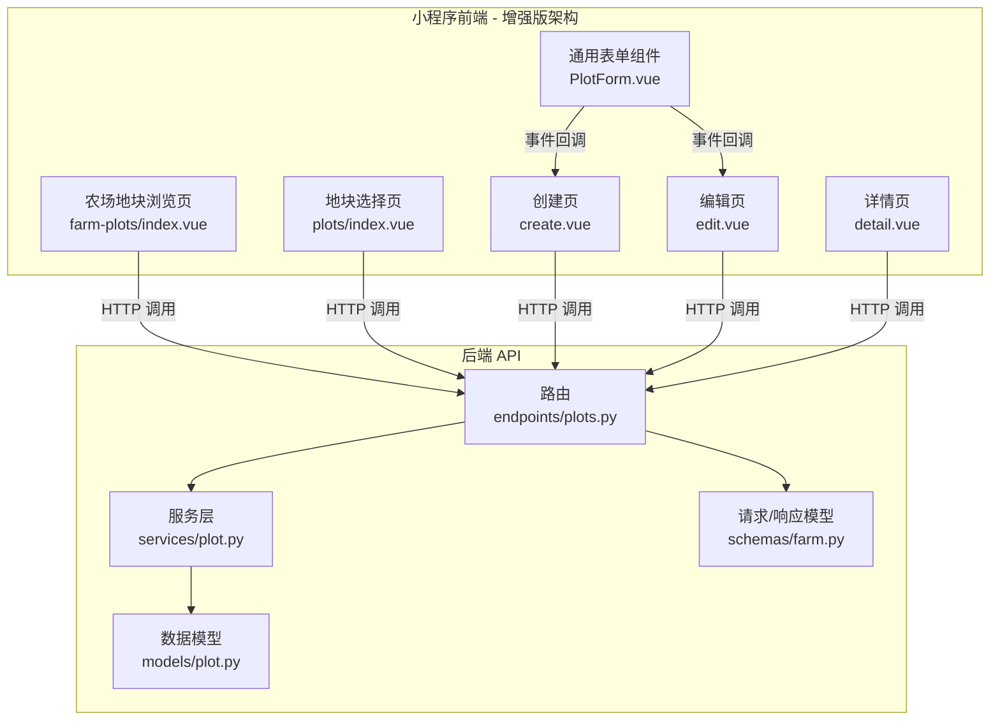
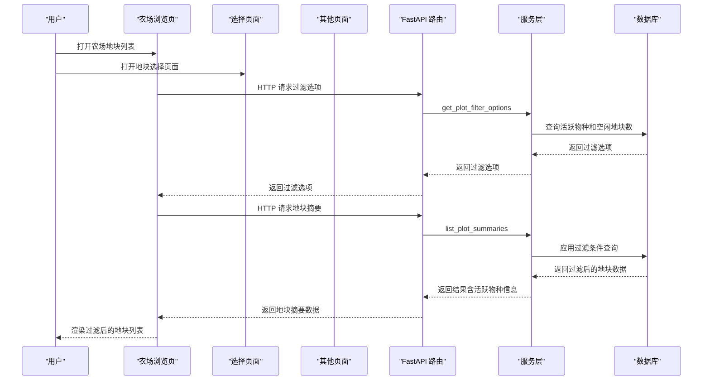
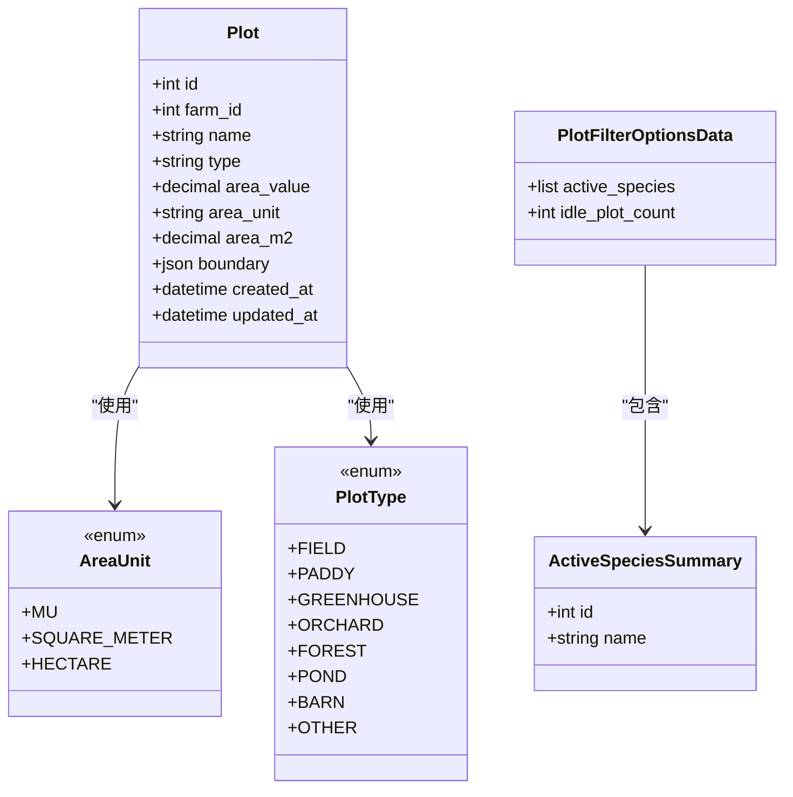
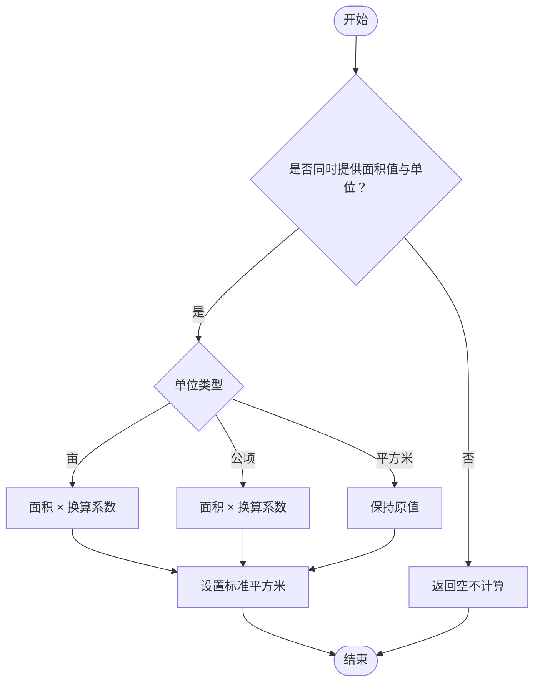
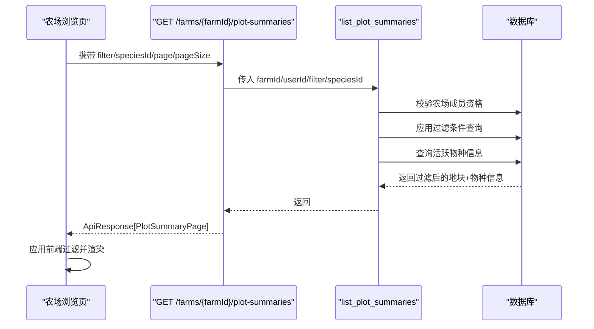
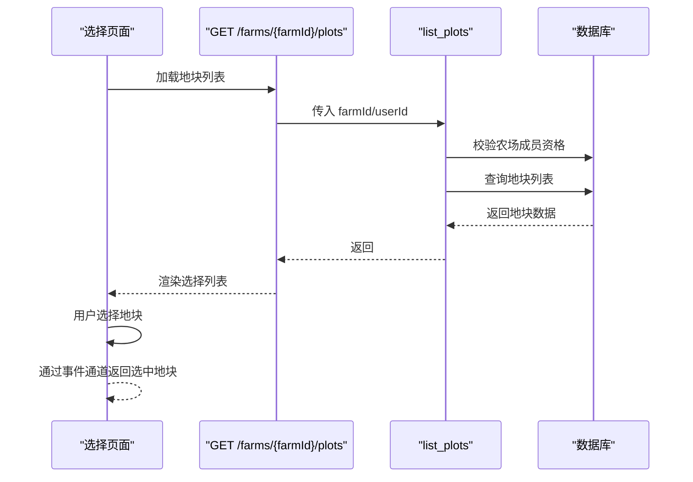
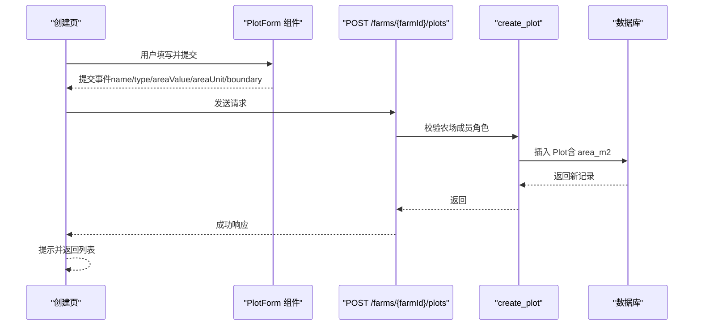
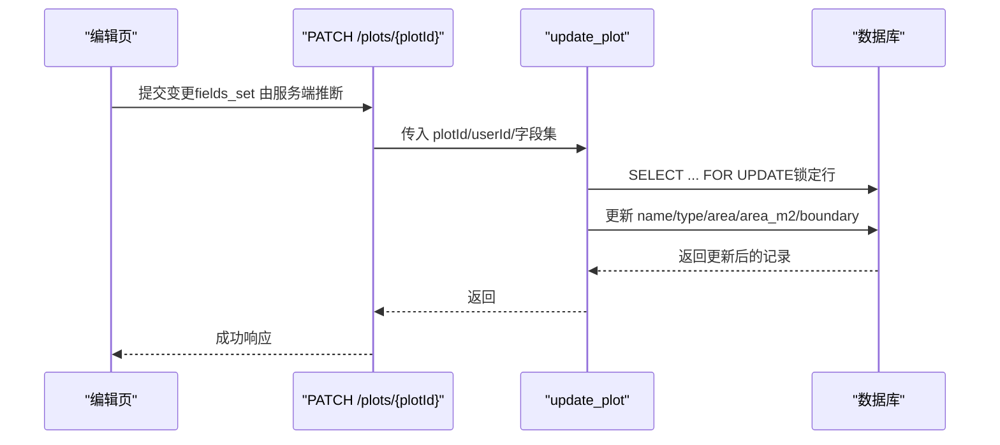
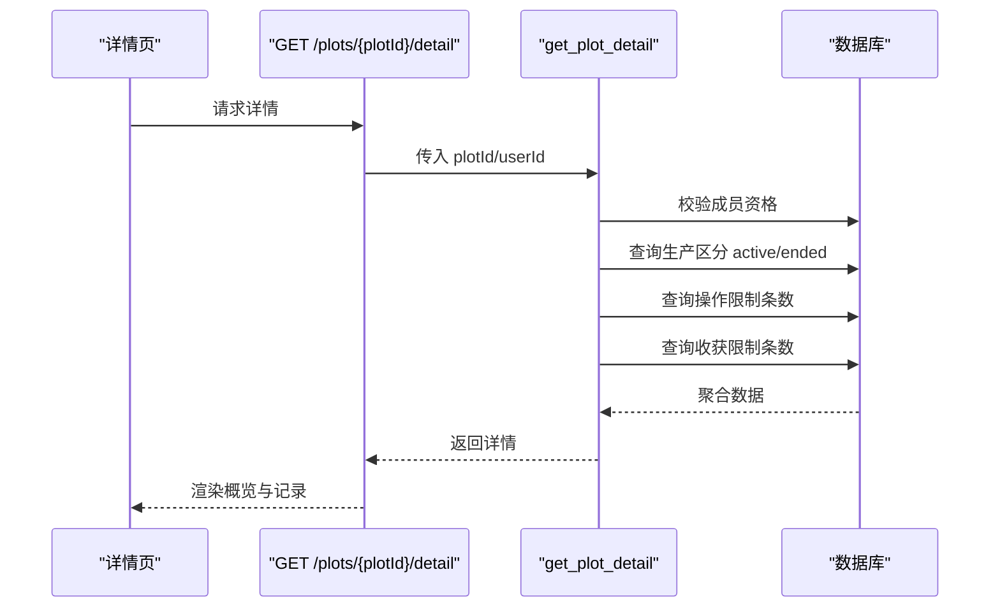
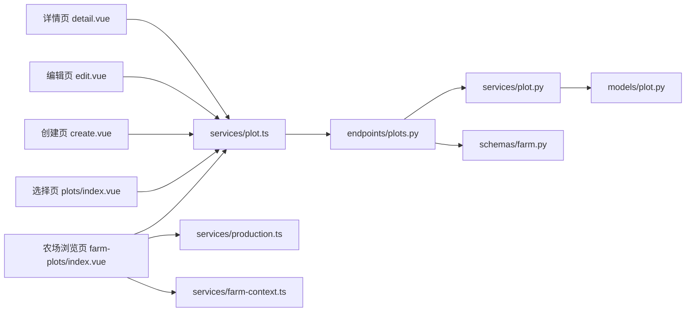

# 地块管理模块

<cite>
**本文引用的文件**
- [apps/api/app/models/plot.py](file://apps/api/app/models/plot.py)
- [apps/api/app/schemas/farm.py](file://apps/api/app/schemas/farm.py)
- [apps/api/app/services/plot.py](file://apps/api/app/services/plot.py)
- [apps/api/app/api/v1/endpoints/plots.py](file://apps/api/app/api/v1/endpoints/plots.py)
- [apps/miniapp/src/pages/farm-plots/index.vue](file://apps/miniapp/src/pages/farm-plots/index.vue)
- [apps/miniapp/src/pages/plots/index.vue](file://apps/miniapp/src/pages/plots/index.vue)
- [apps/miniapp/src/pages/plots/create.vue](file://apps/miniapp/src/pages/plots/create.vue)
- [apps/miniapp/src/pages/plots/edit.vue](file://apps/miniapp/src/pages/plots/edit.vue)
- [apps/miniapp/src/pages/plots/detail.vue](file://apps/miniapp/src/pages/plots/detail.vue)
- [apps/miniapp/src/components/PlotForm.vue](file://apps/miniapp/src/components/PlotForm.vue)
- [apps/miniapp/src/services/plot.ts](file://apps/miniapp/src/services/plot.ts)
- [apps/miniapp/src/services/production.ts](file://apps/miniapp/src/services/production.ts)
- [apps/miniapp/src/services/farm-context.ts](file://apps/miniapp/src/services/farm-context.ts)
</cite>

## 更新摘要
**变更内容**
- 新增完整的地块摘要和过滤系统，支持按状态和物种进行智能筛选
- 新增两个API端点：`/farms/{farm_id}/plot-summaries` 和 `/farms/{farm_id}/plot-filter-options`
- 增强农场地块浏览页面，支持ALL、IDLE、SPECIES三种过滤器类型
- 实现动态过滤选项加载，自动检测活跃物种和空闲地块数量
- 改进前端过滤界面，提供直观的筛选体验和实时反馈

## 目录
1. [简介](#简介)
2. [项目结构](#项目结构)
3. [核心组件](#核心组件)
4. [架构总览](#架构总览)
5. [详细组件分析](#详细组件分析)
6. [依赖关系分析](#依赖关系分析)
7. [性能与可扩展性](#性能与可扩展性)
8. [故障排查指南](#故障排查指南)
9. [结论](#结论)
10. [附录：API 参考](#附录api-参考)

## 简介
本模块为 Pocket Farm 的"农田地块"管理能力，覆盖地块的创建、编辑、删除（通过列表操作）、详情查看与可视化展示。经过重大重构后，模块现在提供两个独立的页面：

**农场地块浏览页面**（farm-plots/index.vue）：
- 按农场维度查看所有地块，支持丰富的过滤功能
- 显示当前种养状态和物种标签
- 提供创建权限控制（仅OWNER或ADMIN角色）
- 增强的工具栏和筛选器

**地块选择页面**（plots/index.vue）：
- 简化的地块选择界面，专注于单一选择模式
- 移除了复杂的双模式系统
- 适用于需要在其他业务流程中选择特定地块的场景

本模块还提供：
- 地块创建表单与编辑界面，支持面积与单位输入、边界地理信息存储
- 面积计算与单位换算（亩、平方米、公顷）
- 地块与农场的关联关系、权限控制与状态跟踪
- 地块详情页聚合当前种养、历史种养、农事记录与收获记录

**更新** 本次更新显著增强了地块管理的智能化水平，通过新增的地块摘要和过滤系统，用户可以更高效地管理和查找地块信息。

## 项目结构
后端采用 FastAPI + SQLAlchemy 异步服务，前端基于 uni-app Vue 页面与可复用表单组件。关键路径如下：
- 数据模型：定义地块实体、类型枚举、面积单位与边界字段
- 服务层：实现业务逻辑（权限校验、面积换算、CRUD、详情聚合、过滤逻辑）
- API 层：路由与请求/响应序列化
- 小程序端：农场浏览页面、选择页面、创建/编辑页、详情页与通用表单组件

**图表来源**
- [apps/api/app/api/v1/endpoints/plots.py:187-250](file://apps/api/app/api/v1/endpoints/plots.py#L187-L250)
- [apps/api/app/services/plot.py:97-211](file://apps/api/app/services/plot.py#L97-L211)
- [apps/api/app/models/plot.py:14-53](file://apps/api/app/models/plot.py#L14-L53)
- [apps/api/app/schemas/farm.py:149-173](file://apps/api/app/schemas/farm.py#L149-L173)
- [apps/miniapp/src/pages/farm-plots/index.vue:1-419](file://apps/miniapp/src/pages/farm-plots/index.vue#L1-L419)
- [apps/miniapp/src/pages/plots/index.vue:1-247](file://apps/miniapp/src/pages/plots/index.vue#L1-L247)
- [apps/miniapp/src/pages/plots/create.vue:1-88](file://apps/miniapp/src/pages/plots/create.vue#L1-L88)
- [apps/miniapp/src/pages/plots/edit.vue:1-137](file://apps/miniapp/src/pages/plots/edit.vue#L1-L137)
- [apps/miniapp/src/pages/plots/detail.vue:1-329](file://apps/miniapp/src/pages/plots/detail.vue#L1-L329)
- [apps/miniapp/src/components/PlotForm.vue:1-246](file://apps/miniapp/src/components/PlotForm.vue#L1-L246)

**章节来源**
- [apps/api/app/models/plot.py:14-53](file://apps/api/app/models/plot.py#L14-L53)
- [apps/api/app/services/plot.py:97-211](file://apps/api/app/services/plot.py#L97-L211)
- [apps/api/app/api/v1/endpoints/plots.py:187-250](file://apps/api/app/api/v1/endpoints/plots.py#L187-L250)
- [apps/api/app/schemas/farm.py:149-173](file://apps/api/app/schemas/farm.py#L149-L173)
- [apps/miniapp/src/pages/farm-plots/index.vue:1-419](file://apps/miniapp/src/pages/farm-plots/index.vue#L1-L419)
- [apps/miniapp/src/pages/plots/index.vue:1-247](file://apps/miniapp/src/pages/plots/index.vue#L1-L247)
- [apps/miniapp/src/pages/plots/create.vue:1-88](file://apps/miniapp/src/pages/plots/create.vue#L1-L88)
- [apps/miniapp/src/pages/plots/edit.vue:1-137](file://apps/miniapp/src/pages/plots/edit.vue#L1-L137)
- [apps/miniapp/src/pages/plots/detail.vue:1-329](file://apps/miniapp/src/pages/plots/detail.vue#L1-L329)
- [apps/miniapp/src/components/PlotForm.vue:1-246](file://apps/miniapp/src/components/PlotForm.vue#L1-L246)

## 核心组件
- 数据模型 Plot：包含地块名称、类型、面积值与单位、标准平方米面积、边界 JSON、时间戳等
- 服务层 plot：实现列表、创建、更新、详情聚合、权限校验、面积换算与智能过滤
- API 路由：暴露 RESTful 接口，统一封装响应格式
- 前端页面：农场浏览页面、选择页面、创建、编辑、详情；通用表单组件负责输入与校验

**更新** 新增的地块摘要和过滤系统提供了更强大的数据分析能力：
- 支持按状态（空闲/活跃）和物种进行智能筛选
- 动态过滤选项加载，实时更新可用筛选条件
- 增强的农场浏览页面，支持多种过滤组合
- 改进的用户体验，提供直观的筛选界面

**章节来源**
- [apps/api/app/models/plot.py:31-53](file://apps/api/app/models/plot.py#L31-L53)
- [apps/api/app/services/plot.py:97-211](file://apps/api/app/services/plot.py#L97-L211)
- [apps/api/app/api/v1/endpoints/plots.py:187-250](file://apps/api/app/api/v1/endpoints/plots.py#L187-L250)
- [apps/miniapp/src/components/PlotForm.vue:91-116](file://apps/miniapp/src/components/PlotForm.vue#L91-L116)

## 架构总览
下图展示了从用户操作到数据存储的完整链路，包括权限校验、面积换算、详情聚合、智能过滤与前端渲染。

**图表来源**
- [apps/api/app/api/v1/endpoints/plots.py:187-250](file://apps/api/app/api/v1/endpoints/plots.py#L187-L250)
- [apps/api/app/services/plot.py:97-211](file://apps/api/app/services/plot.py#L97-L211)
- [apps/miniapp/src/pages/farm-plots/index.vue:161-211](file://apps/miniapp/src/pages/farm-plots/index.vue#L161-L211)
- [apps/miniapp/src/pages/plots/index.vue:90-106](file://apps/miniapp/src/pages/plots/index.vue#L90-L106)
- [apps/miniapp/src/pages/plots/create.vue:34-74](file://apps/miniapp/src/pages/plots/create.vue#L34-L74)
- [apps/miniapp/src/pages/plots/edit.vue:54-100](file://apps/miniapp/src/pages/plots/edit.vue#L54-L100)
- [apps/miniapp/src/pages/plots/detail.vue:257-328](file://apps/miniapp/src/pages/plots/detail.vue#L257-L328)

## 详细组件分析

### 数据模型与领域概念
- 地块类型：大田、水田、大棚、果园、林地、鱼塘、栏舍、其他
- 面积单位：亩、平方米、公顷
- 面积换算：以标准平方米为单位进行内部计算与存储
- 边界信息：JSON 字段，要求坐标系统为 GCJ02，用于后续可视化或地图叠加

**图表来源**
- [apps/api/app/models/plot.py:14-53](file://apps/api/app/models/plot.py#L14-L53)
- [apps/api/app/services/plot.py:35-49](file://apps/api/app/services/plot.py#L35-L49)

**章节来源**
- [apps/api/app/models/plot.py:14-53](file://apps/api/app/models/plot.py#L14-L53)
- [apps/api/app/schemas/farm.py:149-173](file://apps/api/app/schemas/farm.py#L149-L173)

### 面积计算与单位转换
- 规则：当同时提供面积值与单位时，自动换算为标准平方米并持久化
- 换算系数：亩→平方米、公顷→平方米；平方米保持不变
- 前端展示：根据单位显示中文单位标签，未填写时提示不完整

**图表来源**
- [apps/api/app/services/plot.py:65-72](file://apps/api/app/services/plot.py#L65-L72)

**章节来源**
- [apps/api/app/services/plot.py:65-72](file://apps/api/app/services/plot.py#L65-L72)
- [apps/miniapp/src/pages/farm-plots/index.vue:129-133](file://apps/miniapp/src/pages/farm-plots/index.vue#L129-L133)
- [apps/miniapp/src/pages/plots/index.vue:126-130](file://apps/miniapp/src/pages/plots/index.vue#L126-L130)
- [apps/miniapp/src/pages/plots/detail.vue:232-236](file://apps/miniapp/src/pages/plots/detail.vue#L232-L236)

### 农场地块浏览页面
- 功能：按农场维度列出所有地块，支持分页参数和丰富过滤
- 排序：按创建时间与 ID 倒序
- 权限：需验证用户在目标农场中的成员身份，创建需要OWNER或ADMIN角色
- 过滤：支持全部种类、空闲地块、按物种过滤
- 展示：显示地块基本信息、当前种养状态、物种标签

**更新** 农场地块浏览页面新增了强大的过滤功能：
- 支持按物种动态过滤，自动检测活跃生产中的物种
- 支持空闲地块快速筛选
- 显示符合条件的地块数量统计
- 增强的工具栏布局，包含过滤器和创建按钮
- 动态过滤选项加载，实时更新可用筛选条件

**图表来源**
- [apps/api/app/api/v1/endpoints/plots.py:187-225](file://apps/api/app/api/v1/endpoints/plots.py#L187-L225)
- [apps/api/app/services/plot.py:97-168](file://apps/api/app/services/plot.py#L97-L168)
- [apps/miniapp/src/pages/farm-plots/index.vue:168-211](file://apps/miniapp/src/pages/farm-plots/index.vue#L168-L211)

**章节来源**
- [apps/api/app/api/v1/endpoints/plots.py:187-225](file://apps/api/app/api/v1/endpoints/plots.py#L187-L225)
- [apps/api/app/services/plot.py:97-168](file://apps/api/app/services/plot.py#L97-L168)
- [apps/miniapp/src/pages/farm-plots/index.vue:1-419](file://apps/miniapp/src/pages/farm-plots/index.vue#L1-L419)

### 地块选择页面
- 功能：简化的地块选择界面，专注于单一选择模式
- 权限：需验证用户在目标农场中的成员身份
- 交互：点击选择地块，通过事件通道返回选中的地块信息
- 展示：显示地块基本信息，支持高亮当前选中项

**更新** 地块选择页面进行了大幅简化：
- 移除了复杂的双模式系统
- 专注于单一的选择模式，提升用户体验
- 简化了界面元素，减少认知负担
- 保持了必要的功能完整性

**图表来源**
- [apps/miniapp/src/pages/plots/index.vue:90-115](file://apps/miniapp/src/pages/plots/index.vue#L90-L115)

**章节来源**
- [apps/miniapp/src/pages/plots/index.vue:1-247](file://apps/miniapp/src/pages/plots/index.vue#L1-L247)

### 地块创建流程
- 表单：名称必填；类型必填；面积与单位需成对填写且面积必须大于0；支持边界 JSON（坐标系统必须为 GCJ02）
- 权限：仅农场拥有者或管理员可创建
- 后端：校验后创建记录，自动计算标准平方米

**更新** 创建流程现在具有更严格的验证规则和更好的用户体验：
- 地块类型（type）现在是必填字段
- 面积值（areaValue）必须大于 0
- 面积单位（areaUnit）现在是必填字段
- 表单组件支持默认面积单位设置（默认为"亩"）
- 改进的用户反馈机制，提供清晰的错误提示
- 支持 `require-all-fields` 属性启用严格验证模式

**图表来源**
- [apps/miniapp/src/pages/plots/create.vue:34-74](file://apps/miniapp/src/pages/plots/create.vue#L34-L74)
- [apps/miniapp/src/components/PlotForm.vue:164-172](file://apps/miniapp/src/components/PlotForm.vue#L164-L172)
- [apps/api/app/api/v1/endpoints/plots.py:253-275](file://apps/api/app/api/v1/endpoints/plots.py#L253-L275)
- [apps/api/app/services/plot.py:214-239](file://apps/api/app/services/plot.py#L214-L239)
- [apps/api/app/schemas/farm.py:76-90](file://apps/api/app/schemas/farm.py#L76-L90)

**章节来源**
- [apps/miniapp/src/pages/plots/create.vue:34-74](file://apps/miniapp/src/pages/plots/create.vue#L34-L74)
- [apps/api/app/api/v1/endpoints/plots.py:253-275](file://apps/api/app/api/v1/endpoints/plots.py#L253-L275)
- [apps/api/app/services/plot.py:214-239](file://apps/api/app/services/plot.py#L214-L239)
- [apps/api/app/schemas/farm.py:76-90](file://apps/api/app/schemas/farm.py#L76-L90)

### 地块编辑流程
- 能力：支持修改名称、类型、面积与单位、边界；面积与单位需成对更新
- 权限：仅农场拥有者或管理员可编辑
- 并发安全：更新时使用行级锁避免竞态

**更新** 编辑流程现在支持更灵活的字段验证：
- 面积和单位可以单独更新，但会触发联动验证
- 支持部分字段更新，提高编辑效率
- 改进的错误处理机制
- 支持未保存更改保护

**图表来源**
- [apps/miniapp/src/pages/plots/edit.vue:76-100](file://apps/miniapp/src/pages/plots/edit.vue#L76-L100)
- [apps/api/app/api/v1/endpoints/plots.py:316-335](file://apps/api/app/api/v1/endpoints/plots.py#L316-L335)
- [apps/api/app/services/plot.py:321-358](file://apps/api/app/services/plot.py#L321-L358)

**章节来源**
- [apps/miniapp/src/pages/plots/edit.vue:76-100](file://apps/miniapp/src/pages/plots/edit.vue#L76-L100)
- [apps/api/app/api/v1/endpoints/plots.py:316-335](file://apps/api/app/api/v1/endpoints/plots.py#L316-L335)
- [apps/api/app/services/plot.py:321-358](file://apps/api/app/services/plot.py#L321-L358)

### 地块详情与状态跟踪
- 内容：地块基本信息、当前种养（进行中）、历史种养（已结束）、农事记录、收获记录
- 统计：分别给出操作与收获的总数
- 权限：需具备对应农场成员身份才能访问

**图表来源**
- [apps/miniapp/src/pages/plots/detail.vue:257-328](file://apps/miniapp/src/pages/plots/detail.vue#L257-L328)
- [apps/api/app/api/v1/endpoints/plots.py:287-314](file://apps/api/app/api/v1/endpoints/plots.py#L287-L314)
- [apps/api/app/services/plot.py:259-318](file://apps/api/app/services/plot.py#L259-L318)

**章节来源**
- [apps/miniapp/src/pages/plots/detail.vue:257-328](file://apps/miniapp/src/pages/plots/detail.vue#L257-L328)
- [apps/api/app/api/v1/endpoints/plots.py:287-314](file://apps/api/app/api/v1/endpoints/plots.py#L287-L314)
- [apps/api/app/services/plot.py:259-318](file://apps/api/app/services/plot.py#L259-L318)

### 地理信息与可视化
- 边界字段：JSON 结构，要求 coordinateSystem 为 GCJ02
- 用途：可用于地图绘制、面积估算或与其他地理数据叠加
- 约束：非 GCJ02 将被拒绝，保证坐标系一致性

**章节来源**
- [apps/api/app/schemas/farm.py:186-189](file://apps/api/app/schemas/farm.py#L186-L189)
- [apps/api/app/models/plot.py:46-46](file://apps/api/app/models/plot.py#L46-L46)

### 业务流程与用户体验优化
- **农场地块浏览页面**
  - 支持按农场维度查看所有地块
  - 提供丰富的过滤功能（全部种类、空闲地块、按物种过滤）
  - 显示当前种养状态和物种标签
  - 权限控制：仅OWNER或ADMIN角色可创建地块
  - 增强的工具栏布局，包含过滤器和创建按钮
- **地块选择页面**
  - 简化的选择界面，专注于单一选择模式
  - 移除了复杂的双模式系统
  - 通过事件通道返回选中的地块信息
- **创建/编辑**
  - 面积与单位联动校验，避免不一致
  - 表单组件复用，统一交互体验
  - **新增** 默认面积单位支持（默认为"亩"），提升创建效率
  - **新增** 更严格的字段验证，确保数据完整性
  - **新增** 可配置的字段验证规则
- **详情页**
  - 聚合关键指标（面积、当前种养数量、创建日期）
  - 快捷入口：开始种养、记农事、记收获
  - 历史记录分节展示，提升可读性
- **权限与错误处理**
  - 未登录或无权限时跳转登录或提示
  - 网络异常时友好提示并重试
  - **新增** 改进的用户反馈机制，提供清晰的错误提示

**更新** 本次更新重点增强了地块管理的智能化和用户体验：
- 实现了完整的地块摘要和过滤系统
- 支持动态过滤选项加载和实时更新
- 增强了农场浏览页面的筛选功能
- 实施了更严格的字段验证规则，确保数据完整性
- 增加了默认面积单位支持和可配置表单验证
- 改进了错误处理和用户反馈机制
- 优化了性能表现，通过并行数据加载提升响应速度

**章节来源**
- [apps/miniapp/src/pages/farm-plots/index.vue:1-419](file://apps/miniapp/src/pages/farm-plots/index.vue#L1-L419)
- [apps/miniapp/src/pages/plots/index.vue:1-247](file://apps/miniapp/src/pages/plots/index.vue#L1-L247)
- [apps/miniapp/src/pages/plots/create.vue:34-74](file://apps/miniapp/src/pages/plots/create.vue#L34-L74)
- [apps/miniapp/src/pages/plots/edit.vue:54-100](file://apps/miniapp/src/pages/plots/edit.vue#L54-L100)
- [apps/miniapp/src/pages/plots/detail.vue:20-161](file://apps/miniapp/src/pages/plots/detail.vue#L20-L161)
- [apps/miniapp/src/components/PlotForm.vue:91-116](file://apps/miniapp/src/components/PlotForm.vue#L91-L116)

## 依赖关系分析
- 前端依赖
  - 页面依赖 services/plot.ts 提供的 HTTP 方法
  - 农场浏览页面依赖 production.ts 获取活跃生产信息
  - 表单依赖 PlotForm 组件，统一输入与校验
  - 农场上下文依赖 farm-context.ts 管理当前农场信息
- 后端依赖
  - 路由依赖服务层与 Pydantic Schema
  - 服务层依赖模型与数据库会话，执行权限校验与业务逻辑

**图表来源**
- [apps/miniapp/src/pages/farm-plots/index.vue:161-211](file://apps/miniapp/src/pages/farm-plots/index.vue#L161-L211)
- [apps/miniapp/src/pages/plots/index.vue:90-106](file://apps/miniapp/src/pages/plots/index.vue#L90-L106)
- [apps/miniapp/src/pages/plots/create.vue:34-74](file://apps/miniapp/src/pages/plots/create.vue#L34-L74)
- [apps/miniapp/src/pages/plots/edit.vue:54-100](file://apps/miniapp/src/pages/plots/edit.vue#L54-L100)
- [apps/miniapp/src/pages/plots/detail.vue:257-328](file://apps/miniapp/src/pages/plots/detail.vue#L257-L328)
- [apps/miniapp/src/services/plot.ts:100-119](file://apps/miniapp/src/services/plot.ts#L100-L119)
- [apps/miniapp/src/services/production.ts:63-72](file://apps/miniapp/src/services/production.ts#L63-L72)
- [apps/api/app/api/v1/endpoints/plots.py:187-335](file://apps/api/app/api/v1/endpoints/plots.py#L187-L335)
- [apps/api/app/services/plot.py:97-358](file://apps/api/app/services/plot.py#L97-L358)
- [apps/api/app/models/plot.py:14-53](file://apps/api/app/models/plot.py#L14-L53)
- [apps/api/app/schemas/farm.py:149-189](file://apps/api/app/schemas/farm.py#L149-L189)

**章节来源**
- [apps/miniapp/src/services/plot.ts:100-119](file://apps/miniapp/src/services/plot.ts#L100-L119)
- [apps/miniapp/src/services/production.ts:63-72](file://apps/miniapp/src/services/production.ts#L63-L72)
- [apps/api/app/api/v1/endpoints/plots.py:187-335](file://apps/api/app/api/v1/endpoints/plots.py#L187-L335)
- [apps/api/app/services/plot.py:97-358](file://apps/api/app/services/plot.py#L97-L358)

## 性能与可扩展性
- 列表分页：通过 page/pageSize 控制数据量，减少传输与渲染压力
- 详情聚合限制：操作与收获记录限制最大条数，避免大数据量导致响应过大
- 数据库索引：地块表按 farm_id 建立索引，加速按农场查询
- 并发安全：更新使用行级锁，防止并发写冲突
- 扩展点
  - 新增地块类型只需扩展枚举与前端映射
  - 新增面积单位需在服务层添加换算逻辑
  - 边界字段可承载更多地理信息，便于未来地图集成

**更新** 重构后的架构提升了性能和可扩展性：
- 页面分离减少了不必要的渲染和数据加载
- 农场浏览页面的并行数据加载优化了性能
- 表单组件的可配置性提高了系统的可扩展性
- 支持动态字段验证规则配置和自定义默认值设置
- 新增的过滤系统通过数据库级别的查询优化，提升了大数据量下的性能表现

**章节来源**
- [apps/api/app/services/plot.py:131-138](file://apps/api/app/services/plot.py#L131-L138)
- [apps/api/app/models/plot.py:35-40](file://apps/api/app/models/plot.py#L35-L40)
- [apps/api/app/services/plot.py:333-338](file://apps/api/app/services/plot.py#L333-L338)
- [apps/miniapp/src/pages/farm-plots/index.vue:177-182](file://apps/miniapp/src/pages/farm-plots/index.vue#L177-L182)

## 故障排查指南
- 401 未授权
  - 现象：加载失败并跳转登录
  - 原因：令牌过期或缺失
  - 处理：清除本地令牌并重新登录
- 403 无权限
  - 现象：创建/编辑失败
  - 原因：非农场拥有者或管理员
  - 处理：联系管理员调整角色
- 404 未找到
  - 现象：详情/编辑无法加载
  - 原因：地块不存在或无权访问
  - 处理：检查链接与权限
- 参数校验失败
  - 现象：创建/编辑时报错
  - 原因：面积与单位未成对、边界坐标系不正确
  - 处理：确保成对填写，坐标系统为 GCJ02
- **新增** 表单验证错误
  - 现象：创建地块时提示缺少必填字段
  - 原因：地块类型、面积值或面积单位未正确填写
  - 处理：确保所有必填字段都已正确填写，面积值必须大于0
- **新增** 农场浏览相关错误
  - 现象：农场地块列表加载失败
  - 原因：当前农场切换或权限变化
  - 处理：检查农场上下文和权限状态
- **新增** 过滤功能相关错误
  - 现象：过滤选项加载失败或过滤结果异常
  - 原因：活跃物种数据缺失或过滤参数错误
  - 处理：检查网络连接和过滤参数配置

**更新** 新增了针对重构后功能的排查指南：
- 农场浏览页面的过滤和权限问题
- 地块选择页面的事件通道通信问题
- 表单验证错误的详细排查步骤
- 新增过滤功能的故障诊断方法

**章节来源**
- [apps/miniapp/src/pages/farm-plots/index.vue:202-208](file://apps/miniapp/src/pages/farm-plots/index.vue#L202-L208)
- [apps/miniapp/src/pages/plots/index.vue:96-103](file://apps/miniapp/src/pages/plots/index.vue#L96-L103)
- [apps/miniapp/src/pages/plots/create.vue:65-70](file://apps/miniapp/src/pages/plots/create.vue#L65-L70)
- [apps/miniapp/src/pages/plots/edit.vue:65-73](file://apps/miniapp/src/pages/plots/edit.vue#L65-L73)
- [apps/api/app/services/plot.py:52-62](file://apps/api/app/services/plot.py#L52-L62)
- [apps/api/app/schemas/farm.py:76-90](file://apps/api/app/schemas/farm.py#L76-L90)
- [apps/api/app/schemas/farm.py:129-140](file://apps/api/app/schemas/farm.py#L129-L140)
- [apps/api/app/schemas/farm.py:186-189](file://apps/api/app/schemas/farm.py#L186-L189)

## 结论
本模块围绕"地块"这一核心资产，提供了完整的生命周期管理能力。经过重大重构后，模块现在通过清晰的页面分离实现了更好的用户体验和功能组织：

**农场地块浏览页面**专注于农场维度的管理和浏览，提供丰富的过滤功能和权限控制；**地块选择页面**专注于简单的选择场景，移除了复杂的交互逻辑。

通过严格的权限校验、面积换算与边界约束，保证了数据的准确性与一致性。前端以清晰的页面结构和表单组件组织信息，结合快捷操作提升效率。

**更新总结** 本次更新显著增强了地块管理的智能化水平和用户体验：
- 实现了完整的地块摘要和过滤系统，支持按状态和物种进行智能筛选
- 新增了动态过滤选项加载，实时更新可用筛选条件
- 增强了农场浏览页面的筛选功能，提供更直观的用户界面
- 实施了更严格的字段验证规则，确保数据完整性
- 增加了默认面积单位支持和可配置表单验证
- 改进了错误处理和用户反馈机制
- 优化了性能表现，通过数据库级别的查询优化提升响应速度
- 支持并行数据加载，提升整体用户体验

建议在后续迭代中继续增强地图可视化、批量操作与更细粒度的权限策略。

## 附录：API 参考
- 列表
  - GET /farms/{farm_id}/plots?page=1&pageSize=20
  - 返回：ApiResponse[PlotPage]
- **新增** 地块摘要列表
  - GET /farms/{farm_id}/plot-summaries?filter=ALL|IDLE|SPECIES&page=1&pageSize=20&speciesId=1
  - 返回：ApiResponse[PlotSummaryPage]
  - **更新** 支持三种过滤器类型：ALL（全部）、IDLE（空闲）、SPECIES（按物种）
- **新增** 过滤选项
  - GET /farms/{farm_id}/plot-filter-options
  - 返回：ApiResponse[PlotFilterOptionsResponse]
  - **更新** 返回活跃物种列表和空闲地块数量
- 创建
  - POST /farms/{farm_id}/plots
  - 请求体：CreatePlotRequest（name、type、areaValue、areaUnit、boundary）
  - **更新** 现在要求 type 为必填字段，areaValue 必须大于 0，areaUnit 为必填字段
  - 返回：ApiResponse[PlotResponse]
- 详情
  - GET /plots/{plot_id}
  - 返回：ApiResponse[PlotResponse]
- 详情聚合
  - GET /plots/{plot_id}/detail
  - 返回：ApiResponse[PlotDetailResponse]
- 更新
  - PATCH /plots/{plot_id}
  - 请求体：UpdatePlotRequest（name、type、areaValue、areaUnit、boundary）
  - **更新** 支持部分字段更新，但面积和单位需要成对更新
  - 返回：ApiResponse[PlotResponse]
- 生产列表
  - GET /plots/{plot_id}/productions?status=ACTIVE&page=1&pageSize=100
  - 返回：ApiResponse[ProductionPage]

**章节来源**
- [apps/api/app/api/v1/endpoints/plots.py:162-335](file://apps/api/app/api/v1/endpoints/plots.py#L162-L335)
- [apps/api/app/api/v1/endpoints/productions.py:71-97](file://apps/api/app/api/v1/endpoints/productions.py#L71-97)
- [apps/api/app/schemas/farm.py:76-189](file://apps/api/app/schemas/farm.py#L76-L189)
- [apps/miniapp/src/services/plot.ts:94-143](file://apps/miniapp/src/services/plot.ts#L94-L143)
- [apps/miniapp/src/services/production.ts:63-72](file://apps/miniapp/src/services/production.ts#L63-L72)