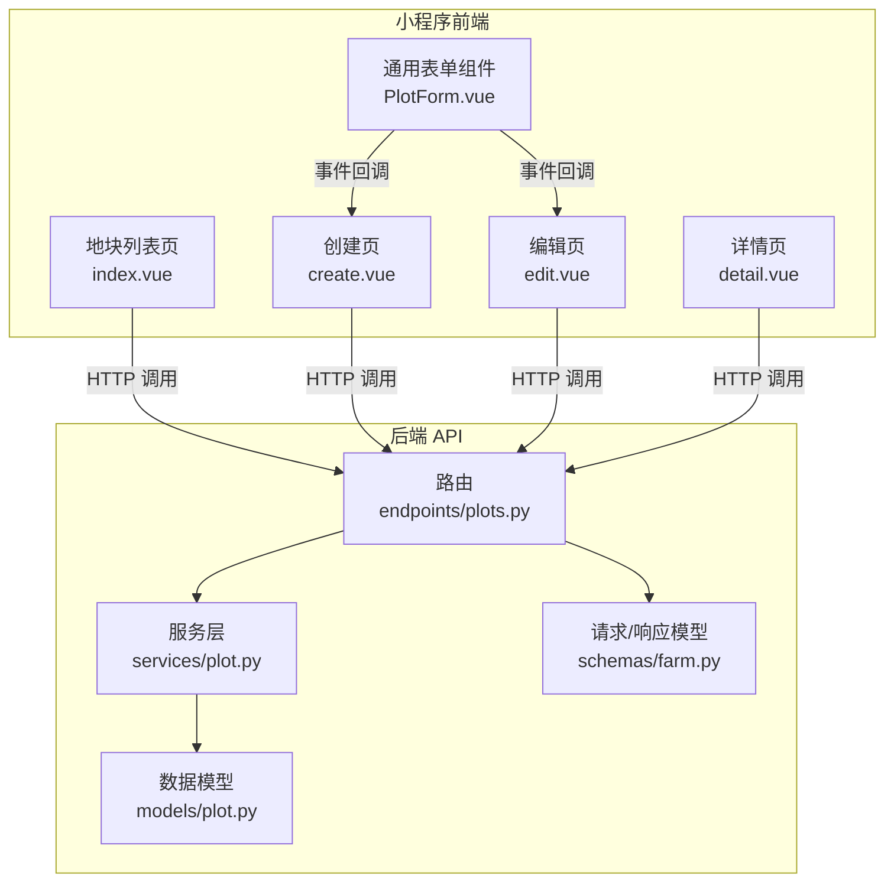
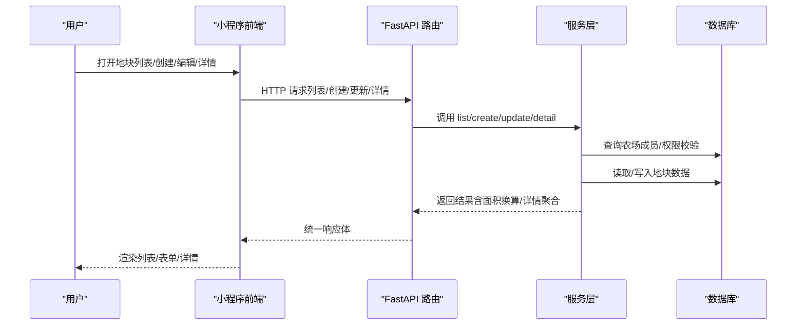
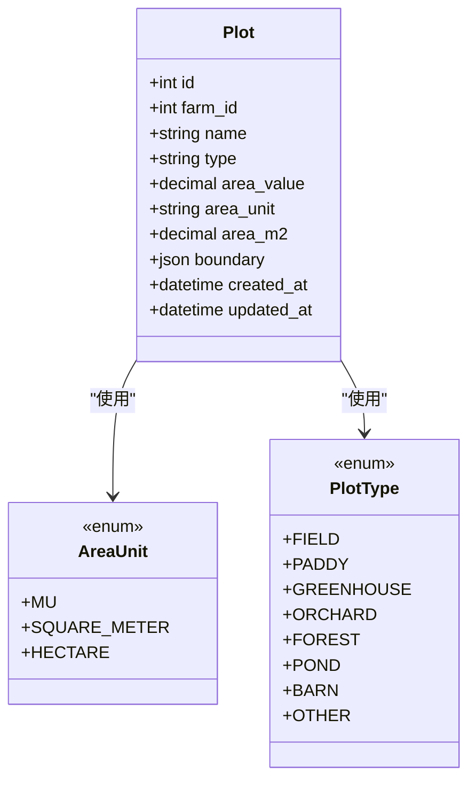
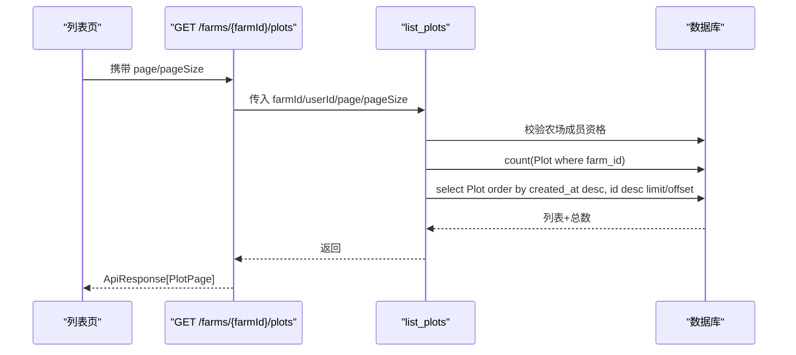
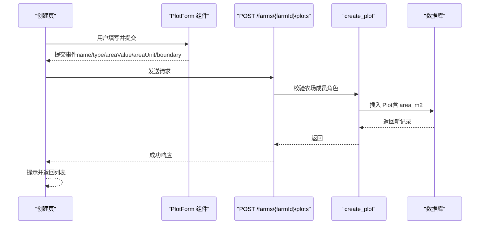
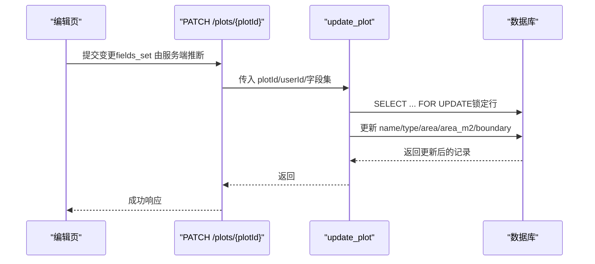
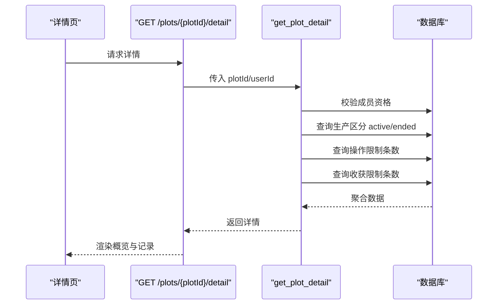
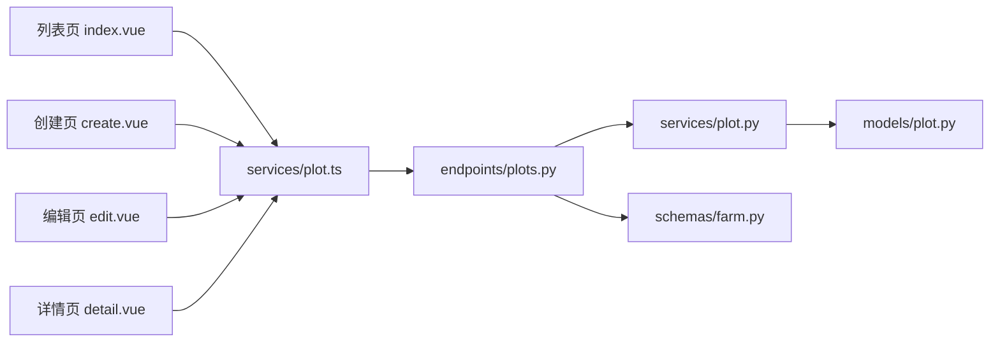

# 地块管理模块

<cite>
**本文引用的文件**
- [apps/api/app/models/plot.py](file://apps/api/app/models/plot.py)
- [apps/api/app/schemas/farm.py](file://apps/api/app/schemas/farm.py)
- [apps/api/app/services/plot.py](file://apps/api/app/services/plot.py)
- [apps/api/app/api/v1/endpoints/plots.py](file://apps/api/app/api/v1/endpoints/plots.py)
- [apps/miniapp/src/pages/plots/index.vue](file://apps/miniapp/src/pages/plots/index.vue)
- [apps/miniapp/src/pages/plots/create.vue](file://apps/miniapp/src/pages/plots/create.vue)
- [apps/miniapp/src/pages/plots/edit.vue](file://apps/miniapp/src/pages/plots/edit.vue)
- [apps/miniapp/src/pages/plots/detail.vue](file://apps/miniapp/src/pages/plots/detail.vue)
- [apps/miniapp/src/components/PlotForm.vue](file://apps/miniapp/src/components/PlotForm.vue)
- [apps/miniapp/src/services/plot.ts](file://apps/miniapp/src/services/plot.ts)
</cite>

## 目录
1. [简介](#简介)
2. [项目结构](#项目结构)
3. [核心组件](#核心组件)
4. [架构总览](#架构总览)
5. [详细组件分析](#详细组件分析)
6. [依赖关系分析](#依赖关系分析)
7. [性能与可扩展性](#性能与可扩展性)
8. [故障排查指南](#故障排查指南)
9. [结论](#结论)
10. [附录：API 参考](#附录api-参考)

## 简介
本模块为 Pocket Farm 的“农田地块”管理能力，覆盖地块的创建、编辑、删除（通过列表操作）、详情查看与可视化展示。它提供：
- 地块列表分页展示、筛选与选择模式
- 地块创建表单与编辑界面，支持面积与单位输入、边界地理信息存储
- 面积计算与单位换算（亩、平方米、公顷）
- 地块与农场的关联关系、权限控制与状态跟踪
- 地块详情页聚合当前种养、历史种养、农事记录与收获记录，并提供快捷入口

## 项目结构
后端采用 FastAPI + SQLAlchemy 异步服务，前端基于 uni-app Vue 页面与可复用表单组件。关键路径如下：
- 数据模型：定义地块实体、类型枚举、面积单位与边界字段
- 服务层：实现业务逻辑（权限校验、面积换算、CRUD、详情聚合）
- API 层：路由与请求/响应序列化
- 小程序端：列表页、创建/编辑页、详情页与通用表单组件

图表来源
- [apps/api/app/api/v1/endpoints/plots.py:139-246](file://apps/api/app/api/v1/endpoints/plots.py#L139-L246)
- [apps/api/app/services/plot.py:57-223](file://apps/api/app/services/plot.py#L57-L223)
- [apps/api/app/models/plot.py:14-53](file://apps/api/app/models/plot.py#L14-L53)
- [apps/api/app/schemas/farm.py:75-166](file://apps/api/app/schemas/farm.py#L75-L166)
- [apps/miniapp/src/pages/plots/index.vue:1-161](file://apps/miniapp/src/pages/plots/index.vue#L1-L161)
- [apps/miniapp/src/pages/plots/create.vue:1-86](file://apps/miniapp/src/pages/plots/create.vue#L1-L86)
- [apps/miniapp/src/pages/plots/edit.vue:1-137](file://apps/miniapp/src/pages/plots/edit.vue#L1-L137)
- [apps/miniapp/src/pages/plots/detail.vue:1-329](file://apps/miniapp/src/pages/plots/detail.vue#L1-L329)
- [apps/miniapp/src/components/PlotForm.vue:1-242](file://apps/miniapp/src/components/PlotForm.vue#L1-L242)

章节来源
- [apps/api/app/models/plot.py:14-53](file://apps/api/app/models/plot.py#L14-L53)
- [apps/api/app/services/plot.py:57-223](file://apps/api/app/services/plot.py#L57-L223)
- [apps/api/app/api/v1/endpoints/plots.py:139-246](file://apps/api/app/api/v1/endpoints/plots.py#L139-L246)
- [apps/api/app/schemas/farm.py:75-166](file://apps/api/app/schemas/farm.py#L75-L166)
- [apps/miniapp/src/pages/plots/index.vue:1-161](file://apps/miniapp/src/pages/plots/index.vue#L1-L161)
- [apps/miniapp/src/pages/plots/create.vue:1-86](file://apps/miniapp/src/pages/plots/create.vue#L1-L86)
- [apps/miniapp/src/pages/plots/edit.vue:1-137](file://apps/miniapp/src/pages/plots/edit.vue#L1-L137)
- [apps/miniapp/src/pages/plots/detail.vue:1-329](file://apps/miniapp/src/pages/plots/detail.vue#L1-L329)
- [apps/miniapp/src/components/PlotForm.vue:1-242](file://apps/miniapp/src/components/PlotForm.vue#L1-L242)

## 核心组件
- 数据模型 Plot：包含地块名称、类型、面积值与单位、标准平方米面积、边界 JSON、时间戳等
- 服务层 plot：实现列表、创建、更新、详情聚合、权限校验与面积换算
- API 路由：暴露 RESTful 接口，统一封装响应格式
- 前端页面：列表、创建、编辑、详情；通用表单组件负责输入与校验

章节来源
- [apps/api/app/models/plot.py:31-53](file://apps/api/app/models/plot.py#L31-L53)
- [apps/api/app/services/plot.py:47-223](file://apps/api/app/services/plot.py#L47-L223)
- [apps/api/app/api/v1/endpoints/plots.py:139-246](file://apps/api/app/api/v1/endpoints/plots.py#L139-L246)
- [apps/miniapp/src/components/PlotForm.vue:72-166](file://apps/miniapp/src/components/PlotForm.vue#L72-L166)

## 架构总览
下图展示了从用户操作到数据存储的完整链路，包括权限校验、面积换算、详情聚合与前端渲染。

图表来源
- [apps/api/app/api/v1/endpoints/plots.py:139-246](file://apps/api/app/api/v1/endpoints/plots.py#L139-L246)
- [apps/api/app/services/plot.py:57-223](file://apps/api/app/services/plot.py#L57-L223)
- [apps/miniapp/src/pages/plots/index.vue:112-161](file://apps/miniapp/src/pages/plots/index.vue#L112-L161)
- [apps/miniapp/src/pages/plots/create.vue:30-66](file://apps/miniapp/src/pages/plots/create.vue#L30-L66)
- [apps/miniapp/src/pages/plots/edit.vue:54-108](file://apps/miniapp/src/pages/plots/edit.vue#L54-L108)
- [apps/miniapp/src/pages/plots/detail.vue:257-328](file://apps/miniapp/src/pages/plots/detail.vue#L257-L328)

## 详细组件分析

### 数据模型与领域概念
- 地块类型：大田、水田、大棚、果园、林地、鱼塘、栏舍、其他
- 面积单位：亩、平方米、公顷
- 面积换算：以标准平方米为单位进行内部计算与存储
- 边界信息：JSON 字段，要求坐标系统为 GCJ02，用于后续可视化或地图叠加

图表来源
- [apps/api/app/models/plot.py:14-53](file://apps/api/app/models/plot.py#L14-L53)

章节来源
- [apps/api/app/models/plot.py:14-53](file://apps/api/app/models/plot.py#L14-L53)
- [apps/api/app/schemas/farm.py:75-166](file://apps/api/app/schemas/farm.py#L75-L166)

### 面积计算与单位转换
- 规则：当同时提供面积值与单位时，自动换算为标准平方米并持久化
- 换算系数：亩→平方米、公顷→平方米；平方米保持不变
- 前端展示：根据单位显示中文单位标签，未填写时提示不完整

图表来源
- [apps/api/app/services/plot.py:47-54](file://apps/api/app/services/plot.py#L47-L54)

章节来源
- [apps/api/app/services/plot.py:47-54](file://apps/api/app/services/plot.py#L47-L54)
- [apps/miniapp/src/pages/plots/index.vue:102-110](file://apps/miniapp/src/pages/plots/index.vue#L102-L110)
- [apps/miniapp/src/pages/plots/detail.vue:232-236](file://apps/miniapp/src/pages/plots/detail.vue#L232-L236)

### 地块列表与分页展示
- 功能：按农场维度列出地块，支持分页参数
- 排序：按创建时间与 ID 倒序
- 权限：需验证用户在目标农场中的成员身份
- 前端：支持“选择模式”，便于在其它业务流程中挑选地块

图表来源
- [apps/api/app/api/v1/endpoints/plots.py:139-161](file://apps/api/app/api/v1/endpoints/plots.py#L139-L161)
- [apps/api/app/services/plot.py:57-76](file://apps/api/app/services/plot.py#L57-L76)
- [apps/miniapp/src/pages/plots/index.vue:112-161](file://apps/miniapp/src/pages/plots/index.vue#L112-L161)

章节来源
- [apps/api/app/api/v1/endpoints/plots.py:139-161](file://apps/api/app/api/v1/endpoints/plots.py#L139-L161)
- [apps/api/app/services/plot.py:57-76](file://apps/api/app/services/plot.py#L57-L76)
- [apps/miniapp/src/pages/plots/index.vue:1-161](file://apps/miniapp/src/pages/plots/index.vue#L1-L161)

### 地块创建流程
- 表单：名称必填；类型可选；面积与单位需成对填写；支持边界 JSON（坐标系统必须为 GCJ02）
- 权限：仅农场拥有者或管理员可创建
- 后端：校验后创建记录，自动计算标准平方米

图表来源
- [apps/miniapp/src/pages/plots/create.vue:30-66](file://apps/miniapp/src/pages/plots/create.vue#L30-L66)
- [apps/miniapp/src/components/PlotForm.vue:158-166](file://apps/miniapp/src/components/PlotForm.vue#L158-L166)
- [apps/api/app/api/v1/endpoints/plots.py:164-185](file://apps/api/app/api/v1/endpoints/plots.py#L164-L185)
- [apps/api/app/services/plot.py:79-104](file://apps/api/app/services/plot.py#L79-L104)
- [apps/api/app/schemas/farm.py:75-99](file://apps/api/app/schemas/farm.py#L75-L99)

章节来源
- [apps/miniapp/src/pages/plots/create.vue:30-66](file://apps/miniapp/src/pages/plots/create.vue#L30-L66)
- [apps/api/app/api/v1/endpoints/plots.py:164-185](file://apps/api/app/api/v1/endpoints/plots.py#L164-L185)
- [apps/api/app/services/plot.py:79-104](file://apps/api/app/services/plot.py#L79-L104)
- [apps/api/app/schemas/farm.py:75-99](file://apps/api/app/schemas/farm.py#L75-L99)

### 地块编辑流程
- 能力：支持修改名称、类型、面积与单位、边界；面积与单位需成对更新
- 权限：仅农场拥有者或管理员可编辑
- 并发安全：更新时使用行级锁避免竞态

图表来源
- [apps/miniapp/src/pages/plots/edit.vue:76-108](file://apps/miniapp/src/pages/plots/edit.vue#L76-L108)
- [apps/api/app/api/v1/endpoints/plots.py:227-246](file://apps/api/app/api/v1/endpoints/plots.py#L227-L246)
- [apps/api/app/services/plot.py:186-223](file://apps/api/app/services/plot.py#L186-L223)

章节来源
- [apps/miniapp/src/pages/plots/edit.vue:76-108](file://apps/miniapp/src/pages/plots/edit.vue#L76-L108)
- [apps/api/app/api/v1/endpoints/plots.py:227-246](file://apps/api/app/api/v1/endpoints/plots.py#L227-L246)
- [apps/api/app/services/plot.py:186-223](file://apps/api/app/services/plot.py#L186-L223)

### 地块详情与状态跟踪
- 内容：地块基本信息、当前种养（进行中）、历史种养（已结束）、农事记录、收获记录
- 统计：分别给出操作与收获的总数
- 权限：需具备对应农场成员身份才能访问

图表来源
- [apps/miniapp/src/pages/plots/detail.vue:257-328](file://apps/miniapp/src/pages/plots/detail.vue#L257-L328)
- [apps/api/app/api/v1/endpoints/plots.py:198-224](file://apps/api/app/api/v1/endpoints/plots.py#L198-L224)
- [apps/api/app/services/plot.py:124-183](file://apps/api/app/services/plot.py#L124-L183)

章节来源
- [apps/miniapp/src/pages/plots/detail.vue:257-328](file://apps/miniapp/src/pages/plots/detail.vue#L257-L328)
- [apps/api/app/api/v1/endpoints/plots.py:198-224](file://apps/api/app/api/v1/endpoints/plots.py#L198-L224)
- [apps/api/app/services/plot.py:124-183](file://apps/api/app/services/plot.py#L124-L183)

### 地理信息与可视化
- 边界字段：JSON 结构，要求 coordinateSystem 为 GCJ02
- 用途：可用于地图绘制、面积估算或与其他地理数据叠加
- 约束：非 GCJ02 将被拒绝，保证坐标系一致性

章节来源
- [apps/api/app/schemas/farm.py:163-166](file://apps/api/app/schemas/farm.py#L163-L166)
- [apps/api/app/models/plot.py:46-46](file://apps/api/app/models/plot.py#L46-L46)

### 业务流程与用户体验优化
- 列表页
  - 支持“选择模式”，便于在其他流程中快速选择地块
  - 未填写面积时高亮提示，引导完善信息
- 创建/编辑
  - 面积与单位联动校验，避免不一致
  - 表单组件复用，统一交互体验
- 详情页
  - 聚合关键指标（面积、当前种养数量、创建日期）
  - 快捷入口：开始种养、记农事、记收获
  - 历史记录分节展示，提升可读性
- 权限与错误处理
  - 未登录或无权限时跳转登录或提示
  - 网络异常时友好提示并重试

章节来源
- [apps/miniapp/src/pages/plots/index.vue:1-161](file://apps/miniapp/src/pages/plots/index.vue#L1-L161)
- [apps/miniapp/src/pages/plots/create.vue:30-66](file://apps/miniapp/src/pages/plots/create.vue#L30-L66)
- [apps/miniapp/src/pages/plots/edit.vue:54-108](file://apps/miniapp/src/pages/plots/edit.vue#L54-L108)
- [apps/miniapp/src/pages/plots/detail.vue:20-161](file://apps/miniapp/src/pages/plots/detail.vue#L20-L161)

## 依赖关系分析
- 前端依赖
  - 页面依赖 services/plot.ts 提供的 HTTP 方法
  - 表单依赖 PlotForm 组件，统一输入与校验
- 后端依赖
  - 路由依赖服务层与 Pydantic Schema
  - 服务层依赖模型与数据库会话，执行权限校验与业务逻辑

图表来源
- [apps/miniapp/src/pages/plots/index.vue:112-161](file://apps/miniapp/src/pages/plots/index.vue#L112-L161)
- [apps/miniapp/src/pages/plots/create.vue:30-66](file://apps/miniapp/src/pages/plots/create.vue#L30-L66)
- [apps/miniapp/src/pages/plots/edit.vue:54-108](file://apps/miniapp/src/pages/plots/edit.vue#L54-L108)
- [apps/miniapp/src/pages/plots/detail.vue:257-328](file://apps/miniapp/src/pages/plots/detail.vue#L257-L328)
- [apps/miniapp/src/services/plot.ts:56-84](file://apps/miniapp/src/services/plot.ts#L56-L84)
- [apps/api/app/api/v1/endpoints/plots.py:139-246](file://apps/api/app/api/v1/endpoints/plots.py#L139-L246)
- [apps/api/app/services/plot.py:57-223](file://apps/api/app/services/plot.py#L57-L223)
- [apps/api/app/models/plot.py:14-53](file://apps/api/app/models/plot.py#L14-L53)
- [apps/api/app/schemas/farm.py:75-166](file://apps/api/app/schemas/farm.py#L75-L166)

章节来源
- [apps/miniapp/src/services/plot.ts:56-84](file://apps/miniapp/src/services/plot.ts#L56-L84)
- [apps/api/app/api/v1/endpoints/plots.py:139-246](file://apps/api/app/api/v1/endpoints/plots.py#L139-L246)
- [apps/api/app/services/plot.py:57-223](file://apps/api/app/services/plot.py#L57-L223)

## 性能与可扩展性
- 列表分页：通过 page/pageSize 控制数据量，减少传输与渲染压力
- 详情聚合限制：操作与收获记录限制最大条数，避免大数据量导致响应过大
- 数据库索引：地块表按 farm_id 建立索引，加速按农场查询
- 并发安全：更新使用行级锁，防止并发写冲突
- 扩展点
  - 新增地块类型只需扩展枚举与前端映射
  - 新增面积单位需在服务层添加换算逻辑
  - 边界字段可承载更多地理信息，便于未来地图集成

章节来源
- [apps/api/app/services/plot.py:150-173](file://apps/api/app/services/plot.py#L150-L173)
- [apps/api/app/models/plot.py:35-40](file://apps/api/app/models/plot.py#L35-L40)
- [apps/api/app/services/plot.py:198-203](file://apps/api/app/services/plot.py#L198-L203)

## 故障排查指南
- 401 未授权
  - 现象：加载失败并跳转登录
  - 原因：令牌过期或缺失
  - 处理：清除本地令牌并重新登录
- 403 无权限
  - 现象：创建/编辑失败
  - 原因：非农场拥有者或管理员
  - 处理：联系管理员调整角色
- 404 未找到
  - 现象：详情/编辑无法加载
  - 原因：地块不存在或无权访问
  - 处理：检查链接与权限
- 参数校验失败
  - 现象：创建/编辑时报错
  - 原因：面积与单位未成对、边界坐标系不正确
  - 处理：确保成对填写，坐标系统为 GCJ02

章节来源
- [apps/miniapp/src/pages/plots/index.vue:118-127](file://apps/miniapp/src/pages/plots/index.vue#L118-L127)
- [apps/miniapp/src/pages/plots/create.vue:53-61](file://apps/miniapp/src/pages/plots/create.vue#L53-L61)
- [apps/miniapp/src/pages/plots/edit.vue:65-73](file://apps/miniapp/src/pages/plots/edit.vue#L65-L73)
- [apps/api/app/services/plot.py:34-44](file://apps/api/app/services/plot.py#L34-L44)
- [apps/api/app/schemas/farm.py:94-99](file://apps/api/app/schemas/farm.py#L94-L99)
- [apps/api/app/schemas/farm.py:122-130](file://apps/api/app/schemas/farm.py#L122-L130)
- [apps/api/app/schemas/farm.py:163-166](file://apps/api/app/schemas/farm.py#L163-L166)

## 结论
本模块围绕“地块”这一核心资产，提供了完整的生命周期管理能力：从创建、编辑到详情聚合与状态跟踪。通过严格的权限校验、面积换算与边界约束，保证了数据的准确性与一致性。前端以清晰的列表、表单与详情页组织信息，结合快捷操作提升效率。建议在后续迭代中增强地图可视化、批量操作与更细粒度的权限策略。

## 附录：API 参考
- 列表
  - GET /farms/{farm_id}/plots?page=1&pageSize=20
  - 返回：ApiResponse[PlotPage]
- 创建
  - POST /farms/{farm_id}/plots
  - 请求体：CreatePlotRequest（name、type、areaValue、areaUnit、boundary）
  - 返回：ApiResponse[PlotResponse]
- 详情
  - GET /plots/{plot_id}
  - 返回：ApiResponse[PlotResponse]
- 详情聚合
  - GET /plots/{plot_id}/detail
  - 返回：ApiResponse[PlotDetailResponse]
- 更新
  - PATCH /plots/{plot_id}
  - 请求体：UpdatePlotRequest（name、type、areaValue、areaUnit、boundary）
  - 返回：ApiResponse[PlotResponse]

章节来源
- [apps/api/app/api/v1/endpoints/plots.py:139-246](file://apps/api/app/api/v1/endpoints/plots.py#L139-L246)
- [apps/api/app/schemas/farm.py:75-166](file://apps/api/app/schemas/farm.py#L75-L166)