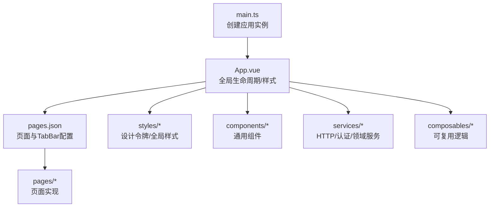
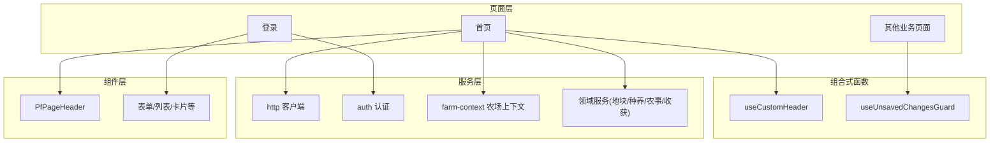
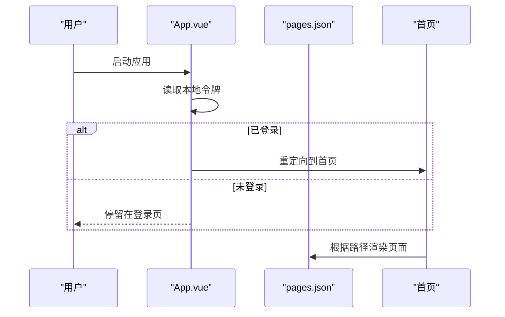
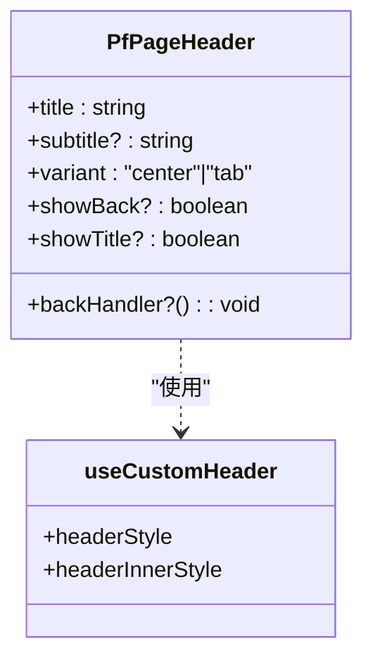
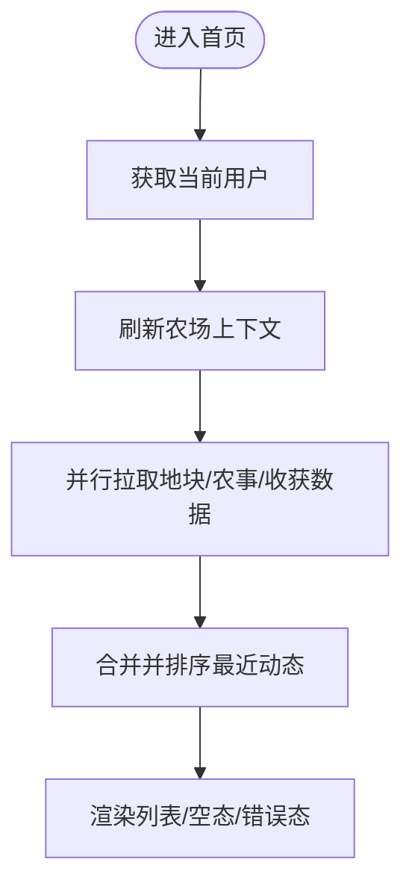
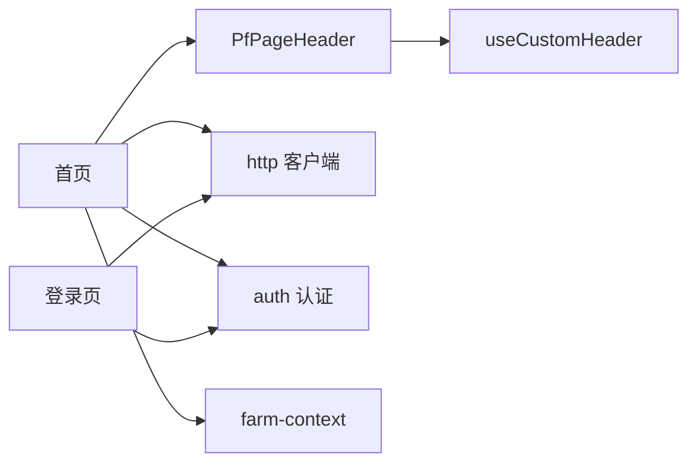

# 应用架构设计

<cite>
**本文引用的文件**
- [apps/miniapp/package.json](file://apps/miniapp/package.json)
- [apps/miniapp/vite.config.ts](file://apps/miniapp/vite.config.ts)
- [apps/miniapp/src/main.ts](file://apps/miniapp/src/main.ts)
- [apps/miniapp/src/App.vue](file://apps/miniapp/src/App.vue)
- [apps/miniapp/src/pages.json](file://apps/miniapp/src/pages.json)
- [apps/miniapp/src/manifest.json](file://apps/miniapp/src/manifest.json)
- [apps/miniapp/src/services/http.ts](file://apps/miniapp/src/services/http.ts)
- [apps/miniapp/src/services/auth.ts](file://apps/miniapp/src/services/auth.ts)
- [apps/miniapp/src/services/farm-context.ts](file://apps/miniapp/src/services/farm-context.ts)
- [apps/miniapp/src/composables/useCustomHeader.ts](file://apps/miniapp/src/composables/useCustomHeader.ts)
- [apps/miniapp/src/composables/useUnsavedChangesGuard.ts](file://apps/miniapp/src/composables/useUnsavedChangesGuard.ts)
- [apps/miniapp/src/styles/pocket-farm.scss](file://apps/miniapp/src/styles/pocket-farm.scss)
- [apps/miniapp/src/styles/design-tokens.scss](file://apps/miniapp/src/styles/design-tokens.scss)
- [apps/miniapp/src/components/PfPageHeader.vue](file://apps/miniapp/src/components/PfPageHeader.vue)
- [apps/miniapp/src/pages/home/index.vue](file://apps/miniapp/src/pages/home/index.vue)
- [apps/miniapp/src/pages/auth/login.vue](file://apps/miniapp/src/pages/auth/login.vue)
</cite>

## 目录
1. [简介](#简介)
2. [项目结构](#项目结构)
3. [核心组件](#核心组件)
4. [架构总览](#架构总览)
5. [详细组件分析](#详细组件分析)
6. [依赖关系分析](#依赖关系分析)
7. [性能与优化](#性能与优化)
8. [故障排查指南](#故障排查指南)
9. [结论](#结论)
10. [附录](#附录)

## 简介
本技术文档面向 Pocket Farm 前端应用（基于 Vue 3 + UniApp）的跨平台架构，覆盖项目结构组织、模块化设计原则、构建配置、路由导航系统、页面组织结构、组件层次结构、状态管理方案、移动端适配策略、多端兼容性处理与性能优化。同时提供开发环境配置、构建流程与部署策略说明，并总结架构决策的技术背景与扩展性考虑。

## 项目结构
- 工程采用 monorepo 形式，前端位于 apps/miniapp，后端位于 apps/api。本文聚焦前端。
- 前端使用 Vite + @dcloudio/vite-plugin-uni 作为构建工具，通过 uni-app 的多端能力统一编译到 H5 与各小程序平台。
- 入口文件 main.ts 创建 SSR 应用实例；App.vue 负责全局生命周期与样式注入；pages.json 集中声明页面路由与 tabBar。
- 业务代码按领域划分：services（HTTP、认证、领域服务）、composables（可复用逻辑）、components（通用 UI 组件）、styles（设计令牌与全局样式）。

图表来源
- [apps/miniapp/src/main.ts:1-9](file://apps/miniapp/src/main.ts#L1-L9)
- [apps/miniapp/src/App.vue:1-25](file://apps/miniapp/src/App.vue#L1-L25)
- [apps/miniapp/src/pages.json:1-217](file://apps/miniapp/src/pages.json#L1-L217)

章节来源
- [apps/miniapp/package.json:1-73](file://apps/miniapp/package.json#L1-L73)
- [apps/miniapp/vite.config.ts:1-8](file://apps/miniapp/vite.config.ts#L1-L8)
- [apps/miniapp/src/main.ts:1-9](file://apps/miniapp/src/main.ts#L1-L9)
- [apps/miniapp/src/App.vue:1-25](file://apps/miniapp/src/App.vue#L1-L25)
- [apps/miniapp/src/pages.json:1-217](file://apps/miniapp/src/pages.json#L1-L217)

## 核心组件
- HTTP 客户端：封装 uni.request，统一请求基地址、鉴权头、响应信封解析、错误类型化与 401 清理 token 流程。
- 认证服务：本地存取访问令牌，提供获取、设置、清除与存在性判断。
- 农场上下文：维护当前农场选择，持久化至本地存储，支持从 API 同步可用农场列表并回退策略。
- 自定义头部：计算状态栏高度与胶囊按钮空间，为微信小程序等平台的自定义导航栏提供安全间距。
- 未保存变更保护：在支持的平台启用返回拦截提示，避免误操作丢失表单数据。
- 设计令牌与全局样式：以 SCSS 变量定义颜色、间距、圆角、阴影与动效时长，保证视觉一致性。

章节来源
- [apps/miniapp/src/services/http.ts:1-106](file://apps/miniapp/src/services/http.ts#L1-L106)
- [apps/miniapp/src/services/auth.ts:1-18](file://apps/miniapp/src/services/auth.ts#L1-L18)
- [apps/miniapp/src/services/farm-context.ts:1-94](file://apps/miniapp/src/services/farm-context.ts#L1-L94)
- [apps/miniapp/src/composables/useCustomHeader.ts:1-39](file://apps/miniapp/src/composables/useCustomHeader.ts#L1-L39)
- [apps/miniapp/src/composables/useUnsavedChangesGuard.ts:1-28](file://apps/miniapp/src/composables/useUnsavedChangesGuard.ts#L1-L28)
- [apps/miniapp/src/styles/design-tokens.scss:1-74](file://apps/miniapp/src/styles/design-tokens.scss#L1-L74)
- [apps/miniapp/src/styles/pocket-farm.scss:1-78](file://apps/miniapp/src/styles/pocket-farm.scss#L1-L78)

## 架构总览
整体采用“页面-组件-组合式函数-服务”的分层模式：
- 页面层：基于 pages.json 的路由组织，承载业务视图与交互。
- 组件层：通用 UI 组件（如 PfPageHeader）与业务卡片组件，提升复用度。
- 组合式函数层：跨页面复用的逻辑（如自定义头部尺寸计算、未保存变更保护）。
- 服务层：网络请求、认证、领域数据聚合（农场、地块、种养、农事、收获等）。

图表来源
- [apps/miniapp/src/pages/home/index.vue:1-300](file://apps/miniapp/src/pages/home/index.vue#L1-L300)
- [apps/miniapp/src/pages/auth/login.vue:1-359](file://apps/miniapp/src/pages/auth/login.vue#L1-L359)
- [apps/miniapp/src/components/PfPageHeader.vue:1-130](file://apps/miniapp/src/components/PfPageHeader.vue#L1-L130)
- [apps/miniapp/src/composables/useCustomHeader.ts:1-39](file://apps/miniapp/src/composables/useCustomHeader.ts#L1-L39)
- [apps/miniapp/src/composables/useUnsavedChangesGuard.ts:1-28](file://apps/miniapp/src/composables/useUnsavedChangesGuard.ts#L1-L28)
- [apps/miniapp/src/services/http.ts:1-106](file://apps/miniapp/src/services/http.ts#L1-L106)
- [apps/miniapp/src/services/auth.ts:1-18](file://apps/miniapp/src/services/auth.ts#L1-L18)
- [apps/miniapp/src/services/farm-context.ts:1-94](file://apps/miniapp/src/services/farm-context.ts#L1-L94)

## 详细组件分析

### 路由与导航系统
- 路由声明：所有页面在 pages.json 中集中注册，包含导航栏标题、样式与 tabBar 配置。
- 启动导航：App.vue 在应用启动时检查本地是否存在访问令牌，若存在则直接跳转到首页。
- 页面内导航：页面通过 uni.navigateTo/reLaunch 进行跳转，携带必要查询参数（如 farmId、plotId）。
- 自定义导航栏：通过 useCustomHeader 计算状态栏与胶囊按钮空间，配合 PfPageHeader 实现一致的顶部区域。

图表来源
- [apps/miniapp/src/App.vue:1-25](file://apps/miniapp/src/App.vue#L1-L25)
- [apps/miniapp/src/pages.json:1-217](file://apps/miniapp/src/pages.json#L1-L217)
- [apps/miniapp/src/pages/home/index.vue:1-300](file://apps/miniapp/src/pages/home/index.vue#L1-L300)

章节来源
- [apps/miniapp/src/pages.json:1-217](file://apps/miniapp/src/pages.json#L1-L217)
- [apps/miniapp/src/App.vue:1-25](file://apps/miniapp/src/App.vue#L1-L25)
- [apps/miniapp/src/pages/home/index.vue:1-300](file://apps/miniapp/src/pages/home/index.vue#L1-L300)

### 组件层次结构
- 通用组件：PfPageHeader 提供统一的页面头部，支持标题、副标题、返回按钮与不同变体样式，并通过 useCustomHeader 适配多端导航栏差异。
- 页面级组件：首页聚合多个业务入口与最近动态列表，展示加载态、空态与错误态。
- 表单组件：登录页使用 uv-input/uv-button 等基础组件，结合本地校验与倒计时逻辑。

图表来源
- [apps/miniapp/src/components/PfPageHeader.vue:1-130](file://apps/miniapp/src/components/PfPageHeader.vue#L1-L130)
- [apps/miniapp/src/composables/useCustomHeader.ts:1-39](file://apps/miniapp/src/composables/useCustomHeader.ts#L1-L39)

章节来源
- [apps/miniapp/src/components/PfPageHeader.vue:1-130](file://apps/miniapp/src/components/PfPageHeader.vue#L1-L130)
- [apps/miniapp/src/pages/home/index.vue:1-300](file://apps/miniapp/src/pages/home/index.vue#L1-L300)
- [apps/miniapp/src/pages/auth/login.vue:1-359](file://apps/miniapp/src/pages/auth/login.vue#L1-L359)

### 状态管理方案
- 轻量状态：使用 Vue 3 响应式 ref/computed 管理页面级状态（如首页的动态列表、加载与错误信息）。
- 跨页面上下文：农场上下文通过本地存储持久化当前农场选择，并提供刷新与同步策略，确保切换或登录后状态一致。
- 认证状态：访问令牌存储在本地，HTTP 客户端自动附加 Authorization 头并在 401 时清理。

图表来源
- [apps/miniapp/src/pages/home/index.vue:1-300](file://apps/miniapp/src/pages/home/index.vue#L1-L300)
- [apps/miniapp/src/services/farm-context.ts:1-94](file://apps/miniapp/src/services/farm-context.ts#L1-L94)

章节来源
- [apps/miniapp/src/services/farm-context.ts:1-94](file://apps/miniapp/src/services/farm-context.ts#L1-L94)
- [apps/miniapp/src/pages/home/index.vue:1-300](file://apps/miniapp/src/pages/home/index.vue#L1-L300)

### 移动端适配与多端兼容
- 自定义导航栏：通过 useCustomHeader 计算状态栏高度与胶囊按钮位置，适配微信小程序等平台。
- 安全区域：登录页底部使用 env(safe-area-inset-bottom) 适配刘海屏等设备。
- 多端构建：package.json 提供多端开发与构建脚本，manifest.json 配置各平台特性与权限。

章节来源
- [apps/miniapp/src/composables/useCustomHeader.ts:1-39](file://apps/miniapp/src/composables/useCustomHeader.ts#L1-L39)
- [apps/miniapp/src/pages/auth/login.vue:1-359](file://apps/miniapp/src/pages/auth/login.vue#L1-L359)
- [apps/miniapp/package.json:1-73](file://apps/miniapp/package.json#L1-L73)
- [apps/miniapp/src/manifest.json:1-70](file://apps/miniapp/src/manifest.json#L1-L70)

### 构建配置与部署策略
- 构建工具：Vite + @dcloudio/vite-plugin-uni，vite.config.ts 仅引入插件，保持最小配置。
- 多端脚本：package.json 提供 dev/build 多端命令，便于开发与发布。
- 环境变量：API 基地址通过 import.meta.env.VITE_API_BASE_URL 注入，便于不同环境切换。
- 部署：各平台产物可通过对应构建命令生成，按平台要求上传发布。

章节来源
- [apps/miniapp/vite.config.ts:1-8](file://apps/miniapp/vite.config.ts#L1-L8)
- [apps/miniapp/package.json:1-73](file://apps/miniapp/package.json#L1-L73)
- [apps/miniapp/src/services/http.ts:1-106](file://apps/miniapp/src/services/http.ts#L1-L106)

## 依赖关系分析
- 页面依赖组件与组合式函数，组件依赖设计令牌与基础 UI 库。
- 页面与服务层解耦：通过 services 模块统一封装网络与领域逻辑，降低页面复杂度。
- 认证与 HTTP 客户端强耦合：认证服务提供令牌存取，HTTP 客户端自动附加并处理 401。

图表来源
- [apps/miniapp/src/pages/home/index.vue:1-300](file://apps/miniapp/src/pages/home/index.vue#L1-L300)
- [apps/miniapp/src/components/PfPageHeader.vue:1-130](file://apps/miniapp/src/components/PfPageHeader.vue#L1-L130)
- [apps/miniapp/src/composables/useCustomHeader.ts:1-39](file://apps/miniapp/src/composables/useCustomHeader.ts#L1-L39)
- [apps/miniapp/src/services/http.ts:1-106](file://apps/miniapp/src/services/http.ts#L1-L106)
- [apps/miniapp/src/services/auth.ts:1-18](file://apps/miniapp/src/services/auth.ts#L1-L18)
- [apps/miniapp/src/services/farm-context.ts:1-94](file://apps/miniapp/src/services/farm-context.ts#L1-L94)
- [apps/miniapp/src/pages/auth/login.vue:1-359](file://apps/miniapp/src/pages/auth/login.vue#L1-L359)

章节来源
- [apps/miniapp/src/pages/home/index.vue:1-300](file://apps/miniapp/src/pages/home/index.vue#L1-L300)
- [apps/miniapp/src/pages/auth/login.vue:1-359](file://apps/miniapp/src/pages/auth/login.vue#L1-L359)
- [apps/miniapp/src/services/http.ts:1-106](file://apps/miniapp/src/services/http.ts#L1-L106)
- [apps/miniapp/src/services/auth.ts:1-18](file://apps/miniapp/src/services/auth.ts#L1-L18)
- [apps/miniapp/src/services/farm-context.ts:1-94](file://apps/miniapp/src/services/farm-context.ts#L1-L94)

## 性能与优化
- 并发请求：首页在加载仪表盘数据时使用 Promise.all 并行拉取地块、成员、种养、农事与收获数据，减少首屏等待时间。
- 数据裁剪：按需限制列表项数量（如最近动态取前 5 条），降低渲染压力。
- 状态持久化：农场上下文与访问令牌本地持久化，避免重复请求与频繁状态重建。
- 样式优化：使用设计令牌与 rpx 单位，保证在不同屏幕下的良好表现与一致性。
- 构建优化：Vite 快速热更新与按需打包，配合多端构建脚本提高开发效率。

[本节为通用指导，不直接分析具体文件]

## 故障排查指南
- 网络错误：HTTP 客户端将失败与业务错误统一包装为 ApiRequestError，包含 code、message、statusCode 与 details，便于上层捕获与提示。
- 鉴权失效：当服务端返回 401 时，自动清理本地令牌并引导重新登录。
- 表单未保存：在未支持的平台静默降级，在支持的平台启用返回拦截提示，防止误离开。
- 导航异常：确认 pages.json 中页面路径与跳转 URL 一致，必要时使用 reLaunch 替换栈。

章节来源
- [apps/miniapp/src/services/http.ts:1-106](file://apps/miniapp/src/services/http.ts#L1-L106)
- [apps/miniapp/src/services/auth.ts:1-18](file://apps/miniapp/src/services/auth.ts#L1-L18)
- [apps/miniapp/src/composables/useUnsavedChangesGuard.ts:1-28](file://apps/miniapp/src/composables/useUnsavedChangesGuard.ts#L1-L28)
- [apps/miniapp/src/pages.json:1-217](file://apps/miniapp/src/pages.json#L1-L217)

## 结论
Pocket Farm 前端采用清晰的层级与模块化设计，借助 Vue 3 的组合式 API 与 UniApp 的多端能力，实现了跨平台的一致体验。通过统一的 HTTP 客户端、认证与农场上下文，降低了页面复杂度并提升了可维护性。设计令牌与自定义头部适配确保了良好的移动端体验。未来可扩展更多领域服务与组件，进一步抽象业务逻辑，提升复用性与测试覆盖率。

[本节为总结，不直接分析具体文件]

## 附录
- 开发环境配置
  - 安装依赖后，使用 package.json 中的多端脚本进行开发与构建。
  - 通过环境变量配置 API 基地址，便于不同环境切换。
- 构建与发布
  - 使用对应的 build 命令生成目标平台产物，按平台规范上传发布。
- 扩展建议
  - 新增页面需在 pages.json 中注册，遵循现有路由与导航约定。
  - 新增服务建议在 services 下按领域拆分，保持单一职责。
  - 新增组件放入 components，并通过设计令牌统一风格。

[本节为补充说明，不直接分析具体文件]