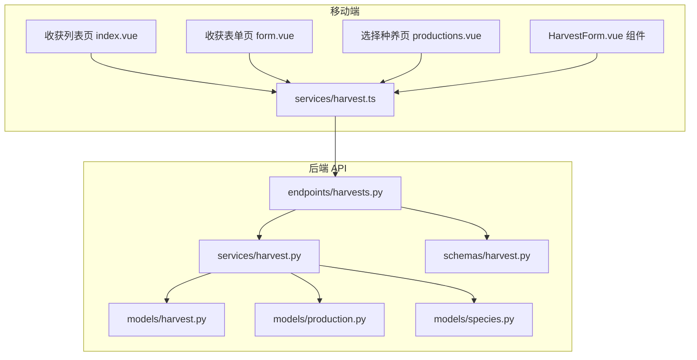
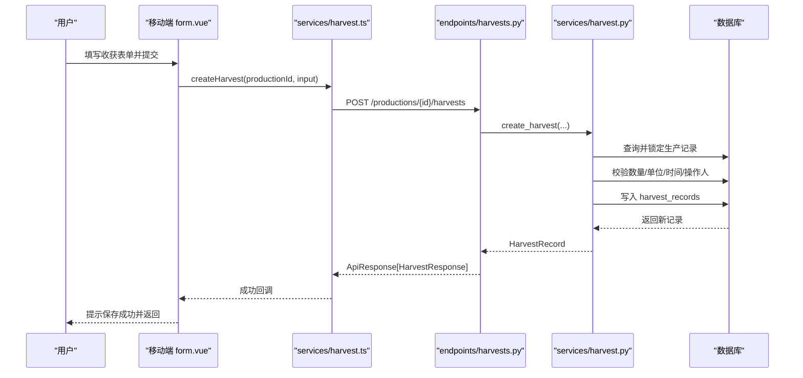
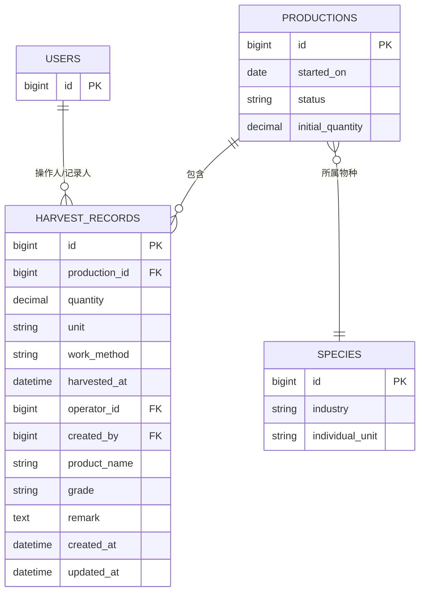
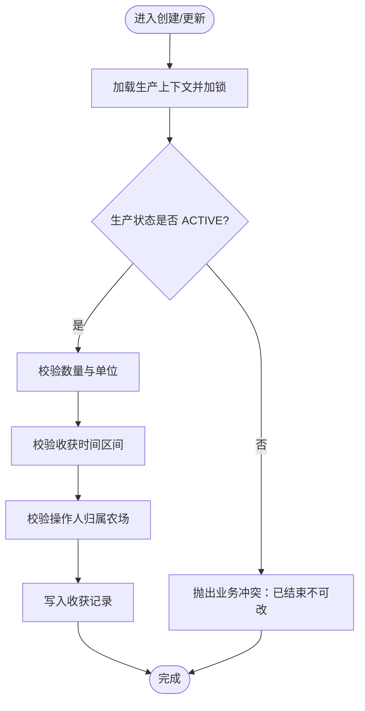
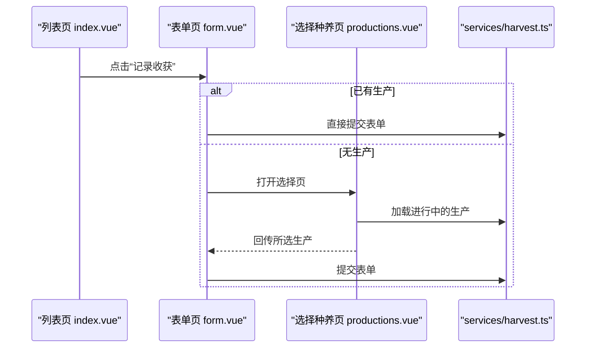
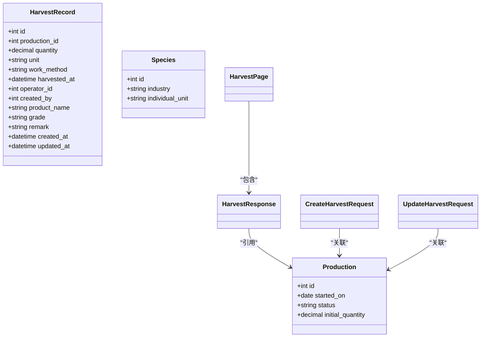
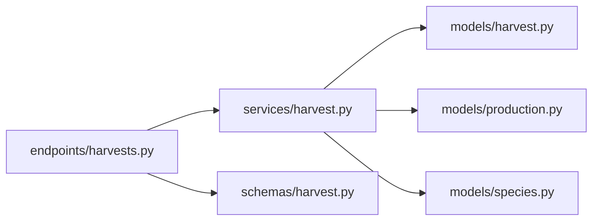
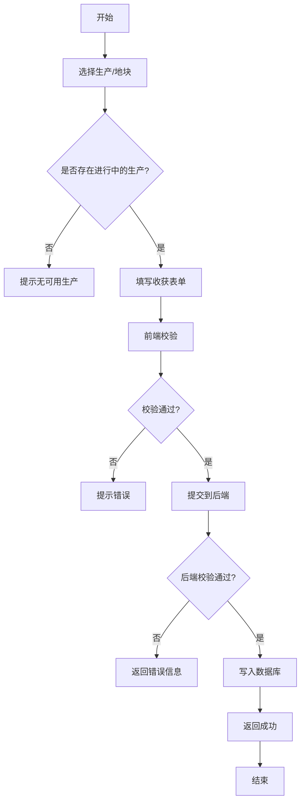

# 收获管理模块

<cite>
**本文引用的文件**
- [harvest.py（模型）](file://apps/api/app/models/harvest.py)
- [harvest.py（Schema）](file://apps/api/app/schemas/harvest.py)
- [harvest.py（服务）](file://apps/api/app/services/harvest.py)
- [harvests.py（API 端点）](file://apps/api/app/api/v1/endpoints/harvests.py)
- [production.py（模型）](file://apps/api/app/models/production.py)
- [species.py（模型）](file://apps/api/app/models/species.py)
- [b8e4d2a1c673_create_harvest_records.py（迁移）](file://apps/api/alembic/versions/b8e4d2a1c673_create_harvest_records.py)
- [index.vue（收获列表页）](file://apps/miniapp/src/pages/harvests/index.vue)
- [form.vue（收获表单页）](file://apps/miniapp/src/pages/harvests/form.vue)
- [productions.vue（选择种养页）](file://apps/miniapp/src/pages/harvests/productions.vue)
- [HarvestForm.vue（收获表单组件）](file://apps/miniapp/src/components/HarvestForm.vue)
- [harvest.ts（前端服务）](file://apps/miniapp/src/services/harvest.ts)
</cite>

## 目录
1. [简介](#简介)
2. [项目结构](#项目结构)
3. [核心组件](#核心组件)
4. [架构总览](#架构总览)
5. [详细组件分析](#详细组件分析)
6. [依赖关系分析](#依赖关系分析)
7. [性能与扩展性](#性能与扩展性)
8. [故障排查指南](#故障排查指南)
9. [结论](#结论)
10. [附录：业务流程与移动端最佳实践](#附录：业务流程与移动端最佳实践)

## 简介
本模块为 Pocket Farm 的“收获管理”提供端到端能力，覆盖从移动端数据采集到后端持久化、权限校验、数据一致性保障的全链路。功能包括：
- 收获记录创建、编辑、删除与分页查询
- 按生产批次或地块维度查看收获列表
- 与生产、作物（物种）、地块、农场成员的关联与权限控制
- 质量评估字段（等级、备注、产品名称）记录
- 面向移动端的友好录入体验（自动单位、日期时间约束、操作人选择等）

## 项目结构
收获管理涉及前后端多文件协作：
- 后端：FastAPI 路由 + Pydantic Schema + SQLAlchemy 模型 + 业务服务层
- 前端：UniApp Vue 页面 + 可复用表单组件 + HTTP 服务封装

图表来源
- [harvests.py（API 端点）:1-163](file://apps/api/app/api/v1/endpoints/harvests.py#L1-L163)
- [harvest.py（服务）:1-281](file://apps/api/app/services/harvest.py#L1-L281)
- [harvest.py（模型）:1-48](file://apps/api/app/models/harvest.py#L1-L48)
- [harvest.py（Schema）:1-111](file://apps/api/app/schemas/harvest.py#L1-L111)
- [production.py（模型）:1-79](file://apps/api/app/models/production.py#L1-L79)
- [species.py（模型）:1-35](file://apps/api/app/models/species.py#L1-L35)
- [index.vue:1-263](file://apps/miniapp/src/pages/harvests/index.vue#L1-L263)
- [form.vue:1-223](file://apps/miniapp/src/pages/harvests/form.vue#L1-L223)
- [productions.vue:1-138](file://apps/miniapp/src/pages/harvests/productions.vue#L1-L138)
- [HarvestForm.vue:1-311](file://apps/miniapp/src/components/HarvestForm.vue#L1-L311)
- [harvest.ts:1-92](file://apps/miniapp/src/services/harvest.ts#L1-L92)

章节来源
- [harvests.py（API 端点）:1-163](file://apps/api/app/api/v1/endpoints/harvests.py#L1-L163)
- [harvest.py（服务）:1-281](file://apps/api/app/services/harvest.py#L1-L281)
- [harvest.py（模型）:1-48](file://apps/api/app/models/harvest.py#L1-L48)
- [harvest.py（Schema）:1-111](file://apps/api/app/schemas/harvest.py#L1-L111)
- [production.py（模型）:1-79](file://apps/api/app/models/production.py#L1-L79)
- [species.py（模型）:1-35](file://apps/api/app/models/species.py#L1-L35)
- [index.vue:1-263](file://apps/miniapp/src/pages/harvests/index.vue#L1-L263)
- [form.vue:1-223](file://apps/miniapp/src/pages/harvests/form.vue#L1-L223)
- [productions.vue:1-138](file://apps/miniapp/src/pages/harvests/productions.vue#L1-L138)
- [HarvestForm.vue:1-311](file://apps/miniapp/src/components/HarvestForm.vue#L1-L311)
- [harvest.ts:1-92](file://apps/miniapp/src/services/harvest.ts#L1-L92)

## 核心组件
- 数据模型 HarvestRecord：承载单次收获的产量、单位、作业方式、时间、操作人、记录人、质量信息（等级、备注、产品名称）等。
- Schema 校验：Create/Update 请求体与响应体，统一字段命名与类型校验，含时区校验与数值范围校验。
- 服务层 harvest.py：实现创建、更新、删除、分页查询；包含业务规则（生产状态锁定、数量与单位匹配、时间区间校验、操作人归属校验）。
- API 端点：暴露 RESTful 接口，负责参数解析、鉴权注入、结果包装。
- 移动端页面：列表展示、表单录入、选择种养；组件化表单支持动态单位、必填校验、错误提示。
- 数据库迁移：定义 harvest_records 表结构与索引。

章节来源
- [harvest.py（模型）:1-48](file://apps/api/app/models/harvest.py#L1-L48)
- [harvest.py（Schema）:1-111](file://apps/api/app/schemas/harvest.py#L1-L111)
- [harvest.py（服务）:1-281](file://apps/api/app/services/harvest.py#L1-L281)
- [harvests.py（API 端点）:1-163](file://apps/api/app/api/v1/endpoints/harvests.py#L1-L163)
- [b8e4d2a1c673_create_harvest_records.py:21-76](file://apps/api/alembic/versions/b8e4d2a1c673_create_harvest_records.py#L21-L76)

## 架构总览
以下序列图展示一次“新增收获记录”的完整调用链：

图表来源
- [form.vue:172-191](file://apps/miniapp/src/pages/harvests/form.vue#L172-L191)
- [harvest.ts:67-76](file://apps/miniapp/src/services/harvest.ts#L67-L76)
- [harvests.py（API 端点）:86-109](file://apps/api/app/api/v1/endpoints/harvests.py#L86-L109)
- [harvest.py（服务）:134-178](file://apps/api/app/services/harvest.py#L134-L178)

章节来源
- [form.vue:172-191](file://apps/miniapp/src/pages/harvests/form.vue#L172-L191)
- [harvest.ts:67-76](file://apps/miniapp/src/services/harvest.ts#L67-L76)
- [harvests.py（API 端点）:86-109](file://apps/api/app/api/v1/endpoints/harvests.py#L86-L109)
- [harvest.py（服务）:134-178](file://apps/api/app/services/harvest.py#L134-L178)

## 详细组件分析

### 数据模型与数据库设计
- 收获记录表 harvest_records
  - 关键字段：production_id、quantity、unit、work_method、harvested_at、operator_id、created_by、product_name、grade、remark、created_at、updated_at
  - 外键：指向 productions、users
  - 索引：production_id、operator_id
- 生产模型 production
  - 关键字段：status（ACTIVE/ENDED）、started_on、initial_quantity、individual_unit（通过物种）
- 物种模型 species
  - 关键字段：industry、individual_unit

图表来源
- [harvest.py（模型）:13-48](file://apps/api/app/models/harvest.py#L13-L48)
- [production.py（模型）:43-79](file://apps/api/app/models/production.py#L43-L79)
- [species.py（模型）:27-35](file://apps/api/app/models/species.py#L27-L35)
- [b8e4d2a1c673_create_harvest_records.py:21-76](file://apps/api/alembic/versions/b8e4d2a1c673_create_harvest_records.py#L21-L76)

章节来源
- [harvest.py（模型）:13-48](file://apps/api/app/models/harvest.py#L13-L48)
- [production.py（模型）:43-79](file://apps/api/app/models/production.py#L43-L79)
- [species.py（模型）:27-35](file://apps/api/app/models/species.py#L27-L35)
- [b8e4d2a1c673_create_harvest_records.py:21-76](file://apps/api/alembic/versions/b8e4d2a1c673_create_harvest_records.py#L21-L76)

### API 端点与请求/响应
- 获取某生产的收获列表：GET /productions/{production_id}/harvests?page=...&pageSize=...
- 创建收获记录：POST /productions/{production_id}/harvests
- 获取某地块的收获列表：GET /plots/{plot_id}/harvests?page=...&pageSize=...
- 编辑收获记录：PATCH /harvests/{harvest_id}
- 删除收获记录：DELETE /harvests/{harvest_id}

请求/响应要点
- 创建/更新请求体使用驼峰/下划线双别名兼容
- 响应统一包裹在 ApiResponse[data] 中
- 分页字段 pageSize、total、items

章节来源
- [harvests.py（API 端点）:66-163](file://apps/api/app/api/v1/endpoints/harvests.py#L66-L163)
- [harvest.py（Schema）:15-111](file://apps/api/app/schemas/harvest.py#L15-L111)

### 服务层业务规则
- 数量与单位校验：整数单位必须为整数，KG 可为小数；数量必须大于 0
- 收获时间校验：不得晚于当前时间，不得早于生产开始日期
- 生产状态锁定：已结束的生产不允许修改收获记录
- 操作人校验：操作人必须属于该生产所在农场成员
- 单位推导：农业/渔业默认 KG，其他行业按物种个体单位
- 并发安全：关键路径使用行级锁（with_for_update）

图表来源
- [harvest.py（服务）:45-69](file://apps/api/app/services/harvest.py#L45-L69)
- [harvest.py（服务）:134-178](file://apps/api/app/services/harvest.py#L134-L178)
- [harvest.py（服务）:204-263](file://apps/api/app/services/harvest.py#L204-L263)

章节来源
- [harvest.py（服务）:45-69](file://apps/api/app/services/harvest.py#L45-L69)
- [harvest.py（服务）:134-178](file://apps/api/app/services/harvest.py#L134-L178)
- [harvest.py（服务）:204-263](file://apps/api/app/services/harvest.py#L204-L263)

### 移动端界面与交互
- 收获列表页
  - 支持按生产或地块维度加载收获记录
  - 展示产品名称、数量与单位、收获时间、操作人与记录人
  - 已结束的收获显示“已锁定”，禁止编辑/删除
  - 空状态引导新建记录
- 收获表单页
  - 选择具体生产（若未指定则跳转选择页）
  - 表单组件根据生产行业自动确定单位与提示文案
  - 日期时间选择器限制不早于生产开始日，不晚于当前时间
  - 操作人下拉选择，默认当前用户
  - 提交后提示并返回
- 选择种养页
  - 列出当前农场/地块下的进行中生产
  - 点击选择后回传至表单页

图表来源
- [index.vue:143-199](file://apps/miniapp/src/pages/harvests/index.vue#L143-L199)
- [form.vue:102-170](file://apps/miniapp/src/pages/harvests/form.vue#L102-L170)
- [productions.vue:61-118](file://apps/miniapp/src/pages/harvests/productions.vue#L61-L118)
- [harvest.ts:47-92](file://apps/miniapp/src/services/harvest.ts#L47-L92)

章节来源
- [index.vue:143-199](file://apps/miniapp/src/pages/harvests/index.vue#L143-L199)
- [form.vue:102-170](file://apps/miniapp/src/pages/harvests/form.vue#L102-L170)
- [productions.vue:61-118](file://apps/miniapp/src/pages/harvests/productions.vue#L61-L118)
- [harvest.ts:47-92](file://apps/miniapp/src/services/harvest.ts#L47-L92)

### 类与组件关系图

图表来源
- [harvest.py（模型）:13-48](file://apps/api/app/models/harvest.py#L13-L48)
- [production.py（模型）:43-79](file://apps/api/app/models/production.py#L43-L79)
- [species.py（模型）:27-35](file://apps/api/app/models/species.py#L27-L35)
- [harvest.py（Schema）:15-111](file://apps/api/app/schemas/harvest.py#L15-L111)

章节来源
- [harvest.py（模型）:13-48](file://apps/api/app/models/harvest.py#L13-L48)
- [production.py（模型）:43-79](file://apps/api/app/models/production.py#L43-L79)
- [species.py（模型）:27-35](file://apps/api/app/models/species.py#L27-L35)
- [harvest.py（Schema）:15-111](file://apps/api/app/schemas/harvest.py#L15-L111)

## 依赖关系分析
- 耦合度
  - 服务层对生产、地块、物种、用户均有依赖，但通过统一的 get_production_with_member 等方法解耦上下文获取
  - API 端点仅负责参数与响应转换，业务逻辑集中在服务层
- 外部依赖
  - 数据库：MySQL（BIGINT、Numeric、DateTime）
  - 异步会话：AsyncSession
- 潜在循环依赖
  - 未发现明显循环导入；服务层通过函数式组织避免循环
- 接口契约
  - Schema 严格定义输入输出，确保前后端一致

图表来源
- [harvests.py（API 端点）:1-163](file://apps/api/app/api/v1/endpoints/harvests.py#L1-L163)
- [harvest.py（服务）:1-281](file://apps/api/app/services/harvest.py#L1-L281)
- [harvest.py（模型）:1-48](file://apps/api/app/models/harvest.py#L1-L48)
- [production.py（模型）:1-79](file://apps/api/app/models/production.py#L1-L79)
- [species.py（模型）:1-35](file://apps/api/app/models/species.py#L1-L35)
- [harvest.py（Schema）:1-111](file://apps/api/app/schemas/harvest.py#L1-L111)

章节来源
- [harvests.py（API 端点）:1-163](file://apps/api/app/api/v1/endpoints/harvests.py#L1-L163)
- [harvest.py（服务）:1-281](file://apps/api/app/services/harvest.py#L1-L281)

## 性能与扩展性
- 查询优化
  - 列表查询使用分页（page/pageSize），并按 harvested_at 与 id 降序排序
  - 针对 production_id、operator_id 建立索引，提升过滤与统计效率
- 并发安全
  - 创建/更新/删除前对生产记录加锁，防止并发修改导致的数据不一致
- 可扩展点
  - 可在服务层增加聚合统计接口（如按生产、按月份汇总产量）
  - 可增加批量导入/导出能力
  - 可增加质量指标扩展字段（如糖度、含水率等）

章节来源
- [harvest.py（服务）:86-131](file://apps/api/app/services/harvest.py#L86-L131)
- [b8e4d2a1c673_create_harvest_records.py:58-69](file://apps/api/alembic/versions/b8e4d2a1c673_create_harvest_records.py#L58-L69)

## 故障排查指南
常见错误与定位
- 认证失败（401）
  - 现象：前端跳转到登录页
  - 原因：Token 过期或未携带
  - 处理：重新登录，检查网络与鉴权配置
- 业务冲突（409）
  - 现象：提示“已结束的生产无法修改收获记录”
  - 原因：目标生产状态非 ACTIVE
  - 处理：确认生产状态，或创建新的生产批次
- 校验错误（422）
  - 现象：数量格式错误、单位不符、时间非法
  - 原因：前端或后端校验未通过
  - 处理：修正输入，注意整数单位需填整数，时间不得早于开始日且不晚于当前时间
- 资源不存在（404）
  - 现象：收获记录不存在或无权限访问
  - 原因：ID 错误或跨农场访问
  - 处理：核对 ID 与权限

章节来源
- [harvests.py（API 端点）:66-163](file://apps/api/app/api/v1/endpoints/harvests.py#L66-L163)
- [harvest.py（服务）:29-69](file://apps/api/app/services/harvest.py#L29-L69)
- [index.vue:177-185](file://apps/miniapp/src/pages/harvests/index.vue#L177-L185)
- [form.vue:143-151](file://apps/miniapp/src/pages/harvests/form.vue#L143-L151)

## 结论
收获管理模块以清晰的分层架构实现了从采集到存储的闭环，具备严格的业务规则与权限控制，移动端体验友好且健壮。建议在后续迭代中补充统计分析、可视化报表与批量处理能力，进一步提升运营决策效率。

## 附录：业务流程与移动端最佳实践

### 业务流程
- 创建收获
  - 选择生产（或从地块/农场维度选择）
  - 填写数量、作业方式、收获时间、操作人、质量信息
  - 提交后服务端校验并持久化
- 编辑/删除收获
  - 仅对 ACTIVE 生产允许修改/删除
  - 编辑时部分字段可选更新
- 查询与展示
  - 支持按生产或地块维度分页查询
  - 列表展示关键信息与锁定状态

图表来源
- [form.vue:172-191](file://apps/miniapp/src/pages/harvests/form.vue#L172-L191)
- [HarvestForm.vue:248-288](file://apps/miniapp/src/components/HarvestForm.vue#L248-L288)
- [harvests.py（API 端点）:86-109](file://apps/api/app/api/v1/endpoints/harvests.py#L86-L109)
- [harvest.py（服务）:134-178](file://apps/api/app/services/harvest.py#L134-L178)

### 移动端数据采集最佳实践
- 减少输入负担
  - 自动推导单位与默认值（产品名称、操作人）
  - 日期时间选择器限制合法范围
- 强化输入校验
  - 前端正则校验数量格式与整数单位
  - 后端再次校验保证一致性
- 明确状态反馈
  - 加载中、错误重试、成功提示
  - 已锁定记录禁用编辑/删除
- 离线与弱网
  - 建议结合本地缓存与重试机制（可在 http 层扩展）
- 可访问性与易用性
  - 清晰的标签与帮助文案
  - 大按钮与易触达的操作区域

章节来源
- [HarvestForm.vue:105-173](file://apps/miniapp/src/components/HarvestForm.vue#L105-L173)
- [HarvestForm.vue:248-288](file://apps/miniapp/src/components/HarvestForm.vue#L248-L288)
- [index.vue:21-51](file://apps/miniapp/src/pages/harvests/index.vue#L21-L51)