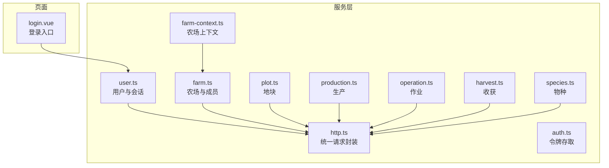
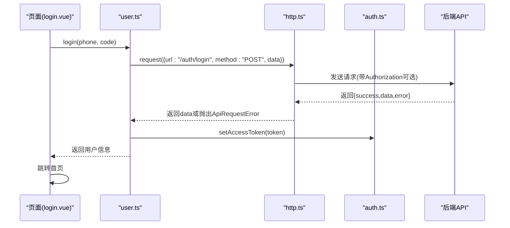
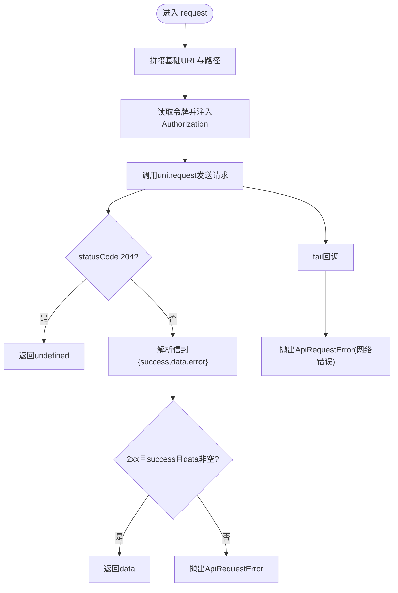
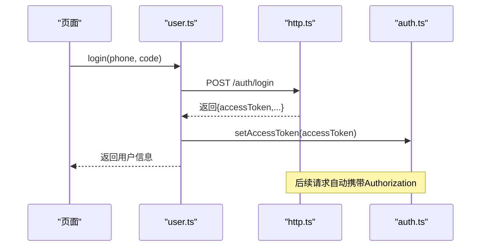
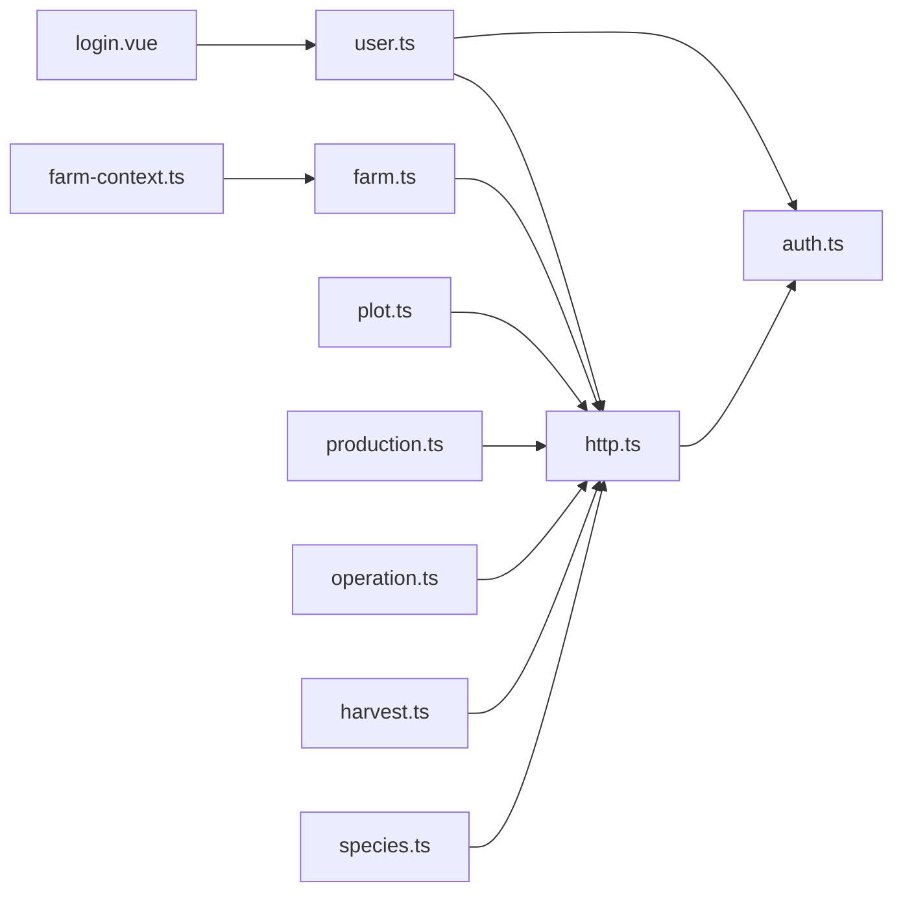

# 服务层封装

<cite>
**本文引用的文件**
- [apps/miniapp/src/services/http.ts](file://apps/miniapp/src/services/http.ts)
- [apps/miniapp/src/services/auth.ts](file://apps/miniapp/src/services/auth.ts)
- [apps/miniapp/src/services/user.ts](file://apps/miniapp/src/services/user.ts)
- [apps/miniapp/src/services/farm.ts](file://apps/miniapp/src/services/farm.ts)
- [apps/miniapp/src/services/plot.ts](file://apps/miniapp/src/services/plot.ts)
- [apps/miniapp/src/services/harvest.ts](file://apps/miniapp/src/services/harvest.ts)
- [apps/miniapp/src/services/operation.ts](file://apps/miniapp/src/services/operation.ts)
- [apps/miniapp/src/services/production.ts](file://apps/miniapp/src/services/production.ts)
- [apps/miniapp/src/services/species.ts](file://apps/miniapp/src/services/species.ts)
- [apps/miniapp/src/services/farm-context.ts](file://apps/miniapp/src/services/farm-context.ts)
- [apps/miniapp/src/pages/auth/login.vue](file://apps/miniapp/src/pages/auth/login.vue)
</cite>

## 目录
1. [简介](#简介)
2. [项目结构](#项目结构)
3. [核心组件](#核心组件)
4. [架构总览](#架构总览)
5. [详细组件分析](#详细组件分析)
6. [依赖关系分析](#依赖关系分析)
7. [性能与网络优化](#性能与网络优化)
8. [故障排查指南](#故障排查指南)
9. [结论](#结论)
10. [附录](#附录)

## 简介
本技术文档聚焦 Pocket Farm 前端（uni-app）服务层，围绕 API 请求封装、错误处理、数据缓存策略展开，详细说明 HTTP 客户端配置、请求拦截器与响应处理器，并覆盖认证、农场、地块、生产、作业、收获、物种等业务模块的服务封装。同时提供网络请求优化建议、重试机制设计思路以及离线数据处理方案，并给出扩展模式与第三方集成方案，帮助团队在现有基础上持续演进。

## 项目结构
前端服务层位于 apps/miniapp/src/services 目录下，采用“按业务域拆分”的组织方式：每个业务模块一个文件，统一通过 http.ts 中的 request 函数发起网络请求；认证相关逻辑集中在 auth.ts，用户会话由 user.ts 管理；farm-context.ts 提供当前农场的上下文状态与持久化。页面通过调用对应服务完成数据交互，如登录页调用 user.login。

图表来源
- [apps/miniapp/src/services/http.ts:1-106](file://apps/miniapp/src/services/http.ts#L1-L106)
- [apps/miniapp/src/services/auth.ts:1-18](file://apps/miniapp/src/services/auth.ts#L1-L18)
- [apps/miniapp/src/services/user.ts:1-42](file://apps/miniapp/src/services/user.ts#L1-L42)
- [apps/miniapp/src/services/farm.ts:1-121](file://apps/miniapp/src/services/farm.ts#L1-L121)
- [apps/miniapp/src/services/plot.ts:1-85](file://apps/miniapp/src/services/plot.ts#L1-L85)
- [apps/miniapp/src/services/production.ts:1-121](file://apps/miniapp/src/services/production.ts#L1-L121)
- [apps/miniapp/src/services/operation.ts:1-91](file://apps/miniapp/src/services/operation.ts#L1-L91)
- [apps/miniapp/src/services/harvest.ts:1-92](file://apps/miniapp/src/services/harvest.ts#L1-L92)
- [apps/miniapp/src/services/species.ts:1-34](file://apps/miniapp/src/services/species.ts#L1-L34)
- [apps/miniapp/src/services/farm-context.ts:1-94](file://apps/miniapp/src/services/farm-context.ts#L1-L94)
- [apps/miniapp/src/pages/auth/login.vue:96-187](file://apps/miniapp/src/pages/auth/login.vue#L96-L187)

章节来源
- [apps/miniapp/src/services/http.ts:1-106](file://apps/miniapp/src/services/http.ts#L1-L106)
- [apps/miniapp/src/services/auth.ts:1-18](file://apps/miniapp/src/services/auth.ts#L1-L18)
- [apps/miniapp/src/services/user.ts:1-42](file://apps/miniapp/src/services/user.ts#L1-L42)
- [apps/miniapp/src/services/farm-context.ts:1-94](file://apps/miniapp/src/services/farm-context.ts#L1-L94)
- [apps/miniapp/src/pages/auth/login.vue:96-187](file://apps/miniapp/src/pages/auth/login.vue#L96-L187)

## 核心组件
- 统一请求封装（http.ts）
  - 基于 uni.request 的 Promise 封装，自动拼接基础 URL、附加 Authorization 头、统一返回信封解析与错误抛出。
  - 支持 GET/POST/PATCH/PUT/DELETE，对 204 无内容响应直接返回 undefined。
  - 定义 ApiRequestError，携带 code、statusCode、details，便于上层区分错误类型。
- 认证与令牌（auth.ts）
  - 使用本地存储存取访问令牌，提供获取、设置、清除、判断是否存在等能力。
- 用户与会话（user.ts）
  - 登录成功后写入令牌，并提供获取当前用户、更新昵称等接口。
- 业务服务（farm/plot/production/operation/harvest/species）
  - 以领域为中心暴露方法，参数与返回类型明确，便于页面调用与类型推断。
- 农场上下文（farm-context.ts）
  - 维护当前农场选择，持久化到本地，支持从 API 同步可用农场列表并回退策略。

章节来源
- [apps/miniapp/src/services/http.ts:1-106](file://apps/miniapp/src/services/http.ts#L1-L106)
- [apps/miniapp/src/services/auth.ts:1-18](file://apps/miniapp/src/services/auth.ts#L1-L18)
- [apps/miniapp/src/services/user.ts:1-42](file://apps/miniapp/src/services/user.ts#L1-L42)
- [apps/miniapp/src/services/farm.ts:1-121](file://apps/miniapp/src/services/farm.ts#L1-L121)
- [apps/miniapp/src/services/plot.ts:1-85](file://apps/miniapp/src/services/plot.ts#L1-L85)
- [apps/miniapp/src/services/production.ts:1-121](file://apps/miniapp/src/services/production.ts#L1-L121)
- [apps/miniapp/src/services/operation.ts:1-91](file://apps/miniapp/src/services/operation.ts#L1-L91)
- [apps/miniapp/src/services/harvest.ts:1-92](file://apps/miniapp/src/services/harvest.ts#L1-L92)
- [apps/miniapp/src/services/species.ts:1-34](file://apps/miniapp/src/services/species.ts#L1-L34)
- [apps/miniapp/src/services/farm-context.ts:1-94](file://apps/miniapp/src/services/farm-context.ts#L1-L94)

## 架构总览
服务层采用“薄封装 + 强类型 + 集中式错误处理”的设计：
- 所有网络请求通过 http.ts 的 request 函数发出，保证统一的鉴权、错误处理与信封解析。
- 业务服务仅负责构造 URL、方法与数据体，不关心底层实现细节。
- 认证流程在 user.ts 中完成，登录成功后将令牌写入本地存储，后续请求自动带上 Authorization。
- 农场上下文在 farm-context.ts 中维护当前农场选择，结合 getMyFarms 进行同步与回退。

图表来源
- [apps/miniapp/src/pages/auth/login.vue:158-187](file://apps/miniapp/src/pages/auth/login.vue#L158-L187)
- [apps/miniapp/src/services/user.ts:18-29](file://apps/miniapp/src/services/user.ts#L18-L29)
- [apps/miniapp/src/services/http.ts:46-105](file://apps/miniapp/src/services/http.ts#L46-L105)
- [apps/miniapp/src/services/auth.ts:11-17](file://apps/miniapp/src/services/auth.ts#L11-L17)

## 详细组件分析

### HTTP 客户端与请求封装
- 基础 URL 来自环境变量，默认指向开发环境，末尾斜杠会被去除。
- 请求头自动注入 Authorization: Bearer <token>，当服务端返回 401 时清理本地令牌。
- 响应信封解析：成功且 data 非空则返回 data；204 直接返回 undefined；否则抛出 ApiRequestError，包含 code、statusCode、details。
- 失败回调统一包装为 ApiRequestError，便于上层捕获与展示。

图表来源
- [apps/miniapp/src/services/http.ts:3-105](file://apps/miniapp/src/services/http.ts#L3-L105)

章节来源
- [apps/miniapp/src/services/http.ts:1-106](file://apps/miniapp/src/services/http.ts#L1-L106)

### 认证服务与会话管理
- 令牌存取：auth.ts 提供 get/set/clear/has 等方法，基于 uni.getStorageSync/setStorageSync/removeStorageSync。
- 登录流程：user.ts 的 login 调用 /auth/login，成功后调用 setAuthToken 保存令牌，再返回用户信息。
- 自动登出：http.ts 在收到 401 时清理令牌，确保后续请求不再携带过期凭证。

图表来源
- [apps/miniapp/src/services/user.ts:18-29](file://apps/miniapp/src/services/user.ts#L18-L29)
- [apps/miniapp/src/services/auth.ts:11-17](file://apps/miniapp/src/services/auth.ts#L11-L17)
- [apps/miniapp/src/services/http.ts:51-73](file://apps/miniapp/src/services/http.ts#L51-L73)

章节来源
- [apps/miniapp/src/services/auth.ts:1-18](file://apps/miniapp/src/services/auth.ts#L1-L18)
- [apps/miniapp/src/services/user.ts:1-42](file://apps/miniapp/src/services/user.ts#L1-L42)
- [apps/miniapp/src/services/http.ts:51-73](file://apps/miniapp/src/services/http.ts#L51-L73)

### 农场服务（Farm）
- 提供获取我的农场、创建、查询、更新、成员增删改、退出农场等能力。
- 分页参数统一通过 URL 查询字符串传递，返回 FarmPage/FarmMemberPage。
- 角色枚举 FarmRole 用于权限控制。

章节来源
- [apps/miniapp/src/services/farm.ts:1-121](file://apps/miniapp/src/services/farm.ts#L1-L121)

### 地块服务（Plot）
- 提供获取农场下地块列表、创建、查询详情、更新等能力。
- 详情接口返回聚合数据（活跃生产、已结束生产、作业、收获统计）。

章节来源
- [apps/miniapp/src/services/plot.ts:1-85](file://apps/miniapp/src/services/plot.ts#L1-L85)

### 生产服务（Production）
- 提供按地块查询生产列表（可过滤状态）、创建、查询、更新、删除、结束生产等能力。
- 提供 toSpecies 转换工具，便于复用生产中的物种信息。

章节来源
- [apps/miniapp/src/services/production.ts:1-121](file://apps/miniapp/src/services/production.ts#L1-L121)

### 作业服务（Operation）
- 提供按地块查询作业记录、查询作业类型、创建、更新、删除等能力。
- 作业类型支持启用/禁用状态与排序字段。

章节来源
- [apps/miniapp/src/services/operation.ts:1-91](file://apps/miniapp/src/services/operation.ts#L1-L91)

### 收获服务（Harvest）
- 提供按生产或地块查询收获记录、创建、更新、删除等能力。
- 支持多种单位与工作方法的枚举。

章节来源
- [apps/miniapp/src/services/harvest.ts:1-92](file://apps/miniapp/src/services/harvest.ts#L1-L92)

### 物种服务（Species）
- 提供按行业与关键词检索物种的分页接口。
- 支持 industry 与 keyword 过滤，自动编码关键词。

章节来源
- [apps/miniapp/src/services/species.ts:1-34](file://apps/miniapp/src/services/species.ts#L1-L34)

### 农场上下文（Farm Context）
- 维护当前选择的农场，持久化到本地存储。
- 提供刷新与同步策略：若当前农场仍有效则保留，否则回退到第一个可用农场或清空。
- 提供摘要视图 with role、名称、区域等常用字段。

章节来源
- [apps/miniapp/src/services/farm-context.ts:1-94](file://apps/miniapp/src/services/farm-context.ts#L1-L94)
- [apps/miniapp/src/services/farm.ts:48-52](file://apps/miniapp/src/services/farm.ts#L48-L52)

## 依赖关系分析
- http.ts 依赖 auth.ts 获取令牌。
- user.ts 依赖 http.ts 与 auth.ts。
- 各业务服务均依赖 http.ts。
- farm-context.ts 依赖 farm.ts 与本地存储。
- 页面依赖对应服务，如 login.vue 依赖 user.ts 与 http.ts 的错误类型。

图表来源
- [apps/miniapp/src/services/http.ts:1-106](file://apps/miniapp/src/services/http.ts#L1-L106)
- [apps/miniapp/src/services/auth.ts:1-18](file://apps/miniapp/src/services/auth.ts#L1-L18)
- [apps/miniapp/src/services/user.ts:1-42](file://apps/miniapp/src/services/user.ts#L1-L42)
- [apps/miniapp/src/services/farm.ts:1-121](file://apps/miniapp/src/services/farm.ts#L1-L121)
- [apps/miniapp/src/services/plot.ts:1-85](file://apps/miniapp/src/services/plot.ts#L1-L85)
- [apps/miniapp/src/services/production.ts:1-121](file://apps/miniapp/src/services/production.ts#L1-L121)
- [apps/miniapp/src/services/operation.ts:1-91](file://apps/miniapp/src/services/operation.ts#L1-L91)
- [apps/miniapp/src/services/harvest.ts:1-92](file://apps/miniapp/src/services/harvest.ts#L1-L92)
- [apps/miniapp/src/services/species.ts:1-34](file://apps/miniapp/src/services/species.ts#L1-L34)
- [apps/miniapp/src/services/farm-context.ts:1-94](file://apps/miniapp/src/services/farm-context.ts#L1-L94)
- [apps/miniapp/src/pages/auth/login.vue:96-187](file://apps/miniapp/src/pages/auth/login.vue#L96-L187)

## 性能与网络优化
当前实现已具备统一封装与错误处理，建议在以下方面进一步优化：
- 请求去重
  - 对相同 URL+Method+Body 的请求在内存中进行合并，避免重复网络开销。
- 缓存策略
  - 读多写少接口（如 species、operation-types）增加短期内存缓存与失效策略（时间戳或版本号）。
  - 列表型数据可按资源维度做轻量级缓存，配合分页增量更新。
- 重试机制
  - 针对幂等 GET 请求在网络异常或 5xx 时进行有限次重试，指数退避。
  - 对 401 不进行重试，直接走登出流程。
- 并发控制
  - 限制全局并发数，避免瞬时大量请求导致阻塞。
- 取消请求
  - 页面卸载或路由切换时取消未完成的请求，减少无效网络。
- 离线优先
  - 关键操作（如新增作业、收获）支持先落库再同步，网络恢复后批量提交。
  - 冲突解决策略：以服务端为准，必要时提示用户合并。
- 压缩与传输
  - 开启 gzip/br 压缩，合理分页 pageSize，减少首屏数据量。
- 监控与埋点
  - 记录请求耗时、失败率、错误码分布，辅助定位瓶颈。

[本节为通用优化建议，不直接引用具体代码文件]

## 故障排查指南
- 常见错误分类
  - 网络错误：fail 回调触发，抛出 ApiRequestError，errMsg 通常包含网络原因。
  - 服务端错误：response.statusCode >= 200 但 envelope.success 为 false，抛出 ApiRequestError，携带 code、message、details。
  - 认证失效：401 时自动清理本地令牌，需重新登录。
- 页面侧处理
  - 登录页捕获 ApiRequestError，显示友好提示，避免堆栈泄露。
- 调试建议
  - 检查环境变量 VITE_API_BASE_URL 是否正确。
  - 确认本地是否已正确写入令牌。
  - 查看服务端返回的信封结构是否符合预期。

章节来源
- [apps/miniapp/src/services/http.ts:68-105](file://apps/miniapp/src/services/http.ts#L68-L105)
- [apps/miniapp/src/pages/auth/login.vue:178-186](file://apps/miniapp/src/pages/auth/login.vue#L178-L186)

## 结论
Pocket Farm 前端服务层通过统一的请求封装、清晰的错误模型与分域服务划分，实现了高内聚、低耦合的网络层抽象。当前已具备完善的鉴权注入与信封解析能力，建议在缓存、重试、并发控制与离线优先等方面进一步增强，以提升用户体验与系统健壮性。

[本节为总结性内容，不直接引用具体代码文件]

## 附录

### 扩展模式与第三方集成
- 扩展请求封装
  - 可在 http.ts 外层包裹更高层的 client，增加重试、缓存、降级、监控等横切能力。
- 第三方 SDK 集成
  - 对于地图、上传、统计等第三方能力，建议封装为独立服务模块，通过统一错误模型与日志上报接入。
- 插件化
  - 将特定平台差异（如小程序特有 API）隔离在适配器中，保持业务服务无关性。

[本节为概念性说明，不直接引用具体代码文件]