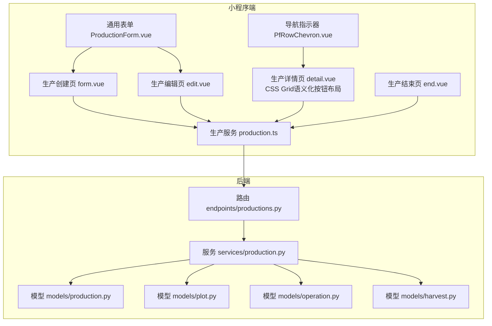
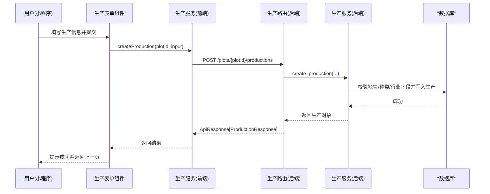
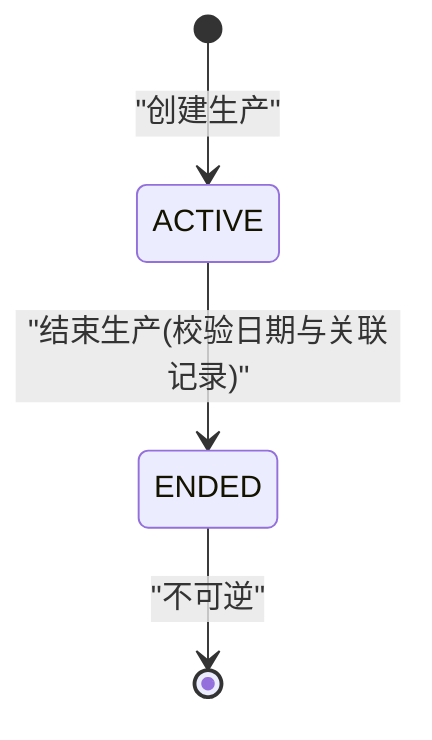
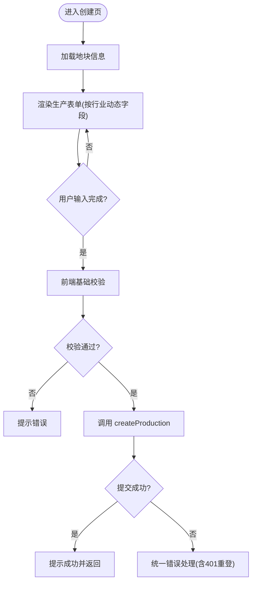
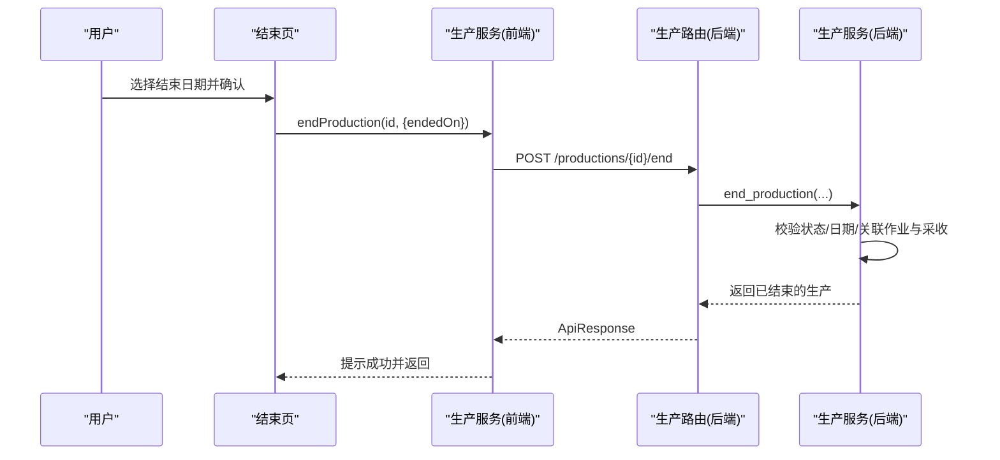
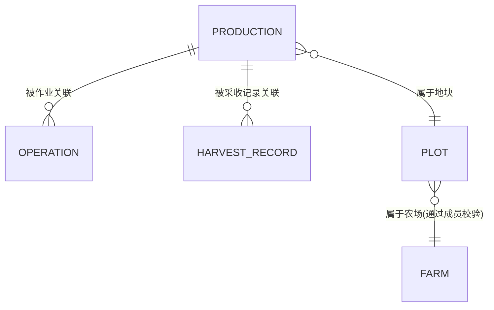
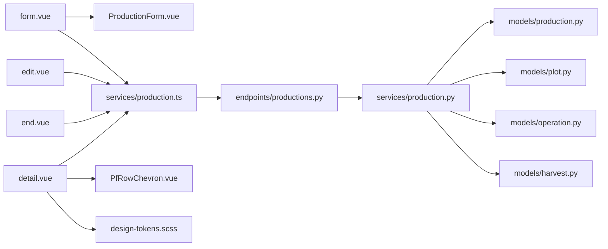

# 生产跟踪模块

<cite>
**本文引用的文件**
- [apps/api/app/models/production.py](file://apps/api/app/models/production.py)
- [apps/api/app/schemas/production.py](file://apps/api/app/schemas/production.py)
- [apps/api/app/services/production.py](file://apps/api/app/services/production.py)
- [apps/api/app/api/v1/endpoints/productions.py](file://apps/api/app/api/v1/endpoints/productions.py)
- [apps/api/app/models/operation.py](file://apps/api/app/models/operation.py)
- [apps/api/app/models/harvest.py](file://apps/api/app/models/harvest.py)
- [apps/api/app/models/plot.py](file://apps/api/app/models/plot.py)
- [apps/miniapp/src/pages/productions/form.vue](file://apps/miniapp/src/pages/productions/form.vue)
- [apps/miniapp/src/pages/productions/detail.vue](file://apps/miniapp/src/pages/productions/detail.vue)
- [apps/miniapp/src/pages/productions/edit.vue](file://apps/miniapp/src/pages/productions/edit.vue)
- [apps/miniapp/src/pages/productions/end.vue](file://apps/miniapp/src/pages/productions/end.vue)
- [apps/miniapp/src/components/ProductionForm.vue](file://apps/miniapp/src/components/ProductionForm.vue)
- [apps/miniapp/src/components/PfRowChevron.vue](file://apps/miniapp/src/components/PfRowChevron.vue)
- [apps/miniapp/src/styles/design-tokens.scss](file://apps/miniapp/src/styles/design-tokens.scss)
- [apps/miniapp/src/styles/pocket-farm.scss](file://apps/miniapp/src/styles/pocket-farm.scss)
- [apps/miniapp/src/services/production.ts](file://apps/miniapp/src/services/production.ts)
</cite>

## 更新摘要
**所做更改**
- 更新了生产详情页的操作区域UI设计，采用CSS Grid布局实现语义化按钮样式
- 引入primary green用于记录操作、neutral用于查看/结束操作、danger red用于删除操作
- 增强了白色卡片设计系统的视觉层次和用户体验
- 优化了移动端交互体验，提供一致的按钮状态反馈
- 完善了设计令牌系统，确保样式一致性和可维护性

## 目录
1. [简介](#简介)
2. [项目结构](#项目结构)
3. [核心组件](#核心组件)
4. [架构总览](#架构总览)
5. [详细组件分析](#详细组件分析)
6. [依赖关系分析](#依赖关系分析)
7. [性能与可用性考虑](#性能与可用性考虑)
8. [故障排查指南](#故障排查指南)
9. [结论](#结论)
10. [附录：API 与数据模型速查](#附录api-与数据模型速查)

## 简介
本模块实现 Pocket Farm 的"生产"全生命周期管理，覆盖从生产创建、进行中状态跟踪到生产结束的完整流程。后端提供基于 FastAPI 的 REST API，前端为基于 Vue + uni-app 的小程序页面，包含生产创建表单、详情展示、编辑界面和结束流程。**最新更新**：生产详情页已完成重大UI重构，采用CSS Grid布局实现语义化按钮样式设计系统，通过primary green（记录操作）、neutral（查看/结束）、danger red（删除）的语义化配色方案，显著提升了用户体验的一致性和美观度。业务规则围绕"种植/养殖/林业/渔业"等行业差异进行字段校验与约束，并通过作业与采收记录保障数据完整性与可追溯性。

## 项目结构
- 后端（FastAPI）
  - 模型层：生产、地块、作业、采收等实体定义
  - 服务层：领域逻辑、权限校验、业务规则验证、事务提交
  - 接口层：路由与请求/响应模型映射
- 前端（小程序）
  - 页面：生产创建、详情、编辑、结束
  - 组件：通用生产表单、统一导航指示器组件
  - 服务：HTTP 封装与类型定义
  - 样式：统一设计令牌系统和语义化按钮样式

**图表来源**
- [apps/miniapp/src/pages/productions/form.vue:1-181](file://apps/miniapp/src/pages/productions/form.vue#L1-L181)
- [apps/miniapp/src/pages/productions/detail.vue:1-653](file://apps/miniapp/src/pages/productions/detail.vue#L1-L653)
- [apps/miniapp/src/pages/productions/edit.vue:1-133](file://apps/miniapp/src/pages/productions/edit.vue#L1-L133)
- [apps/miniapp/src/pages/productions/end.vue:1-222](file://apps/miniapp/src/pages/productions/end.vue#L1-L222)
- [apps/miniapp/src/components/ProductionForm.vue:1-613](file://apps/miniapp/src/components/ProductionForm.vue#L1-L613)
- [apps/miniapp/src/components/PfRowChevron.vue:1-17](file://apps/miniapp/src/components/PfRowChevron.vue#L1-L17)
- [apps/miniapp/src/services/production.ts:1-121](file://apps/miniapp/src/services/production.ts#L1-L121)
- [apps/api/app/api/v1/endpoints/productions.py:1-198](file://apps/api/app/api/v1/endpoints/productions.py#L1-L198)
- [apps/api/app/services/production.py:1-446](file://apps/api/app/services/production.py#L1-L446)
- [apps/api/app/models/production.py:1-79](file://apps/api/app/models/production.py#L1-L79)
- [apps/api/app/models/plot.py:1-54](file://apps/api/app/models/plot.py#L1-L54)
- [apps/api/app/models/operation.py:1-80](file://apps/api/app/models/operation.py#L1-L80)
- [apps/api/app/models/harvest.py:1-48](file://apps/api/app/models/harvest.py#L1-L48)

**章节来源**
- [apps/api/app/api/v1/endpoints/productions.py:1-198](file://apps/api/app/api/v1/endpoints/productions.py#L1-L198)
- [apps/api/app/services/production.py:1-446](file://apps/api/app/services/production.py#L1-L446)
- [apps/miniapp/src/services/production.ts:1-121](file://apps/miniapp/src/services/production.ts#L1-L121)

## 核心组件
- 数据模型
  - 生产：状态、开始/结束日期、行业相关字段（种植标准、种植方式、作业方式、预计采收时间、亩产、初始数量、株间距、入栏日龄等）
  - 地块：归属农场、类型、面积、边界等
  - 作业：关联生产与地块，记录作业类型、作业方式、操作时间、操作员
  - 采收记录：关联生产，记录数量、单位、作业方式、采收时间、操作员、产品名、等级、备注
- 服务层
  - 列表：按地块分页查询生产，支持按状态过滤
  - 详情：带成员权限校验（通过地块所属农场的成员关系）
  - 创建：校验开始日期、行业字段必填/禁用、写入生产并返回
  - 更新：锁定行、禁止对已结束生产修改；若已有作业或采收记录，禁止变更核心字段（地块、种类、开始日期）；跨农场移动地块不允许
  - 删除：仅允许未结束且无作业/采收的生产
  - 结束：校验结束日期范围，不得早于最近一次作业或采收的业务日期
- 接口层
  - GET /plots/{plot_id}/productions：分页获取某地块的生产
  - POST /plots/{plot_id}/productions：创建生产
  - GET /productions/{id}：获取生产详情
  - PATCH /productions/{id}：编辑生产
  - POST /productions/{id}/end：结束生产
  - DELETE /productions/{id}：删除生产
- 前端页面与组件
  - 创建页：选择地块、种类、品种、日期及行业相关字段，提交后跳转
  - **详情页**：采用CSS Grid布局的语义化按钮设计系统，展示基本信息、更多信息区块、采收记录入口、结束与删除入口，使用统一的PfRowChevron导航指示器
  - 编辑页：复用通用表单，加载现有数据并保存
  - 结束页：选择结束日期，二次确认后调用结束接口

**章节来源**
- [apps/api/app/models/production.py:13-79](file://apps/api/app/models/production.py#L13-L79)
- [apps/api/app/models/plot.py:14-54](file://apps/api/app/models/plot.py#L14-L54)
- [apps/api/app/models/operation.py:18-80](file://apps/api/app/models/operation.py#L18-L80)
- [apps/api/app/models/harvest.py:13-48](file://apps/api/app/models/harvest.py#L13-L48)
- [apps/api/app/services/production.py:112-446](file://apps/api/app/services/production.py#L112-L446)
- [apps/api/app/api/v1/endpoints/productions.py:71-198](file://apps/api/app/api/v1/endpoints/productions.py#L71-L198)
- [apps/miniapp/src/pages/productions/form.vue:1-181](file://apps/miniapp/src/pages/productions/form.vue#L1-L181)
- [apps/miniapp/src/pages/productions/detail.vue:1-653](file://apps/miniapp/src/pages/productions/detail.vue#L1-L653)
- [apps/miniapp/src/pages/productions/edit.vue:1-133](file://apps/miniapp/src/pages/productions/edit.vue#L1-L133)
- [apps/miniapp/src/pages/productions/end.vue:1-222](file://apps/miniapp/src/pages/productions/end.vue#L1-L222)
- [apps/miniapp/src/components/ProductionForm.vue:1-613](file://apps/miniapp/src/components/ProductionForm.vue#L1-L613)

## 架构总览

**图表来源**
- [apps/miniapp/src/components/ProductionForm.vue:418-469](file://apps/miniapp/src/components/ProductionForm.vue#L418-L469)
- [apps/miniapp/src/services/production.ts:74-80](file://apps/miniapp/src/services/production.ts#L74-L80)
- [apps/api/app/api/v1/endpoints/productions.py:100-129](file://apps/api/app/api/v1/endpoints/productions.py#L100-L129)
- [apps/api/app/services/production.py:164-218](file://apps/api/app/services/production.py#L164-L218)

## 详细组件分析

### 生产状态流转与控制
- 状态枚举
  - ACTIVE：进行中
  - ENDED：已结束
- 流转规则
  - 创建时默认 ACTIVE
  - 结束接口将状态置为 ENDED，并写入结束日期
  - 已结束的生产不可编辑、不可删除、不可再次结束
  - 结束日期不得晚于今天，不得早于开始日期，且不得早于最近一次作业或采收的业务日期

**图表来源**
- [apps/api/app/models/production.py:13-16](file://apps/api/app/models/production.py#L13-L16)
- [apps/api/app/services/production.py:403-446](file://apps/api/app/services/production.py#L403-L446)

**章节来源**
- [apps/api/app/services/production.py:220-366](file://apps/api/app/services/production.py#L220-L366)
- [apps/api/app/services/production.py:368-401](file://apps/api/app/services/production.py#L368-L401)
- [apps/api/app/services/production.py:403-446](file://apps/api/app/services/production.py#L403-L446)

### 生产创建表单（UI 与交互）
- 页面职责
  - 加载地块信息，支持选择地块
  - 根据种类显示行业相关字段（种植标准、种植方式、作业方式、预计采收时间、亩产、株间距、入栏日龄等）
  - 前端基础校验（非空、正数、整数等），提交后调用后端服务
- 关键交互
  - 打开地块选择器，选择后回填地块元信息
  - 提交按钮触发创建，成功后提示并返回上一级
  - 未保存变更守卫，防止误退出

**图表来源**
- [apps/miniapp/src/pages/productions/form.vue:74-152](file://apps/miniapp/src/pages/productions/form.vue#L74-L152)
- [apps/miniapp/src/components/ProductionForm.vue:418-469](file://apps/miniapp/src/components/ProductionForm.vue#L418-L469)
- [apps/miniapp/src/services/production.ts:74-80](file://apps/miniapp/src/services/production.ts#L74-L80)

**章节来源**
- [apps/miniapp/src/pages/productions/form.vue:1-181](file://apps/miniapp/src/pages/productions/form.vue#L1-L181)
- [apps/miniapp/src/components/ProductionForm.vue:1-613](file://apps/miniapp/src/components/ProductionForm.vue#L1-L613)

### 生产详情展示（UI 与导航）
- **重大更新**：详情页操作区域已完全重构，采用CSS Grid布局实现语义化按钮设计
- 展示内容
  - **头部卡片**：包含名称、行业、状态、开始/结束日期、品种、编辑入口
  - **度量指标**：显示初始数量（根据行业动态调整标签）、状态徽章
  - **种养信息卡片**：白色背景卡片，包含种植标准、种植方式、作业方式、预计采收时间、亩产、株间距、入栏日龄、备注等信息
  - **语义化操作区域**：使用CSS Grid布局（`grid-template-columns: repeat(2, minmax(0, 1fr))`）实现2列网格布局
- **语义化按钮设计系统**
  - **Primary Green（主绿色）**：用于记录操作（记录采收/出栏/捕捞），使用 `$pf-color-primary-soft` 背景和 `$pf-color-primary` 文字色
  - **Neutral（中性色）**：用于查看记录和结束操作，使用 `$pf-color-surface` 背景和边框样式
  - **Danger Red（危险红色）**：用于删除操作，使用 `$pf-color-danger-soft` 背景和 `$pf-color-danger` 文字色
- **交互状态**
  - 悬停效果：`.action-button--pressed` 使用 `$pf-color-surface-muted` 背景
  - 主要按钮按下：`.action-button--primary-pressed` 降低透明度至0.72
  - 危险按钮按下：`.action-button--danger-pressed` 降低透明度至0.72
- **设计系统特性**
  - 统一的白色卡片样式，使用 `$pf-color-surface` 背景和 `$pf-shadow-card` 阴影
  - 标准化的间距和圆角设计（`$pf-radius-control: 16rpx`）
  - 一致的字体层级和颜色系统
  - 响应式的2列Grid布局适配

**章节来源**
- [apps/miniapp/src/pages/productions/detail.vue:124-159](file://apps/miniapp/src/pages/productions/detail.vue#L124-L159)
- [apps/miniapp/src/pages/productions/detail.vue:580-631](file://apps/miniapp/src/pages/productions/detail.vue#L580-L631)
- [apps/miniapp/src/components/PfRowChevron.vue:1-17](file://apps/miniapp/src/components/PfRowChevron.vue#L1-L17)
- [apps/miniapp/src/styles/design-tokens.scss:28-52](file://apps/miniapp/src/styles/design-tokens.scss#L28-L52)

### 生产编辑界面（UI 与规则）
- 行为
  - 加载生产详情并填充表单
  - 提交后调用更新接口
  - 未保存变更守卫
- 后端规则
  - 已结束生产不可编辑
  - 若已有作业或采收记录，禁止修改核心字段（地块、种类、开始日期）
  - 地块只能在同农场内移动

**章节来源**
- [apps/miniapp/src/pages/productions/edit.vue:1-133](file://apps/miniapp/src/pages/productions/edit.vue#L1-L133)
- [apps/api/app/services/production.py:220-366](file://apps/api/app/services/production.py#L220-L366)

### 生产结束流程（UI 与校验）
- 页面行为
  - 加载生产与地块信息，限制结束日期范围为 [开始日期, 今天]
  - 二次确认结束后调用结束接口
- 后端校验
  - 仅可进行中的生产可结束
  - 结束日期不得早于最近一次作业或采收的业务日期
  - 写入结束日期并将状态改为已结束

**图表来源**
- [apps/miniapp/src/pages/productions/end.vue:84-146](file://apps/miniapp/src/pages/productions/end.vue#L84-L146)
- [apps/miniapp/src/services/production.ts:101-110](file://apps/miniapp/src/services/production.ts#L101-L110)
- [apps/api/app/api/v1/endpoints/productions.py:174-188](file://apps/api/app/api/v1/endpoints/productions.py#L174-L188)
- [apps/api/app/services/production.py:403-446](file://apps/api/app/services/production.py#L403-L446)

**章节来源**
- [apps/miniapp/src/pages/productions/end.vue:1-222](file://apps/miniapp/src/pages/productions/end.vue#L1-L222)
- [apps/api/app/services/production.py:403-446](file://apps/api/app/services/production.py#L403-L446)

### 生产与地块、作业的关联与进度跟踪
- 关联关系
  - 生产属于某个地块，地块属于某个农场
  - 作业与采收记录均关联生产，用于追踪进度与时间线
- 进度体现
  - 列表按状态优先排序（进行中在前），再按开始日期倒序
  - 详情中可进入采收记录查看历史
  - 结束日期受限于最近作业/采收的业务日期，保证时序一致性

**图表来源**
- [apps/api/app/models/production.py:43-79](file://apps/api/app/models/production.py#L43-L79)
- [apps/api/app/models/operation.py:37-80](file://apps/api/app/models/operation.py#L37-L80)
- [apps/api/app/models/harvest.py:13-48](file://apps/api/app/models/harvest.py#L13-L48)
- [apps/api/app/models/plot.py:31-54](file://apps/api/app/models/plot.py#L31-L54)

**章节来源**
- [apps/api/app/services/production.py:112-161](file://apps/api/app/services/production.py#L112-L161)
- [apps/api/app/services/production.py:425-439](file://apps/api/app/services/production.py#L425-L439)

### 移动端交互优化要点
- 表单动态化：根据种类所属行业显示不同字段，减少无关输入
- 日期选择器限制：开始日期不超今天，结束日期在 [开始日期, 今天]
- 未保存变更守卫：避免意外离开导致数据丢失
- 统一错误处理：401 自动跳转登录，其他错误使用 toast 提示
- 轻量反馈：提交中禁用按钮并显示 loading text，成功/失败即时反馈
- **语义化按钮设计**：通过CSS Grid布局和语义化配色方案提供直观的视觉层次
- **设计系统统一**：所有页面采用一致的设计令牌和组件样式
- **导航一致性**：使用PfRowChevron组件提供统一的导航指示器
- **响应式布局**：2列Grid布局在不同屏幕尺寸下保持良好的可读性和操作性

**章节来源**
- [apps/miniapp/src/components/ProductionForm.vue:269-293](file://apps/miniapp/src/components/ProductionForm.vue#L269-L293)
- [apps/miniapp/src/pages/productions/end.vue:64-77](file://apps/miniapp/src/pages/productions/end.vue#L64-L77)
- [apps/miniapp/src/pages/productions/form.vue:67-67](file://apps/miniapp/src/pages/productions/form.vue#L67-L67)
- [apps/miniapp/src/pages/productions/detail.vue:580-631](file://apps/miniapp/src/pages/productions/detail.vue#L580-L631)
- [apps/miniapp/src/components/PfRowChevron.vue:1-17](file://apps/miniapp/src/components/PfRowChevron.vue#L1-L17)

## 依赖关系分析
- 前端依赖
  - 页面依赖通用表单组件与服务层
  - 服务层封装 HTTP 请求与类型定义
  - 详情页依赖统一的导航指示器组件和语义化按钮样式
- 后端依赖
  - 路由依赖服务层
  - 服务层依赖模型与外部服务（地块成员校验）
  - 模型之间通过外键建立关联

**图表来源**
- [apps/miniapp/src/pages/productions/form.vue:1-181](file://apps/miniapp/src/pages/productions/form.vue#L1-L181)
- [apps/miniapp/src/pages/productions/detail.vue:1-653](file://apps/miniapp/src/pages/productions/detail.vue#L1-L653)
- [apps/miniapp/src/pages/productions/edit.vue:1-133](file://apps/miniapp/src/pages/productions/edit.vue#L1-L133)
- [apps/miniapp/src/pages/productions/end.vue:1-222](file://apps/miniapp/src/pages/productions/end.vue#L1-L222)
- [apps/miniapp/src/components/ProductionForm.vue:1-613](file://apps/miniapp/src/components/ProductionForm.vue#L1-L613)
- [apps/miniapp/src/components/PfRowChevron.vue:1-17](file://apps/miniapp/src/components/PfRowChevron.vue#L1-L17)
- [apps/miniapp/src/styles/design-tokens.scss:1-74](file://apps/miniapp/src/styles/design-tokens.scss#L1-L74)
- [apps/miniapp/src/services/production.ts:1-121](file://apps/miniapp/src/services/production.ts#L1-L121)
- [apps/api/app/api/v1/endpoints/productions.py:1-198](file://apps/api/app/api/v1/endpoints/productions.py#L1-L198)
- [apps/api/app/services/production.py:1-446](file://apps/api/app/services/production.py#L1-L446)

**章节来源**
- [apps/api/app/services/production.py:105-161](file://apps/api/app/services/production.py#L105-L161)
- [apps/api/app/api/v1/endpoints/productions.py:71-198](file://apps/api/app/api/v1/endpoints/productions.py#L71-L198)

## 性能与可用性考虑
- 列表分页：支持 page/pageSize 参数，默认 pageSize 合理上限，避免大数据量传输
- 排序优化：按状态与开始日期排序，提升常用场景检索效率
- 并发安全：更新与结束时使用行锁（with_for_update）防止竞态条件
- 前端体验：loading 状态、防重复提交、未保存变更保护、统一错误提示
- **语义化按钮性能**：CSS Grid布局提供良好的渲染性能，语义化样式减少重复代码
- **设计系统优化**：使用CSS变量和设计令牌确保样式一致性，提高维护效率
- **组件复用**：PfRowChevron组件减少重复代码，提高维护性
- **响应式设计**：2列Grid布局在不同屏幕尺寸下保持良好的可用性和视觉效果

## 故障排查指南
- 401 未授权
  - 现象：页面跳转登录
  - 原因：令牌过期或缺失
  - 处理：重新登录后重试
- 业务冲突（409）
  - 已结束生产编辑/删除/结束
  - 已有作业或采收记录后修改核心字段
  - 跨农场移动地块
- 校验错误（422）
  - 开始日期晚于今天
  - 结束日期范围非法或与关联记录冲突
  - 行业字段必填/禁用不符合要求
- 网络或服务异常
  - 统一捕获并提示"请稍后再试"，支持重试
- **UI相关问题**
  - 加载状态显示：检查loading状态变量的正确设置
  - 错误状态处理：确保loadError变量正确更新
  - 组件渲染问题：验证PfRowChevron组件的正确导入和使用
  - **按钮样式问题**：检查CSS Grid布局是否正确应用，语义化类名是否正确使用
  - **设计令牌问题**：验证design-tokens.scss中的颜色变量是否正确定义

**章节来源**
- [apps/api/app/services/production.py:28-61](file://apps/api/app/services/production.py#L28-L61)
- [apps/api/app/services/production.py:220-446](file://apps/api/app/services/production.py#L220-L446)
- [apps/miniapp/src/pages/productions/form.vue:96-116](file://apps/miniapp/src/pages/productions/form.vue#L96-L116)
- [apps/miniapp/src/pages/productions/detail.vue:273-297](file://apps/miniapp/src/pages/productions/detail.vue#L273-L297)
- [apps/miniapp/src/pages/productions/end.vue:117-141](file://apps/miniapp/src/pages/productions/end.vue#L117-L141)

## 结论
本模块以清晰的领域模型与严格的服务层校验，实现了生产从创建到结束的闭环管理。**最新改进**：生产详情页已完成重大UI重构，采用CSS Grid布局实现语义化按钮设计系统，通过primary green（记录操作）、neutral（查看/结束）、danger red（删除）的语义化配色方案，显著提升了用户体验的一致性和美观度。前后端协同提供了友好的移动端交互体验，并通过作业与采收记录确保数据完整性与可追溯性。建议在后续迭代中继续完善：
- 更多行业字段的扩展与配置化
- 更丰富的统计与看板（如产量趋势、作业成本）
- 离线缓存与弱网优化
- 多租户/多农场权限细化
- 设计系统的进一步扩展和组件库建设
- 语义化按钮样式的标准化和扩展

## 附录：API 与数据模型速查
- 接口
  - GET /plots/{plot_id}/productions：分页获取生产列表
  - POST /plots/{plot_id}/productions：创建生产
  - GET /productions/{id}：获取生产详情
  - PATCH /productions/{id}：编辑生产
  - POST /productions/{id}/end：结束生产
  - DELETE /productions/{id}：删除生产
- 数据模型关键字段
  - 生产：状态、开始/结束日期、行业相关字段
  - 地块：类型、面积、边界
  - 作业：类型、作业方式、操作时间、操作员
  - 采收记录：数量、单位、作业方式、采收时间、操作员、产品名、等级、备注

**章节来源**
- [apps/api/app/api/v1/endpoints/productions.py:71-198](file://apps/api/app/api/v1/endpoints/productions.py#L71-L198)
- [apps/api/app/models/production.py:43-79](file://apps/api/app/models/production.py#L43-L79)
- [apps/api/app/models/plot.py:31-54](file://apps/api/app/models/plot.py#L31-L54)
- [apps/api/app/models/operation.py:37-80](file://apps/api/app/models/operation.py#L37-L80)
- [apps/api/app/models/harvest.py:13-48](file://apps/api/app/models/harvest.py#L13-L48)