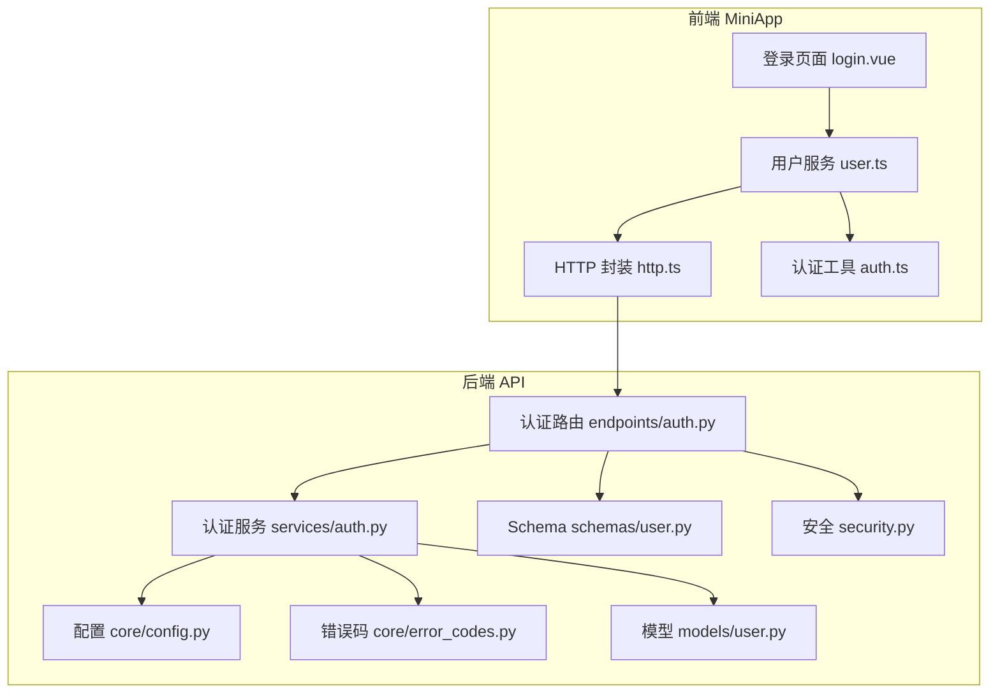
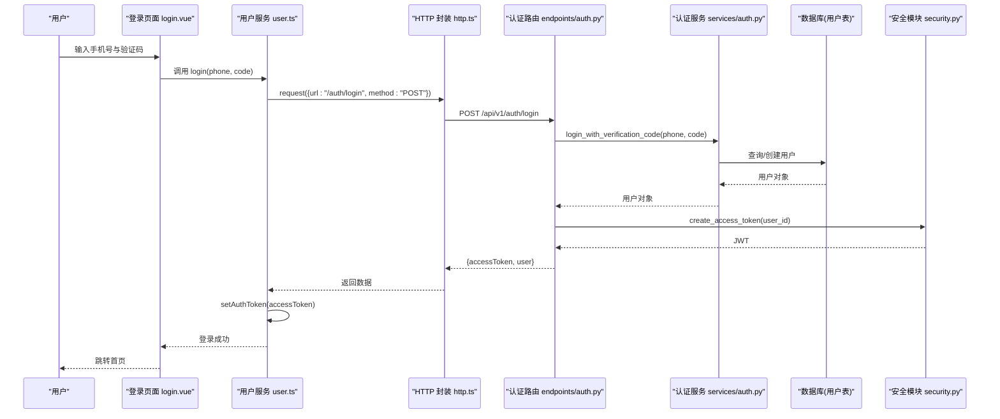
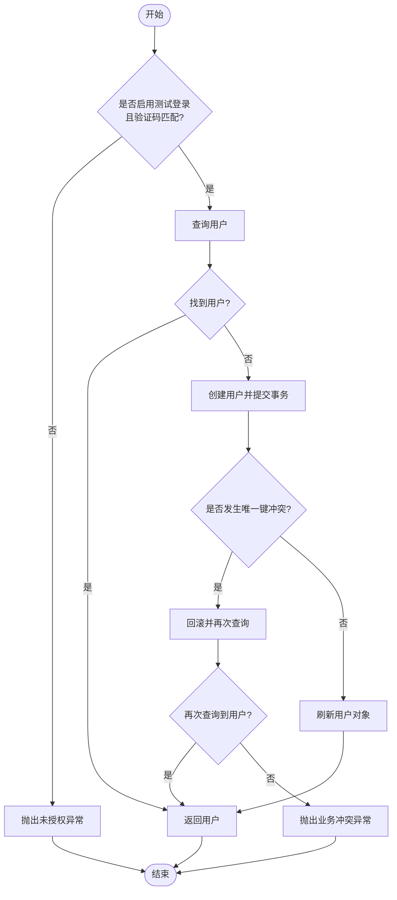
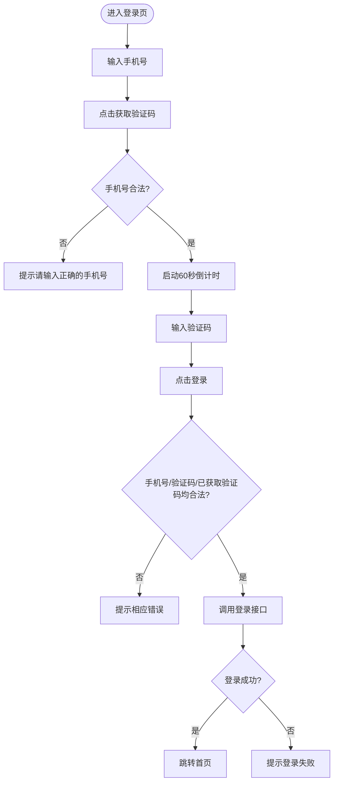
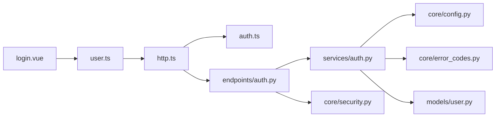
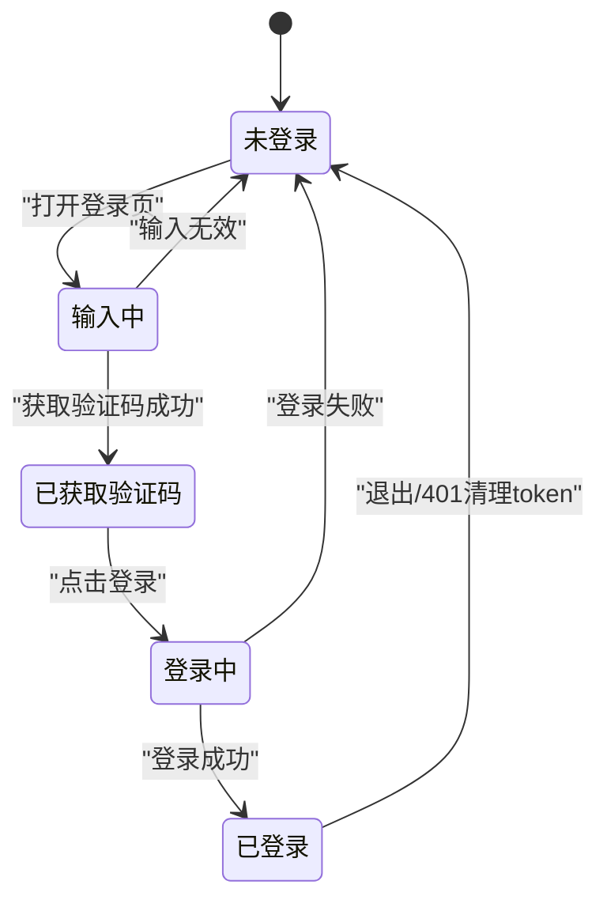

# 认证模块

<cite>
**本文引用的文件**
- [apps/api/app/api/v1/endpoints/auth.py](file://apps/api/app/api/v1/endpoints/auth.py)
- [apps/api/app/services/auth.py](file://apps/api/app/services/auth.py)
- [apps/api/app/core/security.py](file://apps/api/app/core/security.py)
- [apps/api/app/core/config.py](file://apps/api/app/core/config.py)
- [apps/api/app/core/error_codes.py](file://apps/api/app/core/error_codes.py)
- [apps/api/app/schemas/user.py](file://apps/api/app/schemas/user.py)
- [apps/api/app/models/user.py](file://apps/api/app/models/user.py)
- [apps/miniapp/src/pages/auth/login.vue](file://apps/miniapp/src/pages/auth/login.vue)
- [apps/miniapp/src/services/auth.ts](file://apps/miniapp/src/services/auth.ts)
- [apps/miniapp/src/services/user.ts](file://apps/miniapp/src/services/user.ts)
- [apps/miniapp/src/services/http.ts](file://apps/miniapp/src/services/http.ts)
</cite>

## 目录
1. [简介](#简介)
2. [项目结构](#项目结构)
3. [核心组件](#核心组件)
4. [架构总览](#架构总览)
5. [详细组件分析](#详细组件分析)
6. [依赖关系分析](#依赖关系分析)
7. [性能与安全考量](#性能与安全考量)
8. [故障排查指南](#故障排查指南)
9. [结论](#结论)
10. [附录：状态图与流程图](#附录：状态图与流程图)

## 简介
本文件为 Pocket Farm 认证模块的详细功能文档，覆盖以下要点：
- 用户登录流程（手机号 + 验证码）的端到端实现
- JWT 令牌生成、传递与客户端持久化
- 用户状态维护与会话管理
- 登录页 UI 交互、表单校验与用户反馈
- 认证服务 API 封装、错误处理与安全策略
- 自动登录与登出机制
- 认证流程的状态图与错误处理最佳实践

## 项目结构
认证相关代码分布在后端 FastAPI 应用与前端 miniapp 中：
- 后端
  - 路由层：定义 /auth/login 接口，接收手机号与验证码，返回 JWT 与用户信息
  - 服务层：实现验证码登录逻辑，含测试模式开关与用户创建/查询
  - 安全层：JWT 生成与解码
  - 配置层：JWT 密钥、过期时间、测试登录开关等
  - 数据模型与 Schema：用户模型、请求/响应结构
- 前端
  - 登录页面：手机号输入、验证码倒计时、提交登录
  - 服务层：封装 HTTP 请求、统一错误处理、自动附加 Authorization 头
  - 认证工具：本地存取 access token，提供 has/set/clear 能力
  - 用户服务：调用登录接口并持久化 token，获取当前用户

图表来源
- [apps/miniapp/src/pages/auth/login.vue:1-359](file://apps/miniapp/src/pages/auth/login.vue#L1-L359)
- [apps/miniapp/src/services/user.ts:1-42](file://apps/miniapp/src/services/user.ts#L1-L42)
- [apps/miniapp/src/services/http.ts:1-106](file://apps/miniapp/src/services/http.ts#L1-L106)
- [apps/miniapp/src/services/auth.ts:1-18](file://apps/miniapp/src/services/auth.ts#L1-L18)
- [apps/api/app/api/v1/endpoints/auth.py:1-29](file://apps/api/app/api/v1/endpoints/auth.py#L1-L29)
- [apps/api/app/services/auth.py:1-47](file://apps/api/app/services/auth.py#L1-L47)
- [apps/api/app/core/config.py:1-23](file://apps/api/app/core/config.py#L1-L23)
- [apps/api/app/core/error_codes.py:1-13](file://apps/api/app/core/error_codes.py#L1-L13)
- [apps/api/app/models/user.py:1-28](file://apps/api/app/models/user.py#L1-L28)
- [apps/api/app/schemas/user.py:1-34](file://apps/api/app/schemas/user.py#L1-L34)
- [apps/api/app/core/security.py:1-29](file://apps/api/app/core/security.py#L1-L29)

章节来源
- [apps/api/app/api/v1/endpoints/auth.py:1-29](file://apps/api/app/api/v1/endpoints/auth.py#L1-L29)
- [apps/api/app/services/auth.py:1-47](file://apps/api/app/services/auth.py#L1-L47)
- [apps/api/app/core/security.py:1-29](file://apps/api/app/core/security.py#L1-L29)
- [apps/api/app/core/config.py:1-23](file://apps/api/app/core/config.py#L1-L23)
- [apps/api/app/core/error_codes.py:1-13](file://apps/api/app/core/error_codes.py#L1-L13)
- [apps/api/app/schemas/user.py:1-34](file://apps/api/app/schemas/user.py#L1-L34)
- [apps/api/app/models/user.py:1-28](file://apps/api/app/models/user.py#L1-L28)
- [apps/miniapp/src/pages/auth/login.vue:1-359](file://apps/miniapp/src/pages/auth/login.vue#L1-L359)
- [apps/miniapp/src/services/auth.ts:1-18](file://apps/miniapp/src/services/auth.ts#L1-L18)
- [apps/miniapp/src/services/user.ts:1-42](file://apps/miniapp/src/services/user.ts#L1-L42)
- [apps/miniapp/src/services/http.ts:1-106](file://apps/miniapp/src/services/http.ts#L1-L106)

## 核心组件
- 认证路由：暴露 POST /api/v1/auth/login，接收手机号与验证码，返回 JWT 与用户信息
- 认证服务：校验测试登录开关或验证码，查询或创建用户，处理并发冲突
- 安全模块：基于配置的密钥和算法签发 JWT，支持解码
- 配置模块：集中管理 JWT 密钥、过期时间、测试登录开关与默认验证码
- 错误码：统一错误枚举，便于前后端一致的错误分类
- 前端登录页：手机号输入、验证码倒计时、表单校验、登录按钮与 Toast 反馈
- 前端 HTTP 封装：统一请求入口，自动附加 Authorization 头，处理 401 清理 token
- 前端认证工具：本地存储 access token，提供读取、写入、清除能力
- 前端用户服务：调用登录接口，保存 token，并提供获取当前用户、更新昵称等能力

章节来源
- [apps/api/app/api/v1/endpoints/auth.py:13-28](file://apps/api/app/api/v1/endpoints/auth.py#L13-L28)
- [apps/api/app/services/auth.py:11-46](file://apps/api/app/services/auth.py#L11-L46)
- [apps/api/app/core/security.py:8-28](file://apps/api/app/core/security.py#L8-L28)
- [apps/api/app/core/config.py:5-22](file://apps/api/app/core/config.py#L5-L22)
- [apps/api/app/core/error_codes.py:4-12](file://apps/api/app/core/error_codes.py#L4-L12)
- [apps/miniapp/src/pages/auth/login.vue:101-203](file://apps/miniapp/src/pages/auth/login.vue#L101-L203)
- [apps/miniapp/src/services/http.ts:46-105](file://apps/miniapp/src/services/http.ts#L46-L105)
- [apps/miniapp/src/services/auth.ts:1-18](file://apps/miniapp/src/services/auth.ts#L1-L18)
- [apps/miniapp/src/services/user.ts:18-41](file://apps/miniapp/src/services/user.ts#L18-L41)

## 架构总览
认证流程从前端登录页发起，经 HTTP 封装到后端路由，再由服务层完成业务校验与用户操作，最终通过安全模块签发 JWT。前端在成功登录后将 token 持久化，并在后续请求中自动携带。

图表来源
- [apps/miniapp/src/pages/auth/login.vue:158-186](file://apps/miniapp/src/pages/auth/login.vue#L158-L186)
- [apps/miniapp/src/services/user.ts:18-29](file://apps/miniapp/src/services/user.ts#L18-L29)
- [apps/miniapp/src/services/http.ts:46-105](file://apps/miniapp/src/services/http.ts#L46-L105)
- [apps/api/app/api/v1/endpoints/auth.py:13-28](file://apps/api/app/api/v1/endpoints/auth.py#L13-L28)
- [apps/api/app/services/auth.py:11-46](file://apps/api/app/services/auth.py#L11-L46)
- [apps/api/app/core/security.py:8-19](file://apps/api/app/core/security.py#L8-L19)

## 详细组件分析

### 后端认证路由
- 职责：接收登录请求，调用服务层进行验证，生成 JWT 并返回标准化响应
- 关键点：
  - 使用 Pydantic 校验请求体字段（手机号格式、长度限制）
  - 调用服务层完成验证码校验与用户查找/创建
  - 使用安全模块签发 JWT，并将用户信息序列化后返回

章节来源
- [apps/api/app/api/v1/endpoints/auth.py:13-28](file://apps/api/app/api/v1/endpoints/auth.py#L13-L28)
- [apps/api/app/schemas/user.py:4-15](file://apps/api/app/schemas/user.py#L4-L15)
- [apps/api/app/schemas/user.py:18-29](file://apps/api/app/schemas/user.py#L18-L29)

### 后端认证服务
- 职责：实现“手机号 + 验证码”登录的核心逻辑
- 关键点：
  - 若未启用测试登录或验证码不匹配，直接拒绝（401）
  - 查询用户；不存在则创建新用户（唯一约束保护）
  - 并发插入冲突时回滚并二次查询，避免重复创建
  - 返回用户对象供路由层签发 JWT

图表来源
- [apps/api/app/services/auth.py:11-46](file://apps/api/app/services/auth.py#L11-L46)
- [apps/api/app/core/config.py:18-19](file://apps/api/app/core/config.py#L18-L19)
- [apps/api/app/core/error_codes.py:4-12](file://apps/api/app/core/error_codes.py#L4-L12)

章节来源
- [apps/api/app/services/auth.py:11-46](file://apps/api/app/services/auth.py#L11-L46)
- [apps/api/app/core/config.py:18-19](file://apps/api/app/core/config.py#L18-L19)
- [apps/api/app/core/error_codes.py:4-12](file://apps/api/app/core/error_codes.py#L4-L12)

### 安全模块（JWT）
- 职责：根据配置生成和解码 JWT
- 关键点：
  - 签发时包含用户标识、签发时间与过期时间
  - 使用配置的密钥与算法签名
  - 解码用于后续鉴权（可在其他路由中使用）

章节来源
- [apps/api/app/core/security.py:8-28](file://apps/api/app/core/security.py#L8-L28)
- [apps/api/app/core/config.py:14-16](file://apps/api/app/core/config.py#L14-L16)

### 配置与错误码
- 配置项：
  - JWT 密钥、算法、过期时间
  - 测试登录开关与默认验证码
- 错误码：
  - 未授权、业务冲突、数据库不可用等统一枚举

章节来源
- [apps/api/app/core/config.py:5-22](file://apps/api/app/core/config.py#L5-L22)
- [apps/api/app/core/error_codes.py:4-12](file://apps/api/app/core/error_codes.py#L4-L12)

### 数据模型与 Schema
- 用户模型：主键、手机号（唯一）、昵称、创建/更新时间
- Schema：
  - 登录请求：手机号与验证码校验
  - 登录响应：access_token、token_type、user
  - 用户响应：id、手机号、昵称

章节来源
- [apps/api/app/models/user.py:15-27](file://apps/api/app/models/user.py#L15-L27)
- [apps/api/app/schemas/user.py:4-29](file://apps/api/app/schemas/user.py#L4-L29)

### 前端登录页（UI 交互与反馈）
- 表单字段：
  - 手机号：限定 11 位数字，正则校验
  - 验证码：6 位数字，需先获取验证码
- 交互细节：
  - 获取验证码：校验手机号后启动 60 秒倒计时
  - 登录：校验手机号、验证码与是否已获取验证码
  - 开发环境提示：可使用配置的测试验证码
  - 用户反馈：使用 Toast 显示错误与提示信息
- 成功后：跳转到首页

图表来源
- [apps/miniapp/src/pages/auth/login.vue:122-186](file://apps/miniapp/src/pages/auth/login.vue#L122-L186)

章节来源
- [apps/miniapp/src/pages/auth/login.vue:101-203](file://apps/miniapp/src/pages/auth/login.vue#L101-L203)

### 前端 HTTP 封装与错误处理
- 统一请求：
  - 自动附加 Authorization: Bearer <token>
  - 解析统一信封格式，成功返回 data，失败抛出 ApiRequestError
- 错误处理：
  - 401 时清除本地 token，触发重新登录
  - 网络失败与业务错误统一包装为错误对象

章节来源
- [apps/miniapp/src/services/http.ts:46-105](file://apps/miniapp/src/services/http.ts#L46-L105)

### 前端认证工具与用户服务
- 认证工具：
  - 读取、写入、清除本地 token
- 用户服务：
  - 登录：调用 /auth/login，成功后保存 token
  - 获取当前用户：调用 /users/me
  - 更新当前用户：PATCH /users/me

章节来源
- [apps/miniapp/src/services/auth.ts:1-18](file://apps/miniapp/src/services/auth.ts#L1-L18)
- [apps/miniapp/src/services/user.ts:18-41](file://apps/miniapp/src/services/user.ts#L18-L41)

## 依赖关系分析
- 路由依赖服务层，服务层依赖配置与错误码，以及数据模型
- 前端登录页依赖用户服务，用户服务依赖 HTTP 封装与认证工具
- HTTP 封装依赖认证工具以注入 Authorization 头
- 安全模块被路由层调用以签发 JWT

图表来源
- [apps/miniapp/src/pages/auth/login.vue:96-100](file://apps/miniapp/src/pages/auth/login.vue#L96-L100)
- [apps/miniapp/src/services/user.ts:1-3](file://apps/miniapp/src/services/user.ts#L1-L3)
- [apps/miniapp/src/services/http.ts:1-2](file://apps/miniapp/src/services/http.ts#L1-L2)
- [apps/api/app/api/v1/endpoints/auth.py:1-8](file://apps/api/app/api/v1/endpoints/auth.py#L1-L8)
- [apps/api/app/services/auth.py:1-8](file://apps/api/app/services/auth.py#L1-L8)
- [apps/api/app/core/config.py:1-22](file://apps/api/app/core/config.py#L1-L22)
- [apps/api/app/core/error_codes.py:1-12](file://apps/api/app/core/error_codes.py#L1-L12)
- [apps/api/app/models/user.py:1-7](file://apps/api/app/models/user.py#L1-L7)
- [apps/api/app/core/security.py:1-6](file://apps/api/app/core/security.py#L1-L6)

## 性能与安全考量
- 性能
  - 登录路径仅一次数据库查询/插入，避免额外开销
  - 并发插入冲突时回滚并二次查询，减少重复写入
  - JWT 过期时间可配置，建议合理设置以平衡安全与体验
- 安全
  - 测试登录模式需显式开启，生产环境应关闭
  - JWT 使用强密钥与固定算法，避免弱配置
  - 前端在 401 时自动清理 token，防止无效会话继续访问
  - 手机号格式在服务端与前端双重校验，降低非法输入风险

[本节为通用指导，无需特定文件引用]

## 故障排查指南
- 常见错误与定位
  - 未授权（401）：检查测试登录开关与验证码是否匹配；确认前端是否正确传入验证码
  - 业务冲突（409）：并发创建用户时出现唯一键冲突，服务层已处理回滚与重试
  - 网络失败：检查 API 地址与网络连通性；确认 Authorization 头是否正确携带
  - 401 清理 token：服务端返回 401 时，前端会清除本地 token，需重新登录
- 调试建议
  - 开启调试模式查看请求与响应信封
  - 检查环境变量中的 JWT 密钥与过期时间
  - 在登录页观察倒计时与校验提示是否正常

章节来源
- [apps/api/app/services/auth.py:17-43](file://apps/api/app/services/auth.py#L17-L43)
- [apps/api/app/core/error_codes.py:4-12](file://apps/api/app/core/error_codes.py#L4-L12)
- [apps/miniapp/src/services/http.ts:71-101](file://apps/miniapp/src/services/http.ts#L71-L101)

## 结论
Pocket Farm 认证模块采用“手机号 + 验证码”的无密码登录方式，结合 JWT 实现轻量级身份认证。后端通过严格的服务层校验与并发保护确保数据一致性，前端提供友好的表单校验与反馈机制，并通过统一的 HTTP 封装保障请求的一致性与安全性。整体设计简洁清晰，易于扩展与维护。

[本节为总结性内容，无需特定文件引用]

## 附录：状态图与流程图

### 认证状态图（前端视角）

[此图为概念性流程图，不直接映射具体源码文件]

### 登录流程时序图（端到端）
已在“架构总览”部分展示，此处不再重复。