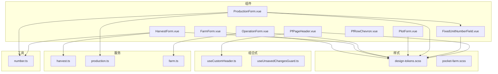
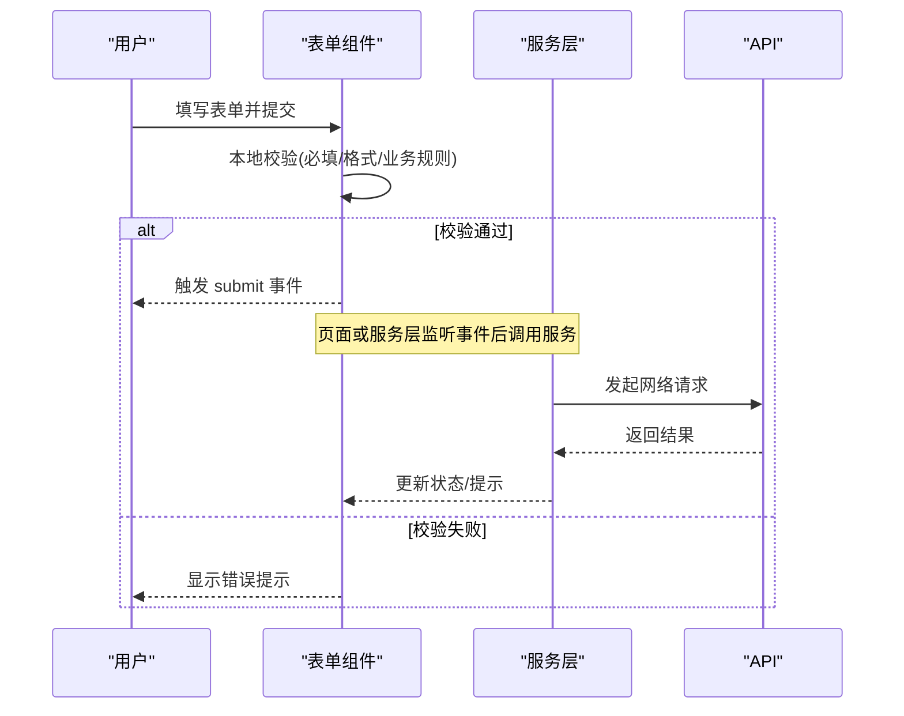
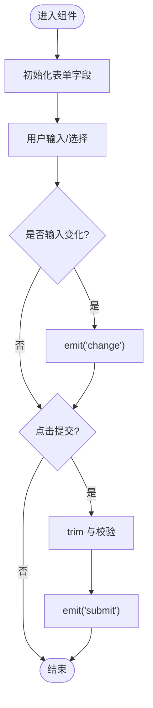
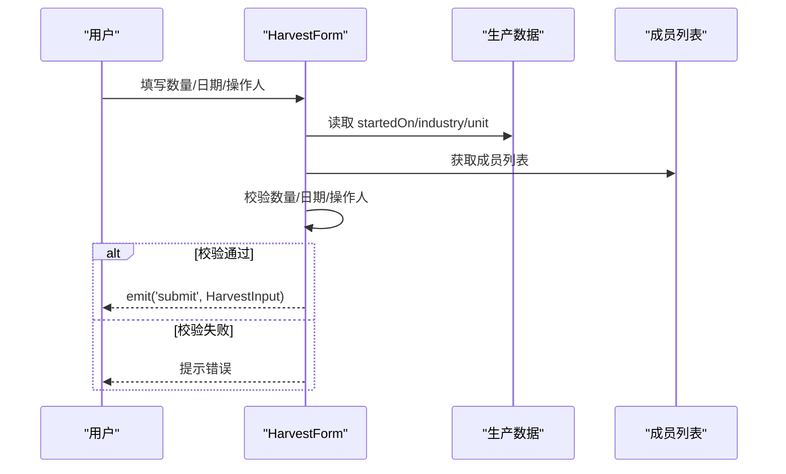
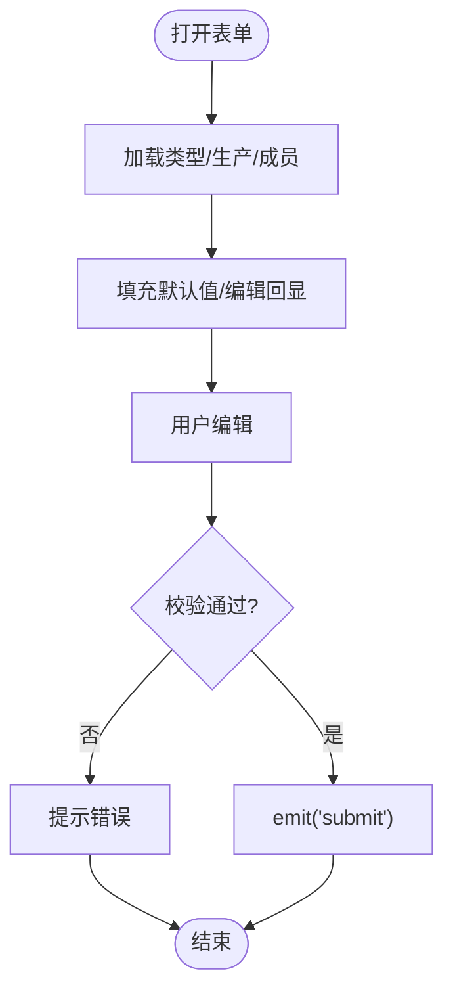
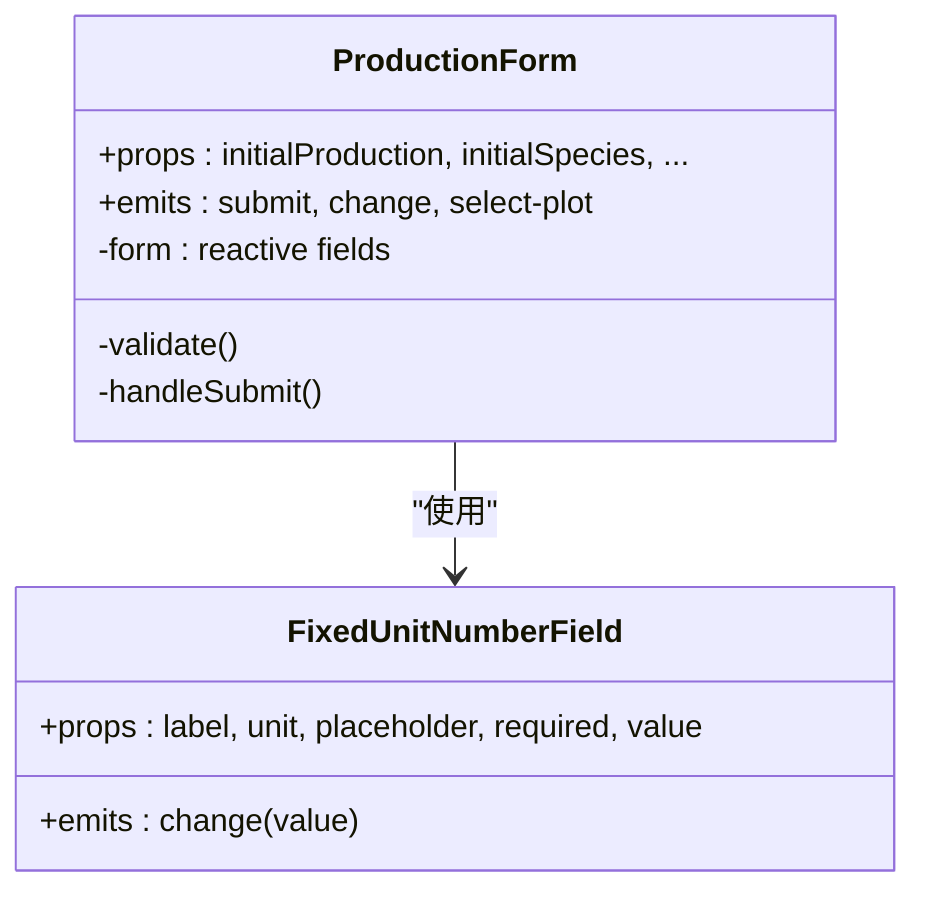
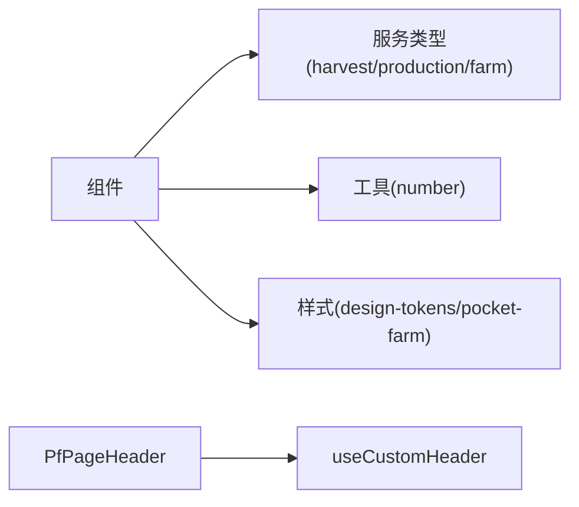

# 通用组件库

<cite>
**本文引用的文件**
- [FarmForm.vue](file://apps/miniapp/src/components/FarmForm.vue)
- [HarvestForm.vue](file://apps/miniapp/src/components/HarvestForm.vue)
- [OperationForm.vue](file://apps/miniapp/src/components/OperationForm.vue)
- [PlotForm.vue](file://apps/miniapp/src/components/PlotForm.vue)
- [ProductionForm.vue](file://apps/miniapp/src/components/ProductionForm.vue)
- [FixedUnitNumberField.vue](file://apps/miniapp/src/components/FixedUnitNumberField.vue)
- [PfPageHeader.vue](file://apps/miniapp/src/components/PfPageHeader.vue)
- [PfRowChevron.vue](file://apps/miniapp/src/components/PfRowChevron.vue)
- [design-tokens.scss](file://apps/miniapp/src/styles/design-tokens.scss)
- [pocket-farm.scss](file://apps/miniapp/src/styles/pocket-farm.scss)
- [useCustomHeader.ts](file://apps/miniapp/src/composables/useCustomHeader.ts)
- [useUnsavedChangesGuard.ts](file://apps/miniapp/src/composables/useUnsavedChangesGuard.ts)
- [harvest.ts](file://apps/miniapp/src/services/harvest.ts)
- [production.ts](file://apps/miniapp/src/services/production.ts)
- [farm.ts](file://apps/miniapp/src/services/farm.ts)
- [number.ts](file://apps/miniapp/src/utils/number.ts)
- [package.json](file://apps/miniapp/package.json)
- [根 package.json](file://package.json)
</cite>

## 目录
1. [简介](#简介)
2. [项目结构](#项目结构)
3. [核心组件](#核心组件)
4. [架构总览](#架构总览)
5. [详细组件分析](#详细组件分析)
6. [依赖关系分析](#依赖关系分析)
7. [性能与可访问性](#性能与可访问性)
8. [故障排查指南](#故障排查指南)
9. [结论](#结论)
10. [附录：开发规范、版本管理与兼容性](#附录开发规范版本管理与兼容性)

## 简介
本技术文档面向 Pocket Farm 通用组件库，聚焦于可复用的表单组件、业务组件与 UI 基础组件。文档从设计理念、实现模式、Props/事件/插槽约定、样式与主题系统、响应式策略，到测试策略、文档生成与使用示例进行系统化说明，并给出组件开发规范、版本管理与向后兼容性保证建议，帮助团队在统一设计语言下高效构建一致的移动端体验。

## 项目结构
- 组件位于 apps/miniapp/src/components，按“领域+形态”组织，如 FarmForm、HarvestForm、OperationForm、PlotForm、ProductionForm 等；基础 UI 组件包含 PfPageHeader、PfRowChevron、FixedUnitNumberField。
- 样式采用 SCSS + Design Tokens 体系，集中定义语义色、间距、圆角、阴影与动效时长，确保跨组件视觉一致性。
- 组合式函数（composables）提供平台适配能力，如自定义导航栏高度计算与未保存变更拦截。
- 服务层（services）封装 API 请求与类型定义，组件通过事件将表单数据上抛给页面或服务层处理。
- 工具函数（utils）提供数值格式化等通用逻辑，避免重复实现。

**图表来源**
- [FarmForm.vue:1-150](file://apps/miniapp/src/components/FarmForm.vue#L1-L150)
- [HarvestForm.vue:1-311](file://apps/miniapp/src/components/HarvestForm.vue#L1-L311)
- [OperationForm.vue:1-364](file://apps/miniapp/src/components/OperationForm.vue#L1-L364)
- [PlotForm.vue:1-242](file://apps/miniapp/src/components/PlotForm.vue#L1-L242)
- [ProductionForm.vue:1-613](file://apps/miniapp/src/components/ProductionForm.vue#L1-L613)
- [FixedUnitNumberField.vue:1-99](file://apps/miniapp/src/components/FixedUnitNumberField.vue#L1-L99)
- [PfPageHeader.vue:1-130](file://apps/miniapp/src/components/PfPageHeader.vue#L1-L130)
- [design-tokens.scss:1-74](file://apps/miniapp/src/styles/design-tokens.scss#L1-L74)
- [pocket-farm.scss:1-78](file://apps/miniapp/src/styles/pocket-farm.scss#L1-L78)
- [useCustomHeader.ts:1-39](file://apps/miniapp/src/composables/useCustomHeader.ts#L1-L39)
- [useUnsavedChangesGuard.ts:1-28](file://apps/miniapp/src/composables/useUnsavedChangesGuard.ts#L1-L28)
- [harvest.ts:1-92](file://apps/miniapp/src/services/harvest.ts#L1-L92)
- [production.ts:1-121](file://apps/miniapp/src/services/production.ts#L1-L121)
- [farm.ts:1-121](file://apps/miniapp/src/services/farm.ts#L1-L121)
- [number.ts:1-19](file://apps/miniapp/src/utils/number.ts#L1-L19)

**章节来源**
- [FarmForm.vue:1-150](file://apps/miniapp/src/components/FarmForm.vue#L1-L150)
- [HarvestForm.vue:1-311](file://apps/miniapp/src/components/HarvestForm.vue#L1-L311)
- [OperationForm.vue:1-364](file://apps/miniapp/src/components/OperationForm.vue#L1-L364)
- [PlotForm.vue:1-242](file://apps/miniapp/src/components/PlotForm.vue#L1-L242)
- [ProductionForm.vue:1-613](file://apps/miniapp/src/components/ProductionForm.vue#L1-L613)
- [design-tokens.scss:1-74](file://apps/miniapp/src/styles/design-tokens.scss#L1-L74)
- [pocket-farm.scss:1-78](file://apps/miniapp/src/styles/pocket-farm.scss#L1-L78)
- [useCustomHeader.ts:1-39](file://apps/miniapp/src/composables/useCustomHeader.ts#L1-L39)
- [useUnsavedChangesGuard.ts:1-28](file://apps/miniapp/src/composables/useUnsavedChangesGuard.ts#L1-L28)
- [harvest.ts:1-92](file://apps/miniapp/src/services/harvest.ts#L1-L92)
- [production.ts:1-121](file://apps/miniapp/src/services/production.ts#L1-L121)
- [farm.ts:1-121](file://apps/miniapp/src/services/farm.ts#L1-L121)
- [number.ts:1-19](file://apps/miniapp/src/utils/number.ts#L1-L19)

## 核心组件
- 表单类组件：FarmForm、HarvestForm、OperationForm、PlotForm、ProductionForm。共性：
  - Props：初始值、提交文案、加载状态、是否禁用等；
  - Emits：submit（提交）、change（输入变化）、select-*（选择回调）；
  - 校验：必填项、数值格式、日期范围、业务规则（如作业时间不晚于当前时间）；
  - 交互：聚焦态边框高亮、选择器联动、单位自动推导、默认值填充。
- 基础 UI 组件：
  - FixedUnitNumberField：固定单位的数字输入框，支持占位符、必填标记、单位展示；
  - PfPageHeader：自定义导航头，兼容小程序胶囊按钮与 H5 安全区；
  - PfRowChevron：行内箭头图标，用于列表导航提示。

**章节来源**
- [FarmForm.vue:53-104](file://apps/miniapp/src/components/FarmForm.vue#L53-L104)
- [HarvestForm.vue:98-289](file://apps/miniapp/src/components/HarvestForm.vue#L98-L289)
- [OperationForm.vue:83-281](file://apps/miniapp/src/components/OperationForm.vue#L83-L281)
- [PlotForm.vue:72-167](file://apps/miniapp/src/components/PlotForm.vue#L72-L167)
- [ProductionForm.vue:187-470](file://apps/miniapp/src/components/ProductionForm.vue#L187-L470)
- [FixedUnitNumberField.vue:1-99](file://apps/miniapp/src/components/FixedUnitNumberField.vue#L1-L99)
- [PfPageHeader.vue:1-130](file://apps/miniapp/src/components/PfPageHeader.vue#L1-L130)
- [PfRowChevron.vue:1-17](file://apps/miniapp/src/components/PfRowChevron.vue#L1-L17)

## 架构总览
组件库以“表单组件 + 基础 UI + 样式令牌 + 组合式函数 + 服务层”分层组织。表单组件负责用户输入与校验，通过事件将数据上抛；基础 UI 提供一致的可复用界面元素；样式令牌统一视觉语言；组合式函数屏蔽平台差异；服务层封装 API 调用。

**图表来源**
- [HarvestForm.vue:248-289](file://apps/miniapp/src/components/HarvestForm.vue#L248-L289)
- [OperationForm.vue:250-281](file://apps/miniapp/src/components/OperationForm.vue#L250-L281)
- [ProductionForm.vue:418-470](file://apps/miniapp/src/components/ProductionForm.vue#L418-L470)
- [harvest.ts:67-92](file://apps/miniapp/src/services/harvest.ts#L67-L92)
- [production.ts:74-110](file://apps/miniapp/src/services/production.ts#L74-L110)
- [farm.ts:54-72](file://apps/miniapp/src/services/farm.ts#L54-L72)

## 详细组件分析

### 农场信息表单 FarmForm
- 职责：收集农场名称与地区，支持聚焦态与可选字段提示。
- Props：initialName、initialRegion、submitLabel、loadingText、submitting。
- Emits：submit（name, region）、change（name, region）。
- 交互：输入时触发 change；点击提交触发 submit，并对空值做 trim 处理。
- 样式：基于 design-tokens 的边框、圆角、颜色变量，聚焦时主色边框。

**图表来源**
- [FarmForm.vue:53-104](file://apps/miniapp/src/components/FarmForm.vue#L53-L104)
- [FarmForm.vue:106-150](file://apps/miniapp/src/components/FarmForm.vue#L106-L150)

**章节来源**
- [FarmForm.vue:1-150](file://apps/miniapp/src/components/FarmForm.vue#L1-L150)

### 收获记录表单 HarvestForm
- 职责：录入收获数量、作业方式、日期时间、操作人、产品名、等级、备注。
- Props：production、members、currentUserId、initialHarvest、submitLabel、loadingText、submitting。
- Emits：submit（HarvestInput）。
- 校验：数量格式与单位约束（KG 允许小数，其他单位需整数）、日期不早于开始日期、时间不晚于当前时间、操作人必填。
- 动态：根据 production.industry 决定标签、单位与必填项；成员列表用于选择操作人。

**图表来源**
- [HarvestForm.vue:98-289](file://apps/miniapp/src/components/HarvestForm.vue#L98-L289)
- [harvest.ts:35-43](file://apps/miniapp/src/services/harvest.ts#L35-L43)
- [production.ts:9-31](file://apps/miniapp/src/services/production.ts#L9-L31)
- [farm.ts:23-29](file://apps/miniapp/src/services/farm.ts#L23-L29)

**章节来源**
- [HarvestForm.vue:1-311](file://apps/miniapp/src/components/HarvestForm.vue#L1-L311)
- [harvest.ts:1-92](file://apps/miniapp/src/services/harvest.ts#L1-L92)
- [production.ts:1-121](file://apps/miniapp/src/services/production.ts#L1-L121)
- [farm.ts:1-121](file://apps/miniapp/src/services/farm.ts#L1-L121)

### 农事记录表单 OperationForm
- 职责：选择农事类型、关联种养（可选）、作业方式、日期时间、操作人、备注。
- Props：productions、members、operationTypes、currentUserId、hasPlot、selectedOperationTypeId、selectedProductionId、initialOperation、submitLabel、loadingText、submitting。
- Emits：submit（OperationInput）、select-operation-type、select-production。
- 校验：地块存在性、农事类型与操作人必填、日期范围与时间合法性。

**图表来源**
- [OperationForm.vue:83-281](file://apps/miniapp/src/components/OperationForm.vue#L83-L281)

**章节来源**
- [OperationForm.vue:1-364](file://apps/miniapp/src/components/OperationForm.vue#L1-L364)

### 地块表单 PlotForm
- 职责：录入地块名称、类型、面积与单位。
- Props：initialName、initialType、initialAreaValue、initialAreaUnit、submitLabel、loadingText、submitting。
- Emits：submit（name, type, areaValue, areaUnit）、change。
- 特性：面积单位下拉选择，数值格式化展示。

**章节来源**
- [PlotForm.vue:1-242](file://apps/miniapp/src/components/PlotForm.vue#L1-L242)

### 种养表单 ProductionForm
- 职责：复杂业务表单，涵盖种类、品种、种植标准/方式、开始/预计采收时间、初始数量、株间距、入栏日龄、作业方式、备注等。
- Props：initialProduction、initialSpecies、initialVariety、initialPlot、showPlotField、plotSelectable、lockSpeciesInfo、submitLabel、loadingText、submitting。
- Emits：submit（ProductionInput）、change、select-plot。
- 动态：根据 industry 与 plantingMethod 切换字段与标签；对数值进行严格校验（正数/整数/非负整数）。
- 子组件：FixedUnitNumberField 用于带单位的数值输入。

**图表来源**
- [ProductionForm.vue:187-470](file://apps/miniapp/src/components/ProductionForm.vue#L187-L470)
- [FixedUnitNumberField.vue:1-99](file://apps/miniapp/src/components/FixedUnitNumberField.vue#L1-L99)

**章节来源**
- [ProductionForm.vue:1-613](file://apps/miniapp/src/components/ProductionForm.vue#L1-L613)
- [FixedUnitNumberField.vue:1-99](file://apps/miniapp/src/components/FixedUnitNumberField.vue#L1-L99)

### 基础 UI 组件
- FixedUnitNumberField：统一单位输入样式，支持必填标记与占位符。
- PfPageHeader：自定义导航头，结合 useCustomHeader 计算状态栏与胶囊按钮空间，支持居中/标签页两种变体。
- PfRowChevron：行内右箭头图标，用于列表项导航提示。

**章节来源**
- [FixedUnitNumberField.vue:1-99](file://apps/miniapp/src/components/FixedUnitNumberField.vue#L1-L99)
- [PfPageHeader.vue:1-130](file://apps/miniapp/src/components/PfPageHeader.vue#L1-L130)
- [PfRowChevron.vue:1-17](file://apps/miniapp/src/components/PfRowChevron.vue#L1-L17)
- [useCustomHeader.ts:1-39](file://apps/miniapp/src/composables/useCustomHeader.ts#L1-L39)

## 依赖关系分析
- 组件依赖：
  - 表单组件依赖 services 中的类型定义（如 HarvestInput、ProductionInput），以及 utils 中的 number 格式化；
  - 基础 UI 组件依赖 design-tokens 与 pocket-farm 全局样式；
  - PfPageHeader 依赖 useCustomHeader 处理平台差异。
- 服务层依赖：
  - harvest.ts、production.ts、farm.ts 均通过 http 模块发起请求，暴露类型化接口供组件使用。
- 样式依赖：
  - 所有组件样式通过 @import 引用 design-tokens.scss，保证视觉一致性。

**图表来源**
- [HarvestForm.vue:98-289](file://apps/miniapp/src/components/HarvestForm.vue#L98-L289)
- [OperationForm.vue:83-281](file://apps/miniapp/src/components/OperationForm.vue#L83-L281)
- [ProductionForm.vue:187-470](file://apps/miniapp/src/components/ProductionForm.vue#L187-L470)
- [design-tokens.scss:1-74](file://apps/miniapp/src/styles/design-tokens.scss#L1-L74)
- [pocket-farm.scss:1-78](file://apps/miniapp/src/styles/pocket-farm.scss#L1-L78)
- [useCustomHeader.ts:1-39](file://apps/miniapp/src/composables/useCustomHeader.ts#L1-L39)
- [harvest.ts:1-92](file://apps/miniapp/src/services/harvest.ts#L1-L92)
- [production.ts:1-121](file://apps/miniapp/src/services/production.ts#L1-L121)
- [farm.ts:1-121](file://apps/miniapp/src/services/farm.ts#L1-L121)
- [number.ts:1-19](file://apps/miniapp/src/utils/number.ts#L1-L19)

**章节来源**
- [harvest.ts:1-92](file://apps/miniapp/src/services/harvest.ts#L1-L92)
- [production.ts:1-121](file://apps/miniapp/src/services/production.ts#L1-L121)
- [farm.ts:1-121](file://apps/miniapp/src/services/farm.ts#L1-L121)
- [design-tokens.scss:1-74](file://apps/miniapp/src/styles/design-tokens.scss#L1-L74)
- [pocket-farm.scss:1-78](file://apps/miniapp/src/styles/pocket-farm.scss#L1-L78)
- [useCustomHeader.ts:1-39](file://apps/miniapp/src/composables/useCustomHeader.ts#L1-L39)
- [number.ts:1-19](file://apps/miniapp/src/utils/number.ts#L1-L19)

## 性能与可访问性
- 性能：
  - 表单组件使用 reactive/ref/watch 管理局部状态，减少不必要的重渲染；
  - 数值格式化使用字符串处理避免精度丢失；
  - 选择器与输入控件最小化 DOM 操作，提升滚动与输入流畅度。
- 可访问性：
  - 必填项通过视觉标记（*）与辅助文本提示；
  - 占位符与帮助文本清晰表达输入期望；
  - 聚焦态边框高亮提升键盘导航可见性。

[本节为通用指导，无需特定文件引用]

## 故障排查指南
- 常见校验问题：
  - 数量格式错误：检查正则与单位约束（KG 允许小数，其他单位需整数）；
  - 日期/时间非法：确保不早于开始日期且不晚于当前时间；
  - 必填项缺失：农事类型、操作人、地块等必填字段需在提交前校验。
- 平台差异：
  - 自定义导航栏高度：确认 useCustomHeader 已正确计算状态栏与胶囊按钮空间；
  - 未保存离开保护：在非微信平台静默降级，不影响正常导航。
- 调试建议：
  - 在组件中打印 emit 的数据结构，与服务层类型对比；
  - 使用浏览器或小程序开发者工具的断点与日志定位问题。

**章节来源**
- [HarvestForm.vue:248-289](file://apps/miniapp/src/components/HarvestForm.vue#L248-L289)
- [OperationForm.vue:250-281](file://apps/miniapp/src/components/OperationForm.vue#L250-L281)
- [ProductionForm.vue:418-470](file://apps/miniapp/src/components/ProductionForm.vue#L418-L470)
- [useCustomHeader.ts:1-39](file://apps/miniapp/src/composables/useCustomHeader.ts#L1-L39)
- [useUnsavedChangesGuard.ts:1-28](file://apps/miniapp/src/composables/useUnsavedChangesGuard.ts#L1-L28)

## 结论
Pocket Farm 通用组件库通过统一的表单模式、严格的校验策略、一致的视觉令牌与平台适配的组合式函数，实现了高内聚、低耦合的可复用组件集合。建议在后续扩展中继续遵循现有模式，保持 Props/Emits 契约稳定，并通过文档与测试保障长期可维护性。

[本节为总结，无需特定文件引用]

## 附录：开发规范、版本管理与兼容性

### 组件开发规范
- 命名：组件文件使用 PascalCase，如 FarmForm.vue；样式类名使用 BEM 风格，如 .field-group、.input-shell。
- Props/Emits：
  - 使用 TypeScript 定义 props 与 emits，提供默认值与类型约束；
  - 事件命名小写连字符，如 select-plot、select-operation-type。
- 校验：
  - 前端校验优先，服务端二次校验；
  - 错误提示使用 uni.showToast 或组件内提示，保持用户体验一致。
- 样式：
  - 仅使用 design-tokens 中的语义变量，禁止硬编码颜色与尺寸；
  - 组件样式 scoped，避免污染全局。
- 组合式函数：
  - 将平台差异逻辑抽离至 composables，如 useCustomHeader、useUnsavedChangesGuard。

**章节来源**
- [design-tokens.scss:1-74](file://apps/miniapp/src/styles/design-tokens.scss#L1-L74)
- [pocket-farm.scss:1-78](file://apps/miniapp/src/styles/pocket-farm.scss#L1-L78)
- [useCustomHeader.ts:1-39](file://apps/miniapp/src/composables/useCustomHeader.ts#L1-L39)
- [useUnsavedChangesGuard.ts:1-28](file://apps/miniapp/src/composables/useUnsavedChangesGuard.ts#L1-L28)

### 版本管理与向后兼容
- 版本策略：
  - 采用语义化版本（SemVer），主版本变更破坏性接口，次版本新增功能，补丁版本修复缺陷；
  - 在组件 Props 中保留旧字段作为别名或兼容层，逐步弃用。
- 兼容性保证：
  - 对关键事件与数据结构进行快照备份，便于迁移；
  - 在升级文档中明确废弃字段与替代方案。

[本节为通用指导，无需特定文件引用]

### 测试策略
- 单元测试：
  - 针对组件的 Props/Emits 与校验逻辑编写用例，覆盖边界条件（空值、非法数值、日期越界）；
  - 使用 Vue Test Utils 模拟事件与组件挂载。
- 集成测试：
  - 验证表单提交流程与服务层接口的对接；
  - 模拟网络响应与错误场景。
- 端到端测试：
  - 使用小程序或 H5 自动化框架进行关键路径测试（创建/编辑/删除）。

[本节为通用指导，无需特定文件引用]

### 文档生成与使用示例
- 文档站点：
  - 使用 VitePress 搭建文档站点，配置 mermaid 渲染器以展示架构图与流程图；
  - 为每个组件提供 Props/Emits/Slots 表格、示例代码与注意事项。
- 使用示例：
  - 在 pages 中引入组件，绑定数据与事件，演示典型用法；
  - 提供最小可运行示例，便于快速上手。

**章节来源**
- [根 package.json:1-32](file://package.json#L1-L32)
- [apps/miniapp/package.json:1-73](file://apps/miniapp/package.json#L1-L73)