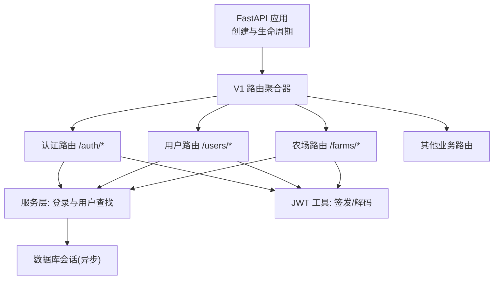
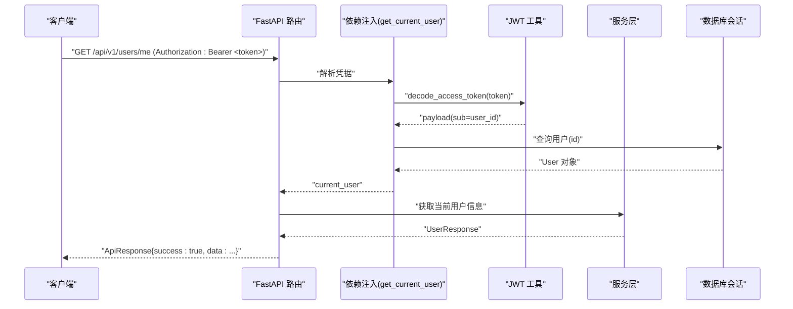
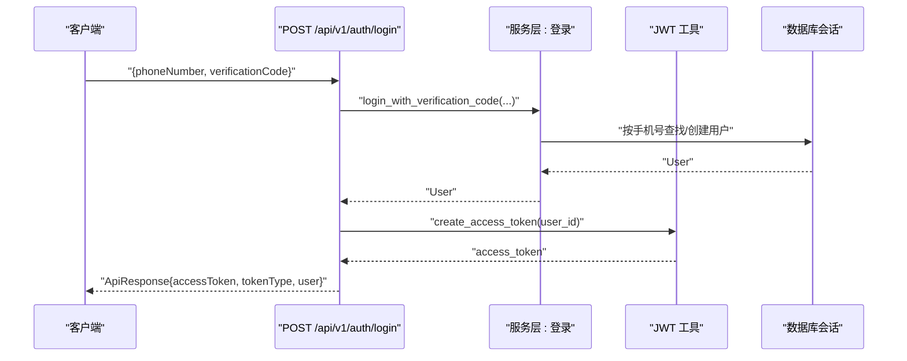
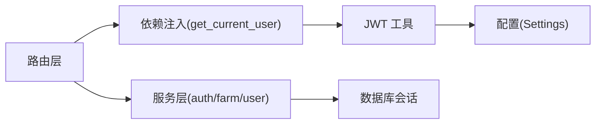

# API 规范

<cite>
**本文引用的文件**
- [apps/api/app/main.py](file://apps/api/app/main.py)
- [apps/api/app/api/v1/router.py](file://apps/api/app/api/v1/router.py)
- [apps/api/app/api/deps.py](file://apps/api/app/api/deps.py)
- [apps/api/app/core/security.py](file://apps/api/app/core/security.py)
- [apps/api/app/core/config.py](file://apps/api/app/core/config.py)
- [apps/api/app/core/exceptions.py](file://apps/api/app/core/exceptions.py)
- [apps/api/app/core/error_codes.py](file://apps/api/app/core/error_codes.py)
- [apps/api/app/schemas/response.py](file://apps/api/app/schemas/response.py)
- [apps/api/app/schemas/user.py](file://apps/api/app/schemas/user.py)
- [apps/api/app/services/auth.py](file://apps/api/app/services/auth.py)
- [apps/api/app/models/user.py](file://apps/api/app/models/user.py)
- [apps/api/app/api/v1/endpoints/auth.py](file://apps/api/app/api/v1/endpoints/auth.py)
- [apps/api/app/api/v1/endpoints/users.py](file://apps/api/app/api/v1/endpoints/users.py)
- [apps/api/app/api/v1/endpoints/farms.py](file://apps/api/app/api/v1/endpoints/farms.py)
</cite>

## 目录
1. [简介](#简介)
2. [项目结构](#项目结构)
3. [核心组件](#核心组件)
4. [架构总览](#架构总览)
5. [详细组件分析](#详细组件分析)
6. [依赖关系分析](#依赖关系分析)
7. [性能考虑](#性能考虑)
8. [故障排查指南](#故障排查指南)
9. [结论](#结论)
10. [附录](#附录)

## 简介
本规范面向 Pocket Farm API，统一说明 RESTful 设计原则、统一响应格式、错误码定义、认证与授权机制、HTTP 状态码使用、请求头配置、数据验证规则、版本管理策略，并提供典型请求与响应示例。同时给出 JWT 令牌使用方法、权限控制要点、API 安全最佳实践与性能优化建议，帮助前后端团队高效协作与稳定集成。

## 项目结构
API 基于 FastAPI 构建，采用模块化分层：
- 应用入口与生命周期管理：负责注册异常处理器、挂载路由与健康检查。
- 路由组织：v1 路由聚合各业务模块路由（认证、用户、农场、地块、作业、生产、物种等）。
- 依赖注入：数据库会话与当前用户解析（JWT 校验）集中实现。
- 安全与配置：JWT 签发/校验、全局配置项（前缀、过期时间、算法等）。
- 数据模型与模式：ORM 模型与 Pydantic 请求/响应模式分离。
- 服务层：封装领域逻辑与事务边界。
- 异常与错误码：统一异常类型与错误码枚举，配合全局异常处理器输出一致错误体。

图表来源
- [apps/api/app/main.py:13-27](file://apps/api/app/main.py#L13-L27)
- [apps/api/app/api/v1/router.py:1-21](file://apps/api/app/api/v1/router.py#L1-L21)
- [apps/api/app/api/deps.py:19-66](file://apps/api/app/api/deps.py#L19-L66)
- [apps/api/app/core/security.py:8-28](file://apps/api/app/core/security.py#L8-L28)

章节来源
- [apps/api/app/main.py:13-27](file://apps/api/app/main.py#L13-L27)
- [apps/api/app/api/v1/router.py:1-21](file://apps/api/app/api/v1/router.py#L1-L21)

## 核心组件
- 统一响应体：所有接口返回 ApiResponse，包含 success、data、error 字段；提供成功/失败构造方法。
- 错误码：ErrorCode 枚举覆盖常见业务与系统错误，便于客户端分类处理。
- 认证与授权：基于 HTTP Bearer 的 JWT 访问令牌；通过依赖 get_current_user 在受保护路由中解析当前用户。
- 数据验证：Pydantic 模型对请求参数进行严格校验，非法输入返回 422 并附带错误详情。
- 版本管理：通过路由前缀 /api/v1 实现 API 版本隔离，便于后续演进与兼容。

章节来源
- [apps/api/app/schemas/response.py:10-39](file://apps/api/app/schemas/response.py#L10-L39)
- [apps/api/app/core/error_codes.py:1-13](file://apps/api/app/core/error_codes.py#L1-L13)
- [apps/api/app/api/deps.py:16-66](file://apps/api/app/api/deps.py#L16-L66)
- [apps/api/app/core/config.py:5-22](file://apps/api/app/core/config.py#L5-L22)

## 架构总览
下图展示一次受保护资源请求的完整调用链：客户端携带 JWT 访问受保护路由，依赖注入解析用户，服务层执行业务逻辑，最终返回统一响应体。

图表来源
- [apps/api/app/api/deps.py:29-66](file://apps/api/app/api/deps.py#L29-L66)
- [apps/api/app/core/security.py:22-28](file://apps/api/app/core/security.py#L22-L28)
- [apps/api/app/api/v1/endpoints/users.py:15-20](file://apps/api/app/api/v1/endpoints/users.py#L15-L20)

## 详细组件分析

### 认证与授权
- 登录流程：通过手机号+验证码登录，成功后签发 JWT 并返回 access_token、token_type 与用户信息。
- 鉴权方式：受保护路由通过 get_current_user 依赖注入解析 Authorization: Bearer <token>，校验令牌有效性并加载当前用户。
- 令牌配置：算法、密钥、过期时间由配置中心提供，默认 HS256，过期时间为一周。

图表来源
- [apps/api/app/api/v1/endpoints/auth.py:13-28](file://apps/api/app/api/v1/endpoints/auth.py#L13-L28)
- [apps/api/app/services/auth.py:11-47](file://apps/api/app/services/auth.py#L11-L47)
- [apps/api/app/core/security.py:8-19](file://apps/api/app/core/security.py#L8-L19)

章节来源
- [apps/api/app/api/v1/endpoints/auth.py:13-28](file://apps/api/app/api/v1/endpoints/auth.py#L13-L28)
- [apps/api/app/services/auth.py:11-47](file://apps/api/app/services/auth.py#L11-L47)
- [apps/api/app/core/security.py:8-28](file://apps/api/app/core/security.py#L8-L28)
- [apps/api/app/core/config.py:10-17](file://apps/api/app/core/config.py#L10-L17)

### 用户接口
- GET /api/v1/users/me：获取当前用户信息。
- PATCH /api/v1/users/me：更新当前用户昵称。
- 均需要 Bearer Token 鉴权。

章节来源
- [apps/api/app/api/v1/endpoints/users.py:15-29](file://apps/api/app/api/v1/endpoints/users.py#L15-L29)
- [apps/api/app/schemas/user.py:18-34](file://apps/api/app/schemas/user.py#L18-L34)

### 农场接口
- GET /api/v1/farms：分页获取我的农场列表（支持 page、pageSize）。
- POST /api/v1/farms：创建农场（返回 201）。
- GET /api/v1/farms/{farm_id}：获取指定农场详情（含当前用户角色）。
- PATCH /api/v1/farms/{farm_id}：编辑农场信息。
- GET /api/v1/farms/{farm_id}/members：分页获取成员列表。
- POST /api/v1/farms/{farm_id}/members：添加成员（返回 201）。
- PATCH /api/v1/farms/{farm_id}/members/{member_id}：修改成员角色。
- DELETE /api/v1/farms/{farm_id}/members/me：退出农场（返回 204）。
- DELETE /api/v1/farms/{farm_id}/members/{member_id}：移除成员（返回 204）。
- 全部接口需 Bearer Token 鉴权。

章节来源
- [apps/api/app/api/v1/endpoints/farms.py:58-200](file://apps/api/app/api/v1/endpoints/farms.py#L58-L200)

### 统一响应格式
- 成功响应：ApiResponse.success_response(data=...)
- 失败响应：ApiResponse.error_response(code=..., message=..., details=...)
- 字段说明：
  - success: 布尔值，表示是否成功
  - data: 业务数据（可为空）
  - error: 错误对象，包含 code、message、details

章节来源
- [apps/api/app/schemas/response.py:10-39](file://apps/api/app/schemas/response.py#L10-L39)

### 错误码与异常处理
- 错误码枚举：涵盖未授权、禁止访问、冲突、未找到、验证失败、数据库不可用、内部错误等。
- 异常处理器：
  - 应用异常 AppException：映射为对应 HTTP 状态码与统一错误体
  - 请求验证异常：返回 422 与验证错误详情
  - HTTP 异常：标准化消息与详情
  - 未捕获异常：返回 500 与通用内部错误消息

章节来源
- [apps/api/app/core/error_codes.py:1-13](file://apps/api/app/core/error_codes.py#L1-L13)
- [apps/api/app/core/exceptions.py:13-88](file://apps/api/app/core/exceptions.py#L13-L88)

### 数据验证规则
- 登录请求：
  - phoneNumber：必填，长度 11，匹配中国大陆手机号正则
  - verificationCode：必填，长度 1-20
- 用户更新：
  - nickname：可选，最大长度 50
- 分页参数：
  - page：≥1
  - pageSize：≥1，≤100

章节来源
- [apps/api/app/schemas/user.py:4-15](file://apps/api/app/schemas/user.py#L4-L15)
- [apps/api/app/schemas/user.py:32-34](file://apps/api/app/schemas/user.py#L32-L34)
- [apps/api/app/api/v1/endpoints/farms.py:58-64](file://apps/api/app/api/v1/endpoints/farms.py#L58-L64)

### 版本管理策略
- 所有业务接口统一以 /api/v1 作为版本前缀，便于后续升级至 v2 并保持向后兼容。

章节来源
- [apps/api/app/core/config.py:12](file://apps/api/app/core/config.py#L12)
- [apps/api/app/main.py:22-23](file://apps/api/app/main.py#L22-L23)

## 依赖关系分析
- 路由依赖：
  - 认证路由依赖服务层与 JWT 工具
  - 用户/农场等业务路由依赖 get_current_user 与数据库会话
- 服务层依赖：
  - 登录服务依赖数据库会话与配置（测试登录开关）
- 安全依赖：
  - get_current_user 依赖 JWT 解码与用户查询
- 配置依赖：
  - JWT 算法、密钥、过期时间来自 Settings

图表来源
- [apps/api/app/api/deps.py:19-66](file://apps/api/app/api/deps.py#L19-L66)
- [apps/api/app/services/auth.py:11-47](file://apps/api/app/services/auth.py#L11-L47)
- [apps/api/app/core/security.py:8-28](file://apps/api/app/core/security.py#L8-L28)
- [apps/api/app/core/config.py:5-22](file://apps/api/app/core/config.py#L5-L22)

章节来源
- [apps/api/app/api/deps.py:19-66](file://apps/api/app/api/deps.py#L19-L66)
- [apps/api/app/services/auth.py:11-47](file://apps/api/app/services/auth.py#L11-L47)
- [apps/api/app/core/security.py:8-28](file://apps/api/app/core/security.py#L8-L28)
- [apps/api/app/core/config.py:5-22](file://apps/api/app/core/config.py#L5-L22)

## 性能考虑
- 连接池与会话：每个请求独立异步数据库会话，避免长连接占用；应用关闭时释放引擎。
- 分页限制：pageSize 上限 100，防止大结果集拖垮后端与前端渲染。
- 最小化负载：仅返回必要字段，使用序列化别名减少键名体积。
- 缓存建议：对热点只读数据（如农场列表、成员列表）可引入缓存层（Redis），降低数据库压力。
- 索引建议：对用户表 phone_number、农场相关查询字段建立合适索引以提升查询性能。
- 并发与超时：合理设置数据库连接池大小与请求超时，避免高并发下资源耗尽。

[本节为通用性能建议，不直接分析具体文件]

## 故障排查指南
- 401 未授权：
  - 检查 Authorization 头是否为 Bearer 且包含有效 token
  - 确认 token 未过期且签名正确
  - 确认用户存在且未被删除
- 422 验证失败：
  - 检查请求体字段是否符合 Pydantic 约束（手机号格式、长度等）
  - 查看响应 error.details 中的具体错误信息
- 404/409/500：
  - 404：资源不存在或路径错误
  - 409：业务冲突（如重复创建用户）
  - 500：服务器内部错误，查看服务端日志定位
- 调试技巧：
  - 开启 debug 模式获取更详细的错误堆栈
  - 使用健康检查接口确认服务可用性

章节来源
- [apps/api/app/core/exceptions.py:35-88](file://apps/api/app/core/exceptions.py#L35-L88)
- [apps/api/app/api/deps.py:29-66](file://apps/api/app/api/deps.py#L29-L66)

## 结论
Pocket Farm API 采用统一的响应体、明确的错误码、严格的参数校验与基于 JWT 的认证授权机制，结合清晰的路由版本前缀与模块化分层，具备良好的可维护性与扩展性。遵循本规范可实现前后端高效对接与稳定运行。

[本节为总结性内容，不直接分析具体文件]

## 附录

### HTTP 状态码使用规范
- 200 OK：成功读取或更新资源
- 201 Created：成功创建资源（如创建农场、添加成员）
- 204 No Content：成功删除资源（如退出农场、移除成员）
- 400 Bad Request：请求参数错误或不符合预期
- 401 Unauthorized：缺少或无效认证信息
- 403 Forbidden：无权限访问该资源
- 404 Not Found：资源不存在
- 409 Conflict：业务冲突（如重复创建）
- 422 Unprocessable Entity：请求体验证失败
- 500 Internal Server Error：服务器内部错误

[本节为通用规范说明，不直接分析具体文件]

### 请求头配置
- Authorization: Bearer <access_token>
- Content-Type: application/json（提交 JSON 请求体）
- Accept: application/json（期望 JSON 响应）

[本节为通用规范说明，不直接分析具体文件]

### 数据验证规则汇总
- 手机号：必填，11 位，匹配中国大陆手机号正则
- 验证码：必填，长度 1-20
- 昵称：可选，最大长度 50
- 分页：page ≥ 1；pageSize ≥ 1 且 ≤ 100

章节来源
- [apps/api/app/schemas/user.py:4-15](file://apps/api/app/schemas/user.py#L4-L15)
- [apps/api/app/schemas/user.py:32-34](file://apps/api/app/schemas/user.py#L32-L34)
- [apps/api/app/api/v1/endpoints/farms.py:58-64](file://apps/api/app/api/v1/endpoints/farms.py#L58-L64)

### 版本管理策略
- 统一前缀：/api/v1
- 未来演进：新增 v2 时保持 v1 兼容，逐步迁移客户端

章节来源
- [apps/api/app/core/config.py:12](file://apps/api/app/core/config.py#L12)
- [apps/api/app/main.py:22-23](file://apps/api/app/main.py#L22-L23)

### JWT 令牌使用方法
- 登录获取：调用 /api/v1/auth/login，获得 accessToken 与 tokenType
- 携带方式：在后续请求头中添加 Authorization: Bearer <accessToken>
- 有效期：由配置决定，默认一周；过期后需重新登录
- 安全建议：
  - 仅在 HTTPS 传输
  - 不要将 token 暴露在 URL、日志或前端存储明文
  - 定期轮换密钥并监控异常登录行为

章节来源
- [apps/api/app/api/v1/endpoints/auth.py:13-28](file://apps/api/app/api/v1/endpoints/auth.py#L13-L28)
- [apps/api/app/core/security.py:8-28](file://apps/api/app/core/security.py#L8-L28)
- [apps/api/app/core/config.py:14-17](file://apps/api/app/core/config.py#L14-L17)

### 权限控制机制
- 受保护路由：通过 get_current_user 依赖注入强制鉴权
- 资源级权限：例如农场成员角色控制（所有者/成员）在业务层校验
- 建议：在业务服务层实现细粒度权限判断，避免在路由层散落逻辑

章节来源
- [apps/api/app/api/deps.py:29-66](file://apps/api/app/api/deps.py#L29-L66)
- [apps/api/app/api/v1/endpoints/farms.py:58-200](file://apps/api/app/api/v1/endpoints/farms.py#L58-L200)

### 典型请求与响应示例（描述性）
- 登录
  - 请求：POST /api/v1/auth/login，Body 包含 phoneNumber、verificationCode
  - 响应：ApiResponse，data 包含 accessToken、tokenType、user
- 获取当前用户
  - 请求：GET /api/v1/users/me，Header 包含 Authorization: Bearer <token>
  - 响应：ApiResponse，data 为用户基本信息
- 创建农场
  - 请求：POST /api/v1/farms，Body 包含 name、region
  - 响应：ApiResponse，data 为新创建的农场信息（状态码 201）
- 分页获取我的农场
  - 请求：GET /api/v1/farms?page=1&pageSize=20，Header 包含 Authorization: Bearer <token>
  - 响应：ApiResponse，data 包含 items、page、pageSize、total

[本节为示例描述，不直接引用代码片段]

### API 安全最佳实践
- 强制 HTTPS
- 使用强随机密钥与合适的算法（HS256）
- 限制 token 过期时间并支持刷新机制（可扩展）
- 输入校验与输出过滤，防止注入与 XSS
- 记录关键操作审计日志（登录、权限变更）
- 限制敏感接口频率与来源白名单（网关层）

[本节为通用安全建议，不直接分析具体文件]

### 性能优化建议
- 数据库：
  - 合理索引与查询优化
  - 连接池调优与慢查询监控
- 应用：
  - 分页与字段裁剪
  - 缓存热点数据
  - 异步 IO 与并发控制
- 网络：
  - 启用压缩与 CDN 静态资源
  - 合理设置超时与重试策略

[本节为通用性能建议，不直接分析具体文件]