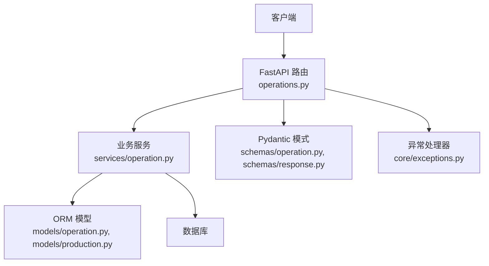
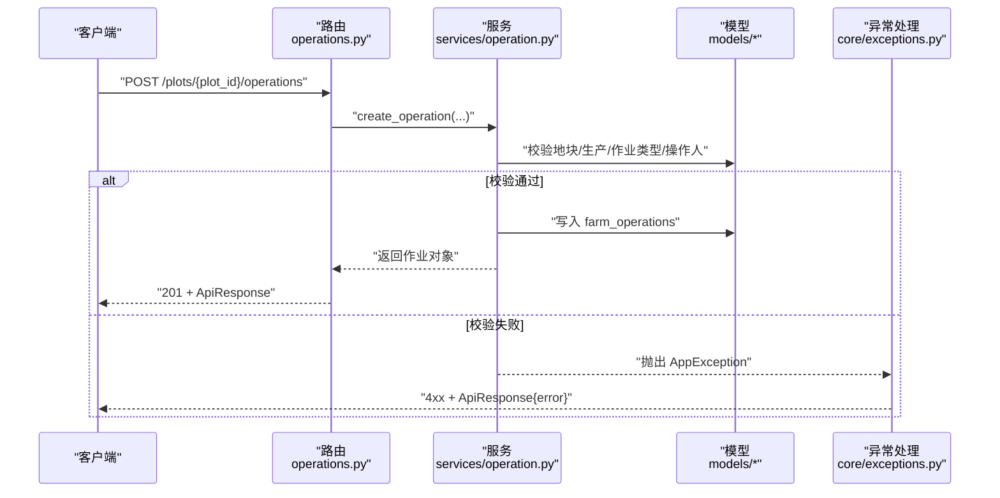
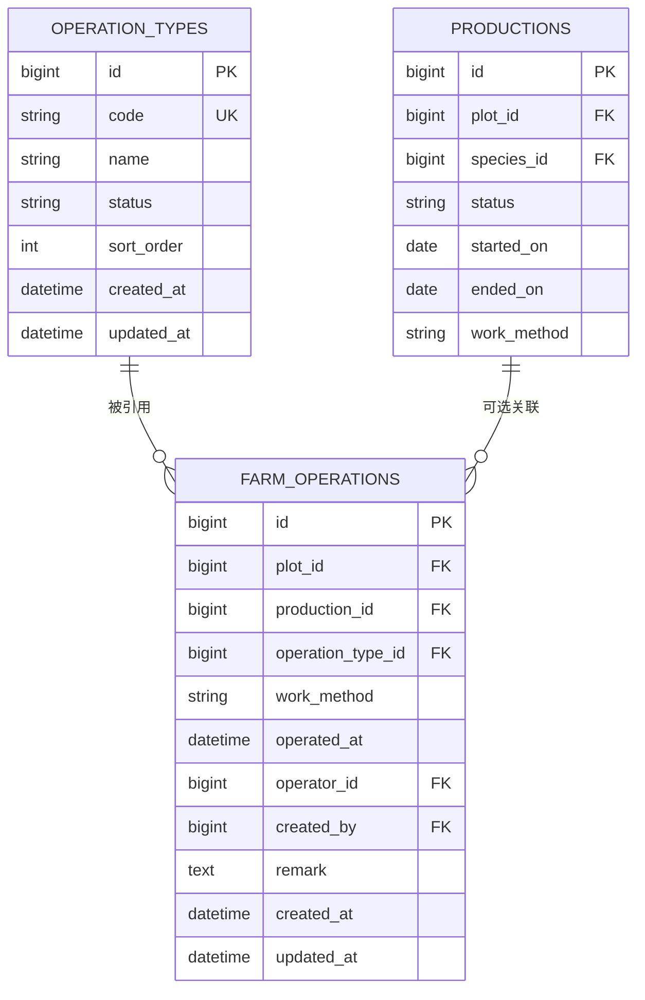
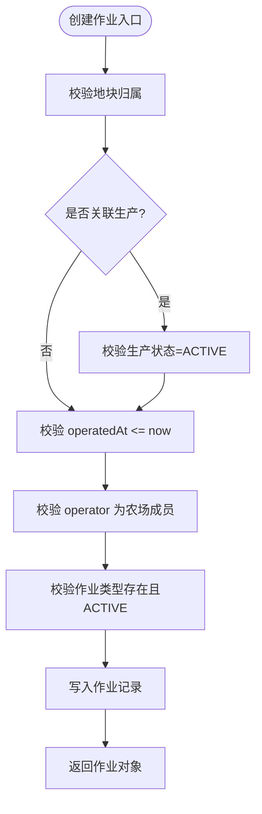
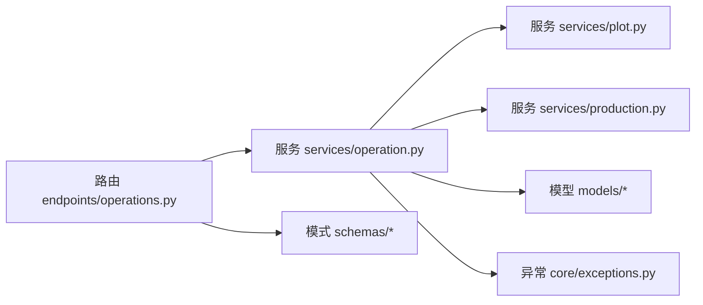

# 作业记录接口

<cite>
**本文引用的文件**
- [operations.py](file://apps/api/app/api/v1/endpoints/operations.py)
- [operation.py](file://apps/api/app/models/operation.py)
- [operation.py](file://apps/api/app/schemas/operation.py)
- [operation.py](file://apps/api/app/services/operation.py)
- [production.py](file://apps/api/app/models/production.py)
- [response.py](file://apps/api/app/schemas/response.py)
- [error_codes.py](file://apps/api/app/core/error_codes.py)
- [exceptions.py](file://apps/api/app/core/exceptions.py)
- [test_operations.py](file://apps/api/tests/test_operations.py)
</cite>

## 目录
1. [简介](#简介)
2. [项目结构](#项目结构)
3. [核心组件](#核心组件)
4. [架构总览](#架构总览)
5. [详细组件分析](#详细组件分析)
6. [依赖关系分析](#依赖关系分析)
7. [性能与一致性](#性能与一致性)
8. [故障排查指南](#故障排查指南)
9. [结论](#结论)
10. [附录：接口规范与示例](#附录接口规范与示例)

## 简介
本文件为“作业记录”API的完整技术文档，覆盖农事活动记录的创建、查询、更新、删除，以及作业类型管理与作业和生产关联的业务规则。文档包含数据模型、字段定义、请求/响应格式、错误码说明、时序流程与测试用例要点，帮助前后端开发者快速对接并正确实现业务逻辑。

## 项目结构
作业记录功能位于 FastAPI 后端，采用分层设计：
- API 层：路由与参数校验（endpoints）
- 服务层：业务校验与事务操作（services）
- 模型层：数据库表映射（models）
- Schema 层：请求/响应数据结构（schemas）
- 异常与错误码：统一错误处理（core）

图表来源
- [operations.py:63-168](file://apps/api/app/api/v1/endpoints/operations.py#L63-L168)
- [operation.py:139-307](file://apps/api/app/services/operation.py#L139-L307)
- [operation.py:18-79](file://apps/api/app/models/operation.py#L18-L79)
- [production.py:13-32](file://apps/api/app/models/production.py#L13-L32)
- [response.py:16-40](file://apps/api/app/schemas/response.py#L16-L40)
- [exceptions.py:35-88](file://apps/api/app/core/exceptions.py#L35-L88)

章节来源
- [operations.py:1-168](file://apps/api/app/api/v1/endpoints/operations.py#L1-L168)
- [operation.py:1-80](file://apps/api/app/models/operation.py#L1-L80)
- [operation.py:1-122](file://apps/api/app/schemas/operation.py#L1-L122)
- [operation.py:1-307](file://apps/api/app/services/operation.py#L1-L307)
- [production.py:1-79](file://apps/api/app/models/production.py#L1-L79)
- [response.py:1-40](file://apps/api/app/schemas/response.py#L1-L40)
- [error_codes.py:1-13](file://apps/api/app/core/error_codes.py#L1-L13)
- [exceptions.py:1-88](file://apps/api/app/core/exceptions.py#L1-L88)

## 核心组件
- 作业类型管理：提供作业类型的分页查询，仅暴露启用状态的作业类型；创建/编辑作业时拒绝禁用类型。
- 作业记录CRUD：支持按地块查询作业列表、创建作业、修改作业、删除作业。
- 作业与生产关联：作业可关联到生产批次；若关联生产，需满足时间约束且生产必须处于活跃状态。
- 权限与归属校验：作业所属地块需属于当前用户所在农场；操作人必须是该农场成员。

章节来源
- [operations.py:148-168](file://apps/api/app/api/v1/endpoints/operations.py#L148-L168)
- [operation.py:99-115](file://apps/api/app/services/operation.py#L99-L115)
- [operation.py:139-181](file://apps/api/app/services/operation.py#L139-L181)
- [operation.py:222-289](file://apps/api/app/services/operation.py#L222-L289)
- [operation.py:292-307](file://apps/api/app/services/operation.py#L292-L307)

## 架构总览
下图展示了从请求到响应的调用链路与关键校验点。

图表来源
- [operations.py:91-113](file://apps/api/app/api/v1/endpoints/operations.py#L91-L113)
- [operation.py:139-181](file://apps/api/app/services/operation.py#L139-L181)
- [exceptions.py:35-44](file://apps/api/app/core/exceptions.py#L35-L44)

## 详细组件分析

### 数据模型与标准化字段
- 作业类型 OperationType
  - 字段：id、code（唯一）、name、status（ACTIVE/DISABLED）、sort_order、created_at、updated_at
  - 用途：标准化农事作业分类，便于前端下拉选择与统计聚合
- 作业 FarmOperation
  - 字段：id、plot_id、production_id（可选）、operation_type_id、work_method（MANUAL/MECHANICAL）、operated_at、operator_id、created_by、remark、created_at、updated_at
  - 关联：地块、生产批次、作业类型、操作人、创建人
- 生产 Production（与作业关联）
  - 关键字段：id、plot_id、species_id、status（ACTIVE/ENDED）、started_on、ended_on、work_method 等
  - 约束：作业时间与生产开始时间、当前时间的关系校验；已结束的生产不可变更关联作业

图表来源
- [operation.py:18-79](file://apps/api/app/models/operation.py#L18-L79)
- [production.py:43-79](file://apps/api/app/models/production.py#L43-L79)

章节来源
- [operation.py:18-79](file://apps/api/app/models/operation.py#L18-L79)
- [production.py:13-32](file://apps/api/app/models/production.py#L13-L32)
- [production.py:43-79](file://apps/api/app/models/production.py#L43-L79)

### 作业类型管理接口
- 获取作业类型列表
  - 路径：GET /api/v1/operation-types
  - 分页：page、pageSize（默认100）
  - 行为：仅返回 ACTIVE 的作业类型，按 sort_order 升序、id 升序排序
  - 响应：ApiResponse[OperationTypePage]

章节来源
- [operations.py:148-168](file://apps/api/app/api/v1/endpoints/operations.py#L148-L168)
- [operation.py:99-115](file://apps/api/app/services/operation.py#L99-L115)

### 作业记录接口

#### 按地块查询作业列表
- 路径：GET /api/v1/plots/{plot_id}/operations
- 参数：page、pageSize（默认20）
- 行为：
  - 校验当前用户对地块的访问权限
  - 返回该地块下的作业列表，按 operated_at 降序、id 降序
  - 每个作业项附带作业类型信息
- 响应：ApiResponse[OperationPage]

章节来源
- [operations.py:63-88](file://apps/api/app/api/v1/endpoints/operations.py#L63-L88)
- [operation.py:117-136](file://apps/api/app/services/operation.py#L117-L136)

#### 创建作业
- 路径：POST /api/v1/plots/{plot_id}/operations
- 请求体字段（支持驼峰或下划线）：
  - operationTypeId：必填，作业类型ID
  - productionId：可选，关联的生产ID
  - workMethod：可选，默认 MANUAL
  - operatedAt：可选，带时区的时间；未传则使用当前时间
  - operatorId：可选，默认当前登录用户；必须属于该地块所属农场
  - remark：可选，最长1000字符
- 业务校验：
  - 地块归属校验
  - 若指定 productionId，必须属于该地块且生产状态为 ACTIVE
  - operatedAt 不能晚于当前时间；若关联生产，不得早于生产 startedOn
  - operatorId 必须为农场成员
  - 作业类型必须存在且为 ACTIVE
- 响应：ApiResponse[OperationResponse]，HTTP 201

图表来源
- [operation.py:139-181](file://apps/api/app/services/operation.py#L139-L181)

章节来源
- [operations.py:91-113](file://apps/api/app/api/v1/endpoints/operations.py#L91-L113)
- [operation.py:139-181](file://apps/api/app/services/operation.py#L139-L181)

#### 更新作业
- 路径：PATCH /api/v1/operations/{operation_id}
- 请求体字段（可选，仅提交需要更新的字段）：
  - productionId、operationTypeId、workMethod、operatedAt、operatorId、remark
- 业务校验：
  - 权限：仅允许该作业所属地块的用户操作
  - 若关联生产，生产必须为 ACTIVE，否则禁止修改/删除
  - 若更新 productionId 或 operatedAt，需重新校验时间约束
  - operatorId 必须为农场成员
  - 作业类型更新时需确保目标类型为 ACTIVE（除非与当前相同）
- 响应：ApiResponse[OperationResponse]

章节来源
- [operations.py:116-135](file://apps/api/app/api/v1/endpoints/operations.py#L116-L135)
- [operation.py:222-289](file://apps/api/app/services/operation.py#L222-L289)

#### 删除作业
- 路径：DELETE /api/v1/operations/{operation_id}
- 行为：
  - 权限校验：仅允许该作业所属地块的用户操作
  - 若关联生产且生产已结束，禁止删除
- 响应：HTTP 204 No Content

章节来源
- [operations.py:138-145](file://apps/api/app/api/v1/endpoints/operations.py#L138-L145)
- [operation.py:292-307](file://apps/api/app/services/operation.py#L292-L307)

### 作业与生产关联规则
- 作业可关联生产，也可不关联（独立农事记录）
- 若关联生产：
  - 生产必须属于同一地块
  - 生产状态必须为 ACTIVE
  - operatedAt 不得早于生产 startedOn
  - 生产结束后，禁止新增/修改/删除与该生产关联的作业
- 这些规则在服务层集中实现，保证数据一致性与业务安全

章节来源
- [operation.py:61-80](file://apps/api/app/services/operation.py#L61-L80)
- [operation.py:207-219](file://apps/api/app/services/operation.py#L207-L219)
- [test_operations.py:213-262](file://apps/api/tests/test_operations.py#L213-L262)
- [test_operations.py:322-378](file://apps/api/tests/test_operations.py#L322-L378)

## 依赖关系分析
- 路由依赖：
  - 认证与用户上下文：get_current_user
  - 数据库会话：get_db_session
- 服务依赖：
  - 地块权限：get_plot_with_member
  - 生产权限：get_production_with_member
  - 作业类型与状态：OperationType、OperationTypeStatus
  - 生产状态与工作方法：Production、WorkMethod
- 异常与错误：
  - 统一异常 AppException 与 ErrorCode
  - 全局异常处理器将业务异常转换为 ApiResponse

图表来源
- [operations.py:1-28](file://apps/api/app/api/v1/endpoints/operations.py#L1-L28)
- [operation.py:1-15](file://apps/api/app/services/operation.py#L1-L15)
- [exceptions.py:35-88](file://apps/api/app/core/exceptions.py#L35-L88)

章节来源
- [operations.py:1-28](file://apps/api/app/api/v1/endpoints/operations.py#L1-L28)
- [operation.py:1-15](file://apps/api/app/services/operation.py#L1-L15)
- [exceptions.py:35-88](file://apps/api/app/core/exceptions.py#L35-L88)

## 性能与一致性
- 分页查询：服务端使用 offset/limit 进行分页，建议 pageSize 控制在合理范围（默认20/100）
- 排序策略：作业列表按 operated_at 降序、id 降序，利于展示最新记录
- 并发与锁：
  - 更新/删除时使用行级锁（with_for_update）避免竞态条件
  - 生产状态检查在更新前加锁，防止并发修改导致不一致
- 索引优化：
  - plot_id、production_id、operation_type_id、operator_id 均建立索引，提升查询效率
- 时间处理：
  - 输入时间带时区，内部转为 naive UTC 存储，避免时区问题

章节来源
- [operation.py:117-136](file://apps/api/app/services/operation.py#L117-L136)
- [operation.py:184-204](file://apps/api/app/services/operation.py#L184-L204)
- [operation.py:222-289](file://apps/api/app/services/operation.py#L222-L289)
- [operation.py:40-66](file://apps/api/app/models/operation.py#L40-L66)

## 故障排查指南
- 常见错误码与含义
  - VALIDATION_ERROR：请求参数校验失败（如时间不带时区、数值越界）
  - NOT_FOUND：资源不存在（如作业、生产、地块无权限）
  - BUSINESS_CONFLICT：业务冲突（如作业类型禁用、生产已结束）
  - UNAUTHORIZED/FORBIDDEN：鉴权失败或无权限
  - HTTP_ERROR：HTTP 层异常
  - INTERNAL_SERVER_ERROR：服务器内部错误
- 典型问题定位
  - 时间校验失败：确认 operatedAt 带时区且不晚于当前时间；若关联生产，不早于 startedOn
  - 操作人非法：确认 operatorId 属于地块所属农场
  - 生产已结束：无法新增/修改/删除关联作业
  - 作业类型禁用：无法使用该类型创建作业，且列表不会返回禁用类型
- 调试建议
  - 查看 ApiResponse.error 中的 code、message、details
  - 结合测试用例验证边界场景（时间、权限、状态）

章节来源
- [error_codes.py:4-13](file://apps/api/app/core/error_codes.py#L4-L13)
- [exceptions.py:35-88](file://apps/api/app/core/exceptions.py#L35-L88)
- [test_operations.py:151-173](file://apps/api/tests/test_operations.py#L151-L173)
- [test_operations.py:213-262](file://apps/api/tests/test_operations.py#L213-L262)
- [test_operations.py:264-320](file://apps/api/tests/test_operations.py#L264-L320)
- [test_operations.py:322-378](file://apps/api/tests/test_operations.py#L322-L378)

## 结论
作业记录API围绕“地块-生产-作业-作业类型”的核心关系构建，提供了完整的CRUD能力与严格的业务校验。通过统一的响应封装与异常处理，保证了接口的稳定性与可维护性。建议在集成时严格遵循字段命名与时区要求，并在前端做好权限与状态提示。

## 附录：接口规范与示例

### 通用响应格式
- 成功：
  - HTTP 2xx
  - 响应体：ApiResponse{success: true, data: ...}
- 失败：
  - HTTP 4xx/5xx
  - 响应体：ApiResponse{success: false, error: {code, message, details}}

章节来源
- [response.py:16-40](file://apps/api/app/schemas/response.py#L16-L40)

### 作业类型管理
- GET /api/v1/operation-types
- 查询参数：page、pageSize
- 响应：ApiResponse[OperationTypePage]
- 注意：仅返回 ACTIVE 类型，按 sort_order 升序

章节来源
- [operations.py:148-168](file://apps/api/app/api/v1/endpoints/operations.py#L148-L168)
- [operation.py:99-115](file://apps/api/app/services/operation.py#L99-L115)

### 作业记录
- 列表：GET /api/v1/plots/{plot_id}/operations
  - 参数：page、pageSize
  - 响应：ApiResponse[OperationPage]
- 创建：POST /api/v1/plots/{plot_id}/operations
  - 请求体字段：operationTypeId、productionId、workMethod、operatedAt、operatorId、remark
  - 响应：ApiResponse[OperationResponse]，HTTP 201
- 更新：PATCH /api/v1/operations/{operation_id}
  - 请求体字段：productionId、operationTypeId、workMethod、operatedAt、operatorId、remark
  - 响应：ApiResponse[OperationResponse]
- 删除：DELETE /api/v1/operations/{operation_id}
  - 响应：HTTP 204

章节来源
- [operations.py:63-145](file://apps/api/app/api/v1/endpoints/operations.py#L63-L145)
- [operation.py:139-307](file://apps/api/app/services/operation.py#L139-L307)

### 数据模型与字段说明
- 作业类型 OperationTypeResponse
  - id、code、name、status、sortOrder、createdAt、updatedAt
- 作业 OperationResponse
  - id、plotId、productionId、operationType、workMethod、operatedAt、operatorId、createdBy、remark、createdAt、updatedAt
- 分页 OperationPage / OperationTypePage
  - items、page、pageSize、total

章节来源
- [operation.py:86-122](file://apps/api/app/schemas/operation.py#L86-L122)

### 请求与响应示例（基于测试用例的行为）
- 创建作业（关联生产，机械作业）
  - 请求：POST /api/v1/plots/{plot_id}/operations
  - 请求体：{ "operationTypeId": "...", "productionId": "...", "workMethod": "MECHANICAL", "operatedAt": "带时区的时间" }
  - 响应：201 + ApiResponse[OperationResponse]
- 创建作业（不关联生产，默认手动）
  - 请求体：{ "operationTypeId": "...", "productionId": null }
  - 响应：201 + ApiResponse[OperationResponse]
- 列表查询
  - 请求：GET /api/v1/plots/{plot_id}/operations?page=1&pageSize=20
  - 响应：200 + ApiResponse[OperationPage]
- 删除作业
  - 请求：DELETE /api/v1/operations/{operation_id}
  - 响应：204

章节来源
- [test_operations.py:175-211](file://apps/api/tests/test_operations.py#L175-L211)
- [test_operations.py:213-262](file://apps/api/tests/test_operations.py#L213-L262)

### 业务规则摘要
- 作业类型：仅 ACTIVE 可用；禁用类型不在列表中，且创建时会被拒绝
- 作业时间：不得晚于当前时间；若关联生产，不得早于生产 startedOn
- 生产状态：已结束的生产不允许新增/修改/删除关联作业
- 操作人：必须为地块所属农场成员
- 权限：仅地块所属用户可操作其作业

章节来源
- [test_operations.py:151-173](file://apps/api/tests/test_operations.py#L151-L173)
- [test_operations.py:213-262](file://apps/api/tests/test_operations.py#L213-L262)
- [test_operations.py:264-320](file://apps/api/tests/test_operations.py#L264-L320)
- [test_operations.py:322-378](file://apps/api/tests/test_operations.py#L322-L378)