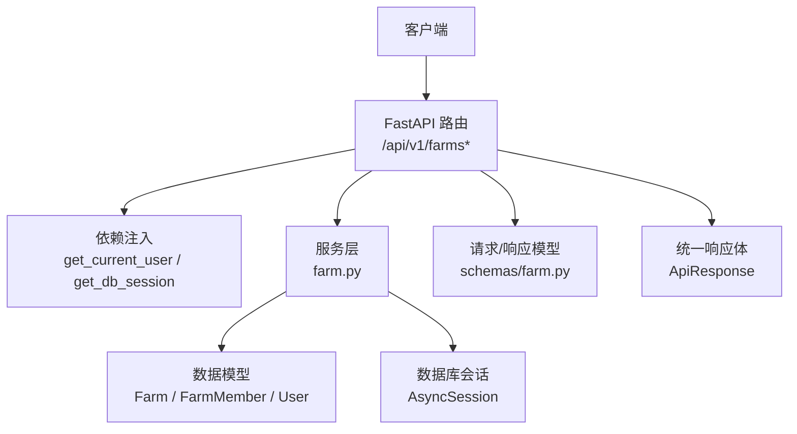
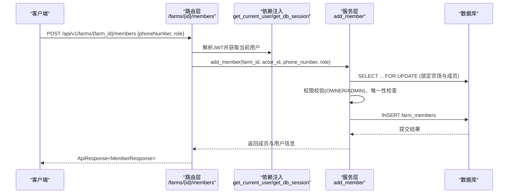
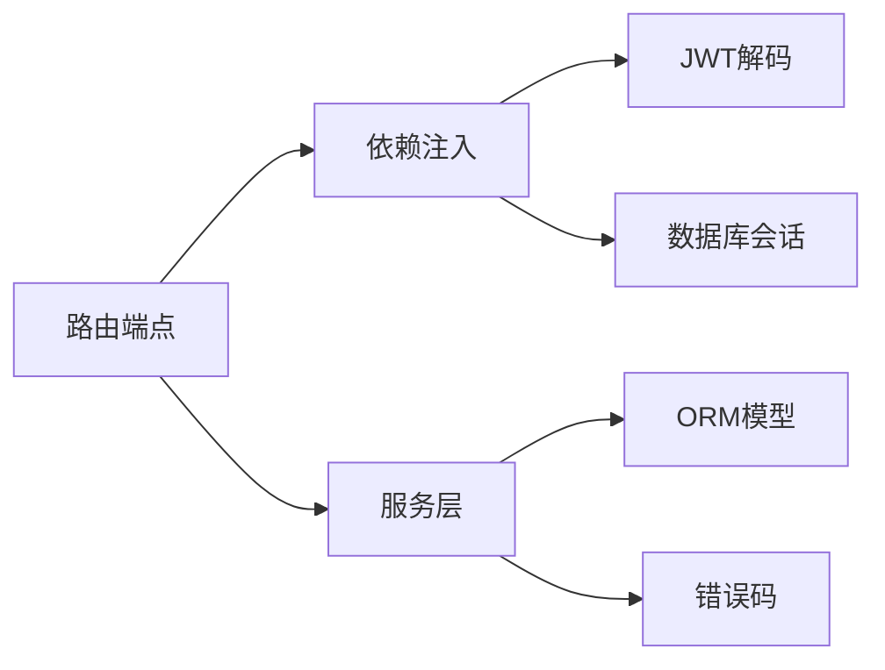
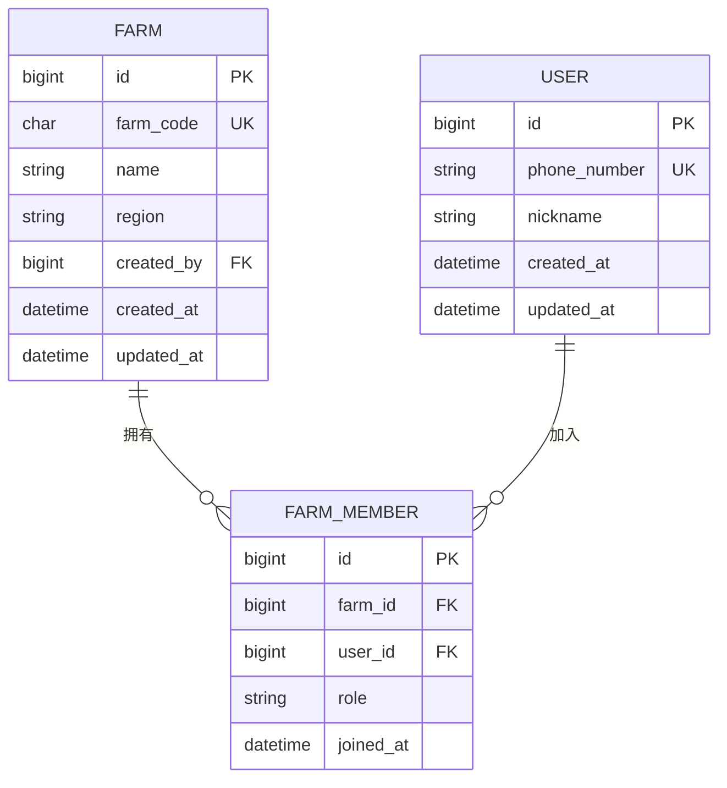

# 农场管理接口

<cite>
**本文引用的文件**
- [apps/api/app/api/v1/endpoints/farms.py](file://apps/api/app/api/v1/endpoints/farms.py)
- [apps/api/app/services/farm.py](file://apps/api/app/services/farm.py)
- [apps/api/app/schemas/farm.py](file://apps/api/app/schemas/farm.py)
- [apps/api/app/models/farm.py](file://apps/api/app/models/farm.py)
- [apps/api/app/models/user.py](file://apps/api/app/models/user.py)
- [apps/api/app/api/deps.py](file://apps/api/app/api/deps.py)
- [apps/api/app/core/security.py](file://apps/api/app/core/security.py)
- [apps/api/app/core/error_codes.py](file://apps/api/app/core/error_codes.py)
- [apps/api/app/schemas/response.py](file://apps/api/app/schemas/response.py)
- [apps/api/tests/test_farms.py](file://apps/api/tests/test_farms.py)
</cite>

## 目录
1. [简介](#简介)
2. [项目结构](#项目结构)
3. [核心组件](#核心组件)
4. [架构总览](#架构总览)
5. [详细接口规范](#详细接口规范)
6. [依赖关系分析](#依赖关系分析)
7. [性能与并发特性](#性能与并发特性)
8. [故障排查指南](#故障排查指南)
9. [结论](#结论)
10. [附录：数据模型与多租户隔离](#附录：数据模型与多租户隔离)

## 简介
本文件为“农场管理”API的完整接口文档，覆盖农场的创建、查询、编辑、删除（通过成员退出实现），以及成员的邀请、角色变更、移除和退出等能力。文档同时说明权限控制机制、请求/响应格式、错误码与异常处理，并给出基于测试用例的请求与响应示例路径。系统采用JWT鉴权与基于角色的访问控制（RBAC），并通过数据库事务与行级锁保证并发安全。

## 项目结构
后端采用分层架构：
- 路由层：FastAPI 端点定义与参数校验
- 服务层：业务逻辑、权限校验、事务与并发控制
- 模型层：ORM 实体定义（农场、成员、用户）
- 模式层：Pydantic 请求/响应模型
- 安全与配置：JWT 签发与解码、统一错误码、通用响应体

图表来源
- [apps/api/app/api/v1/endpoints/farms.py:32-200](file://apps/api/app/api/v1/endpoints/farms.py#L32-L200)
- [apps/api/app/services/farm.py:33-264](file://apps/api/app/services/farm.py#L33-L264)
- [apps/api/app/models/farm.py:18-59](file://apps/api/app/models/farm.py#L18-L59)
- [apps/api/app/schemas/farm.py:14-73](file://apps/api/app/schemas/farm.py#L14-L73)
- [apps/api/app/schemas/response.py:16-40](file://apps/api/app/schemas/response.py#L16-L40)

章节来源
- [apps/api/app/api/v1/endpoints/farms.py:32-200](file://apps/api/app/api/v1/endpoints/farms.py#L32-L200)
- [apps/api/app/services/farm.py:33-264](file://apps/api/app/services/farm.py#L33-L264)
- [apps/api/app/models/farm.py:18-59](file://apps/api/app/models/farm.py#L18-L59)
- [apps/api/app/schemas/farm.py:14-73](file://apps/api/app/schemas/farm.py#L14-L73)
- [apps/api/app/schemas/response.py:16-40](file://apps/api/app/schemas/response.py#L16-L40)

## 核心组件
- 路由与端点：提供农场与成员相关的所有HTTP接口
- 服务层：封装业务规则（如最小Owner数、角色权限、唯一性约束）
- 模型层：农场、成员、用户实体及角色枚举
- 安全与鉴权：JWT令牌解析与当前用户获取
- 统一响应：成功/失败包装体

章节来源
- [apps/api/app/api/v1/endpoints/farms.py:32-200](file://apps/api/app/api/v1/endpoints/farms.py#L32-L200)
- [apps/api/app/services/farm.py:33-264](file://apps/api/app/services/farm.py#L33-L264)
- [apps/api/app/models/farm.py:12-59](file://apps/api/app/models/farm.py#L12-L59)
- [apps/api/app/api/deps.py:19-66](file://apps/api/app/api/deps.py#L19-L66)
- [apps/api/app/core/security.py:8-28](file://apps/api/app/core/security.py#L8-L28)
- [apps/api/app/schemas/response.py:16-40](file://apps/api/app/schemas/response.py#L16-L40)

## 架构总览
下图展示一次“邀请成员”的调用链：客户端携带JWT调用路由，路由依赖注入当前用户与数据库会话，服务层进行权限校验、并发锁与持久化，最终返回统一响应。

图表来源
- [apps/api/app/api/v1/endpoints/farms.py:142-160](file://apps/api/app/api/v1/endpoints/farms.py#L142-L160)
- [apps/api/app/services/farm.py:181-207](file://apps/api/app/services/farm.py#L181-L207)
- [apps/api/app/api/deps.py:29-66](file://apps/api/app/api/deps.py#L29-L66)

## 详细接口规范

### 认证与安全
- 所有接口需携带 HTTP Bearer Token（JWT）
- 未认证或无效Token将返回未授权错误
- 使用当前用户ID作为上下文，用于资源归属与权限判断

章节来源
- [apps/api/app/api/deps.py:29-66](file://apps/api/app/api/deps.py#L29-L66)
- [apps/api/app/core/security.py:8-28](file://apps/api/app/core/security.py#L8-L28)

### 农场列表
- 方法：GET
- 路径：/api/v1/farms
- 查询参数：page（页码，默认1）、pageSize（每页条数，默认20，最大100）
- 功能：列出当前用户加入的所有农场，并附带当前用户在每个农场中的角色
- 成功响应：包含分页信息与农场列表，每项包含农场基本信息与 myRole
- 失败响应：统一错误体

章节来源
- [apps/api/app/api/v1/endpoints/farms.py:58-75](file://apps/api/app/api/v1/endpoints/farms.py#L58-L75)
- [apps/api/app/services/farm.py:115-134](file://apps/api/app/services/farm.py#L115-L134)
- [apps/api/app/schemas/farm.py:24-42](file://apps/api/app/schemas/farm.py#L24-L42)

### 创建农场
- 方法：POST
- 路径：/api/v1/farms
- 请求体：name（必填，长度限制）、region（可选）
- 行为：创建农场并自动授予创建者 OWNER 角色；生成唯一农场编码
- 成功响应：返回农场详情与 myRole=OWNER
- 失败响应：若编码冲突重试后仍失败，返回业务冲突错误

章节来源
- [apps/api/app/api/v1/endpoints/farms.py:78-91](file://apps/api/app/api/v1/endpoints/farms.py#L78-L91)
- [apps/api/app/services/farm.py:33-53](file://apps/api/app/services/farm.py#L33-L53)
- [apps/api/app/schemas/farm.py:14-22](file://apps/api/app/schemas/farm.py#L14-L22)

### 获取农场详情
- 方法：GET
- 路径：/api/v1/farms/{farm_id}
- 权限：必须是该农场成员（非成员视为不存在）
- 成功响应：农场详情与 myRole
- 失败响应：非成员返回未找到

章节来源
- [apps/api/app/api/v1/endpoints/farms.py:93-100](file://apps/api/app/api/v1/endpoints/farms.py#L93-L100)
- [apps/api/app/services/farm.py:56-70](file://apps/api/app/services/farm.py#L56-L70)

### 编辑农场
- 方法：PATCH
- 路径：/api/v1/farms/{farm_id}
- 权限：仅 OWNER 可编辑
- 请求体：name（可选）、region（可选），仅更新提供的字段
- 成功响应：更新后的农场详情与 myRole
- 失败响应：非OWNER返回禁止访问

章节来源
- [apps/api/app/api/v1/endpoints/farms.py:103-118](file://apps/api/app/api/v1/endpoints/farms.py#L103-L118)
- [apps/api/app/services/farm.py:137-155](file://apps/api/app/services/farm.py#L137-L155)

### 农场成员列表
- 方法：GET
- 路径：/api/v1/farms/{farm_id}/members
- 查询参数：page、pageSize
- 权限：必须是该农场成员
- 成功响应：成员分页列表，包含用户昵称与角色
- 失败响应：非成员返回未找到

章节来源
- [apps/api/app/api/v1/endpoints/farms.py:121-139](file://apps/api/app/api/v1/endpoints/farms.py#L121-L139)
- [apps/api/app/services/farm.py:158-178](file://apps/api/app/services/farm.py#L158-L178)
- [apps/api/app/schemas/farm.py:58-73](file://apps/api/app/schemas/farm.py#L58-L73)

### 邀请成员
- 方法：POST
- 路径：/api/v1/farms/{farm_id}/members
- 请求体：phoneNumber（必填，手机号格式校验）、role（可选，默认MEMBER）
- 权限：仅 OWNER 或 ADMIN 可邀请；ADMIN 不可创建 OWNER
- 行为：查找注册用户并加入农场；重复成员返回冲突
- 成功响应：新增成员信息
- 失败响应：未注册用户返回未找到；重复成员返回业务冲突

章节来源
- [apps/api/app/api/v1/endpoints/farms.py:142-160](file://apps/api/app/api/v1/endpoints/farms.py#L142-L160)
- [apps/api/app/services/farm.py:181-207](file://apps/api/app/services/farm.py#L181-L207)
- [apps/api/app/schemas/farm.py:44-52](file://apps/api/app/schemas/farm.py#L44-L52)

### 修改成员角色
- 方法：PATCH
- 路径：/api/v1/farms/{farm_id}/members/{member_id}
- 请求体：role（必填）
- 权限：仅 OWNER 或 ADMIN 可操作；ADMIN 不可对 OWNER 进行操作或将其设为 OWNER；不能对自己操作（请使用退出接口）
- 行为：确保至少保留一个 OWNER；更新成功后返回成员与用户信息
- 失败响应：目标不存在返回未找到；越权返回禁止访问；违反最少Owner规则返回业务冲突

章节来源
- [apps/api/app/api/v1/endpoints/farms.py:163-178](file://apps/api/app/api/v1/endpoints/farms.py#L163-L178)
- [apps/api/app/services/farm.py:210-231](file://apps/api/app/services/farm.py#L210-L231)

### 退出农场
- 方法：DELETE
- 路径：/api/v1/farms/{farm_id}/members/me
- 权限：本人可退出
- 行为：若当前是最后一个 OWNER，则不允许退出
- 成功响应：204 无内容
- 失败响应：最后一个 OWNER 退出返回业务冲突

章节来源
- [apps/api/app/api/v1/endpoints/farms.py:181-188](file://apps/api/app/api/v1/endpoints/farms.py#L181-L188)
- [apps/api/app/services/farm.py:255-263](file://apps/api/app/services/farm.py#L255-L263)

### 移除成员
- 方法：DELETE
- 路径：/api/v1/farms/{farm_id}/members/{member_id}
- 权限：仅 OWNER 或 ADMIN 可移除他人；不能移除自己（请使用退出接口）；不能移除最后一个 OWNER
- 成功响应：204 无内容
- 失败响应：目标不存在返回未找到；越权返回禁止访问；违反最少Owner规则返回业务冲突

章节来源
- [apps/api/app/api/v1/endpoints/farms.py:191-199](file://apps/api/app/api/v1/endpoints/farms.py#L191-L199)
- [apps/api/app/services/farm.py:234-252](file://apps/api/app/services/farm.py#L234-L252)

### 请求与响应示例（来自测试）
- 登录获取Token：参考测试中登录流程与Token获取方式
- 创建农场：POST /api/v1/farms，请求体包含 name 与 region，成功返回201与农场信息
- 邀请成员：POST /api/v1/farms/{farm_id}/members，请求体包含 phoneNumber 与可选 role
- 成员列表：GET /api/v1/farms/{farm_id}/members，返回分页成员数组
- 修改角色：PATCH /api/v1/farms/{farm_id}/members/{member_id}，请求体包含 role
- 退出农场：DELETE /api/v1/farms/{farm_id}/members/me，成功返回204
- 移除成员：DELETE /api/v1/farms/{farm_id}/members/{member_id}，成功返回204

章节来源
- [apps/api/tests/test_farms.py:31-85](file://apps/api/tests/test_farms.py#L31-L85)
- [apps/api/tests/test_farms.py:87-135](file://apps/api/tests/test_farms.py#L87-L135)
- [apps/api/tests/test_farms.py:154-213](file://apps/api/tests/test_farms.py#L154-L213)
- [apps/api/tests/test_farms.py:224-260](file://apps/api/tests/test_farms.py#L224-L260)
- [apps/api/tests/test_farms.py:263-285](file://apps/api/tests/test_farms.py#L263-L285)

## 依赖关系分析
- 路由依赖：
  - get_current_user：从Authorization头解析JWT，验证并加载User
  - get_db_session：为每次请求提供独立异步数据库会话
- 服务依赖：
  - 使用SQLAlchemy进行查询与写入
  - 使用with_for_update()进行行级锁，避免并发下的竞态条件
- 模型依赖：
  - Farm/FarmMember/User 实体与外键约束
  - 唯一约束防止重复成员
- 安全与配置：
  - JWT算法与密钥由配置提供
  - 统一错误码枚举

图表来源
- [apps/api/app/api/deps.py:19-66](file://apps/api/app/api/deps.py#L19-L66)
- [apps/api/app/core/security.py:8-28](file://apps/api/app/core/security.py#L8-L28)
- [apps/api/app/services/farm.py:73-91](file://apps/api/app/services/farm.py#L73-L91)
- [apps/api/app/models/farm.py:18-59](file://apps/api/app/models/farm.py#L18-L59)
- [apps/api/app/core/error_codes.py:4-13](file://apps/api/app/core/error_codes.py#L4-L13)

章节来源
- [apps/api/app/api/deps.py:19-66](file://apps/api/app/api/deps.py#L19-L66)
- [apps/api/app/core/security.py:8-28](file://apps/api/app/core/security.py#L8-L28)
- [apps/api/app/services/farm.py:73-91](file://apps/api/app/services/farm.py#L73-L91)
- [apps/api/app/models/farm.py:18-59](file://apps/api/app/models/farm.py#L18-L59)
- [apps/api/app/core/error_codes.py:4-13](file://apps/api/app/core/error_codes.py#L4-L13)

## 性能与并发特性
- 分页查询：支持 page/pageSize，减少单次数据量
- 行级锁：在成员管理操作中采用 with_for_update() 锁定农场与成员表，避免并发下出现重复成员或破坏最少Owner约束
- 唯一性重试：创建农场时生成唯一编码，冲突时重试有限次数
- 异步I/O：使用异步会话提升吞吐

章节来源
- [apps/api/app/services/farm.py:73-91](file://apps/api/app/services/farm.py#L73-L91)
- [apps/api/app/services/farm.py:33-53](file://apps/api/app/services/farm.py#L33-L53)
- [apps/api/app/api/v1/endpoints/farms.py:58-75](file://apps/api/app/api/v1/endpoints/farms.py#L58-L75)

## 故障排查指南
- 未授权（UNAUTHORIZED）：检查Authorization头是否携带有效JWT
- 未找到（NOT_FOUND）：确认是否为农场成员；确认目标成员是否存在
- 禁止访问（FORBIDDEN）：检查当前角色是否具备相应权限；注意ADMIN不能操作OWNER
- 业务冲突（BUSINESS_CONFLICT）：重复成员、最后一个OWNER无法退出或被移除、编码冲突等
- 数据库不可用（DATABASE_UNAVAILABLE）：检查数据库连接与会话状态

章节来源
- [apps/api/app/core/error_codes.py:4-13](file://apps/api/app/core/error_codes.py#L4-L13)
- [apps/api/app/api/deps.py:29-66](file://apps/api/app/api/deps.py#L29-L66)
- [apps/api/app/services/farm.py:21-30](file://apps/api/app/services/farm.py#L21-L30)

## 结论
农场管理API提供了完整的CRUD与成员管理能力，结合JWT鉴权与基于角色的访问控制，确保数据安全与协作有序。通过行级锁与唯一性约束，系统在并发场景下保持数据一致性。建议在生产环境严格配置JWT密钥与过期时间，并结合日志与监控快速定位问题。

## 附录：数据模型与多租户隔离

### 数据模型概览
- 农场（Farm）：包含唯一编码、名称、区域、创建者与时间戳
- 成员（FarmMember）：关联农场与用户，记录角色与加入时间
- 用户（User）：手机号、昵称与时间戳

图表来源
- [apps/api/app/models/farm.py:18-59](file://apps/api/app/models/farm.py#L18-L59)
- [apps/api/app/models/user.py:15-28](file://apps/api/app/models/user.py#L15-L28)

### 多租户数据隔离
- 以“农场”为租户边界，所有数据访问均通过成员关系限定
- 查询与更新均需验证当前用户是否为该农场成员
- 使用行级锁与唯一约束保障跨租户与同租户内的数据一致性

章节来源
- [apps/api/app/services/farm.py:56-70](file://apps/api/app/services/farm.py#L56-L70)
- [apps/api/app/services/farm.py:73-91](file://apps/api/app/services/farm.py#L73-L91)
- [apps/api/app/models/farm.py:39-59](file://apps/api/app/models/farm.py#L39-L59)