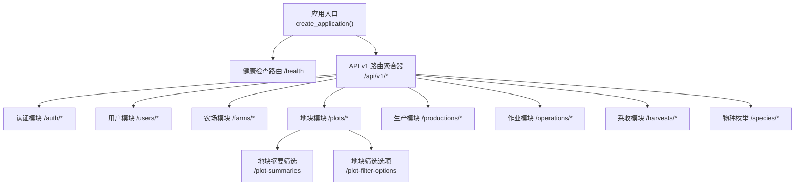
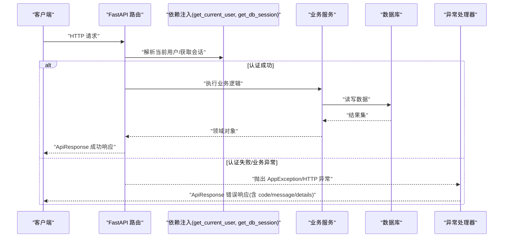
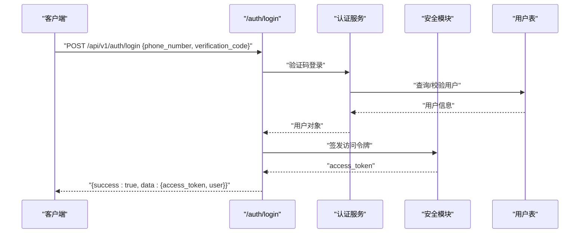
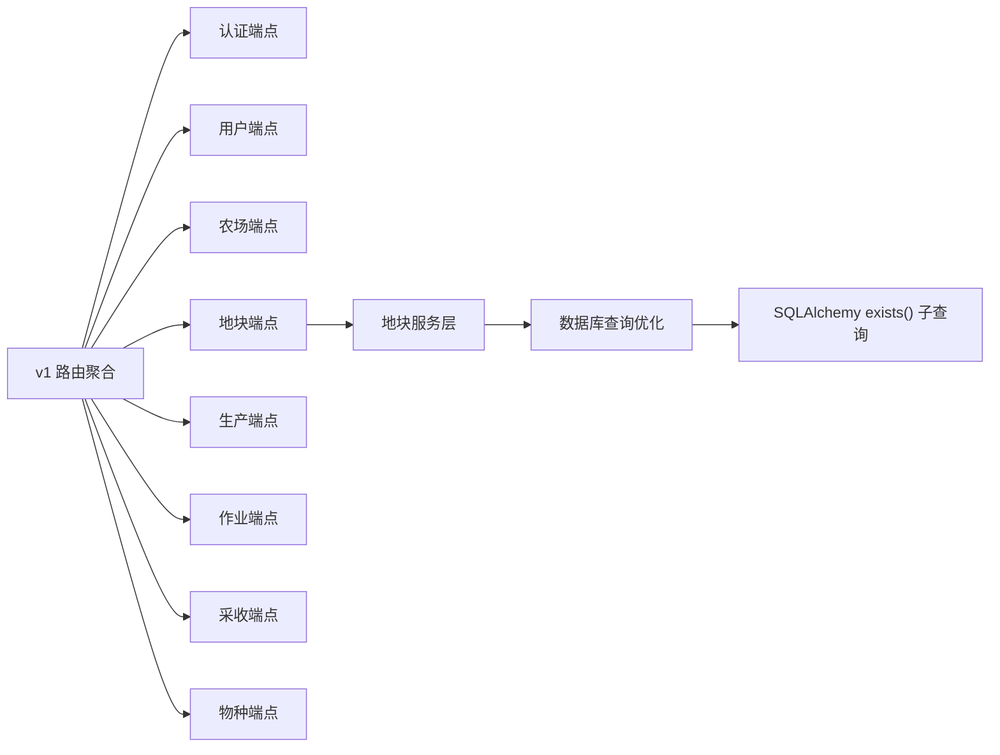

# 后端 API 文档

<cite>
**本文引用的文件**
- [main.py](file://apps/api/app/main.py)
- [router.py](file://apps/api/app/api/v1/router.py)
- [config.py](file://apps/api/app/core/config.py)
- [security.py](file://apps/api/app/core/security.py)
- [error_codes.py](file://apps/api/app/core/error_codes.py)
- [exceptions.py](file://apps/api/app/core/exceptions.py)
- [response.py](file://apps/api/app/schemas/response.py)
- [auth.py](file://apps/api/app/api/v1/endpoints/auth.py)
- [users.py](file://apps/api/app/api/v1/endpoints/users.py)
- [farms.py](file://apps/api/app/api/v1/endpoints/farms.py)
- [plots.py](file://apps/api/app/api/v1/endpoints/plots.py)
- [plot_service.py](file://apps/api/app/services/plot.py)
- [farm_schema.py](file://apps/api/app/schemas/farm.py)
- [operations.py](file://apps/api/app/api/v1/endpoints/operations.py)
- [harvests.py](file://apps/api/app/api/v1/endpoints/harvests.py)
- [productions.py](file://apps/api/app/api/v1/endpoints/productions.py)
- [species.py](file://apps/api/app/api/v1/endpoints/species.py)
</cite>

## 更新摘要
**所做更改**
- 新增地块摘要筛选 API 端点 `/api/v1/farms/{farm_id}/plot-summaries`，支持按空闲状态和物种筛选
- 新增地块筛选选项 API 端点 `/api/v1/farms/{farm_id}/plot-filter-options`，提供可用的筛选条件
- 增强地块管理功能，使用 SQLAlchemy exists() 子查询实现高效的数据库筛选操作
- 添加 PlotSummaryFilter 枚举类型，支持 ALL、IDLE、SPECIES 三种筛选模式
- 完善地块摘要响应结构，包含活跃物种信息和分页支持

## 目录
1. [简介](#简介)
2. [项目结构](#项目结构)
3. [核心组件](#核心组件)
4. [架构总览](#架构总览)
5. [详细组件分析](#详细组件分析)
6. [依赖关系分析](#依赖关系分析)
7. [性能考虑](#性能考虑)
8. [故障排查指南](#故障排查指南)
9. [结论](#结论)
10. [附录：API 端点规范](#附录api-端点规范)

## 简介
本文件为 Pocket Farm 后端 API 的完整技术文档，覆盖 RESTful 设计规范、认证与授权机制、错误处理策略、版本管理以及所有 API 端点的请求/响应规范。读者可据此快速集成前端或第三方系统，并理解权限控制与数据流转。

## 项目结构
后端基于 FastAPI 构建，采用模块化路由组织，统一使用 v1 前缀进行版本化；通过 Pydantic 模型进行请求/响应校验；异常统一捕获并返回标准信封格式。



图表来源
- [main.py:19-24](file://apps/api/app/main.py#L19-L24)
- [router.py:12-20](file://apps/api/app/api/v1/router.py#L12-L20)

章节来源
- [main.py:1-28](file://apps/api/app/main.py#L1-L28)
- [router.py:1-21](file://apps/api/app/api/v1/router.py#L1-L21)

## 核心组件
- 配置中心：集中管理应用名、调试开关、API 版本前缀、数据库连接、JWT 密钥与算法、过期时间、时区及测试登录开关。
- 安全与鉴权：提供访问令牌签发与解析，配合依赖注入实现受保护接口。
- 统一响应信封：所有成功/失败响应均遵循 ApiResponse 结构，便于客户端统一处理。
- 异常处理：自定义业务异常、验证异常、HTTP 异常与未处理异常的标准化 JSON 响应。

章节来源
- [config.py:5-22](file://apps/api/app/core/config.py#L5-L22)
- [security.py:8-28](file://apps/api/app/core/security.py#L8-L28)
- [response.py:10-39](file://apps/api/app/schemas/response.py#L10-L39)
- [exceptions.py:13-87](file://apps/api/app/core/exceptions.py#L13-L87)

## 架构总览
整体调用链：客户端请求 → FastAPI 路由 → 依赖注入（当前用户、数据库会话）→ 服务层 → 数据持久化 → 统一响应封装 → 异常拦截器统一输出。



图表来源
- [main.py:19-24](file://apps/api/app/main.py#L19-L24)
- [exceptions.py:35-87](file://apps/api/app/core/exceptions.py#L35-L87)
- [response.py:16-39](file://apps/api/app/schemas/response.py#L16-L39)

## 详细组件分析

### 认证与授权
- 认证方式：基于 JWT 的无状态令牌。登录成功后返回 access_token，后续请求需在请求头携带该令牌以标识身份。
- 令牌生成与解析：使用 HS256 算法，包含用户标识、签发时间与过期时间；过期时间由配置项决定。
- 权限控制：受保护接口通过依赖注入获取当前用户，服务端在业务层依据农场成员角色等上下文进行细粒度权限校验。



图表来源
- [auth.py:13-28](file://apps/api/app/api/v1/endpoints/auth.py#L13-L28)
- [security.py:8-28](file://apps/api/app/core/security.py#L8-L28)

章节来源
- [auth.py:1-29](file://apps/api/app/api/v1/endpoints/auth.py#L1-L29)
- [security.py:1-29](file://apps/api/app/core/security.py#L1-L29)
- [config.py:10-18](file://apps/api/app/core/config.py#L10-L18)

### 用户相关接口
- 获取当前用户信息：GET /api/v1/users/me
- 更新当前用户昵称：PATCH /api/v1/users/me

章节来源
- [users.py:15-29](file://apps/api/app/api/v1/endpoints/users.py#L15-L29)

### 农场相关接口
- 列出我的农场：GET /api/v1/farms?page=...&pageSize=...
- 创建农场：POST /api/v1/farms
- 查看农场详情：GET /api/v1/farms/{farm_id}
- 编辑农场：PATCH /api/v1/farms/{farm_id}
- 列出农场成员：GET /api/v1/farms/{farm_id}/members?page=...&pageSize=...
- 添加成员：POST /api/v1/farms/{farm_id}/members
- 修改成员角色：PATCH /api/v1/farms/{farm_id}/members/{member_id}
- 退出农场：DELETE /api/v1/farms/{farm_id}/members/me
- 移除成员：DELETE /api/v1/farms/{farm_id}/members/{member_id}

章节来源
- [farms.py:58-199](file://apps/api/app/api/v1/endpoints/farms.py#L58-L199)

### 地块相关接口

**已更新** 新增地块摘要筛选和筛选选项功能，提供更强大的地块管理能力

#### 基础地块操作
- 列出农场地块：GET /api/v1/plots/farms/{farm_id}/plots?page=...&pageSize=...
- 创建地块：POST /api/v1/plots/farms/{farm_id}/plots
- 查看地块：GET /api/v1/plots/{plot_id}
- 查看地块详情（含生产、作业、采收汇总）：GET /api/v1/plots/{plot_id}/detail
- 编辑地块：PATCH /api/v1/plots/{plot_id}

#### 新增：地块摘要筛选
- **列出地块摘要**：GET /api/v1/farms/{farm_id}/plot-summaries
  - 支持筛选参数：
    - `filter`: 筛选类型（ALL | IDLE | SPECIES），默认为 ALL
    - `speciesId`: 当 filter 为 SPECIES 时的必需参数，指定物种 ID
  - 响应包含每个地块的活跃物种列表
  - 支持分页：page、pageSize

#### 新增：地块筛选选项
- **获取筛选选项**：GET /api/v1/farms/{farm_id}/plot-filter-options
  - 返回可用的筛选条件：
    - `activeSpecies`: 当前农场中活跃的物种列表
    - `idlePlotCount`: 空闲地块数量统计

**技术实现亮点**：
- 使用 SQLAlchemy `exists()` 子查询优化数据库性能
- 支持复杂的多条件组合筛选
- 自动验证参数依赖关系（如 SPECIES 筛选必须提供 speciesId）

章节来源
- [plots.py:162-335](file://apps/api/app/api/v1/endpoints/plots.py#L162-L335)
- [plot_service.py:75-211](file://apps/api/app/services/plot.py#L75-L211)
- [farm_schema.py:149-173](file://apps/api/app/schemas/farm.py#L149-L173)

### 生产相关接口
- 列出地块生产：GET /api/v1/productions/plots/{plot_id}/productions?status=...&page=...&pageSize=...
- 开始生产：POST /api/v1/productions/plots/{plot_id}/productions
- 查看生产：GET /api/v1/productions/{production_id}
- 编辑生产：PATCH /api/v1/productions/{production_id}
- 结束生产：POST /api/v1/productions/{production_id}/end
- 删除生产：DELETE /api/v1/productions/{production_id}

章节来源
- [productions.py:71-198](file://apps/api/app/api/v1/endpoints/productions.py#L71-L198)

### 作业相关接口
- 列出地块作业：GET /api/v1/operations/plots/{plot_id}/operations?page=...&pageSize=...
- 创建作业：POST /api/v1/operations/plots/{plot_id}/operations
- 编辑作业：PATCH /api/v1/operations/{operation_id}
- 删除作业：DELETE /api/v1/operations/{operation_id}
- 列出作业类型：GET /api/v1/operations/operation-types?page=...&pageSize=...

章节来源
- [operations.py:63-168](file://apps/api/app/api/v1/endpoints/operations.py#L63-L168)

### 采收相关接口
- 按生产列出采收：GET /api/v1/harvests/productions/{production_id}/harvests?page=...&pageSize=...
- 创建采收：POST /api/v1/harvests/productions/{production_id}/harvests
- 按地块列出采收：GET /api/v1/harvests/plots/{plot_id}/harvests?page=...&pageSize=...
- 编辑采收：PATCH /api/v1/harvests/{harvest_id}
- 删除采收：DELETE /api/v1/harvests/{harvest_id}

章节来源
- [harvests.py:66-163](file://apps/api/app/api/v1/endpoints/harvests.py#L66-L163)

### 物种枚举接口
- 列出物种（支持按行业筛选、关键字搜索、分页）：GET /api/v1/species?industry=...&keyword=...&page=...&pageSize=...

章节来源
- [species.py:26-50](file://apps/api/app/api/v1/endpoints/species.py#L26-L50)

## 依赖关系分析
- 路由聚合：v1 路由聚合器引入各功能模块路由，形成清晰的资源边界。
- 依赖注入：所有受保护接口通过 get_current_user 获取当前用户，通过 get_db_session 获取异步数据库会话。
- 配置依赖：JWT 算法、密钥、过期时间、API 前缀均来自配置中心。
- 异常与响应：所有接口统一使用 ApiResponse 封装；异常统一由异常处理器转换为标准错误体。



图表来源
- [router.py:12-20](file://apps/api/app/api/v1/router.py#L12-L20)
- [security.py:8-28](file://apps/api/app/core/security.py#L8-L28)
- [plot_service.py:109-129](file://apps/api/app/services/plot.py#L109-L129)

章节来源
- [router.py:1-21](file://apps/api/app/api/v1/router.py#L1-L21)
- [security.py:1-29](file://apps/api/app/core/security.py#L1-L29)

## 性能考虑
- 分页参数：列表接口普遍支持 page 与 pageSize，建议合理设置 pageSize 避免过大负载。
- 时区处理：部分时间字段在服务层统一转换为 UTC 再序列化，确保跨时区一致性。
- 数据库会话：使用异步会话提升并发能力，注意在长事务中减少锁竞争。
- 缓存建议：对只读且变化不频繁的枚举数据（如作业类型、物种）可在网关或客户端侧做短期缓存。
- **查询优化**：新增的地块筛选功能使用 SQLAlchemy `exists()` 子查询，避免 N+1 查询问题，显著提升大数据量下的查询性能。

## 故障排查指南
- 统一错误响应结构：
  - success: 布尔值，表示是否成功
  - data: 成功时的数据体
  - error: 失败时的错误体，包含 code、message、details
- 常见错误码：
  - VALIDATION_ERROR：请求参数校验失败
  - UNAUTHORIZED：未认证或令牌无效
  - FORBIDDEN：无权限执行操作
  - NOT_FOUND：资源不存在
  - BUSINESS_CONFLICT：业务冲突（如重复创建）
  - DATABASE_UNAVAILABLE：数据库不可用
  - HTTP_ERROR：HTTP 层异常
  - INTERNAL_SERVER_ERROR：服务器内部错误
- 排查步骤：
  1. 确认请求头是否携带有效的 access_token
  2. 检查请求体是否符合对应端点的 Pydantic 模型约束
  3. 关注 error.details 中的具体校验错误或堆栈信息
  4. 核对资源 ID 是否存在且当前用户具备相应权限
  5. **新增**：对于地块筛选接口，检查 filter 参数与 speciesId 参数的依赖关系是否正确

章节来源
- [response.py:10-39](file://apps/api/app/schemas/response.py#L10-L39)
- [error_codes.py:4-12](file://apps/api/app/core/error_codes.py#L4-L12)
- [exceptions.py:35-87](file://apps/api/app/core/exceptions.py#L35-L87)

## 结论
Pocket Farm 后端 API 采用清晰的模块化设计与统一的响应/异常规范，结合 JWT 认证与依赖注入实现安全的权限控制。通过 v1 前缀的版本化管理，便于后续演进与向后兼容。**最新的地块筛选功能通过高效的数据库查询优化，为用户提供更强大的地块管理能力**。建议客户端严格遵循分页、时区与错误处理约定，以获得稳定可靠的集成体验。

## 附录：API 端点规范

### 通用规范
- 基础路径：/api/v1
- 认证方式：Bearer Token（access_token），通过 Authorization 请求头传递
- 请求体：JSON，字段校验由 Pydantic 模型完成
- 响应体：统一 ApiResponse 信封
- 分页参数：page（页码，≥1）、pageSize（每页条数，1–100）
- 时间字段：UTC 时间字符串

### 认证
- POST /api/v1/auth/login
  - 请求体：{ phone_number, verification_code }
  - 成功响应：{ success:true, data:{ access_token, user } }
  - 失败响应：{ success:false, error:{ code, message, details } }

章节来源
- [auth.py:13-28](file://apps/api/app/api/v1/endpoints/auth.py#L13-L28)
- [security.py:8-28](file://apps/api/app/core/security.py#L8-L28)
- [response.py:16-39](file://apps/api/app/schemas/response.py#L16-L39)

### 用户
- GET /api/v1/users/me
  - 成功响应：{ success:true, data:{ user } }
- PATCH /api/v1/users/me
  - 请求体：{ nickname }
  - 成功响应：{ success:true, data:{ user } }

章节来源
- [users.py:15-29](file://apps/api/app/api/v1/endpoints/users.py#L15-L29)

### 农场
- GET /api/v1/farms?page=...&pageSize=...
- POST /api/v1/farms
- GET /api/v1/farms/{farm_id}
- PATCH /api/v1/farms/{farm_id}
- GET /api/v1/farms/{farm_id}/members?page=...&pageSize=...
- POST /api/v1/farms/{farm_id}/members
- PATCH /api/v1/farms/{farm_id}/members/{member_id}
- DELETE /api/v1/farms/{farm_id}/members/me
- DELETE /api/v1/farms/{farm_id}/members/{member_id}

章节来源
- [farms.py:58-199](file://apps/api/app/api/v1/endpoints/farms.py#L58-L199)

### 地块

**已更新** 新增地块摘要筛选和筛选选项功能

#### 基础地块操作
- GET /api/v1/plots/farms/{farm_id}/plots?page=...&pageSize=...
- POST /api/v1/plots/farms/{farm_id}/plots
- GET /api/v1/plots/{plot_id}
- GET /api/v1/plots/{plot_id}/detail
- PATCH /api/v1/plots/{plot_id}

#### 新增：地块摘要筛选
- **GET /api/v1/farms/{farm_id}/plot-summaries**
  - 查询参数：
    - `page`: 页码，默认 1
    - `pageSize`: 每页条数，默认 20，最大 100
    - `filter`: 筛选类型，可选值：ALL（全部）、IDLE（空闲）、SPECIES（按物种），默认 ALL
    - `speciesId`: 当 filter 为 SPECIES 时的必需参数，指定物种 ID
  - 成功响应：
    ```json
    {
      "success": true,
      "data": {
        "items": [
          {
            "id": 1,
            "name": "地块名称",
            "type": "FIELD",
            "activeSpecies": [
              {"id": 1, "name": "黄瓜"},
              {"id": 2, "name": "生菜"}
            ]
          }
        ],
        "page": 1,
        "pageSize": 20,
        "total": 10
      }
    }
    ```
  - 错误响应：当 filter 为 SPECIES 但未提供 speciesId 时返回 422 验证错误

#### 新增：地块筛选选项
- **GET /api/v1/farms/{farm_id}/plot-filter-options**
  - 成功响应：
    ```json
    {
      "success": true,
      "data": {
        "activeSpecies": [
          {"id": 1, "name": "黄瓜"},
          {"id": 2, "name": "生菜"}
        ],
        "idlePlotCount": 5
      }
    }
    ```

章节来源
- [plots.py:162-335](file://apps/api/app/api/v1/endpoints/plots.py#L162-L335)
- [plot_service.py:97-211](file://apps/api/app/services/plot.py#L97-L211)
- [farm_schema.py:149-173](file://apps/api/app/schemas/farm.py#L149-L173)

### 生产
- GET /api/v1/productions/plots/{plot_id}/productions?status=...&page=...&pageSize=...
- POST /api/v1/productions/plots/{plot_id}/productions
- GET /api/v1/productions/{production_id}
- PATCH /api/v1/productions/{production_id}
- POST /api/v1/productions/{production_id}/end
- DELETE /api/v1/productions/{production_id}

章节来源
- [productions.py:71-198](file://apps/api/app/api/v1/endpoints/productions.py#L71-L198)

### 作业
- GET /api/v1/operations/plots/{plot_id}/operations?page=...&pageSize=...
- POST /api/v1/operations/plots/{plot_id}/operations
- PATCH /api/v1/operations/{operation_id}
- DELETE /api/v1/operations/{operation_id}
- GET /api/v1/operations/operation-types?page=...&pageSize=...

章节来源
- [operations.py:63-168](file://apps/api/app/api/v1/endpoints/operations.py#L63-L168)

### 采收
- GET /api/v1/harvests/productions/{production_id}/harvests?page=...&pageSize=...
- POST /api/v1/harvests/productions/{production_id}/harvests
- GET /api/v1/harvests/plots/{plot_id}/harvests?page=...&pageSize=...
- PATCH /api/v1/harvests/{harvest_id}
- DELETE /api/v1/harvests/{harvest_id}

章节来源
- [harvests.py:66-163](file://apps/api/app/api/v1/endpoints/harvests.py#L66-L163)

### 物种
- GET /api/v1/species?industry=...&keyword=...&page=...&pageSize=...

章节来源
- [species.py:26-50](file://apps/api/app/api/v1/endpoints/species.py#L26-L50)

### 版本管理与兼容性
- 版本前缀：/api/v1，新增功能通过新路由或新子版本演进，旧版保持兼容
- 向后兼容原则：
  - 新增可选字段优先于破坏性变更
  - 废弃字段保留一段时间并提供迁移指引
  - 错误码保持稳定，新增错误码需评估影响范围

章节来源
- [main.py:19-24](file://apps/api/app/main.py#L19-L24)
- [config.py:10-13](file://apps/api/app/core/config.py#L10-L13)