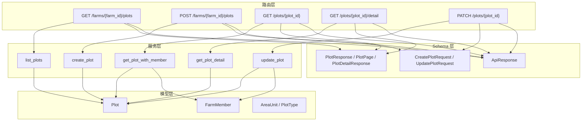
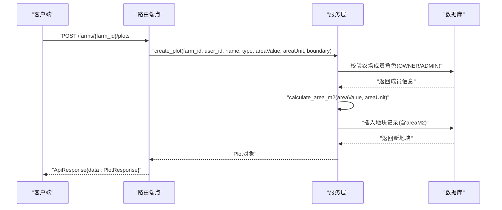
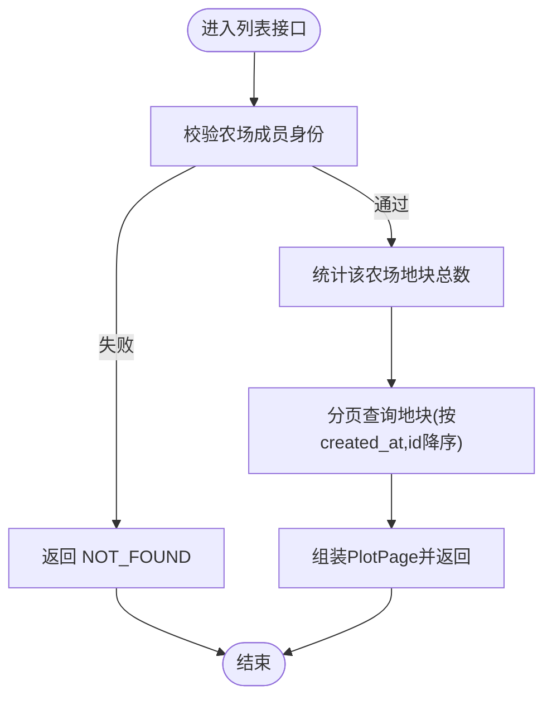
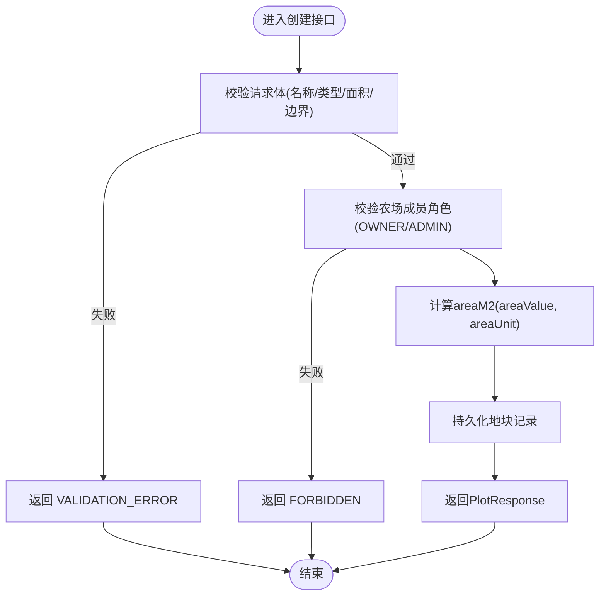
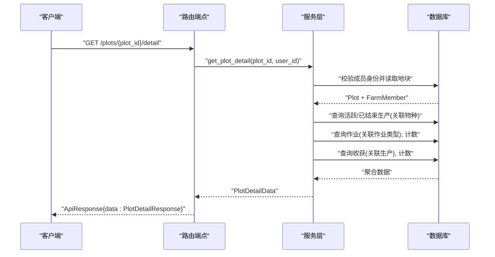
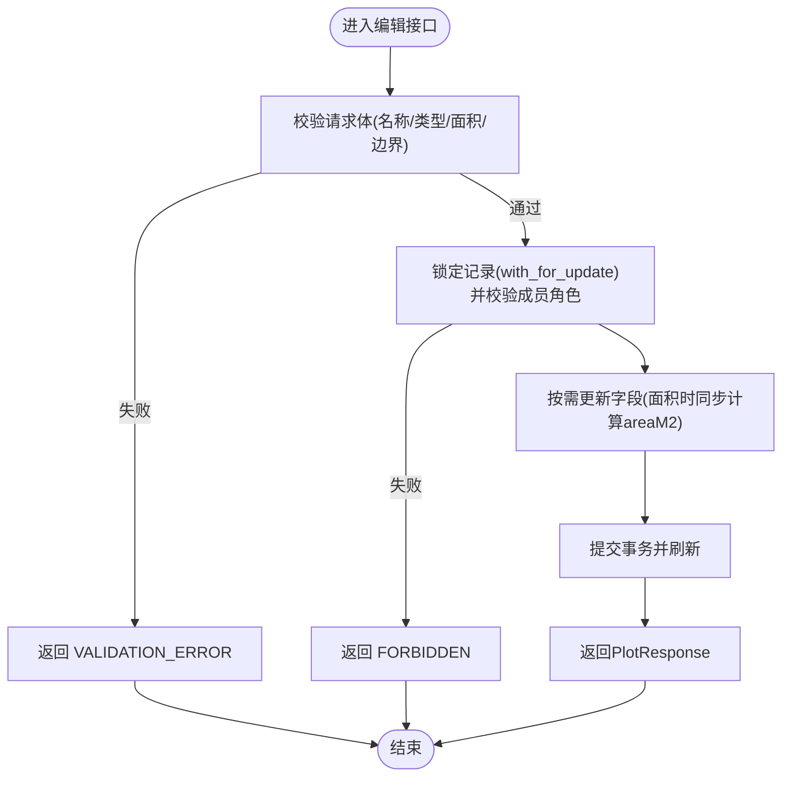
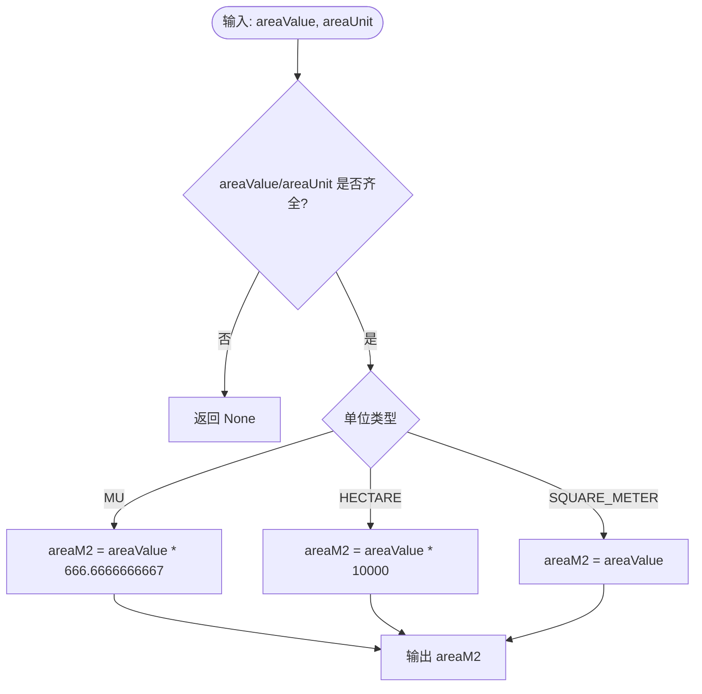
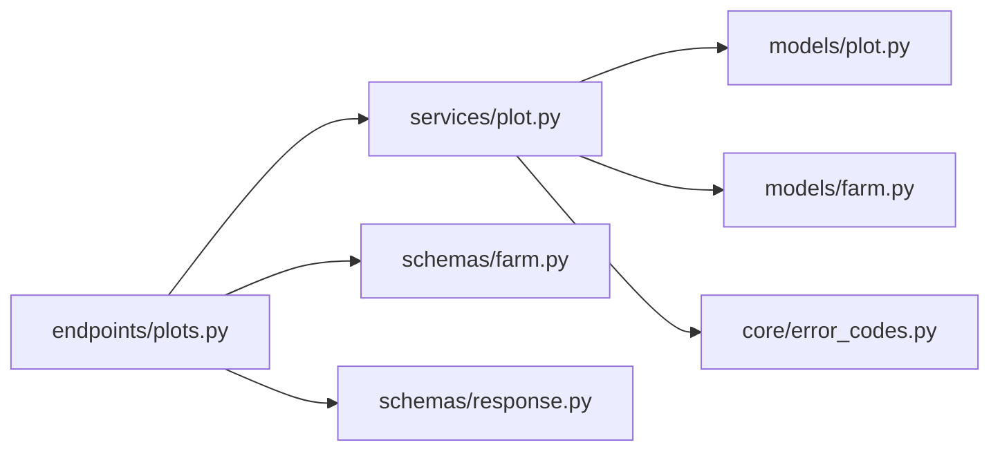

# 地块管理接口

<cite>
**本文引用的文件**
- [plots.py](file://apps/api/app/api/v1/endpoints/plots.py)
- [plot.py](file://apps/api/app/models/plot.py)
- [plot_service.py](file://apps/api/app/services/plot.py)
- [farm_schemas.py](file://apps/api/app/schemas/farm.py)
- [response_schema.py](file://apps/api/app/schemas/response.py)
- [error_codes.py](file://apps/api/app/core/error_codes.py)
- [farm_models.py](file://apps/api/app/models/farm.py)
- [test_plots.py](file://apps/api/tests/test_plots.py)
</cite>

## 目录
1. [简介](#简介)
2. [项目结构](#项目结构)
3. [核心组件](#核心组件)
4. [架构总览](#架构总览)
5. [详细组件分析](#详细组件分析)
6. [依赖关系分析](#依赖关系分析)
7. [性能考虑](#性能考虑)
8. [故障排查指南](#故障排查指南)
9. [结论](#结论)
10. [附录：API 规范与示例](#附录api-规范与示例)

## 简介
本文件为“地块管理”模块的 API 接口文档，覆盖地块的创建、编辑、查询与详情聚合，包含面积计算与单位转换、地理边界校验、权限控制以及与农场成员关系的关联一致性保证。文档同时提供请求与响应示例路径，便于前端对接与测试验证。

## 项目结构
地块管理相关代码采用分层组织：
- 路由层：FastAPI 端点定义与参数绑定
- 服务层：业务逻辑（权限校验、数据聚合、面积换算）
- 模型层：数据库表结构与枚举
- Schema 层：请求/响应数据模型与校验规则
- 测试层：端到端用例验证权限、校验与聚合行为

图表来源
- [plots.py:139-246](file://apps/api/app/api/v1/endpoints/plots.py#L139-L246)
- [plot_service.py:57-223](file://apps/api/app/services/plot.py#L57-L223)
- [plot.py:14-53](file://apps/api/app/models/plot.py#L14-L53)
- [farm_models.py:12-59](file://apps/api/app/models/farm.py#L12-L59)
- [farm_schemas.py:75-166](file://apps/api/app/schemas/farm.py#L75-L166)
- [response_schema.py:16-40](file://apps/api/app/schemas/response.py#L16-L40)

章节来源
- [plots.py:139-246](file://apps/api/app/api/v1/endpoints/plots.py#L139-L246)
- [plot_service.py:57-223](file://apps/api/app/services/plot.py#L57-L223)
- [plot.py:14-53](file://apps/api/app/models/plot.py#L14-L53)
- [farm_models.py:12-59](file://apps/api/app/models/farm.py#L12-L59)
- [farm_schemas.py:75-166](file://apps/api/app/schemas/farm.py#L75-L166)
- [response_schema.py:16-40](file://apps/api/app/schemas/response.py#L16-L40)

## 核心组件
- 路由端点：提供地块列表、创建、详情、编辑等 HTTP 接口
- 服务函数：实现权限校验、数据聚合、面积换算、更新策略
- 数据模型：地块、农场成员、面积单位与类型枚举
- 请求/响应模型：字段校验、别名映射、统一响应封装
- 错误码：标准化错误分类

章节来源
- [plots.py:139-246](file://apps/api/app/api/v1/endpoints/plots.py#L139-L246)
- [plot_service.py:18-223](file://apps/api/app/services/plot.py#L18-L223)
- [plot.py:14-53](file://apps/api/app/models/plot.py#L14-L53)
- [farm_schemas.py:75-166](file://apps/api/app/schemas/farm.py#L75-L166)
- [response_schema.py:16-40](file://apps/api/app/schemas/response.py#L16-L40)
- [error_codes.py:4-13](file://apps/api/app/core/error_codes.py#L4-L13)

## 架构总览
下图展示了从客户端到数据库的完整调用链，包括权限校验、面积换算与数据聚合。

图表来源
- [plots.py:164-185](file://apps/api/app/api/v1/endpoints/plots.py#L164-L185)
- [plot_service.py:79-104](file://apps/api/app/services/plot.py#L79-L104)
- [plot_service.py:47-55](file://apps/api/app/services/plot.py#L47-L55)

## 详细组件分析

### 地块列表接口
- 方法/路径：GET /api/v1/farms/{farm_id}/plots
- 功能：分页获取指定农场的地块列表，仅对具备农场成员身份的用户开放
- 参数：
  - farm_id：路径参数，整数
  - page：页码，默认 1，最小 1
  - pageSize：每页条数，默认 20，范围 1-100
- 权限：调用者需为农场成员；列表结果按创建时间倒序
- 响应：统一 ApiResponse，data 为 PlotPage，包含 items、page、pageSize、total

图表来源
- [plots.py:139-161](file://apps/api/app/api/v1/endpoints/plots.py#L139-L161)
- [plot_service.py:57-76](file://apps/api/app/services/plot.py#L57-L76)

章节来源
- [plots.py:139-161](file://apps/api/app/api/v1/endpoints/plots.py#L139-L161)
- [plot_service.py:57-76](file://apps/api/app/services/plot.py#L57-L76)

### 地块创建接口
- 方法/路径：POST /api/v1/farms/{farm_id}/plots
- 功能：在指定农场下创建地块，自动计算并写入标准面积（平方米）
- 请求体字段（CreatePlotRequest）：
  - name：必填，长度 1-100
  - type：可选，地块类型枚举（FIELD/PADDY/GREENHOUSE/ORCHARD/FOREST/POND/BARN/OTHER）
  - areaValue：可选，正数 Decimal
  - areaUnit：可选，面积单位枚举（MU/SQUARE_METER/HECTARE）
  - boundary：可选，JSON 对象，必须包含 coordinateSystem 且值为 GCJ02
- 校验规则：
  - areaValue 与 areaUnit 必须同时提供或同时不提供
  - boundary.coordinateSystem 必须为 GCJ02
- 权限：调用者需为农场 OWNER 或 ADMIN
- 响应：统一 ApiResponse，data 为 PlotResponse，包含 id、farmId、name、type、areaValue、areaUnit、areaM2、boundary、createdAt、updatedAt

图表来源
- [farm_schemas.py:75-99](file://apps/api/app/schemas/farm.py#L75-L99)
- [plot_service.py:79-104](file://apps/api/app/services/plot.py#L79-L104)
- [plot_service.py:47-55](file://apps/api/app/services/plot.py#L47-L55)

章节来源
- [plots.py:164-185](file://apps/api/app/api/v1/endpoints/plots.py#L164-L185)
- [farm_schemas.py:75-99](file://apps/api/app/schemas/farm.py#L75-L99)
- [plot_service.py:79-104](file://apps/api/app/services/plot.py#L79-L104)

### 地块详情接口（基础）
- 方法/路径：GET /api/v1/plots/{plot_id}
- 功能：根据地块 ID 获取基本信息，需具备对应农场成员身份
- 权限：调用者必须是该地块所属农场的成员
- 响应：统一 ApiResponse，data 为 PlotResponse

章节来源
- [plots.py:188-195](file://apps/api/app/api/v1/endpoints/plots.py#L188-L195)
- [plot_service.py:107-121](file://apps/api/app/services/plot.py#L107-L121)

### 地块详情接口（聚合）
- 方法/路径：GET /api/v1/plots/{plot_id}/detail
- 功能：返回地块及其关联的生产、作业、收获记录的聚合视图
- 权限：调用者必须是该地块所属农场的成员
- 响应：统一 ApiResponse，data 为 PlotDetailResponse，包含：
  - plot：地块基本信息
  - activeProductions：当前进行中的生产批次
  - endedProductions：已结束的生产批次
  - operations：最近操作记录（限制数量）
  - operationTotal：操作总数
  - harvests：最近收获记录（限制数量）
  - harvestTotal：收获总数

图表来源
- [plots.py:198-224](file://apps/api/app/api/v1/endpoints/plots.py#L198-L224)
- [plot_service.py:124-183](file://apps/api/app/services/plot.py#L124-L183)

章节来源
- [plots.py:198-224](file://apps/api/app/api/v1/endpoints/plots.py#L198-L224)
- [plot_service.py:124-183](file://apps/api/app/services/plot.py#L124-L183)

### 地块编辑接口
- 方法/路径：PATCH /api/v1/plots/{plot_id}
- 功能：部分更新地块信息，支持选择性更新 name、type、areaValue+areaUnit、boundary
- 请求体字段（UpdatePlotRequest）：
  - name：可选，长度 1-100，若提供则不能为空
  - type：可选，地块类型枚举
  - areaValue：可选，正数 Decimal
  - areaUnit：可选，面积单位枚举
  - boundary：可选，JSON 对象，coordinateSystem 必须为 GCJ02
- 校验规则：
  - 若提供 areaValue 或 areaUnit 中的任意一个，则必须同时提供另一个
  - boundary.coordinateSystem 必须为 GCJ02
- 权限：调用者必须是该地块所属农场的 OWNER 或 ADMIN
- 响应：统一 ApiResponse，data 为 PlotResponse

图表来源
- [farm_schemas.py:102-130](file://apps/api/app/schemas/farm.py#L102-L130)
- [plot_service.py:186-222](file://apps/api/app/services/plot.py#L186-L222)

章节来源
- [plots.py:227-246](file://apps/api/app/api/v1/endpoints/plots.py#L227-L246)
- [farm_schemas.py:102-130](file://apps/api/app/schemas/farm.py#L102-L130)
- [plot_service.py:186-222](file://apps/api/app/services/plot.py#L186-L222)

### 面积计算与单位转换
- 支持单位：亩(MU)、平方米(SQUARE_METER)、公顷(HECTARE)
- 换算规则：
  - 1 亩 = 666.6666666667 平方米
  - 1 公顷 = 10000 平方米
  - 平方米保持不变
- 存储策略：
  - areaValue 与 areaUnit 为用户输入的真实值
  - areaM2 由二者换算得到，用于统一度量与展示

图表来源
- [plot_service.py:47-55](file://apps/api/app/services/plot.py#L47-L55)
- [plot_service.py:18-20](file://apps/api/app/services/plot.py#L18-L20)

章节来源
- [plot_service.py:47-55](file://apps/api/app/services/plot.py#L47-L55)

### 地理信息与属性管理
- 边界字段 boundary：
  - 类型为 JSON，允许为空
  - 若提供，必须包含 coordinateSystem 且值为 GCJ02
- 地块属性：
  - name：必填，长度限制
  - type：可选，固定枚举
  - areaValue/areaUnit：可选，但需成对出现
  - areaM2：服务端计算得出
  - boundary：可选，坐标系统约束

章节来源
- [farm_schemas.py:75-99](file://apps/api/app/schemas/farm.py#L75-L99)
- [farm_schemas.py:102-130](file://apps/api/app/schemas/farm.py#L102-L130)
- [plot.py:41-46](file://apps/api/app/models/plot.py#L41-L46)

### 地块与农场的关联关系与一致性
- 关联关系：
  - 地块属于农场（farm_id），删除农场时受 RESTRICT 保护
  - 访问与修改均需校验用户在农场中的成员身份与角色
- 一致性保证：
  - 列表与详情均基于成员身份过滤
  - 创建/编辑时需确保调用者为 OWNER 或 ADMIN
  - 更新使用行级锁 with_for_update，避免并发冲突

章节来源
- [plot.py:34-40](file://apps/api/app/models/plot.py#L34-L40)
- [farm_models.py:39-59](file://apps/api/app/models/farm.py#L39-L59)
- [plot_service.py:90-104](file://apps/api/app/services/plot.py#L90-L104)
- [plot_service.py:198-208](file://apps/api/app/services/plot.py#L198-L208)

## 依赖关系分析
- 路由依赖：
  - 认证与用户：get_current_user
  - 数据库会话：get_db_session
- 服务依赖：
  - 农场成员校验：get_farm_with_member
  - 错误处理：AppException、ErrorCode
- 模型依赖：
  - Plot、FarmMember、AreaUnit、PlotType
- Schema 依赖：
  - CreatePlotRequest、UpdatePlotRequest、PlotResponse、PlotPage、PlotDetailResponse、ApiResponse

图表来源
- [plots.py:1-37](file://apps/api/app/api/v1/endpoints/plots.py#L1-L37)
- [plot_service.py:1-16](file://apps/api/app/services/plot.py#L1-L16)
- [plot.py:1-11](file://apps/api/app/models/plot.py#L1-L11)
- [farm_models.py:1-10](file://apps/api/app/models/farm.py#L1-L10)
- [farm_schemas.py:1-12](file://apps/api/app/schemas/farm.py#L1-L12)
- [response_schema.py:1-6](file://apps/api/app/schemas/response.py#L1-L6)
- [error_codes.py:1-13](file://apps/api/app/core/error_codes.py#L1-L13)

章节来源
- [plots.py:1-37](file://apps/api/app/api/v1/endpoints/plots.py#L1-L37)
- [plot_service.py:1-16](file://apps/api/app/services/plot.py#L1-L16)
- [plot.py:1-11](file://apps/api/app/models/plot.py#L1-L11)
- [farm_models.py:1-10](file://apps/api/app/models/farm.py#L1-L10)
- [farm_schemas.py:1-12](file://apps/api/app/schemas/farm.py#L1-L12)
- [response_schema.py:1-6](file://apps/api/app/schemas/response.py#L1-L6)
- [error_codes.py:1-13](file://apps/api/app/core/error_codes.py#L1-L13)

## 性能考虑
- 列表分页：使用 offset/limit 控制查询规模，避免全表扫描
- 详情聚合：作业与收获记录设置上限（DETAIL_RECORD_LIMIT），防止大结果集
- 并发安全：更新时使用 with_for_update 行级锁，减少竞争条件
- 面积计算：在服务端统一换算，避免重复计算与精度问题

[本节为通用指导，不直接分析具体文件]

## 故障排查指南
- 404 未找到：
  - 常见原因：地块不存在或调用者无对应农场成员身份
  - 定位参考：服务层 get_plot_with_member 抛出 NOT_FOUND
- 403 禁止访问：
  - 常见原因：非 OWNER/ADMIN 尝试创建或编辑地块
  - 定位参考：_require_plot_management_role 检查角色
- 422 校验失败：
  - 常见原因：areaValue/areaUnit 未成对、boundary.coordinateSystem 不为 GCJ02、name 为空等
  - 定位参考：Pydantic 模型校验器
- 401 未授权：
  - 常见原因：缺少或无效令牌
  - 定位参考：认证依赖 get_current_user

章节来源
- [plot_service.py:34-45](file://apps/api/app/services/plot.py#L34-L45)
- [farm_schemas.py:94-99](file://apps/api/app/schemas/farm.py#L94-L99)
- [farm_schemas.py:122-130](file://apps/api/app/schemas/farm.py#L122-L130)
- [error_codes.py:4-13](file://apps/api/app/core/error_codes.py#L4-L13)

## 结论
地块管理 API 以清晰的层次划分实现了 CRUD、面积换算、地理边界校验与权限控制，并通过聚合接口提供丰富的上下文信息。结合严格的请求校验与服务端一致性保障，能够满足农场场景下的地块管理与数据分析需求。

[本节为总结性内容，不直接分析具体文件]

## 附录：API 规范与示例

### 通用响应格式
- 所有接口返回统一 ApiResponse，包含 success、data、error 字段
- 成功时 data 为业务数据，error 为 null
- 失败时 error 包含 code、message、details

章节来源
- [response_schema.py:16-40](file://apps/api/app/schemas/response.py#L16-L40)

### 接口清单与示例路径

- 列表：GET /api/v1/farms/{farm_id}/plots
  - 请求示例路径：[test_plots.py:123-125](file://apps/api/tests/test_plots.py#L123-L125)
  - 响应示例路径：[test_plots.py:123-125](file://apps/api/tests/test_plots.py#L123-L125)

- 创建：POST /api/v1/farms/{farm_id}/plots
  - 请求示例路径：[test_plots.py:104-116](file://apps/api/tests/test_plots.py#L104-L116)
  - 响应示例路径：[test_plots.py:117-121](file://apps/api/tests/test_plots.py#L117-L121)

- 详情（基础）：GET /api/v1/plots/{plot_id}
  - 请求示例路径：[test_plots.py:127-129](file://apps/api/tests/test_plots.py#L127-L129)
  - 响应示例路径：[test_plots.py:127-129](file://apps/api/tests/test_plots.py#L127-L129)

- 详情（聚合）：GET /api/v1/plots/{plot_id}/detail
  - 请求示例路径：[test_plots.py:252-253](file://apps/api/tests/test_plots.py#L252-L253)
  - 响应示例路径：[test_plots.py:255-263](file://apps/api/tests/test_plots.py#L255-L263)

- 编辑：PATCH /api/v1/plots/{plot_id}
  - 请求示例路径：[test_plots.py:131-139](file://apps/api/tests/test_plots.py#L131-L139)
  - 响应示例路径：[test_plots.py:131-139](file://apps/api/tests/test_plots.py#L131-L139)

### 校验与权限要点
- 面积单位与数值必须成对出现
- 边界坐标系统必须为 GCJ02
- 创建/编辑需要 OWNER 或 ADMIN 角色
- 列表/详情需具备农场成员身份

章节来源
- [farm_schemas.py:75-99](file://apps/api/app/schemas/farm.py#L75-L99)
- [farm_schemas.py:102-130](file://apps/api/app/schemas/farm.py#L102-L130)
- [plot_service.py:42-45](file://apps/api/app/services/plot.py#L42-L45)
- [plot_service.py:90-104](file://apps/api/app/services/plot.py#L90-L104)
- [plot_service.py:107-121](file://apps/api/app/services/plot.py#L107-L121)