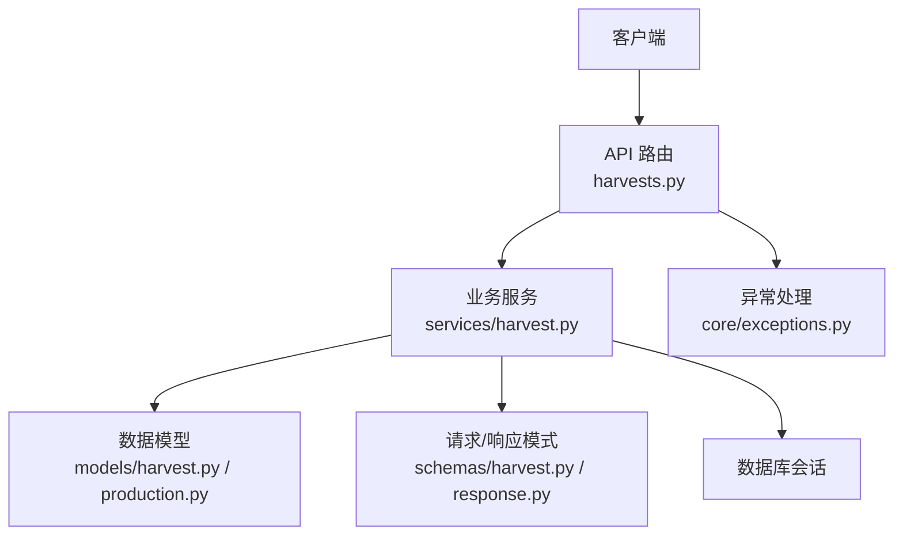
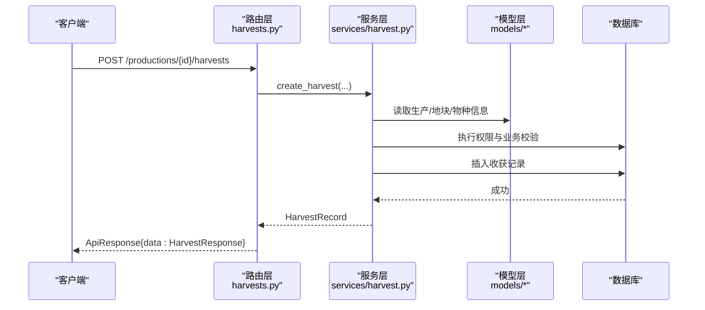
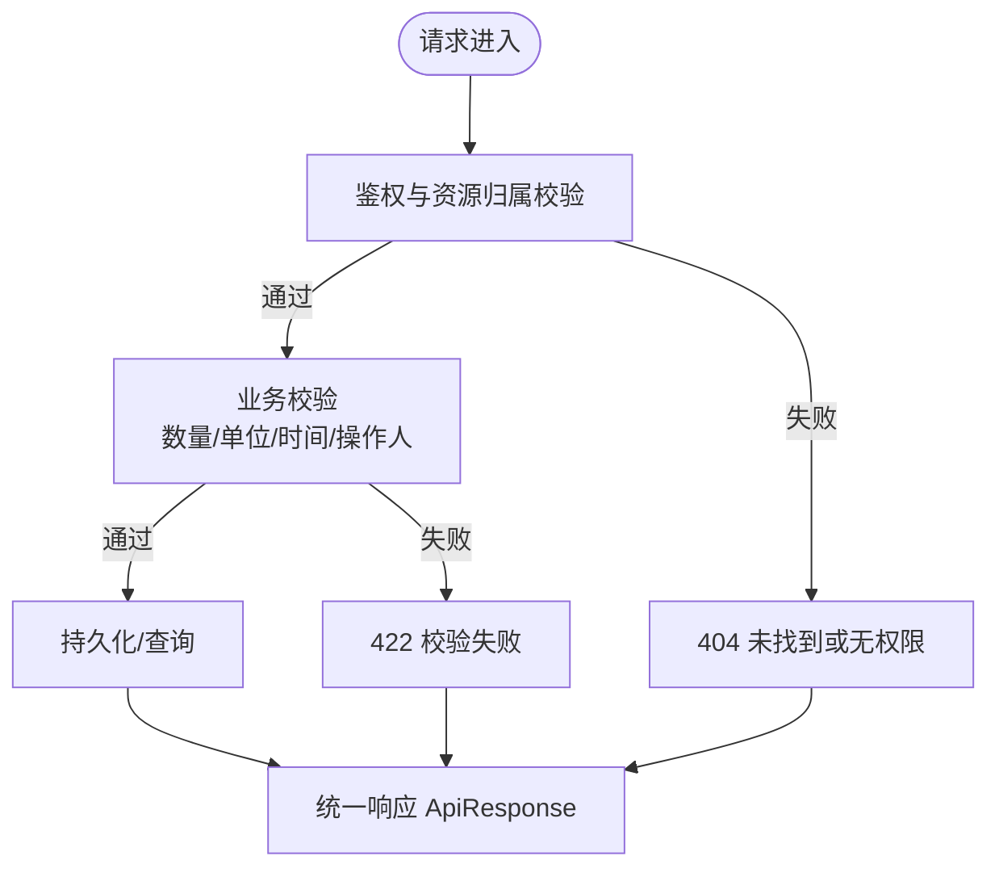
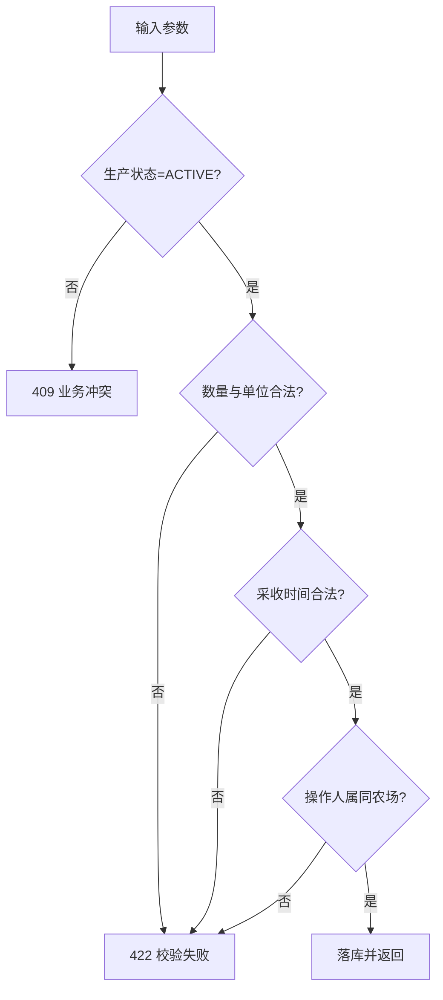
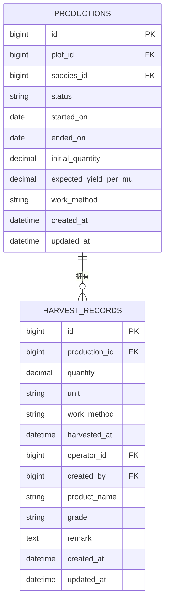
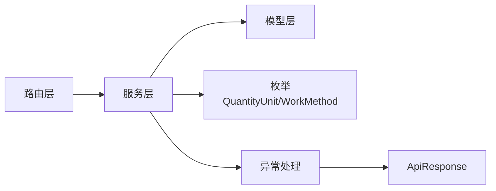

# 收获管理接口

<cite>
**本文引用的文件**
- [harvests.py](file://apps/api/app/api/v1/endpoints/harvests.py)
- [harvest.py（服务）](file://apps/api/app/services/harvest.py)
- [harvest.py（模型）](file://apps/api/app/models/harvest.py)
- [harvest.py（模式）](file://apps/api/app/schemas/harvest.py)
- [production.py（模型）](file://apps/api/app/models/production.py)
- [response.py](file://apps/api/app/schemas/response.py)
- [error_codes.py](file://apps/api/app/core/error_codes.py)
- [exceptions.py](file://apps/api/app/core/exceptions.py)
- [test_harvests.py](file://apps/api/tests/test_harvests.py)
</cite>

## 目录
1. [简介](#简介)
2. [项目结构](#项目结构)
3. [核心组件](#核心组件)
4. [架构总览](#架构总览)
5. [详细组件分析](#详细组件分析)
6. [依赖关系分析](#依赖关系分析)
7. [性能与可扩展性](#性能与可扩展性)
8. [故障排查指南](#故障排查指南)
9. [结论](#结论)
10. [附录：接口规范与示例](#附录接口规范与示例)

## 简介
本文件为“收获管理”模块的 API 文档，覆盖收获数据录入、产量统计分析、收获记录查询等能力。重点说明：
- 收获记录的创建、更新、删除与分页查询
- 基于生产批次与地块的统计维度
- 与生产、作业、农场成员的数据关联与完整性约束
- 请求/响应结构与错误码约定
- 典型调用流程与边界校验规则

## 项目结构
收获管理相关代码采用分层组织：
- 路由层：定义 RESTful 端点与参数校验
- 服务层：实现业务逻辑、权限与一致性校验
- 模型层：数据库表结构与外键约束
- 模式层：Pydantic 请求/响应模型与字段别名
- 异常与统一响应：全局异常处理器与 ApiResponse 包装

**图表来源**
- [harvests.py:66-162](file://apps/api/app/api/v1/endpoints/harvests.py#L66-L162)
- [harvest.py（服务）:86-281](file://apps/api/app/services/harvest.py#L86-L281)
- [harvest.py（模型）:13-48](file://apps/api/app/models/harvest.py#L13-L48)
- [production.py（模型）:13-79](file://apps/api/app/models/production.py#L13-L79)
- [response.py:16-40](file://apps/api/app/schemas/response.py#L16-L40)
- [exceptions.py:35-88](file://apps/api/app/core/exceptions.py#L35-L88)

**章节来源**
- [harvests.py:1-163](file://apps/api/app/api/v1/endpoints/harvests.py#L1-L163)
- [harvest.py（服务）:1-281](file://apps/api/app/services/harvest.py#L1-L281)
- [harvest.py（模型）:1-48](file://apps/api/app/models/harvest.py#L1-L48)
- [harvest.py（模式）:1-111](file://apps/api/app/schemas/harvest.py#L1-L111)
- [production.py（模型）:1-79](file://apps/api/app/models/production.py#L1-L79)
- [response.py:1-40](file://apps/api/app/schemas/response.py#L1-L40)
- [error_codes.py:1-13](file://apps/api/app/core/error_codes.py#L1-L13)
- [exceptions.py:1-88](file://apps/api/app/core/exceptions.py#L1-L88)

## 核心组件
- 路由层（Harvests Endpoints）
  - 按生产批次查询收获列表
  - 按地块查询收获列表
  - 创建收获记录
  - 更新收获记录
  - 删除收获记录
- 服务层（Harvest Services）
  - 权限校验：通过生产/地块归属到农场成员进行鉴权
  - 业务校验：数量精度与单位、采收时间范围、操作人归属
  - 状态保护：已结束的生产禁止修改/删除收获
  - 自动推导：单位根据物种所属行业推导；产品名称默认使用物种名称
- 模型层（Models）
  - 收获记录表：包含生产批次、数量、单位、作业方式、采收时间、操作人、创建人、等级、备注等
  - 生产批次表：状态、开始/结束日期、初始数量、预期产量等
- 模式层（Schemas）
  - 统一的请求/响应封装 ApiResponse
  - 收获请求/响应模型，支持驼峰/下划线双命名
- 异常与错误码
  - 统一 AppException 与全局异常处理器
  - 标准错误码枚举

**章节来源**
- [harvests.py:66-162](file://apps/api/app/api/v1/endpoints/harvests.py#L66-L162)
- [harvest.py（服务）:45-70](file://apps/api/app/services/harvest.py#L45-L70)
- [harvest.py（模型）:13-48](file://apps/api/app/models/harvest.py#L13-L48)
- [harvest.py（模式）:15-111](file://apps/api/app/schemas/harvest.py#L15-L111)
- [response.py:16-40](file://apps/api/app/schemas/response.py#L16-L40)
- [error_codes.py:1-13](file://apps/api/app/core/error_codes.py#L1-L13)
- [exceptions.py:35-88](file://apps/api/app/core/exceptions.py#L35-L88)

## 架构总览
收获管理的请求从 FastAPI 路由进入，经服务层完成权限与业务校验后写入数据库，并通过统一响应格式返回。所有写操作均受“生产状态保护”和“农场成员权限”双重约束。

**图表来源**
- [harvests.py:86-109](file://apps/api/app/api/v1/endpoints/harvests.py#L86-L109)
- [harvest.py（服务）:134-178](file://apps/api/app/services/harvest.py#L134-L178)
- [harvest.py（模型）:13-48](file://apps/api/app/models/harvest.py#L13-L48)
- [production.py（模型）:43-79](file://apps/api/app/models/production.py#L43-L79)

## 详细组件分析

### 路由层：收获管理端点
- 获取某生产的收获列表（分页）
  - 路径：GET /api/v1/productions/{production_id}/harvests
  - 参数：page, pageSize
  - 行为：校验当前用户对该生产有访问权限，返回该生产下的收获分页
- 获取某地块的收获列表（分页）
  - 路径：GET /api/v1/plots/{plot_id}/harvests
  - 参数：page, pageSize
  - 行为：校验当前用户对该地块有访问权限，返回该地块下所有生产的收获分页
- 创建收获记录
  - 路径：POST /api/v1/productions/{production_id}/harvests
  - 行为：校验生产状态、数量与单位、采收时间、操作人归属；自动生成单位与默认产品名称；落库并返回
- 更新收获记录
  - 路径：PATCH /api/v1/harvests/{harvest_id}
  - 行为：仅允许更新部分字段；严格校验必填字段与取值范围；锁定记录并检查生产状态
- 删除收获记录
  - 路径：DELETE /api/v1/harvests/{harvest_id}
  - 行为：锁定记录并检查生产状态；成功后返回 204

**图表来源**
- [harvests.py:66-162](file://apps/api/app/api/v1/endpoints/harvests.py#L66-L162)
- [harvest.py（服务）:86-178](file://apps/api/app/services/harvest.py#L86-L178)
- [response.py:16-40](file://apps/api/app/schemas/response.py#L16-L40)

**章节来源**
- [harvests.py:66-162](file://apps/api/app/api/v1/endpoints/harvests.py#L66-L162)

### 服务层：业务逻辑与数据完整性
- 权限控制
  - 通过生产/地块关联到农场成员，确保当前用户可访问
  - 操作人必须属于同一农场
- 业务校验
  - 数量必须大于 0；整数单位时要求整数值
  - 采收时间不得晚于当前时间，且不得早于生产开始日期
  - 单位由物种所属行业推导：农业/渔业使用 KG，其他行业使用个体单位
  - 产品名称默认使用物种名称，可覆盖
- 状态保护
  - 已结束的生产禁止新增、修改、删除收获记录
- 并发安全
  - 关键写操作对上下文加锁，避免竞态条件

**图表来源**
- [harvest.py（服务）:45-70](file://apps/api/app/services/harvest.py#L45-L70)
- [harvest.py（服务）:134-178](file://apps/api/app/services/harvest.py#L134-L178)
- [harvest.py（服务）:204-263](file://apps/api/app/services/harvest.py#L204-L263)

**章节来源**
- [harvest.py（服务）:45-70](file://apps/api/app/services/harvest.py#L45-L70)
- [harvest.py（服务）:71-84](file://apps/api/app/services/harvest.py#L71-L84)
- [harvest.py（服务）:86-178](file://apps/api/app/services/harvest.py#L86-L178)
- [harvest.py（服务）:204-281](file://apps/api/app/services/harvest.py#L204-L281)

### 数据模型与关系
- 收获记录 HarvestRecord
  - 关键字段：生产ID、数量、单位、作业方式、采收时间、操作人ID、创建人ID、产品名称、等级、备注、创建/更新时间
  - 外键：关联 productions.id 与 users.id
- 生产批次 Production
  - 关键字段：状态、开始/结束日期、初始数量、预期产量、作业方式等
  - 与收获记录一对多关系

**图表来源**
- [harvest.py（模型）:13-48](file://apps/api/app/models/harvest.py#L13-L48)
- [production.py（模型）:43-79](file://apps/api/app/models/production.py#L43-L79)

**章节来源**
- [harvest.py（模型）:13-48](file://apps/api/app/models/harvest.py#L13-L48)
- [production.py（模型）:43-79](file://apps/api/app/models/production.py#L43-L79)

### 请求/响应模式
- 创建收获请求 CreateHarvestRequest
  - 字段：quantity（正数，最多4位小数）、workMethod（默认手工）、harvestedAt（带时区）、operatorId（可选，正数）、productName（可选）、grade（可选）、remark（可选）
- 更新收获请求 UpdateHarvestRequest
  - 字段同上，但均为可选；若提供则需满足相同校验
- 收获响应 HarvestResponse
  - 字段：id、productionId、quantity、unit、workMethod、harvestedAt、operatorId、createdBy、productName、grade、remark、createdAt、updatedAt
- 分页 HarvestPage
  - 字段：items、page、pageSize、total
- 统一响应 ApiResponse
  - 字段：success、data、error

**章节来源**
- [harvest.py（模式）:15-111](file://apps/api/app/schemas/harvest.py#L15-L111)
- [response.py:16-40](file://apps/api/app/schemas/response.py#L16-L40)

## 依赖关系分析
- 路由依赖服务：路由仅做参数绑定与响应封装，核心逻辑在服务层
- 服务依赖模型与外部服务：
  - 通过 get_production_with_member / get_plot_with_member 完成权限与上下文加载
  - 通过 _validate_operator 校验操作人归属
  - 通过 QuantityUnit / WorkMethod 枚举保证类型安全
- 异常与错误码：
  - 服务层抛出 AppException，统一由 exceptions.py 转换为 ApiResponse

**图表来源**
- [harvests.py:66-162](file://apps/api/app/api/v1/endpoints/harvests.py#L66-L162)
- [harvest.py（服务）:86-281](file://apps/api/app/services/harvest.py#L86-L281)
- [production.py（模型）:13-41](file://apps/api/app/models/production.py#L13-L41)
- [exceptions.py:35-88](file://apps/api/app/core/exceptions.py#L35-L88)

**章节来源**
- [harvests.py:66-162](file://apps/api/app/api/v1/endpoints/harvests.py#L66-L162)
- [harvest.py（服务）:86-281](file://apps/api/app/services/harvest.py#L86-L281)
- [production.py（模型）:13-41](file://apps/api/app/models/production.py#L13-L41)
- [exceptions.py:35-88](file://apps/api/app/core/exceptions.py#L35-L88)

## 性能与可扩展性
- 分页查询：服务端使用 offset/limit 分页，适合中等规模数据；如需大数据量优化可考虑游标分页
- 索引：收获记录按 production_id、harvested_at 排序，建议对 production_id、harvested_at 建立索引以提升查询性能
- 并发安全：写操作对上下文加锁，避免并发修改导致的不一致
- 扩展点：
  - 可在服务层增加聚合统计接口（如按生产/地块/时间维度的产量汇总）
  - 可增加导出报表能力（CSV/Excel），复用现有查询与聚合逻辑

[本节为通用指导，不直接分析具体文件]

## 故障排查指南
- 404 未找到或无权限
  - 可能原因：生产/地块不属于当前用户；跨农场访问被拒绝
  - 定位：检查路由鉴权与服务层权限校验
- 409 业务冲突
  - 可能原因：生产已结束，尝试新增/修改/删除收获
  - 定位：检查生产状态与写操作前置校验
- 422 校验失败
  - 可能原因：数量非正数、单位与精度不符、采收时间越界、缺少时区、操作人不属于同农场
  - 定位：查看请求体字段与服务层校验逻辑
- 500 内部错误
  - 可能原因：数据库不可用或其他未捕获异常
  - 定位：查看日志与全局异常处理器

**章节来源**
- [error_codes.py:1-13](file://apps/api/app/core/error_codes.py#L1-L13)
- [exceptions.py:35-88](file://apps/api/app/core/exceptions.py#L35-L88)
- [harvest.py（服务）:29-39](file://apps/api/app/services/harvest.py#L29-L39)

## 结论
收获管理模块以清晰的分层架构实现了安全的收获数据录入、查询与统计基础能力。通过严格的权限与业务校验、状态保护以及统一响应与异常处理，保证了数据的完整性与一致性。后续可在现有基础上扩展更丰富的统计分析与报表导出能力。

[本节为总结，不直接分析具体文件]

## 附录：接口规范与示例

### 接口清单
- 获取某生产的收获列表（分页）
  - 方法：GET
  - 路径：/api/v1/productions/{production_id}/harvests
  - 查询参数：page（>=1）、pageSize（1-100）
  - 权限：当前用户需对该生产有访问权限
  - 响应：ApiResponse<HarvestPage>
- 获取某地块的收获列表（分页）
  - 方法：GET
  - 路径：/api/v1/plots/{plot_id}/harvests
  - 查询参数：page、pageSize
  - 权限：当前用户需对该地块有访问权限
  - 响应：ApiResponse<HarvestPage>
- 创建收获记录
  - 方法：POST
  - 路径：/api/v1/productions/{production_id}/harvests
  - 请求体：CreateHarvestRequest
  - 权限：当前用户需对该生产有访问权限
  - 响应：ApiResponse<HarvestResponse>
- 更新收获记录
  - 方法：PATCH
  - 路径：/api/v1/harvests/{harvest_id}
  - 请求体：UpdateHarvestRequest（仅更新提供的字段）
  - 权限：当前用户需对该收获记录有访问权限
  - 响应：ApiResponse<HarvestResponse>
- 删除收获记录
  - 方法：DELETE
  - 路径：/api/v1/harvests/{harvest_id}
  - 权限：当前用户需对该收获记录有访问权限
  - 响应：204 No Content

**章节来源**
- [harvests.py:66-162](file://apps/api/app/api/v1/endpoints/harvests.py#L66-L162)
- [harvest.py（模式）:15-111](file://apps/api/app/schemas/harvest.py#L15-L111)
- [response.py:16-40](file://apps/api/app/schemas/response.py#L16-L40)

### 数据结构说明
- 创建/更新请求字段
  - quantity：正数，最多4位小数
  - workMethod：MANUAL 或 MECHANICAL，默认 MANUAL
  - harvestedAt：ISO8601 时间字符串，必须带时区偏移
  - operatorId：正整数，可选；若提供则必须属于生产所在农场
  - productName：可选；若不传则默认使用物种名称
  - grade：可选，长度不超过100
  - remark：可选，长度不超过1000
- 响应字段
  - id、productionId、quantity、unit、workMethod、harvestedAt、operatorId、createdBy、productName、grade、remark、createdAt、updatedAt
  - 分页：items、page、pageSize、total

**章节来源**
- [harvest.py（模式）:15-111](file://apps/api/app/schemas/harvest.py#L15-L111)
- [harvest.py（服务）:45-70](file://apps/api/app/services/harvest.py#L45-L70)
- [harvest.py（模型）:13-48](file://apps/api/app/models/harvest.py#L13-L48)

### 典型请求与响应示例
- 创建收获
  - 请求示例（JSON）
    - {
      "quantity": 12.5,
      "workMethod": "MECHANICAL",
      "harvestedAt": "2024-06-01T10:00:00+08:00",
      "operatorId": 1001,
      "productName": "黄瓜",
      "grade": "一级",
      "remark": "首批采收"
    }
  - 响应示例（JSON）
    - {
      "success": true,
      "data": {
        "id": 1,
        "productionId": 10,
        "quantity": 12.5,
        "unit": "KG",
        "workMethod": "MECHANICAL",
        "harvestedAt": "2024-06-01T02:00:00Z",
        "operatorId": 1001,
        "createdBy": 1,
        "productName": "黄瓜",
        "grade": "一级",
        "remark": "首批采收",
        "createdAt": "2024-06-01T02:00:00Z",
        "updatedAt": "2024-06-01T02:00:00Z"
      },
      "error": null
    }
- 获取某生产的收获列表（分页）
  - 请求示例（URL）
    - GET /api/v1/productions/10/harvests?page=1&pageSize=20
  - 响应示例（JSON）
    - {
      "success": true,
      "data": {
        "items": [
          {"id": 1, "productionId": 10, "quantity": 12.5, "unit": "KG", "workMethod": "MECHANICAL", "harvestedAt": "2024-06-01T02:00:00Z", "operatorId": 1001, "createdBy": 1, "productName": "黄瓜", "grade": "一级", "remark": "首批采收", "createdAt": "2024-06-01T02:00:00Z", "updatedAt": "2024-06-01T02:00:00Z"}
        ],
        "page": 1,
        "pageSize": 20,
        "total": 1
      },
      "error": null
    }

注意：
- 时间字段在响应中通常以 UTC 表示；请求中的 harvestedAt 必须包含时区偏移
- 单位由物种所属行业自动推导；农业/渔业为 KG，其他为个体单位

**章节来源**
- [harvests.py:66-109](file://apps/api/app/api/v1/endpoints/harvests.py#L66-L109)
- [harvest.py（模式）:15-111](file://apps/api/app/schemas/harvest.py#L15-L111)
- [harvest.py（服务）:45-70](file://apps/api/app/services/harvest.py#L45-L70)

### 与生产、作业的关联关系与数据完整性
- 关联关系
  - 收获记录属于某个生产批次；生产批次属于某个地块；地块属于某个农场
  - 操作人必须属于该农场；创建人始终保留，用于审计
- 数据完整性保证
  - 外键约束：收获记录的生产ID与操作人ID均受外键保护
  - 权限校验：通过农场成员关系限制跨农场访问
  - 状态保护：已结束的生产禁止修改/删除收获
  - 业务校验：数量、单位、时间、操作人归属等严格校验

**章节来源**
- [harvest.py（模型）:13-48](file://apps/api/app/models/harvest.py#L13-L48)
- [production.py（模型）:43-79](file://apps/api/app/models/production.py#L43-L79)
- [harvest.py（服务）:71-84](file://apps/api/app/services/harvest.py#L71-L84)
- [harvest.py（服务）:134-178](file://apps/api/app/services/harvest.py#L134-L178)
- [harvest.py（服务）:204-281](file://apps/api/app/services/harvest.py#L204-L281)

### 测试用例参考（行为验证）
- 多次采收与默认排序：按采收时间倒序
- 单位推导与数量/时间边界校验：不同行业单位不同；数量必须为正；时间不得越界
- 操作人变更与创建人保留：operatorId 可改，createdBy 不变；外部人员无法访问
- 跨农场隔离：无法创建或访问他人农场的收获
- 结束后锁定：生产结束后禁止新增/修改/删除收获，但可查询

**章节来源**
- [test_harvests.py:180-528](file://apps/api/tests/test_harvests.py#L180-L528)