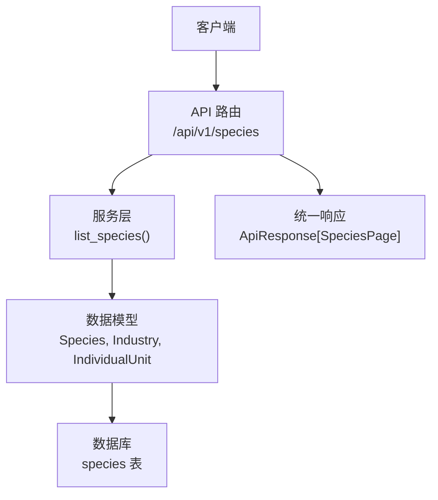
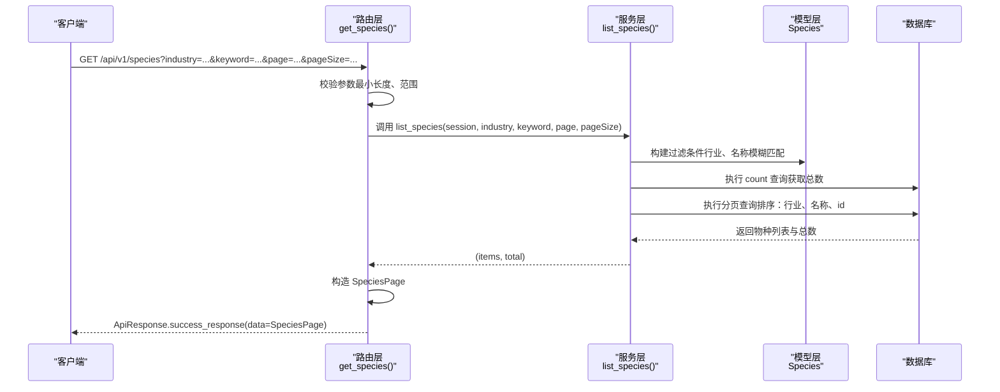
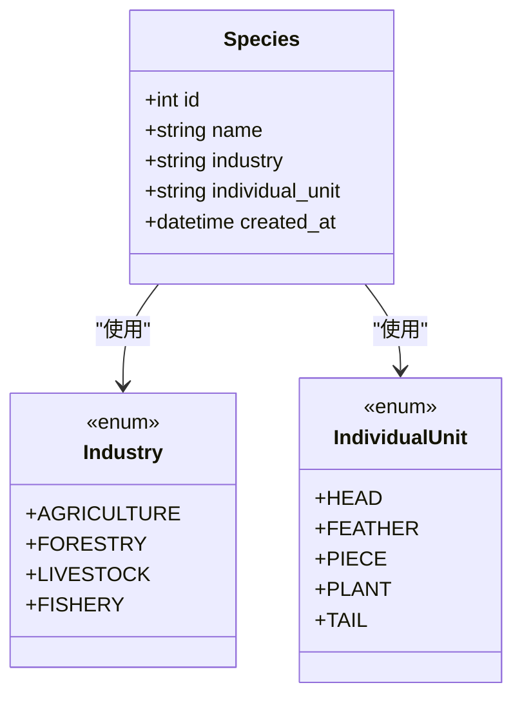
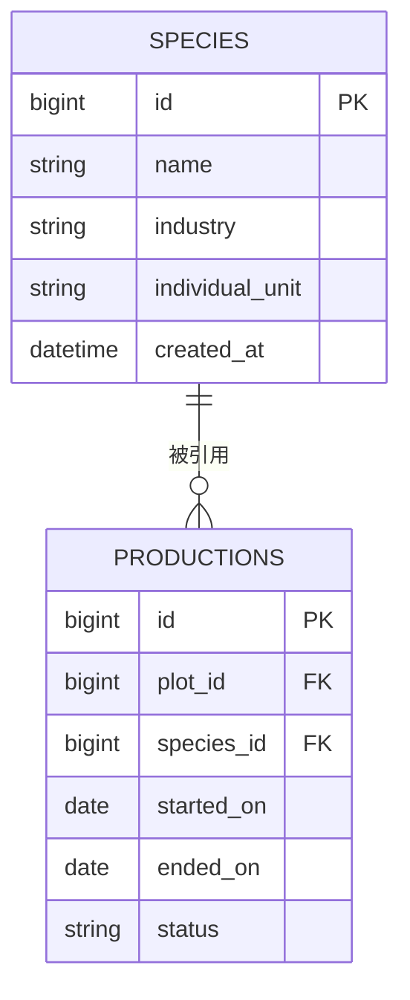
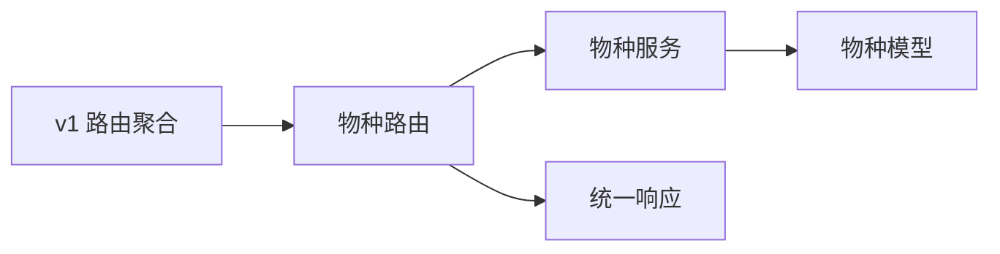

# 物种管理接口

<cite>
**本文引用的文件**
- [apps/api/app/api/v1/endpoints/species.py](file://apps/api/app/api/v1/endpoints/species.py)
- [apps/api/app/services/species.py](file://apps/api/app/services/species.py)
- [apps/api/app/models/species.py](file://apps/api/app/models/species.py)
- [apps/api/app/schemas/species.py](file://apps/api/app/schemas/species.py)
- [apps/api/app/schemas/response.py](file://apps/api/app/schemas/response.py)
- [apps/api/app/core/error_codes.py](file://apps/api/app/core/error_codes.py)
- [apps/api/app/models/production.py](file://apps/api/app/models/production.py)
- [apps/api/app/api/v1/router.py](file://apps/api/app/api/v1/router.py)
- [apps/api/tests/test_productions.py](file://apps/api/tests/test_productions.py)
- [apps/miniapp/src/services/species.ts](file://apps/miniapp/src/services/species.ts)
</cite>

## 目录
1. [简介](#简介)
2. [项目结构](#项目结构)
3. [核心组件](#核心组件)
4. [架构总览](#架构总览)
5. [详细组件分析](#详细组件分析)
6. [依赖关系分析](#依赖关系分析)
7. [性能考虑](#性能考虑)
8. [故障排查指南](#故障排查指南)
9. [结论](#结论)
10. [附录](#附录)

## 简介
本文件为“物种管理”API 的完整接口文档，覆盖农作物种类管理、物种属性定义与行业标准管理等能力。当前仓库已实现物种列表查询（支持按行业分类与关键词检索、分页），并定义了物种数据模型与响应结构；同时明确了生产记录与物种之间的关联关系及引用完整性约束。本文提供请求与响应示例、字段说明、验证规则以及最佳实践建议，帮助前后端快速集成与稳定使用。

## 项目结构
围绕物种管理的后端代码采用分层设计：
- 路由层：FastAPI 路由定义对外暴露的 HTTP 接口
- 服务层：封装业务逻辑与数据库查询
- 模型层：SQLAlchemy ORM 模型与枚举定义（行业、个体单位等）
- 模式层：Pydantic 响应模型，统一序列化格式
- 通用响应：统一的 ApiResponse 包装结构

图表来源
- [apps/api/app/api/v1/endpoints/species.py:26-49](file://apps/api/app/api/v1/endpoints/species.py#L26-L49)
- [apps/api/app/services/species.py:7-29](file://apps/api/app/services/species.py#L7-L29)
- [apps/api/app/models/species.py:12-34](file://apps/api/app/models/species.py#L12-L34)
- [apps/api/app/schemas/response.py:16-39](file://apps/api/app/schemas/response.py#L16-L39)

章节来源
- [apps/api/app/api/v1/router.py:1-21](file://apps/api/app/api/v1/router.py#L1-L21)

## 核心组件
- 物种数据模型
  - 行业分类：农业、林业、畜牧、渔业
  - 个体单位：头、羽、件、株、尾
  - 物种实体：名称、行业、个体单位、创建时间
- 响应模式
  - SpeciesResponse：单个物种返回结构
  - SpeciesPage：分页结果结构
- 统一响应包装
  - ApiResponse：success/data/error 三字段标准结构

章节来源
- [apps/api/app/models/species.py:12-34](file://apps/api/app/models/species.py#L12-L34)
- [apps/api/app/schemas/species.py:8-20](file://apps/api/app/schemas/species.py#L8-L20)
- [apps/api/app/schemas/response.py:16-39](file://apps/api/app/schemas/response.py#L16-L39)

## 架构总览
下图展示了从请求到响应的调用链，包括认证依赖、数据库会话注入、服务层查询与分页、以及统一响应封装。

图表来源
- [apps/api/app/api/v1/endpoints/species.py:26-49](file://apps/api/app/api/v1/endpoints/species.py#L26-L49)
- [apps/api/app/services/species.py:7-29](file://apps/api/app/services/species.py#L7-L29)
- [apps/api/app/models/species.py:27-34](file://apps/api/app/models/species.py#L27-L34)
- [apps/api/app/schemas/response.py:16-39](file://apps/api/app/schemas/response.py#L16-L39)

## 详细组件分析

### 物种列表查询接口
- 接口路径与方法
  - GET /api/v1/species
- 鉴权与会话
  - 需要当前登录用户上下文（通过依赖注入获取）
  - 使用异步数据库会话进行查询
- 查询参数
  - industry：可选，行业枚举值（AGRICULTURE/FORESTRY/LIVESTOCK/FISHERY）
  - keyword：可选，字符串，长度限制 1~100，用于名称模糊搜索
  - page：页码，默认 1，最小 1
  - pageSize：每页条数，默认 20，范围 1~100
- 返回结构
  - ApiResponse[SpeciesPage]
  - SpeciesPage.items：SpeciesResponse 列表
  - SpeciesPage.page/pageSize/total：分页信息
  - SpeciesResponse：id/name/industry/individualUnit/createdAt
- 排序规则
  - 先按行业升序，再按名称升序，最后按 id 升序
- 错误处理
  - 参数不合法将触发 VALIDATION_ERROR
  - 未授权或无权限将返回 UNAUTHORIZED/FORBIDDEN
  - 数据库异常将返回 DATABASE_UNAVAILABLE
  - 其他异常将返回 INTERNAL_SERVER_ERROR

请求示例
- 获取全部物种（默认分页）
  - GET /api/v1/species?page=1&pageSize=20
- 按行业筛选并模糊搜索
  - GET /api/v1/species?industry=AGRICULTURE&keyword=黄&page=1&pageSize=20

响应示例
- 成功
  - {
      "success": true,
      "data": {
        "items": [
          {
            "id": 1,
            "name": "黄瓜",
            "industry": "AGRICULTURE",
            "individualUnit": "PLANT",
            "createdAt": "2024-01-01T00:00:00"
          }
        ],
        "page": 1,
        "pageSize": 20,
        "total": 24
      },
      "error": null
    }
- 失败（示例）
  - {
      "success": false,
      "data": null,
      "error": {
        "code": "VALIDATION_ERROR",
        "message": "参数校验失败",
        "details": null
      }
    }

章节来源
- [apps/api/app/api/v1/endpoints/species.py:16-49](file://apps/api/app/api/v1/endpoints/species.py#L16-L49)
- [apps/api/app/services/species.py:7-29](file://apps/api/app/services/species.py#L7-L29)
- [apps/api/app/schemas/species.py:8-20](file://apps/api/app/schemas/species.py#L8-L20)
- [apps/api/app/schemas/response.py:16-39](file://apps/api/app/schemas/response.py#L16-L39)
- [apps/api/app/core/error_codes.py:4-12](file://apps/api/app/core/error_codes.py#L4-L12)
- [apps/api/tests/test_productions.py:138-146](file://apps/api/tests/test_productions.py#L138-L146)

### 物种数据模型与枚举
- 行业枚举
  - AGRICULTURE：农业
  - FORESTRY：林业
  - LIVESTOCK：畜牧
  - FISHERY：渔业
- 个体单位枚举
  - HEAD：头
  - FEATHER：羽
  - PIECE：件
  - PLANT：株
  - TAIL：尾
- 物种实体字段
  - id：自增主键（BIGINT 无符号）
  - name：名称（非空，最大长度 100）
  - industry：行业（非空，索引）
  - individual_unit：个体单位（非空）
  - created_at：创建时间（UTC 无时区）

图表来源
- [apps/api/app/models/species.py:12-34](file://apps/api/app/models/species.py#L12-L34)

章节来源
- [apps/api/app/models/species.py:12-34](file://apps/api/app/models/species.py#L12-L34)

### 生产记录与物种的关联关系
- 外键约束
  - productions.species_id 引用 species.id，删除策略 RESTRICT（防止误删在用物种）
- 语义关系
  - 一条生产记录对应一个物种，用于追踪该物种在某地块上的种植/养殖过程
- 影响
  - 删除物种前需确保没有活跃的生产记录引用，否则将因外键约束而失败

图表来源
- [apps/api/app/models/production.py:43-79](file://apps/api/app/models/production.py#L43-L79)
- [apps/api/app/models/species.py:27-34](file://apps/api/app/models/species.py#L27-L34)

章节来源
- [apps/api/app/models/production.py:43-79](file://apps/api/app/models/production.py#L43-L79)
- [apps/api/app/models/species.py:27-34](file://apps/api/app/models/species.py#L27-L34)

### 前端对接参考
- 前端类型定义与服务方法
  - 定义了 Industry、IndividualUnit、Species、SpeciesPage、SpeciesQuery 等类型
  - getSpecies 函数根据 query 拼接 URL 参数，调用 /api/v1/species
- 字段映射
  - 前端使用 individualUnit、createdAt 等驼峰命名，后端通过序列化别名输出一致结构

章节来源
- [apps/miniapp/src/services/species.ts:1-33](file://apps/miniapp/src/services/species.ts#L1-L33)
- [apps/api/app/schemas/species.py:8-20](file://apps/api/app/schemas/species.py#L8-L20)

## 依赖关系分析
- 路由注册
  - v1 路由聚合器包含 species_router，对外暴露 /api/v1/* 系列接口
- 模块耦合
  - 路由层依赖服务层与模型层
  - 服务层仅依赖模型层与 SQLAlchemy
  - 响应模式与错误码独立复用

图表来源
- [apps/api/app/api/v1/router.py:1-21](file://apps/api/app/api/v1/router.py#L1-L21)
- [apps/api/app/api/v1/endpoints/species.py:1-13](file://apps/api/app/api/v1/endpoints/species.py#L1-L13)
- [apps/api/app/services/species.py:1-5](file://apps/api/app/services/species.py#L1-L5)
- [apps/api/app/schemas/response.py:16-39](file://apps/api/app/schemas/response.py#L16-L39)

章节来源
- [apps/api/app/api/v1/router.py:1-21](file://apps/api/app/api/v1/router.py#L1-L21)

## 性能考虑
- 查询优化
  - 对 industry 字段建立索引，提升按行业筛选效率
  - 使用 count 与分页查询分离，避免一次性加载全量数据
- 分页策略
  - 合理设置 pageSize（上限 100），避免过大页面导致内存与网络开销
- 排序成本
  - 多字段排序（行业、名称、id）在大数据量下可能带来额外开销，建议在必要时增加复合索引

## 故障排查指南
- 常见错误码
  - VALIDATION_ERROR：参数校验失败（如 keyword 长度、pageSize 范围）
  - UNAUTHORIZED/FORBIDDEN：未登录或无权限访问
  - DATABASE_UNAVAILABLE：数据库连接或查询异常
  - INTERNAL_SERVER_ERROR：服务器内部错误
- 排查步骤
  - 检查请求参数是否符合规范（类型、范围、长度）
  - 确认已携带有效令牌并通过鉴权
  - 查看数据库连接状态与慢查询日志
  - 核对 species 是否存在且未被生产记录引用（如需删除）

章节来源
- [apps/api/app/core/error_codes.py:4-12](file://apps/api/app/core/error_codes.py#L4-L12)
- [apps/api/app/schemas/response.py:16-39](file://apps/api/app/schemas/response.py#L16-L39)

## 结论
当前物种管理 API 提供了稳定的物种列表查询能力，具备完善的参数校验、分页与排序机制，并通过统一响应结构与错误码体系保障交互一致性。生产记录与物种之间通过外键约束保证引用完整性，便于后续扩展 CRUD 操作与更复杂的业务场景。建议在前端严格遵循类型定义与分页策略，在后端持续优化查询与索引以提升性能。

## 附录

### 接口清单与规范
- 列表查询
  - 方法：GET
  - 路径：/api/v1/species
  - 参数：
    - industry：可选，枚举值
    - keyword：可选，字符串，长度 1~100
    - page：可选，整数，≥1，默认 1
    - pageSize：可选，整数，1~100，默认 20
  - 响应：ApiResponse[SpeciesPage]
  - 行为：按行业、名称模糊匹配过滤；排序：行业、名称、id；分页返回

章节来源
- [apps/api/app/api/v1/endpoints/species.py:26-49](file://apps/api/app/api/v1/endpoints/species.py#L26-L49)
- [apps/api/app/services/species.py:7-29](file://apps/api/app/services/species.py#L7-L29)
- [apps/api/app/schemas/species.py:8-20](file://apps/api/app/schemas/species.py#L8-L20)
- [apps/api/app/schemas/response.py:16-39](file://apps/api/app/schemas/response.py#L16-L39)

### 数据字典
- 行业枚举
  - AGRICULTURE：农业
  - FORESTRY：林业
  - LIVESTOCK：畜牧
  - FISHERY：渔业
- 个体单位枚举
  - HEAD：头
  - FEATHER：羽
  - PIECE：件
  - PLANT：株
  - TAIL：尾

章节来源
- [apps/api/app/models/species.py:12-25](file://apps/api/app/models/species.py#L12-L25)

### 与生产的关联
- 约束
  - productions.species_id → species.id（RESTRICT）
- 含义
  - 存在生产记录时不可直接删除对应物种，需先处理相关生产记录

章节来源
- [apps/api/app/models/production.py:43-79](file://apps/api/app/models/production.py#L43-L79)
- [apps/api/app/models/species.py:27-34](file://apps/api/app/models/species.py#L27-L34)