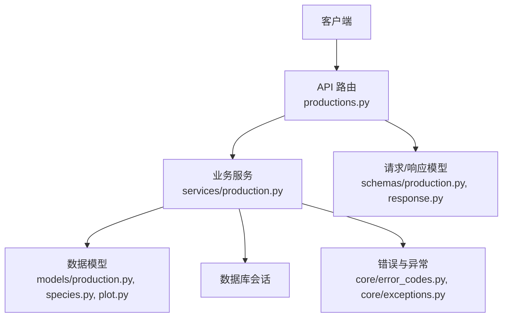
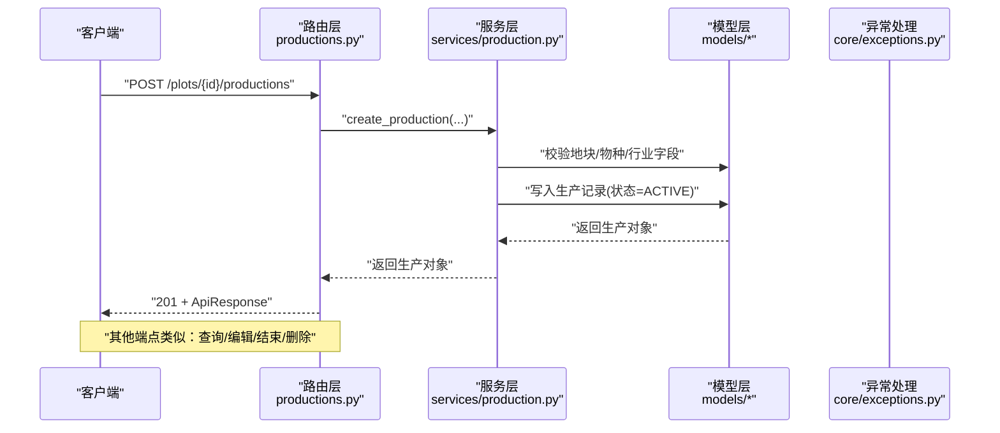
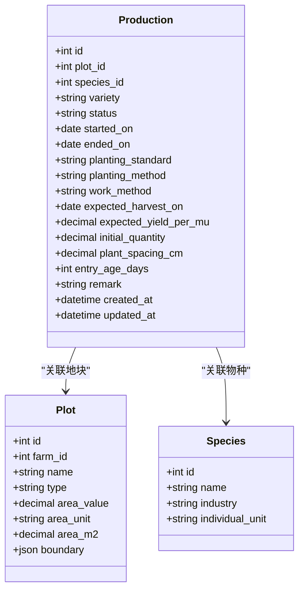
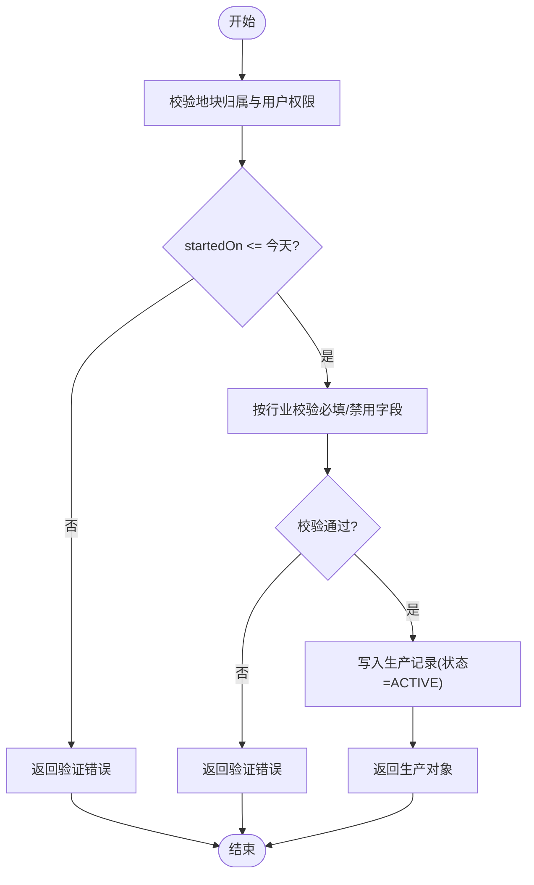
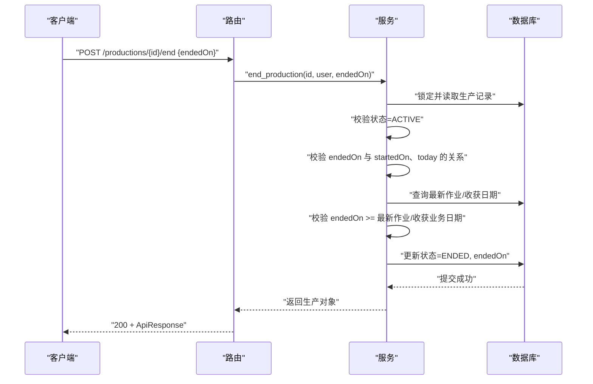
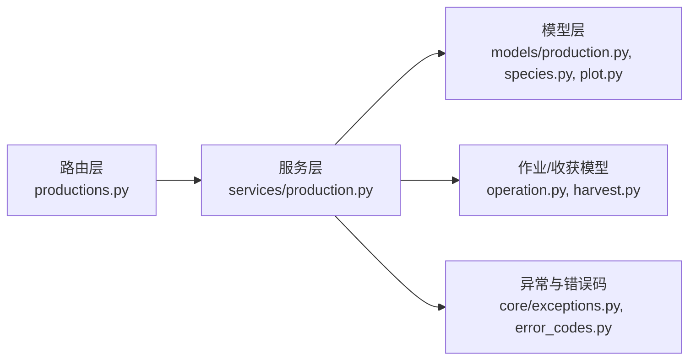
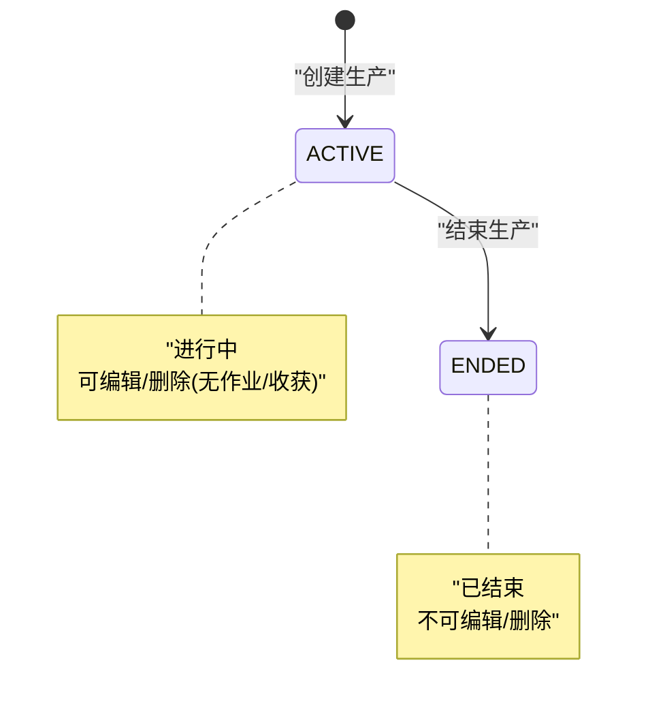

# 生产管理接口

<cite>
**本文引用的文件**
- [productions.py](file://apps/api/app/api/v1/endpoints/productions.py)
- [production.py（模型）](file://apps/api/app/models/production.py)
- [production.py（服务）](file://apps/api/app/services/production.py)
- [production.py（Schema）](file://apps/api/app/schemas/production.py)
- [species.py](file://apps/api/app/models/species.py)
- [plot.py](file://apps/api/app/models/plot.py)
- [response.py](file://apps/api/app/schemas/response.py)
- [error_codes.py](file://apps/api/app/core/error_codes.py)
- [exceptions.py](file://apps/api/app/core/exceptions.py)
- [test_productions.py](file://apps/api/tests/test_productions.py)
- [test_farm_productions.py](file://apps/api/tests/test_farm_productions.py)
</cite>

## 更新摘要
**变更内容**
- 新增农场级生产列表查询端点 GET /farms/{farm_id}/productions
- 支持按行业（industry）和状态（status）进行过滤
- 实现分页查询功能，支持 page 和 pageSize 参数
- 新增 FarmProductionResponse 和 FarmProductionPage Schema
- 完善权限验证，确保用户必须是农场成员才能访问

## 目录
1. [简介](#简介)
2. [项目结构](#项目结构)
3. [核心组件](#核心组件)
4. [架构总览](#架构总览)
5. [详细组件分析](#详细组件分析)
6. [依赖关系分析](#依赖关系分析)
7. [性能与一致性](#性能与一致性)
8. [故障排查指南](#故障排查指南)
9. [结论](#结论)
10. [附录：接口规范与示例](#附录接口规范与示例)

## 简介
本文件面向后端 API 使用者与集成方，系统化说明"生产管理"相关接口的能力边界、状态流转规则、数据模型与校验约束，并给出请求/响应结构与调用示例。重点覆盖：
- 生产生命周期管理：创建（开始）、编辑、结束、删除
- 状态流转控制：ACTIVE 到 ENDED 的转换规则与时序约束
- 生产详情查询：按地块分页查询、按 ID 查询、**按农场分页查询**
- 生产与地块、作业、收获的关联关系与约束
- 不同行业（种植、林业、畜牧、渔业）字段必填与禁用规则

## 项目结构
生产模块采用分层设计：
- 路由层：定义 HTTP 端点与参数绑定
- 服务层：实现业务逻辑、校验与事务性更新
- 模型层：定义数据库表结构与枚举
- Schema 层：定义请求/响应数据结构与序列化别名
- 异常与错误码：统一错误封装与处理



**图表来源**
- [productions.py:1-246](file://apps/api/app/api/v1/endpoints/productions.py#L1-L246)
- [production.py（服务）:1-486](file://apps/api/app/services/production.py#L1-L486)
- [production.py（模型）:1-87](file://apps/api/app/models/production.py#L1-L87)
- [species.py:1-35](file://apps/api/app/models/species.py#L1-L35)
- [plot.py:1-54](file://apps/api/app/models/plot.py#L1-L54)
- [response.py:1-40](file://apps/api/app/schemas/response.py#L1-L40)
- [error_codes.py:1-13](file://apps/api/app/core/error_codes.py#L1-L13)
- [exceptions.py:1-88](file://apps/api/app/core/exceptions.py#L1-L88)

**章节来源**
- [productions.py:1-246](file://apps/api/app/api/v1/endpoints/productions.py#L1-L246)
- [production.py（服务）:1-486](file://apps/api/app/services/production.py#L1-L486)

## 核心组件
- 路由端点：提供生产的全生命周期操作（创建、查询、编辑、结束、删除）
- 服务函数：负责权限校验、业务规则校验、并发安全（行级锁）、跨实体一致性（作业、收获）
- 数据模型：生产记录、物种、地块等实体及枚举
- Schema：统一的请求/响应结构，支持驼峰/下划线字段名互转
- 异常体系：统一错误码与响应格式

**章节来源**
- [productions.py:1-246](file://apps/api/app/api/v1/endpoints/productions.py#L1-L246)
- [production.py（服务）:1-486](file://apps/api/app/services/production.py#L1-L486)
- [production.py（模型）:1-87](file://apps/api/app/models/production.py#L1-L87)
- [production.py（Schema）:1-220](file://apps/api/app/schemas/production.py#L1-L220)
- [response.py:1-40](file://apps/api/app/schemas/response.py#L1-L40)
- [error_codes.py:1-13](file://apps/api/app/core/error_codes.py#L1-L13)
- [exceptions.py:1-88](file://apps/api/app/core/exceptions.py#L1-L88)

## 架构总览
下图展示了从客户端发起请求到返回响应的完整链路，包括权限校验、业务校验、数据持久化与异常处理。



**图表来源**
- [productions.py:148-177](file://apps/api/app/api/v1/endpoints/productions.py#L148-L177)
- [production.py（服务）:204-257](file://apps/api/app/services/production.py#L204-L257)
- [exceptions.py:35-44](file://apps/api/app/core/exceptions.py#L35-L44)

## 详细组件分析

### 生产数据模型与枚举
- 生产记录包含：地块、物种、品种、状态、起止日期、种植标准/方法/作业方式、预期采收期、预期亩产、初始数量、株距、苗龄、备注、时间戳
- 状态枚举：ACTIVE（进行中）、ENDED（已结束）
- 种植标准：NORMAL、GREEN、ORGANIC
- 种植方法：TRANSPLANT、DIRECT_SEEDING
- 作业方式：MANUAL、MECHANICAL
- 单位与行业：通过物种关联，决定字段约束



**图表来源**
- [production.py（模型）:43-87](file://apps/api/app/models/production.py#L43-L87)
- [species.py:27-35](file://apps/api/app/models/species.py#L27-L35)
- [plot.py:31-54](file://apps/api/app/models/plot.py#L31-L54)

**章节来源**
- [production.py（模型）:1-87](file://apps/api/app/models/production.py#L1-L87)
- [species.py:1-35](file://apps/api/app/models/species.py#L1-L35)
- [plot.py:1-54](file://apps/api/app/models/plot.py#L1-L54)

### 接口概览
- 创建生产（开始）：POST /api/v1/plots/{plot_id}/productions
- **按农场分页查询：GET /api/v1/farms/{farm_id}/productions**
- 按地块分页查询：GET /api/v1/plots/{plot_id}/productions?status=&page=&pageSize=
- 查询生产详情：GET /api/v1/productions/{production_id}
- 编辑生产：PATCH /api/v1/productions/{production_id}
- 结束生产：POST /api/v1/productions/{production_id}/end
- 删除生产：DELETE /api/v1/productions/{production_id}

**章节来源**
- [productions.py:74-246](file://apps/api/app/api/v1/endpoints/productions.py#L74-L246)

### 创建生产（开始）
- 功能：在指定地块上创建一条生产记录，默认状态为 ACTIVE
- 权限：当前用户必须属于该地块所属农场（成员或所有者）
- 校验：
  - startedOn 不得晚于今天
  - 根据物种所属行业进行字段必填/禁用校验
  - 数值型字段需满足范围与精度要求
- 返回：生产对象的详细信息（含物种名称、行业、单位等）



**图表来源**
- [production.py（服务）:204-257](file://apps/api/app/services/production.py#L204-L257)
- [production.py（服务）:63-103](file://apps/api/app/services/production.py#L63-L103)

**章节来源**
- [productions.py:148-177](file://apps/api/app/api/v1/endpoints/productions.py#L148-L177)
- [production.py（服务）:204-257](file://apps/api/app/services/production.py#L204-L257)
- [production.py（Schema）:15-71](file://apps/api/app/schemas/production.py#L15-L71)

### 按农场分页查询
- 功能：获取某农场下的所有生产记录，支持按行业（AGRICULTURE、FORESTRY、LIVESTOCK、FISHERY）和状态（ACTIVE、ENDED）过滤、分页
- 权限：当前用户必须属于该农场（成员或所有者）
- 排序：优先显示 ACTIVE，其次按开始时间倒序、ID 倒序
- 返回：分页结构 items/page/pageSize/total

**新增功能**
- 支持 industry 参数过滤：可按农业、林业、畜牧业、渔业分类查询
- 支持 status 参数过滤：可按进行中或已结束状态筛选
- 完整的分页支持：page（页码）和 pageSize（每页大小，1-100）

**章节来源**
- [productions.py:103-145](file://apps/api/app/api/v1/endpoints/productions.py#L103-L145)
- [production.py（服务）:142-178](file://apps/api/app/services/production.py#L142-L178)
- [production.py（Schema）:200-220](file://apps/api/app/schemas/production.py#L200-L220)

### 按地块分页查询
- 功能：获取某地块下的生产列表，支持按状态过滤、分页
- 排序：优先显示 ACTIVE，其次按开始时间倒序、ID 倒序
- 返回：分页结构 items/page/pageSize/total

**章节来源**
- [productions.py:74-100](file://apps/api/app/api/v1/endpoints/productions.py#L74-L100)
- [production.py（服务）:112-138](file://apps/api/app/services/production.py#L112-L138)
- [production.py（Schema）:193-198](file://apps/api/app/schemas/production.py#L193-L198)

### 查询生产详情
- 功能：根据生产 ID 获取单条生产记录
- 权限：当前用户必须属于该生产所在地块所属农场
- 返回：生产对象详细信息

**章节来源**
- [productions.py:179-190](file://apps/api/app/api/v1/endpoints/productions.py#L179-L190)
- [production.py（服务）:181-201](file://apps/api/app/services/production.py#L181-L201)

### 编辑生产
- 功能：修改生产记录的可变字段
- 限制：
  - 仅 ACTIVE 的生产可编辑
  - 若已存在作业或收获记录，则不允许修改核心字段（plotId、speciesId、startedOn）
  - 若修改地块，目标地块必须与当前地块同属一个农场
- 返回：更新后的生产对象

**章节来源**
- [productions.py:193-219](file://apps/api/app/api/v1/endpoints/productions.py#L193-L219)
- [production.py（服务）:260-365](file://apps/api/app/services/production.py#L260-L365)
- [production.py（Schema）:73-143](file://apps/api/app/schemas/production.py#L73-L143)

### 结束生产
- 功能：将 ACTIVE 的生产标记为 ENDED，并记录结束日期
- 约束：
  - 仅 ACTIVE 的生产可结束
  - endedOn 不得晚于今天且不得早于 startedOn
  - endedOn 不得早于任何关联作业或收获的业务日期
- 返回：结束后的生产对象



**图表来源**
- [productions.py:222-235](file://apps/api/app/api/v1/endpoints/productions.py#L222-L235)
- [production.py（服务）:403-445](file://apps/api/app/services/production.py#L403-L445)

**章节来源**
- [productions.py:222-235](file://apps/api/app/api/v1/endpoints/productions.py#L222-L235)
- [production.py（服务）:403-445](file://apps/api/app/services/production.py#L403-L445)

### 删除生产
- 功能：删除未结束的生产记录
- 限制：
  - 仅 ACTIVE 的生产可删除
  - 若存在作业或收获记录，禁止删除
- 返回：204 No Content

**章节来源**
- [productions.py:238-245](file://apps/api/app/api/v1/endpoints/productions.py#L238-L245)
- [production.py（服务）:368-400](file://apps/api/app/services/production.py#L368-L400)

### 行业字段校验规则
- 种植业（AGRICULTURE）：
  - 必填：plantingStandard、plantingMethod、workMethod
  - 禁用：entryAgeDays
- 林业（FORESTRY）：
  - 必填：plantingStandard、plantingMethod、workMethod、initialQuantity
  - 禁用：expectedYieldPerMu
- 畜牧业（LIVESTOCK）：
  - 必填：initialQuantity、entryAgeDays
  - 禁用：workMethod
- 渔业（FISHERY）：
  - 必填：initialQuantity、workMethod
  - 禁用：plantingStandard、plantingMethod、expectedHarvestOn、expectedYieldPerMu、plantSpacingCm

**章节来源**
- [production.py（服务）:63-103](file://apps/api/app/services/production.py#L63-L103)
- [test_productions.py:178-250](file://apps/api/tests/test_productions.py#L178-L250)

## 依赖关系分析
- 路由依赖服务函数，服务函数依赖模型与外部资源（数据库会话）
- 服务层对作业与收获进行一致性检查，避免时序冲突
- 权限通过地块所属农场成员关系进行校验



**图表来源**
- [productions.py:1-246](file://apps/api/app/api/v1/endpoints/productions.py#L1-L246)
- [production.py（服务）:1-486](file://apps/api/app/services/production.py#L1-L486)

**章节来源**
- [production.py（服务）:1-486](file://apps/api/app/services/production.py#L1-L486)

## 性能与一致性
- 查询优化：按状态优先排序、使用 COUNT 统计总数、分页 offset/limit
- 并发安全：编辑与结束操作使用行级锁（with_for_update）防止竞态
- 事务性：所有写操作在会话内提交，确保一致性
- 索引：生产记录对 plot_id、species_id 建立索引，提升查询效率

**章节来源**
- [production.py（服务）:112-138](file://apps/api/app/services/production.py#L112-L138)
- [production.py（服务）:260-285](file://apps/api/app/services/production.py#L260-L285)
- [production.py（模型）:47-58](file://apps/api/app/models/production.py#L47-L58)

## 故障排查指南
- 404 未找到：生产或地块不存在，或当前用户无权限访问
- 409 业务冲突：
  - 已结束的生产不可编辑或删除
  - 重复结束同一生产
  - 尝试跨农场移动地块
  - 已有作业或收获时修改核心字段
- 422 验证错误：
  - startedOn/endedOn 日期越界
  - 行业字段缺失或不应出现
  - 数值类型或范围不合法（如非整数数量）
  - 无效的 industry 参数值
- 500 内部错误：系统异常

**章节来源**
- [exceptions.py:35-88](file://apps/api/app/core/exceptions.py#L35-L88)
- [error_codes.py:1-13](file://apps/api/app/core/error_codes.py#L1-L13)
- [production.py（服务）:28-61](file://apps/api/app/services/production.py#L28-L61)
- [test_productions.py:315-412](file://apps/api/tests/test_productions.py#L315-L412)

## 结论
生产模块提供了完整的生命周期管理能力，并通过严格的行业字段校验、日期时序约束与并发安全机制，确保数据的正确性与一致性。新增的农场级生产列表查询功能进一步增强了数据检索能力，支持按行业和状态进行精细化筛选，便于农场级别的生产和业务分析。接口设计清晰，错误处理统一，便于前端与第三方系统集成。

## 附录：接口规范与示例

### 通用响应结构
- 成功：{ success: true, data: <具体数据>, error: null }
- 失败：{ success: false, data: null, error: { code, message, details } }

**章节来源**
- [response.py:16-39](file://apps/api/app/schemas/response.py#L16-L39)

### 创建生产（开始）
- 路径：POST /api/v1/plots/{plot_id}/productions
- 请求体关键字段（支持驼峰/下划线）：
  - speciesId：物种 ID（必填）
  - startedOn：开始日期（必填，不得晚于今天）
  - 行业相关字段：plantingStandard、plantingMethod、workMethod、initialQuantity、entryAgeDays、expectedHarvestOn、expectedYieldPerMu、plantSpacingCm
- 响应：ProductionResponse

**章节来源**
- [production.py（Schema）:15-71](file://apps/api/app/schemas/production.py#L15-L71)
- [production.py（服务）:204-257](file://apps/api/app/services/production.py#L204-L257)

### 按农场分页查询
- 路径：GET /api/v1/farms/{farm_id}/productions
- 查询参数：
  - industry：可选，过滤行业（AGRICULTURE、FORESTRY、LIVESTOCK、FISHERY）
  - status：可选，过滤状态（ACTIVE、ENDED）
  - page：页码（>=1）
  - pageSize：每页大小（1-100）
- 响应：FarmProductionPage（items/page/pageSize/total）
- 权限：当前用户必须是该农场的成员

**新增功能**
- 支持多条件组合过滤：可同时按行业和状态筛选
- 智能排序：ACTIVE 状态优先，同状态按开始时间倒序
- 农场级权限控制：只有农场成员才能访问

**章节来源**
- [productions.py:103-145](file://apps/api/app/api/v1/endpoints/productions.py#L103-L145)
- [production.py（服务）:142-178](file://apps/api/app/services/production.py#L142-L178)
- [production.py（Schema）:200-220](file://apps/api/app/schemas/production.py#L200-L220)

### 按地块分页查询
- 路径：GET /api/v1/plots/{plot_id}/productions
- 查询参数：
  - status：可选，过滤状态
  - page：页码（>=1）
  - pageSize：每页大小（1-100）
- 响应：ProductionPage（items/page/pageSize/total）

**章节来源**
- [productions.py:74-100](file://apps/api/app/api/v1/endpoints/productions.py#L74-L100)
- [production.py（Schema）:193-198](file://apps/api/app/schemas/production.py#L193-L198)

### 查询生产详情
- 路径：GET /api/v1/productions/{production_id}
- 响应：ProductionResponse

**章节来源**
- [productions.py:179-190](file://apps/api/app/api/v1/endpoints/productions.py#L179-L190)

### 编辑生产
- 路径：PATCH /api/v1/productions/{production_id}
- 请求体：部分更新字段（支持驼峰/下划线），核心字段（plotId、speciesId、startedOn）在有作业或收获时不可改
- 响应：ProductionResponse

**章节来源**
- [production.py（Schema）:73-143](file://apps/api/app/schemas/production.py#L73-L143)
- [production.py（服务）:260-365](file://apps/api/app/services/production.py#L260-L365)

### 结束生产
- 路径：POST /api/v1/productions/{production_id}/end
- 请求体：endedOn（可选，默认当天；不得晚于今天且不得早于 startedOn；不得早于任何作业/收获业务日期）
- 响应：ProductionResponse（状态变为 ENDED）

**章节来源**
- [production.py（Schema）:146-151](file://apps/api/app/schemas/production.py#L146-L151)
- [production.py（服务）:403-445](file://apps/api/app/services/production.py#L403-L445)

### 删除生产
- 路径：DELETE /api/v1/productions/{production_id}
- 响应：204 No Content

**章节来源**
- [productions.py:238-245](file://apps/api/app/api/v1/endpoints/productions.py#L238-L245)

### 状态流转图


**图表来源**
- [production.py（模型）:13-15](file://apps/api/app/models/production.py#L13-L15)
- [production.py（服务）:403-445](file://apps/api/app/services/production.py#L403-L445)

### 生产与地块、作业、收获的关联关系
- 生产属于某个地块，地块属于某个农场
- 权限基于农场成员关系进行校验
- 作业与收获记录影响生产的编辑与删除限制，以及结束日期的下限

**章节来源**
- [production.py（服务）:181-201](file://apps/api/app/services/production.py#L181-L201)
- [production.py（服务）:289-316](file://apps/api/app/services/production.py#L289-L316)
- [production.py（服务）:383-397](file://apps/api/app/services/production.py#L383-L397)

### 农场级生产查询示例

#### 查询农场所有生产
```http
GET /api/v1/farms/123/productions?page=1&pageSize=20
```

#### 按行业过滤查询
```http
GET /api/v1/farms/123/productions?industry=AGRICULTURE&page=1&pageSize=20
```

#### 按状态过滤查询
```http
GET /api/v1/farms/123/productions?status=ACTIVE&page=1&pageSize=20
```

#### 组合条件查询
```http
GET /api/v1/farms/123/productions?industry=FISHERY&status=ACTIVE&page=1&pageSize=20
```

**章节来源**
- [test_farm_productions.py:163-280](file://apps/api/tests/test_farm_productions.py#L163-L280)