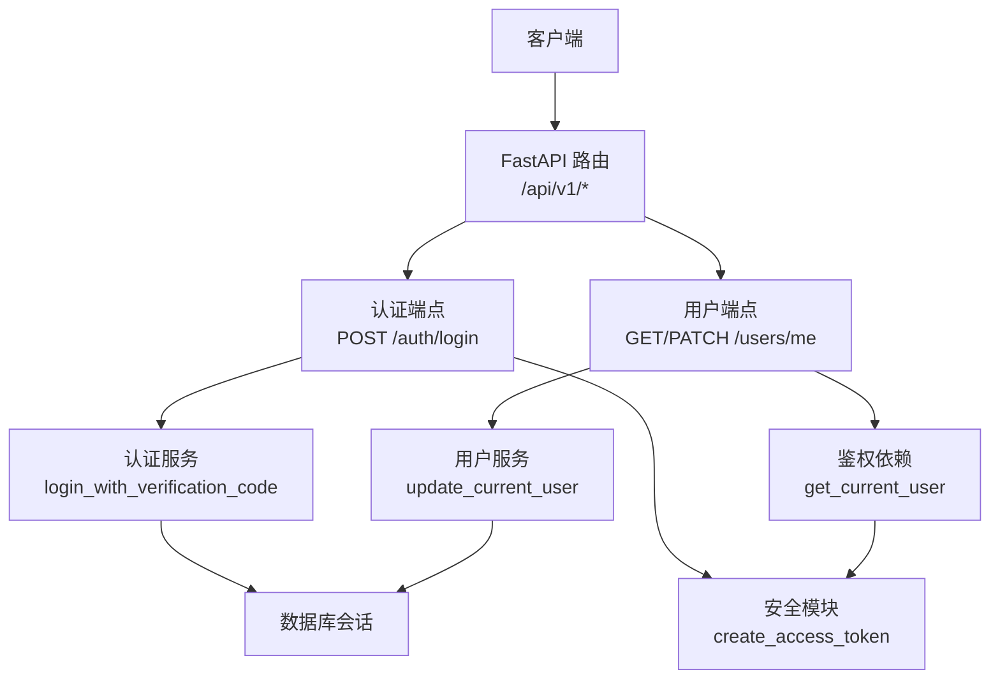
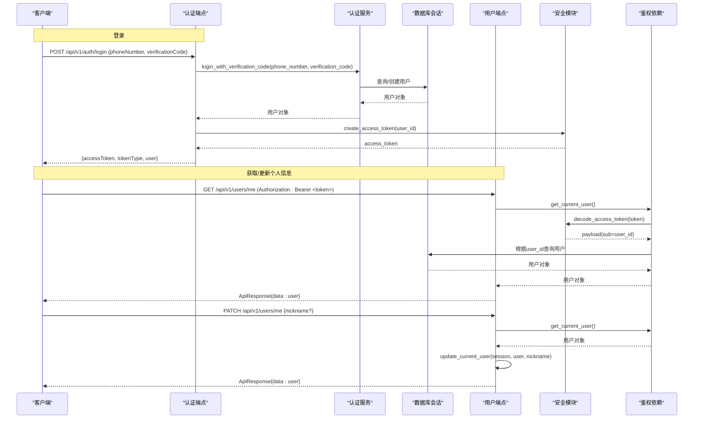
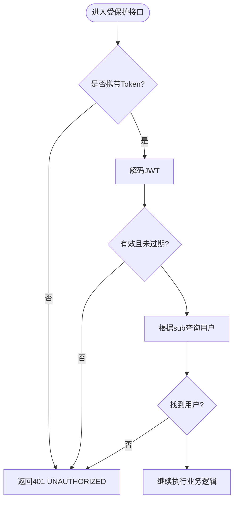
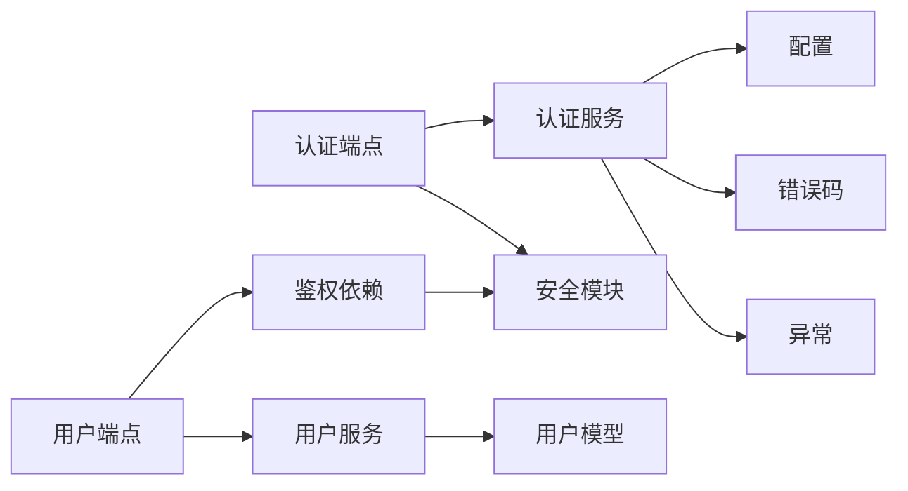

# 用户管理接口

<cite>
**本文引用的文件**
- [apps/api/app/api/v1/endpoints/users.py](file://apps/api/app/api/v1/endpoints/users.py)
- [apps/api/app/api/v1/endpoints/auth.py](file://apps/api/app/api/v1/endpoints/auth.py)
- [apps/api/app/schemas/user.py](file://apps/api/app/schemas/user.py)
- [apps/api/app/schemas/response.py](file://apps/api/app/schemas/response.py)
- [apps/api/app/services/user.py](file://apps/api/app/services/user.py)
- [apps/api/app/services/auth.py](file://apps/api/app/services/auth.py)
- [apps/api/app/models/user.py](file://apps/api/app/models/user.py)
- [apps/api/app/core/security.py](file://apps/api/app/core/security.py)
- [apps/api/app/api/deps.py](file://apps/api/app/api/deps.py)
- [apps/api/app/core/config.py](file://apps/api/app/core/config.py)
- [apps/api/app/core/error_codes.py](file://apps/api/app/core/error_codes.py)
- [apps/api/app/core/exceptions.py](file://apps/api/app/core/exceptions.py)
</cite>

## 目录
1. [简介](#简介)
2. [项目结构](#项目结构)
3. [核心组件](#核心组件)
4. [架构总览](#架构总览)
5. [详细接口规范](#详细接口规范)
6. [依赖关系分析](#依赖关系分析)
7. [性能与扩展性](#性能与扩展性)
8. [故障排查指南](#故障排查指南)
9. [结论](#结论)
10. [附录](#附录)

## 简介
本文件面向 Pocket Farm 后端 API，聚焦“用户管理”相关能力，包括：
- 用户认证登录（短信验证码）
- 获取当前用户信息
- 更新当前用户个人资料（昵称）
- 统一响应格式、错误码与异常处理
- 权限控制（基于 JWT Bearer Token）
- 数据模型与字段说明
- 隐私保护与数据安全建议

该文档以代码为依据，提供请求/响应示例、参数校验规则、业务规则与安全注意事项，帮助前后端团队快速对接。

## 项目结构
与用户管理相关的核心路径与职责：
- 路由层：定义 HTTP 端点与入参出参
  - /api/v1/auth/login：手机号 + 验证码登录
  - /api/v1/users/me：获取当前用户信息
  - /api/v1/users/me：PATCH 更新当前用户昵称
- 服务层：封装领域逻辑（登录、资料更新）
- 模型层：用户实体映射数据库表
- 安全层：JWT 签发与校验、鉴权依赖
- 配置层：JWT 密钥、过期时间等
- 响应与异常：统一响应体、全局异常处理器

图表来源
- [apps/api/app/api/v1/endpoints/auth.py:1-29](file://apps/api/app/api/v1/endpoints/auth.py#L1-L29)
- [apps/api/app/api/v1/endpoints/users.py:1-30](file://apps/api/app/api/v1/endpoints/users.py#L1-L30)
- [apps/api/app/services/auth.py:1-47](file://apps/api/app/services/auth.py#L1-L47)
- [apps/api/app/services/user.py:1-16](file://apps/api/app/services/user.py#L1-L16)
- [apps/api/app/core/security.py:1-29](file://apps/api/app/core/security.py#L1-L29)
- [apps/api/app/api/deps.py:1-66](file://apps/api/app/api/deps.py#L1-L66)

章节来源
- [apps/api/app/api/v1/endpoints/auth.py:1-29](file://apps/api/app/api/v1/endpoints/auth.py#L1-L29)
- [apps/api/app/api/v1/endpoints/users.py:1-30](file://apps/api/app/api/v1/endpoints/users.py#L1-L30)

## 核心组件
- 数据模型
  - 用户实体：包含 id、手机号、昵称、创建与更新时间
- 请求/响应模式
  - 登录请求：手机号、验证码
  - 登录响应：访问令牌、令牌类型、用户信息
  - 用户信息响应：id、手机号、昵称
  - 更新用户请求：昵称（可选）
  - 统一响应体：success/data/error
- 安全与鉴权
  - JWT 签发与解码
  - Bearer Token 鉴权依赖
- 服务层
  - 登录：校验验证码（测试模式或真实验证码），不存在则自动创建用户
  - 更新用户：仅允许更新昵称
- 配置
  - JWT 密钥、算法、过期时间
  - 测试登录开关与验证码

章节来源
- [apps/api/app/models/user.py:1-28](file://apps/api/app/models/user.py#L1-L28)
- [apps/api/app/schemas/user.py:1-34](file://apps/api/app/schemas/user.py#L1-L34)
- [apps/api/app/schemas/response.py:1-40](file://apps/api/app/schemas/response.py#L1-L40)
- [apps/api/app/core/security.py:1-29](file://apps/api/app/core/security.py#L1-L29)
- [apps/api/app/api/deps.py:1-66](file://apps/api/app/api/deps.py#L1-L66)
- [apps/api/app/services/auth.py:1-47](file://apps/api/app/services/auth.py#L1-L47)
- [apps/api/app/services/user.py:1-16](file://apps/api/app/services/user.py#L1-L16)
- [apps/api/app/core/config.py:1-23](file://apps/api/app/core/config.py#L1-L23)

## 架构总览
下图展示从客户端到数据库的完整调用链，涵盖认证与用户资料更新流程。

图表来源
- [apps/api/app/api/v1/endpoints/auth.py:1-29](file://apps/api/app/api/v1/endpoints/auth.py#L1-L29)
- [apps/api/app/services/auth.py:1-47](file://apps/api/app/services/auth.py#L1-L47)
- [apps/api/app/core/security.py:1-29](file://apps/api/app/core/security.py#L1-L29)
- [apps/api/app/api/deps.py:1-66](file://apps/api/app/api/deps.py#L1-L66)
- [apps/api/app/api/v1/endpoints/users.py:1-30](file://apps/api/app/api/v1/endpoints/users.py#L1-L30)
- [apps/api/app/services/user.py:1-16](file://apps/api/app/services/user.py#L1-L16)

## 详细接口规范

### 通用约定
- 基础路径：/api/v1
- 认证方式：Bearer Token（Authorization: Bearer <access_token>）
- 统一响应体：ApiResponse
  - success: 布尔
  - data: 业务数据（可为空）
  - error: 错误详情（code/message/details）
- 日期时间：服务端使用 UTC 时间存储；前端按本地时区显示
- 字段命名：响应中使用驼峰命名（如 phoneNumber、accessToken、tokenType）

章节来源
- [apps/api/app/schemas/response.py:1-40](file://apps/api/app/schemas/response.py#L1-L40)
- [apps/api/app/schemas/user.py:1-34](file://apps/api/app/schemas/user.py#L1-L34)
- [apps/api/app/core/config.py:1-23](file://apps/api/app/core/config.py#L1-L23)

### 接口一：登录（手机号 + 验证码）
- 方法：POST
- 路径：/api/v1/auth/login
- 权限：无需登录
- 请求体
  - phoneNumber: 字符串，必填，11位中国大陆手机号格式
  - verificationCode: 字符串，必填，长度 1~20
- 成功响应
  - accessToken: 字符串
  - tokenType: 字符串，默认 bearer
  - user: 用户对象
    - id: 整数
    - phoneNumber: 字符串
    - nickname: 字符串或空
- 失败场景
  - 验证码无效或未开启测试登录：401 UNAUTHORIZED
  - 数据库冲突（并发创建）：409 BUSINESS_CONFLICT
  - 请求校验失败：422 VALIDATION_ERROR
- 业务规则
  - 若未启用测试登录或验证码不匹配，直接拒绝
  - 若手机号不存在则自动创建新用户
  - 返回新签发的访问令牌

请求示例
- 请求头：无
- 请求体：
  - phoneNumber: "13800138000"
  - verificationCode: "8888"（测试环境）

响应示例
- 成功：
  - success: true
  - data:
    - accessToken: "<jwt>"
    - tokenType: "bearer"
    - user:
      - id: 1
      - phoneNumber: "13800138000"
      - nickname: null
- 失败（验证码无效）：
  - success: false
  - error:
    - code: "UNAUTHORIZED"
    - message: "Invalid phone number or verification code."

章节来源
- [apps/api/app/api/v1/endpoints/auth.py:1-29](file://apps/api/app/api/v1/endpoints/auth.py#L1-L29)
- [apps/api/app/services/auth.py:1-47](file://apps/api/app/services/auth.py#L1-L47)
- [apps/api/app/schemas/user.py:1-34](file://apps/api/app/schemas/user.py#L1-L34)
- [apps/api/app/core/error_codes.py:1-13](file://apps/api/app/core/error_codes.py#L1-L13)

### 接口二：获取当前用户信息
- 方法：GET
- 路径：/api/v1/users/me
- 权限：需要登录（Bearer Token）
- 请求头：Authorization: Bearer <access_token>
- 成功响应
  - data: 用户对象
    - id: 整数
    - phoneNumber: 字符串
    - nickname: 字符串或空
- 失败场景
  - 未携带或无效 Token：401 UNAUTHORIZED
  - 请求校验失败：422 VALIDATION_ERROR

请求示例
- 请求头：Authorization: Bearer <jwt>

响应示例
- 成功：
  - success: true
  - data:
    - id: 1
    - phoneNumber: "13800138000"
    - nickname: "小明"

章节来源
- [apps/api/app/api/v1/endpoints/users.py:1-30](file://apps/api/app/api/v1/endpoints/users.py#L1-L30)
- [apps/api/app/api/deps.py:1-66](file://apps/api/app/api/deps.py#L1-L66)
- [apps/api/app/schemas/user.py:1-34](file://apps/api/app/schemas/user.py#L1-L34)

### 接口三：更新当前用户昵称
- 方法：PATCH
- 路径：/api/v1/users/me
- 权限：需要登录（Bearer Token）
- 请求体
  - nickname: 字符串，可选，最大长度 50
- 成功响应
  - data: 更新后的用户对象
- 失败场景
  - 未携带或无效 Token：401 UNAUTHORIZED
  - 请求校验失败：422 VALIDATION_ERROR
- 业务规则
  - 仅允许更新昵称字段
  - 更新后刷新并返回最新数据

请求示例
- 请求头：Authorization: Bearer <jwt>
- 请求体：
  - nickname: "小华"

响应示例
- 成功：
  - success: true
  - data:
    - id: 1
    - phoneNumber: "13800138000"
    - nickname: "小华"

章节来源
- [apps/api/app/api/v1/endpoints/users.py:1-30](file://apps/api/app/api/v1/endpoints/users.py#L1-L30)
- [apps/api/app/services/user.py:1-16](file://apps/api/app/services/user.py#L1-L16)
- [apps/api/app/schemas/user.py:1-34](file://apps/api/app/schemas/user.py#L1-L34)

### 数据模型与字段说明
- 用户实体
  - id: 自增主键（BIGINT）
  - phone_number: 唯一索引，非空，最大长度 20
  - nickname: 可空，最大长度 50
  - created_at: 创建时间（UTC）
  - updated_at: 更新时间（UTC）
- 响应字段别名
  - phoneNumber、accessToken、tokenType 为序列化别名，便于前端使用驼峰命名

章节来源
- [apps/api/app/models/user.py:1-28](file://apps/api/app/models/user.py#L1-L28)
- [apps/api/app/schemas/user.py:1-34](file://apps/api/app/schemas/user.py#L1-L34)

### 权限与鉴权流程
- 所有受保护接口需携带 Authorization: Bearer <access_token>
- 鉴权依赖会：
  - 解析并验证 JWT
  - 校验 sub 为用户 ID
  - 根据 ID 查询用户，不存在视为无效 Token
- 登录成功后由服务端签发 JWT，包含 sub、iat、exp

图表来源
- [apps/api/app/api/deps.py:1-66](file://apps/api/app/api/deps.py#L1-L66)
- [apps/api/app/core/security.py:1-29](file://apps/api/app/core/security.py#L1-L29)

章节来源
- [apps/api/app/api/deps.py:1-66](file://apps/api/app/api/deps.py#L1-L66)
- [apps/api/app/core/security.py:1-29](file://apps/api/app/core/security.py#L1-L29)

## 依赖关系分析
- 路由依赖
  - 认证端点依赖：数据库会话、认证服务、安全模块
  - 用户端点依赖：数据库会话、鉴权依赖、用户服务
- 服务依赖
  - 认证服务：配置（测试登录开关）、错误码、异常、用户模型
  - 用户服务：用户模型、数据库会话
- 安全与配置
  - JWT 算法、密钥、过期时间来自配置
  - 鉴权依赖负责 Token 校验与用户加载

图表来源
- [apps/api/app/api/v1/endpoints/auth.py:1-29](file://apps/api/app/api/v1/endpoints/auth.py#L1-L29)
- [apps/api/app/api/v1/endpoints/users.py:1-30](file://apps/api/app/api/v1/endpoints/users.py#L1-L30)
- [apps/api/app/services/auth.py:1-47](file://apps/api/app/services/auth.py#L1-L47)
- [apps/api/app/services/user.py:1-16](file://apps/api/app/services/user.py#L1-L16)
- [apps/api/app/core/config.py:1-23](file://apps/api/app/core/config.py#L1-L23)
- [apps/api/app/core/error_codes.py:1-13](file://apps/api/app/core/error_codes.py#L1-L13)
- [apps/api/app/core/exceptions.py:1-88](file://apps/api/app/core/exceptions.py#L1-L88)

章节来源
- [apps/api/app/api/v1/endpoints/auth.py:1-29](file://apps/api/app/api/v1/endpoints/auth.py#L1-L29)
- [apps/api/app/api/v1/endpoints/users.py:1-30](file://apps/api/app/api/v1/endpoints/users.py#L1-L30)
- [apps/api/app/services/auth.py:1-47](file://apps/api/app/services/auth.py#L1-L47)
- [apps/api/app/services/user.py:1-16](file://apps/api/app/services/user.py#L1-L16)
- [apps/api/app/core/config.py:1-23](file://apps/api/app/core/config.py#L1-L23)
- [apps/api/app/core/error_codes.py:1-13](file://apps/api/app/core/error_codes.py#L1-L13)
- [apps/api/app/core/exceptions.py:1-88](file://apps/api/app/core/exceptions.py#L1-L88)

## 性能与扩展性
- 登录流程
  - 首次登录可能触发用户创建，注意并发下的唯一约束冲突处理（已实现回滚与重试查询）
- 鉴权开销
  - 每次受保护请求均需解码 JWT 并查询用户，建议在网关层做缓存或缩短 Token 生命周期配合刷新机制
- 可扩展点
  - 增加更多用户资料字段（头像、性别、生日等）时需同步更新 Schema 与服务层
  - 引入角色/权限体系后可在鉴权依赖中增强授权判断
  - 对敏感字段（如手机号）可在响应层进行脱敏输出

[本节为通用指导，不直接分析具体文件]

## 故障排查指南
- 401 UNAUTHORIZED
  - 未携带 Token 或 Token 无效/过期
  - 检查 Authorization 头格式与 Token 内容
  - 确认 JWT 密钥与算法配置一致
- 409 BUSINESS_CONFLICT
  - 并发登录导致用户创建冲突
  - 服务层已处理并发并返回明确错误，可提示用户稍后重试
- 422 VALIDATION_ERROR
  - 请求体字段不符合校验规则（如手机号格式、长度限制）
  - 检查请求体字段名与大小写（支持别名）
- 500 INTERNAL_SERVER_ERROR
  - 内部异常，查看服务端日志定位

章节来源
- [apps/api/app/core/error_codes.py:1-13](file://apps/api/app/core/error_codes.py#L1-L13)
- [apps/api/app/core/exceptions.py:1-88](file://apps/api/app/core/exceptions.py#L1-L88)

## 结论
本项目提供了最小可用的用户管理能力：通过手机号 + 验证码完成登录，登录后即可获取和更新当前用户昵称。系统采用统一的响应体与异常处理，鉴权基于 JWT，具备清晰的错误码与可扩展的服务层设计。后续可按需扩展更多用户资料字段与权限控制。

[本节为总结性内容，不直接分析具体文件]

## 附录

### 隐私保护与数据安全建议
- 传输安全
  - 生产环境强制 HTTPS，避免明文传输 Token 与手机号
- 令牌安全
  - 合理设置 Token 过期时间（当前为 7 天），结合刷新机制降低泄露风险
  - 禁止将 Token 写入 URL、日志或前端持久化存储中
- 数据最小化
  - 响应中仅返回必要字段；如需对外暴露手机号，考虑脱敏
- 输入校验
  - 严格校验手机号格式与长度，防止注入与越界
- 审计与风控
  - 记录登录与修改行为日志（IP、时间、结果），用于异常检测与合规审计
- 配置安全
  - JWT 密钥通过环境变量或密钥管理服务注入，禁止硬编码

[本节为通用指导，不直接分析具体文件]