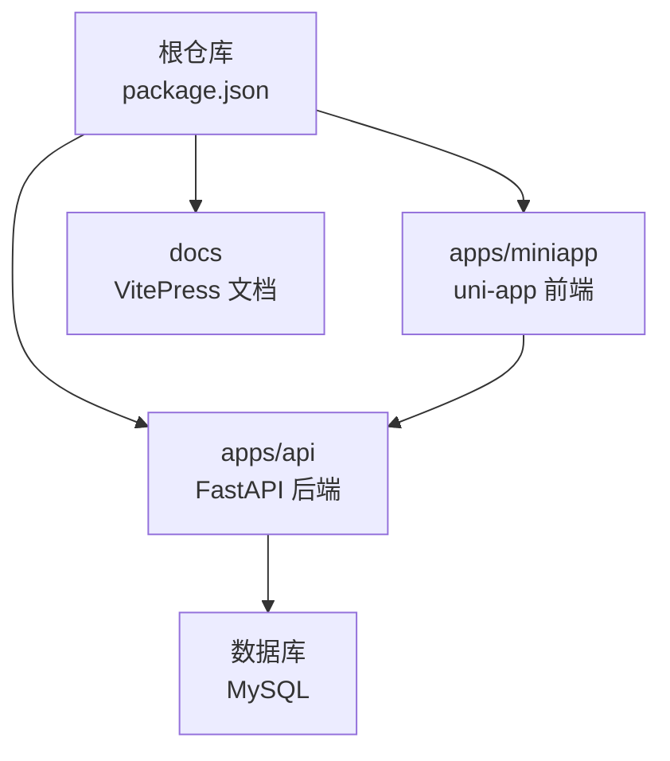
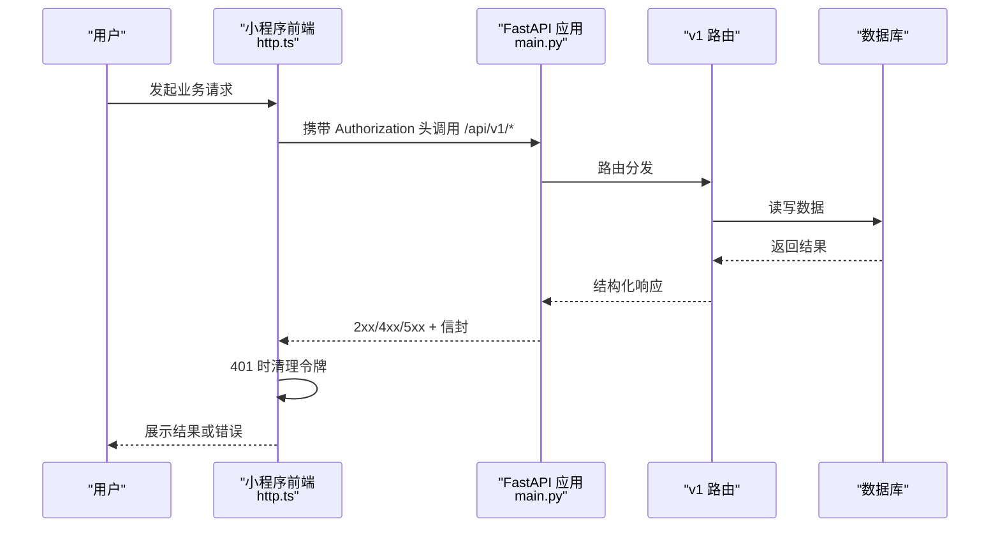
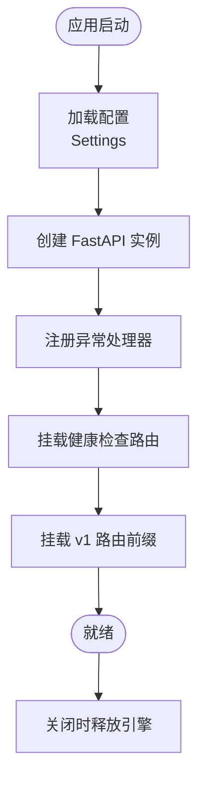
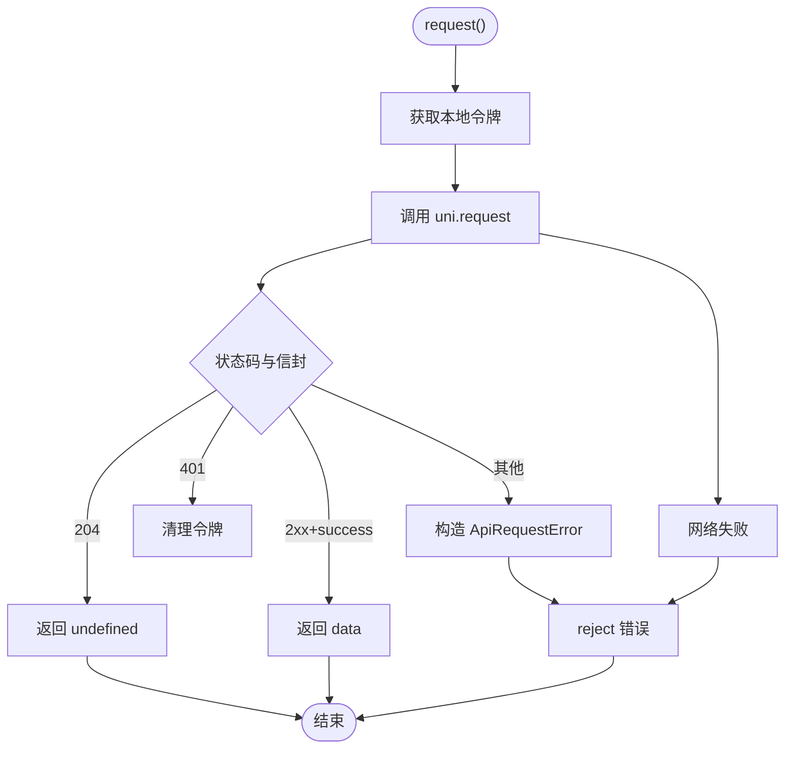
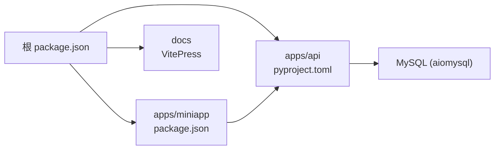

# 开发指南

<cite>
**本文引用的文件**
- [apps/api/pyproject.toml](file://apps/api/pyproject.toml)
- [apps/api/app/main.py](file://apps/api/app/main.py)
- [apps/api/app/core/config.py](file://apps/api/app/core/config.py)
- [apps/miniapp/package.json](file://apps/miniapp/package.json)
- [apps/miniapp/tsconfig.json](file://apps/miniapp/tsconfig.json)
- [package.json](file://package.json)
- [pnpm-workspace.yaml](file://pnpm-workspace.yaml)
- [apps/miniapp/src/services/http.ts](file://apps/miniapp/src/services/http.ts)
- [apps/api/tests/conftest.py](file://apps/api/tests/conftest.py)
</cite>

## 目录
1. [简介](#简介)
2. [项目结构](#项目结构)
3. [核心组件](#核心组件)
4. [架构总览](#架构总览)
5. [详细组件分析](#详细组件分析)
6. [依赖分析](#依赖分析)
7. [性能考虑](#性能考虑)
8. [故障排查指南](#故障排查指南)
9. [结论](#结论)
10. [附录](#附录)

## 简介
本指南面向 Pocket Farm 项目的开发者，覆盖 Python（后端 API）与 TypeScript/Vue（小程序前端）的编码规范、命名约定、注释标准、Git 工作流与分支策略、代码审查流程、开发工具配置、调试技巧、性能分析方法，以及新功能开发与贡献流程的最佳实践。目标是帮助团队以一致的方式高效协作与维护代码。

## 项目结构
Pocket Farm 采用 monorepo 组织方式：
- apps/api：FastAPI 后端服务，使用 SQLAlchemy + Alembic 管理数据库模型与迁移，Pydantic Settings 管理配置，Ruff 进行代码检查，Pytest 进行测试。
- apps/miniapp：基于 uni-app + Vue3 + TypeScript 的小程序前端，提供多端构建脚本与类型检查。
- docs：VitePress 文档站点。
- 根级 package.json：统一编排文档、API 与小程序的开发与构建命令；pnpm workspace 管理子包。

**图表来源**
- [package.json:1-32](file://package.json#L1-L32)
- [apps/api/app/main.py:1-28](file://apps/api/app/main.py#L1-L28)
- [apps/miniapp/package.json:1-73](file://apps/miniapp/package.json#L1-L73)

**章节来源**
- [package.json:1-32](file://package.json#L1-L32)
- [pnpm-workspace.yaml:1-7](file://pnpm-workspace.yaml#L1-L7)

## 核心组件
- 后端应用入口与路由挂载：应用启动时注册异常处理器与健康检查路由，并挂载 v1 API 路由前缀。
- 配置管理：通过 Pydantic Settings 从环境变量或 .env 加载配置，包括数据库连接、JWT 密钥、API 前缀等。
- 前端 HTTP 客户端：封装 uni.request，统一处理鉴权头、错误信封、401 清理令牌、204 空响应等。
- 测试夹具：为测试准备数据库连接与数据清理，确保用例隔离与可重复执行。

**章节来源**
- [apps/api/app/main.py:1-28](file://apps/api/app/main.py#L1-L28)
- [apps/api/app/core/config.py:1-23](file://apps/api/app/core/config.py#L1-L23)
- [apps/miniapp/src/services/http.ts:1-106](file://apps/miniapp/src/services/http.ts#L1-L106)
- [apps/api/tests/conftest.py:1-72](file://apps/api/tests/conftest.py#L1-L72)

## 架构总览
后端采用 FastAPI 分层：路由层 -> 服务层 -> 数据访问层（SQLAlchemy）。前端通过统一的 HTTP 客户端调用后端 API，并在 401 时清理本地令牌。

**图表来源**
- [apps/miniapp/src/services/http.ts:1-106](file://apps/miniapp/src/services/http.ts#L1-L106)
- [apps/api/app/main.py:1-28](file://apps/api/app/main.py#L1-L28)

## 详细组件分析

### 后端应用与配置
- 应用生命周期：在 lifespan 中释放数据库引擎资源，避免句柄泄漏。
- 路由装配：健康检查与 v1 API 路由按配置前缀挂载。
- 配置项：应用名、调试开关、API 前缀、数据库 URL、JWT 密钥与算法、过期时间、时区、测试登录开关等。

**图表来源**
- [apps/api/app/main.py:1-28](file://apps/api/app/main.py#L1-L28)
- [apps/api/app/core/config.py:1-23](file://apps/api/app/core/config.py#L1-L23)

**章节来源**
- [apps/api/app/main.py:1-28](file://apps/api/app/main.py#L1-L28)
- [apps/api/app/core/config.py:1-23](file://apps/api/app/core/config.py#L1-L23)

### 前端 HTTP 客户端
- 统一基地址：优先使用环境变量，否则回退到本地开发地址。
- 请求封装：自动附加 Authorization 头，处理 204 空响应、成功信封、错误信封与网络失败。
- 鉴权清理：遇到 401 时清除本地令牌，促使重新登录。

**图表来源**
- [apps/miniapp/src/services/http.ts:1-106](file://apps/miniapp/src/services/http.ts#L1-L106)

**章节来源**
- [apps/miniapp/src/services/http.ts:1-106](file://apps/miniapp/src/services/http.ts#L1-L106)

### 测试基础设施
- 环境变量：设置数据库连接与 JWT 密钥，保证测试环境一致性。
- 数据清理：在每个测试结束后清理测试产生的用户、农场、地块、生产记录与作业，避免污染。

**章节来源**
- [apps/api/tests/conftest.py:1-72](file://apps/api/tests/conftest.py#L1-L72)

## 依赖分析
- 根工作区：通过 pnpm workspace 管理 apps/miniapp 与未来 packages。
- 后端依赖：FastAPI、SQLAlchemy、Alembic、Pydantic Settings、PyJWT、uvicorn、aiomysql 等。
- 前端依赖：uni-app 全家桶、Vue3、TypeScript、Vite、Sass 等。
- 根脚本：统一文档、API 与小程序的开发与构建命令。

**图表来源**
- [package.json:1-32](file://package.json#L1-L32)
- [apps/api/pyproject.toml:1-35](file://apps/api/pyproject.toml#L1-L35)
- [apps/miniapp/package.json:1-73](file://apps/miniapp/package.json#L1-L73)

**章节来源**
- [package.json:1-32](file://package.json#L1-L32)
- [pnpm-workspace.yaml:1-7](file://pnpm-workspace.yaml#L1-L7)
- [apps/api/pyproject.toml:1-35](file://apps/api/pyproject.toml#L1-L35)
- [apps/miniapp/package.json:1-73](file://apps/miniapp/package.json#L1-L73)

## 性能考虑
- 后端
  - 使用异步数据库驱动与连接池，避免阻塞事件循环。
  - 合理设置 JWT 过期时间与缓存策略，减少频繁鉴权开销。
  - 对热点查询添加必要索引，避免全表扫描。
- 前端
  - 合理使用 uni.request 并发与重试策略，避免雪崩。
  - 对列表页启用分页与懒加载，减少首屏压力。
  - 利用 Vite 与 uni-app 的构建优化，按需引入与压缩资源。

[本节为通用指导，不直接分析具体文件]

## 故障排查指南
- 后端
  - 配置问题：检查 .env 或环境变量是否包含 DATABASE_URL、JWT_SECRET_KEY 等关键项。
  - 路由与版本：确认 API 前缀与客户端调用路径一致。
  - 异常处理：查看全局异常处理器返回的错误信封格式，便于前端统一解析。
- 前端
  - 网络错误：检查 API_BASE_URL 与跨域配置，关注 401 时的令牌清理逻辑。
  - 类型检查：运行类型检查脚本定位 TS 类型错误。
- 测试
  - 数据库连接：确保 conftest 中的数据库 URL 指向可用实例。
  - 数据隔离：确认测试夹具正确清理数据，避免用例间干扰。

**章节来源**
- [apps/api/app/core/config.py:1-23](file://apps/api/app/core/config.py#L1-L23)
- [apps/miniapp/src/services/http.ts:1-106](file://apps/miniapp/src/services/http.ts#L1-L106)
- [apps/api/tests/conftest.py:1-72](file://apps/api/tests/conftest.py#L1-L72)

## 结论
本指南梳理了 Pocket Farm 的代码结构与关键组件，明确了前后端的编码规范、工具链与工作流程。遵循本文档的实践，有助于提升团队协作效率、降低维护成本并保障系统稳定性。

## 附录

### 编码规范与命名约定
- Python（后端）
  - 风格与检查：使用 Ruff 进行格式化与 lint，行宽建议 100，目标版本 py312。
  - 命名：模块与包使用小写下划线；类名使用大驼峰；函数与变量使用小写下划线；常量使用大写。
  - 注释：公共接口与复杂逻辑需有清晰说明；参数与返回值在 docstring 中描述。
  - 配置：通过 Pydantic Settings 集中管理，敏感信息使用 SecretStr。
- TypeScript/Vue（前端）
  - 类型：开启严格模式，使用 vue-tsc 进行类型检查；TS 配置启用 sourceMap 与路径别名 @/*。
  - 命名：组件使用 PascalCase；文件与目录使用 kebab-case；变量与方法使用 camelCase。
  - 注释：对外暴露的接口与复杂逻辑需有 JSDoc 或行内注释；错误信息应友好且可定位。

**章节来源**
- [apps/api/pyproject.toml:17-35](file://apps/api/pyproject.toml#L17-L35)
- [apps/miniapp/tsconfig.json:1-15](file://apps/miniapp/tsconfig.json#L1-L15)

### Git 工作流与分支策略
- 分支模型
  - main：稳定发布分支。
  - develop：集成开发分支。
  - feature/*：功能分支，从 develop 切出，完成后合并回 develop。
  - hotfix/*：紧急修复分支，从 main 切出，修复后合并至 main 与 develop。
- 提交规范
  - 使用语义化提交消息（如 feat、fix、refactor、docs、test 等），简要描述变更目的。
- 代码审查
  - 所有合并需通过 Pull Request，至少一名 reviewer 批准。
  - PR 需附带相关测试与更新文档（如有影响）。

[本节为通用流程建议，不直接分析具体文件]

### 代码审查流程
- 前置检查：确保本地 lint、类型检查与单元测试通过。
- 评审要点：可读性、健壮性、性能、安全性、可测试性与向后兼容。
- 自动化：建议在 CI 中集成 Ruff、pytest、vue-tsc 与基础冒烟测试。

[本节为通用流程建议，不直接分析具体文件]

### 开发工具配置
- 后端
  - 依赖管理：使用 uv 与 pyproject.toml 管理依赖与脚本。
  - 运行：通过根脚本启动 API 服务，支持热重载。
  - 测试：使用 pytest 运行 tests 目录下的用例。
- 前端
  - 依赖管理：使用 pnpm 与 workspace 管理子包。
  - 运行：通过根脚本或 miniapp 脚本启动多端开发服务器。
  - 类型检查：运行 vue-tsc 进行类型校验。

**章节来源**
- [package.json:1-32](file://package.json#L1-L32)
- [apps/api/pyproject.toml:1-35](file://apps/api/pyproject.toml#L1-L35)
- [apps/miniapp/package.json:1-73](file://apps/miniapp/package.json#L1-L73)

### 调试技巧
- 后端
  - 启用 debug 模式以便更详细的错误信息。
  - 使用日志记录关键流程与异常堆栈。
  - 通过健康检查路由验证服务可用性。
- 前端
  - 使用浏览器/小程序开发者工具查看网络请求与错误。
  - 在 http.ts 中打印请求与响应信封，快速定位问题。
  - 使用 sourceMap 提高调试体验。

**章节来源**
- [apps/api/app/core/config.py:1-23](file://apps/api/app/core/config.py#L1-L23)
- [apps/miniapp/src/services/http.ts:1-106](file://apps/miniapp/src/services/http.ts#L1-L106)

### 性能分析工具
- 后端
  - 使用 uvicorn 的性能选项与日志分析请求耗时。
  - 结合数据库慢查询日志与索引优化。
- 前端
  - 使用构建产物分析与打包体积优化。
  - 监控首屏加载与关键接口响应时间。

[本节为通用指导，不直接分析具体文件]

### 新功能开发流程与最佳实践
- 需求与设计：明确领域模型、业务规则与 API 契约。
- 实现步骤
  - 从 develop 创建 feature/* 分支。
  - 后端新增路由、服务与模型变更，编写单元测试。
  - 前端新增页面/组件与服务调用，完善类型定义。
  - 更新文档与迁移脚本（如涉及数据库）。
- 质量保障
  - 本地完成 lint、类型检查与测试。
  - 提交 PR 并邀请评审，根据反馈迭代。
- 发布
  - 合并至 develop 后进行集成测试，再合并至 main 并发布。

[本节为通用流程建议，不直接分析具体文件]

### 贡献代码、提交问题与参与维护
- 贡献代码
  - Fork 仓库并创建功能分支，遵循提交规范与代码审查流程。
  - 保持 PR 小而精，聚焦单一变更点。
- 提交问题
  - 提供复现步骤、环境与期望行为，附上相关日志或截图。
- 参与维护
  - 关注 Issue 与 PR，协助评审与测试。
  - 持续改进文档与工具链，提升团队效率。

[本节为通用流程建议，不直接分析具体文件]