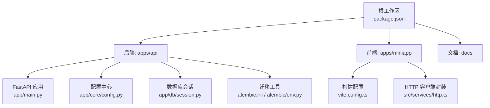
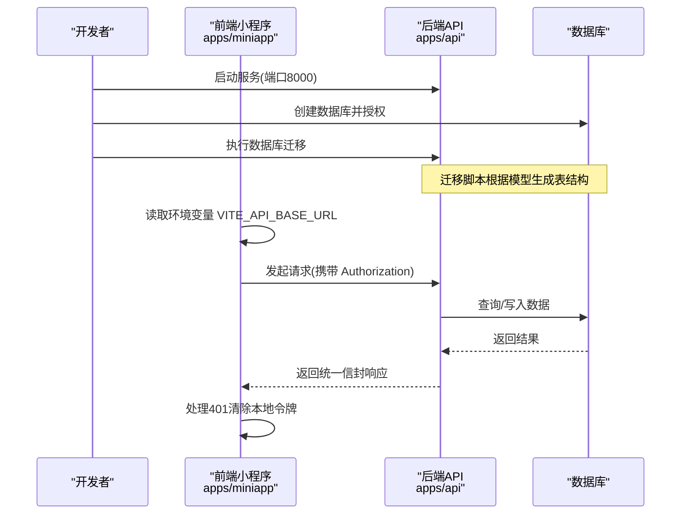
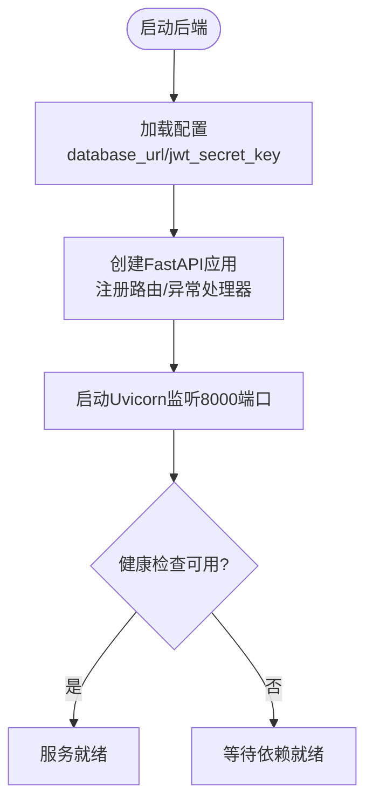
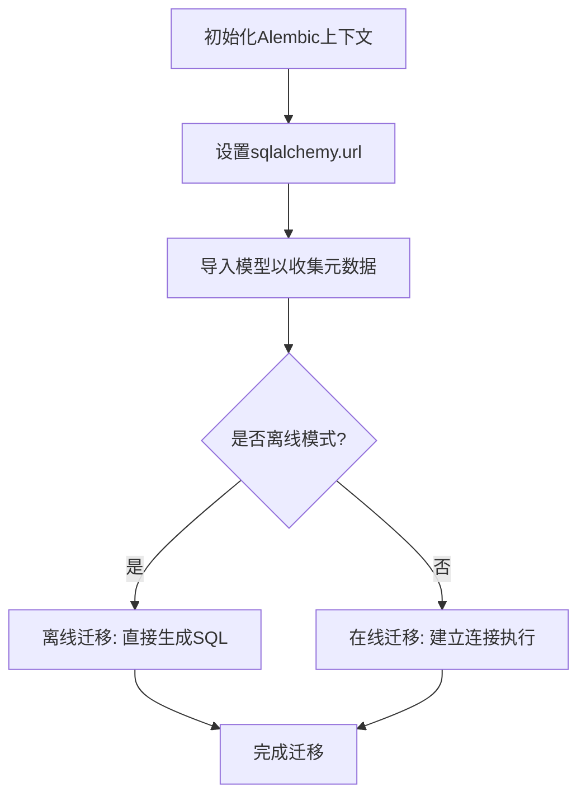
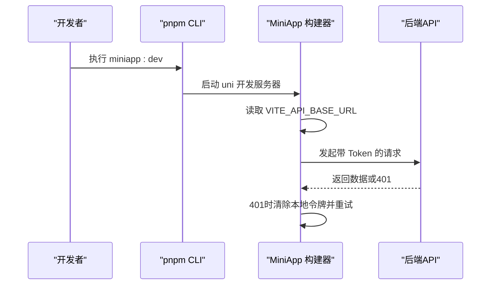
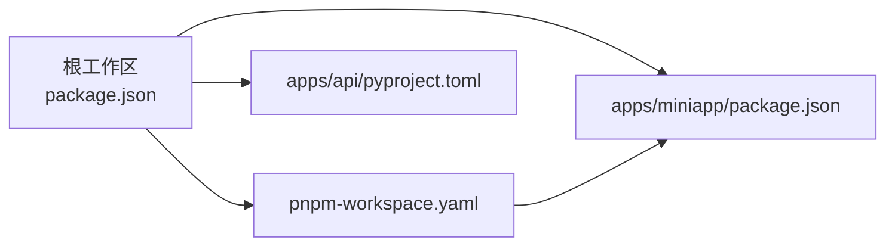

# 快速开始

<cite>
**本文引用的文件**
- [package.json](file://package.json)
- [pnpm-workspace.yaml](file://pnpm-workspace.yaml)
- [apps/api/pyproject.toml](file://apps/api/pyproject.toml)
- [apps/api/app/main.py](file://apps/api/app/main.py)
- [apps/api/app/core/config.py](file://apps/api/app/core/config.py)
- [apps/api/app/db/session.py](file://apps/api/app/db/session.py)
- [apps/api/alembic.ini](file://apps/api/alembic.ini)
- [apps/api/alembic/env.py](file://apps/api/alembic/env.py)
- [apps/miniapp/package.json](file://apps/miniapp/package.json)
- [apps/miniapp/vite.config.ts](file://apps/miniapp/vite.config.ts)
- [apps/miniapp/src/services/http.ts](file://apps/miniapp/src/services/http.ts)
</cite>

## 目录
1. [简介](#简介)
2. [项目结构](#项目结构)
3. [核心组件](#核心组件)
4. [架构总览](#架构总览)
5. [详细组件分析](#详细组件分析)
6. [依赖关系分析](#依赖关系分析)
7. [性能注意事项](#性能注意事项)
8. [故障排查指南](#故障排查指南)
9. [结论](#结论)
10. [附录](#附录)

## 简介
本指南帮助你在最短时间内完成 Pocket Farm 的开发环境搭建，并成功运行后端 API 与前端小程序应用。你将学会：
- 安装和配置 Node.js、Python 环境
- 使用 pnpm workspace 管理 monorepo
- 启动后端服务并完成数据库初始化
- 开发、构建前端小程序
- 常见问题的定位与解决

## 项目结构
本项目采用 monorepo 组织方式，通过 pnpm workspace 统一管理前后端子项目：
- apps/api：基于 FastAPI 的后端服务，使用 SQLAlchemy + Alembic 进行异步数据库访问与迁移
- apps/miniapp：基于 uni-app（Vue 3）的小程序前端，支持多端构建（如微信小程序）
- docs：文档站点（VitePress）
- 根目录 scripts：提供统一的 dev/build 命令入口

图表来源
- [package.json:1-32](file://package.json#L1-L32)
- [apps/api/app/main.py:1-28](file://apps/api/app/main.py#L1-L28)
- [apps/api/app/core/config.py:1-23](file://apps/api/app/core/config.py#L1-L23)
- [apps/api/app/db/session.py:1-7](file://apps/api/app/db/session.py#L1-L7)
- [apps/api/alembic.ini:1-150](file://apps/api/alembic.ini#L1-L150)
- [apps/api/alembic/env.py:1-103](file://apps/api/alembic/env.py#L1-L103)
- [apps/miniapp/vite.config.ts:1-8](file://apps/miniapp/vite.config.ts#L1-L8)
- [apps/miniapp/src/services/http.ts:1-106](file://apps/miniapp/src/services/http.ts#L1-L106)

章节来源
- [package.json:1-32](file://package.json#L1-L32)
- [pnpm-workspace.yaml:1-7](file://pnpm-workspace.yaml#L1-L7)

## 核心组件
- 后端服务（FastAPI）
  - 应用入口与路由挂载：定义应用生命周期、注册健康检查与 v1 API 路由
  - 配置加载：从环境变量或 .env 读取数据库连接、JWT 等敏感信息
  - 数据库会话：异步引擎与会话工厂，启用连接前探测
  - 迁移系统：Alembic 异步执行迁移，自动加载模型元数据
- 前端小程序（uni-app）
  - 构建与开发脚本：统一的多端开发与构建命令
  - HTTP 客户端：封装请求、鉴权头注入、错误信封解析与 401 处理
  - Vite 插件：集成 uni 插件以支持多端编译

章节来源
- [apps/api/app/main.py:1-28](file://apps/api/app/main.py#L1-L28)
- [apps/api/app/core/config.py:1-23](file://apps/api/app/core/config.py#L1-L23)
- [apps/api/app/db/session.py:1-7](file://apps/api/app/db/session.py#L1-L7)
- [apps/api/alembic/env.py:1-103](file://apps/api/alembic/env.py#L1-L103)
- [apps/miniapp/package.json:1-73](file://apps/miniapp/package.json#L1-L73)
- [apps/miniapp/vite.config.ts:1-8](file://apps/miniapp/vite.config.ts#L1-L8)
- [apps/miniapp/src/services/http.ts:1-106](file://apps/miniapp/src/services/http.ts#L1-L106)

## 架构总览
下图展示了前后端交互与关键配置点：

图表来源
- [apps/api/app/main.py:1-28](file://apps/api/app/main.py#L1-L28)
- [apps/api/app/core/config.py:1-23](file://apps/api/app/core/config.py#L1-L23)
- [apps/api/app/db/session.py:1-7](file://apps/api/app/db/session.py#L1-L7)
- [apps/api/alembic/env.py:1-103](file://apps/api/alembic/env.py#L1-L103)
- [apps/miniapp/src/services/http.ts:1-106](file://apps/miniapp/src/services/http.ts#L1-L106)

## 详细组件分析

### 后端服务启动流程
- 应用创建：FastAPI 实例化时注册异常处理器、包含健康检查与 v1 路由前缀
- 生命周期：进程退出时释放数据库引擎连接池
- 配置来源：Settings 类优先从环境变量加载，其次回退到 .env 文件

图表来源
- [apps/api/app/main.py:1-28](file://apps/api/app/main.py#L1-L28)
- [apps/api/app/core/config.py:1-23](file://apps/api/app/core/config.py#L1-L23)

章节来源
- [apps/api/app/main.py:1-28](file://apps/api/app/main.py#L1-L28)
- [apps/api/app/core/config.py:1-23](file://apps/api/app/core/config.py#L1-L23)

### 数据库与迁移
- 会话与引擎：异步引擎创建时启用 pool_pre_ping，避免连接失效
- 迁移执行：Alembic 在 env.py 中设置 sqlalchemy.url 为当前 settings.database_url，并加载所有模型元数据，支持离线/在线模式
- 迁移脚本位置：alembic.ini 指定 script_location 为 alembic 目录

图表来源
- [apps/api/alembic.ini:1-150](file://apps/api/alembic.ini#L1-L150)
- [apps/api/alembic/env.py:1-103](file://apps/api/alembic/env.py#L1-L103)
- [apps/api/app/db/session.py:1-7](file://apps/api/app/db/session.py#L1-L7)

章节来源
- [apps/api/alembic.ini:1-150](file://apps/api/alembic.ini#L1-L150)
- [apps/api/alembic/env.py:1-103](file://apps/api/alembic/env.py#L1-L103)
- [apps/api/app/db/session.py:1-7](file://apps/api/app/db/session.py#L1-L7)

### 前端小程序开发与构建
- 开发命令：通过根脚本调用 pnpm --filter 进入 miniapp 包执行多端开发命令
- 构建命令：按目标平台（如 mp-weixin）输出产物
- 环境变量：VITE_API_BASE_URL 用于指向后端地址，默认 http://127.0.0.1:8000/api/v1
- 请求封装：自动附加 Authorization 头；401 时清理本地令牌；统一错误信封解析

图表来源
- [package.json:1-32](file://package.json#L1-L32)
- [apps/miniapp/package.json:1-73](file://apps/miniapp/package.json#L1-L73)
- [apps/miniapp/src/services/http.ts:1-106](file://apps/miniapp/src/services/http.ts#L1-L106)

章节来源
- [package.json:1-32](file://package.json#L1-L32)
- [apps/miniapp/package.json:1-73](file://apps/miniapp/package.json#L1-L73)
- [apps/miniapp/src/services/http.ts:1-106](file://apps/miniapp/src/services/http.ts#L1-L106)

## 依赖关系分析
- 工作区管理：pnpm-workspace.yaml 声明了 packages/* 与 apps/miniapp 作为工作区成员
- 根脚本：提供 docs、api、miniapp 的统一命令入口
- 后端依赖：pyproject.toml 声明 FastAPI、SQLAlchemy、Alembic、Pydantic Settings、Uvicorn 等
- 前端依赖：uni-app 全家桶与 Vue 3，配合 Vite 插件实现多端构建

图表来源
- [pnpm-workspace.yaml:1-7](file://pnpm-workspace.yaml#L1-L7)
- [package.json:1-32](file://package.json#L1-L32)
- [apps/api/pyproject.toml:1-35](file://apps/api/pyproject.toml#L1-L35)
- [apps/miniapp/package.json:1-73](file://apps/miniapp/package.json#L1-L73)

章节来源
- [pnpm-workspace.yaml:1-7](file://pnpm-workspace.yaml#L1-L7)
- [package.json:1-32](file://package.json#L1-L32)
- [apps/api/pyproject.toml:1-35](file://apps/api/pyproject.toml#L1-L35)
- [apps/miniapp/package.json:1-73](file://apps/miniapp/package.json#L1-L73)

## 性能注意事项
- 数据库连接：会话引擎已启用 pool_pre_ping，有助于减少连接失效导致的异常
- 异步 I/O：后端使用异步引擎与异步迁移，适合高并发场景
- 前端网络：统一请求封装减少重复逻辑，建议在生产环境开启缓存与重试策略
- 构建优化：按需选择目标平台构建，避免全量打包带来的体积膨胀

## 故障排查指南
- 无法启动后端
  - 检查 Python 版本是否满足要求（>=3.12）
  - 确认数据库 URL 与 JWT 密钥已在环境变量或 .env 中正确配置
  - 验证 Uvicorn 是否监听 8000 端口且未被占用
- 数据库迁移失败
  - 确认数据库已创建且用户具备足够权限
  - 核对 alembic.ini 的 script_location 与 env.py 中的模型导入是否正确
  - 若为首次初始化，先执行迁移再启动服务
- 前端无法连接后端
  - 检查 VITE_API_BASE_URL 是否指向正确的后端地址
  - 确认浏览器/小程序控制台无跨域或网络错误
  - 若出现 401，确认登录成功后本地令牌是否正确保存
- 构建失败
  - 确保 Node.js 与 pnpm 版本匹配
  - 清理 node_modules 后重新安装依赖
  - 针对特定平台（如 mp-weixin）单独执行构建命令

章节来源
- [apps/api/app/core/config.py:1-23](file://apps/api/app/core/config.py#L1-L23)
- [apps/api/alembic.ini:1-150](file://apps/api/alembic.ini#L1-L150)
- [apps/api/alembic/env.py:1-103](file://apps/api/alembic/env.py#L1-L103)
- [apps/miniapp/src/services/http.ts:1-106](file://apps/miniapp/src/services/http.ts#L1-L106)

## 结论
按照本指南完成环境准备、依赖安装、数据库初始化与服务启动后，即可在本地同时运行后端 API 与前端小程序，体验农场管理的核心功能。建议在后续迭代中结合单元测试与代码规范工具提升质量与可维护性。

## 附录

### 环境准备
- 安装 Node.js 与 pnpm（推荐版本见根 package.json 的 devEngines）
- 安装 Python 3.12+ 并使用 uv 管理后端依赖
- 准备 MySQL 数据库实例并创建数据库

### 安装依赖
- 根目录执行 pnpm install 以安装前端与工作区依赖
- 进入 apps/api 目录，使用 uv sync 安装后端依赖

### 启动后端
- 在 apps/api 目录下执行根脚本提供的 api:dev 命令（将启动 Uvicorn 监听 8000 端口）
- 首次运行需执行数据库迁移（详见下一步）

### 数据库初始化
- 确保数据库已创建且可访问
- 在 apps/api 目录下执行 Alembic 迁移（参考 alembic.ini 与 env.py 的配置）

### 启动前端
- 在根目录执行 miniapp:dev 以启动小程序开发服务器
- 如需构建生产产物，执行 miniapp:build 并按需选择目标平台

### 常用命令速查
- 文档开发：docs:dev
- 后端开发：api:dev
- 前端开发：miniapp:dev
- 前端构建：miniapp:build

章节来源
- [package.json:1-32](file://package.json#L1-L32)
- [apps/api/pyproject.toml:1-35](file://apps/api/pyproject.toml#L1-L35)
- [apps/miniapp/package.json:1-73](file://apps/miniapp/package.json#L1-L73)
- [apps/api/alembic.ini:1-150](file://apps/api/alembic.ini#L1-L150)
- [apps/api/alembic/env.py:1-103](file://apps/api/alembic/env.py#L1-L103)