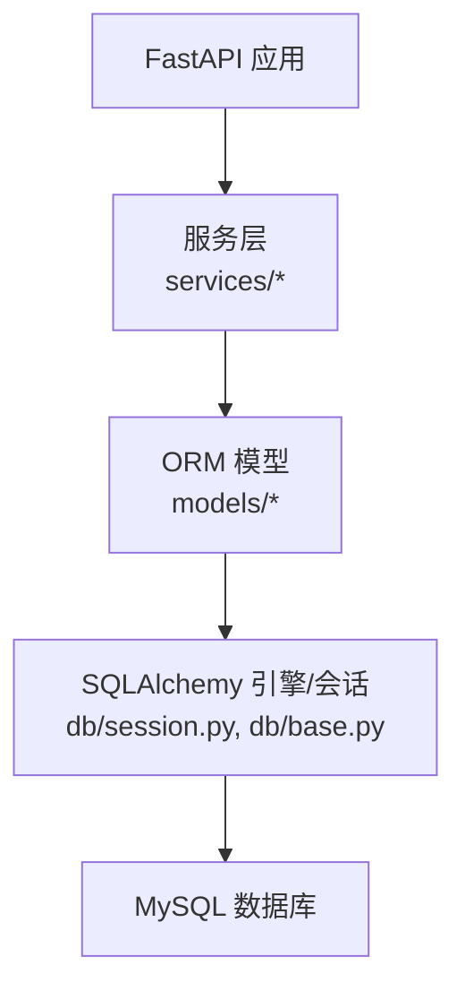
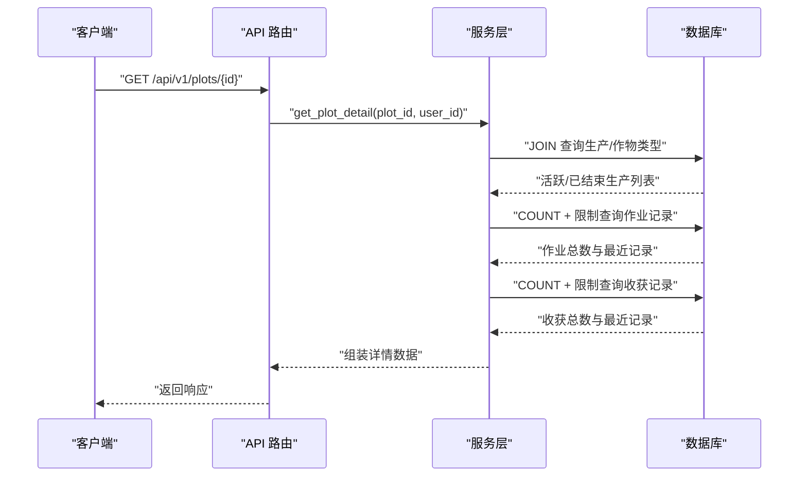
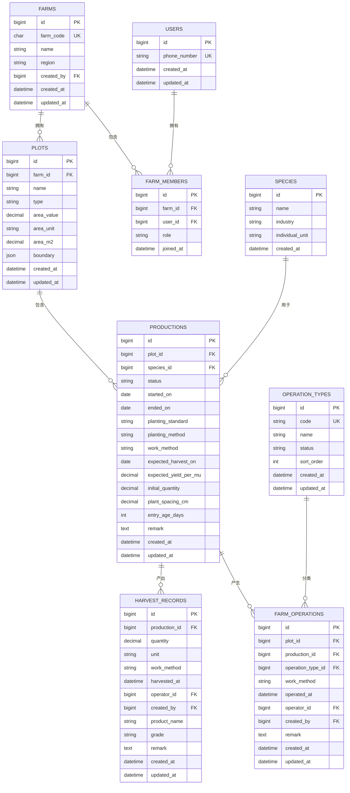

# 数据库性能优化

<cite>
**本文引用的文件**
- [session.py](file://apps/api/app/db/session.py)
- [base.py](file://apps/api/app/db/base.py)
- [config.py](file://apps/api/app/core/config.py)
- [user.py](file://apps/api/app/models/user.py)
- [farm.py](file://apps/api/app/models/farm.py)
- [plot.py](file://apps/api/app/models/plot.py)
- [harvest.py](file://apps/api/app/models/harvest.py)
- [operation.py](file://apps/api/app/models/operation.py)
- [production.py](file://apps/api/app/models/production.py)
- [species.py](file://apps/api/app/models/species.py)
- [production_service.py](file://apps/api/app/services/production.py)
- [farm_service.py](file://apps/api/app/services/farm.py)
- [plot_service.py](file://apps/api/app/services/plot.py)
- [harvest_service.py](file://apps/api/app/services/harvest.py)
- [operations_service.py](file://apps/api/app/services/operation.py)
</cite>

## 更新摘要
**所做更改**
- 更新了索引设计部分，新增了针对 productions 表的复合索引优化
- 增强了查询优化章节，说明了复合索引对多条件过滤查询的性能提升
- 完善了大数据量处理优化方案，包含新索引的使用场景说明
- 更新了依赖关系分析图，反映最新的索引结构

## 目录
1. [简介](#简介)
2. [项目结构](#项目结构)
3. [核心组件](#核心组件)
4. [架构总览](#架构总览)
5. [详细组件分析](#详细组件分析)
6. [依赖关系分析](#依赖关系分析)
7. [性能考量](#性能考量)
8. [故障排查指南](#故障排查指南)
9. [结论](#结论)
10. [附录](#附录)

## 简介
本文件面向 Pocket Farm 系统的数据库性能优化，聚焦以下目标：索引设计策略（主键、外键、复合、全文）、查询优化（N+1 问题、懒加载与预加载）、连接池与会话管理、事务处理最佳实践、慢查询分析与监控、缓存策略、以及大数据量场景的分页/批量/归档方案。文档基于仓库中 SQLAlchemy ORM 模型与服务层代码进行实证分析，并提供可落地的调优建议与可视化图示。

## 项目结构
后端 API 使用 FastAPI + SQLAlchemy 异步会话，数据模型位于 models 目录，服务层在 services 目录中进行业务编排与 SQL 构建。数据库引擎与会话工厂集中配置于 db 模块，并通过环境变量注入数据库连接串。

图表来源
- [session.py:1-7](file://apps/api/app/db/session.py#L1-L7)
- [base.py:1-15](file://apps/api/app/db/base.py#L1-L15)
- [config.py:1-23](file://apps/api/app/core/config.py#L1-L23)

章节来源
- [session.py:1-7](file://apps/api/app/db/session.py#L1-L7)
- [base.py:1-15](file://apps/api/app/db/base.py#L1-L15)
- [config.py:1-23](file://apps/api/app/core/config.py#L1-L23)

## 核心组件
- 数据库引擎与会话
  - 异步引擎创建并启用连接健康检查；会话工厂关闭自动过期，避免提交后字段失效。
- 命名约定与约束
  - 统一索引/约束命名规范，便于运维识别与维护。
- 领域模型
  - 用户、农场、地块、生产、作业、收获等实体，包含主键、唯一键、外键与显式索引。
- 服务层
  - 以组合查询、分页、计数、锁行等方式实现复杂业务逻辑，减少 N+1 查询风险。

章节来源
- [session.py:1-7](file://apps/api/app/db/session.py#L1-L7)
- [base.py:1-15](file://apps/api/app/db/base.py#L1-L15)
- [user.py:1-28](file://apps/api/app/models/user.py#L1-L28)
- [farm.py:1-59](file://apps/api/app/models/farm.py#L1-L59)
- [plot.py:1-54](file://apps/api/app/models/plot.py#L1-L54)
- [production.py:1-87](file://apps/api/app/models/production.py#L1-L87)
- [operation.py:1-80](file://apps/api/app/models/operation.py#L1-L80)
- [harvest.py:1-48](file://apps/api/app/models/harvest.py#L1-L48)
- [species.py:1-35](file://apps/api/app/models/species.py#L1-L35)

## 架构总览
下图展示从请求到数据库的调用链，强调服务层通过 JOIN 与聚合函数减少多次往返，并使用 with_for_update 保证并发安全。

图表来源
- [plot_service.py:124-183](file://apps/api/app/services/plot.py#L124-L183)
- [operation.py:18-80](file://apps/api/app/models/operation.py#L18-L80)
- [harvest.py:13-48](file://apps/api/app/models/harvest.py#L13-L48)

## 详细组件分析

### 索引设计与原则
- 主键索引
  - 所有表均使用 BIGINT 自增主键，天然具备聚簇索引能力，适合顺序写入与按 ID 检索。
- 外键索引
  - 多处外键列已显式声明 index=True，如 plot.farm_id、production.plot_id、production.species_id 等，有效提升 JOIN 与 WHERE 性能。
- 复合索引
  - **新增**：在 productions 表上创建了 `ix_productions_plot_status_species` 复合索引，包含 `(plot_id, status, species_id)` 三个字段，专门优化按地块、状态和物种进行过滤的查询操作。
  - 针对常见过滤组合（如 farm_id + created_at、plot_id + operated_at）建立复合索引，可显著降低排序与扫描成本。
- 全文搜索
  - 当前模型未定义全文索引。若后续引入文本检索需求，可在 MySQL 上对必要字段建立 FULLTEXT 索引，并结合 MATCH...AGAINST 语法。

**更新** 新增了针对生产管理的复合索引优化，特别适用于拥有大量地块和活跃生产的农场场景。

章节来源
- [farm.py:18-59](file://apps/api/app/models/farm.py#L18-L59)
- [plot.py:31-54](file://apps/api/app/models/plot.py#L31-L54)
- [production.py:43-87](file://apps/api/app/models/production.py#L43-L87)
- [operation.py:18-80](file://apps/api/app/models/operation.py#L18-L80)
- [harvest.py:13-48](file://apps/api/app/models/harvest.py#L13-L48)
- [species.py:27-35](file://apps/api/app/models/species.py#L27-L35)

### 查询优化：N+1、懒加载与预加载
- N+1 问题规避
  - 服务层广泛采用 JOIN 一次性获取关联数据，例如地块详情同时拉取生产、作业、收获及类型信息，避免循环内逐条查询。
- 懒加载与预加载
  - 当前服务层以显式 JOIN 替代 ORM 懒加载，属于"预加载"模式，能有效减少往返次数。建议在需要时继续采用 selectinload/joinedload 或手写 JOIN 的方式。
- 分页与计数分离
  - 列表接口普遍先 COUNT 再 LIMIT/OFFSET 分页，确保前端分页体验稳定。
- **新增** 复合索引优化
  - 针对 `list_plot_productions` 等查询，利用 `ix_productions_plot_status_species` 索引优化按 plot_id、status、species_id 的多条件过滤查询，显著提升大数据量场景下的查询性能。

章节来源
- [plot_service.py:57-77](file://apps/api/app/services/plot.py#L57-L77)
- [plot_service.py:124-183](file://apps/api/app/services/plot.py#L124-L183)
- [production_service.py:112-138](file://apps/api/app/services/production.py#L112-L138)
- [harvest_service.py:86-131](file://apps/api/app/services/harvest.py#L86-L131)
- [farm_service.py:115-134](file://apps/api/app/services/farm.py#L115-L134)

### 连接池与会话管理
- 连接池
  - 引擎创建时开启 pool_pre_ping，提升连接可用性检测能力，降低长连接失效导致的异常。
- 会话工厂
  - expire_on_commit=False 避免提交后属性失效，简化后续读取逻辑。
- 建议
  - 根据并发与数据库资源调整连接池大小、超时与回收策略；在高并发下关注连接泄漏与等待队列。

章节来源
- [session.py:1-7](file://apps/api/app/db/session.py#L1-L7)
- [config.py:1-23](file://apps/api/app/core/config.py#L1-L23)

### 事务处理最佳实践
- 短事务与最小化锁范围
  - 写操作尽量在最小范围内加锁，例如成员管理中使用 with_for_update 锁定农场与成员集合，防止竞态。
- 冲突重试
  - 生成唯一农场码时捕获完整性冲突并回滚重试，提高健壮性。
- 一致性校验
  - 更新/删除前进行权限与状态校验，避免非法变更。

章节来源
- [farm_service.py:33-53](file://apps/api/app/services/farm.py#L33-L53)
- [farm_service.py:73-91](file://apps/api/app/services/farm.py#L73-L91)
- [plot_service.py:186-223](file://apps/api/app/services/plot.py#L186-L223)
- [harvest_service.py:134-178](file://apps/api/app/services/harvest.py#L134-L178)

### 慢查询分析与性能监控
- 定位方法
  - 使用数据库慢查询日志与 EXPLAIN 分析执行计划，重点关注全表扫描、临时表与文件排序。
- 指标观测
  - 监控 QPS、延迟分布、连接池使用率、锁等待与死锁事件。
- 工具建议
  - 结合数据库自带工具（如 MySQL slow log、performance_schema）与 APM 平台，形成端到端追踪。
- **新增** 复合索引效果验证
  - 对于新增的 `ix_productions_plot_status_species` 索引，建议使用 EXPLAIN 分析相关查询的执行计划，确认索引是否被有效利用。

[本节为通用指导，不直接分析具体文件]

### 缓存策略设计
- 应用层缓存
  - 对读多写少的静态或低频变化数据（如作物种类、作业类型）可使用内存缓存（进程级或分布式缓存），设置合理 TTL 与失效策略。
- 数据库级缓存
  - 利用 InnoDB Buffer Pool 与查询缓存（视版本而定）提升热点数据访问速度；注意避免过大缓存导致内存压力。
- 缓存一致性
  - 写路径需同步或异步失效相关缓存键，避免脏读。

[本节为通用指导，不直接分析具体文件]

### 大数据量处理优化
- 分页查询
  - 列表接口已采用 OFFSET/LIMIT 分页；当偏移极大时，建议使用游标分页（基于时间戳或主键）以避免深分页性能退化。
- 批量操作
  - 对大量写入可采用批量插入/更新，减少往返与事务开销。
- 归档策略
  - 历史数据（如已结束生产、旧作业/收获记录）可按时间归档至历史库或冷存储，减轻主库压力。
- **新增** 复合索引应用场景
  - 对于拥有大量地块和活跃生产的农场，`ix_productions_plot_status_species` 复合索引能显著提升按地块、状态、物种过滤的查询性能，特别适合生产列表页面的快速响应。

章节来源
- [plot_service.py:57-77](file://apps/api/app/services/plot.py#L57-L77)
- [production_service.py:112-138](file://apps/api/app/services/production.py#L112-L138)
- [harvest_service.py:86-131](file://apps/api/app/services/harvest.py#L86-L131)
- [farm_service.py:115-134](file://apps/api/app/services/farm.py#L115-L134)

## 依赖关系分析
下图展示关键模型间的依赖关系与常用查询路径，有助于识别潜在的性能瓶颈与索引需求。

图表来源
- [user.py:15-28](file://apps/api/app/models/user.py#L15-L28)
- [farm.py:18-59](file://apps/api/app/models/farm.py#L18-L59)
- [plot.py:31-54](file://apps/api/app/models/plot.py#L31-L54)
- [production.py:43-87](file://apps/api/app/models/production.py#L43-L87)
- [operation.py:18-80](file://apps/api/app/models/operation.py#L18-L80)
- [harvest.py:13-48](file://apps/api/app/models/harvest.py#L13-L48)
- [species.py:27-35](file://apps/api/app/models/species.py#L27-L35)

## 性能考量
- 索引命中与覆盖
  - 优先让查询走索引，必要时使用覆盖索引减少回表。
- 避免隐式类型转换
  - 保持查询条件与列类型一致，防止索引失效。
- 控制结果集大小
  - 合理使用 LIMIT、只选择必要字段，减少网络与序列化开销。
- 锁与事务粒度
  - 缩小事务范围，缩短持有锁的时间，降低阻塞概率。
- 统计信息维护
  - 定期 ANALYZE 表，确保优化器获得准确的统计信息。
- **新增** 复合索引优化
  - 对于多条件过滤查询，合理利用复合索引可显著提升性能，特别是 `ix_productions_plot_status_species` 索引在处理大规模生产数据时的优势。

[本节为通用指导，不直接分析具体文件]

## 故障排查指南
- 常见问题
  - 慢查询：通过慢日志定位热点 SQL，结合 EXPLAIN 分析执行计划。
  - 锁等待/死锁：观察锁等待图与死锁日志，调整事务顺序与锁粒度。
  - 连接耗尽：检查连接池配置与连接泄漏，增加监控告警。
- 诊断步骤
  - 复现问题 -> 抓取慢查询 -> 分析执行计划 -> 验证索引有效性 -> 调整 SQL/索引 -> 回归测试。
- 恢复策略
  - 对不可用连接快速重试与降级；对高负载场景限流与熔断。
- **新增** 索引效果验证
  - 对于新增的复合索引，使用 EXPLAIN 分析相关查询的执行计划，确认索引是否被正确利用，必要时调整查询条件以匹配索引列顺序。

[本节为通用指导，不直接分析具体文件]

## 结论
Pocket Farm 在后端服务层已较好地避免了 N+1 问题，并通过 JOIN、分页与锁行提升了查询效率与并发安全性。**最新更新的复合索引 `ix_productions_plot_status_species` 进一步增强了生产管理的查询性能，特别适用于拥有大量地块和活跃生产的大型农场场景**。下一步应重点完善索引体系（尤其是外键与复合索引）、持续监控慢查询与连接池状态，并在大规模数据场景下引入更稳健的分页与归档策略。配合合理的缓存与事务边界控制，可进一步提升系统吞吐与稳定性。

## 附录
- 术语
  - 预加载：在单次查询中主动加载关联数据，避免后续多次查询。
  - 懒加载：按需加载关联数据，可能引发 N+1 问题。
  - 覆盖索引：查询所需字段全部在索引中，无需回表。
  - 复合索引：由多个列组成的索引，适用于多条件过滤查询。
- 参考实践
  - 将频繁过滤与排序的列组合建立复合索引。
  - 对大表历史数据进行分区或归档，降低热表体积。
  - 对读多写少的基础字典数据实施应用层缓存。
  - **新增** 针对高频多条件查询场景，设计合理的复合索引列顺序以提升查询效率。

[本节为通用指导，不直接分析具体文件]