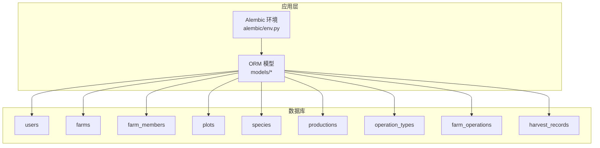
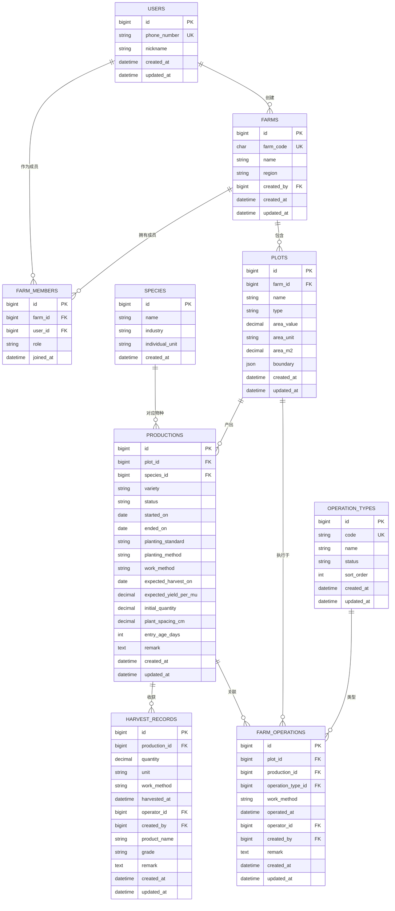
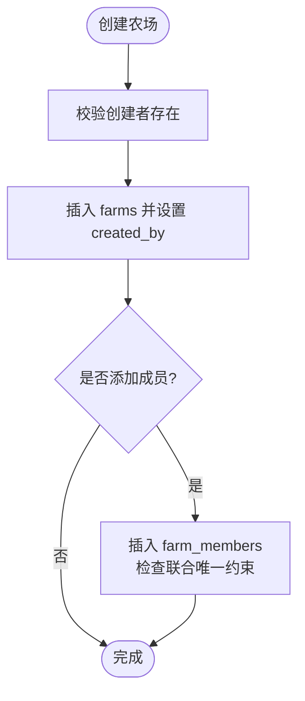
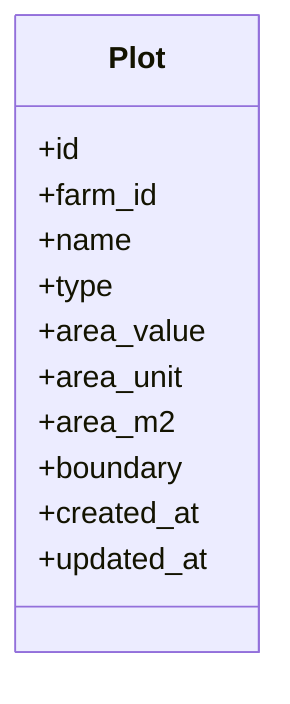
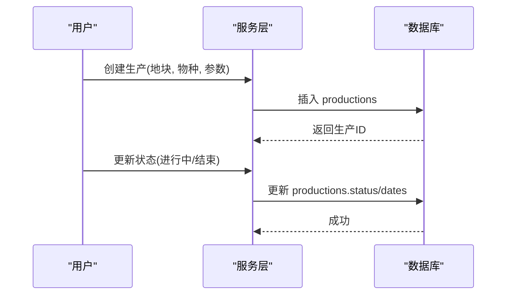
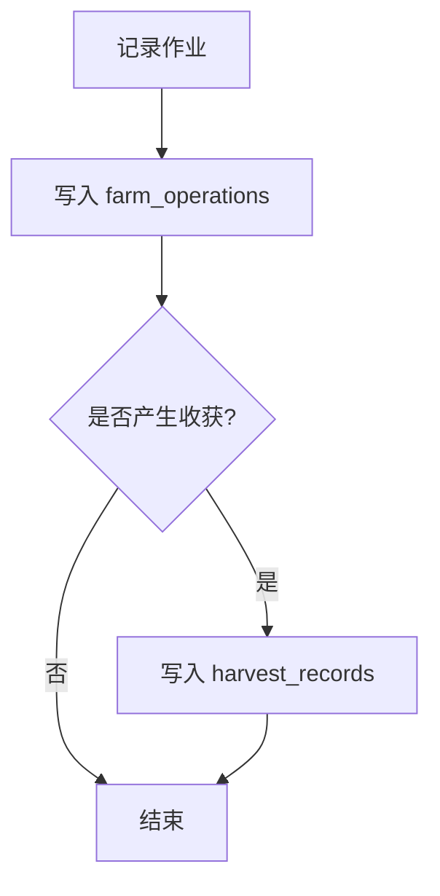
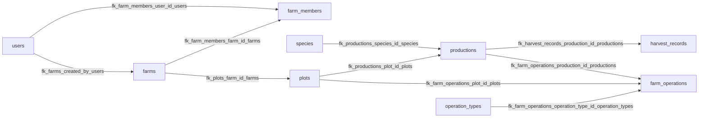

# 数据库设计

<cite>
**本文引用的文件**
- [apps/api/app/models/__init__.py](file://apps/api/app/models/__init__.py)
- [apps/api/app/models/user.py](file://apps/api/app/models/user.py)
- [apps/api/app/models/farm.py](file://apps/api/app/models/farm.py)
- [apps/api/app/models/plot.py](file://apps/api/app/models/plot.py)
- [apps/api/app/models/production.py](file://apps/api/app/models/production.py)
- [apps/api/app/models/operation.py](file://apps/api/app/models/operation.py)
- [apps/api/app/models/harvest.py](file://apps/api/app/models/harvest.py)
- [apps/api/app/models/species.py](file://apps/api/app/models/species.py)
- [apps/api/app/db/base.py](file://apps/api/app/db/base.py)
- [apps/api/alembic/env.py](file://apps/api/alembic/env.py)
- [apps/api/alembic/versions/f67d91555137_create_users.py](file://apps/api/alembic/versions/f67d91555137_create_users.py)
- [apps/api/alembic/versions/9c8d9c86e54a_create_farms_and_farm_members.py](file://apps/api/alembic/versions/9c8d9c86e54a_create_farms_and_farm_members.py)
- [apps/api/alembic/versions/6c41d1c6b6f1_create_plots.py](file://apps/api/alembic/versions/6c41d1c6b6f1_create_plots.py)
- [apps/api/alembic/versions/1bf2b6d1b674_create_species_and_productions.py](file://apps/api/alembic/versions/1bf2b6d1b674_create_species_and_productions.py)
- [apps/api/alembic/versions/2c972e3fc98e_create_farm_operations.py](file://apps/api/alembic/versions/2c972e3fc98e_create_farm_operations.py)
- [apps/api/alembic/versions/b8e4d2a1c673_create_harvest_records.py](file://apps/api/alembic/versions/b8e4d2a1c673_create_harvest_records.py)
</cite>

## 目录
1. [简介](#简介)
2. [项目结构](#项目结构)
3. [核心组件](#核心组件)
4. [架构总览](#架构总览)
5. [详细组件分析](#详细组件分析)
6. [依赖关系分析](#依赖关系分析)
7. [性能考量](#性能考量)
8. [故障排查指南](#故障排查指南)
9. [结论](#结论)
10. [附录](#附录)

## 简介
本文件为 Pocket Farm 系统的数据库设计文档，聚焦实体关系模型（ERD）、表结构与字段定义、约束与索引、数据完整性保证、迁移策略与版本管理、查询优化与缓存建议、备份恢复与性能监控方案。内容基于 SQLAlchemy ORM 模型与 Alembic 迁移脚本进行梳理，确保与实际代码一致并可追溯。

## 项目结构
- 数据模型位于 apps/api/app/models，按领域划分：用户、农场、地块、生产、作业、收获记录、物种等。
- 数据库基础配置与命名约定在 apps/api/app/db/base.py。
- 迁移脚本位于 apps/api/alembic/versions，使用 Alembic 管理版本演进；运行入口在 apps/api/alembic/env.py。

图表来源
- [apps/api/app/models/__init__.py:1-40](file://apps/api/app/models/__init__.py#L1-L40)
- [apps/api/alembic/env.py:1-103](file://apps/api/alembic/env.py#L1-L103)

章节来源
- [apps/api/app/models/__init__.py:1-40](file://apps/api/app/models/__init__.py#L1-L40)
- [apps/api/alembic/env.py:1-103](file://apps/api/alembic/env.py#L1-L103)

## 核心组件
- 用户 User：唯一手机号、昵称、时间戳。
- 农场 Farm 与成员 FarmMember：农场编码唯一、创建者引用用户、成员角色与加入时间。
- 地块 Plot：归属农场、类型、面积（数值+单位+平方米换算）、边界 JSON。
- 物种 Species：名称、行业分类、个体单位。
- 生产 Production：关联地块与物种、品种、状态、日期、种植标准与方法、预期产量与初始数量、株距、入龄天数、备注。
- 作业 OperationType/FarmOperation：作业类型字典与具体作业记录，关联地块、可选的生产、作业类型、方法、操作时间与人员。
- 收获记录 HarvestRecord：关联生产、数量与单位、方法、收获时间、操作人员与创建人、产品名、等级、备注。

章节来源
- [apps/api/app/models/user.py:1-28](file://apps/api/app/models/user.py#L1-L28)
- [apps/api/app/models/farm.py:1-59](file://apps/api/app/models/farm.py#L1-L59)
- [apps/api/app/models/plot.py:1-54](file://apps/api/app/models/plot.py#L1-L54)
- [apps/api/app/models/species.py:1-35](file://apps/api/app/models/species.py#L1-L35)
- [apps/api/app/models/production.py:1-79](file://apps/api/app/models/production.py#L1-L79)
- [apps/api/app/models/operation.py:1-80](file://apps/api/app/models/operation.py#L1-L80)
- [apps/api/app/models/harvest.py:1-48](file://apps/api/app/models/harvest.py#L1-L48)

## 架构总览
下图展示核心实体间的关系与约束，体现“农场-地块-生产-作业/收获”的主链路，以及“用户-农场成员”的权限维度。

图表来源
- [apps/api/app/models/user.py:15-28](file://apps/api/app/models/user.py#L15-L28)
- [apps/api/app/models/farm.py:18-59](file://apps/api/app/models/farm.py#L18-L59)
- [apps/api/app/models/plot.py:31-54](file://apps/api/app/models/plot.py#L31-L54)
- [apps/api/app/models/species.py:27-35](file://apps/api/app/models/species.py#L27-L35)
- [apps/api/app/models/production.py:43-79](file://apps/api/app/models/production.py#L43-L79)
- [apps/api/app/models/operation.py:18-80](file://apps/api/app/models/operation.py#L18-L80)
- [apps/api/app/models/harvest.py:13-48](file://apps/api/app/models/harvest.py#L13-L48)

## 详细组件分析

### 用户与农场组织
- 用户表 users：主键自增 BIGINT 无符号；手机号唯一；昵称可选；自动维护创建/更新时间。
- 农场表 farms：农场编码固定长度且唯一；名称必填；区域可选；创建者引用 users.id（RESTRICT）；时间戳自动维护。
- 农场成员表 farm_members：联合唯一约束（farm_id, user_id）防止重复加入；user_id 建索引便于按用户查其所属农场；角色枚举；加入时间。

图表来源
- [apps/api/app/models/user.py:15-28](file://apps/api/app/models/user.py#L15-L28)
- [apps/api/app/models/farm.py:18-59](file://apps/api/app/models/farm.py#L18-L59)

章节来源
- [apps/api/app/models/user.py:15-28](file://apps/api/app/models/user.py#L15-L28)
- [apps/api/app/models/farm.py:18-59](file://apps/api/app/models/farm.py#L18-L59)
- [apps/api/alembic/versions/f67d91555137_create_users.py:21-41](file://apps/api/alembic/versions/f67d91555137_create_users.py#L21-L41)
- [apps/api/alembic/versions/9c8d9c86e54a_create_farms_and_farm_members.py:21-62](file://apps/api/alembic/versions/9c8d9c86e54a_create_farms_and_farm_members.py#L21-L62)

### 地块与面积建模
- 地块表 plots：归属 farms；名称必填；类型可选；面积以 area_value + area_unit 存储，同时提供 area_m2 用于统一计算；boundary 使用 JSON 存储地理边界信息；farm_id 建索引。
- 面积单位与地块类型通过枚举限定，便于前端选择与后端校验。

图表来源
- [apps/api/app/models/plot.py:31-54](file://apps/api/app/models/plot.py#L31-L54)

章节来源
- [apps/api/app/models/plot.py:31-54](file://apps/api/app/models/plot.py#L31-L54)
- [apps/api/alembic/versions/6c41d1c6b6f1_create_plots.py:21-45](file://apps/api/alembic/versions/6c41d1c6b6f1_create_plots.py#L21-L45)

### 生产生命周期
- 生产表 productions：关联地块与物种；品种可选；状态 ACTIVE/ENDED；开始/结束日期；种植标准与方法；预计收获日；每亩预期产量；初始数量；株距；入龄天数；备注；时间戳自动维护。
- 生产状态流转由业务逻辑控制，数据库侧通过外键与索引保障关联完整性与查询效率。

图表来源
- [apps/api/app/models/production.py:43-79](file://apps/api/app/models/production.py#L43-L79)
- [apps/api/alembic/versions/1bf2b6d1b674_create_species_and_productions.py:67-113](file://apps/api/alembic/versions/1bf2b6d1b674_create_species_and_productions.py#L67-L113)

章节来源
- [apps/api/app/models/production.py:43-79](file://apps/api/app/models/production.py#L43-L79)
- [apps/api/app/models/species.py:27-35](file://apps/api/app/models/species.py#L27-L35)
- [apps/api/alembic/versions/1bf2b6d1b674_create_species_and_productions.py:22-113](file://apps/api/alembic/versions/1bf2b6d1b674_create_species_and_productions.py#L22-L113)

### 作业与收获记录
- 作业类型 operation_types：编码唯一、名称、状态、排序、时间戳。
- 作业记录 farm_operations：关联地块、可选生产、作业类型、方法、操作时间、操作者与创建者、备注；对 plot_id、production_id、operator_id 建索引。
- 收获记录 harvest_records：关联生产、数量与单位、方法、收获时间、操作者与创建者、产品名、等级、备注；对 production_id、operator_id 建索引。

图表来源
- [apps/api/app/models/operation.py:18-80](file://apps/api/app/models/operation.py#L18-L80)
- [apps/api/app/models/harvest.py:13-48](file://apps/api/app/models/harvest.py#L13-L48)
- [apps/api/alembic/versions/2c972e3fc98e_create_farm_operations.py:21-56](file://apps/api/alembic/versions/2c972e3fc98e_create_farm_operations.py#L21-L56)
- [apps/api/alembic/versions/b8e4d2a1c673_create_harvest_records.py:21-77](file://apps/api/alembic/versions/b8e4d2a1c673_create_harvest_records.py#L21-L77)

章节来源
- [apps/api/app/models/operation.py:18-80](file://apps/api/app/models/operation.py#L18-L80)
- [apps/api/app/models/harvest.py:13-48](file://apps/api/app/models/harvest.py#L13-L48)
- [apps/api/alembic/versions/2c972e3fc98e_create_farm_operations.py:21-56](file://apps/api/alembic/versions/2c972e3fc98e_create_farm_operations.py#L21-L56)
- [apps/api/alembic/versions/b8e4d2a1c673_create_harvest_records.py:21-77](file://apps/api/alembic/versions/b8e4d2a1c673_create_harvest_records.py#L21-L77)

## 依赖关系分析
- 外键约束：所有关键关联均使用 RESTRICT 删除策略，避免误删导致的数据不一致。
- 索引设计：
  - 高频查询列已建索引：farm_members.user_id、plots.farm_id、productions.plot_id、productions.species_id、farm_operations.plot_id/production_id/operator_id、harvest_records.production_id/operator_id、species.industry。
  - 命名约定统一：主键、唯一、外键、索引遵循 base.py 中的 NAMING_CONVENTION。
- 唯一性约束：users.phone_number、farms.farm_code、operation_types.code、farm_members(farm_id,user_id)。

图表来源
- [apps/api/app/db/base.py:1-15](file://apps/api/app/db/base.py#L1-L15)
- [apps/api/alembic/versions/9c8d9c86e54a_create_farms_and_farm_members.py:21-62](file://apps/api/alembic/versions/9c8d9c86e54a_create_farms_and_farm_members.py#L21-L62)
- [apps/api/alembic/versions/6c41d1c6b6f1_create_plots.py:21-45](file://apps/api/alembic/versions/6c41d1c6b6f1_create_plots.py#L21-L45)
- [apps/api/alembic/versions/1bf2b6d1b674_create_species_and_productions.py:67-113](file://apps/api/alembic/versions/1bf2b6d1b674_create_species_and_productions.py#L67-L113)
- [apps/api/alembic/versions/2c972e3fc98e_create_farm_operations.py:21-56](file://apps/api/alembic/versions/2c972e3fc98e_create_farm_operations.py#L21-L56)
- [apps/api/alembic/versions/b8e4d2a1c673_create_harvest_records.py:21-77](file://apps/api/alembic/versions/b8e4d2a1c673_create_harvest_records.py#L21-L77)

章节来源
- [apps/api/app/db/base.py:1-15](file://apps/api/app/db/base.py#L1-L15)
- [apps/api/alembic/versions/9c8d9c86e54a_create_farms_and_farm_members.py:21-62](file://apps/api/alembic/versions/9c8d9c86e54a_create_farms_and_farm_members.py#L21-L62)
- [apps/api/alembic/versions/6c41d1c6b6f1_create_plots.py:21-45](file://apps/api/alembic/versions/6c41d1c6b6f1_create_plots.py#L21-L45)
- [apps/api/alembic/versions/1bf2b6d1b674_create_species_and_productions.py:67-113](file://apps/api/alembic/versions/1bf2b6d1b674_create_species_and_productions.py#L67-L113)
- [apps/api/alembic/versions/2c972e3fc98e_create_farm_operations.py:21-56](file://apps/api/alembic/versions/2c972e3fc98e_create_farm_operations.py#L21-L56)
- [apps/api/alembic/versions/b8e4d2a1c673_create_harvest_records.py:21-77](file://apps/api/alembic/versions/b8e4d2a1c673_create_harvest_records.py#L21-L77)

## 性能考量
- 索引策略
  - 已在多张表的关键外键列建立索引，提升 JOIN 与过滤性能。
  - 建议在以下场景补充复合索引：
    - farm_operations(plot_id, operated_at) 用于按地块时间段统计作业。
    - harvest_records(production_id, harvested_at) 用于按生产批次统计收获。
    - productions(plot_id, status, started_on) 用于按地块筛选活跃生产并按时间排序。
- 查询优化
  - 避免 SELECT *，仅选取必要字段，减少网络与内存开销。
  - 对大结果集分页查询，结合索引列进行排序。
  - 对 JSON 字段 boundary 的查询尽量在前端或应用层处理，避免在数据库层复杂解析。
- 事务与锁
  - 涉及多表写入（如创建生产并初始化作业）应置于同一事务中，保证一致性。
  - 高并发写入时注意行级锁竞争，必要时拆分写入路径或使用队列。
- 缓存策略建议
  - 读多写少的字典类数据（如 operation_types、species、PlotType/AreaUnit/QuantityUnit 等）可引入应用层缓存（如 Redis），设置合理过期策略。
  - 热点聚合数据（如某地块近期作业/收获汇总）可定时刷新至缓存。
- 连接池与异步
  - Alembic 环境使用异步引擎与 pool_pre_ping，建议应用层也采用连接池与心跳检测，降低连接抖动影响。

[本节为通用性能指导，不直接分析具体文件]

## 故障排查指南
- 迁移失败
  - 检查 alembic/env.py 是否正确加载 settings.database_url 与 Base.metadata。
  - 确认迁移链顺序与 down_revision 指向正确。
- 外键冲突
  - 删除被引用记录时报 RESTRICT 错误属正常，需先删除子表记录或解除关联。
- 唯一约束冲突
  - users.phone_number、farms.farm_code、operation_types.code、farm_members(farm_id,user_id) 冲突时需去重或修正输入。
- 索引缺失导致慢查询
  - 使用 EXPLAIN 分析慢查询，根据 WHERE/JOIN/ORDER BY 条件补充合适索引。
- 时间与时区
  - 时间字段使用 UTC 生成并存储为 DATETIME，应用层需做时区转换，避免显示偏差。

章节来源
- [apps/api/alembic/env.py:39-103](file://apps/api/alembic/env.py#L39-L103)
- [apps/api/app/db/base.py:1-15](file://apps/api/app/db/base.py#L1-L15)
- [apps/api/alembic/versions/9c8d9c86e54a_create_farms_and_farm_members.py:21-62](file://apps/api/alembic/versions/9c8d9c86e54a_create_farms_and_farm_members.py#L21-L62)
- [apps/api/alembic/versions/1bf2b6d1b674_create_species_and_productions.py:67-113](file://apps/api/alembic/versions/1bf2b6d1b674_create_species_and_productions.py#L67-L113)

## 结论
Pocket Farm 的数据库设计围绕“农场-地块-生产-作业/收获”的核心业务流展开，采用严格的约束与合理的索引策略保障数据一致性与查询性能。通过 Alembic 实现可追踪的版本化演进，配合应用层缓存与连接池优化，可满足中小规模农场的日常运营需求。后续可根据实际负载情况进一步细化索引与缓存策略，并完善监控与备份机制。

[本节为总结性内容，不直接分析具体文件]

## 附录

### ERD 与表结构要点
- 主键：全部使用 BIGINT 无符号自增。
- 时间戳：默认当前 UTC 时间，更新时自动刷新。
- 外键：统一 RESTRICT 删除策略，保护历史数据。
- 唯一性：关键业务标识（手机号、农场编码、作业类型编码）强制唯一。
- 索引：对外键与常用过滤列建立索引，部分表已具备复合查询所需的基础索引。

章节来源
- [apps/api/app/models/user.py:15-28](file://apps/api/app/models/user.py#L15-L28)
- [apps/api/app/models/farm.py:18-59](file://apps/api/app/models/farm.py#L18-L59)
- [apps/api/app/models/plot.py:31-54](file://apps/api/app/models/plot.py#L31-L54)
- [apps/api/app/models/production.py:43-79](file://apps/api/app/models/production.py#L43-L79)
- [apps/api/app/models/operation.py:18-80](file://apps/api/app/models/operation.py#L18-L80)
- [apps/api/app/models/harvest.py:13-48](file://apps/api/app/models/harvest.py#L13-L48)
- [apps/api/app/models/species.py:27-35](file://apps/api/app/models/species.py#L27-L35)

### 迁移策略与版本管理
- 使用 Alembic 管理数据库版本，每个变更对应一个迁移脚本，包含 upgrade/downgrade。
- env.py 支持离线与在线模式，使用异步引擎执行迁移，确保与应用的异步生态兼容。
- 建议：
  - 每次变更提交前运行迁移并在测试库验证。
  - 保持 downgrade 可逆，便于回滚。
  - 对破坏性变更（如字段类型/长度调整）评估数据迁移成本与风险。

章节来源
- [apps/api/alembic/env.py:48-103](file://apps/api/alembic/env.py#L48-L103)
- [apps/api/alembic/versions/f67d91555137_create_users.py:21-41](file://apps/api/alembic/versions/f67d91555137_create_users.py#L21-L41)
- [apps/api/alembic/versions/9c8d9c86e54a_create_farms_and_farm_members.py:21-62](file://apps/api/alembic/versions/9c8d9c86e54a_create_farms_and_farm_members.py#L21-L62)
- [apps/api/alembic/versions/6c41d1c6b6f1_create_plots.py:21-45](file://apps/api/alembic/versions/6c41d1c6b6f1_create_plots.py#L21-L45)
- [apps/api/alembic/versions/1bf2b6d1b674_create_species_and_productions.py:22-113](file://apps/api/alembic/versions/1bf2b6d1b674_create_species_and_productions.py#L22-L113)
- [apps/api/alembic/versions/2c972e3fc98e_create_farm_operations.py:21-56](file://apps/api/alembic/versions/2c972e3fc98e_create_farm_operations.py#L21-L56)
- [apps/api/alembic/versions/b8e4d2a1c673_create_harvest_records.py:21-77](file://apps/api/alembic/versions/b8e4d2a1c673_create_harvest_records.py#L21-L77)

### 数据访问模式与缓存建议
- 访问模式
  - 单表 CRUD：优先使用主键或唯一键定位，减少全表扫描。
  - 关联查询：利用外键索引进行 JOIN，避免 N+1 查询。
  - 统计报表：对聚合查询建立合适的复合索引，必要时引入物化视图或汇总表。
- 缓存建议
  - 字典数据（作业类型、物种、单位等）缓存到 Redis，设置短过期时间。
  - 热点列表（如最近作业、收获）缓存 5-15 分钟，结合版本号失效。
  - 对频繁更新的计数（如产量累计）采用增量更新，避免全量重建。

[本节为通用实践建议，不直接分析具体文件]

### 备份恢复与性能监控
- 备份恢复
  - 定期全量备份（如每日）与增量备份（如每小时），保留至少 30 天。
  - 恢复演练每季度一次，验证备份可用性与 RTO/RPO 目标。
  - 敏感数据（手机号等）在备份文件中脱敏或加密。
- 性能监控
  - 监控慢查询日志，定期分析 TOP SQL，优化索引与语句。
  - 监控连接池使用率、事务时长、锁等待，识别瓶颈。
  - 对关键指标（QPS、延迟、错误率）建立告警阈值。

[本节为通用运维建议，不直接分析具体文件]