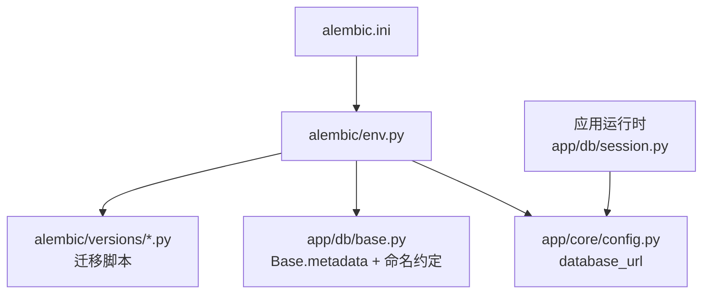
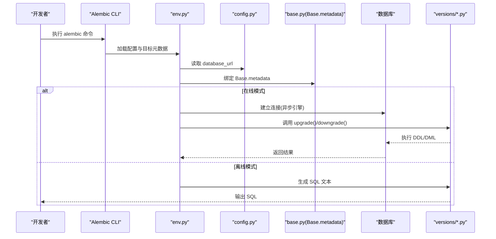
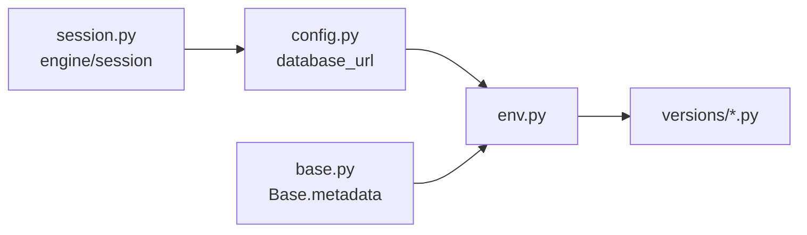

# 数据库迁移管理

<cite>
**本文引用的文件**
- [alembic.ini](file://apps/api/alembic.ini)
- [env.py](file://apps/api/alembic/env.py)
- [script.py.mako](file://apps/api/alembic/script.py.mako)
- [initialize_schema.py](file://apps/api/alembic/versions/ea649aaf28e0_initialize_schema.py)
- [create_users.py](file://apps/api/alembic/versions/f67d91555137_create_users.py)
- [create_farms_and_farm_members.py](file://apps/api/alembic/versions/9c8d9c86e54a_create_farms_and_farm_members.py)
- [create_species_and_productions.py](file://apps/api/alembic/versions/1bf2b6d1b674_create_species_and_productions.py)
- [refine_production_industry_fields.py](file://apps/api/alembic/versions/093fa42fe3ad_refine_production_industry_fields.py)
- [base.py](file://apps/api/app/db/base.py)
- [session.py](file://apps/api/app/db/session.py)
- [config.py](file://apps/api/app/core/config.py)
</cite>

## 目录
1. [简介](#简介)
2. [项目结构](#项目结构)
3. [核心组件](#核心组件)
4. [架构总览](#架构总览)
5. [详细组件分析](#详细组件分析)
6. [依赖关系分析](#依赖关系分析)
7. [性能考虑](#性能考虑)
8. [故障排查指南](#故障排查指南)
9. [结论](#结论)
10. [附录](#附录)

## 简介
本文件为 Pocket Farm 系统的数据库迁移管理文档，聚焦于 Alembic 的配置与环境设置、迁移版本控制策略、脚本生成与编写规范、复杂数据变更与批量更新操作、最佳实践（备份、增量更新、向后兼容）、常见迁移场景解决方案，以及测试与生产部署流程。目标是帮助开发者安全、可追溯地演进数据库结构，并保障线上稳定性。

## 项目结构
Pocket Farm 的迁移体系位于 apps/api 下，采用 Alembic 进行版本化迁移：
- alembic.ini：Alembic 配置文件，包含脚本位置、日志、默认数据库 URL 等。
- alembic/env.py：迁移运行环境，负责加载配置、绑定模型元数据、定义在线/离线执行路径。
- alembic/script.py.mako：迁移脚本模板，定义 upgrade/downgrade 骨架。
- alembic/versions：存放具体迁移脚本，按时间顺序形成迁移链。
- app/db/base.py：定义命名约定与 Base 元数据，统一约束命名。
- app/db/session.py：应用运行时异步引擎与会话工厂（与迁移共享数据库 URL）。
- app/core/config.py：通过环境变量或 .env 提供 database_url 等配置。

图表来源
- [alembic.ini:1-150](file://apps/api/alembic.ini#L1-L150)
- [env.py:1-103](file://apps/api/alembic/env.py#L1-L103)
- [config.py:1-23](file://apps/api/app/core/config.py#L1-L23)
- [base.py:1-15](file://apps/api/app/db/base.py#L1-L15)
- [session.py:1-7](file://apps/api/app/db/session.py#L1-L7)

章节来源
- [alembic.ini:1-150](file://apps/api/alembic.ini#L1-L150)
- [env.py:1-103](file://apps/api/alembic/env.py#L1-L103)
- [config.py:1-23](file://apps/api/app/core/config.py#L1-L23)
- [base.py:1-15](file://apps/api/app/db/base.py#L1-L15)
- [session.py:1-7](file://apps/api/app/db/session.py#L1-L7)

## 核心组件
- Alembic 配置与运行入口
  - alembic.ini 指定脚本位置、日志级别、默认数据库 URL（占位符），并提供 post_write_hooks 扩展点。
  - env.py 将 settings.database_url 注入到 Alembic 上下文，绑定 Base.metadata，定义 offline/online 两种执行模式，并使用异步引擎运行迁移。
- 模型与命名约定
  - base.py 定义了统一的索引、唯一约束、外键、主键命名约定，确保迁移生成的对象命名一致。
- 配置来源
  - config.py 通过 pydantic-settings 从环境变量或 .env 读取 database_url，供迁移与应用共用。
- 迁移脚本模板
  - script.py.mako 提供 revision、down_revision、upgrade/downgrade 的骨架，便于自动生成与编辑。

章节来源
- [alembic.ini:1-150](file://apps/api/alembic.ini#L1-L150)
- [env.py:1-103](file://apps/api/alembic/env.py#L1-L103)
- [base.py:1-15](file://apps/api/app/db/base.py#L1-L15)
- [config.py:1-23](file://apps/api/app/core/config.py#L1-L23)
- [script.py.mako:1-29](file://apps/api/alembic/script.py.mako#L1-L29)

## 架构总览
迁移执行链路如下：
- 命令行触发 alembic 命令（如 revision、upgrade、downgrade）。
- env.py 根据是否离线模式选择执行路径：
  - 离线模式：仅使用 URL 和 metadata 生成 SQL 输出。
  - 在线模式：创建异步引擎，连接数据库并执行迁移。
- 迁移脚本在 versions 目录下按 down_revision 链接成线性历史。

图表来源
- [env.py:48-103](file://apps/api/alembic/env.py#L48-L103)
- [config.py:1-23](file://apps/api/app/core/config.py#L1-L23)
- [base.py:1-15](file://apps/api/app/db/base.py#L1-L15)

## 详细组件分析

### Alembic 配置与环境设置
- 数据库连接
  - alembic.ini 中设置了默认 sqlalchemy.url（占位符），实际由 env.py 覆盖为 settings.database_url。
  - 应用运行时也通过 session.py 使用同一 database_url，保证迁移与应用一致性。
- 日志与钩子
  - 日志级别集中在 alembic.ini 的 [loggers] 段，便于调试。
  - post_write_hooks 预留格式化/检查工具集成点（如 ruff/black）。
- 模板与脚本
  - script.py.mako 提供标准迁移骨架，revision 与 down_revision 由 Alembic 自动填充。

章节来源
- [alembic.ini:1-150](file://apps/api/alembic.ini#L1-L150)
- [env.py:1-103](file://apps/api/alembic/env.py#L1-L103)
- [script.py.mako:1-29](file://apps/api/alembic/script.py.mako#L1-L29)
- [session.py:1-7](file://apps/api/app/db/session.py#L1-L7)

### 迁移版本控制策略
- 版本链与依赖
  - 每个迁移脚本声明 revision 与 down_revision，形成线性依赖链。例如：
    - initialize_schema -> create_users -> create_farms_and_farm_members -> create_species_and_productions -> refine_production_industry_fields
  - 分支与合并：当前仓库未使用 branch_labels/depends_on 多分支，建议保持单线演进以降低复杂度。
- 命名规范
  - 文件名格式：<短哈希>_<描述>.py，描述建议使用英文小写下划线，语义清晰。
  - 建议在提交前对描述进行规范化，便于检索与审计。
- 回滚机制
  - 每个迁移必须实现 downgrade()，确保可逆性。
  - 对于不可逆的数据变更，应在 downgrade 中记录告警或保留必要信息以便人工修复。

章节来源
- [initialize_schema.py:1-29](file://apps/api/alembic/versions/ea649aaf28e0_initialize_schema.py#L1-L29)
- [create_users.py:1-41](file://apps/api/alembic/versions/f67d91555137_create_users.py#L1-L41)
- [create_farms_and_farm_members.py:1-62](file://apps/api/alembic/versions/9c8d9c86e54a_create_farms_and_farm_members.py#L1-L62)
- [create_species_and_productions.py:1-113](file://apps/api/alembic/versions/1bf2b6d1b674_create_species_and_productions.py#L1-L113)
- [refine_production_industry_fields.py:1-86](file://apps/api/alembic/versions/093fa42fe3ad_refine_production_industry_fields.py#L1-L86)

### 创建新迁移脚本与规则
- 生成步骤
  - 修改模型后，使用 Alembic 自动生成迁移脚本，随后审查并完善 upgrade/downgrade。
  - 若需手动维护，可基于 script.py.mako 模板编写。
- 脚本要求
  - 明确声明 revision 与 down_revision，保证依赖链连续。
  - 使用 op.* 提供的 DDL/DML 接口，避免硬编码 SQL 除非确有必要。
  - 遵循 base.py 的命名约定，确保约束名一致。
- 代码风格
  - 可在 alembic.ini 的 post_write_hooks 中启用 ruff/black 等工具，保证脚本风格统一。

章节来源
- [script.py.mako:1-29](file://apps/api/alembic/script.py.mako#L1-L29)
- [base.py:1-15](file://apps/api/app/db/base.py#L1-L15)
- [alembic.ini:92-114](file://apps/api/alembic.ini#L92-L114)

### 复杂数据变更与批量更新
- 表结构变更
  - 新增列、修改类型、删除列、添加/删除索引与约束等，均通过 op.* 完成。
  - 示例参考：
    - 新增字段与类型调整：[refine_production_industry_fields.py:21-60](file://apps/api/alembic/versions/093fa42fe3ad_refine_production_industry_fields.py#L21-L60)
    - 建表与索引：[create_species_and_productions.py:22-104](file://apps/api/alembic/versions/1bf2b6d1b674_create_species_and_productions.py#L22-L104)
- 数据迁移与批量更新
  - 使用 op.execute 执行原生 SQL 进行条件更新；或使用 op.bulk_insert 批量插入初始数据。
  - 示例参考：
    - 条件更新 species.individual_unit：[refine_production_industry_fields.py:42-59](file://apps/api/alembic/versions/093fa42fe3ad_refine_production_industry_fields.py#L42-L59)
    - 批量插入物种初始数据：[create_species_and_productions.py:32-66](file://apps/api/alembic/versions/1bf2b6d1b674_create_species_and_productions.py#L32-L66)
- 注意事项
  - 大表 DDL 可能锁表，建议在低峰期执行并分批处理。
  - 数据迁移应幂等，支持重复执行不破坏数据。

章节来源
- [refine_production_industry_fields.py:21-86](file://apps/api/alembic/versions/093fa42fe3ad_refine_production_industry_fields.py#L21-L86)
- [create_species_and_productions.py:22-113](file://apps/api/alembic/versions/1bf2b6d1b674_create_species_and_productions.py#L22-L113)

### 迁移最佳实践
- 数据备份
  - 在生产执行迁移前，务必对数据库进行快照或逻辑备份。
- 增量更新
  - 每次迁移只解决一个变更点，保持脚本小而专注，便于回滚与审查。
- 向后兼容性
  - 先加字段再改业务逻辑，最后删旧字段，分阶段发布，降低风险。
  - 对必填字段变更，先在升级中填充默认值，再改为 NOT NULL。
- 可观测性与审计
  - 开启适当日志级别，记录迁移执行时间与错误堆栈。
  - 在迁移脚本中加入关键步骤注释与校验。

[本节为通用指导，不直接分析具体文件]

### 常见迁移场景与解决方案
- 表结构变更
  - 新增列：使用 op.add_column，必要时设置默认值或允许空。
  - 修改列类型：使用 op.alter_column，注意数据类型兼容性与数据转换。
  - 删除列/索引/约束：谨慎操作，确认无外部依赖后再移除。
- 数据迁移
  - 使用 op.execute 进行条件更新；大批量数据建议分批处理，避免长事务。
  - 初始数据：使用 op.bulk_insert 批量写入字典列表。
- 性能优化
  - 为高频查询列添加索引；在迁移中评估索引必要性。
  - 大表 DDL 尽量在维护窗口执行，并监控锁等待。

[本节为通用指导，不直接分析具体文件]

### 迁移测试策略
- 单元测试
  - 针对迁移脚本中的复杂 SQL 或数据转换逻辑，编写独立测试用例验证正确性。
- 集成测试
  - 使用测试数据库执行完整迁移链（upgrade/downgrade），验证状态机与数据一致性。
- 回归测试
  - 在 CI 中执行 alembic upgrade head 与 downgrade base，确保全链路可逆。
- 数据校验
  - 在迁移完成后增加数据完整性检查（计数、范围、枚举值等）。

[本节为通用指导，不直接分析具体文件]

### 生产环境部署流程
- 预检
  - 确认数据库连接、权限、磁盘空间与备份可用。
  - 预览迁移 SQL（离线模式）以审查变更。
- 执行
  - 在低峰期执行 alembic upgrade head，观察日志与慢查询。
  - 对大表变更，考虑分批与限流。
- 回滚
  - 若失败，立即回滚至上一稳定版本，恢复备份数据。
  - 记录问题根因，补充自动化检查与防护。
- 发布后验证
  - 运行健康检查与关键业务用例，确认服务可用性。

[本节为通用指导，不直接分析具体文件]

## 依赖关系分析
迁移与环境的关键依赖如下：
- env.py 依赖 config.py 的 database_url，并绑定 base.py 的 Base.metadata。
- 迁移脚本依赖 alembic 的 op 接口与 SQLAlchemy 类型。
- 应用运行时通过 session.py 复用同一数据库 URL，确保迁移与应用一致。

图表来源
- [env.py:1-103](file://apps/api/alembic/env.py#L1-L103)
- [config.py:1-23](file://apps/api/app/core/config.py#L1-L23)
- [base.py:1-15](file://apps/api/app/db/base.py#L1-L15)
- [session.py:1-7](file://apps/api/app/db/session.py#L1-L7)

章节来源
- [env.py:1-103](file://apps/api/alembic/env.py#L1-L103)
- [config.py:1-23](file://apps/api/app/core/config.py#L1-L23)
- [base.py:1-15](file://apps/api/app/db/base.py#L1-L15)
- [session.py:1-7](file://apps/api/app/db/session.py#L1-L7)

## 性能考虑
- 大表 DDL 与索引重建会引发锁与 IO 压力，建议在维护窗口执行。
- 批量数据更新应分批提交，减少事务长度与锁竞争。
- 合理设计索引，避免过多写放大。
- 使用 Alembic 的离线模式预览 SQL，提前发现潜在性能问题。

[本节为通用指导，不直接分析具体文件]

## 故障排查指南
- 连接失败
  - 检查 alembic.ini 与 env.py 是否正确覆盖 database_url。
  - 确认网络、账号权限与防火墙策略。
- 迁移冲突
  - 检查 down_revision 链是否连续，避免断链或多头。
  - 使用 alembic history 查看迁移历史。
- 数据不一致
  - 在迁移中增加数据校验与告警，发现问题及时回滚。
- 日志定位
  - 调整 alembic.ini 的日志级别，捕获详细执行过程。

章节来源
- [alembic.ini:115-150](file://apps/api/alembic.ini#L115-L150)
- [env.py:48-103](file://apps/api/alembic/env.py#L48-L103)

## 结论
Pocket Farm 的迁移体系基于 Alembic，结合集中式配置、统一命名约定与清晰的版本链，实现了安全可控的数据库演进。通过严格的脚本规范、完善的回滚机制与测试策略，可有效降低生产风险。建议持续遵循“小步快跑、可逆优先、充分验证”的原则，确保系统长期稳定演进。

[本节为总结性内容，不直接分析具体文件]

## 附录
- 常用命令
  - 生成迁移：alembic revision --autogenerate -m "描述"
  - 执行迁移：alembic upgrade head
  - 回滚迁移：alembic downgrade -1
  - 查看历史：alembic history
  - 离线预览：alembic upgrade --sql-file out.sql head
- 参考文件
  - 迁移脚本示例：
    - [create_users.py:21-41](file://apps/api/alembic/versions/f67d91555137_create_users.py#L21-L41)
    - [create_farms_and_farm_members.py:21-62](file://apps/api/alembic/versions/9c8d9c86e54a_create_farms_and_farm_members.py#L21-L62)
    - [create_species_and_productions.py:22-113](file://apps/api/alembic/versions/1bf2b6d1b674_create_species_and_productions.py#L22-L113)
    - [refine_production_industry_fields.py:21-86](file://apps/api/alembic/versions/093fa42fe3ad_refine_production_industry_fields.py#L21-L86)

[本节为补充信息，不直接分析具体文件]