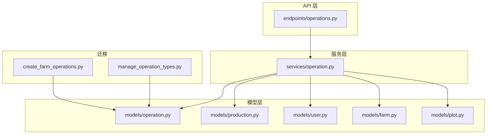
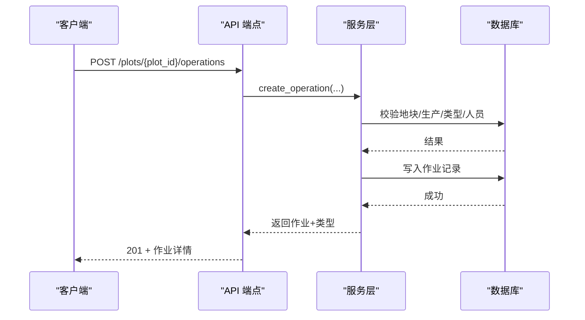
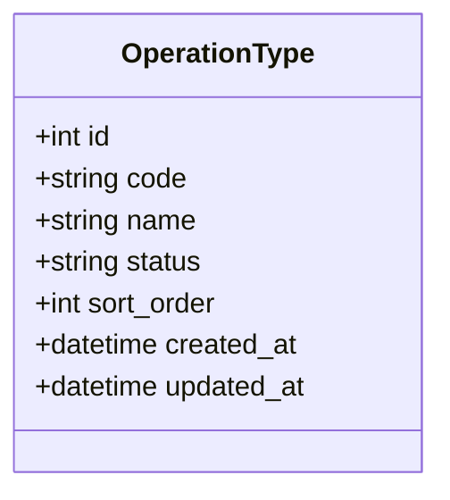
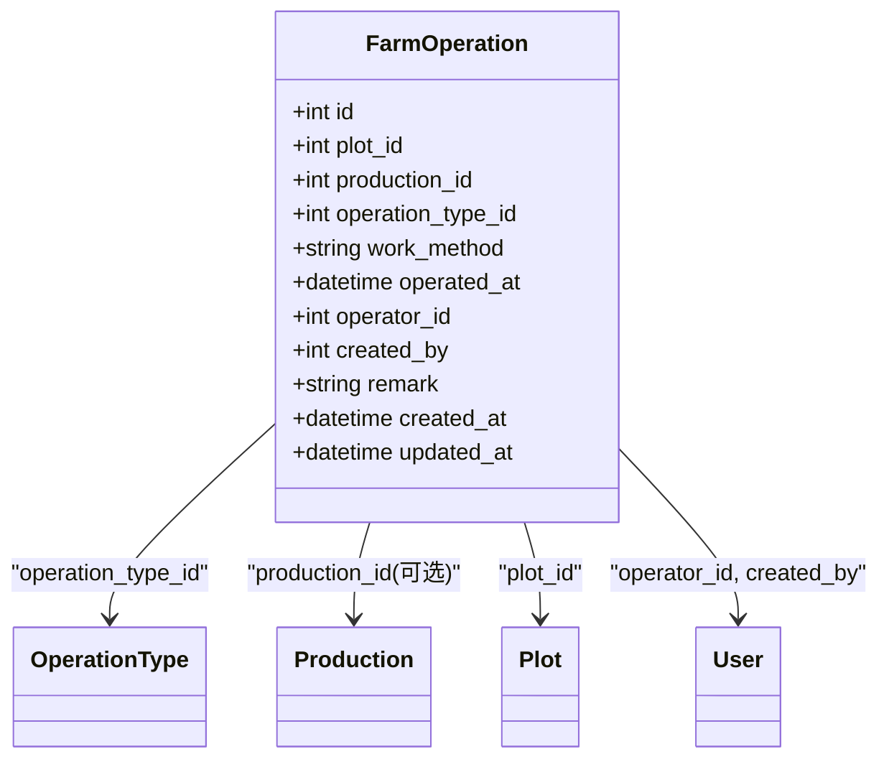
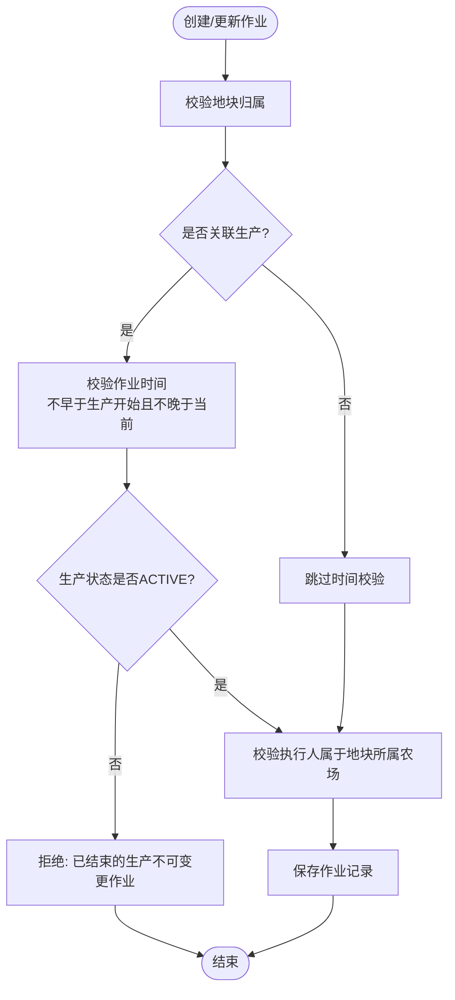
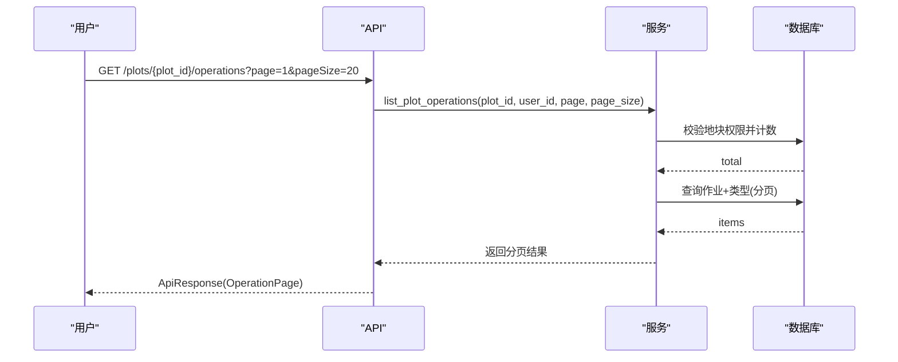
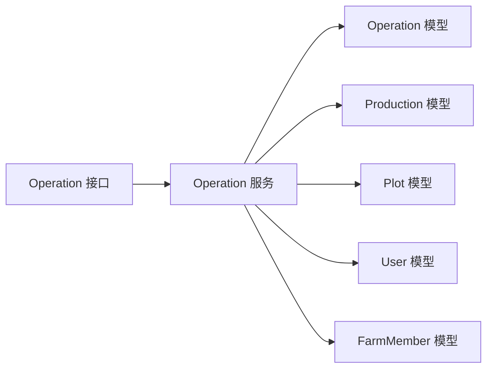

# 作业模型 (Operation)

<cite>
**本文引用的文件**
- [apps/api/app/models/operation.py](file://apps/api/app/models/operation.py)
- [apps/api/app/schemas/operation.py](file://apps/api/app/schemas/operation.py)
- [apps/api/app/services/operation.py](file://apps/api/app/services/operation.py)
- [apps/api/app/api/v1/endpoints/operations.py](file://apps/api/app/api/v1/endpoints/operations.py)
- [apps/api/app/models/production.py](file://apps/api/app/models/production.py)
- [apps/api/app/models/user.py](file://apps/api/app/models/user.py)
- [apps/api/app/models/farm.py](file://apps/api/app/models/farm.py)
- [apps/api/app/models/plot.py](file://apps/api/app/models/plot.py)
- [apps/api/alembic/versions/2c972e3fc98e_create_farm_operations.py](file://apps/api/alembic/versions/2c972e3fc98e_create_farm_operations.py)
- [apps/api/alembic/versions/54698bd6b5f1_manage_operation_types.py](file://apps/api/alembic/versions/54698bd6b5f1_manage_operation_types.py)
- [apps/api/tests/test_operations.py](file://apps/api/tests/test_operations.py)
</cite>

## 目录
1. [简介](#简介)
2. [项目结构](#项目结构)
3. [核心组件](#核心组件)
4. [架构总览](#架构总览)
5. [详细组件分析](#详细组件分析)
6. [依赖关系分析](#依赖关系分析)
7. [性能与扩展性](#性能与扩展性)
8. [故障排查指南](#故障排查指南)
9. [结论](#结论)
10. [附录：数据录入最佳实践与校验规则](#附录：数据录入最佳实践与校验规则)

## 简介
本章节面向 Pocket Farm 系统的“作业”（Operation）领域，系统化说明作业实体字段、作业类型分类与管理、作业与生产/地块/用户的关联关系、作业记录的查询分页与统计能力，以及数据录入的最佳实践与校验规则。文档基于后端 API、服务层、数据模型与迁移脚本进行分析，确保内容与实际实现一致。

## 项目结构
围绕作业模型的代码主要分布在以下位置：
- 数据模型：定义作业与作业类型的数据库表结构与字段约束
- 请求/响应模式：定义接口入参与返回结构的校验与序列化
- 服务层：封装业务规则、权限校验、时间校验、状态一致性检查等
- 接口层：暴露 RESTful 端点，负责参数绑定、调用服务层、组装响应
- 迁移脚本：定义作业表与作业类型表的创建、初始数据与字段演进
- 测试用例：覆盖作业类型管理、作业增删改查、权限与状态约束等场景

图表来源
- [apps/api/app/api/v1/endpoints/operations.py:63-168](file://apps/api/app/api/v1/endpoints/operations.py#L63-L168)
- [apps/api/app/services/operation.py:99-307](file://apps/api/app/services/operation.py#L99-L307)
- [apps/api/app/models/operation.py:18-80](file://apps/api/app/models/operation.py#L18-L80)
- [apps/api/alembic/versions/2c972e3fc98e_create_farm_operations.py:21-45](file://apps/api/alembic/versions/2c972e3fc98e_create_farm_operations.py#L21-L45)
- [apps/api/alembic/versions/54698bd6b5f1_manage_operation_types.py:22-99](file://apps/api/alembic/versions/54698bd6b5f1_manage_operation_types.py#L22-L99)

章节来源
- [apps/api/app/api/v1/endpoints/operations.py:63-168](file://apps/api/app/api/v1/endpoints/operations.py#L63-L168)
- [apps/api/app/services/operation.py:99-307](file://apps/api/app/services/operation.py#L99-L307)
- [apps/api/app/models/operation.py:18-80](file://apps/api/app/models/operation.py#L18-L80)
- [apps/api/alembic/versions/2c972e3fc98e_create_farm_operations.py:21-45](file://apps/api/alembic/versions/2c972e3fc98e_create_farm_operations.py#L21-L45)
- [apps/api/alembic/versions/54698bd6b5f1_manage_operation_types.py:22-99](file://apps/api/alembic/versions/54698bd6b5f1_manage_operation_types.py#L22-L99)

## 核心组件
- 作业类型 OperationType：用于标准化作业类别，支持启用/禁用与排序展示
- 农场作业 FarmOperation：记录一次具体作业的执行信息，包括作业类型、执行日期、执行人、作业方式、备注等
- 生产 Production：作业可归属到某次生产批次，受生产生命周期约束
- 用户 User：作业由谁创建、由谁执行
- 地块 Plot：作业发生在哪个地块
- 农场成员 FarmMember：用于权限校验，确保操作者属于该地块所属农场

章节来源
- [apps/api/app/models/operation.py:18-80](file://apps/api/app/models/operation.py#L18-L80)
- [apps/api/app/models/production.py:43-79](file://apps/api/app/models/production.py#L43-L79)
- [apps/api/app/models/user.py:15-28](file://apps/api/app/models/user.py#L15-L28)
- [apps/api/app/models/plot.py:31-54](file://apps/api/app/models/plot.py#L31-L54)
- [apps/api/app/models/farm.py:18-59](file://apps/api/app/models/farm.py#L18-L59)

## 架构总览
作业模块采用分层架构：
- 接口层：接收 HTTP 请求，进行基础参数校验，调用服务层
- 服务层：实现业务规则（权限、时间、状态、关联一致性），访问数据库
- 模型层：映射数据库表结构，提供 ORM 对象
- 迁移脚本：维护数据库结构变更与初始数据

图表来源
- [apps/api/app/api/v1/endpoints/operations.py:91-114](file://apps/api/app/api/v1/endpoints/operations.py#L91-L114)
- [apps/api/app/services/operation.py:139-181](file://apps/api/app/services/operation.py#L139-L181)

章节来源
- [apps/api/app/api/v1/endpoints/operations.py:63-168](file://apps/api/app/api/v1/endpoints/operations.py#L63-L168)
- [apps/api/app/services/operation.py:99-307](file://apps/api/app/services/operation.py#L99-L307)

## 详细组件分析

### 作业类型 OperationType
- 字段说明
  - id：自增主键
  - code：唯一编码，便于前端选择与系统识别
  - name：人类可读名称
  - status：ACTIVE/DISABLED，控制是否可用
  - sort_order：排序权重，影响列表展示顺序
  - created_at/updated_at：审计时间戳
- 管理机制
  - 仅暴露 ACTIVE 的作业类型给前端
  - 创建/更新作业时会校验所选类型必须为 ACTIVE
  - 提供分页查询接口以获取作业类型列表

图表来源
- [apps/api/app/models/operation.py:18-35](file://apps/api/app/models/operation.py#L18-L35)
- [apps/api/app/services/operation.py:99-114](file://apps/api/app/services/operation.py#L99-L114)
- [apps/api/app/api/v1/endpoints/operations.py:148-168](file://apps/api/app/api/v1/endpoints/operations.py#L148-L168)

章节来源
- [apps/api/app/models/operation.py:18-35](file://apps/api/app/models/operation.py#L18-L35)
- [apps/api/app/services/operation.py:99-114](file://apps/api/app/services/operation.py#L99-L114)
- [apps/api/app/api/v1/endpoints/operations.py:148-168](file://apps/api/app/api/v1/endpoints/operations.py#L148-L168)

### 农场作业 FarmOperation
- 字段说明
  - id：自增主键
  - plot_id：所属地块（外键）
  - production_id：可选，归属的生产批次（外键）
  - operation_type_id：作业类型（外键）
  - work_method：作业方式（手工/机械）
  - operated_at：作业执行时间（带时区校验）
  - operator_id：实际执行人（外键）
  - created_by：创建人（外键）
  - remark：备注
  - created_at/updated_at：审计时间戳
- 索引与约束
  - 对 plot_id、production_id、operator_id、operation_type_id 建立索引以提升查询性能
  - 外键均设置为 RESTRICT，避免误删关联数据

图表来源
- [apps/api/app/models/operation.py:37-80](file://apps/api/app/models/operation.py#L37-L80)
- [apps/api/alembic/versions/2c972e3fc98e_create_farm_operations.py:21-45](file://apps/api/alembic/versions/2c972e3fc98e_create_farm_operations.py#L21-L45)
- [apps/api/alembic/versions/54698bd6b5f1_manage_operation_types.py:68-99](file://apps/api/alembic/versions/54698bd6b5f1_manage_operation_types.py#L68-L99)

章节来源
- [apps/api/app/models/operation.py:37-80](file://apps/api/app/models/operation.py#L37-L80)
- [apps/api/alembic/versions/2c972e3fc98e_create_farm_operations.py:21-45](file://apps/api/alembic/versions/2c972e3fc98e_create_farm_operations.py#L21-L45)
- [apps/api/alembic/versions/54698bd6b5f1_manage_operation_types.py:68-99](file://apps/api/alembic/versions/54698bd6b5f1_manage_operation_types.py#L68-L99)

### 作业与生产、地块、用户的关联关系
- 与地块 Plot：作业必须属于某个地块；通过 plot_id 关联
- 与生产 Production：作业可归属到某次生产；若关联生产，则：
  - 作业时间不得早于生产开始日期
  - 作业时间不得晚于当前时间
  - 生产必须处于 ACTIVE 状态，否则禁止修改/删除作业
- 与用户 User：
  - created_by：记录创建者
  - operator_id：记录实际执行人；需属于该地块所属农场成员
- 权限控制：
  - 查询/编辑/删除作业需具备对应地块的访问权限（通过 FarmMember 校验）

图表来源
- [apps/api/app/services/operation.py:33-80](file://apps/api/app/services/operation.py#L33-L80)
- [apps/api/app/services/operation.py:207-219](file://apps/api/app/services/operation.py#L207-L219)
- [apps/api/tests/test_operations.py:213-260](file://apps/api/tests/test_operations.py#L213-L260)
- [apps/api/tests/test_operations.py:322-378](file://apps/api/tests/test_operations.py#L322-L378)

章节来源
- [apps/api/app/services/operation.py:33-80](file://apps/api/app/services/operation.py#L33-L80)
- [apps/api/app/services/operation.py:207-219](file://apps/api/app/services/operation.py#L207-L219)
- [apps/api/tests/test_operations.py:213-260](file://apps/api/tests/test_operations.py#L213-L260)
- [apps/api/tests/test_operations.py:322-378](file://apps/api/tests/test_operations.py#L322-L378)

### 作业类型分类与初始数据
- 内置作业类型包含但不限于：施肥、翻耕、起垄、用药、灌溉、除草、修剪、喂料、消毒、清粪、配种、投料、换水、清塘、测水温等
- 每个类型具备唯一 code、name、status、sort_order
- 初始数据在迁移中批量插入，便于系统开箱即用

章节来源
- [apps/api/alembic/versions/54698bd6b5f1_manage_operation_types.py:46-66](file://apps/api/alembic/versions/54698bd6b5f1_manage_operation_types.py#L46-L66)

### 作业记录的查询与分页
- 按地块查询作业列表：支持分页（page、pageSize），默认按作业时间倒序
- 返回列表包含作业详情及作业类型信息
- 查询前会校验调用者对该地块的访问权限

图表来源
- [apps/api/app/api/v1/endpoints/operations.py:63-88](file://apps/api/app/api/v1/endpoints/operations.py#L63-L88)
- [apps/api/app/services/operation.py:117-136](file://apps/api/app/services/operation.py#L117-L136)

章节来源
- [apps/api/app/api/v1/endpoints/operations.py:63-88](file://apps/api/app/api/v1/endpoints/operations.py#L63-L88)
- [apps/api/app/services/operation.py:117-136](file://apps/api/app/services/operation.py#L117-L136)

### 作业数据的增删改
- 创建：POST /plots/{plot_id}/operations
  - 必填：作业类型、地块
  - 可选：生产、作业方式、执行时间、执行人、备注
  - 自动填充：未指定执行人时使用当前用户
- 更新：PATCH /operations/{operation_id}
  - 支持部分更新，仅提交需要变更的字段
  - 若关联生产且生产已结束，禁止修改
- 删除：DELETE /operations/{operation_id}
  - 若关联生产且生产已结束，禁止删除

章节来源
- [apps/api/app/api/v1/endpoints/operations.py:91-145](file://apps/api/app/api/v1/endpoints/operations.py#L91-L145)
- [apps/api/app/services/operation.py:139-307](file://apps/api/app/services/operation.py#L139-L307)

## 依赖关系分析
- 模型依赖
  - FarmOperation 引用 OperationType、Production、Plot、User
  - 通过外键保证数据完整性
- 服务依赖
  - 使用 Plot、FarmMember、Production、User 的服务或查询方法完成权限与一致性校验
- 接口依赖
  - 依赖 Pydantic 模型进行请求/响应校验与序列化
  - 依赖统一响应封装 ApiResponse

图表来源
- [apps/api/app/api/v1/endpoints/operations.py:1-27](file://apps/api/app/api/v1/endpoints/operations.py#L1-L27)
- [apps/api/app/services/operation.py:1-15](file://apps/api/app/services/operation.py#L1-L15)

章节来源
- [apps/api/app/api/v1/endpoints/operations.py:1-27](file://apps/api/app/api/v1/endpoints/operations.py#L1-L27)
- [apps/api/app/services/operation.py:1-15](file://apps/api/app/services/operation.py#L1-L15)

## 性能与扩展性
- 查询优化
  - 对常用过滤字段建立索引：plot_id、production_id、operator_id、operation_type_id
  - 列表查询使用分页，避免一次性加载大量数据
- 事务与锁
  - 更新/删除涉及关联生产时，使用行级锁防止并发冲突
- 可扩展点
  - 作业类型可按业务扩展新的枚举值与初始数据
  - 可在服务层增加更细粒度的统计聚合（如按类型、按时间段、按执行人）

章节来源
- [apps/api/alembic/versions/2c972e3fc98e_create_farm_operations.py:42-44](file://apps/api/alembic/versions/2c972e3fc98e_create_farm_operations.py#L42-L44)
- [apps/api/app/services/operation.py:198-204](file://apps/api/app/services/operation.py#L198-L204)

## 故障排查指南
- 常见错误与原因
  - 404 未找到：作业不存在或无权限访问该地块/作业
  - 409 业务冲突：尝试修改/删除已结束生产的作业；或选择了已禁用的作业类型
  - 422 校验失败：作业时间非法（未来时间或早于生产开始）、执行人不属于地块所属农场、必填字段缺失
- 定位步骤
  - 确认调用者具备地块访问权限（FarmMember）
  - 确认作业类型状态为 ACTIVE
  - 确认作业时间与生产开始时间的关系合法
  - 查看日志中的错误码与消息，结合测试用例快速复现

章节来源
- [apps/api/app/services/operation.py:17-26](file://apps/api/app/services/operation.py#L17-L26)
- [apps/api/app/services/operation.py:33-80](file://apps/api/app/services/operation.py#L33-L80)
- [apps/api/tests/test_operations.py:151-173](file://apps/api/tests/test_operations.py#L151-L173)
- [apps/api/tests/test_operations.py:213-260](file://apps/api/tests/test_operations.py#L213-L260)
- [apps/api/tests/test_operations.py:264-319](file://apps/api/tests/test_operations.py#L264-L319)
- [apps/api/tests/test_operations.py:322-378](file://apps/api/tests/test_operations.py#L322-L378)

## 结论
作业模型通过清晰的实体设计与严格的服务层校验，实现了作业的类型化、可追溯与强一致性管理。作业与生产、地块、用户之间的关联关系明确，权限控制严谨，满足农场日常作业记录与管理的核心需求。后续可在统计报表方面进一步扩展，以满足多维度数据分析。

## 附录：数据录入最佳实践与校验规则
- 必填项
  - 作业类型：必须选择有效的 ACTIVE 类型
  - 地块：必须存在且调用者有访问权限
- 可选项
  - 生产：若关联生产，需确保生产处于 ACTIVE 状态
  - 作业方式：默认为手工，可改为机械
  - 执行人：若不指定，默认使用当前登录用户
  - 备注：建议填写关键信息，便于追溯
- 时间校验
  - 作业时间必须包含时区偏移
  - 作业时间不得晚于当前时间
  - 若关联生产，作业时间不得早于生产开始日期
- 权限校验
  - 执行人必须属于该地块所属农场成员
- 状态约束
  - 已结束的生产不允许新增/修改/删除其作业
- 推荐实践
  - 优先使用作业类型编码进行选择，减少歧义
  - 尽量在作业完成后及时录入，避免补录导致的时间偏差
  - 对重要作业添加备注，记录关键参数或异常

章节来源
- [apps/api/app/schemas/operation.py:9-48](file://apps/api/app/schemas/operation.py#L9-L48)
- [apps/api/app/schemas/operation.py:50-84](file://apps/api/app/schemas/operation.py#L50-L84)
- [apps/api/app/services/operation.py:33-80](file://apps/api/app/services/operation.py#L33-L80)
- [apps/api/tests/test_operations.py:175-211](file://apps/api/tests/test_operations.py#L175-L211)
- [apps/api/tests/test_operations.py:213-260](file://apps/api/tests/test_operations.py#L213-L260)
- [apps/api/tests/test_operations.py:264-319](file://apps/api/tests/test_operations.py#L264-L319)
- [apps/api/tests/test_operations.py:322-378](file://apps/api/tests/test_operations.py#L322-L378)