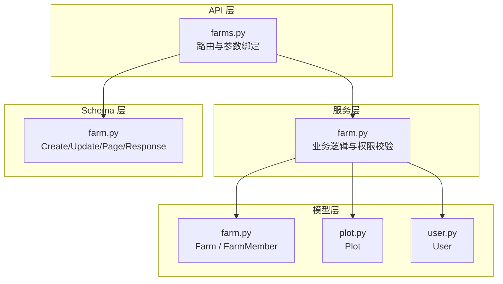
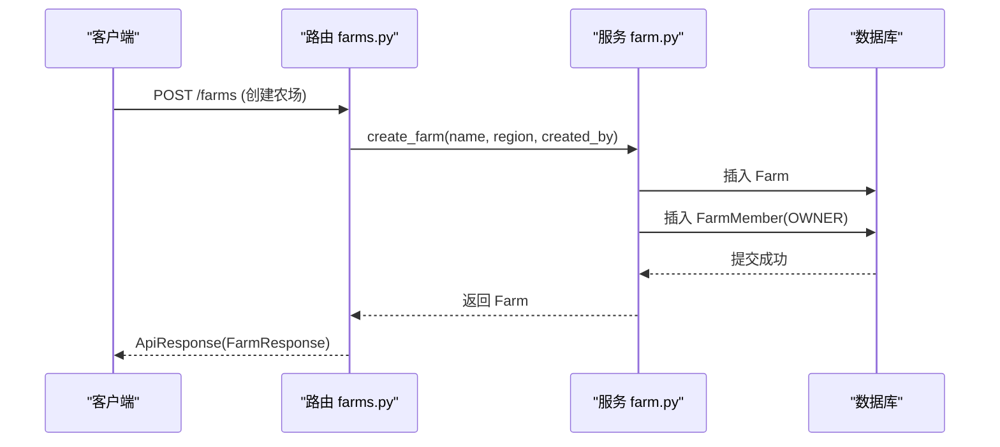
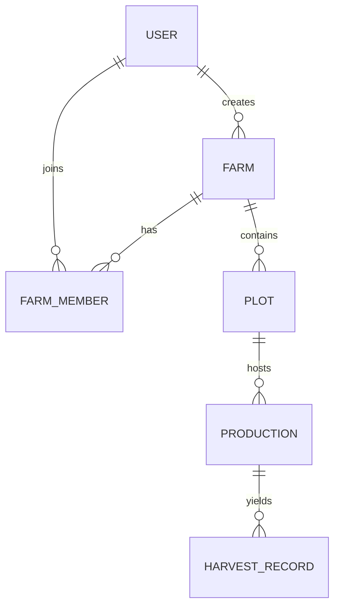
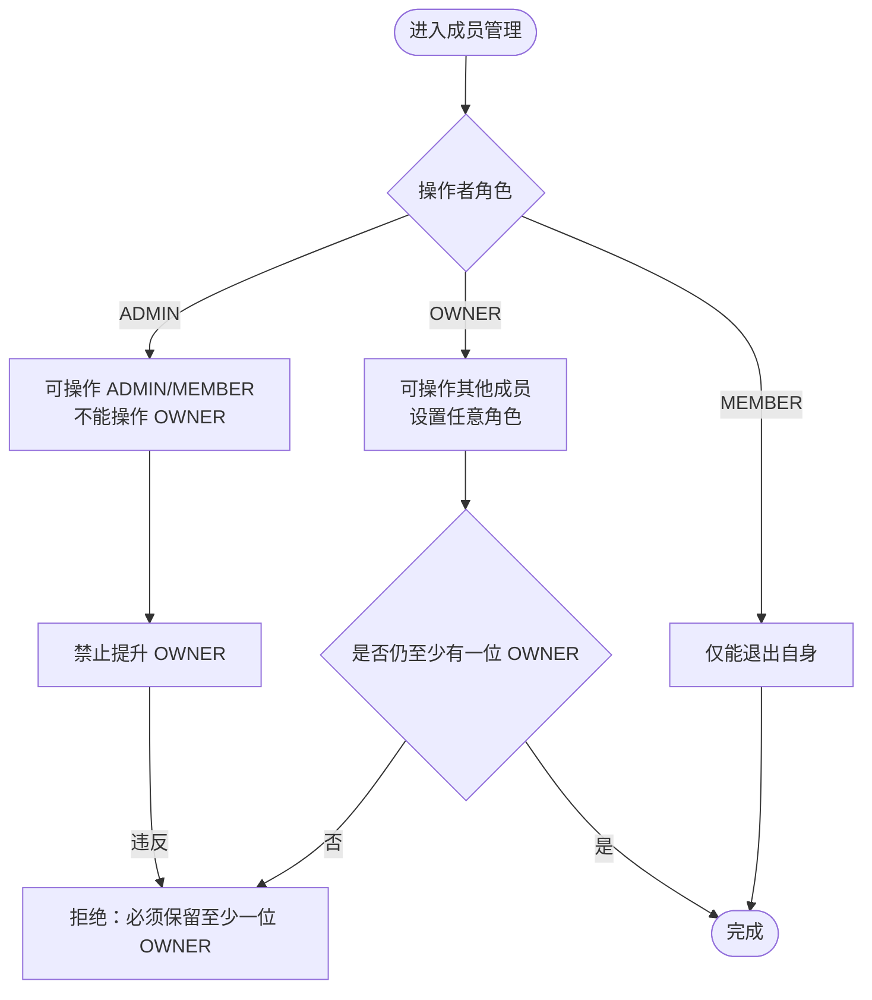
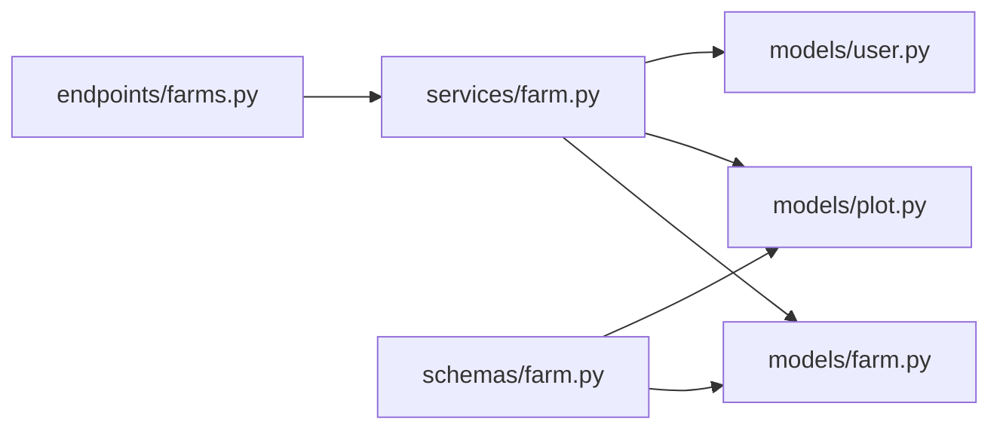

# 农场模型 (Farm)

<cite>
**本文引用的文件**
- [apps/api/app/models/farm.py](file://apps/api/app/models/farm.py)
- [apps/api/app/schemas/farm.py](file://apps/api/app/schemas/farm.py)
- [apps/api/app/services/farm.py](file://apps/api/app/services/farm.py)
- [apps/api/app/api/v1/endpoints/farms.py](file://apps/api/app/api/v1/endpoints/farms.py)
- [apps/api/app/models/plot.py](file://apps/api/app/models/plot.py)
- [apps/api/app/models/user.py](file://apps/api/app/models/user.py)
- [docs/mvp/02-domain-model.md](file://docs/mvp/02-domain-model.md)
- [docs/mvp/03-business-rules.md](file://docs/mvp/03-business-rules.md)
</cite>

## 目录
1. [简介](#简介)
2. [项目结构](#项目结构)
3. [核心组件](#核心组件)
4. [架构总览](#架构总览)
5. [详细组件分析](#详细组件分析)
6. [依赖关系分析](#依赖关系分析)
7. [性能考虑](#性能考虑)
8. [故障排查指南](#故障排查指南)
9. [结论](#结论)
10. [附录](#附录)

## 简介
本文件围绕 Pocket Farm 系统中的“农场”领域实体，系统化说明其数据模型、业务属性、约束条件以及与成员、地块、生产记录等实体的关系映射；并阐述农场的生命周期状态管理与权限控制机制，提供完整的数据结构与业务规则说明。文档同时给出与代码实现对应的架构图、时序图与流程图，帮助读者从概念到实现全面理解农场模型。

## 项目结构
与农场模型直接相关的后端代码分布在以下位置：
- 数据模型定义：app/models/farm.py（农场与成员）、app/models/plot.py（地块）、app/models/user.py（用户）
- API 请求/响应模式：app/schemas/farm.py（农场、成员、地块的入参与返回结构）
- 服务层逻辑：app/services/farm.py（创建农场、成员管理、权限校验、事务与并发控制）
- 接口路由：app/api/v1/endpoints/farms.py（HTTP 端点）
- 领域与业务规则文档：docs/mvp/02-domain-model.md、docs/mvp/03-business-rules.md

图表来源
- [apps/api/app/api/v1/endpoints/farms.py:1-200](file://apps/api/app/api/v1/endpoints/farms.py#L1-L200)
- [apps/api/app/services/farm.py:1-264](file://apps/api/app/services/farm.py#L1-L264)
- [apps/api/app/models/farm.py:1-59](file://apps/api/app/models/farm.py#L1-L59)
- [apps/api/app/models/plot.py:1-54](file://apps/api/app/models/plot.py#L1-L54)
- [apps/api/app/models/user.py:1-28](file://apps/api/app/models/user.py#L1-L28)
- [apps/api/app/schemas/farm.py:1-166](file://apps/api/app/schemas/farm.py#L1-L166)

章节来源
- [apps/api/app/models/farm.py:1-59](file://apps/api/app/models/farm.py#L1-L59)
- [apps/api/app/schemas/farm.py:1-166](file://apps/api/app/schemas/farm.py#L1-L166)
- [apps/api/app/services/farm.py:1-264](file://apps/api/app/services/farm.py#L1-L264)
- [apps/api/app/api/v1/endpoints/farms.py:1-200](file://apps/api/app/api/v1/endpoints/farms.py#L1-L200)
- [apps/api/app/models/plot.py:1-54](file://apps/api/app/models/plot.py#L1-L54)
- [apps/api/app/models/user.py:1-28](file://apps/api/app/models/user.py#L1-L28)
- [docs/mvp/02-domain-model.md:101-165](file://docs/mvp/02-domain-model.md#L101-L165)
- [docs/mvp/03-business-rules.md:1-77](file://docs/mvp/03-business-rules.md#L1-L77)

## 核心组件
- 农场实体（Farm）：代表一个独立的农业生产单元，包含唯一编码、名称、区域、创建者及时间戳等基础信息。
- 农场成员（FarmMember）：表示用户在某个农场中的角色与加入时间，承载权限边界。
- 地块（Plot）：农场内的具体生产区域，支持类型、面积与边界信息，是生产记录的载体。
- 用户（User）：系统登录与认证主体，手机号为唯一标识，昵称用于展示。

章节来源
- [apps/api/app/models/farm.py:18-59](file://apps/api/app/models/farm.py#L18-L59)
- [apps/api/app/models/plot.py:31-54](file://apps/api/app/models/plot.py#L31-L54)
- [apps/api/app/models/user.py:15-28](file://apps/api/app/models/user.py#L15-L28)
- [docs/mvp/02-domain-model.md:101-165](file://docs/mvp/02-domain-model.md#L101-L165)

## 架构总览
农场模块采用分层架构：API 路由负责参数校验与响应封装；服务层实现业务规则、权限校验与事务控制；模型层定义持久化结构与关联关系；Schema 层统一输入输出契约。

图表来源
- [apps/api/app/api/v1/endpoints/farms.py:78-91](file://apps/api/app/api/v1/endpoints/farms.py#L78-L91)
- [apps/api/app/services/farm.py:33-53](file://apps/api/app/services/farm.py#L33-L53)

章节来源
- [apps/api/app/api/v1/endpoints/farms.py:58-119](file://apps/api/app/api/v1/endpoints/farms.py#L58-L119)
- [apps/api/app/services/farm.py:33-53](file://apps/api/app/services/farm.py#L33-L53)

## 详细组件分析

### 农场实体（Farm）字段与约束
- 主键 id：自增 BIGINT
- 农场编码 farm_code：CHAR(6)，全局唯一，自动生成
- 名称 name：String(100)，必填
- 区域 region：String(100)，可选
- 创建者 created_by：BIGINT，外键关联 users.id，不可空
- 时间戳 created_at/updated_at：默认当前 UTC 时间，更新时自动刷新

设计要点
- farm_code 作为对外可识别的唯一标识，生成策略在服务层保证唯一性，冲突时重试。
- created_by 仅用于审计，实际权限以 FarmMember 为准。

章节来源
- [apps/api/app/models/farm.py:18-36](file://apps/api/app/models/farm.py#L18-L36)
- [apps/api/app/services/farm.py:12-18](file://apps/api/app/services/farm.py#L12-L18)
- [docs/mvp/02-domain-model.md:101-128](file://docs/mvp/02-domain-model.md#L101-L128)

### 农场成员（FarmMember）与角色体系
- 主键 id：自增 BIGINT
- 农场归属 farm_id：外键 farms.id，不可空
- 用户 user_id：外键 users.id，不可空，索引
- 角色 role：枚举值 OWNER/ADMIN/MEMBER
- 加入时间 joined_at：默认当前 UTC 时间
- 约束：UNIQUE(farm_id, user_id)，确保同一用户在同一农场仅一条成员记录

角色权限概览
- OWNER：编辑农场、管理成员、管理地块、开展生产作业（开始种养、农事、收获、结束种养）
- ADMIN：管理成员、管理地块、开展生产作业（不含编辑农场）
- MEMBER：查看、开展生产作业（不含管理农场与成员）

章节来源
- [apps/api/app/models/farm.py:39-59](file://apps/api/app/models/farm.py#L39-L59)
- [docs/mvp/03-business-rules.md:16-77](file://docs/mvp/03-business-rules.md#L16-L77)

### 农场与成员、地块、生产记录的关系映射
- 农场与成员：1:N（一个农场有多个成员）
- 农场与地块：1:N（一个农场包含多个地块）
- 地块与生产记录：1:N（一个地块可有多条历史生产记录，允许同时存在多条 ACTIVE 生产）
- 生产记录与收获记录：1:N（一次生产可多次收获）
- 农事记录：首先属于地块，可关联具体生产或整块地

图表来源
- [docs/mvp/02-domain-model.md:5-78](file://docs/mvp/02-domain-model.md#L5-L78)

章节来源
- [docs/mvp/02-domain-model.md:101-165](file://docs/mvp/02-domain-model.md#L101-L165)
- [docs/mvp/02-domain-model.md:167-187](file://docs/mvp/02-domain-model.md#L167-L187)
- [docs/mvp/02-domain-model.md:318-411](file://docs/mvp/02-domain-model.md#L318-L411)

### 农场基本信息、地理位置与面积单位
- 基本信息：name、region、farm_code、created_by、时间戳
- 地理位置：通过地块的 boundary 字段保存，使用 GCJ02 坐标系的 JSON 对象，不自动覆盖面积
- 面积单位：地块支持亩、平方米、公顷三种单位；area_value 与 area_unit 为用户确认的面积真值，area_m2 由二者换算得出

章节来源
- [apps/api/app/models/plot.py:31-54](file://apps/api/app/models/plot.py#L31-L54)
- [apps/api/app/schemas/farm.py:75-100](file://apps/api/app/schemas/farm.py#L75-L100)
- [docs/mvp/02-domain-model.md:167-217](file://docs/mvp/02-domain-model.md#L167-L217)

### 生命周期状态管理与权限控制
- 农场本身无复杂状态机，但成员角色决定操作权限
- 成员管理遵循“多 OWNER、至少保留一位 OWNER”的规则
- 管理员不能操作或提升 OWNER；普通成员只能退出自身
- 农场信息编辑仅限 OWNER
- 地块与生产记录的生命周期受生产状态约束（ACTIVE/ENDED），已结束的生产将锁定相关农事与收获记录

图表来源
- [apps/api/app/services/farm.py:94-113](file://apps/api/app/services/farm.py#L94-L113)
- [apps/api/app/services/farm.py:210-264](file://apps/api/app/services/farm.py#L210-L264)
- [docs/mvp/03-business-rules.md:16-77](file://docs/mvp/03-business-rules.md#L16-L77)

章节来源
- [apps/api/app/services/farm.py:94-113](file://apps/api/app/services/farm.py#L94-L113)
- [apps/api/app/services/farm.py:137-155](file://apps/api/app/services/farm.py#L137-L155)
- [apps/api/app/services/farm.py:181-264](file://apps/api/app/services/farm.py#L181-L264)
- [docs/mvp/03-business-rules.md:16-77](file://docs/mvp/03-business-rules.md#L16-L77)

### 农场数据结构的完整说明与业务规则
- 农场创建：在单个事务中创建农场与初始 OWNER 成员，自动生成唯一 farm_code
- 成员添加：通过手机号查找已注册用户，校验操作者权限与目标角色限制
- 成员角色变更：确保至少保留一位 OWNER，禁止 ADMIN 操作 OWNER
- 成员移除：同样需满足至少一位 OWNER 的约束
- 退出农场：OWNER 仅在仍有其他 OWNER 时可退出
- 地块创建：必填 name，建议 type/area；boundary 可选且必须为 GCJ02 坐标系
- 生产记录：一个生产只属于一个地块；同地块允许多条 ACTIVE 生产；结束生产后锁定相关记录

章节来源
- [apps/api/app/services/farm.py:33-53](file://apps/api/app/services/farm.py#L33-L53)
- [apps/api/app/services/farm.py:181-264](file://apps/api/app/services/farm.py#L181-L264)
- [apps/api/app/schemas/farm.py:75-100](file://apps/api/app/schemas/farm.py#L75-L100)
- [docs/mvp/02-domain-model.md:318-411](file://docs/mvp/02-domain-model.md#L318-L411)
- [docs/mvp/03-business-rules.md:1-77](file://docs/mvp/03-business-rules.md#L1-L77)

## 依赖关系分析
- 路由依赖服务：endpoints/farms.py 调用 services/farm.py 的业务方法
- 服务依赖模型：services/farm.py 使用 models/farm.py、models/plot.py、models/user.py 进行查询与写入
- Schema 依赖模型枚举：schemas/farm.py 引用 models.farm.FarmMemberRole、models.plot.PlotType/AreaUnit
- 领域文档与实现一致：domain model 与 business rules 对农场、成员、地块、生产关系的描述与代码实现保持一致

图表来源
- [apps/api/app/api/v1/endpoints/farms.py:1-200](file://apps/api/app/api/v1/endpoints/farms.py#L1-L200)
- [apps/api/app/services/farm.py:1-264](file://apps/api/app/services/farm.py#L1-L264)
- [apps/api/app/schemas/farm.py:1-166](file://apps/api/app/schemas/farm.py#L1-L166)

章节来源
- [apps/api/app/api/v1/endpoints/farms.py:1-200](file://apps/api/app/api/v1/endpoints/farms.py#L1-L200)
- [apps/api/app/services/farm.py:1-264](file://apps/api/app/services/farm.py#L1-L264)
- [apps/api/app/schemas/farm.py:1-166](file://apps/api/app/schemas/farm.py#L1-L166)

## 性能考虑
- 成员列表与我的农场列表使用分页查询，避免全量加载
- 成员管理操作使用行级锁 with_for_update() 防止并发修改导致角色约束失效
- 农场编码生成采用随机范围与重试机制，降低冲突概率
- 时间戳使用 UTC 无时区存储，减少时区转换开销

章节来源
- [apps/api/app/services/farm.py:73-91](file://apps/api/app/services/farm.py#L73-L91)
- [apps/api/app/services/farm.py:115-134](file://apps/api/app/services/farm.py#L115-L134)
- [apps/api/app/services/farm.py:12-18](file://apps/api/app/services/farm.py#L12-L18)

## 故障排查指南
- 找不到农场或成员：检查 farm_id/user_id 是否存在，以及当前用户是否为该农场成员
- 权限不足：确认操作者角色与目标角色是否符合规则（如 ADMIN 不能操作 OWNER）
- 唯一约束冲突：新增成员时若用户已是成员，会触发冲突错误
- 最后一名 OWNER 退出失败：确保农场至少保留一位 OWNER
- 地块边界坐标系错误：boundary.coordinateSystem 必须为 "GCJ02"

章节来源
- [apps/api/app/services/farm.py:21-30](file://apps/api/app/services/farm.py#L21-L30)
- [apps/api/app/services/farm.py:56-70](file://apps/api/app/services/farm.py#L56-L70)
- [apps/api/app/services/farm.py:94-113](file://apps/api/app/services/farm.py#L94-L113)
- [apps/api/app/services/farm.py:181-264](file://apps/api/app/services/farm.py#L181-L264)
- [apps/api/app/schemas/farm.py:163-166](file://apps/api/app/schemas/farm.py#L163-L166)

## 结论
农场模型以 Farm 为核心，结合 FarmMember 实现细粒度权限控制；通过 Plot 承载生产活动，并与 Production、HarvestRecord、FarmOperation 形成完整的业务闭环。服务层在事务与并发安全的前提下，严格实施成员角色与资源访问规则，确保数据一致性与业务合规性。文档提供的关系图、时序图与流程图有助于快速定位问题与扩展功能。

## 附录
- 农场 API 端点参考：
  - 获取我的农场列表：GET /farms
  - 创建农场：POST /farms
  - 获取农场详情：GET /farms/{farm_id}
  - 编辑农场：PATCH /farms/{farm_id}
  - 获取农场成员：GET /farms/{farm_id}/members
  - 添加成员：POST /farms/{farm_id}/members
  - 修改成员角色：PATCH /farms/{farm_id}/members/{member_id}
  - 退出农场：DELETE /farms/{farm_id}/members/me
  - 移除成员：DELETE /farms/{farm_id}/members/{member_id}

章节来源
- [apps/api/app/api/v1/endpoints/farms.py:58-200](file://apps/api/app/api/v1/endpoints/farms.py#L58-L200)