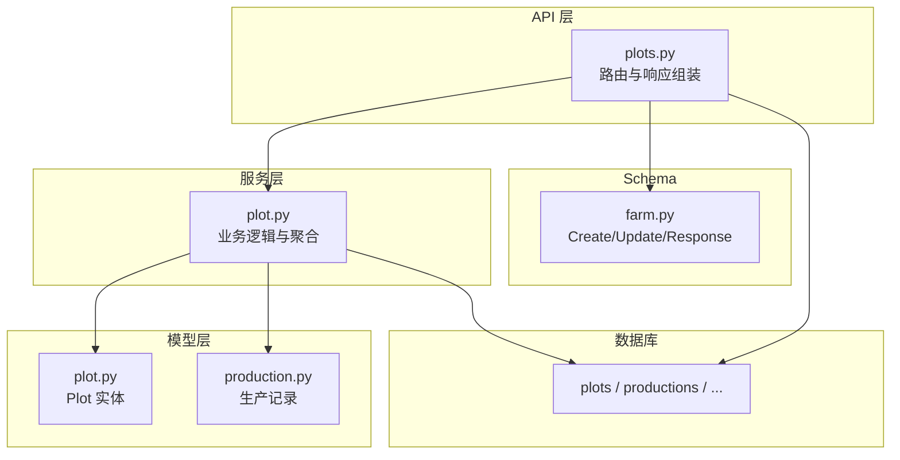
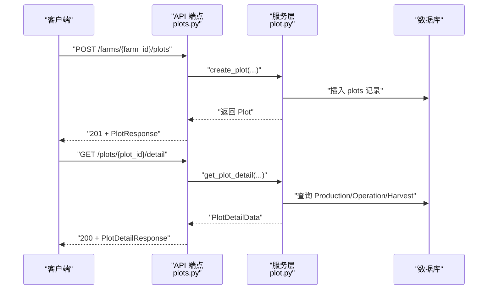
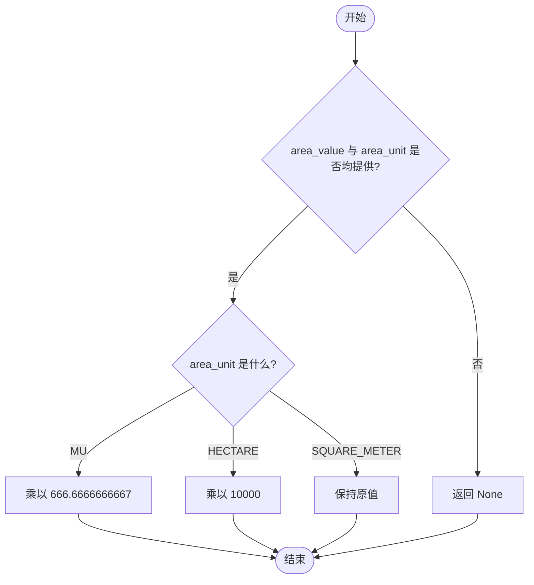
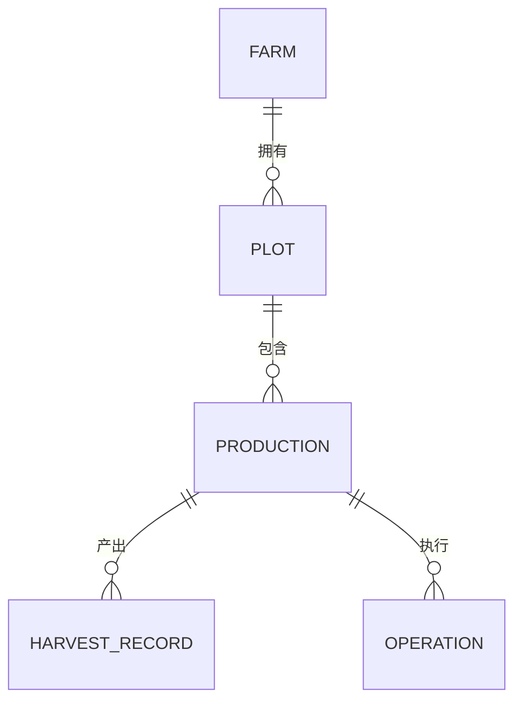
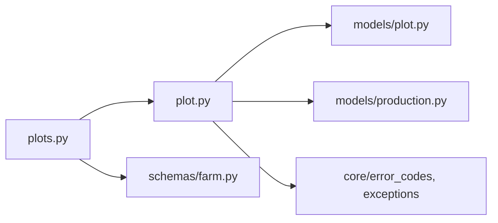

# 地块模型 (Plot)

<cite>
**本文引用的文件**
- [apps/api/app/models/plot.py](file://apps/api/app/models/plot.py)
- [apps/api/app/services/plot.py](file://apps/api/app/services/plot.py)
- [apps/api/app/api/v1/endpoints/plots.py](file://apps/api/app/api/v1/endpoints/plots.py)
- [apps/api/app/schemas/farm.py](file://apps/api/app/schemas/farm.py)
- [apps/api/app/models/production.py](file://apps/api/app/models/production.py)
- [apps/api/alembic/versions/6c41d1c6b6f1_create_plots.py](file://apps/api/alembic/versions/6c41d1c6b6f1_create_plots.py)
- [apps/api/tests/test_plots.py](file://apps/api/tests/test_plots.py)
</cite>

## 目录
1. [简介](#简介)
2. [项目结构](#项目结构)
3. [核心组件](#核心组件)
4. [架构总览](#架构总览)
5. [详细组件分析](#详细组件-analysis)
6. [依赖关系分析](#依赖关系分析)
7. [性能考虑](#性能考虑)
8. [故障排查指南](#故障排查指南)
9. [结论](#结论)
10. [附录：使用示例与最佳实践](#附录使用示例与最佳实践)

## 简介
本文件为 Pocket Farm 系统的“土地块”（Plot）模型提供完整、深入的技术文档。内容涵盖 Plot 实体的字段定义、单位换算逻辑、与农场和生产记录的关系映射、状态管理语义、数据访问流程以及最佳实践与使用示例，帮助开发者与业务人员准确理解并正确使用地块数据。

## 项目结构
围绕 Plot 的核心代码分布在以下模块：
- 数据模型：定义数据库表结构与枚举类型
- 服务层：实现面积计算、权限校验、详情聚合等核心业务逻辑
- API 端点：暴露 RESTful 接口，负责参数校验与响应组装
- Schema：定义请求/响应的数据结构与校验规则
- 迁移脚本：定义数据库表结构变更
- 测试：覆盖创建、列表、详情、编辑、权限与边界校验等场景

图表来源
- [apps/api/app/api/v1/endpoints/plots.py:139-246](file://apps/api/app/api/v1/endpoints/plots.py#L139-L246)
- [apps/api/app/services/plot.py:57-223](file://apps/api/app/services/plot.py#L57-L223)
- [apps/api/app/models/plot.py:31-54](file://apps/api/app/models/plot.py#L31-L54)
- [apps/api/app/models/production.py:43-79](file://apps/api/app/models/production.py#L43-L79)
- [apps/api/app/schemas/farm.py:75-166](file://apps/api/app/schemas/farm.py#L75-L166)

章节来源
- [apps/api/app/models/plot.py:31-54](file://apps/api/app/models/plot.py#L31-L54)
- [apps/api/app/services/plot.py:57-223](file://apps/api/app/services/plot.py#L57-L223)
- [apps/api/app/api/v1/endpoints/plots.py:139-246](file://apps/api/app/api/v1/endpoints/plots.py#L139-L246)
- [apps/api/app/schemas/farm.py:75-166](file://apps/api/app/schemas/farm.py#L75-L166)
- [apps/api/alembic/versions/6c41d1c6b6f1_create_plots.py:21-40](file://apps/api/alembic/versions/6c41d1c6b6f1_create_plots.py#L21-L40)

## 核心组件
- Plot 实体：描述一块土地的编号、名称、类型、面积（含单位与平方米换算）、地理边界、时间戳等。
- 面积单位与换算：支持亩、平方米、公顷三种单位，并提供统一的平方米换算值用于内部计算与展示。
- 服务层：提供地块的创建、查询、更新与详情聚合；包含权限控制与面积换算。
- API 端点：提供按农场分页列出地块、创建/获取/更新地块、获取地块详情（聚合生产、作业、收获）。
- Schema：对输入进行严格校验（如面积与单位必须成对出现、边界坐标系限制），并对输出进行序列化。

章节来源
- [apps/api/app/models/plot.py:14-54](file://apps/api/app/models/plot.py#L14-L54)
- [apps/api/app/services/plot.py:18-54](file://apps/api/app/services/plot.py#L18-L54)
- [apps/api/app/api/v1/endpoints/plots.py:42-54](file://apps/api/app/api/v1/endpoints/plots.py#L42-L54)
- [apps/api/app/schemas/farm.py:75-166](file://apps/api/app/schemas/farm.py#L75-L166)

## 架构总览
下图展示了从 API 到数据库的关键调用链，包括权限校验、面积换算与详情聚合。

图表来源
- [apps/api/app/api/v1/endpoints/plots.py:164-224](file://apps/api/app/api/v1/endpoints/plots.py#L164-L224)
- [apps/api/app/services/plot.py:79-183](file://apps/api/app/services/plot.py#L79-L183)

## 详细组件分析

### Plot 实体与字段定义
- 标识与归属
  - id：自增主键
  - farm_id：所属农场 ID，外键关联 farms.id，带索引
- 基本信息
  - name：地块名称（必填）
  - type：地块类型（可选），枚举包括 FIELD、PADDY、GREENHOUSE、ORCHARD、FOREST、POND、BARN、OTHER
- 面积与单位
  - area_value：数值（可为空）
  - area_unit：单位（可为空），枚举包括 MU、SQUARE_METER、HECTARE
  - area_m2：统一换算后的平方米值（由服务层计算）
- 地理位置
  - boundary：JSON 字段，存储地理边界信息（需满足坐标系统要求）
- 时间戳
  - created_at、updated_at：自动维护

章节来源
- [apps/api/app/models/plot.py:31-54](file://apps/api/app/models/plot.py#L31-L54)
- [apps/api/alembic/versions/6c41d1c6b6f1_create_plots.py:21-40](file://apps/api/alembic/versions/6c41d1c6b6f1_create_plots.py#L21-L40)

### 面积计算与单位转换
- 支持的单位：亩（MU）、平方米（SQUARE_METER）、公顷（HECTARE）
- 换算规则：
  - 1 亩 = 666.6666666667 平方米
  - 1 公顷 = 10000 平方米
  - 若单位为平方米则保持不变
- 计算时机：
  - 创建或更新时，若同时提供 area_value 与 area_unit，则计算并写入 area_m2
  - 仅更新其中一个将触发校验失败（见 Schema 校验）

图表来源
- [apps/api/app/services/plot.py:18-54](file://apps/api/app/services/plot.py#L18-L54)

章节来源
- [apps/api/app/services/plot.py:18-54](file://apps/api/app/services/plot.py#L18-L54)
- [apps/api/app/schemas/farm.py:75-130](file://apps/api/app/schemas/farm.py#L75-L130)

### 与农场、生产记录的关系映射
- 与农场（Farm）
  - 通过 farm_id 外键关联，确保地块属于特定农场
  - 列表与详情访问均需验证当前用户对农场的成员身份与角色
- 与生产记录（Production）
  - 一对多关系：一个地块可对应多条生产记录
  - 生产记录状态：ACTIVE（进行中）、ENDED（已结束）
  - 地块详情会聚合：
    - active_productions：状态为 ACTIVE 的生产记录
    - ended_productions：状态为 ENDED 的生产记录
    - operations：与该地块相关的作业记录（最近 N 条）
    - harvests：与该地块相关收获记录（最近 N 条）

图表来源
- [apps/api/app/models/plot.py:31-54](file://apps/api/app/models/plot.py#L31-L54)
- [apps/api/app/models/production.py:43-79](file://apps/api/app/models/production.py#L43-L79)

章节来源
- [apps/api/app/models/production.py:13-16](file://apps/api/app/models/production.py#L13-L16)
- [apps/api/app/services/plot.py:124-183](file://apps/api/app/services/plot.py#L124-L183)

### 地块的状态管理与业务含义
- 当前模型未在地块级别定义显式状态字段（如空闲、使用中、休耕）
- 实际业务状态通过“生产记录”的状态体现：
  - ACTIVE：表示该地块当前有正在进行的种植/养殖活动
  - ENDED：表示该地块的生产活动已结束
- 建议的业务语义：
  - 空闲：无 ACTIVE 生产记录的地块
  - 使用中：至少有一条 ACTIVE 生产记录的地块
  - 休耕：生产记录已结项且短期内不计划新生产（可通过后续扩展在地块或生产记录上增加状态字段）

章节来源
- [apps/api/app/models/production.py:13-16](file://apps/api/app/models/production.py#L13-L16)
- [apps/api/app/services/plot.py:132-148](file://apps/api/app/services/plot.py#L132-L148)

### API 与权限控制
- 列表：按农场分页列出地块，需具备农场成员身份
- 创建：需要农场成员角色为 OWNER 或 ADMIN
- 读取：需具备农场成员身份
- 更新：需要农场成员角色为 OWNER 或 ADMIN
- 详情：聚合生产、作业、收获信息，需具备农场成员身份

章节来源
- [apps/api/app/api/v1/endpoints/plots.py:139-246](file://apps/api/app/api/v1/endpoints/plots.py#L139-L246)
- [apps/api/app/services/plot.py:42-45](file://apps/api/app/services/plot.py#L42-L45)

## 依赖关系分析
- 模型依赖
  - Plot 依赖 Farm（通过 farm_id）
  - Production 依赖 Plot（通过 plot_id）
- 服务依赖
  - 服务层依赖模型与错误码、异常处理
  - 服务层聚合 Production、Operation、Harvest 以构建详情
- API 依赖
  - 端点依赖服务层与 Schema，完成参数校验与响应组装

图表来源
- [apps/api/app/api/v1/endpoints/plots.py:1-37](file://apps/api/app/api/v1/endpoints/plots.py#L1-L37)
- [apps/api/app/services/plot.py:1-17](file://apps/api/app/services/plot.py#L1-L17)
- [apps/api/app/schemas/farm.py:1-12](file://apps/api/app/schemas/farm.py#L1-L12)

章节来源
- [apps/api/app/api/v1/endpoints/plots.py:1-37](file://apps/api/app/api/v1/endpoints/plots.py#L1-L37)
- [apps/api/app/services/plot.py:1-17](file://apps/api/app/services/plot.py#L1-L17)
- [apps/api/app/schemas/farm.py:1-12](file://apps/api/app/schemas/farm.py#L1-L12)

## 性能考虑
- 列表查询
  - 使用分页（page/pageSize）与排序（created_at、id）减少单次查询量
- 详情聚合
  - 作业与收获记录限制最大数量（DETAIL_RECORD_LIMIT=100），避免大数据集拖慢响应
- 数据库索引
  - farm_id 建立索引，提升按农场筛选效率
  - production.plot_id 建立索引，加速按地块聚合查询

章节来源
- [apps/api/app/services/plot.py:57-76](file://apps/api/app/services/plot.py#L57-L76)
- [apps/api/app/services/plot.py:150-173](file://apps/api/app/services/plot.py#L150-L173)
- [apps/api/alembic/versions/6c41d1c6b6f1_create_plots.py:39-40](file://apps/api/alembic/versions/6c41d1c6b6f1_create_plots.py#L39-L40)
- [apps/api/app/models/production.py:47-52](file://apps/api/app/models/production.py#L47-L52)

## 故障排查指南
- 常见校验错误
  - 面积与单位不一致：创建或更新时必须同时提供 areaValue 与 areaUnit，否则返回 422
  - 边界坐标系非法：boundary.coordinateSystem 必须为 GCJ02，否则返回 422
- 权限问题
  - 非农场成员访问地块列表/详情：返回 404
  - 普通成员尝试修改地块：返回 403
- 面积换算异常
  - 未提供 area_value 或 area_unit 时，area_m2 为 None
  - 更新时只更新其中一个面积字段将触发校验失败

章节来源
- [apps/api/app/schemas/farm.py:94-130](file://apps/api/app/schemas/farm.py#L94-L130)
- [apps/api/app/schemas/farm.py:163-166](file://apps/api/app/schemas/farm.py#L163-L166)
- [apps/api/app/services/plot.py:42-45](file://apps/api/app/services/plot.py#L42-L45)
- [apps/api/tests/test_plots.py:142-187](file://apps/api/tests/test_plots.py#L142-L187)
- [apps/api/tests/test_plots.py:189-206](file://apps/api/tests/test_plots.py#L189-L206)

## 结论
- Plot 模型聚焦于地块的基础信息与面积、边界等元数据，并通过生产记录的状态反映实际业务状态
- 面积换算在服务层集中实现，保证数据一致性与可追溯性
- 权限控制严格基于农场成员角色，保障数据安全
- 详情聚合提供一站式视图，便于前端展示与分析

## 附录：使用示例与最佳实践

### 推荐的数据建模与使用模式
- 创建地块
  - 提供 name、type（可选）、areaValue 与 areaUnit（成对）、boundary（可选，coordinateSystem 必须为 GCJ02）
  - 系统将自动计算 areaM2
- 更新地块
  - 如需调整面积，必须同时更新 areaValue 与 areaUnit
  - 仅更新 name/type/boundary 时，无需提供面积字段
- 查看地块详情
  - 使用详情接口获取活跃生产、已结束生产、作业与收获汇总

章节来源
- [apps/api/app/api/v1/endpoints/plots.py:164-224](file://apps/api/app/api/v1/endpoints/plots.py#L164-L224)
- [apps/api/app/schemas/farm.py:75-166](file://apps/api/app/schemas/farm.py#L75-L166)

### 单元测试中的典型用例参考
- 所有者可创建、列表、详情、编辑地块
- 成员可读但仅管理员可管理
- 访问范围受农场成员身份限制
- 面积与边界校验生效
- 详情正确聚合生产、作业与收获

章节来源
- [apps/api/tests/test_plots.py:100-265](file://apps/api/tests/test_plots.py#L100-L265)