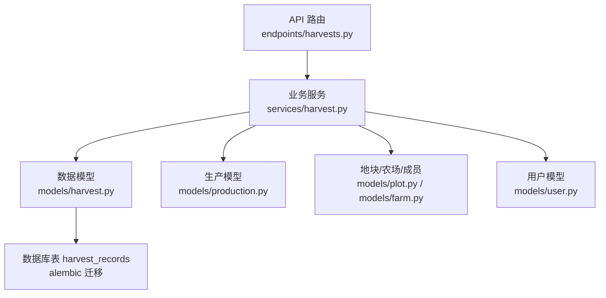
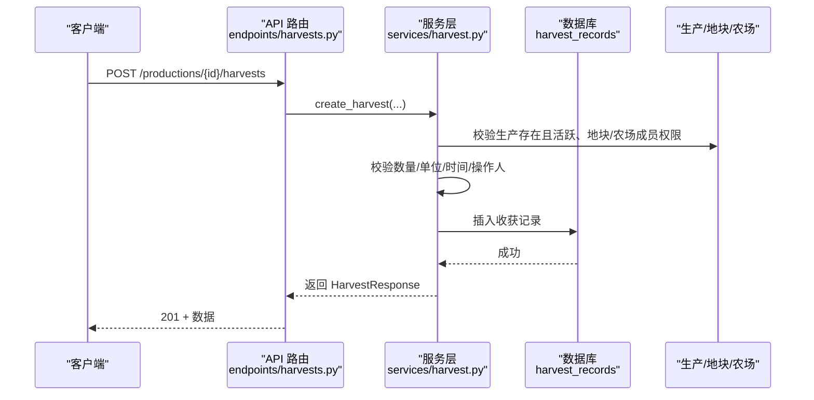
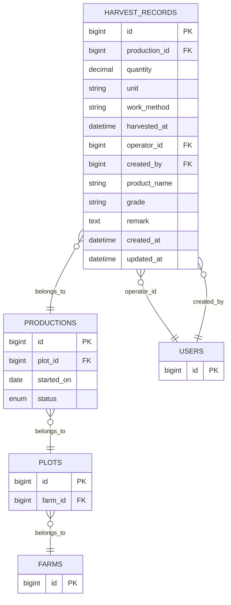
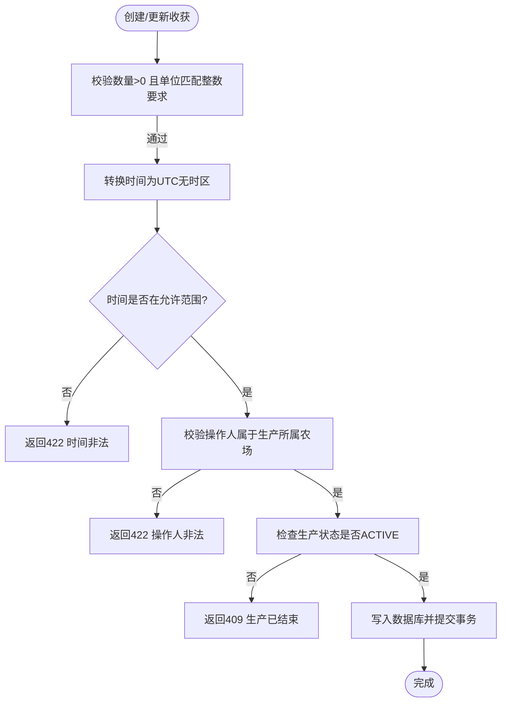
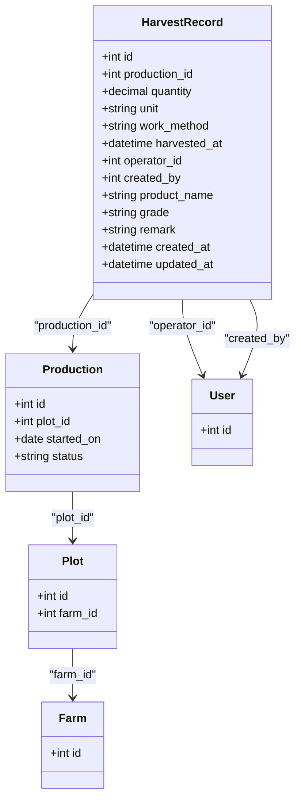
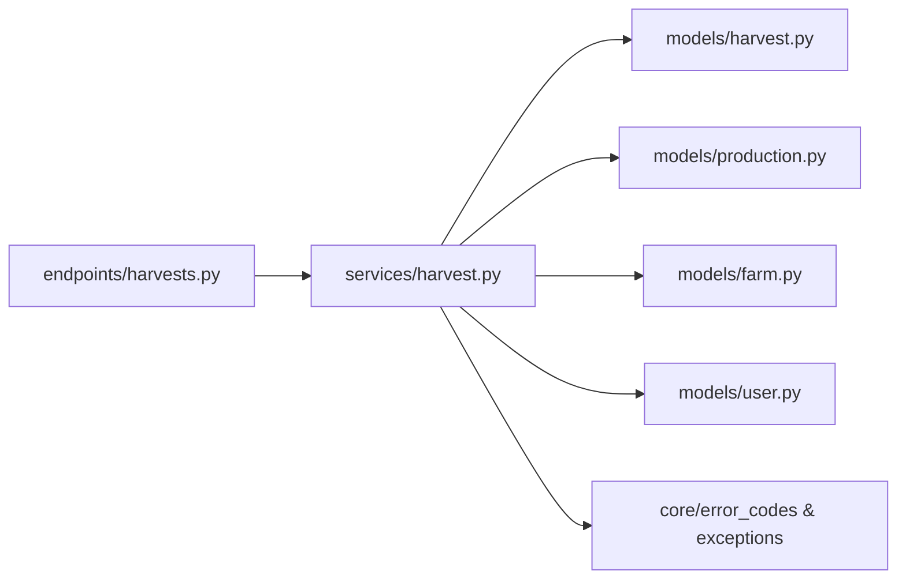

# 收获模型 (HarvestRecord)

<cite>
**本文引用的文件**
- [harvest.py](file://apps/api/app/models/harvest.py)
- [harvest.py](file://apps/api/app/schemas/harvest.py)
- [harvest.py](file://apps/api/app/services/harvest.py)
- [harvests.py](file://apps/api/app/api/v1/endpoints/harvests.py)
- [production.py](file://apps/api/app/models/production.py)
- [operation.py](file://apps/api/app/models/operation.py)
- [farm.py](file://apps/api/app/models/farm.py)
- [user.py](file://apps/api/app/models/user.py)
- [b8e4d2a1c673_create_harvest_records.py](file://apps/api/alembic/versions/b8e4d2a1c673_create_harvest_records.py)
- [test_harvests.py](file://apps/api/tests/test_harvests.py)
</cite>

## 目录
1. [简介](#简介)
2. [项目结构](#项目结构)
3. [核心组件](#核心组件)
4. [架构总览](#架构总览)
5. [详细组件分析](#详细组件分析)
6. [依赖关系分析](#依赖关系分析)
7. [性能考虑](#性能考虑)
8. [故障排查指南](#故障排查指南)
9. [结论](#结论)
10. [附录：使用示例](#附录：使用示例)

## 简介
本文件为 Pocket Farm 系统的“收获模型”提供完整技术文档，聚焦 HarvestRecord 实体的字段定义、与生产/作业/地块/农场/用户的关联关系、数据校验与完整性保证机制、以及基于现有接口的查询能力。同时给出面向使用者的录入与查询示例路径，帮助快速上手并理解系统行为。

## 项目结构
围绕收获模型的相关代码分布在以下层次：
- 数据模型层：HarvestRecord 实体定义（models）
- 请求/响应模式层：Pydantic Schema（schemas）
- 业务服务层：创建、更新、删除、列表等核心逻辑（services）
- API 路由层：REST 接口暴露（endpoints）
- 数据库迁移：表结构与索引（alembic）
- 测试用例：覆盖关键流程与边界条件（tests）

图表来源
- [harvests.py:66-163](file://apps/api/app/api/v1/endpoints/harvests.py#L66-L163)
- [harvest.py:1-281](file://apps/api/app/services/harvest.py#L1-L281)
- [harvest.py:13-48](file://apps/api/app/models/harvest.py#L13-L48)
- [production.py:43-79](file://apps/api/app/models/production.py#L43-L79)
- [farm.py:18-59](file://apps/api/app/models/farm.py#L18-L59)
- [user.py:15-28](file://apps/api/app/models/user.py#L15-L28)
- [b8e4d2a1c673_create_harvest_records.py:21-77](file://apps/api/alembic/versions/b8e4d2a1c673_create_harvest_records.py#L21-L77)

章节来源
- [harvests.py:66-163](file://apps/api/app/api/v1/endpoints/harvests.py#L66-L163)
- [harvest.py:1-281](file://apps/api/app/services/harvest.py#L1-L281)
- [harvest.py:13-48](file://apps/api/app/models/harvest.py#L13-L48)
- [production.py:43-79](file://apps/api/app/models/production.py#L43-L79)
- [farm.py:18-59](file://apps/api/app/models/farm.py#L18-L59)
- [user.py:15-28](file://apps/api/app/models/user.py#L15-L28)
- [b8e4d2a1c673_create_harvest_records.py:21-77](file://apps/api/alembic/versions/b8e4d2a1c673_create_harvest_records.py#L21-L77)

## 核心组件
- HarvestRecord 实体：记录每次收获的产量、单位、作业方式、收获时间、操作人、创建人、产品名、等级、备注及审计时间戳。
- 生产 Production：收获归属于某一次生产批次，受其状态与开始日期约束。
- 作业 Operation：与收获同属生产执行过程的不同环节，共享工作方式和人员信息，便于追溯。
- 地块 Plot 与农场 Farm：通过生产归属到地块，再归属到农场；收获权限与可见性由农场成员关系控制。
- 用户 User：区分创建人与实际操作人，支持多角色协作。

章节来源
- [harvest.py:13-48](file://apps/api/app/models/harvest.py#L13-L48)
- [production.py:43-79](file://apps/api/app/models/production.py#L43-L79)
- [operation.py:37-80](file://apps/api/app/models/operation.py#L37-L80)
- [farm.py:18-59](file://apps/api/app/models/farm.py#L18-L59)
- [user.py:15-28](file://apps/api/app/models/user.py#L15-L28)

## 架构总览
收获模型的调用链路从 API 路由进入，经服务层进行权限、业务规则与数据一致性校验，最终持久化至数据库。

图表来源
- [harvests.py:86-109](file://apps/api/app/api/v1/endpoints/harvests.py#L86-L109)
- [harvest.py:134-178](file://apps/api/app/services/harvest.py#L134-L178)
- [b8e4d2a1c673_create_harvest_records.py:21-77](file://apps/api/alembic/versions/b8e4d2a1c673_create_harvest_records.py#L21-L77)

## 详细组件分析

### HarvestRecord 实体字段说明
- id：主键，自增 BIGINT。
- production_id：外键指向生产批次，用于聚合产量与质量统计。
- quantity：收获数量，数值型，精度 14 位，小数 4 位。
- unit：单位，来源于生产对应的物种行业与个体单位（如 KG、HEAD、FEATHER、PIECE、PLANT、TAIL）。
- work_method：作业方式，枚举 MANUAL 或 MECHANICAL。
- harvested_at：收获时间（UTC 无时区存储），需满足不晚于当前时间与不早于生产开始日期的约束。
- operator_id：实际操作人（可为他人），必须属于该生产所属农场。
- created_by：创建人（不可更改），用于审计追踪。
- product_name：可选，默认取自物种名称。
- grade：可选，质量等级（如一级、二级）。
- remark：可选，备注信息。
- created_at/updated_at：审计时间戳。

章节来源
- [harvest.py:13-48](file://apps/api/app/models/harvest.py#L13-L48)
- [b8e4d2a1c673_create_harvest_records.py:21-77](file://apps/api/alembic/versions/b8e4d2a1c673_create_harvest_records.py#L21-L77)

### 与生产、作业、地块、农场、用户的关联关系
- 与生产：通过 production_id 关联，受生产状态限制（仅 ACTIVE 可新增/修改/删除收获）。
- 与作业：两者都记录 work_method 与 operated_at/harvested_at，便于对比不同作业方式的产出效率。
- 与地块/农场：通过生产归属到地块，再归属到农场；列表查询按地块维度聚合收获。
- 与用户：operator_id 表示实际作业人员，created_by 表示记录创建者；访问控制基于农场成员关系。

图表来源
- [harvest.py:13-48](file://apps/api/app/models/harvest.py#L13-L48)
- [production.py:43-79](file://apps/api/app/models/production.py#L43-L79)
- [farm.py:18-59](file://apps/api/app/models/farm.py#L18-L59)
- [user.py:15-28](file://apps/api/app/models/user.py#L15-L28)

### 数据验证与完整性保证
- 数量与单位校验：
  - 数量必须大于 0。
  - 当单位为 HEAD/FEATHER/PIECE/PLANT/TAIL 时，数量必须为整数。
  - 单位根据物种所属行业自动推导：农业/渔业使用 KG，其他行业使用个体单位。
- 时间校验：
  - harvested_at 必须带时区（服务端转为 UTC 无时区存储）。
  - 不得晚于当前时间，不得早于生产开始日期。
- 权限与可见性：
  - 操作人必须属于生产所属农场。
  - 列表查询按生产/地块维度过滤，非成员不可见。
- 生产状态保护：
  - 已结束的生产禁止新增/修改/删除收获记录。
- 审计字段：
  - created_by 在创建时固定，后续不可变。
  - created_at/updated_at 自动维护。

图表来源
- [harvest.py:45-69](file://apps/api/app/services/harvest.py#L45-L69)
- [harvest.py:134-178](file://apps/api/app/services/harvest.py#L134-L178)
- [harvest.py:204-263](file://apps/api/app/services/harvest.py#L204-L263)

### 统计分析能力
- 按生产维度统计：
  - 可通过生产 ID 分页获取该生产的所有收获记录，用于计算累计产量、平均质量等级等。
- 按地块维度统计：
  - 通过地块 ID 分页获取该地块下所有生产的收获记录，适合汇总地块级产量与质量分布。
- 排序与分页：
  - 列表默认按收获时间倒序、ID 倒序，便于查看最新记录。
- 扩展建议（如需更复杂指标）：
  - 可在服务层增加聚合函数，按周/月/品种/等级分组统计产量与质量占比。
  - 结合生产预期产量字段，计算达成率与偏差分析。

章节来源
- [harvest.py:86-131](file://apps/api/app/services/harvest.py#L86-L131)
- [harvests.py:66-129](file://apps/api/app/api/v1/endpoints/harvests.py#L66-L129)

### 类图（代码级）

图表来源
- [harvest.py:13-48](file://apps/api/app/models/harvest.py#L13-L48)
- [production.py:43-79](file://apps/api/app/models/production.py#L43-L79)
- [farm.py:18-59](file://apps/api/app/models/farm.py#L18-L59)
- [user.py:15-28](file://apps/api/app/models/user.py#L15-L28)

## 依赖关系分析
- 外部依赖：
  - SQLAlchemy 异步会话用于数据库访问。
  - Pydantic 用于请求/响应校验与序列化。
  - FastAPI 路由与依赖注入。
- 内部依赖：
  - 生产、地块、农场、用户模型用于权限与上下文校验。
  - 错误码与异常封装统一错误处理。
- 耦合与内聚：
  - 服务层集中了收获相关的业务规则，保持高内聚。
  - API 路由薄封装，职责清晰。

图表来源
- [harvests.py:1-25](file://apps/api/app/api/v1/endpoints/harvests.py#L1-L25)
- [harvest.py:1-17](file://apps/api/app/services/harvest.py#L1-L17)

章节来源
- [harvests.py:1-25](file://apps/api/app/api/v1/endpoints/harvests.py#L1-L25)
- [harvest.py:1-17](file://apps/api/app/services/harvest.py#L1-L17)

## 性能考虑
- 列表查询已实现分页与计数，避免全表扫描。
- 对生产/地块维度的列表查询通过 JOIN 与 WHERE 过滤，减少不必要的数据传输。
- 建议在高频查询场景下：
  - 为 harvested_at 建立索引以优化时间排序。
  - 对常用筛选条件（如 production_id、plot_id）已有索引，确保查询高效。
- 批量统计可考虑在服务层使用聚合查询，减少多次往返。

[本节为通用指导，无需特定文件引用]

## 故障排查指南
- 常见错误与原因：
  - 422 数量非法：数量为负数或非整数单位传入小数。
  - 422 时间非法：未带时区、未来时间、早于生产开始日期。
  - 422 操作人非法：操作人不在生产所属农场。
  - 409 生产已结束：试图对已结束的生产新增/修改/删除收获。
  - 404 不存在：跨农场访问或无权限访问。
- 定位步骤：
  - 检查请求参数是否符合 Schema 校验规则。
  - 确认生产状态与开始日期。
  - 确认操作人是否为农场成员。
  - 查看服务层抛出的异常类型与消息。

章节来源
- [harvest.py:45-69](file://apps/api/app/services/harvest.py#L45-L69)
- [harvest.py:71-84](file://apps/api/app/services/harvest.py#L71-L84)
- [harvest.py:134-178](file://apps/api/app/services/harvest.py#L134-L178)
- [harvest.py:204-263](file://apps/api/app/services/harvest.py#L204-L263)
- [test_harvests.py:249-353](file://apps/api/tests/test_harvests.py#L249-L353)
- [test_harvests.py:355-459](file://apps/api/tests/test_harvests.py#L355-L459)
- [test_harvests.py:461-528](file://apps/api/tests/test_harvests.py#L461-L528)

## 结论
HarvestRecord 作为收获的核心实体，提供了完整的产量、质量、时间与人员信息记录能力，并通过严格的校验与权限控制保障数据一致性与安全性。系统支持按生产与地块维度进行收获数据的分页查询，便于开展产量统计与质量评估。结合生产与作业信息，可实现从计划到执行的闭环管理。

[本节为总结性内容，无需特定文件引用]

## 附录：使用示例
以下为基于测试用例的 API 使用示例路径，展示如何录入与查询收获数据：

- 登录与准备环境
  - 登录：POST /api/v1/auth/login
  - 创建农场：POST /api/v1/farms
  - 创建地块：POST /api/v1/farms/{farm_id}/plots
  - 添加成员：POST /api/v1/farms/{farm_id}/members
  - 查询物种：GET /api/v1/species?keyword=...&pageSize=...
  - 启动生产：POST /api/v1/plots/{plot_id}/productions

- 录入收获
  - 创建收获：POST /api/v1/productions/{production_id}/harvests
    - 必填：quantity
    - 可选：workMethod、harvestedAt、operatorId、productName、grade、remark
    - 注意：harvestedAt 需带时区；单位会根据物种自动推导

- 查询收获
  - 按生产查询：GET /api/v1/productions/{production_id}/harvests?page=1&pageSize=20
  - 按地块查询：GET /api/v1/plots/{plot_id}/harvests?page=1&pageSize=20

- 修改与删除
  - 修改收获：PATCH /api/v1/harvests/{harvest_id}
  - 删除收获：DELETE /api/v1/harvests/{harvest_id}

- 结束生产后锁定
  - 结束生产：POST /api/v1/productions/{production_id}/end
  - 结束后不可新增/修改/删除收获，但可继续查询

章节来源
- [test_harvests.py:17-178](file://apps/api/tests/test_harvests.py#L17-L178)
- [test_harvests.py:180-247](file://apps/api/tests/test_harvests.py#L180-L247)
- [test_harvests.py:249-353](file://apps/api/tests/test_harvests.py#L249-L353)
- [test_harvests.py:355-459](file://apps/api/tests/test_harvests.py#L355-L459)
- [test_harvests.py:461-528](file://apps/api/tests/test_harvests.py#L461-L528)