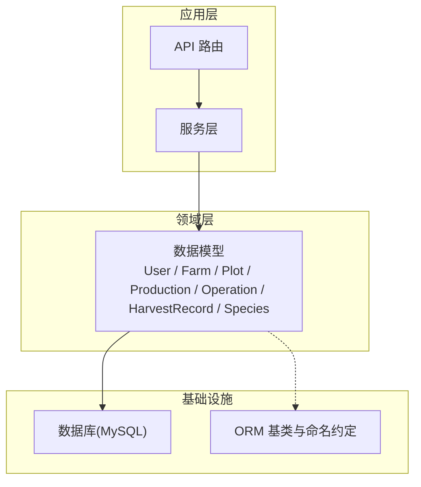
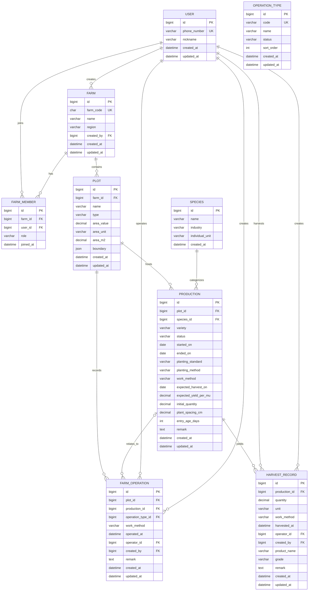
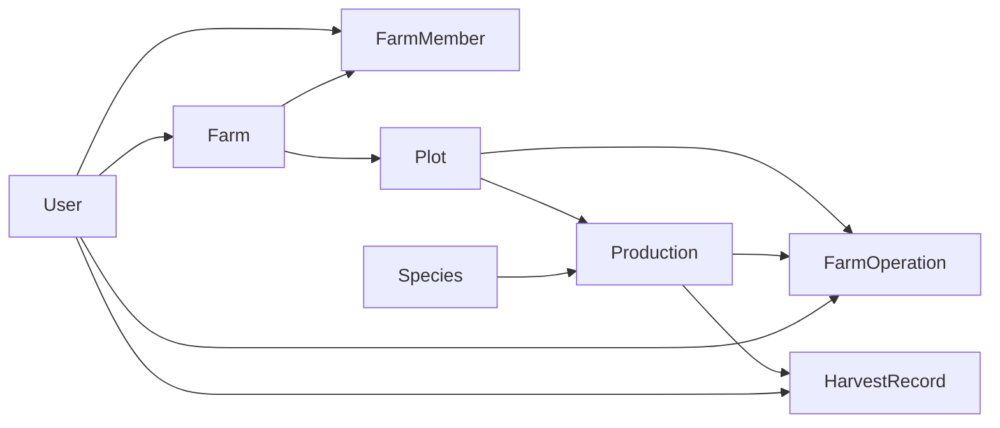
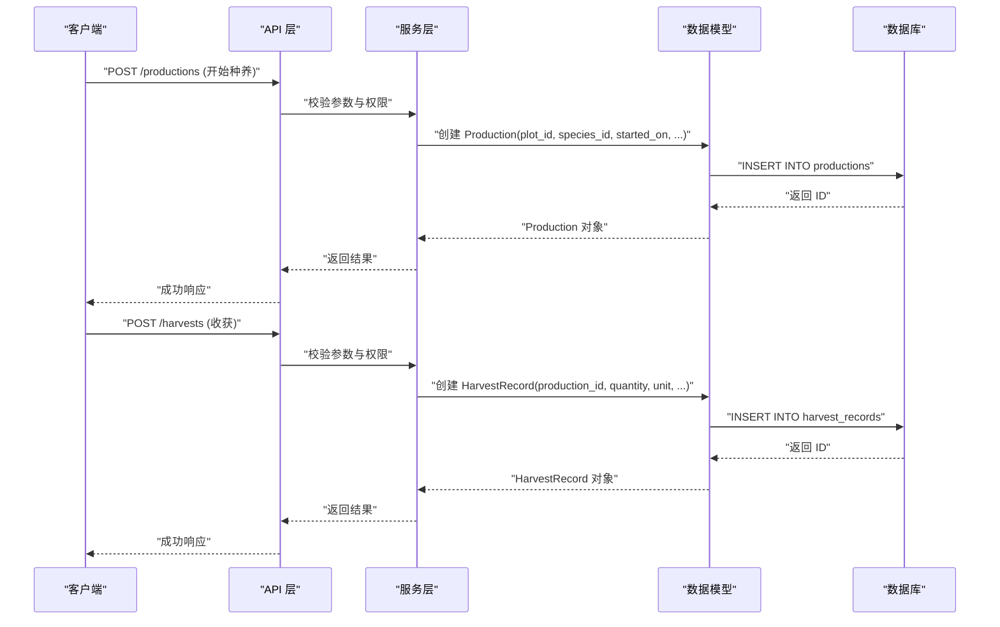
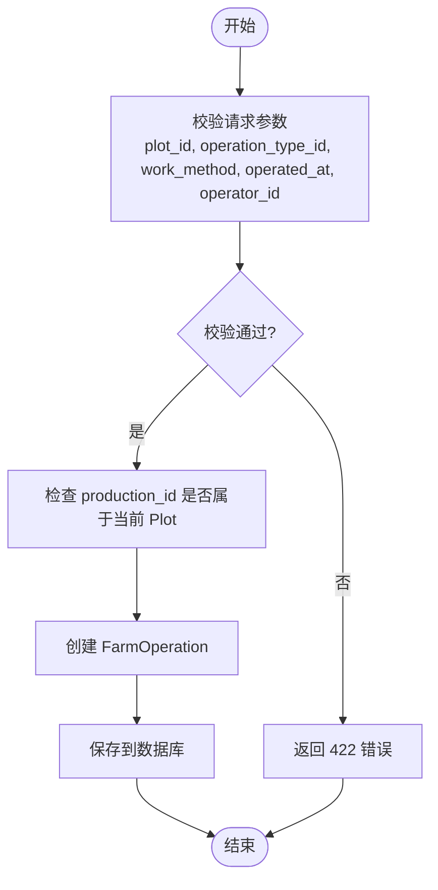

# 数据模型设计

<cite>
**本文引用的文件**
- [apps/api/app/models/user.py](file://apps/api/app/models/user.py)
- [apps/api/app/models/farm.py](file://apps/api/app/models/farm.py)
- [apps/api/app/models/plot.py](file://apps/api/app/models/plot.py)
- [apps/api/app/models/production.py](file://apps/api/app/models/production.py)
- [apps/api/app/models/operation.py](file://apps/api/app/models/operation.py)
- [apps/api/app/models/harvest.py](file://apps/api/app/models/harvest.py)
- [apps/api/app/models/species.py](file://apps/api/app/models/species.py)
- [apps/api/app/db/base.py](file://apps/api/app/db/base.py)
- [docs/mvp/02-domain-model.md](file://docs/mvp/02-domain-model.md)
- [docs/mvp/03-business-rules.md](file://docs/mvp/03-business-rules.md)
</cite>

## 目录
1. [引言](#引言)
2. [项目结构](#项目结构)
3. [核心组件](#核心组件)
4. [架构总览](#架构总览)
5. [详细组件分析](#详细组件分析)
6. [依赖关系分析](#依赖关系分析)
7. [性能考虑](#性能考虑)
8. [故障排查指南](#故障排查指南)
9. [结论](#结论)
10. [附录](#附录)

## 引言
本文件为 Pocket Farm 系统的数据模型设计文档，聚焦于核心实体 User、Farm、Plot、Production、Operation（含 OperationType/FarmOperation）、HarvestRecord、Species 的字段定义、数据类型与约束条件；说明实体间一对一、一对多、多对多关系的映射方式；阐述外键约束、唯一性约束与业务规则验证；给出继承关系与枚举类型定义；提供 ER 图与数据流图，展示实体间的数据流转关系；并解释领域驱动设计在模型中的应用，以及模型如何反映业务领域的概念和规则。

## 项目结构
Pocket Farm 后端采用分层架构：API 路由层调用服务层，服务层通过 ORM 访问数据库模型。数据模型位于 models 目录，使用 SQLAlchemy 声明式基类 Base，并通过 Alembic 管理迁移。领域模型与业务规则由 MVP 文档明确定义，作为模型设计与校验的依据。

图表来源
- [apps/api/app/db/base.py:1-15](file://apps/api/app/db/base.py#L1-L15)

章节来源
- [apps/api/app/db/base.py:1-15](file://apps/api/app/db/base.py#L1-L15)
- [docs/mvp/02-domain-model.md:1-78](file://docs/mvp/02-domain-model.md#L1-L78)

## 核心组件
本节概述各核心实体的职责与关键字段，后续章节将展开详细分析与图示。

- User：用户身份与登录标识（手机号），昵称，审计时间。
- Farm：农场实体，包含农场编码、名称、区域、创建人及审计时间。
- FarmMember：农场成员关系表，记录用户在农场中的角色与加入时间，具备唯一性约束。
- Plot：地块，归属农场，包含名称、类型、面积信息（值、单位、平方米换算）与可选边界 JSON。
- Species：公共种养种类，包含名称、行业、个体单位。
- Production：生产生命周期，关联地块与种类，包含状态、起止日期、种植标准/方式/作业方式、预期采收与产量、初始数量、株间距、日龄等。
- OperationType：农事类型字典，包含代码、名称、状态、排序与审计时间。
- FarmOperation：地块上的农事行为，可关联具体生产或仅关联地块，记录作业方式、操作时间、操作人与创建人。
- HarvestRecord：收获记录，必须归属具体生产，记录数量、单位、作业方式、收获时间、操作人与创建人，以及产品名、等级与备注。

章节来源
- [apps/api/app/models/user.py:1-28](file://apps/api/app/models/user.py#L1-L28)
- [apps/api/app/models/farm.py:1-59](file://apps/api/app/models/farm.py#L1-L59)
- [apps/api/app/models/plot.py:1-54](file://apps/api/app/models/plot.py#L1-L54)
- [apps/api/app/models/species.py:1-35](file://apps/api/app/models/species.py#L1-L35)
- [apps/api/app/models/production.py:1-79](file://apps/api/app/models/production.py#L1-L79)
- [apps/api/app/models/operation.py:1-80](file://apps/api/app/models/operation.py#L1-L80)
- [apps/api/app/models/harvest.py:1-48](file://apps/api/app/models/harvest.py#L1-L48)
- [docs/mvp/02-domain-model.md:81-634](file://docs/mvp/02-domain-model.md#L81-L634)
- [docs/mvp/03-business-rules.md:1-609](file://docs/mvp/03-business-rules.md#L1-L609)

## 架构总览
下图展示了核心实体之间的 ER 关系，包括主键、外键与关键约束。

图表来源
- [apps/api/app/models/user.py:15-28](file://apps/api/app/models/user.py#L15-L28)
- [apps/api/app/models/farm.py:18-59](file://apps/api/app/models/farm.py#L18-L59)
- [apps/api/app/models/plot.py:31-54](file://apps/api/app/models/plot.py#L31-L54)
- [apps/api/app/models/species.py:27-35](file://apps/api/app/models/species.py#L27-L35)
- [apps/api/app/models/production.py:43-79](file://apps/api/app/models/production.py#L43-L79)
- [apps/api/app/models/operation.py:18-80](file://apps/api/app/models/operation.py#L18-L80)
- [apps/api/app/models/harvest.py:13-48](file://apps/api/app/models/harvest.py#L13-L48)
- [docs/mvp/02-domain-model.md:7-78](file://docs/mvp/02-domain-model.md#L7-L78)

## 详细组件分析

### User
- 主键：id（BIGINT 无符号自增）
- 唯一约束：phone_number（VARCHAR(20)，不可为空）
- 可选字段：nickname（VARCHAR(50)）
- 审计字段：created_at、updated_at（默认当前 UTC 时间，更新时自动刷新）
- 用途：系统用户，手机号作为唯一登录标识；昵称用于前端展示。

章节来源
- [apps/api/app/models/user.py:15-28](file://apps/api/app/models/user.py#L15-L28)
- [docs/mvp/02-domain-model.md:81-98](file://docs/mvp/02-domain-model.md#L81-L98)

### Farm 与 FarmMember
- Farm
  - 主键：id
  - 唯一约束：farm_code（CHAR(6)）
  - 必填：name
  - 可选：region
  - 外键：created_by → users.id（RESTRICT）
  - 审计：created_at、updated_at
- FarmMember
  - 主键：id
  - 复合唯一约束：UNIQUE(farm_id, user_id)
  - 外键：farm_id → farms.id（RESTRICT），user_id → users.id（RESTRICT）
  - 字段：role（字符串，角色枚举值），joined_at（默认当前 UTC 时间）
  - 索引：user_id 建立索引
- 业务规则
  - 创建农场时自动生成唯一 6 位 farmCode，并在同一事务中创建当前用户的 OWNER 成员。
  - 成员角色遵循“多 OWNER、至少保留一位 OWNER”的规则；ADMIN 不能操作 OWNER，也不能提升成员为 OWNER；OWNER 可提升/降级/移除其他成员但需保证至少一位 OWNER；ADMIN/MEMBER 可自行退出；OWNER 仅在仍有其他 OWNER 时可退出。

章节来源
- [apps/api/app/models/farm.py:18-59](file://apps/api/app/models/farm.py#L18-L59)
- [docs/mvp/02-domain-model.md:101-165](file://docs/mvp/02-domain-model.md#L101-L165)
- [docs/mvp/03-business-rules.md:3-37](file://docs/mvp/03-business-rules.md#L3-L37)

### Plot
- 主键：id
- 外键：farm_id → farms.id（RESTRICT），索引
- 必填：name
- 可选：type（枚举：FIELD/PADDY/GREENHOUSE/ORCHARD/FOREST/POND/BARN/OTHER）
- 面积字段：area_value（DECIMAL(14,4)）、area_unit（MU/SQUARE_METER/HECTARE）、area_m2（DECIMAL(14,4)）
- 边界：boundary（JSON，坐标系统 GCJ02，不自动覆盖面积）
- 审计：created_at、updated_at
- 业务规则
  - 创建地块必填 name；建议填写 type、area；boundary 选填且不阻塞创建。
  - area_value 与 area_unit 是面积真值，area_m2 由二者换算得出。

章节来源
- [apps/api/app/models/plot.py:31-54](file://apps/api/app/models/plot.py#L31-L54)
- [docs/mvp/02-domain-model.md:167-217](file://docs/mvp/02-domain-model.md#L167-L217)
- [docs/mvp/03-business-rules.md:79-94](file://docs/mvp/03-business-rules.md#L79-L94)

### Species
- 主键：id
- 必填：name、industry（AGRICULTURE/FORESTRY/LIVESTOCK/FISHERY）、individual_unit（HEAD/FEATHER/PIECE/PLANT/TAIL）
- 索引：industry
- 审计：created_at
- 业务规则
  - 系统预置 Species，通过数据迁移初始化；MVP 不提供管理接口，普通用户不可修改。
  - Industry 决定前端术语、开始表单、农事筛选、收获动作名称。

章节来源
- [apps/api/app/models/species.py:27-35](file://apps/api/app/models/species.py#L27-L35)
- [docs/mvp/02-domain-model.md:246-299](file://docs/mvp/02-domain-model.md#L246-L299)

### Production
- 主键：id
- 外键：plot_id → plots.id（RESTRICT，索引），species_id → species.id（RESTRICT，索引）
- 必填：status（ACTIVE/ENDED，默认 ACTIVE）、started_on（DATE）
- 可选：ended_on（DATE）、variety（VARCHAR(100)）、planting_standard（NORMAL/GREEN/ORGANIC）、planting_method（TRANSPLANT/DIRECT_SEEDING）、work_method（MANUAL/MECHANICAL）、expected_harvest_on（DATE）、expected_yield_per_mu（DECIMAL(14,4)）、initial_quantity（DECIMAL(14,4)）、plant_spacing_cm（DECIMAL(10,2)）、entry_age_days（INTEGER UNSIGNED）、remark（TEXT）
- 审计：created_at、updated_at
- 业务规则
  - 一个 Production 只属于一个 Plot；一个 Plot 可有多条历史 Production，且允许同时存在多条 ACTIVE Production。
  - PlantingMethod 适用于农业与林业，必填；WorkMethod 在农业、林业、渔业必填，牧业不适用保存 NULL。
  - expected_yield_per_mu 仅适用于农业（公斤/亩）；plant_spacing_cm 仅适用于农业与林业（厘米）。
  - 结束种养时设置 ENDED 与 ended_on，且满足时间约束（不早于已有关联农事与收获的业务日期，不晚于今天）。
  - 已结束 Production 锁定其关联 FarmOperation 与 HarvestRecord，不允许新增、修改或删除。

章节来源
- [apps/api/app/models/production.py:43-79](file://apps/api/app/models/production.py#L43-L79)
- [docs/mvp/02-domain-model.md:318-458](file://docs/mvp/02-domain-model.md#L318-L458)
- [docs/mvp/03-business-rules.md:96-134](file://docs/mvp/03-business-rules.md#L96-L134)
- [docs/mvp/03-business-rules.md:424-515](file://docs/mvp/03-business-rules.md#L424-L515)

### OperationType 与 FarmOperation
- OperationType
  - 主键：id
  - 唯一约束：code（VARCHAR(30)）
  - 必填：name、status（ACTIVE/DISABLED，默认 ACTIVE）、sort_order（UNSIGNED INT，默认 0）
  - 审计：created_at、updated_at
- FarmOperation
  - 主键：id
  - 外键：plot_id → plots.id（RESTRICT，索引），production_id → productions.id（RESTRICT，索引，可为空），operation_type_id → operation_types.id（RESTRICT，索引），operator_id → users.id（RESTRICT，索引），created_by → users.id（RESTRICT）
  - 必填：work_method（默认 MANUAL）、operated_at（默认当前 UTC 时间）
  - 可选：remark（TEXT）
  - 审计：created_at、updated_at
- 业务规则
  - FarmOperation 首先属于 Plot；production_id 可空，表示整块地农事；非空时必须属于当前 Plot。
  - 只能使用 ACTIVE 的 OperationType；下架后不影响既有记录展示与编辑，但不可新建或改选为下架类型。
  - operator_id 与 created_by 均为必填；created_by 由后端从 JWT 写入，前端不可传入或修改。
  - 时间校验：operated_at 不得晚于当前时间；若关联 Production，则不得早于 started_on。

章节来源
- [apps/api/app/models/operation.py:18-80](file://apps/api/app/models/operation.py#L18-L80)
- [docs/mvp/02-domain-model.md:460-529](file://docs/mvp/02-domain-model.md#L460-L529)
- [docs/mvp/03-business-rules.md:232-318](file://docs/mvp/03-business-rules.md#L232-L318)

### HarvestRecord
- 主键：id
- 外键：production_id → productions.id（RESTRICT，索引），operator_id → users.id（RESTRICT，索引），created_by → users.id（RESTRICT）
- 必填：quantity（DECIMAL(14,4)）、unit（VARCHAR(20)）、work_method（默认 MANUAL）、harvested_at（默认当前 UTC 时间）
- 可选：product_name（VARCHAR(100)）、grade（VARCHAR(100)）、remark（TEXT）
- 审计：created_at、updated_at
- 业务规则
  - 必须归属具体 Production；不允许 production_id 为空。
  - unit 由后端根据 Production 对应的 Species 派生：农业、渔业固定 KG；林业、牧业使用 Species.individual_unit；客户端不可传入或修改。
  - 编辑时仅允许修改 quantity，不允许修改 unit；创建时保存为历史快照。
  - 收获不会结束 Production；已结束 Production 锁定其 HarvestRecord，不允许新增、修改或删除。

章节来源
- [apps/api/app/models/harvest.py:13-48](file://apps/api/app/models/harvest.py#L13-L48)
- [docs/mvp/02-domain-model.md:532-582](file://docs/mvp/02-domain-model.md#L532-L582)
- [docs/mvp/03-business-rules.md:320-396](file://docs/mvp/03-business-rules.md#L320-L396)
- [docs/mvp/03-business-rules.md:412-515](file://docs/mvp/03-business-rules.md#L412-L515)

### 枚举与继承关系
- 枚举类型
  - FarmMemberRole：OWNER、ADMIN、MEMBER
  - PlotType：FIELD、PADDY、GREENHOUSE、ORCHARD、FOREST、POND、BARN、OTHER
  - AreaUnit：MU、SQUARE_METER、HECTARE
  - Industry：AGRICULTURE、FORESTRY、LIVESTOCK、FISHERY
  - IndividualUnit：HEAD、FEATHER、PIECE、PLANT、TAIL
  - ProductionStatus：ACTIVE、ENDED
  - PlantingStandard：NORMAL、GREEN、ORGANIC
  - PlantingMethod：TRANSPLANT、DIRECT_SEEDING
  - WorkMethod：MANUAL、MECHANICAL
  - QuantityUnit：KG、HEAD、FEATHER、PIECE、PLANT、TAIL
  - OperationTypeStatus：ACTIVE、DISABLED
- 继承关系
  - 所有模型均继承自 SQLAlchemy DeclarativeBase（Base），共享命名约定与元数据策略。
  - 工作方法字段在不同实体中独立存在，不互相继承。

章节来源
- [apps/api/app/models/farm.py:12-16](file://apps/api/app/models/farm.py#L12-L16)
- [apps/api/app/models/plot.py:14-29](file://apps/api/app/models/plot.py#L14-L29)
- [apps/api/app/models/species.py:12-25](file://apps/api/app/models/species.py#L12-L25)
- [apps/api/app/models/production.py:13-41](file://apps/api/app/models/production.py#L13-L41)
- [apps/api/app/models/operation.py:13-28](file://apps/api/app/models/operation.py#L13-L28)
- [apps/api/app/db/base.py:1-15](file://apps/api/app/db/base.py#L1-L15)
- [docs/mvp/02-domain-model.md:190-243](file://docs/mvp/02-domain-model.md#L190-L243)
- [docs/mvp/02-domain-model.md:368-458](file://docs/mvp/02-domain-model.md#L368-L458)

## 依赖关系分析
- 直接依赖
  - FarmMember 依赖 Farm 与 User。
  - Plot 依赖 Farm。
  - Production 依赖 Plot 与 Species。
  - FarmOperation 依赖 Plot、Production（可选）、OperationType、User（operator_id、created_by）。
  - HarvestRecord 依赖 Production、User（operator_id、created_by）。
- 间接依赖
  - HarvestRecord 通过 Production 间接关联 Plot。
- 耦合与内聚
  - 模型之间通过外键形成清晰的关系边界；每个模型职责单一，内聚度高。
- 外部依赖
  - MySQL BIGINT、DATETIME、DECIMAL、JSON 等类型；Alembic 迁移管理版本演进。
- 循环依赖
  - 未发现循环引用；关系方向明确。

图表来源
- [apps/api/app/models/farm.py:18-59](file://apps/api/app/models/farm.py#L18-L59)
- [apps/api/app/models/plot.py:31-54](file://apps/api/app/models/plot.py#L31-L54)
- [apps/api/app/models/production.py:43-79](file://apps/api/app/models/production.py#L43-L79)
- [apps/api/app/models/operation.py:37-80](file://apps/api/app/models/operation.py#L37-L80)
- [apps/api/app/models/harvest.py:13-48](file://apps/api/app/models/harvest.py#L13-L48)

章节来源
- [apps/api/app/models/farm.py:18-59](file://apps/api/app/models/farm.py#L18-L59)
- [apps/api/app/models/plot.py:31-54](file://apps/api/app/models/plot.py#L31-L54)
- [apps/api/app/models/production.py:43-79](file://apps/api/app/models/production.py#L43-L79)
- [apps/api/app/models/operation.py:37-80](file://apps/api/app/models/operation.py#L37-L80)
- [apps/api/app/models/harvest.py:13-48](file://apps/api/app/models/harvest.py#L13-L48)

## 性能考虑
- 索引策略
  - FarmMember.user_id 建立索引以加速按用户查询成员。
  - Plot.farm_id、Production.plot_id、Production.species_id、FarmOperation.plot_id、FarmOperation.production_id、FarmOperation.operation_type_id、HarvestRecord.production_id 建立索引以提升关联查询性能。
- 数据类型选择
  - 使用 DECIMAL 存储金额与重量，避免浮点精度问题。
  - 使用 DATETIME 存储时间戳，统一 UTC 时间处理。
- 约束与校验
  - 通过外键与唯一约束减少脏数据；业务规则在服务层进行更复杂校验（如成员角色、时间约束）。
- 扩展性
  - 通过枚举与字典表（如 OperationType）降低硬编码，便于扩展与维护。

[本节为通用性能指导，无需特定文件引用]

## 故障排查指南
- 常见错误
  - 唯一性冲突：phone_number、farm_code、operation_types.code 重复导致插入失败。
  - 外键约束失败：删除被引用的记录（如 Farm、Plot、Production）触发 RESTRICT 限制。
  - 业务规则校验失败：成员角色权限不足、时间约束不满足（如 endedOn 晚于当前时间或与已有农事/收获冲突）。
- 定位方法
  - 检查请求参数是否包含必填字段（如 production_id、plot_id、operator_id、created_by）。
  - 确认枚举值是否在允许范围内（如 PlotType、Industry、WorkMethod）。
  - 核对时间字段逻辑（startedOn、endedOn、operatedAt、harvestedAt）是否符合业务规则。
- 修复建议
  - 调整请求参数以满足约束；必要时先完成前置资源创建（如先创建 Farm 再创建 Plot）。
  - 对于已结束 Production 的记录变更，需先评估是否允许补录（MVP 默认不允许）。

章节来源
- [docs/mvp/03-business-rules.md:16-37](file://docs/mvp/03-business-rules.md#L16-L37)
- [docs/mvp/03-business-rules.md:280-318](file://docs/mvp/03-business-rules.md#L280-L318)
- [docs/mvp/03-business-rules.md:424-515](file://docs/mvp/03-business-rules.md#L424-L515)

## 结论
Pocket Farm 的数据模型围绕“农场—地块—生产—农事—收获”的核心业务主线构建，采用清晰的实体划分与严格的外键约束，确保数据一致性与完整性。通过枚举与字典表实现领域概念的标准化表达，结合 MVP 文档中的业务规则，在服务层完成复杂校验与流程控制。该模型具备良好的可扩展性与可维护性，能够支撑未来功能迭代与业务扩展。

[本节为总结性内容，无需特定文件引用]

## 附录

### 数据流图：开始种养与收获

图表来源
- [apps/api/app/models/production.py:43-79](file://apps/api/app/models/production.py#L43-L79)
- [apps/api/app/models/harvest.py:13-48](file://apps/api/app/models/harvest.py#L13-L48)
- [docs/mvp/03-business-rules.md:96-134](file://docs/mvp/03-business-rules.md#L96-L134)
- [docs/mvp/03-business-rules.md:320-396](file://docs/mvp/03-business-rules.md#L320-L396)

### 数据流图：农事记录

图表来源
- [apps/api/app/models/operation.py:37-80](file://apps/api/app/models/operation.py#L37-L80)
- [docs/mvp/03-business-rules.md:232-318](file://docs/mvp/03-business-rules.md#L232-L318)

### 领域驱动设计在模型中的应用
- 领域实体
  - User、Farm、Plot、Production、HarvestRecord、OperationType、FarmOperation、Species 分别对应业务领域中的核心概念。
- 值对象与枚举
  - 通过枚举（如 PlotType、Industry、WorkMethod）表达有限域的值，增强语义与一致性。
- 聚合根
  - Production 作为生产生命周期的聚合根，协调 Plot、HarvestRecord 与 FarmOperation 的关系。
- 领域规则
  - 通过服务层校验实现复杂业务规则（如成员角色、时间约束、单位派生），模型层面保持简洁与稳定。
- 限界上下文
  - 农场、地块、生产、农事、收获构成清晰的限界上下文，便于模块解耦与独立演进。

章节来源
- [docs/mvp/02-domain-model.md:1-78](file://docs/mvp/02-domain-model.md#L1-L78)
- [docs/mvp/03-business-rules.md:1-609](file://docs/mvp/03-business-rules.md#L1-L609)