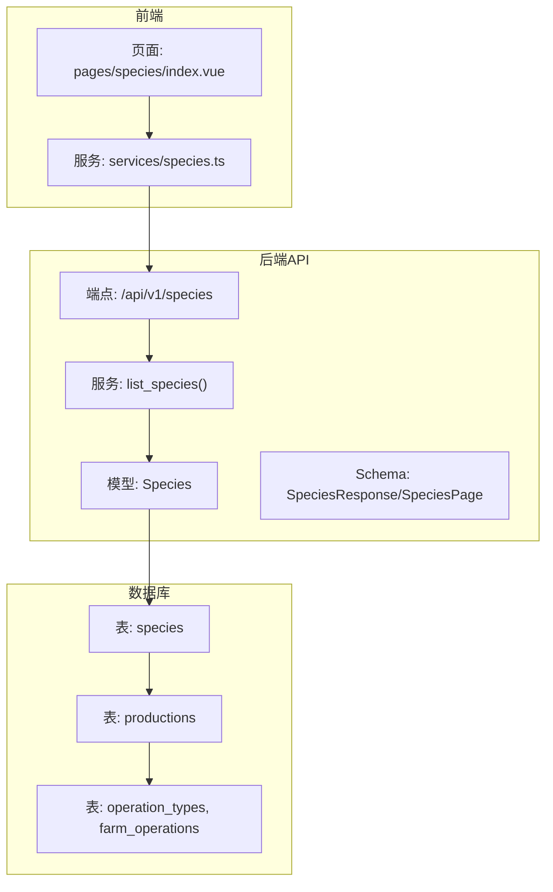
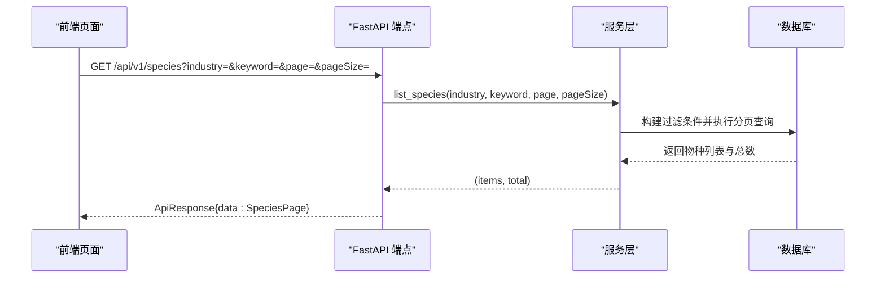
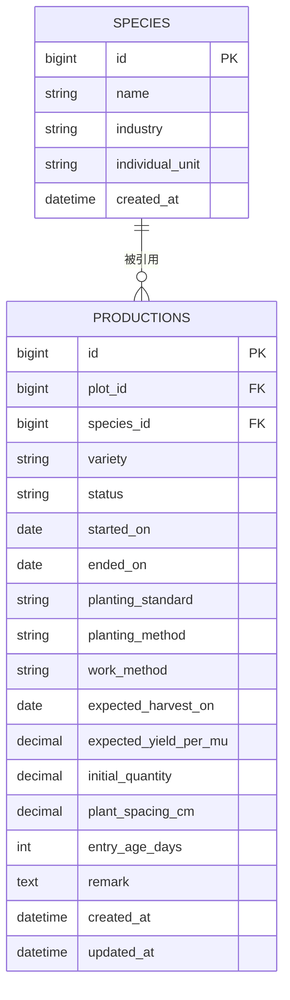
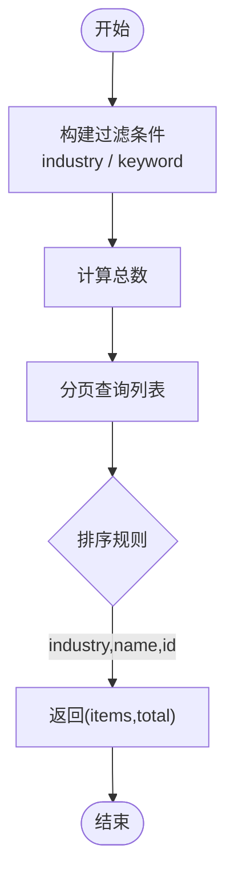
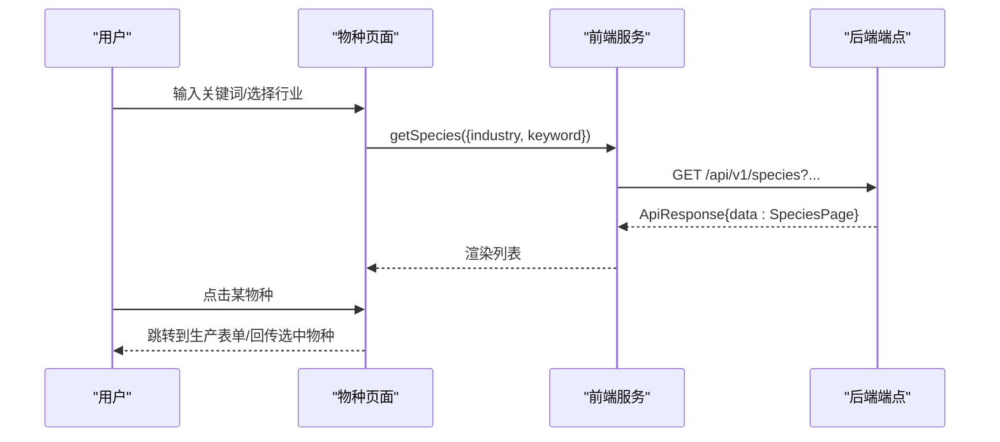
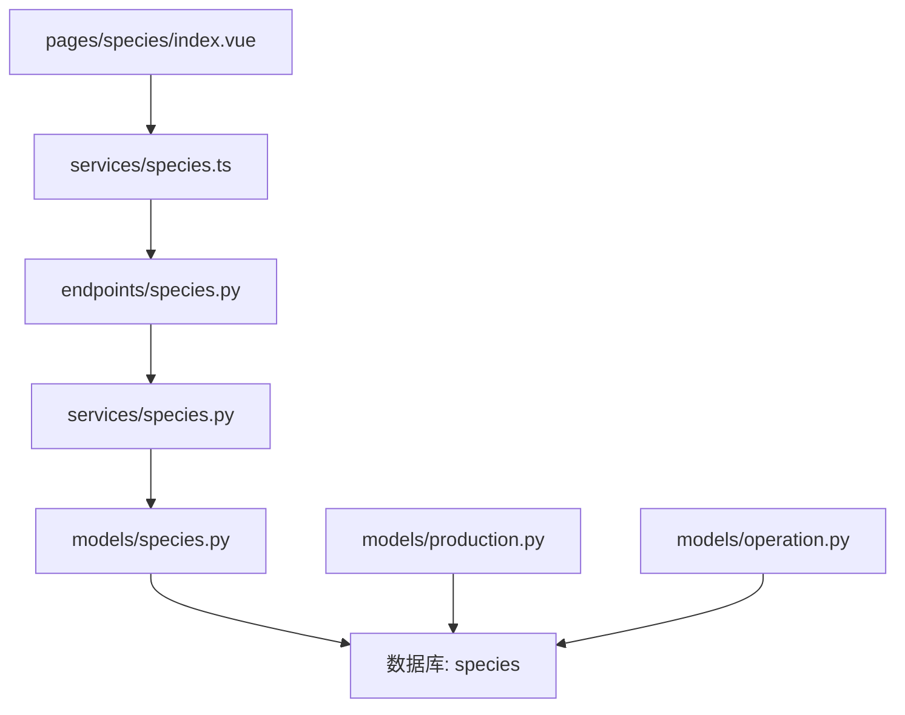
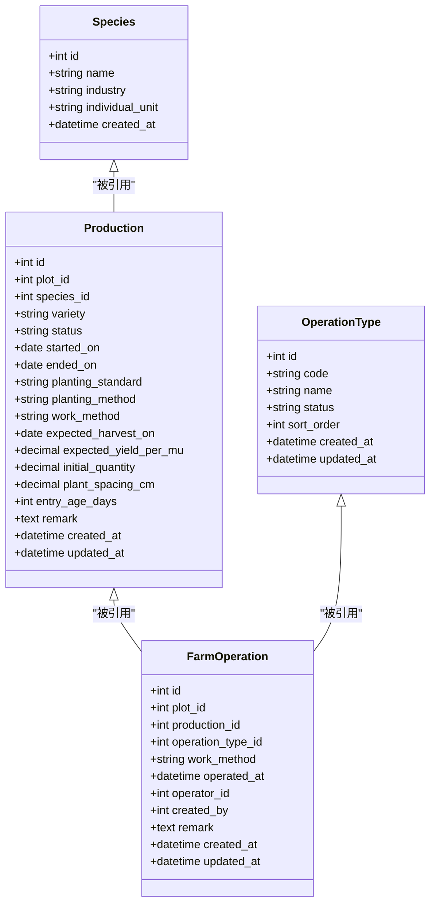

# 物种模型（Species）

<cite>
**本文引用的文件**
- [apps/api/app/models/species.py](file://apps/api/app/models/specpecies.py)
- [apps/api/app/schemas/species.py](file://apps/api/app/schemas/species.py)
- [apps/api/app/services/species.py](file://apps/api/app/services/species.py)
- [apps/api/app/api/v1/endpoints/species.py](file://apps/api/app/api/v1/endpoints/species.py)
- [apps/api/alembic/versions/1bf2b6d1b674_create_species_and_productions.py](file://apps/api/alembic/versions/1bf2b6d1b674_create_species_and_productions.py)
- [apps/api/alembic/versions/093fa42fe3ad_refine_production_industry_fields.py](file://apps/api/alembic/versions/093fa42fe3ad_refine_production_industry_fields.py)
- [apps/api/app/models/production.py](file://apps/api/app/models/production.py)
- [apps/api/app/models/operation.py](file://apps/api/app/models/operation.py)
- [apps/miniapp/src/pages/species/index.vue](file://apps/miniapp/src/pages/species/index.vue)
- [apps/miniapp/src/services/species.ts](file://apps/miniapp/src/services/species.ts)
- [apps/api/tests/test_productions.py](file://apps/api/tests/test_productions.py)
</cite>

## 目录
1. [简介](#简介)
2. [项目结构](#项目结构)
3. [核心组件](#核心组件)
4. [架构总览](#架构总览)
5. [详细组件分析](#详细组件分析)
6. [依赖关系分析](#依赖关系分析)
7. [性能考量](#性能考量)
8. [故障排查指南](#故障排查指南)
9. [结论](#结论)
10. [附录](#附录)

## 简介
本文件为 Pocket Farm 系统的“物种模型（Species）”提供系统化文档。内容涵盖：
- Species 实体的字段定义与业务含义，包括行业分类、个体计量单位等农业属性
- 物种与生产（Production）、作业类型（OperationType/FarmOperation）的关联关系
- 物种信息的分类管理与前端展示
- 物种数据的维护与更新机制（迁移脚本、默认数据、查询接口）
- 物种数据管理的最佳实践与扩展建议

## 项目结构
围绕物种模型的代码分布在后端 API、数据库迁移、前端页面与服务中：
- 后端模型与序列化：models/species.py、schemas/species.py
- 服务层与接口：services/species.py、endpoints/species.py
- 数据库迁移：创建 species 表及初始数据、完善 individual_unit 字段
- 关联实体：productions、operation_types、farm_operations
- 前端：species 列表页与调用服务

图表来源
- [apps/api/app/api/v1/endpoints/species.py:1-50](file://apps/api/app/api/v1/endpoints/species.py#L1-L50)
- [apps/api/app/services/species.py:1-30](file://apps/api/app/services/species.py#L1-L30)
- [apps/api/app/models/species.py:1-35](file://apps/api/app/models/species.py#L1-L35)
- [apps/api/app/schemas/species.py:1-21](file://apps/api/app/schemas/species.py#L1-L21)
- [apps/miniapp/src/pages/species/index.vue:1-258](file://apps/miniapp/src/pages/species/index.vue#L1-L258)
- [apps/miniapp/src/services/species.ts:1-34](file://apps/miniapp/src/services/species.ts#L1-L34)

章节来源
- [apps/api/app/models/species.py:1-35](file://apps/api/app/models/species.py#L1-L35)
- [apps/api/app/schemas/species.py:1-21](file://apps/api/app/schemas/species.py#L1-L21)
- [apps/api/app/services/species.py:1-30](file://apps/api/app/services/species.py#L1-L30)
- [apps/api/app/api/v1/endpoints/species.py:1-50](file://apps/api/app/api/v1/endpoints/species.py#L1-L50)
- [apps/miniapp/src/pages/species/index.vue:1-258](file://apps/miniapp/src/pages/species/index.vue#L1-L258)
- [apps/miniapp/src/services/species.ts:1-34](file://apps/miniapp/src/services/species.ts#L1-L34)

## 核心组件
- 数据模型 Species：定义物种的基础信息，包含名称、行业分类、个体计量单位、创建时间等
- 枚举 Industry 与 IndividualUnit：用于规范行业类别与个体计量单位
- Schema 响应对象：对外暴露的 JSON 结构，包含分页信息与字段别名
- 服务层：支持按行业、关键词分页查询物种
- 接口层：GET /api/v1/species，返回统一 ApiResponse 包装的分页结果
- 前端：物种选择页，支持按行业筛选与关键词搜索，并回传选中物种到上游流程

章节来源
- [apps/api/app/models/species.py:12-35](file://apps/api/app/models/species.py#L12-L35)
- [apps/api/app/schemas/species.py:8-21](file://apps/api/app/schemas/species.py#L8-L21)
- [apps/api/app/services/species.py:7-29](file://apps/api/app/services/species.py#L7-L29)
- [apps/api/app/api/v1/endpoints/species.py:16-49](file://apps/api/app/api/v1/endpoints/species.py#L16-L49)
- [apps/miniapp/src/pages/species/index.vue:64-159](file://apps/miniapp/src/pages/species/index.vue#L64-L159)
- [apps/miniapp/src/services/species.ts:3-33](file://apps/miniapp/src/services/species.ts#L3-L33)

## 架构总览
从请求到响应的完整链路如下：

图表来源
- [apps/api/app/api/v1/endpoints/species.py:26-49](file://apps/api/app/api/v1/endpoints/species.py#L26-L49)
- [apps/api/app/services/species.py:7-29](file://apps/api/app/services/species.py#L7-L29)

## 详细组件分析

### 数据模型与字段定义
- Species 表字段
  - id：自增主键（BIGINT UNSIGNED）
  - name：物种名称（VARCHAR(100)，非空）
  - industry：行业分类（VARCHAR(20)，非空，索引），取值来自 Industry 枚举
  - individual_unit：个体计量单位（VARCHAR(20)，非空），取值来自 IndividualUnit 枚举
  - created_at：创建时间（DATETIME，非空）

- Industry 枚举
  - AGRICULTURE（农业）
  - FORESTRY（林业）
  - LIVESTOCK（牧业）
  - FISHERY（渔业）

- IndividualUnit 枚举
  - HEAD（头）
  - FEATHER（羽）
  - PIECE（件）
  - PLANT（株）
  - TAIL（尾）

说明：
- 行业分类体现了物种所属的农业生产领域，便于分类管理与统计
- 个体计量单位用于统一计数口径，如植物用“株”，禽类用“羽”，鱼类用“尾”，牲畜用“头”等
- 创建时间用于审计与排序

章节来源
- [apps/api/app/models/species.py:12-35](file://apps/api/app/models/species.py#L12-L35)
- [apps/api/alembic/versions/093fa42fe3ad_refine_production_industry_fields.py:41-59](file://apps/api/alembic/versions/093fa42fe3ad_refine_production_industry_fields.py#L41-L59)

### 与生产（Production）的关联
- 关联方式：productions 表通过 species_id 外键关联 species.id
- 业务意义：一次生产活动绑定一个具体物种，便于记录品种、种植标准、方法、预期产量、初始数量等生产参数
- 约束：外键 ondelete RESTRICT，避免误删基础物种导致生产数据不一致

图表来源
- [apps/api/app/models/production.py:43-79](file://apps/api/app/models/production.py#L43-L79)
- [apps/api/alembic/versions/1bf2b6d1b674_create_species_and_productions.py:67-104](file://apps/api/alembic/versions/1bf2b6d1b674_create_species_and_productions.py#L67-L104)

章节来源
- [apps/api/app/models/production.py:43-79](file://apps/api/app/models/production.py#L43-L79)
- [apps/api/alembic/versions/1bf2b6d1b674_create_species_and_productions.py:67-104](file://apps/api/alembic/versions/1bf2b6d1b674_create_species_and_productions.py#L67-L104)

### 与作业类型（OperationType/FarmOperation）的间接关联
- 作业类型（operation_types）：定义可执行的农事作业种类（如播种、施肥、除草等），具备状态与排序
- 农场作业（farm_operations）：记录在特定地块上对某次生产进行的作业，关联 production_id 与 operation_type_id
- 间接关联路径：Species → Production → FarmOperation → OperationType
- 业务价值：将“物种—生产—作业”串联起来，形成完整的农事过程追踪

图表来源
- [apps/api/app/models/operation.py:18-80](file://apps/api/app/models/operation.py#L18-L80)
- [apps/api/app/models/production.py:43-79](file://apps/api/app/models/production.py#L43-L79)

章节来源
- [apps/api/app/models/operation.py:18-80](file://apps/api/app/models/operation.py#L18-L80)
- [apps/api/app/models/production.py:43-79](file://apps/api/app/models/production.py#L43-L79)

### 查询与分页逻辑
- 过滤条件：支持按 industry 精确匹配；支持按 keyword 模糊匹配 name
- 排序：先按 industry 升序，再按 name 升序，最后按 id 升序
- 分页：offset = (page - 1) * page_size，limit = page_size
- 计数：使用 count 聚合获取总数

图表来源
- [apps/api/app/services/species.py:7-29](file://apps/api/app/services/species.py#L7-L29)

章节来源
- [apps/api/app/services/species.py:7-29](file://apps/api/app/services/species.py#L7-L29)

### 前端交互与数据流
- 页面功能：支持按行业筛选、关键词搜索、加载状态与错误提示
- 数据回传：选择物种后，可通过事件通道或路由参数将选中物种传递到生产表单等上游页面
- 服务封装：getSpecies 函数组装查询参数并调用后端 /api/v1/species

图表来源
- [apps/miniapp/src/pages/species/index.vue:64-159](file://apps/miniapp/src/pages/species/index.vue#L64-L159)
- [apps/miniapp/src/services/species.ts:28-33](file://apps/miniapp/src/services/species.ts#L28-L33)
- [apps/api/app/api/v1/endpoints/species.py:26-49](file://apps/api/app/api/v1/endpoints/species.py#L26-L49)

章节来源
- [apps/miniapp/src/pages/species/index.vue:64-159](file://apps/miniapp/src/pages/species/index.vue#L64-L159)
- [apps/miniapp/src/services/species.ts:28-33](file://apps/miniapp/src/services/species.ts#L28-L33)

### 分类管理与行业标准集成
- 分类管理：Industry 枚举限定四大行业，保证数据一致性与可检索性
- 计量单位：IndividualUnit 枚举统一计数口径，便于后续产量统计与成本核算
- 初始数据：迁移脚本内置了常见作物、林木、畜禽、鱼类的种子数据，便于系统初始化体验
- 标准化：通过枚举与迁移脚本固化行业标准术语，减少歧义

章节来源
- [apps/api/app/models/species.py:12-25](file://apps/api/app/models/species.py#L12-L25)
- [apps/api/alembic/versions/1bf2b6d1b674_create_species_and_productions.py:38-66](file://apps/api/alembic/versions/1bf2b6d1b674_create_species_and_productions.py#L38-L66)
- [apps/api/alembic/versions/093fa42fe3ad_refine_production_industry_fields.py:41-59](file://apps/api/alembic/versions/093fa42fe3ad_refine_production_industry_fields.py#L41-L59)

### 数据维护与更新机制
- 新增物种：通过数据库迁移或后台管理工具插入新记录，确保 industry 与 individual_unit 符合枚举
- 更新单位：individual_unit 由迁移脚本根据行业与名称进行批量填充，并在后续版本中设为非空
- 查询优化：industry 字段已建索引，提升按行业筛选的性能
- 测试验证：测试用例覆盖全量查询与行业+关键词组合查询，保障接口稳定性

章节来源
- [apps/api/alembic/versions/093fa42fe3ad_refine_production_industry_fields.py:41-59](file://apps/api/alembic/versions/093fa42fe3ad_refine_production_industry_fields.py#L41-L59)
- [apps/api/app/models/species.py:30-35](file://apps/api/app/models/species.py#L30-L35)
- [apps/api/tests/test_productions.py:138-146](file://apps/api/tests/test_productions.py#L138-L146)

## 依赖关系分析
- 模型依赖：Species 独立存在；Production 依赖 Species；FarmOperation 依赖 Production 与 OperationType
- 接口依赖：端点依赖服务层；服务层依赖模型与数据库会话
- 前端依赖：页面依赖服务封装；服务封装依赖 HTTP 客户端

图表来源
- [apps/api/app/api/v1/endpoints/species.py:1-50](file://apps/api/app/api/v1/endpoints/species.py#L1-L50)
- [apps/api/app/services/species.py:1-30](file://apps/api/app/services/species.py#L1-L30)
- [apps/api/app/models/species.py:1-35](file://apps/api/app/models/species.py#L1-L35)
- [apps/api/app/models/production.py:1-79](file://apps/api/app/models/production.py#L1-L79)
- [apps/api/app/models/operation.py:1-80](file://apps/api/app/models/operation.py#L1-L80)
- [apps/miniapp/src/pages/species/index.vue:1-258](file://apps/miniapp/src/pages/species/index.vue#L1-L258)
- [apps/miniapp/src/services/species.ts:1-34](file://apps/miniapp/src/services/species.ts#L1-L34)

章节来源
- [apps/api/app/api/v1/endpoints/species.py:1-50](file://apps/api/app/api/v1/endpoints/species.py#L1-L50)
- [apps/api/app/services/species.py:1-30](file://apps/api/app/services/species.py#L1-L30)
- [apps/api/app/models/species.py:1-35](file://apps/api/app/models/species.py#L1-L35)
- [apps/api/app/models/production.py:1-79](file://apps/api/app/models/production.py#L1-L79)
- [apps/api/app/models/operation.py:1-80](file://apps/api/app/models/operation.py#L1-L80)
- [apps/miniapp/src/pages/species/index.vue:1-258](file://apps/miniapp/src/pages/species/index.vue#L1-L258)
- [apps/miniapp/src/services/species.ts:1-34](file://apps/miniapp/src/services/species.ts#L1-L34)

## 性能考量
- 索引优化：species.industry 已建立索引，利于按行业筛选
- 分页策略：服务端采用 offset/limit 分页，避免一次性返回大量数据
- 排序策略：多字段排序（industry、name、id）保证列表稳定有序
- 前端缓存：可在前端对热门行业或关键词结果做短期缓存，减少重复请求
- 查询参数校验：接口对 page、pageSize、keyword 长度进行校验，防止异常负载

[本节为通用性能建议，不直接分析具体文件]

## 故障排查指南
- 401 未授权：前端在加载失败时检测 401 并跳转登录，检查认证令牌是否有效
- 无数据：确认 industry 与 keyword 是否正确；检查数据库中是否存在对应物种
- 单位不正确：核对 individual_unit 是否符合行业与名称映射规则；必要时通过迁移或管理工具修正
- 分页异常：检查 page 与 pageSize 是否在合法范围；确认后端 limit/offset 计算正确

章节来源
- [apps/miniapp/src/pages/species/index.vue:103-127](file://apps/miniapp/src/pages/species/index.vue#L103-L127)
- [apps/api/app/api/v1/endpoints/species.py:26-49](file://apps/api/app/api/v1/endpoints/species.py#L26-L49)
- [apps/api/alembic/versions/093fa42fe3ad_refine_production_industry_fields.py:41-59](file://apps/api/alembic/versions/093fa42fe3ad_refine_production_industry_fields.py#L41-L59)

## 结论
Pocket Farm 的物种模型以简洁而标准化的方式定义了农业系统中的基础物种信息，并通过枚举与迁移脚本实现了行业分类与计量单位的规范化。物种作为生产活动的核心维度，与生产、作业类型形成清晰的关联链条，支撑了从选种到农事作业的完整业务流程。当前实现提供了稳定的查询能力与良好的可扩展性，建议在后续迭代中继续完善品种级信息、生长周期与环境适配等农业属性，以满足更精细化的生产管理需求。

[本节为总结性内容，不直接分析具体文件]

## 附录

### API 定义（物种查询）
- 方法：GET
- 路径：/api/v1/species
- 查询参数：
  - industry：可选，枚举值（AGRICULTURE/FORESTRY/LIVESTOCK/FISHERY）
  - keyword：可选，字符串，长度 1-100
  - page：可选，整数，≥1
  - pageSize：可选，整数，1-100
- 响应体：ApiResponse 包装的 SpeciesPage，包含 items、page、pageSize、total

章节来源
- [apps/api/app/api/v1/endpoints/species.py:26-49](file://apps/api/app/api/v1/endpoints/species.py#L26-L49)
- [apps/api/app/schemas/species.py:8-21](file://apps/api/app/schemas/species.py#L8-L21)

### 数据模型关系图（代码级）

图表来源
- [apps/api/app/models/species.py:27-35](file://apps/api/app/models/species.py#L27-L35)
- [apps/api/app/models/production.py:43-79](file://apps/api/app/models/production.py#L43-L79)
- [apps/api/app/models/operation.py:18-80](file://apps/api/app/models/operation.py#L18-L80)

### 最佳实践与扩展建议
- 数据治理
  - 严格遵循 Industry 与 IndividualUnit 枚举，禁止自由文本
  - 新增物种时同步评估其计量单位与行业归属
- 扩展字段
  - 生长周期（天数/阶段）、适宜环境（温度/湿度/土壤）、病虫害特征等农业属性可按需扩展
  - 引入品种（variety）层级，细化同一物种下的不同栽培变种
- 标准对接
  - 与国家或行业标准（如农作物分类编码、畜牧分类编码）对齐，便于数据交换与上报
- 性能与安全
  - 保持分页与索引优化；对敏感操作增加权限校验与审计日志
  - 前端对高频查询进行合理缓存，降低服务器压力

[本节为通用建议，不直接分析具体文件]