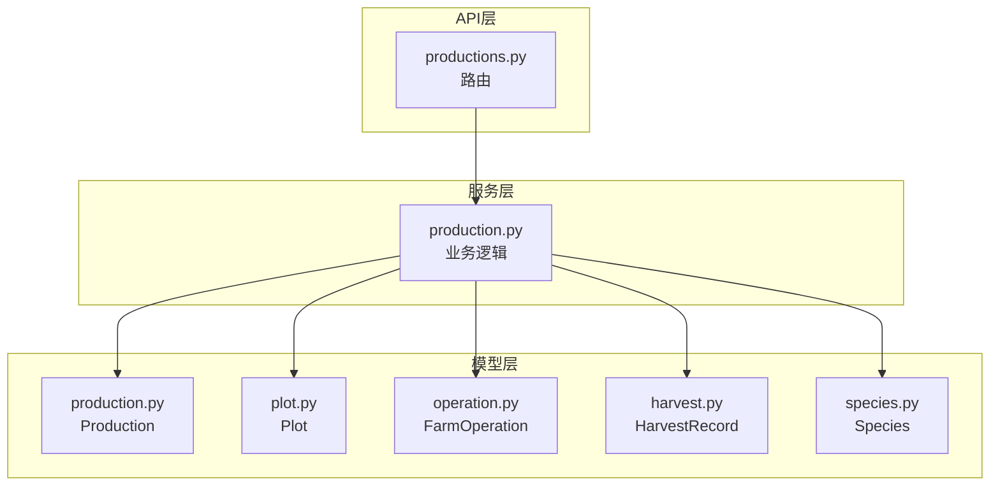
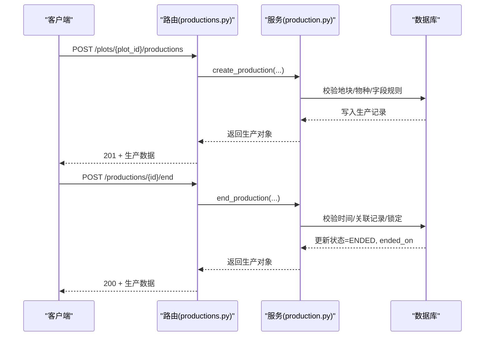
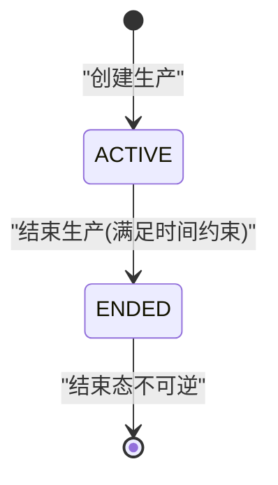
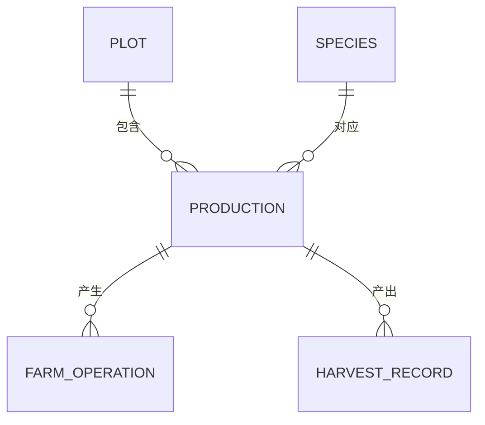
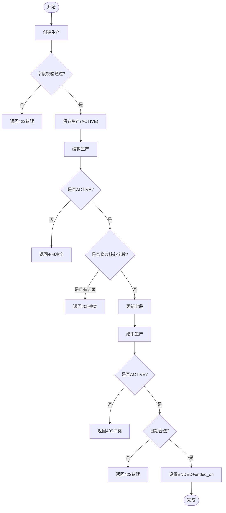
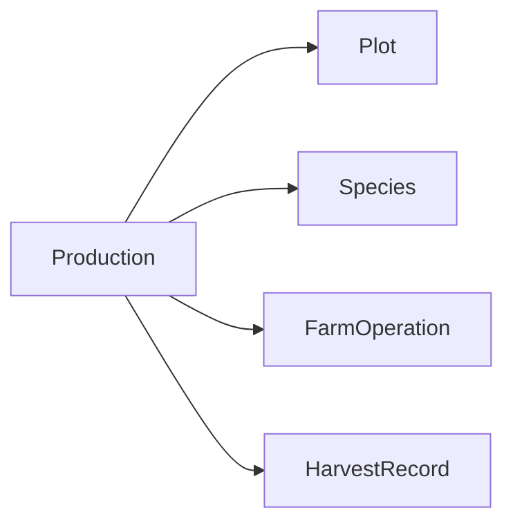
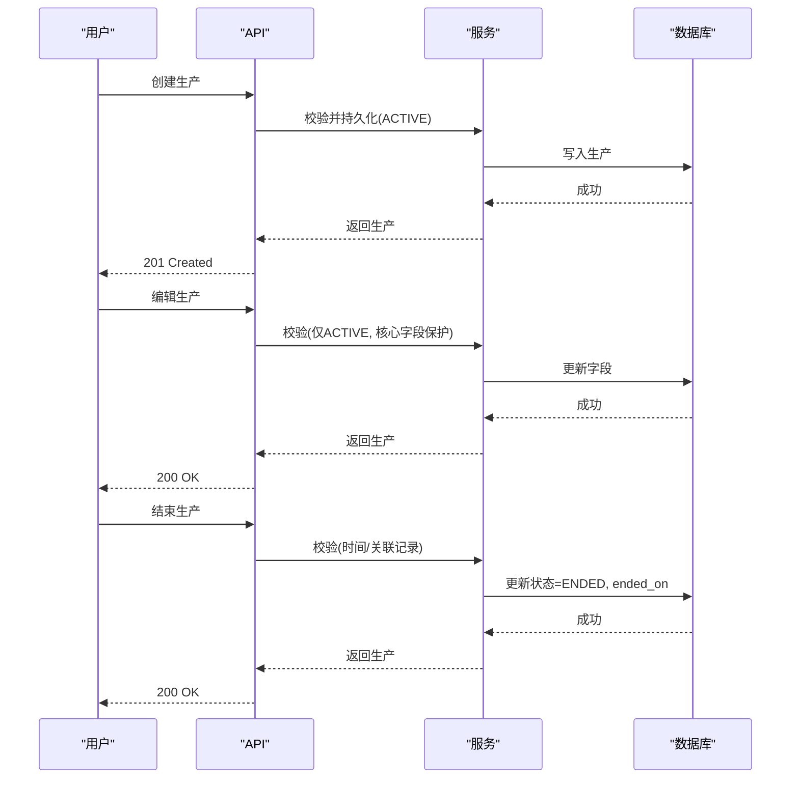
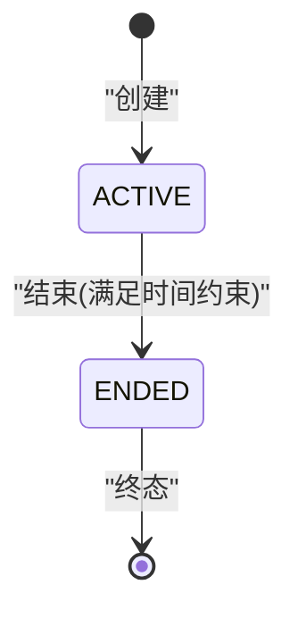

# 生产模型 (Production)

<cite>
**本文引用的文件**
- [apps/api/app/models/production.py](file://apps/api/app/models/production.py)
- [apps/api/app/schemas/production.py](file://apps/api/app/schemas/production.py)
- [apps/api/app/services/production.py](file://apps/api/app/services/production.py)
- [apps/api/app/api/v1/endpoints/productions.py](file://apps/api/app/api/v1/endpoints/productions.py)
- [apps/api/app/models/plot.py](file://apps/api/app/models/plot.py)
- [apps/api/app/models/operation.py](file://apps/api/app/models/operation.py)
- [apps/api/app/models/harvest.py](file://apps/api/app/models/harvest.py)
- [apps/api/app/models/species.py](file://apps/api/app/models/species.py)
- [apps/api/tests/test_productions.py](file://apps/api/tests/test_productions.py)
- [docs/mvp/03-business-rules.md](file://docs/mvp/03-business-rules.md)
</cite>

## 目录
1. [简介](#简介)
2. [项目结构](#项目结构)
3. [核心组件](#核心组件)
4. [架构总览](#架构总览)
5. [详细组件分析](#详细组件分析)
6. [依赖关系分析](#依赖关系分析)
7. [性能与一致性](#性能与一致性)
8. [故障排查指南](#故障排查指南)
9. [结论](#结论)
10. [附录：数据流与状态图](#附录数据流与状态图)

## 简介
本文件为 Pocket Farm 系统的“生产”（Production）模型提供完整、深入的技术文档。内容涵盖实体字段定义、生命周期状态流转规则、与地块/作业记录/收获记录的关联关系，以及进度跟踪与质量评估机制。同时给出端到端的数据流与状态转换图，帮助开发者与业务人员准确理解并正确使用该模块。

## 项目结构
围绕 Production 的核心代码分布在以下位置：
- 数据模型：app/models/production.py
- 请求/响应模式：app/schemas/production.py
- 业务服务：app/services/production.py
- API 路由：app/api/v1/endpoints/productions.py
- 关联模型：plots、farm_operations、harvest_records、species
- 测试用例：tests/test_productions.py
- 业务规则文档：docs/mvp/03-business-rules.md

图表来源
- [apps/api/app/api/v1/endpoints/productions.py:1-198](file://apps/api/app/api/v1/endpoints/productions.py#L1-L198)
- [apps/api/app/services/production.py:1-446](file://apps/api/app/services/production.py#L1-L446)
- [apps/api/app/models/production.py:1-79](file://apps/api/app/models/production.py#L1-L79)
- [apps/api/app/models/plot.py:1-54](file://apps/api/app/models/plot.py#L1-L54)
- [apps/api/app/models/operation.py:1-80](file://apps/api/app/models/operation.py#L1-L80)
- [apps/api/app/models/harvest.py:1-48](file://apps/api/app/models/harvest.py#L1-L48)
- [apps/api/app/models/species.py:1-35](file://apps/api/app/models/species.py#L1-L35)

章节来源
- [apps/api/app/api/v1/endpoints/productions.py:1-198](file://apps/api/app/api/v1/endpoints/productions.py#L1-L198)
- [apps/api/app/services/production.py:1-446](file://apps/api/app/services/production.py#L1-L446)
- [apps/api/app/models/production.py:1-79](file://apps/api/app/models/production.py#L1-L79)

## 核心组件
- Production 实体：承载一次种植/养殖/捕捞等生产活动的全量信息，包括名称/品种、作物种类、开始/结束日期、预计收获日、计划产量、初始数量、种植方式、作业方式、株距、苗龄、备注等。
- 枚举类型：
  - 生产状态：ACTIVE（进行中）、ENDED（已结束）
  - 种植标准：NORMAL、GREEN、ORGANIC
  - 种植方式：TRANSPLANT（移栽）、DIRECT_SEEDING（直播）
  - 作业方式：MANUAL（人工）、MECHANICAL（机械）
  - 数量单位：KG、HEAD、FEATHER、PIECE、PLANT、TAIL
- 关联模型：
  - Plot（地块）：生产发生的具体地块
  - Species（物种）：生产对应的物种，决定行业、个体单位等
  - FarmOperation（作业记录）：与生产关联的农事操作
  - HarvestRecord（收获记录）：与生产关联的收获批次

章节来源
- [apps/api/app/models/production.py:13-79](file://apps/api/app/models/production.py#L13-L79)
- [apps/api/app/models/species.py:12-35](file://apps/api/app/models/species.py#L12-L35)
- [apps/api/app/models/plot.py:31-54](file://apps/api/app/models/plot.py#L31-L54)
- [apps/api/app/models/operation.py:37-80](file://apps/api/app/models/operation.py#L37-L80)
- [apps/api/app/models/harvest.py:13-48](file://apps/api/app/models/harvest.py#L13-L48)

## 架构总览
Production 的生命周期由 API 路由驱动，经服务层校验与持久化，最终落库到数据库。关键流程包括：
- 创建生产：POST /plots/{plot_id}/productions
- 查询生产列表/详情：GET /plots/{plot_id}/productions、GET /productions/{id}
- 编辑生产：PATCH /productions/{id}
- 结束生产：POST /productions/{id}/end
- 删除生产：DELETE /productions/{id}

图表来源
- [apps/api/app/api/v1/endpoints/productions.py:71-198](file://apps/api/app/api/v1/endpoints/productions.py#L71-L198)
- [apps/api/app/services/production.py:164-446](file://apps/api/app/services/production.py#L164-L446)

## 详细组件分析

### 实体字段与约束
- 标识与关联
  - id：自增主键
  - plot_id：所属地块（外键）
  - species_id：所属物种（外键），用于推导行业与单位
- 基本信息
  - variety：品种（可选）
  - status：状态（ACTIVE/ENDED）
  - started_on：开始日期（必填）
  - ended_on：结束日期（可选）
- 生产参数
  - planting_standard：种植标准（农业/林业适用）
  - planting_method：种植方式（农业/林业适用）
  - work_method：作业方式（渔业/农业适用）
  - expected_harvest_on：预计收获日（农业适用）
  - expected_yield_per_mu：亩产预期（农业适用）
  - initial_quantity：初始数量（按行业要求必填或可选）
  - plant_spacing_cm：株距（厘米）
  - entry_age_days：苗龄/入栏天数（牧业适用）
  - remark：备注
- 审计字段
  - created_at、updated_at：自动维护

章节来源
- [apps/api/app/models/production.py:43-79](file://apps/api/app/models/production.py#L43-L79)
- [apps/api/app/schemas/production.py:15-198](file://apps/api/app/schemas/production.py#L15-L198)

### 行业字段校验规则
不同行业对字段的要求不同，服务层在创建与编辑时进行强校验：
- 农业/林业
  - 必须提供：planting_standard、planting_method、work_method
  - 林业额外要求：initial_quantity；禁止 expected_yield_per_mu
  - 禁止：entry_age_days
- 牧业
  - 必须提供：initial_quantity、entry_age_days
  - 禁止：work_method
- 渔业
  - 必须提供：initial_quantity、work_method
  - 禁止：planting_standard、planting_method、expected_harvest_on、expected_yield_per_mu、plant_spacing_cm
- 通用
  - initial_quantity 若存在，需为整数（与物种单位一致）
  - started_on 不得晚于今天
  - ended_on 不得晚于今天且不早于 started_on，且不早于最近一次作业/收获的业务日期

章节来源
- [apps/api/app/services/production.py:63-103](file://apps/api/app/services/production.py#L63-L103)
- [apps/api/app/services/production.py:44-50](file://apps/api/app/services/production.py#L44-L50)
- [apps/api/app/services/production.py:403-445](file://apps/api/app/services/production.py#L403-L445)
- [docs/mvp/03-business-rules.md:379-595](file://docs/mvp/03-business-rules.md#L379-L595)

### 生产生命周期与状态流转
- 状态集合：ACTIVE（进行中）、ENDED（已结束）
- 默认状态：创建时为 ACTIVE
- 结束条件：
  - 仅允许对 ACTIVE 的生产执行结束
  - ended_on 不得晚于今天，不早于 started_on，且不早于任何关联作业/收获的业务日期
  - 结束后不可再次结束、不可编辑、不可删除
- 删除限制：
  - 仅 ACTIVE 可删除
  - 若存在作业记录或收获记录，则不允许删除
- 同地块多生产：
  - 同一地块允许多个 ACTIVE 生产并存
  - 历史已结束的生产不影响后续新生产

图表来源
- [apps/api/app/services/production.py:164-217](file://apps/api/app/services/production.py#L164-L217)
- [apps/api/app/services/production.py:403-445](file://apps/api/app/services/production.py#L403-L445)
- [apps/api/tests/test_productions.py:361-412](file://apps/api/tests/test_productions.py#L361-L412)

### 与地块、作业记录、收获记录的关系映射
- 与地块（Plot）
  - 一对多：一个地块可拥有多个生产（含多个 ACTIVE）
  - 编辑时可跨地块移动，但必须在同一农场内
- 与作业记录（FarmOperation）
  - 一对多：一个生产可有多条作业记录
  - 作业记录的时间影响结束时间的合法性（ended_on 不得早于最近作业的业务日期）
  - 若已存在作业记录，则禁止修改核心字段（plot_id、species_id、started_on）
- 与收获记录（HarvestRecord）
  - 一对多：一个生产可有多次收获
  - 收获不会改变生产状态（仍为 ACTIVE）
  - 若已存在收获记录，则禁止修改核心字段（plot_id、species_id、started_on）
  - 结束时间不得早于最近收获的业务日期

图表来源
- [apps/api/app/models/plot.py:31-54](file://apps/api/app/models/plot.py#L31-L54)
- [apps/api/app/models/production.py:43-79](file://apps/api/app/models/production.py#L43-L79)
- [apps/api/app/models/operation.py:37-80](file://apps/api/app/models/operation.py#L37-L80)
- [apps/api/app/models/harvest.py:13-48](file://apps/api/app/models/harvest.py#L13-L48)
- [apps/api/app/models/species.py:27-35](file://apps/api/app/models/species.py#L27-L35)

### 进度跟踪与质量评估机制
- 进度跟踪
  - 通过作业记录（FarmOperation）累计生产过程中的农事活动，支持补录过去时间（不晚于当前时间）
  - 通过收获记录（HarvestRecord）累计实际收获批次与数量
  - 预计收获日（expected_harvest_on）用于计划管理，非强制约束
- 质量评估
  - 收获记录包含等级（grade）与产品名称（product_name），可用于质量分级与追溯
  - 单位与数量：收获单位由后端根据物种派生，客户端不可传入；MVP 不做单位换算
  - 数量精度：收获重量（农业/渔业）允许小数；林业/牧业收获数量为整数（基于物种单位）

章节来源
- [apps/api/app/models/operation.py:37-80](file://apps/api/app/models/operation.py#L37-L80)
- [apps/api/app/models/harvest.py:13-48](file://apps/api/app/models/harvest.py#L13-L48)
- [docs/mvp/03-business-rules.md:379-595](file://docs/mvp/03-business-rules.md#L379-L595)

### API 与数据流
- 创建生产
  - 输入：地块、物种、开始日期及行业相关字段
  - 校验：行业字段必填/禁填、日期合法性、数量整数性
  - 输出：生产对象（含物种名称、行业、单位等）
- 编辑生产
  - 仅 ACTIVE 可编辑
  - 若已有作业/收获记录，禁止修改核心字段（plot_id、species_id、started_on）
  - 支持跨地块移动（同农场内）
- 结束生产
  - 仅 ACTIVE 可结束
  - 校验 ended_on 与 started_on、最近作业/收获业务日期
  - 成功后状态变为 ENDED，ended_on 写入
- 删除生产
  - 仅 ACTIVE 可删除
  - 若存在作业/收获记录，禁止删除

图表来源
- [apps/api/app/api/v1/endpoints/productions.py:71-198](file://apps/api/app/api/v1/endpoints/productions.py#L71-L198)
- [apps/api/app/services/production.py:164-446](file://apps/api/app/services/production.py#L164-L446)

章节来源
- [apps/api/app/api/v1/endpoints/productions.py:71-198](file://apps/api/app/api/v1/endpoints/productions.py#L71-L198)
- [apps/api/app/services/production.py:164-446](file://apps/api/app/services/production.py#L164-L446)
- [apps/api/tests/test_productions.py:138-412](file://apps/api/tests/test_productions.py#L138-L412)

## 依赖关系分析
- 外部依赖
  - 数据库：MySQL（BIGINT unsigned 主键、Decimal 数值、Date/DateTime）
  - 时区：使用配置中的业务时区（如 Asia/Shanghai）进行日期计算
- 内部依赖
  - 地块权限：通过 FarmMember 校验用户对该地块的访问权限
  - 物种信息：用于推导行业、单位、字段约束
  - 作业/收获：用于约束核心字段修改与结束时间

图表来源
- [apps/api/app/models/production.py:43-79](file://apps/api/app/models/production.py#L43-L79)
- [apps/api/app/models/plot.py:31-54](file://apps/api/app/models/plot.py#L31-L54)
- [apps/api/app/models/species.py:27-35](file://apps/api/app/models/species.py#L27-L35)
- [apps/api/app/models/operation.py:37-80](file://apps/api/app/models/operation.py#L37-L80)
- [apps/api/app/models/harvest.py:13-48](file://apps/api/app/models/harvest.py#L13-L48)

章节来源
- [apps/api/app/services/production.py:112-161](file://apps/api/app/services/production.py#L112-L161)
- [apps/api/app/services/production.py:220-365](file://apps/api/app/services/production.py#L220-L365)
- [apps/api/app/services/production.py:368-445](file://apps/api/app/services/production.py#L368-L445)

## 性能与一致性
- 查询优化
  - 列表查询按状态优先排序（ACTIVE 在前），再按开始日期与 ID 倒序
  - 分页查询使用 offset/limit，避免全表扫描
- 并发与锁
  - 编辑与结束操作使用行级锁（with_for_update）防止竞态
- 事务与刷新
  - 每次写操作后 commit 并 refresh，确保返回最新数据
- 索引
  - plot_id、species_id 建立索引以加速过滤与关联查询

章节来源
- [apps/api/app/services/production.py:112-138](file://apps/api/app/services/production.py#L112-L138)
- [apps/api/app/services/production.py:141-161](file://apps/api/app/services/production.py#L141-L161)
- [apps/api/app/services/production.py:220-365](file://apps/api/app/services/production.py#L220-L365)
- [apps/api/app/services/production.py:403-445](file://apps/api/app/services/production.py#L403-L445)

## 故障排查指南
- 常见错误码与原因
  - 404：生产不存在或用户无权限访问
  - 409：尝试编辑/删除已结束生产；重复结束；修改核心字段但与已有作业/收获冲突；跨农场移动地块
  - 422：字段校验失败（如 started_on 未来、ended_on 非法、行业必填字段缺失、数量非整数等）
- 定位步骤
  - 检查请求字段是否符合行业要求（参考服务层校验）
  - 确认生产状态是否为 ACTIVE
  - 核对时间字段与业务时区
  - 查看是否存在作业/收获记录影响核心字段修改或结束时间
- 日志与断点
  - 在服务层关键校验处添加日志，捕获具体失败原因
  - 使用单元测试覆盖边界场景（如多次收获后结束、同地块多生产）

章节来源
- [apps/api/app/services/production.py:28-37](file://apps/api/app/services/production.py#L28-L37)
- [apps/api/app/services/production.py:44-103](file://apps/api/app/services/production.py#L44-L103)
- [apps/api/app/services/production.py:220-445](file://apps/api/app/services/production.py#L220-L445)
- [apps/api/tests/test_productions.py:138-412](file://apps/api/tests/test_productions.py#L138-L412)

## 结论
Production 模型以清晰的字段设计与严格的行业校验为基础，结合明确的状态机与关联约束，实现了从创建、编辑、结束到删除的完整生命周期管理。通过与地块、作业记录、收获记录的紧密耦合，系统能够准确追踪生产进度与质量，并保证数据的一致性与可追溯性。建议在扩展新功能时遵循现有校验与状态规则，避免破坏既有业务语义。

## 附录：数据流与状态图

### 生产数据流（创建→编辑→结束）

图表来源
- [apps/api/app/api/v1/endpoints/productions.py:71-198](file://apps/api/app/api/v1/endpoints/productions.py#L71-L198)
- [apps/api/app/services/production.py:164-446](file://apps/api/app/services/production.py#L164-L446)

### 状态转换图（ACTIVE ↔ ENDED）

图表来源
- [apps/api/app/services/production.py:164-217](file://apps/api/app/services/production.py#L164-L217)
- [apps/api/app/services/production.py:403-445](file://apps/api/app/services/production.py#L403-L445)