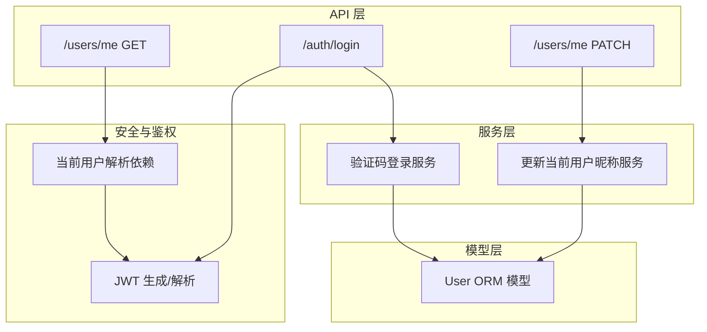
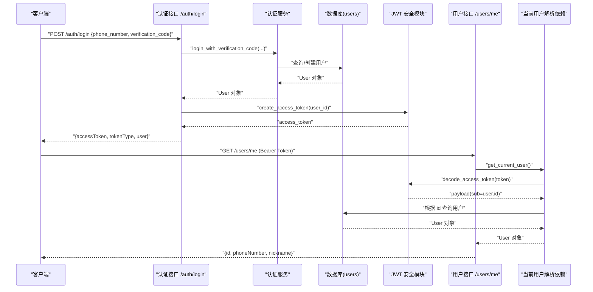
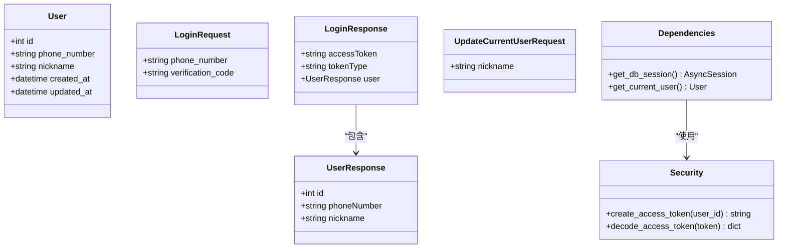
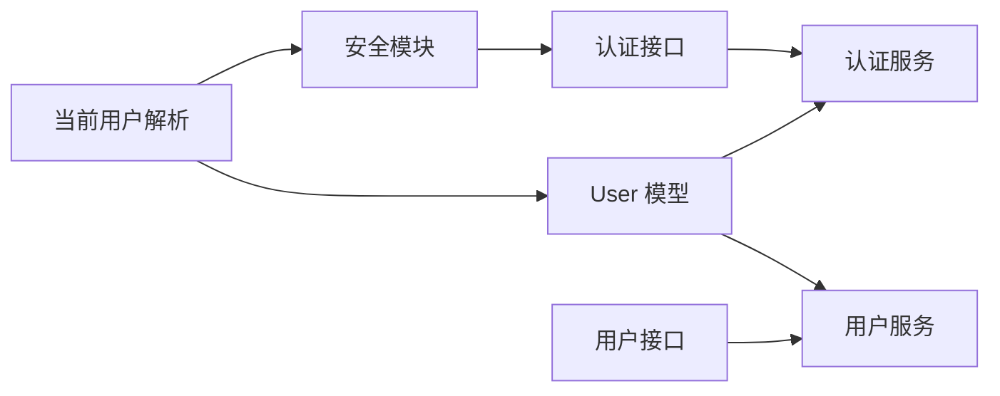

# 用户模型 (User)

<cite>
**本文引用的文件**
- [apps/api/app/models/user.py](file://apps/api/app/models/user.py)
- [apps/api/app/schemas/user.py](file://apps/api/app/schemas/user.py)
- [apps/api/app/services/user.py](file://apps/api/app/services/user.py)
- [apps/api/app/api/v1/endpoints/users.py](file://apps/api/app/api/v1/endpoints/users.py)
- [apps/api/app/api/v1/endpoints/auth.py](file://apps/api/app/api/v1/endpoints/auth.py)
- [apps/api/app/services/auth.py](file://apps/api/app/services/auth.py)
- [apps/api/app/core/security.py](file://apps/api/app/core/security.py)
- [apps/api/app/api/deps.py](file://apps/api/app/api/deps.py)
- [apps/api/alembic/versions/f67d91555137_create_users.py](file://apps/api/alembic/versions/f67d91555137_create_users.py)
</cite>

## 目录
1. [简介](#简介)
2. [项目结构](#项目结构)
3. [核心组件](#核心组件)
4. [架构总览](#架构总览)
5. [详细组件分析](#详细组件分析)
6. [依赖关系分析](#依赖关系分析)
7. [性能考虑](#性能考虑)
8. [故障排查指南](#故障排查指南)
9. [结论](#结论)
10. [附录：字段说明与使用示例](#附录字段说明与使用示例)

## 简介
本文件为 Pocket Farm 系统的用户模型（User）提供完整、深入的技术文档。内容涵盖 User 实体的字段定义、类型与约束、业务含义，认证相关的数据结构设计，用户信息管理规则，以及该模型在系统中的角色与与其他实体的关系。文末附有完整的字段说明表与典型使用示例路径，便于快速查阅与实践。

## 项目结构
围绕用户模型的相关代码分布在以下模块：
- 数据模型层：定义数据库表结构与 ORM 映射
- 数据传输对象层：定义请求/响应结构及校验规则
- 服务层：封装用户相关的业务逻辑（如更新昵称、验证码登录）
- API 层：暴露 RESTful 接口（获取当前用户信息、更新当前用户昵称、手机号+验证码登录）
- 安全与鉴权：JWT 令牌生成与解析、基于 Bearer Token 的当前用户解析
- 迁移脚本：创建 users 表的 DDL

图表来源
- [apps/api/app/api/v1/endpoints/auth.py:13-28](file://apps/api/app/api/v1/endpoints/auth.py#L13-L28)
- [apps/api/app/api/v1/endpoints/users.py:15-29](file://apps/api/app/api/v1/endpoints/users.py#L15-L29)
- [apps/api/app/services/auth.py:11-46](file://apps/api/app/services/auth.py#L11-L46)
- [apps/api/app/services/user.py:6-15](file://apps/api/app/services/user.py#L6-L15)
- [apps/api/app/core/security.py:8-28](file://apps/api/app/core/security.py#L8-L28)
- [apps/api/app/api/deps.py:29-65](file://apps/api/app/api/deps.py#L29-L65)

章节来源
- [apps/api/app/models/user.py:15-27](file://apps/api/app/models/user.py#L15-L27)
- [apps/api/app/schemas/user.py:4-33](file://apps/api/app/schemas/user.py#L4-L33)
- [apps/api/app/api/v1/endpoints/auth.py:13-28](file://apps/api/app/api/v1/endpoints/auth.py#L13-L28)
- [apps/api/app/api/v1/endpoints/users.py:15-29](file://apps/api/app/api/v1/endpoints/users.py#L15-L29)
- [apps/api/app/services/auth.py:11-46](file://apps/api/app/services/auth.py#L11-L46)
- [apps/api/app/services/user.py:6-15](file://apps/api/app/services/user.py#L6-L15)
- [apps/api/app/core/security.py:8-28](file://apps/api/app/core/security.py#L8-L28)
- [apps/api/app/api/deps.py:29-65](file://apps/api/app/api/deps.py#L29-L65)
- [apps/api/alembic/versions/f67d91555137_create_users.py:21-32](file://apps/api/alembic/versions/f67d91555137_create_users.py#L21-L32)

## 核心组件
- 数据模型 User：定义 users 表的 ORM 映射，包含主键 id、唯一手机号 phone_number、可选昵称 nickname、创建时间 created_at、更新时间 updated_at。
- 传输模型：
  - LoginRequest：登录请求体，含手机号与验证码，带格式校验。
  - UserResponse：对外返回的用户信息，包含 id、phoneNumber、nickname。
  - LoginResponse：登录成功响应，包含 accessToken、tokenType、user。
  - UpdateCurrentUserRequest：更新当前用户昵称的请求体。
- 服务：
  - 验证码登录：校验验证码策略，查找或创建用户，处理并发冲突。
  - 更新当前用户昵称：仅允许更新 nickname。
- API：
  - POST /auth/login：手机号+验证码登录，返回 JWT 和用户信息。
  - GET /users/me：获取当前用户信息（需鉴权）。
  - PATCH /users/me：更新当前用户昵称（需鉴权）。
- 安全与鉴权：
  - JWT 生成与解析：用于签发访问令牌与验证令牌有效性。
  - 当前用户解析：从 Bearer Token 中解析出用户并注入到请求上下文。

章节来源
- [apps/api/app/models/user.py:15-27](file://apps/api/app/models/user.py#L15-L27)
- [apps/api/app/schemas/user.py:4-33](file://apps/api/app/schemas/user.py#L4-L33)
- [apps/api/app/services/auth.py:11-46](file://apps/api/app/services/auth.py#L11-L46)
- [apps/api/app/services/user.py:6-15](file://apps/api/app/services/user.py#L6-L15)
- [apps/api/app/api/v1/endpoints/auth.py:13-28](file://apps/api/app/api/v1/endpoints/auth.py#L13-L28)
- [apps/api/app/api/v1/endpoints/users.py:15-29](file://apps/api/app/api/v1/endpoints/users.py#L15-L29)
- [apps/api/app/core/security.py:8-28](file://apps/api/app/core/security.py#L8-L28)
- [apps/api/app/api/deps.py:29-65](file://apps/api/app/api/deps.py#L29-L65)

## 架构总览
下图展示了用户模型在系统调用链中的位置与交互关系：

图表来源
- [apps/api/app/api/v1/endpoints/auth.py:13-28](file://apps/api/app/api/v1/endpoints/auth.py#L13-L28)
- [apps/api/app/services/auth.py:11-46](file://apps/api/app/services/auth.py#L11-L46)
- [apps/api/app/core/security.py:8-28](file://apps/api/app/core/security.py#L8-L28)
- [apps/api/app/api/deps.py:29-65](file://apps/api/app/api/deps.py#L29-L65)
- [apps/api/app/api/v1/endpoints/users.py:15-29](file://apps/api/app/api/v1/endpoints/users.py#L15-L29)

## 详细组件分析

### 数据模型 User
- 表名：users
- 字段与约束：
  - id：BIGINT 无符号自增主键
  - phone_number：字符串长度 20，非空，唯一索引
  - nickname：字符串长度 50，可空
  - created_at：DATETIME，默认当前 UTC 时间（无时区），非空
  - updated_at：DATETIME，默认当前 UTC 时间（无时区），更新时自动刷新，非空
- 业务含义：
  - id：系统内部唯一标识，用于关联其他实体（如农场成员等，若未来扩展）。
  - phone_number：用户登录账号，全局唯一，作为身份识别关键键。
  - nickname：用户展示名称，可选，便于前端展示友好信息。
  - created_at/updated_at：审计追踪，记录创建与最近修改时间。

章节来源
- [apps/api/app/models/user.py:15-27](file://apps/api/app/models/user.py#L15-L27)
- [apps/api/alembic/versions/f67d91555137_create_users.py:21-32](file://apps/api/alembic/versions/f67d91555137_create_users.py#L21-L32)

### 传输模型（Schemas）
- LoginRequest：
  - phone_number：必填，11位，匹配中国大陆手机号正则。
  - verification_code：必填，长度 1-20。
- UserResponse：
  - id：整数
  - phoneNumber：字符串（序列化别名）
  - nickname：字符串或空
- LoginResponse：
  - accessToken：字符串（序列化别名）
  - tokenType：字符串，默认 bearer（序列化别名）
  - user：UserResponse
- UpdateCurrentUserRequest：
  - nickname：可选，最大长度 50

章节来源
- [apps/api/app/schemas/user.py:4-33](file://apps/api/app/schemas/user.py#L4-L33)

### 服务层
- 验证码登录服务 login_with_verification_code：
  - 校验验证码策略：支持测试开关与固定验证码模式。
  - 查询用户：按 phone_number 查找；不存在则创建新用户。
  - 并发保护：捕获唯一性冲突，回滚后重试查询，避免重复插入。
  - 返回：User 对象。
- 更新当前用户昵称服务 update_current_user：
  - 仅更新 nickname 字段。
  - 提交事务并刷新对象，返回最新 User。

章节来源
- [apps/api/app/services/auth.py:11-46](file://apps/api/app/services/auth.py#L11-L46)
- [apps/api/app/services/user.py:6-15](file://apps/api/app/services/user.py#L6-L15)

### API 端点
- POST /auth/login：
  - 输入：LoginRequest
  - 流程：调用认证服务 -> 生成 JWT -> 组装响应
  - 输出：LoginResponse
- GET /users/me：
  - 鉴权：需要有效 Bearer Token
  - 输出：UserResponse
- PATCH /users/me：
  - 鉴权：需要有效 Bearer Token
  - 输入：UpdateCurrentUserRequest
  - 流程：调用服务更新 nickname -> 返回最新 UserResponse

章节来源
- [apps/api/app/api/v1/endpoints/auth.py:13-28](file://apps/api/app/api/v1/endpoints/auth.py#L13-L28)
- [apps/api/app/api/v1/endpoints/users.py:15-29](file://apps/api/app/api/v1/endpoints/users.py#L15-L29)

### 安全与鉴权
- JWT 生成 create_access_token：
  - 载荷包含 sub（用户 ID）、iat（签发时间）、exp（过期时间）
  - 使用配置中的密钥与算法进行签名
- JWT 解析 decode_access_token：
  - 验证签名与有效期，返回载荷
- 当前用户解析 get_current_user：
  - 从请求头提取 Bearer Token
  - 解析载荷并校验 sub 为用户 ID
  - 根据 ID 查询数据库中的 User，不存在或无效则抛出未授权异常

章节来源
- [apps/api/app/core/security.py:8-28](file://apps/api/app/core/security.py#L8-L28)
- [apps/api/app/api/deps.py:29-65](file://apps/api/app/api/deps.py#L29-L65)

### 类图（代码级）

图表来源
- [apps/api/app/models/user.py:15-27](file://apps/api/app/models/user.py#L15-L27)
- [apps/api/app/schemas/user.py:4-33](file://apps/api/app/schemas/user.py#L4-L33)
- [apps/api/app/core/security.py:8-28](file://apps/api/app/core/security.py#L8-L28)
- [apps/api/app/api/deps.py:19-65](file://apps/api/app/api/deps.py#L19-L65)

## 依赖关系分析
- 模型依赖：
  - User 依赖 SQLAlchemy 类型与 MySQL BIGINT 方言
  - 时间戳默认值使用 UTC 时间函数
- 服务依赖：
  - 认证服务依赖配置（测试登录开关、验证码）与错误码/异常
  - 用户服务依赖异步会话
- API 依赖：
  - 认证接口依赖认证服务与安全模块
  - 用户接口依赖当前用户解析依赖与服务
- 安全依赖：
  - JWT 模块依赖配置中的密钥与算法
  - 当前用户解析依赖 JWT 解析与数据库查询

图表来源
- [apps/api/app/models/user.py:15-27](file://apps/api/app/models/user.py#L15-L27)
- [apps/api/app/services/auth.py:11-46](file://apps/api/app/services/auth.py#L11-L46)
- [apps/api/app/services/user.py:6-15](file://apps/api/app/services/user.py#L6-L15)
- [apps/api/app/api/v1/endpoints/auth.py:13-28](file://apps/api/app/api/v1/endpoints/auth.py#L13-L28)
- [apps/api/app/api/v1/endpoints/users.py:15-29](file://apps/api/app/api/v1/endpoints/users.py#L15-L29)
- [apps/api/app/core/security.py:8-28](file://apps/api/app/core/security.py#L8-L28)
- [apps/api/app/api/deps.py:29-65](file://apps/api/app/api/deps.py#L29-L65)

章节来源
- [apps/api/app/models/user.py:15-27](file://apps/api/app/models/user.py#L15-L27)
- [apps/api/app/services/auth.py:11-46](file://apps/api/app/services/auth.py#L11-L46)
- [apps/api/app/services/user.py:6-15](file://apps/api/app/services/user.py#L6-L15)
- [apps/api/app/api/v1/endpoints/auth.py:13-28](file://apps/api/app/api/v1/endpoints/auth.py#L13-L28)
- [apps/api/app/api/v1/endpoints/users.py:15-29](file://apps/api/app/api/v1/endpoints/users.py#L15-L29)
- [apps/api/app/core/security.py:8-28](file://apps/api/app/core/security.py#L8-L28)
- [apps/api/app/api/deps.py:29-65](file://apps/api/app/api/deps.py#L29-L65)

## 性能考虑
- 唯一索引 phone_number：确保查询与插入时的唯一性检查高效，但高并发下可能产生竞争条件，服务层已做冲突回滚与重试查询。
- 时间戳默认值：使用 UTC 时间且无时区存储，减少时区转换开销，适合 MySQL DATETIME。
- JWT 令牌：短生命周期与合理过期时间可降低安全风险与缓存压力。
- 异步会话：每个请求独立异步会话，提升并发处理能力。

[本节为通用性能讨论，不直接分析具体文件]

## 故障排查指南
- 登录失败（401）：
  - 检查验证码策略是否启用测试模式与验证码是否正确
  - 确认手机号格式是否符合校验规则
- 用户不存在或令牌无效（401）：
  - 检查 Bearer Token 是否有效、未过期
  - 检查子声明 sub 是否为有效的用户 ID
- 并发创建用户冲突（409）：
  - 服务层捕获唯一性冲突并回滚，随后重试查询；若仍失败则抛出业务冲突异常
- 更新昵称失败：
  - 检查请求体 nickname 长度限制（最大 50）
  - 确认鉴权通过且会话正常

章节来源
- [apps/api/app/services/auth.py:11-46](file://apps/api/app/services/auth.py#L11-L46)
- [apps/api/app/api/deps.py:29-65](file://apps/api/app/api/deps.py#L29-L65)
- [apps/api/app/schemas/user.py:4-33](file://apps/api/app/schemas/user.py#L4-L33)

## 结论
User 模型是 Pocket Farm 系统的核心基础实体，承载用户身份与基本信息，并通过手机号实现唯一性与便捷登录。结合 JWT 鉴权与清晰的 API 设计，系统实现了安全的认证与用户信息管理流程。迁移脚本确保了数据库结构的规范演进。建议在后续扩展中保持对 phone_number 的唯一性约束与良好的并发处理策略，同时关注令牌安全与时间戳一致性。

[本节为总结性内容，不直接分析具体文件]

## 附录：字段说明与使用示例

### 字段说明表
- id
  - 类型：BIGINT（无符号）
  - 约束：主键、自增
  - 业务含义：用户唯一标识
- phone_number
  - 类型：String(20)
  - 约束：非空、唯一
  - 业务含义：登录账号，全局唯一手机号
- nickname
  - 类型：String(50)
  - 约束：可空
  - 业务含义：用户昵称，用于展示
- created_at
  - 类型：DateTime
  - 约束：非空，默认当前 UTC 时间
  - 业务含义：记录创建时间
- updated_at
  - 类型：DateTime
  - 约束：非空，默认当前 UTC 时间，更新时自动刷新
  - 业务含义：记录最近修改时间

章节来源
- [apps/api/app/models/user.py:15-27](file://apps/api/app/models/user.py#L15-L27)
- [apps/api/alembic/versions/f67d91555137_create_users.py:21-32](file://apps/api/alembic/versions/f67d91555137_create_users.py#L21-L32)

### 使用示例（路径指引）
- 手机号+验证码登录
  - 接口：POST /auth/login
  - 请求体：{ "phoneNumber": "13800138000", "verificationCode": "123456" }
  - 参考路径：[apps/api/app/api/v1/endpoints/auth.py:13-28](file://apps/api/app/api/v1/endpoints/auth.py#L13-L28)、[apps/api/app/services/auth.py:11-46](file://apps/api/app/services/auth.py#L11-L46)
- 获取当前用户信息
  - 接口：GET /users/me
  - 头部：Authorization: Bearer <access_token>
  - 参考路径：[apps/api/app/api/v1/endpoints/users.py:15-19](file://apps/api/app/api/v1/endpoints/users.py#L15-L19)、[apps/api/app/api/deps.py:29-65](file://apps/api/app/api/deps.py#L29-L65)
- 更新当前用户昵称
  - 接口：PATCH /users/me
  - 请求体：{ "nickname": "新昵称" }
  - 头部：Authorization: Bearer <access_token>
  - 参考路径：[apps/api/app/api/v1/endpoints/users.py:22-29](file://apps/api/app/api/v1/endpoints/users.py#L22-L29)、[apps/api/app/services/user.py:6-15](file://apps/api/app/services/user.py#L6-L15)