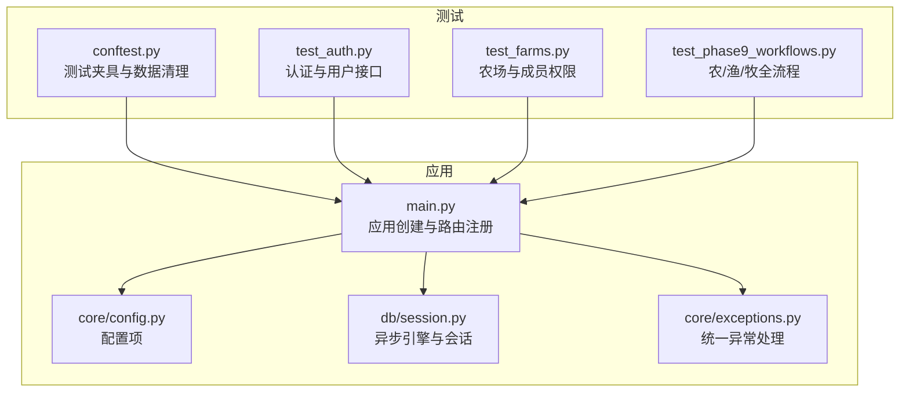
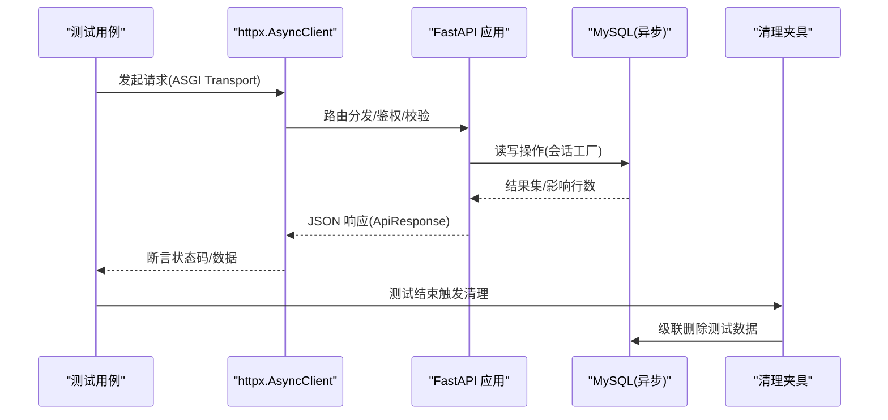
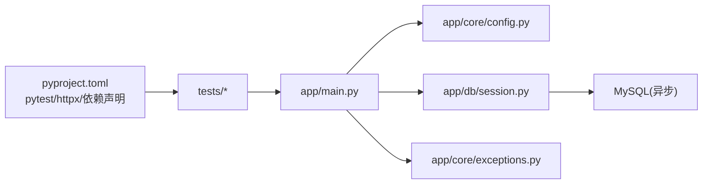

# 测试策略

<cite>
**本文引用的文件**
- [apps/api/tests/conftest.py](file://apps/api/tests/conftest.py)
- [apps/api/pyproject.toml](file://apps/api/pyproject.toml)
- [apps/api/app/main.py](file://apps/api/app/main.py)
- [apps/api/app/core/config.py](file://apps/api/app/core/config.py)
- [apps/api/app/db/session.py](file://apps/api/app/db/session.py)
- [apps/api/app/core/exceptions.py](file://apps/api/app/core/exceptions.py)
- [apps/api/tests/test_auth.py](file://apps/api/tests/test_auth.py)
- [apps/api/tests/test_farms.py](file://apps/api/tests/test_farms.py)
- [apps/api/tests/test_phase9_workflows.py](file://apps/api/tests/test_phase9_workflows.py)
</cite>

## 目录
1. [简介](#简介)
2. [项目结构](#项目结构)
3. [核心组件](#核心组件)
4. [架构总览](#架构总览)
5. [详细组件分析](#详细组件分析)
6. [依赖关系分析](#依赖关系分析)
7. [性能考量](#性能考量)
8. [故障排查指南](#故障排查指南)
9. [结论](#结论)
10. [附录](#附录)

## 简介
本测试策略面向 Pocket Farm 后端 API（FastAPI + SQLAlchemy Async），覆盖单元测试、集成测试与端到端测试的实施方案。重点说明：
- API 接口的测试用例设计（认证、权限、资源 CRUD、业务流）
- 业务逻辑的测试覆盖（农场成员角色、生产周期、作业与收获记录）
- 数据库操作的测试验证（事务隔离、数据清理、迁移环境）
- 测试环境搭建、测试数据管理与执行流程
- 覆盖率要求、性能测试策略与质量保证流程
- 最佳实践与常见问题解决方案

## 项目结构
后端应用位于 apps/api，测试位于 apps/api/tests，使用 pytest 运行；通过 httpx 的 ASGI 传输直接调用 FastAPI 应用实例，避免启动真实 HTTP 服务。数据库为 MySQL（异步驱动 aiomysql），通过环境变量配置连接串与 JWT 密钥。

图表来源
- [apps/api/tests/conftest.py:1-72](file://apps/api/tests/conftest.py#L1-L72)
- [apps/api/app/main.py:1-28](file://apps/api/app/main.py#L1-L28)
- [apps/api/app/core/config.py:1-23](file://apps/api/app/core/config.py#L1-L23)
- [apps/api/app/db/session.py:1-7](file://apps/api/app/db/session.py#L1-L7)
- [apps/api/app/core/exceptions.py:1-88](file://apps/api/app/core/exceptions.py#L1-L88)

章节来源
- [apps/api/pyproject.toml:1-35](file://apps/api/pyproject.toml#L1-L35)
- [apps/api/app/main.py:1-28](file://apps/api/app/main.py#L1-L28)

## 核心组件
- 测试夹具与环境
  - 通过 conftest 设置 DATABASE_URL 与 JWT_SECRET_KEY，确保测试在独立数据库连接下运行。
  - 提供自动清理夹具，按依赖顺序删除用户、农场、地块、生产、作业与收获记录，保证测试幂等与隔离。
- 应用入口与路由
  - main.py 创建 FastAPI 应用并注册健康检查与 v1 路由，生命周期中管理引擎销毁。
- 配置
  - core/config.py 集中管理应用名、调试开关、API 前缀、数据库 URL、JWT 参数与时区等。
- 数据库会话
  - db/session.py 基于 settings.database_url 创建异步引擎与会话工厂，开启 pool_pre_ping 提升健壮性。
- 异常处理
  - core/exceptions.py 统一捕获应用异常、请求校验异常、HTTP 异常与未处理异常，返回标准化 ApiResponse。

章节来源
- [apps/api/tests/conftest.py:1-72](file://apps/api/tests/conftest.py#L1-L72)
- [apps/api/app/main.py:1-28](file://apps/api/app/main.py#L1-L28)
- [apps/api/app/core/config.py:1-23](file://apps/api/app/core/config.py#L1-L23)
- [apps/api/app/db/session.py:1-7](file://apps/api/app/db/session.py#L1-L7)
- [apps/api/app/core/exceptions.py:1-88](file://apps/api/app/core/exceptions.py#L1-L88)

## 架构总览
测试通过 httpx.ASGITransport 直接调用 FastAPI 应用，绕过网络层，提高执行效率与稳定性。测试数据由夹具维护，每个测试结束后自动清理，避免污染。

图表来源
- [apps/api/tests/test_auth.py:13-24](file://apps/api/tests/test_auth.py#L13-L24)
- [apps/api/app/main.py:13-24](file://apps/api/app/main.py#L13-L24)
- [apps/api/app/db/session.py:1-7](file://apps/api/app/db/session.py#L1-L7)
- [apps/api/tests/conftest.py:14-71](file://apps/api/tests/conftest.py#L14-L71)

## 详细组件分析

### 认证与用户接口测试（test_auth.py）
- 目标
  - 验证登录成功时创建或复用用户并返回访问令牌。
  - 验证重复登录返回同一用户。
  - 验证错误验证码返回未授权。
  - 验证手机号格式校验失败返回验证错误。
  - 验证获取当前用户需携带令牌。
  - 验证已认证用户可更新昵称。
- 关键实现要点
  - 使用 ASGI Transport 直接调用 app，避免外部服务。
  - 通过固定测试手机号与验证码完成登录。
  - 断言响应体包含 success/error/data 结构与字段。
- 建议补充
  - 增加并发登录与令牌过期场景。
  - 对敏感字段进行最小化返回断言。

章节来源
- [apps/api/tests/test_auth.py:13-108](file://apps/api/tests/test_auth.py#L13-L108)

### 农场与成员权限测试（test_farms.py）
- 目标
  - 创建农场并自动成为所有者，列表返回正确分页与角色。
  - 非成员无法查看或编辑农场。
  - 管理员不可编辑农场。
  - 所有者/管理员/成员的角色变更与移除权限边界。
  - 最后一名所有者不可离开或被移除。
  - 重复成员与未知成员被拒绝。
- 关键实现要点
  - 封装 login/call/create_farm/add_member 等辅助函数，统一断言与错误处理。
  - 通过 members_by_user_id 校验成员集合变化。
  - 针对越权、冲突、未找到等场景断言错误码。
- 建议补充
  - 增加批量操作与并发修改的成员一致性测试。
  - 增加农场字段更新的部分更新与空值处理。

章节来源
- [apps/api/tests/test_farms.py:17-286](file://apps/api/tests/test_farms.py#L17-L286)

### 农业/渔业/牧业全流程测试（test_phase9_workflows.py）
- 目标
  - 验证从创建农场、地块、开始生产、记录作业、记录收获到结束生产的完整链路。
  - 验证空闲地块接受地块级作业。
  - 验证多轮生产记录相互独立。
  - 验证同时多种生产支持各自选择与地块级作业。
- 关键实现要点
  - 通过 species_id 与 operation_type_ids 动态获取 ID。
  - 使用 start_production/record_operation/record_harvest/end_production 构建工作流。
  - 通过 plot_detail 断言活跃/已结束生产、作业与收获统计。
- 建议补充
  - 增加异常路径（如非法单位、数量负数、跨生产作业）。
  - 增加并发作业与收获的竞态条件测试。

章节来源
- [apps/api/tests/test_phase9_workflows.py:14-342](file://apps/api/tests/test_phase9_workflows.py#L14-L342)

### 测试夹具与数据清理（conftest.py）
- 目标
  - 设置测试数据库连接与 JWT 密钥。
  - 在每个测试后按依赖顺序清理测试产生的数据，确保隔离性与幂等性。
- 关键实现要点
  - 使用 async_session_factory 与 engine.dispose 管理连接。
  - 按 User -> FarmMember -> Plot -> Production -> HarvestRecord/FarmOperation -> Farm -> User 的顺序删除。
- 建议补充
  - 将测试手机号范围外置为配置，便于扩展。
  - 增加回滚机制以应对部分清理失败。

章节来源
- [apps/api/tests/conftest.py:1-72](file://apps/api/tests/conftest.py#L1-L72)

### 应用生命周期与异常处理（main.py, exceptions.py）
- 目标
  - 应用启动时注册异常处理器与路由。
  - 应用关闭时释放数据库引擎。
  - 统一返回 ApiResponse 格式的错误信息。
- 关键实现要点
  - lifespan 中 dispose 引擎。
  - register_exception_handlers 注册四类异常处理器。
- 建议补充
  - 在测试中覆盖各类异常路径，断言错误码与消息。

章节来源
- [apps/api/app/main.py:13-24](file://apps/api/app/main.py#L13-L24)
- [apps/api/app/core/exceptions.py:31-88](file://apps/api/app/core/exceptions.py#L31-L88)

## 依赖关系分析
- 测试框架与工具
  - pytest 用于组织与执行测试。
  - httpx 用于 ASGI 传输调用 FastAPI。
- 应用依赖
  - FastAPI 提供路由与请求处理。
  - SQLAlchemy Async 与 aiomysql 提供异步数据库访问。
  - Pydantic Settings 加载配置。
  - PyJWT 用于令牌签发与校验。
- 配置与环境
  - DATABASE_URL、JWT_SECRET_KEY 等通过环境变量注入。
  - test_login_enabled/test_login_code 可用于测试模式下的便捷登录。

图表来源
- [apps/api/pyproject.toml:1-35](file://apps/api/pyproject.toml#L1-L35)
- [apps/api/app/main.py:1-28](file://apps/api/app/main.py#L1-L28)
- [apps/api/app/core/config.py:1-23](file://apps/api/app/core/config.py#L1-L23)
- [apps/api/app/db/session.py:1-7](file://apps/api/app/db/session.py#L1-L7)
- [apps/api/app/core/exceptions.py:1-88](file://apps/api/app/core/exceptions.py#L1-L88)

章节来源
- [apps/api/pyproject.toml:17-35](file://apps/api/pyproject.toml#L17-L35)

## 性能考量
- 测试执行效率
  - 使用 ASGI Transport 直接调用应用，避免进程启动开销。
  - 数据库连接池启用 pool_pre_ping，减少连接失效导致的重试。
- 数据清理成本
  - 清理夹具按依赖顺序删除，建议在大数据量场景下评估清理耗时。
- 并发与竞争
  - 对作业与收获的并发写入应增加压力测试，关注锁与一致性。
- 建议
  - 引入 pytest-xdist 并行执行测试套件。
  - 对热点接口添加基准测试（如单次请求耗时、吞吐）。

[本节为通用指导，不直接分析具体文件]

## 故障排查指南
- 常见错误与定位
  - 422 验证错误：检查请求体字段类型与必填项，参考统一异常处理器返回的 details。
  - 401 未授权：确认是否携带有效 Bearer Token，检查 JWT 配置。
  - 403 禁止：检查成员角色与权限边界（如管理员不可编辑农场）。
  - 404 未找到：检查资源是否存在或是否属于当前用户。
  - 409 业务冲突：检查重复成员、最后所有者离开等规则。
- 数据库问题
  - 连接失败：核对 DATABASE_URL 与网络连通性。
  - 数据污染：确认清理夹具是否执行，必要时手动清理测试库。
- 日志与断言
  - 在失败用例中打印响应体与错误码，结合 error_codes 定位问题。
  - 对复杂流程拆分断言，逐步缩小范围。

章节来源
- [apps/api/app/core/exceptions.py:31-88](file://apps/api/app/core/exceptions.py#L31-L88)
- [apps/api/tests/test_auth.py:57-87](file://apps/api/tests/test_auth.py#L57-L87)
- [apps/api/tests/test_farms.py:108-286](file://apps/api/tests/test_farms.py#L108-L286)

## 结论
本项目采用以集成测试为主的策略，通过 ASGI 直连与夹具数据清理，高效覆盖认证、权限、资源 CRUD 与核心业务流。建议后续补充：
- 单元测试：对纯函数与服务层方法进行白盒测试，提升细粒度覆盖。
- 端到端测试：在 CI 中启动真实服务与数据库，验证前后端联调。
- 覆盖率门禁：设定最低覆盖率阈值，纳入 PR 检查。
- 性能测试：对关键接口进行压测与回归。
- 质量保障：代码规范扫描、静态分析与安全扫描。

[本节为总结性内容，不直接分析具体文件]

## 附录

### 测试环境与执行流程
- 环境准备
  - 安装依赖：使用 pyproject 中的 dev 组依赖（pytest、httpx、ruff）。
  - 配置环境变量：DATABASE_URL、JWT_SECRET_KEY。
- 执行命令
  - 运行全部测试：pytest
  - 指定目录：pytest tests
  - 并行执行：pytest -n auto（需安装 pytest-xdist）
- 覆盖率
  - 生成报告：pytest --cov=app --cov-report=term-missing
  - 建议阈值：行覆盖率 ≥ 80%，分支覆盖率 ≥ 70%

章节来源
- [apps/api/pyproject.toml:17-35](file://apps/api/pyproject.toml#L17-L35)
- [apps/api/tests/conftest.py:7-11](file://apps/api/tests/conftest.py#L7-L11)

### API 接口测试用例设计要点
- 认证
  - 登录成功/失败、重复登录、令牌缺失、昵称更新。
- 农场与成员
  - 创建、列表、详情、编辑、成员增删改、角色权限、离开规则、冲突与未知成员。
- 生产与工作流
  - 开始生产、记录作业（生产级/地块级）、记录收获、结束生产、多轮与并发场景。
- 错误处理
  - 统一断言 ApiResponse 的 code/message/details，覆盖校验、权限、业务冲突与未找到。

章节来源
- [apps/api/tests/test_auth.py:37-108](file://apps/api/tests/test_auth.py#L37-L108)
- [apps/api/tests/test_farms.py:87-286](file://apps/api/tests/test_farms.py#L87-L286)
- [apps/api/tests/test_phase9_workflows.py:150-342](file://apps/api/tests/test_phase9_workflows.py#L150-L342)

### 数据库操作测试验证
- 事务与隔离
  - 每个测试结束后清理数据，确保隔离性。
- 级联删除
  - 按依赖顺序删除，避免外键约束冲突。
- 连接管理
  - 使用异步引擎与会话工厂，测试结束时释放连接。

章节来源
- [apps/api/tests/conftest.py:14-71](file://apps/api/tests/conftest.py#L14-L71)
- [apps/api/app/db/session.py:1-7](file://apps/api/app/db/session.py#L1-L7)

### 测试最佳实践
- 用例命名清晰，描述行为与预期结果。
- 使用夹具与辅助函数减少重复代码。
- 断言最小必要字段，避免过度耦合。
- 对异常路径进行显式覆盖。
- 保持测试幂等与可重复执行。

[本节为通用指导，不直接分析具体文件]

### 常见问题解决方案
- 测试数据残留
  - 检查清理夹具是否执行，必要时手动清理测试库。
- 认证失败
  - 核对 JWT 配置与测试登录开关。
- 并发冲突
  - 增加重试与退避策略，或在测试中串行化关键步骤。
- 性能瓶颈
  - 使用并行执行与连接池优化，减少 I/O 等待。

章节来源
- [apps/api/tests/conftest.py:14-71](file://apps/api/tests/conftest.py#L14-L71)
- [apps/api/app/core/config.py:10-20](file://apps/api/app/core/config.py#L10-L20)