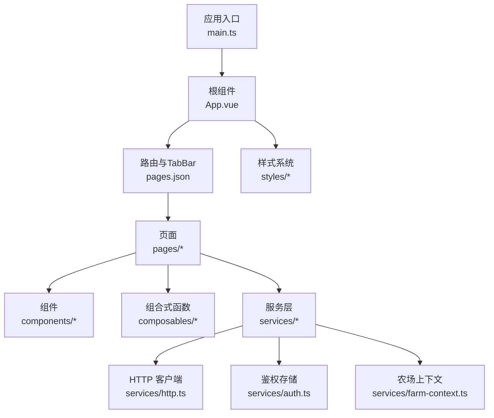
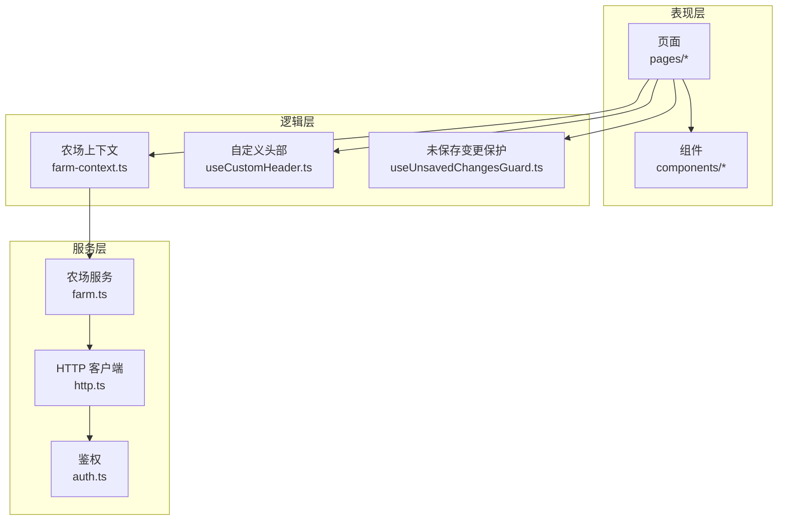
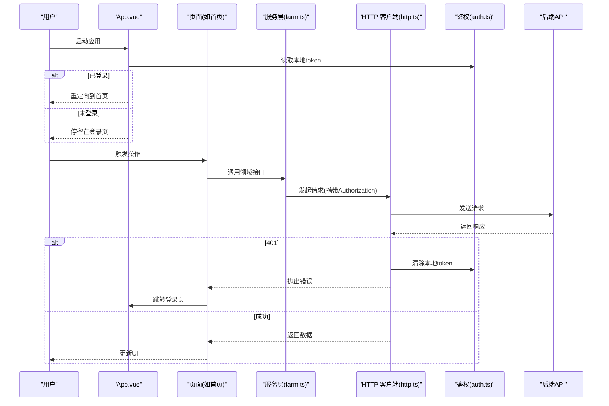
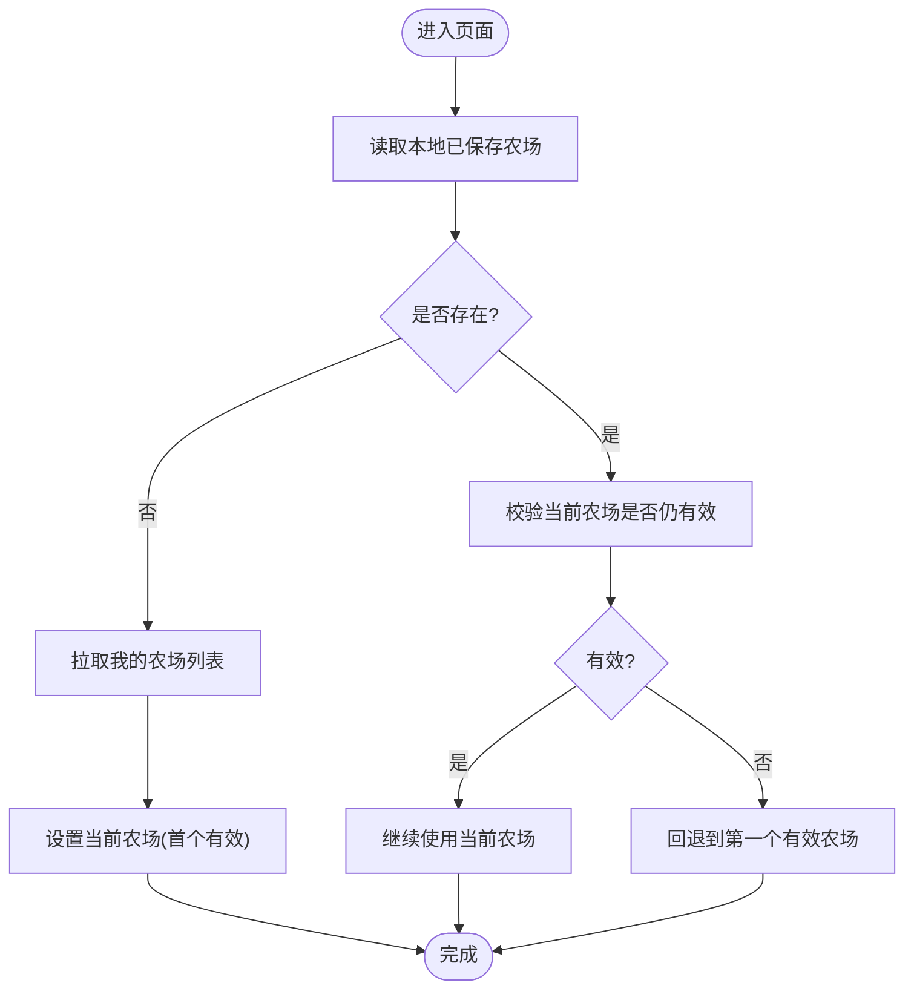
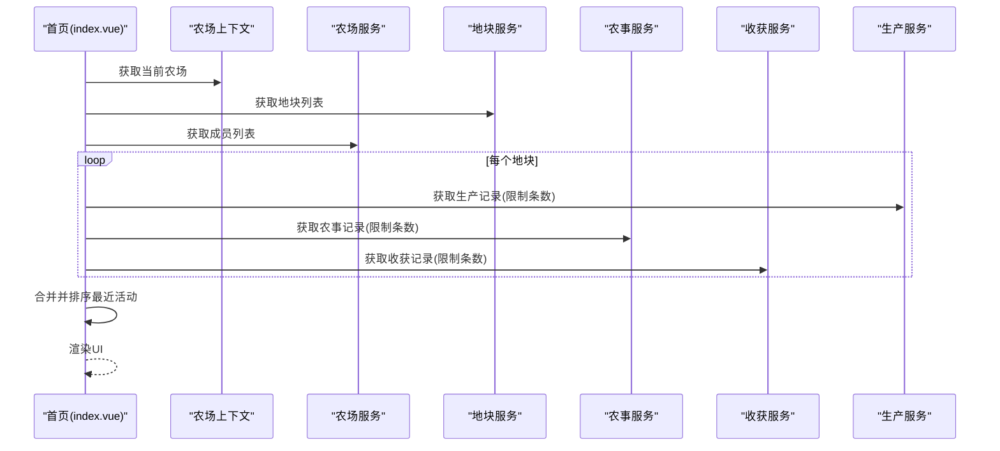
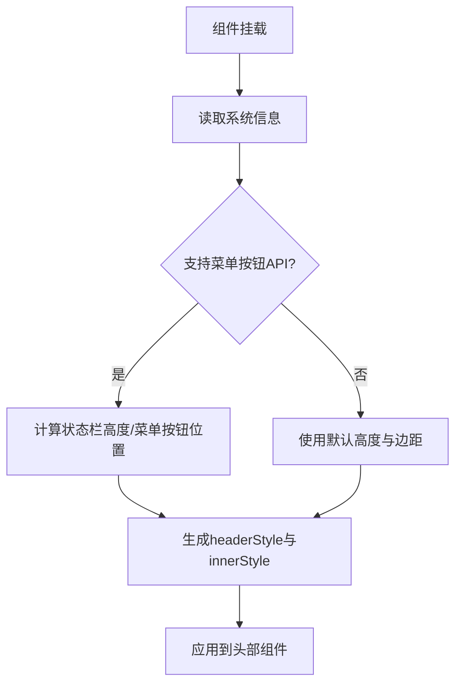
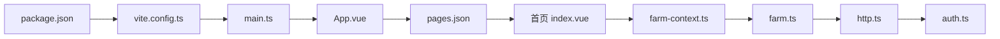

# 前端架构

<cite>
**本文引用的文件**
- [package.json](file://apps/miniapp/package.json)
- [vite.config.ts](file://apps/miniapp/vite.config.ts)
- [main.ts](file://apps/miniapp/src/main.ts)
- [App.vue](file://apps/miniapp/src/App.vue)
- [pages.json](file://apps/miniapp/src/pages.json)
- [http.ts](file://apps/miniapp/src/services/http.ts)
- [auth.ts](file://apps/miniapp/src/services/auth.ts)
- [farm-context.ts](file://apps/miniapp/src/services/farm-context.ts)
- [farm.ts](file://apps/miniapp/src/services/farm.ts)
- [useCustomHeader.ts](file://apps/miniapp/src/composables/useCustomHeader.ts)
- [useUnsavedChangesGuard.ts](file://apps/miniapp/src/composables/useUnsavedChangesGuard.ts)
- [index.vue（首页）](file://apps/miniapp/src/pages/home/index.vue)
- [PfPageHeader.vue](file://apps/miniapp/src/components/PfPageHeader.vue)
- [pocket-farm.scss](file://apps/miniapp/src/styles/pocket-farm.scss)
- [design-tokens.scss](file://apps/miniapp/src/styles/design-tokens.scss)
</cite>

## 目录
1. [简介](#简介)
2. [项目结构](#项目结构)
3. [核心组件](#核心组件)
4. [架构总览](#架构总览)
5. [详细组件分析](#详细组件分析)
6. [依赖关系分析](#依赖关系分析)
7. [性能考虑](#性能考虑)
8. [故障排查指南](#故障排查指南)
9. [结论](#结论)
10. [附录](#附录)

## 简介
本文件为 Pocket Farm 前端（基于 Vue 3 + UniApp）的架构文档，聚焦以下方面：
- 组件化开发与页面组织方式
- 状态管理策略：本地状态与全局共享
- 路由导航与权限控制
- 服务层抽象：HTTP 客户端封装与 API 调用管理
- 响应式设计与多端适配（小程序、H5）
- 架构图与数据流图
- 性能优化策略（代码分割、懒加载、资源优化）

## 项目结构
前端位于 apps/miniapp，采用 UniApp 工程结构：
- 入口与生命周期：main.ts、App.vue
- 路由与 TabBar：pages.json
- 业务页面：src/pages/*
- 可复用组件：src/components/*
- 组合式函数：src/composables/*
- 服务层：src/services/*（HTTP、鉴权、领域服务）
- 样式系统：src/styles/*（设计令牌与通用样式）
- 构建配置：vite.config.ts、package.json

图表来源
- [main.ts:1-9](file://apps/miniapp/src/main.ts#L1-L9)
- [App.vue:1-25](file://apps/miniapp/src/App.vue#L1-L25)
- [pages.json:1-217](file://apps/miniapp/src/pages.json#L1-L217)
- [http.ts:1-106](file://apps/miniapp/src/services/http.ts#L1-L106)
- [auth.ts:1-18](file://apps/miniapp/src/services/auth.ts#L1-L18)
- [farm-context.ts:1-94](file://apps/miniapp/src/services/farm-context.ts#L1-L94)

章节来源
- [package.json:1-73](file://apps/miniapp/package.json#L1-L73)
- [vite.config.ts:1-8](file://apps/miniapp/vite.config.ts#L1-L8)
- [main.ts:1-9](file://apps/miniapp/src/main.ts#L1-L9)
- [App.vue:1-25](file://apps/miniapp/src/App.vue#L1-L25)
- [pages.json:1-217](file://apps/miniapp/src/pages.json#L1-L217)

## 核心组件
- 应用启动与初始化
  - 通过 createSSRApp 创建应用实例并挂载根组件。
  - App.vue 在 onLaunch 时检查登录态，已登录则跳转首页，否则停留在登录页。
- 路由与导航
  - pages.json 集中声明所有页面路径、导航栏样式与 TabBar 列表。
  - 页面内使用 uni.navigateTo / uni.reLaunch 进行导航。
- 自定义头部与多端适配
  - PfPageHeader 提供统一头部，结合 useCustomHeader 计算状态栏高度与胶囊按钮间距，适配微信小程序等平台的导航差异。
- 未保存变更保护
  - useUnsavedChangesGuard 监听表单脏状态，启用平台级“离开前确认”能力，非平台能力时静默降级。

章节来源
- [main.ts:1-9](file://apps/miniapp/src/main.ts#L1-L9)
- [App.vue:1-25](file://apps/miniapp/src/App.vue#L1-L25)
- [pages.json:1-217](file://apps/miniapp/src/pages.json#L1-L217)
- [PfPageHeader.vue:1-130](file://apps/miniapp/src/components/PfPageHeader.vue#L1-L130)
- [useCustomHeader.ts:1-39](file://apps/miniapp/src/composables/useCustomHeader.ts#L1-L39)
- [useUnsavedChangesGuard.ts:1-28](file://apps/miniapp/src/composables/useUnsavedChangesGuard.ts#L1-L28)

## 架构总览
整体分层清晰：
- 表现层：页面与组件负责 UI 渲染与交互
- 逻辑层：组合式函数与上下文管理局部与跨页面状态
- 服务层：按领域划分的服务模块，统一通过 HTTP 客户端访问后端
- 基础设施：构建工具链（Vite + UniApp）、样式系统（SCSS + 设计令牌）

图表来源
- [farm-context.ts:1-94](file://apps/miniapp/src/services/farm-context.ts#L1-L94)
- [farm.ts:1-121](file://apps/miniapp/src/services/farm.ts#L1-L121)
- [http.ts:1-106](file://apps/miniapp/src/services/http.ts#L1-L106)
- [auth.ts:1-18](file://apps/miniapp/src/services/auth.ts#L1-L18)
- [useCustomHeader.ts:1-39](file://apps/miniapp/src/composables/useCustomHeader.ts#L1-L39)
- [useUnsavedChangesGuard.ts:1-28](file://apps/miniapp/src/composables/useUnsavedChangesGuard.ts#L1-L28)

## 详细组件分析

### 认证与鉴权流程
- 启动阶段：App.vue 在 onLaunch 中读取本地 token，若存在则直接跳转到首页；否则进入登录流程。
- 请求拦截：HTTP 客户端在每次请求时自动附加 Authorization 头；当收到 401 时清除本地 token。
- 页面级鉴权：页面在发起请求失败且返回 401 时，主动清理 token 并跳转登录页。

图表来源
- [App.vue:1-25](file://apps/miniapp/src/App.vue#L1-L25)
- [http.ts:1-106](file://apps/miniapp/src/services/http.ts#L1-L106)
- [auth.ts:1-18](file://apps/miniapp/src/services/auth.ts#L1-L18)
- [index.vue（首页）:164-203](file://apps/miniapp/src/pages/home/index.vue#L164-L203)

章节来源
- [App.vue:1-25](file://apps/miniapp/src/App.vue#L1-L25)
- [http.ts:1-106](file://apps/miniapp/src/services/http.ts#L1-L106)
- [auth.ts:1-18](file://apps/miniapp/src/services/auth.ts#L1-L18)
- [index.vue（首页）:159-162](file://apps/miniapp/src/pages/home/index.vue#L159-L162)

### 农场上下文（全局状态共享）
- 职责：维护当前选中的农场信息，持久化到本地存储，并在可用农场列表变化时进行同步回退。
- 数据结构：FarmSummary 包含 id、name、region、role 等摘要字段。
- 关键方法：
  - selectFarm：选择农场并持久化
  - syncAvailableFarms：根据服务端返回的可用农场列表，保持当前农场有效或回退
  - refreshFromApi：从服务端刷新农场列表并同步
  - clearFarm：清空上下文

图表来源
- [farm-context.ts:1-94](file://apps/miniapp/src/services/farm-context.ts#L1-L94)
- [farm.ts:1-121](file://apps/miniapp/src/services/farm.ts#L1-L121)

章节来源
- [farm-context.ts:1-94](file://apps/miniapp/src/services/farm-context.ts#L1-L94)
- [farm.ts:1-121](file://apps/miniapp/src/services/farm.ts#L1-L121)

### 首页仪表盘数据聚合
- 目标：展示最近动态（农事记录与收获记录），并聚合地块维度数据。
- 数据源：地块列表、成员列表、生产记录、农事记录、收获记录。
- 并发策略：使用 Promise.all 并行获取各数据源，减少首屏等待时间。
- 错误处理：捕获 401 时跳转登录；其他错误显示重试提示。

图表来源
- [index.vue（首页）:164-203](file://apps/miniapp/src/pages/home/index.vue#L164-L203)

章节来源
- [index.vue（首页）:164-203](file://apps/miniapp/src/pages/home/index.vue#L164-L203)

### 自定义头部与多端适配
- 功能：为微信小程序预留状态栏和胶囊按钮空间，H5 等平台使用安全默认值。
- 实现：onMounted 时读取系统信息与菜单按钮边界，计算内容高度与右侧安全边距。
- 组件集成：PfPageHeader 通过 useCustomHeader 注入 headerStyle 与 headerInnerStyle，保证在不同平台下布局一致。

图表来源
- [useCustomHeader.ts:1-39](file://apps/miniapp/src/composables/useCustomHeader.ts#L1-L39)
- [PfPageHeader.vue:1-130](file://apps/miniapp/src/components/PfPageHeader.vue#L1-L130)

章节来源
- [useCustomHeader.ts:1-39](file://apps/miniapp/src/composables/useCustomHeader.ts#L1-L39)
- [PfPageHeader.vue:1-130](file://apps/miniapp/src/components/PfPageHeader.vue#L1-L130)

### 未保存变更保护
- 场景：用户在表单编辑后尝试离开页面，需提示确认。
- 机制：监听 dirty 状态，开启平台级“离开前确认”，卸载时关闭。
- 降级：不支持的平台静默忽略，不影响用户体验。

章节来源
- [useUnsavedChangesGuard.ts:1-28](file://apps/miniapp/src/composables/useUnsavedChangesGuard.ts#L1-L28)

## 依赖关系分析
- 构建与运行
  - Vite + @dcloudio/vite-plugin-uni 插件驱动开发构建
  - package.json 提供多端开发与构建脚本
- 运行时依赖
  - Vue 3 作为框架
  - uni-app 生态组件库 uv-ui 提供丰富 UI 组件
- 内部依赖
  - 页面依赖服务层，服务层依赖 HTTP 客户端与鉴权模块
  - 上下文模块依赖领域服务以刷新数据

图表来源
- [package.json:1-73](file://apps/miniapp/package.json#L1-L73)
- [vite.config.ts:1-8](file://apps/miniapp/vite.config.ts#L1-L8)
- [main.ts:1-9](file://apps/miniapp/src/main.ts#L1-L9)
- [App.vue:1-25](file://apps/miniapp/src/App.vue#L1-L25)
- [pages.json:1-217](file://apps/miniapp/src/pages.json#L1-L217)
- [index.vue（首页）:1-300](file://apps/miniapp/src/pages/home/index.vue#L1-L300)
- [farm-context.ts:1-94](file://apps/miniapp/src/services/farm-context.ts#L1-L94)
- [farm.ts:1-121](file://apps/miniapp/src/services/farm.ts#L1-L121)
- [http.ts:1-106](file://apps/miniapp/src/services/http.ts#L1-L106)
- [auth.ts:1-18](file://apps/miniapp/src/services/auth.ts#L1-L18)

章节来源
- [package.json:1-73](file://apps/miniapp/package.json#L1-L73)
- [vite.config.ts:1-8](file://apps/miniapp/vite.config.ts#L1-L8)
- [main.ts:1-9](file://apps/miniapp/src/main.ts#L1-L9)
- [App.vue:1-25](file://apps/miniapp/src/App.vue#L1-L25)
- [pages.json:1-217](file://apps/miniapp/src/pages.json#L1-L217)

## 性能考虑
- 并发请求与最小化首屏数据量
  - 首页使用 Promise.all 并行获取地块、成员、生产、农事、收获数据，缩短首屏等待时间。
  - 对生产、农事、收获列表限制返回条数，避免一次性加载过多数据。
- 代码分割与按需加载
  - 基于 UniApp 的页面级路由，天然具备页面级代码分割能力。
  - 合理使用 uni.navigateTo 延迟加载非首屏页面。
- 资源优化
  - 使用 SCSS 与设计令牌统一管理样式变量，减少重复定义与维护成本。
  - 图片资源按需放置于 static 目录，避免打包体积膨胀。
- 状态与缓存
  - 农场上下文将当前农场信息持久化至本地存储，减少重复选择与网络请求。
  - 鉴权 token 本地缓存，避免重复登录。
- 构建优化
  - Vite 快速冷启动与增量编译，提升开发体验。
  - 多端构建脚本便于针对不同平台进行产物优化。

[本节为通用指导，不直接分析具体文件]

## 故障排查指南
- 401 未授权
  - 现象：请求返回 401，页面跳转登录。
  - 原因：token 过期或缺失；HTTP 客户端会在 401 时清除本地 token。
  - 处理：确保登录流程正确写入 token；页面捕获 401 后跳转登录。
- 网络异常
  - 现象：请求失败，提示网络连接失败。
  - 原因：设备无网络或后端不可达。
  - 处理：提示用户检查网络并重试。
- 表单未保存离开
  - 现象：离开页面时弹出确认框。
  - 原因：启用了 useUnsavedChangesGuard，dirty 为 true。
  - 处理：提交或放弃更改后再离开。
- 头部布局错位
  - 现象：微信小程序顶部内容与状态栏重叠。
  - 原因：未正确使用 useCustomHeader 计算高度与边距。
  - 处理：在自定义头部组件中引入并使用该组合式函数。

章节来源
- [http.ts:1-106](file://apps/miniapp/src/services/http.ts#L1-L106)
- [auth.ts:1-18](file://apps/miniapp/src/services/auth.ts#L1-L18)
- [useUnsavedChangesGuard.ts:1-28](file://apps/miniapp/src/composables/useUnsavedChangesGuard.ts#L1-L28)
- [useCustomHeader.ts:1-39](file://apps/miniapp/src/composables/useCustomHeader.ts#L1-L39)

## 结论
Pocket Farm 前端采用清晰的层次化架构：页面与组件负责呈现，组合式函数与上下文管理状态，服务层统一封装 HTTP 与领域逻辑。通过 pages.json 集中管理路由与 TabBar，结合 App.vue 的生命周期实现基础权限控制。样式系统基于 SCSS 与设计令牌，保障多端一致的视觉体验。性能方面利用并发请求、页面级代码分割与本地缓存优化首屏与交互体验。整体方案兼顾可维护性与扩展性，适合在多端环境下持续迭代。

## 附录
- 设计令牌与样式
  - design-tokens.scss：定义原始色阶、语义色、间距、圆角与阴影等设计变量。
  - pocket-farm.scss：基于设计令牌提供通用页面容器、卡片、列表等样式类。
- 组件与页面示例
  - PfPageHeader：统一头部组件，支持标题、副标题、返回按钮与多端适配。
  - 首页 index.vue：演示数据聚合、错误处理与导航流程。

章节来源
- [design-tokens.scss:1-74](file://apps/miniapp/src/styles/design-tokens.scss#L1-L74)
- [pocket-farm.scss:1-78](file://apps/miniapp/src/styles/pocket-farm.scss#L1-L78)
- [PfPageHeader.vue:1-130](file://apps/miniapp/src/components/PfPageHeader.vue#L1-L130)
- [index.vue（首页）:1-300](file://apps/miniapp/src/pages/home/index.vue#L1-L300)