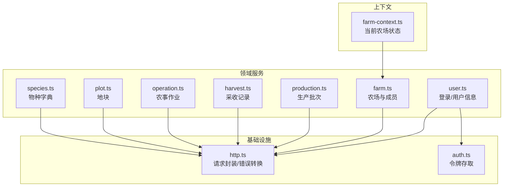
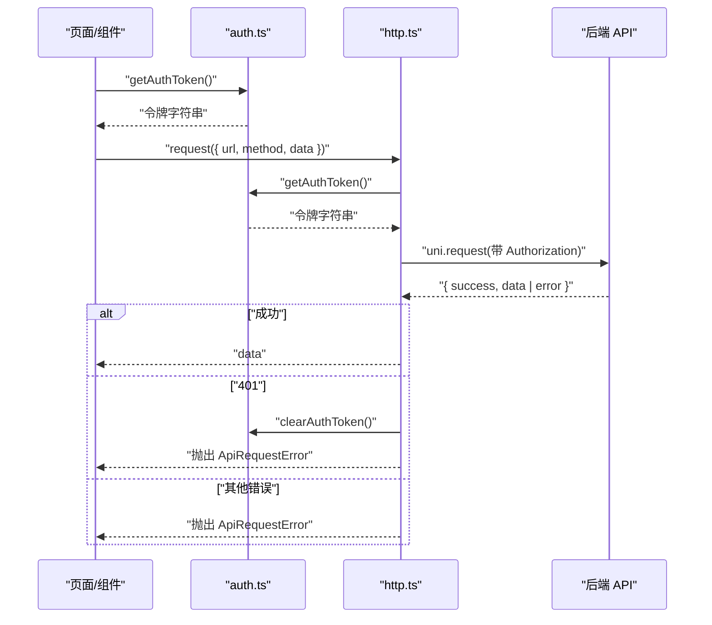
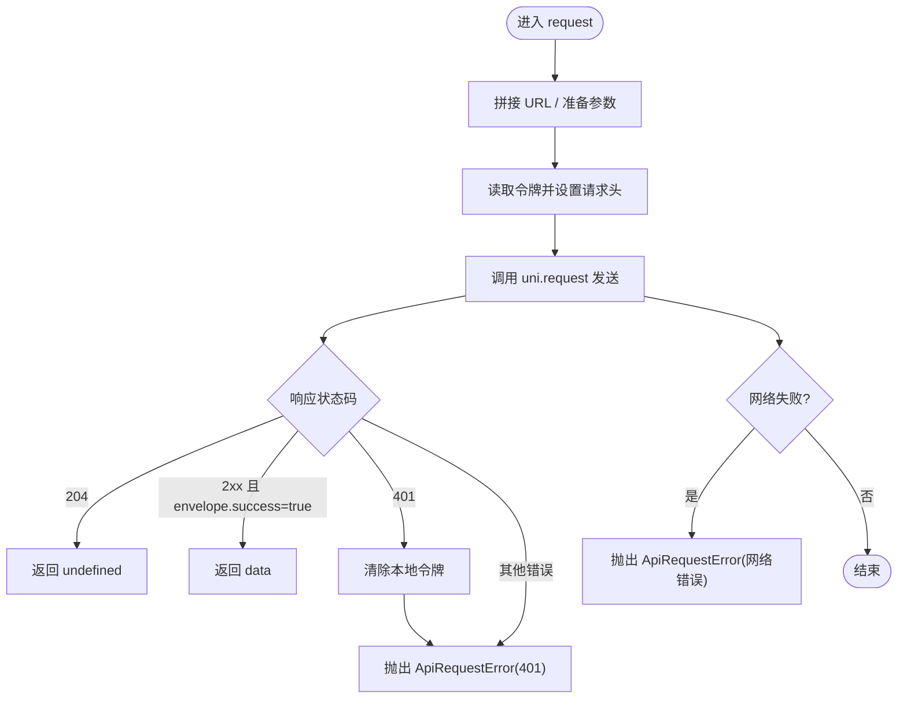
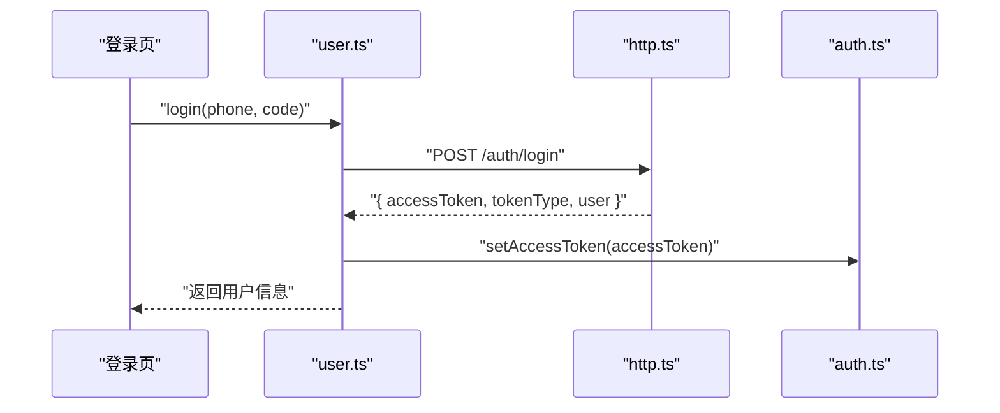
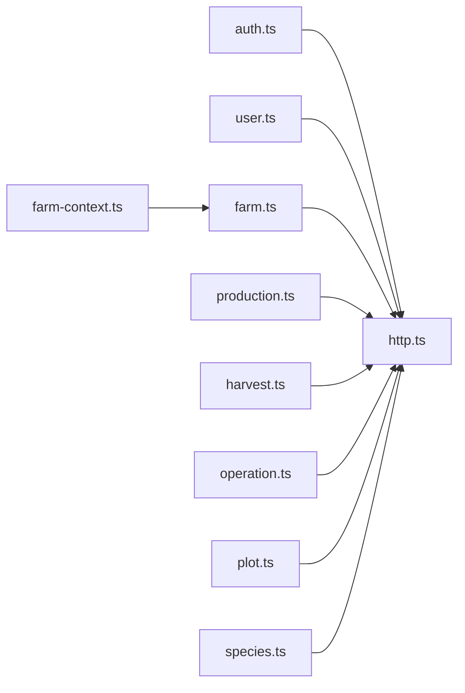

# 服务层

<cite>
**本文引用的文件**
- [http.ts](file://apps/miniapp/src/services/http.ts)
- [auth.ts](file://apps/miniapp/src/services/auth.ts)
- [user.ts](file://apps/miniapp/src/services/user.ts)
- [farm.ts](file://apps/miniapp/src/services/farm.ts)
- [production.ts](file://apps/miniapp/src/services/production.ts)
- [harvest.ts](file://apps/miniapp/src/services/harvest.ts)
- [operation.ts](file://apps/miniapp/src/services/operation.ts)
- [plot.ts](file://apps/miniapp/src/services/plot.ts)
- [species.ts](file://apps/miniapp/src/services/species.ts)
- [farm-context.ts](file://apps/miniapp/src/services/farm-context.ts)
</cite>

## 目录
1. [简介](#简介)
2. [项目结构](#项目结构)
3. [核心组件](#核心组件)
4. [架构总览](#架构总览)
5. [详细组件分析](#详细组件分析)
6. [依赖关系分析](#依赖关系分析)
7. [性能与可靠性建议](#性能与可靠性建议)
8. [故障排查指南](#故障排查指南)
9. [结论](#结论)
10. [附录：API 调用最佳实践](#附录api-调用最佳实践)

## 简介
本文件面向 Pocket Farm 小程序前端的服务层，聚焦基于 TypeScript 的 HTTP 客户端封装、认证令牌管理、业务服务模块的组织方式与错误处理策略。文档将解释请求拦截器（通过 uni.request 封装实现）的请求头设置、统一响应信封解析、错误码映射与用户提示；说明认证服务的令牌存取与登录流程；梳理 farm、production、harvest、operation、plot、species 等业务服务的方法定义与数据模型；并提供可扩展的集成模式与最佳实践，包括重试、超时与并发控制建议。

## 项目结构
服务层位于 apps/miniapp/src/services 目录下，采用“能力域 + 基础设施”的分层组织：
- 基础设施：http.ts（HTTP 请求封装）、auth.ts（令牌存取）
- 领域服务：farm.ts、production.ts、harvest.ts、operation.ts、plot.ts、species.ts、user.ts
- 上下文：farm-context.ts（当前农场选择与持久化）

图表来源
- [http.ts:1-106](file://apps/miniapp/src/services/http.ts#L1-L106)
- [auth.ts:1-18](file://apps/miniapp/src/services/auth.ts#L1-L18)
- [user.ts:1-42](file://apps/miniapp/src/services/user.ts#L1-L42)
- [farm.ts:1-121](file://apps/miniapp/src/services/farm.ts#L1-L121)
- [production.ts:1-121](file://apps/miniapp/src/services/production.ts#L1-L121)
- [harvest.ts:1-92](file://apps/miniapp/src/services/harvest.ts#L1-L92)
- [operation.ts:1-91](file://apps/miniapp/src/services/operation.ts#L1-L91)
- [plot.ts:1-85](file://apps/miniapp/src/services/plot.ts#L1-L85)
- [species.ts:1-34](file://apps/miniapp/src/services/species.ts#L1-L34)
- [farm-context.ts:1-94](file://apps/miniapp/src/services/farm-context.ts#L1-L94)

章节来源
- [http.ts:1-106](file://apps/miniapp/src/services/http.ts#L1-L106)
- [auth.ts:1-18](file://apps/miniapp/src/services/auth.ts#L1-L18)
- [user.ts:1-42](file://apps/miniapp/src/services/user.ts#L1-L42)
- [farm.ts:1-121](file://apps/miniapp/src/services/farm.ts#L1-L121)
- [production.ts:1-121](file://apps/miniapp/src/services/production.ts#L1-L121)
- [harvest.ts:1-92](file://apps/miniapp/src/services/harvest.ts#L1-L92)
- [operation.ts:1-91](file://apps/miniapp/src/services/operation.ts#L1-L91)
- [plot.ts:1-85](file://apps/miniapp/src/services/plot.ts#L1-L85)
- [species.ts:1-34](file://apps/miniapp/src/services/species.ts#L1-L34)
- [farm-context.ts:1-94](file://apps/miniapp/src/services/farm-context.ts#L1-L94)

## 核心组件
- HTTP 请求封装（http.ts）
  - 统一基址：从环境变量读取并规范化尾部斜杠
  - 请求头：自动注入 Authorization Bearer 令牌
  - 响应信封：期望后端返回 { success, data, error } 的统一格式
  - 成功分支：2xx 且 envelope.success 为真且 data 非空时返回 data；204 直接返回 undefined
  - 失败分支：构造 ApiRequestError，携带 code、statusCode、details，便于上层统一处理
  - 网络失败：fail 回调中抛出带 errMsg 的错误
  - 鉴权失效：401 时清除本地令牌
- 认证令牌（auth.ts）
  - 提供 get/set/clear/has 四种操作，使用 uni 同步存储
- 用户服务（user.ts）
  - 登录成功后写入令牌
  - 获取当前用户信息、更新昵称等

章节来源
- [http.ts:1-106](file://apps/miniapp/src/services/http.ts#L1-L106)
- [auth.ts:1-18](file://apps/miniapp/src/services/auth.ts#L1-L18)
- [user.ts:1-42](file://apps/miniapp/src/services/user.ts#L1-L42)

## 架构总览
服务层以 http.ts 为中心，所有业务服务通过 request<T>() 发起网络请求，统一处理认证、错误与响应体。认证服务负责令牌生命周期管理。业务服务按领域划分，方法命名遵循 RESTful 风格，类型定义清晰，便于页面层消费。

图表来源
- [http.ts:1-106](file://apps/miniapp/src/services/http.ts#L1-L106)
- [auth.ts:1-18](file://apps/miniapp/src/services/auth.ts#L1-L18)
- [user.ts:1-42](file://apps/miniapp/src/services/user.ts#L1-L42)

## 详细组件分析

### HTTP 客户端与错误处理（http.ts）
- 设计要点
  - 统一基址与环境变量接入，避免硬编码
  - 自动附加 Authorization 请求头，提升安全性与一致性
  - 统一信封解析，屏蔽后端差异，简化上层逻辑
  - 明确 204 无内容场景，避免上层误判
  - 统一错误对象，包含 code、message、statusCode、details，便于全局错误展示与埋点
- 关键流程
  - 构建请求 -> 附加令牌 -> 发送 -> 解析信封 -> 成功返回或抛出错误 -> 401 清理令牌

图表来源
- [http.ts:1-106](file://apps/miniapp/src/services/http.ts#L1-L106)

章节来源
- [http.ts:1-106](file://apps/miniapp/src/services/http.ts#L1-L106)

### 认证服务（auth.ts）
- 职责：集中管理访问令牌的生命周期（获取、设置、清空、存在性判断）
- 存储：使用 uni 同步存储，保证跨模块一致性与简单性
- 扩展点：可替换为异步存储或加密存储，不影响上层调用

章节来源
- [auth.ts:1-18](file://apps/miniapp/src/services/auth.ts#L1-L18)

### 用户服务（user.ts）
- 登录：调用后端登录接口，成功后写入令牌，供后续请求自动携带
- 当前用户：获取当前用户信息，用于头像、昵称等展示
- 更新用户：支持修改昵称等个人信息

图表来源
- [user.ts:1-42](file://apps/miniapp/src/services/user.ts#L1-L42)
- [http.ts:1-106](file://apps/miniapp/src/services/http.ts#L1-L106)
- [auth.ts:1-18](file://apps/miniapp/src/services/auth.ts#L1-L18)

章节来源
- [user.ts:1-42](file://apps/miniapp/src/services/user.ts#L1-L42)

### 农场服务（farm.ts）
- 模型：Farm、FarmMember、分页容器 FarmPage/FarmMemberPage
- 能力：查询我的农场、创建/更新农场、查询农场成员、添加/更新/移除成员、退出农场
- 设计：每个方法对应一个 REST 资源操作，参数与返回值类型严格约束

章节来源
- [farm.ts:1-121](file://apps/miniapp/src/services/farm.ts#L1-L121)

### 生产批次服务（production.ts）
- 模型：Production、ProductionInput、ProductionUpdateInput、EndProductionInput、分页容器
- 能力：按地块查询生产批次（支持状态过滤）、创建/更新/删除/结束生产批次
- 辅助：toSpecies 将生产批次中的物种信息转换为物种模型，便于复用

章节来源
- [production.ts:1-121](file://apps/miniapp/src/services/production.ts#L1-L121)

### 采收服务（harvest.ts）
- 模型：HarvestRecord、HarvestInput、HarvestUpdateInput、分页容器
- 能力：按生产批次/地块查询采收记录、创建/更新/删除采收记录

章节来源
- [harvest.ts:1-92](file://apps/miniapp/src/services/harvest.ts#L1-L92)

### 农事作业服务（operation.ts）
- 模型：OperationType、FarmOperation、OperationInput、OperationUpdateInput、分页容器
- 能力：查询作业类型、按地块查询作业、创建/更新/删除作业

章节来源
- [operation.ts:1-91](file://apps/miniapp/src/services/operation.ts#L1-L91)

### 地块服务（plot.ts）
- 模型：Plot、PlotDetail、PlotInput、分页容器
- 能力：按农场查询地块、创建/更新/查询地块、获取地块详情（含活跃/已结束生产、作业、采收汇总）

章节来源
- [plot.ts:1-85](file://apps/miniapp/src/services/plot.ts#L1-L85)

### 物种服务（species.ts）
- 模型：Species、SpeciesQuery、分页容器
- 能力：按行业、关键词分页查询物种，用于下拉选择等场景

章节来源
- [species.ts:1-34](file://apps/miniapp/src/services/species.ts#L1-L34)

### 农场上下文（farm-context.ts）
- 职责：维护当前选中的农场，支持选择、同步可用农场列表、刷新、清除
- 持久化：将当前农场摘要保存到本地存储，应用重启后恢复
- 计算属性：当前农场名称、是否存在当前农场

章节来源
- [farm-context.ts:1-94](file://apps/miniapp/src/services/farm-context.ts#L1-L94)

## 依赖关系分析
- 低耦合：业务服务仅依赖 http.ts 提供的 request 函数，不直接感知网络细节
- 高内聚：每个业务服务围绕单一领域聚合方法与类型定义
- 认证解耦：http.ts 通过 auth.ts 获取令牌，业务服务无需关心认证细节
- 上下文独立：farm-context.ts 依赖 farm.ts 获取数据，同时管理本地状态

图表来源
- [http.ts:1-106](file://apps/miniapp/src/services/http.ts#L1-L106)
- [auth.ts:1-18](file://apps/miniapp/src/services/auth.ts#L1-L18)
- [user.ts:1-42](file://apps/miniapp/src/services/user.ts#L1-L42)
- [farm.ts:1-121](file://apps/miniapp/src/services/farm.ts#L1-L121)
- [production.ts:1-121](file://apps/miniapp/src/services/production.ts#L1-L121)
- [harvest.ts:1-92](file://apps/miniapp/src/services/harvest.ts#L1-L92)
- [operation.ts:1-91](file://apps/miniapp/src/services/operation.ts#L1-L91)
- [plot.ts:1-85](file://apps/miniapp/src/services/plot.ts#L1-L85)
- [species.ts:1-34](file://apps/miniapp/src/services/species.ts#L1-L34)
- [farm-context.ts:1-94](file://apps/miniapp/src/services/farm-context.ts#L1-L94)

## 性能与可靠性建议
- 请求重试
  - 建议在 http.ts 外层包装通用重试策略，对幂等 GET 请求进行有限次重试，指数退避
  - 区分网络错误与服务端错误，仅对可重试错误执行重试
- 超时处理
  - 在 request 中为 uni.request 配置合理的 timeout，避免长时间阻塞
  - 超时视为网络错误，触发重试或降级提示
- 并发控制
  - 对高频列表加载使用防抖/节流，减少重复请求
  - 对同一资源的并发写操作进行队列化，避免冲突
- 缓存策略
  - 对只读数据（如物种、作业类型）增加内存缓存与本地缓存，结合版本号或时间戳失效
- 错误分级
  - 根据 code 分类：网络错误、服务端业务错误、认证错误
  - 认证错误统一跳转登录；业务错误展示友好提示；网络错误提供重试入口

[本节为通用建议，不直接分析具体文件]

## 故障排查指南
- 常见问题定位
  - 401 未授权：检查是否已登录、令牌是否过期；http.ts 会在 401 时清除本地令牌
  - 网络失败：检查设备网络、域名白名单、代理配置；错误消息来自 uni.request fail 回调
  - 业务错误：查看 ApiRequestError.code 与 message，定位后端返回的具体错误
- 调试步骤
  - 打印请求 URL、Method、Header、Data
  - 打印响应信封，确认 success/data/error 字段
  - 校验后端契约是否符合预期（例如 204 无内容、错误结构）
- 日志与埋点
  - 在 request 中记录关键指标：耗时、状态码、错误码
  - 对 401 与网络失败进行统计，辅助定位问题

章节来源
- [http.ts:1-106](file://apps/miniapp/src/services/http.ts#L1-L106)

## 结论
Pocket Farm 前端服务层通过统一的 HTTP 封装与清晰的领域服务划分，实现了高内聚、低耦合的可维护架构。http.ts 提供一致的请求/响应/错误处理，auth.ts 管理令牌生命周期，各业务服务专注于领域建模与 API 映射。在此基础上，可通过重试、超时、缓存与并发控制进一步增强鲁棒性与性能。

[本节为总结性内容，不直接分析具体文件]

## 附录：API 调用最佳实践
- 统一错误处理
  - 捕获 ApiRequestError，依据 code 与 statusCode 决定用户提示与后续动作
  - 对 401 引导重新登录；对业务错误展示具体原因；对网络错误提供重试
- 请求重试
  - 对幂等 GET 请求实施有限次重试与指数退避
  - 对 POST/PATCH/DELETE 谨慎重试，必要时引入幂等键
- 超时与取消
  - 为长列表或复杂查询设置合理超时
  - 页面离开时取消未完成请求，避免无效渲染
- 并发控制
  - 列表滚动加载使用虚拟滚动与分页合并
  - 表单提交防重复点击，避免重复请求
- 扩展第三方服务
  - 新增服务时沿用 request<T>() 模式，保持类型安全与错误一致
  - 如需不同基址或鉴权，可在 http.ts 中扩展多实例或中间件

[本节为通用指导，不直接分析具体文件]