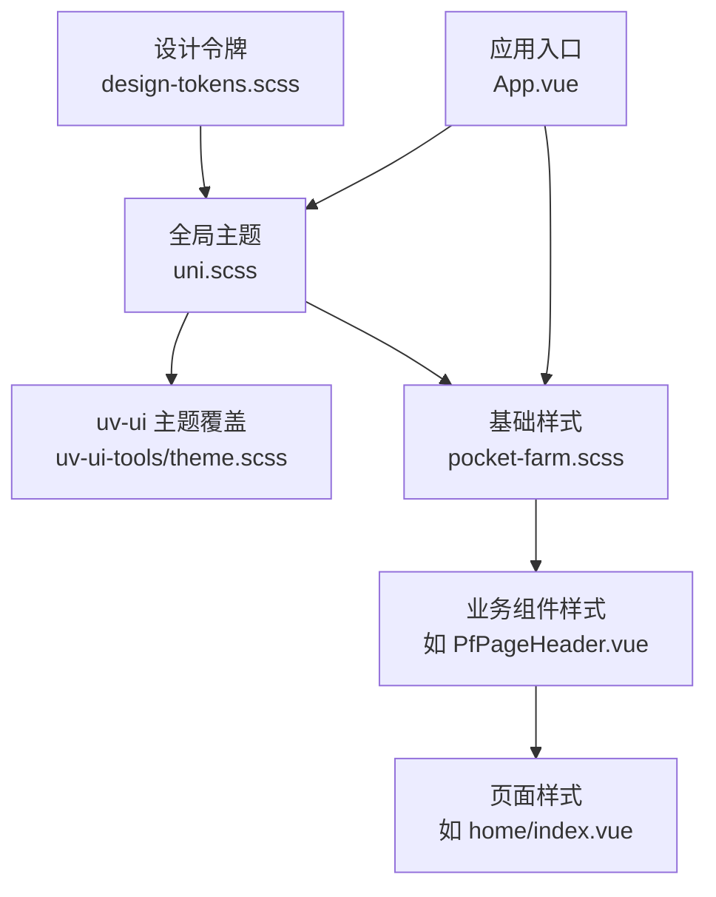
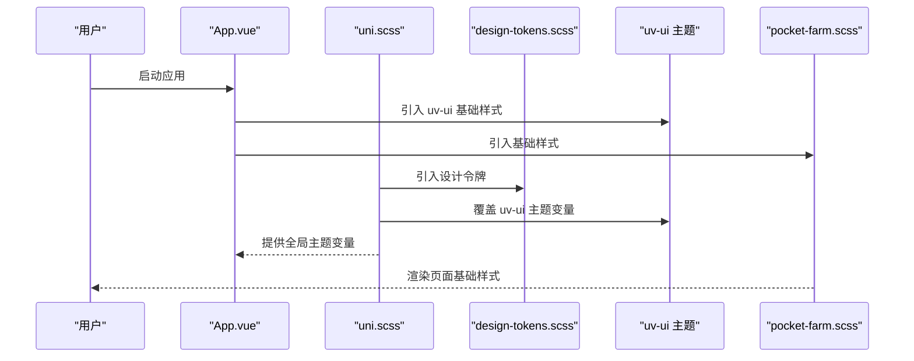
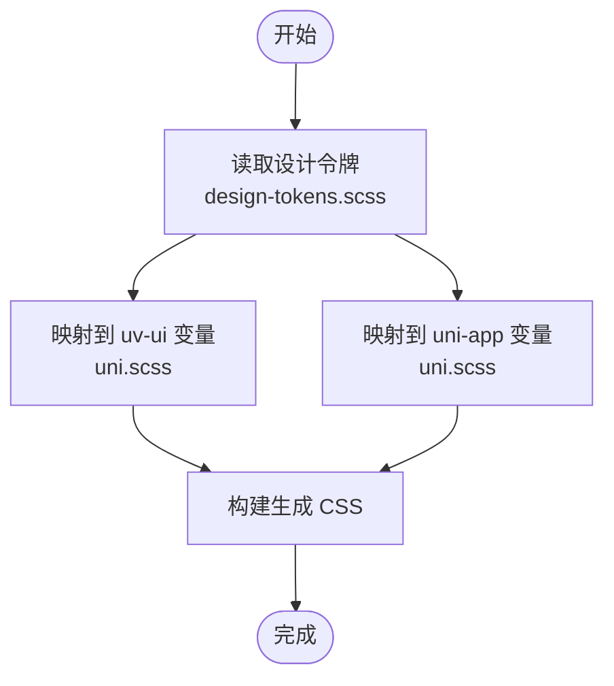
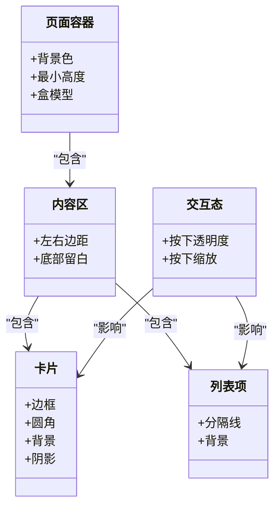
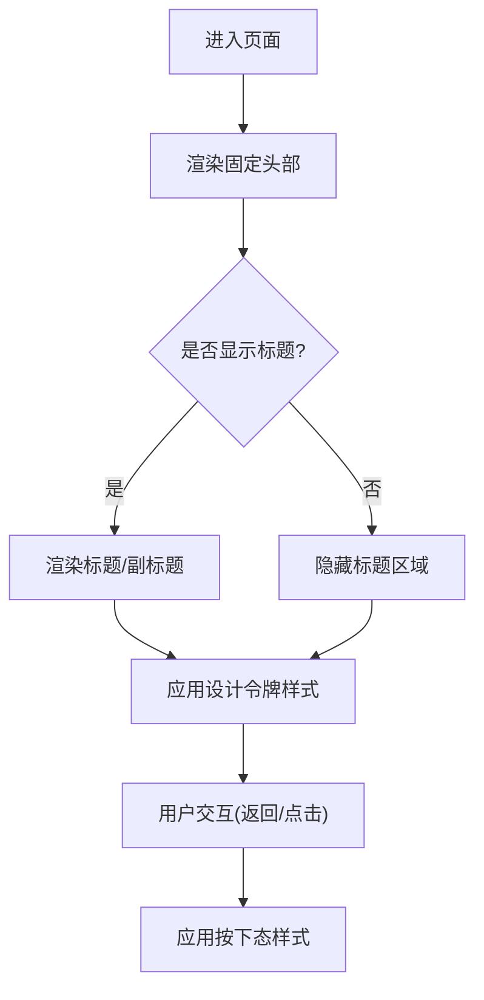
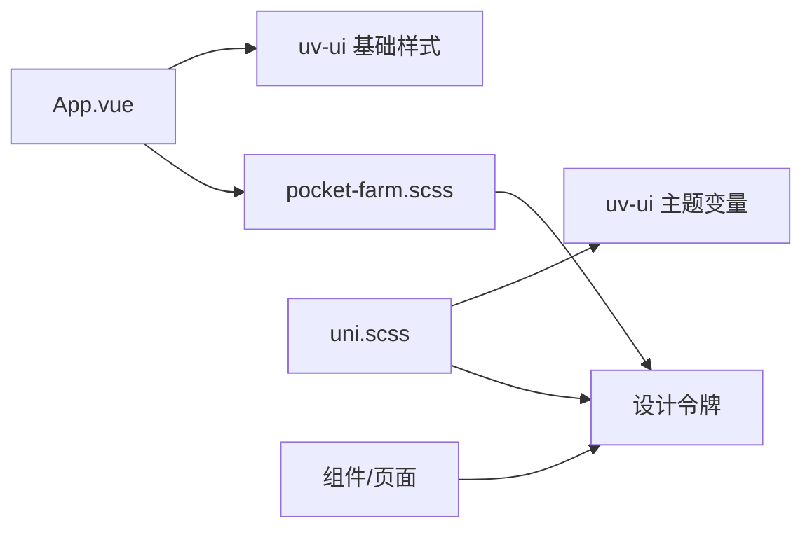

# 样式与主题

<cite>
**本文引用的文件**
- [design-tokens.scss](file://apps/miniapp/src/styles/design-tokens.scss)
- [pocket-farm.scss](file://apps/miniapp/src/styles/pocket-farm.scss)
- [uni.scss](file://apps/miniapp/src/uni.scss)
- [theme.scss](file://apps/miniapp/src/uni_modules/uv-ui-tools/theme.scss)
- [index.scss](file://apps/miniapp/src/uni_modules/uv-ui-tools/index.scss)
- [App.vue](file://apps/miniapp/src/App.vue)
- [PfPageHeader.vue](file://apps/miniapp/src/components/PfPageHeader.vue)
- [home/index.vue](file://apps/miniapp/src/pages/home/index.vue)
- [package.json](file://apps/miniapp/package.json)
</cite>

## 目录
1. [简介](#简介)
2. [项目结构](#项目结构)
3. [核心组件](#核心组件)
4. [架构总览](#架构总览)
5. [详细组件分析](#详细组件分析)
6. [依赖关系分析](#依赖关系分析)
7. [性能考虑](#性能考虑)
8. [故障排查指南](#故障排查指南)
9. [结论](#结论)
10. [附录](#附录)

## 简介
本文件为 Pocket Farm 小程序前端样式系统的权威文档，聚焦基于 SCSS 的样式架构、设计令牌（design tokens）管理、主题系统实现、响应式策略、样式组织原则、与 uv-ui 组件库的主题定制方法，以及品牌色系与暗色模式的扩展方案。目标是帮助开发者在多平台（小程序与 H5）上保持一致、可维护且高性能的视觉体验。

## 项目结构
样式体系围绕“设计令牌 → 全局主题 → 基础样式 → 组件样式”的分层组织：
- 设计令牌：集中定义原始色阶、语义色、间距、圆角、阴影、动效时长等。
- 全局主题：将设计令牌映射到 uni-app 和 uv-ui 的变量，统一入口在 uni.scss。
- 基础样式：页面容器、卡片、列表、交互态等通用样式。
- 组件样式：业务组件与页面级样式按需引入，遵循 BEM 命名约定。

图表来源
- [design-tokens.scss:1-74](file://apps/miniapp/src/styles/design-tokens.scss#L1-L74)
- [uni.scss:15-50](file://apps/miniapp/src/uni.scss#L15-L50)
- [theme.scss:1-43](file://apps/miniapp/src/uni_modules/uv-ui-tools/theme.scss#L1-L43)
- [pocket-farm.scss:1-78](file://apps/miniapp/src/styles/pocket-farm.scss#L1-L78)
- [App.vue:16-24](file://apps/miniapp/src/App.vue#L16-L24)

章节来源
- [design-tokens.scss:1-74](file://apps/miniapp/src/styles/design-tokens.scss#L1-L74)
- [uni.scss:15-50](file://apps/miniapp/src/uni.scss#L15-L50)
- [pocket-farm.scss:1-78](file://apps/miniapp/src/styles/pocket-farm.scss#L1-L78)
- [App.vue:16-24](file://apps/miniapp/src/App.vue#L16-L24)

## 核心组件
- 设计令牌（Design Tokens）
  - 原始色阶：绿色、中性色、红、琥珀、蓝等色板。
  - 语义色：页面背景、表面、主色、文本、边框、分割线、危险、警告、信息等。
  - 间距：统一的 rpx 间距刻度与页面边距。
  - 形状与动效：控件与卡片圆角、阴影、过渡时长。
- 全局主题（uni.scss）
  - 将设计令牌映射至 uv-ui 变量（颜色、文字、边框、背景、禁用态）。
  - 将设计令牌映射至 uni-app 内置变量（文字、背景、边框、尺寸、透明度等）。
- 基础样式（pocket-farm.scss）
  - 页面容器、内容区、区块标题、卡片、列表项、可点击态等。
- 组件样式
  - 使用 BEM 命名（如 .pf-page-header__title），仅通过 scoped 样式引用设计令牌，避免污染全局。

章节来源
- [design-tokens.scss:6-74](file://apps/miniapp/src/styles/design-tokens.scss#L6-L74)
- [uni.scss:15-50](file://apps/miniapp/src/uni.scss#L15-L50)
- [pocket-farm.scss:3-77](file://apps/miniapp/src/styles/pocket-farm.scss#L3-L77)
- [PfPageHeader.vue:46-129](file://apps/miniapp/src/components/PfPageHeader.vue#L46-L129)

## 架构总览
样式编译与注入流程如下：
- App.vue 引入 uv-ui 基础样式与 pocket-farm 基础样式，并设置 page 根背景与文字颜色。
- uni.scss 作为主题中心，先引入 uv-ui 默认主题变量，再引入设计令牌，最后覆盖 uv-ui 与 uni-app 变量。
- 各组件与页面通过 scoped scss 引入 design-tokens.scss，确保一致性。

图表来源
- [App.vue:16-24](file://apps/miniapp/src/App.vue#L16-L24)
- [uni.scss:15-50](file://apps/miniapp/src/uni.scss#L15-L50)
- [design-tokens.scss:1-74](file://apps/miniapp/src/styles/design-tokens.scss#L1-L74)
- [theme.scss:1-43](file://apps/miniapp/src/uni_modules/uv-ui-tools/theme.scss#L1-L43)
- [pocket-farm.scss:1-78](file://apps/miniapp/src/styles/pocket-farm.scss#L1-L78)

## 详细组件分析

### 设计令牌与主题映射
- 设计令牌分层清晰：原始色阶 → 语义色 → 组件尺寸/间距/圆角/阴影/动效。
- 主题映射：
  - uv-ui：主色、成功、警告、错误、信息及其深浅与禁用态均映射到设计令牌。
  - uni-app：文字、背景、边框、尺寸、透明度等统一由设计令牌驱动。
- 优势：一处修改，全量生效；跨组件一致性强。

图表来源
- [design-tokens.scss:6-74](file://apps/miniapp/src/styles/design-tokens.scss#L6-L74)
- [uni.scss:15-50](file://apps/miniapp/src/uni.scss#L15-L50)

章节来源
- [design-tokens.scss:6-74](file://apps/miniapp/src/styles/design-tokens.scss#L6-L74)
- [uni.scss:15-50](file://apps/miniapp/src/uni.scss#L15-L50)

### 基础样式与页面骨架
- 页面容器：最小高度、盒模型、背景色来自设计令牌。
- 内容区：左右边距与底部留白采用统一间距令牌。
- 卡片与列表：边框、圆角、背景、阴影统一，强调态通过变体类名切换。
- 交互态：可点击元素具备一致的透明度和缩放反馈。

图表来源
- [pocket-farm.scss:3-77](file://apps/miniapp/src/styles/pocket-farm.scss#L3-L77)

章节来源
- [pocket-farm.scss:3-77](file://apps/miniapp/src/styles/pocket-farm.scss#L3-L77)

### 组件样式：PfPageHeader
- 固定头部：定位、层级、背景色均来自设计令牌。
- 标题与副标题：字号、字重、行高、颜色统一。
- 变体：居中与标签页布局通过修饰类控制对齐与字号。
- 返回按钮：尺寸与按下态符合交互规范。

图表来源
- [PfPageHeader.vue:46-129](file://apps/miniapp/src/components/PfPageHeader.vue#L46-L129)

章节来源
- [PfPageHeader.vue:46-129](file://apps/miniapp/src/components/PfPageHeader.vue#L46-L129)

### 页面样式：首页
- 欢迎面板、操作网格、活动列表、空状态等模块均采用设计令牌。
- 图标与卡片背景使用主色柔光色，增强层次与可读性。
- 交互元素统一使用可点击态，提升触感反馈。

章节来源
- [home/index.vue:266-299](file://apps/miniapp/src/pages/home/index.vue#L266-L299)

## 依赖关系分析
- 样式依赖链：
  - App.vue 引入 uv-ui 基础样式与 pocket-farm 基础样式。
  - uni.scss 引入 uv-ui 主题变量与设计令牌，并覆盖 uv-ui 与 uni-app 变量。
  - 组件与页面通过 scoped scss 引入设计令牌，保证局部样式一致性。
- 外部依赖：
  - uv-ui 组件库：通过 theme.scss 暴露主题变量，便于覆盖。
  - uni-app：内置变量用于统一基础风格。

图表来源
- [App.vue:16-24](file://apps/miniapp/src/App.vue#L16-L24)
- [uni.scss:15-50](file://apps/miniapp/src/uni.scss#L15-L50)
- [theme.scss:1-43](file://apps/miniapp/src/uni_modules/uv-ui-tools/theme.scss#L1-L43)
- [design-tokens.scss:1-74](file://apps/miniapp/src/styles/design-tokens.scss#L1-L74)
- [pocket-farm.scss:1-78](file://apps/miniapp/src/styles/pocket-farm.scss#L1-L78)

章节来源
- [App.vue:16-24](file://apps/miniapp/src/App.vue#L16-L24)
- [uni.scss:15-50](file://apps/miniapp/src/uni.scss#L15-L50)
- [theme.scss:1-43](file://apps/miniapp/src/uni_modules/uv-ui-tools/theme.scss#L1-L43)
- [design-tokens.scss:1-74](file://apps/miniapp/src/styles/design-tokens.scss#L1-L74)
- [pocket-farm.scss:1-78](file://apps/miniapp/src/styles/pocket-farm.scss#L1-L78)

## 性能考虑
- 样式体积控制
  - 仅在 uni.scss 中引入 uv-ui 主题变量，避免重复引入造成包体膨胀。
  - 组件样式使用 scoped，减少全局污染与选择器冲突。
- 构建优化
  - 使用 Sass 预处理器进行编译与压缩（开发依赖中包含 sass）。
  - 生产构建时启用 Vite 与 uni-app 的默认压缩能力。
- 按需引入
  - 优先使用 uv-ui 提供的组件样式，避免手写冗余样式。
  - 页面级样式尽量复用基础样式类，减少重复定义。
- 运行时优化
  - 合理使用 rpx 单位，确保在不同屏幕下的适配效率。
  - 避免过深的嵌套与复杂选择器，降低渲染开销。

章节来源
- [package.json:67-70](file://apps/miniapp/package.json#L67-L70)
- [vite.config.ts:1-8](file://apps/miniapp/vite.config.ts#L1-L8)

## 故障排查指南
- 主题未生效
  - 检查 uni.scss 是否正确引入 uv-ui 主题变量与设计令牌。
  - 确认 App.vue 已引入 uv-ui 基础样式与 pocket-farm 基础样式。
- 组件样式被覆盖
  - 检查是否存在全局样式覆盖了组件 scoped 样式。
  - 调整选择器优先级或使用更具体的类名。
- 多端不一致
  - 确认使用 rpx 单位与平台兼容的样式属性。
  - 针对不同平台在 uni.scss 中使用条件编译或媒体查询。
- 构建异常
  - 检查 Sass 版本与依赖是否匹配。
  - 清理缓存后重新构建。

章节来源
- [App.vue:16-24](file://apps/miniapp/src/App.vue#L16-L24)
- [uni.scss:15-50](file://apps/miniapp/src/uni.scss#L15-L50)
- [theme.scss:1-43](file://apps/miniapp/src/uni_modules/uv-ui-tools/theme.scss#L1-L43)

## 结论
Pocket Farm 的样式系统以设计令牌为核心，通过 uni.scss 统一管理 uv-ui 与 uni-app 主题变量，结合基础样式与组件化实践，实现了跨平台一致、可维护、可扩展的视觉体系。建议持续完善设计令牌、强化组件样式规范，并在构建阶段启用压缩与按需引入，以提升性能与可维护性。

## 附录

### 主题系统与品牌色系
- 品牌主色：绿色系（浅、中、深）用于主按钮、强调与成功态。
- 语义色：危险（红）、警告（琥珀）、信息（蓝）及其柔光色用于状态提示。
- 中性色：用于文本、边框、分割线与背景，确保对比度与可读性。
- 字体与字号：统一使用 rpx 与行高，保证不同平台的清晰度。
- 间距标准：以 8rpx 为基数的间距刻度，页面边距与区块间距统一。

章节来源
- [design-tokens.scss:6-74](file://apps/miniapp/src/styles/design-tokens.scss#L6-L74)
- [uni.scss:15-50](file://apps/miniapp/src/uni.scss#L15-L50)

### 与 uv-ui 的主题定制
- 覆盖 uv-ui 变量：在 uni.scss 中将 uv-ui 的颜色、文字、背景、边框等变量映射到设计令牌。
- 组件样式调整：通过自定义类名与 scoped 样式微调 uv-ui 组件外观。
- 基础样式引入：在 App.vue 中引入 uv-ui 基础样式，确保组件可用。

章节来源
- [uni.scss:15-50](file://apps/miniapp/src/uni.scss#L15-L50)
- [App.vue:16-24](file://apps/miniapp/src/App.vue#L16-L24)
- [theme.scss:1-43](file://apps/miniapp/src/uni_modules/uv-ui-tools/theme.scss#L1-L43)

### 响应式设计策略
- 使用 rpx 单位适配不同屏幕宽度。
- 页面布局采用弹性与网格，保证在小屏与大屏上的可用性。
- 组件尺寸与间距遵循设计令牌，避免硬编码像素值。

章节来源
- [design-tokens.scss:54-74](file://apps/miniapp/src/styles/design-tokens.scss#L54-L74)
- [pocket-farm.scss:3-77](file://apps/miniapp/src/styles/pocket-farm.scss#L3-L77)

### 样式组织原则
- 模块化：按功能划分样式文件，组件样式使用 scoped。
- 命名约定：BEM 命名（块-元素-修饰符），提高可读性与可维护性。
- 文件结构：设计令牌集中管理，基础样式统一入口，组件样式就近引入。

章节来源
- [PfPageHeader.vue:46-129](file://apps/miniapp/src/components/PfPageHeader.vue#L46-L129)
- [pocket-farm.scss:3-77](file://apps/miniapp/src/styles/pocket-farm.scss#L3-L77)

### 暗色模式实现方案（建议）
- 新增暗色令牌：在 design-tokens.scss 中定义暗色背景、文本、边框、语义色等。
- 主题切换：在 uni.scss 中根据系统或用户偏好切换变量值。
- 组件适配：确保组件样式使用设计令牌，自动跟随主题变化。

[本节为概念性建议，不直接分析具体文件]