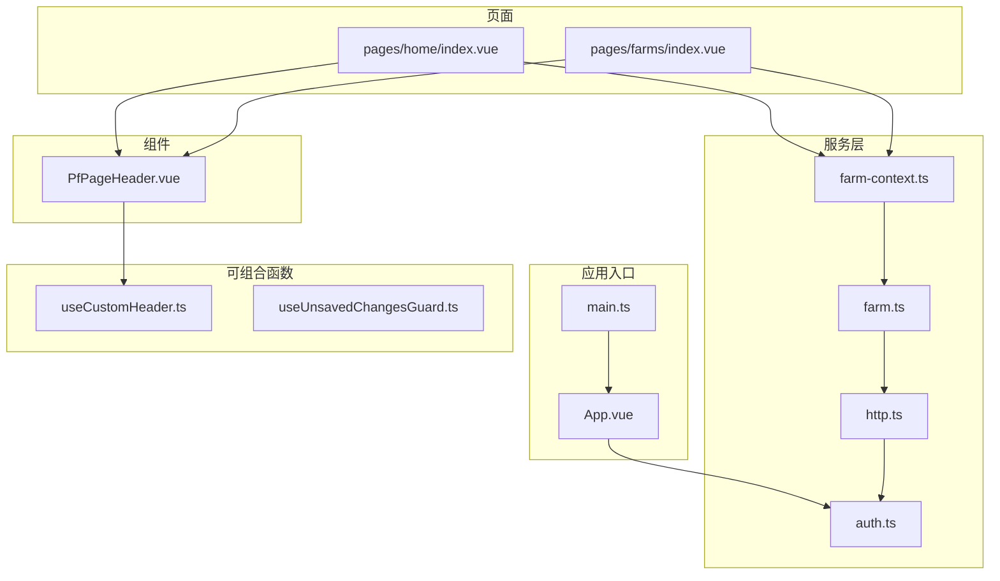
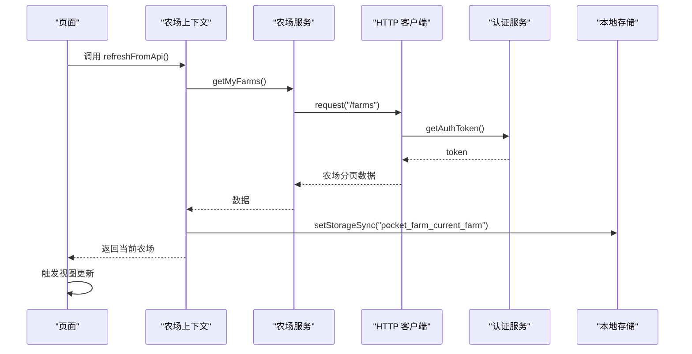
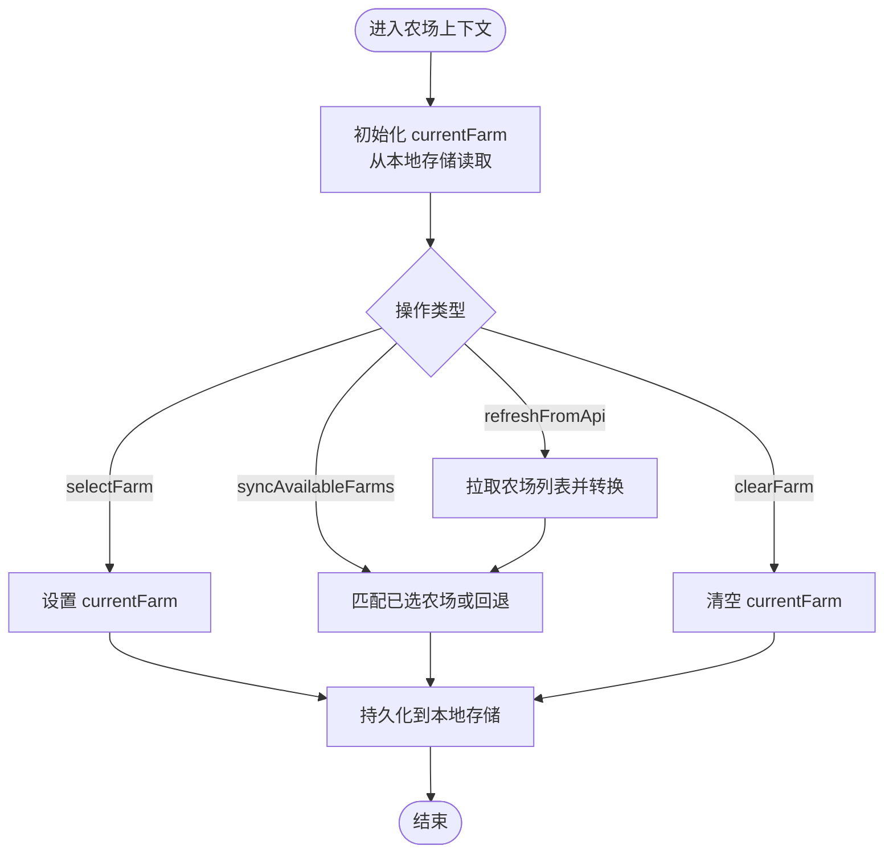
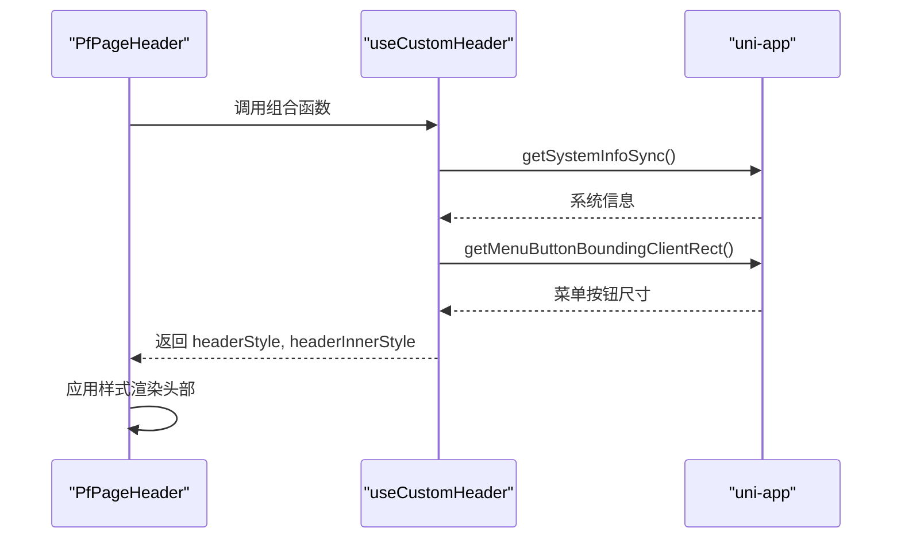
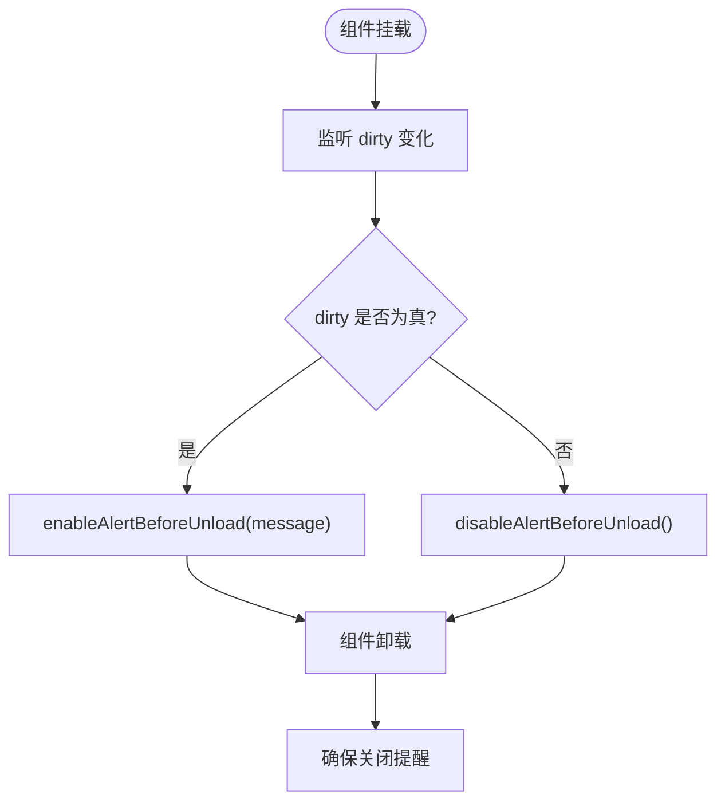
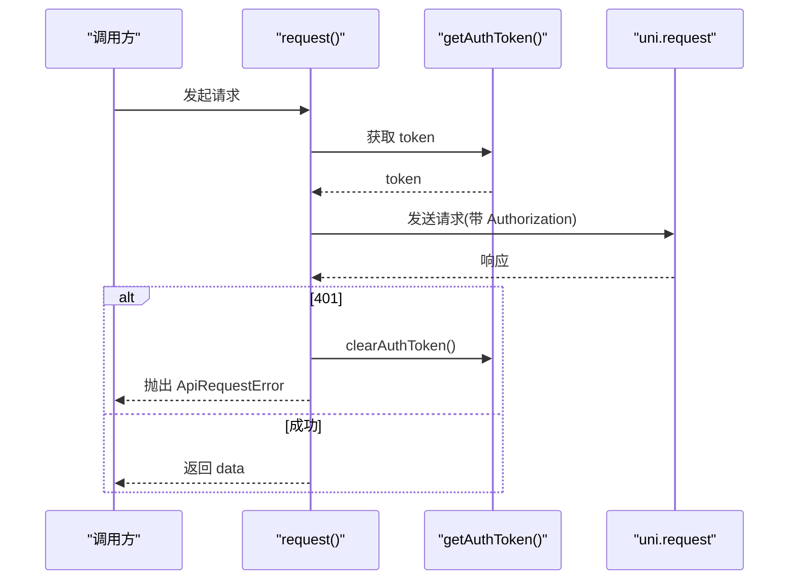
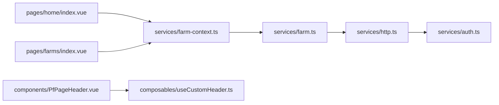

# 状态管理

<cite>
**本文引用的文件**
- [farm-context.ts](file://apps/miniapp/src/services/farm-context.ts)
- [farm.ts](file://apps/miniapp/src/services/farm.ts)
- [http.ts](file://apps/miniapp/src/services/http.ts)
- [auth.ts](file://apps/miniapp/src/services/auth.ts)
- [useCustomHeader.ts](file://apps/miniapp/src/composables/useCustomHeader.ts)
- [useUnsavedChangesGuard.ts](file://apps/miniapp/src/composables/useUnsavedChangesGuard.ts)
- [PfPageHeader.vue](file://apps/miniapp/src/components/PfPageHeader.vue)
- [home/index.vue](file://apps/miniapp/src/pages/home/index.vue)
- [farms/index.vue](file://apps/miniapp/src/pages/farms/index.vue)
- [App.vue](file://apps/miniapp/src/App.vue)
- [main.ts](file://apps/miniapp/src/main.ts)
</cite>

## 目录
1. [简介](#简介)
2. [项目结构](#项目结构)
3. [核心组件](#核心组件)
4. [架构总览](#架构总览)
5. [详细组件分析](#详细组件分析)
6. [依赖关系分析](#依赖关系分析)
7. [性能考虑](#性能考虑)
8. [故障排查指南](#故障排查指南)
9. [结论](#结论)
10. [附录](#附录)

## 简介
本文件为 Pocket Farm 小程序前端的状态管理文档，聚焦基于 Vue 3 Composition API 的本地状态与全局共享策略。重点说明：
- 农场上下文 farm-context.ts 的设计与跨页面共享机制
- 可组合函数 useCustomHeader、useUnsavedChangesGuard 的实现原理与使用方式
- 状态持久化策略（本地存储与会话）
- 状态更新流程图与避免不必要重渲染的性能优化建议
- 最佳实践与常见问题解决方案

## 项目结构
本项目采用“服务层 + 可组合函数 + 页面”的分层组织：
- 服务层 services：封装数据请求与领域模型类型定义，如 farm、http、auth
- 可组合函数 composables：封装跨组件复用的响应式逻辑，如自定义导航栏高度计算、未保存变更拦截
- 页面 pages：业务页面，通过组合函数与服务层协作完成状态读取、更新与副作用处理
- 组件 components：UI 组件，复用可组合函数实现平台适配，如 PfPageHeader

图表来源
- [main.ts:1-9](file://apps/miniapp/src/main.ts#L1-L9)
- [App.vue:1-25](file://apps/miniapp/src/App.vue#L1-L25)
- [http.ts:1-106](file://apps/miniapp/src/services/http.ts#L1-L106)
- [auth.ts:1-18](file://apps/miniapp/src/services/auth.ts#L1-L18)
- [farm.ts:1-121](file://apps/miniapp/src/services/farm.ts#L1-L121)
- [farm-context.ts:1-94](file://apps/miniapp/src/services/farm-context.ts#L1-L94)
- [useCustomHeader.ts:1-39](file://apps/miniapp/src/composables/useCustomHeader.ts#L1-L39)
- [useUnsavedChangesGuard.ts:1-28](file://apps/miniapp/src/composables/useUnsavedChangesGuard.ts#L1-L28)
- [PfPageHeader.vue:1-130](file://apps/miniapp/src/components/PfPageHeader.vue#L1-L130)
- [home/index.vue:1-300](file://apps/miniapp/src/pages/home/index.vue#L1-L300)
- [farms/index.vue:1-233](file://apps/miniapp/src/pages/farms/index.vue#L1-L233)

章节来源
- [main.ts:1-9](file://apps/miniapp/src/main.ts#L1-L9)
- [App.vue:1-25](file://apps/miniapp/src/App.vue#L1-L25)

## 核心组件
- 农场上下文（farm-context.ts）
  - 提供当前农场的响应式状态 currentFarm、派生状态 currentFarmName、hasCurrentFarm
  - 提供选择农场 selectFarm、同步可用农场列表 syncAvailableFarms、刷新 refreshFromApi、清除 clearFarm
  - 通过 uni.getStorageSync/setStorageSync/removeStorageSync 持久化当前农场
- 可组合函数
  - useCustomHeader：计算系统状态栏高度与胶囊按钮区域，返回 headerStyle、headerInnerStyle 供头部组件使用
  - useUnsavedChangesGuard：监听表单脏状态 dirty，启用/禁用微信“离开前提醒”，并在卸载时清理
- 网络与认证
  - http.ts：统一请求封装，自动注入 Authorization 头，处理 401 并抛出 ApiRequestError
  - auth.ts：存取访问令牌，提供 hasAuthToken 等工具方法

章节来源
- [farm-context.ts:1-94](file://apps/miniapp/src/services/farm-context.ts#L1-L94)
- [useCustomHeader.ts:1-39](file://apps/miniapp/src/composables/useCustomHeader.ts#L1-L39)
- [useUnsavedChangesGuard.ts:1-28](file://apps/miniapp/src/composables/useUnsavedChangesGuard.ts#L1-L28)
- [http.ts:1-106](file://apps/miniapp/src/services/http.ts#L1-L106)
- [auth.ts:1-18](file://apps/miniapp/src/services/auth.ts#L1-L18)

## 架构总览
整体采用“轻量级全局上下文 + 页面局部状态”的组合模式：
- 全局上下文：农场上下文集中管理当前农场选择，跨页面共享，并通过本地存储持久化
- 页面状态：各页面维护自身加载态、错误态、列表数据等局部 ref
- 数据流：页面调用服务层发起请求，成功后写入上下文或局部状态；上下文变化驱动 UI 更新

图表来源
- [farm-context.ts:41-83](file://apps/miniapp/src/services/farm-context.ts#L41-L83)
- [farm.ts:48-52](file://apps/miniapp/src/services/farm.ts#L48-L52)
- [http.ts:46-106](file://apps/miniapp/src/services/http.ts#L46-L106)
- [auth.ts:1-18](file://apps/miniapp/src/services/auth.ts#L1-L18)

## 详细组件分析

### 农场上下文（farm-context.ts）
- 设计要点
  - 使用 ref 维护 currentFarm，computed 派生名称与存在性
  - 通过 readStoredFarm 在初始化时恢复上次选择的农场
  - persistFarm 将选择结果持久化到本地存储
  - syncAvailableFarms 保证已选农场仍在可用列表中，否则回退到第一个或清空
  - refreshFromApi 拉取最新农场列表并同步上下文
- 使用场景
  - 首页根据 currentFarm 决定是否展示功能入口
  - 农场列表页用于选择当前农场并回退

图表来源
- [farm-context.ts:16-39](file://apps/miniapp/src/services/farm-context.ts#L16-L39)
- [farm-context.ts:41-83](file://apps/miniapp/src/services/farm-context.ts#L41-L83)

章节来源
- [farm-context.ts:1-94](file://apps/miniapp/src/services/farm-context.ts#L1-L94)
- [farms/index.vue:63-115](file://apps/miniapp/src/pages/farms/index.vue#L63-L115)
- [home/index.vue:92-127](file://apps/miniapp/src/pages/home/index.vue#L92-L127)

### 自定义头部（useCustomHeader.ts）
- 目标：在微信小程序中预留状态栏与胶囊按钮空间，H5 等平台使用安全默认值
- 实现：onMounted 获取系统信息，计算 contentHeight 与 rightPadding，返回样式 computed
- 使用：PfPageHeader 组件通过该组合函数获得 headerStyle 与 headerInnerStyle

图表来源
- [useCustomHeader.ts:1-39](file://apps/miniapp/src/composables/useCustomHeader.ts#L1-L39)
- [PfPageHeader.vue:20-44](file://apps/miniapp/src/components/PfPageHeader.vue#L20-L44)

章节来源
- [useCustomHeader.ts:1-39](file://apps/miniapp/src/composables/useCustomHeader.ts#L1-L39)
- [PfPageHeader.vue:1-130](file://apps/miniapp/src/components/PfPageHeader.vue#L1-L130)

### 未保存变更保护（useUnsavedChangesGuard.ts）
- 目标：在用户尝试离开包含未保存内容的页面时给出提示
- 实现：监听 dirty 状态，当为真时启用离开前提醒，为假时关闭；组件卸载时确保关闭
- 降级：非微信平台无对应能力时静默忽略

图表来源
- [useUnsavedChangesGuard.ts:1-28](file://apps/miniapp/src/composables/useUnsavedChangesGuard.ts#L1-L28)

章节来源
- [useUnsavedChangesGuard.ts:1-28](file://apps/miniapp/src/composables/useUnsavedChangesGuard.ts#L1-L28)

### 网络与认证（http.ts、auth.ts）
- http.ts
  - 统一封装 uni.request，自动附加 Authorization 头
  - 对 401 响应清理本地 token，并抛出 ApiRequestError
  - 对 204 空体响应直接 resolve(undefined)
- auth.ts
  - 提供 token 的存取与判断方法，配合 App.vue 进行路由跳转

图表来源
- [http.ts:46-106](file://apps/miniapp/src/services/http.ts#L46-L106)
- [auth.ts:1-18](file://apps/miniapp/src/services/auth.ts#L1-L18)

章节来源
- [http.ts:1-106](file://apps/miniapp/src/services/http.ts#L1-L106)
- [auth.ts:1-18](file://apps/miniapp/src/services/auth.ts#L1-L18)
- [App.vue:1-25](file://apps/miniapp/src/App.vue#L1-L25)

### 页面集成示例
- 首页（home/index.vue）
  - 使用 useFarmContext 获取 currentFarm、currentFarmName、hasCurrentFarm、refreshFromApi
  - onShow 时并行拉取用户信息与农场上下文，再加载仪表盘数据
- 农场列表页（farms/index.vue）
  - 加载农场列表后调用 syncAvailableFarms 同步上下文，选择农场后回退

章节来源
- [home/index.vue:92-263](file://apps/miniapp/src/pages/home/index.vue#L92-L263)
- [farms/index.vue:63-115](file://apps/miniapp/src/pages/farms/index.vue#L63-L115)

## 依赖关系分析
- 耦合与内聚
  - 农场上下文仅依赖农场服务与本地存储，职责单一，内聚度高
  - 页面通过组合函数解耦平台差异，提升可测试性与复用性
- 外部依赖
  - uni-app 提供的本地存储与系统信息接口
  - 微信小程序特有的菜单按钮与离开前提醒能力
- 潜在循环依赖
  - 当前未发现循环引用；服务层不反向依赖页面或组件

图表来源
- [home/index.vue:92-127](file://apps/miniapp/src/pages/home/index.vue#L92-L127)
- [farms/index.vue:63-115](file://apps/miniapp/src/pages/farms/index.vue#L63-L115)
- [farm-context.ts:1-94](file://apps/miniapp/src/services/farm-context.ts#L1-L94)
- [farm.ts:1-121](file://apps/miniapp/src/services/farm.ts#L1-L121)
- [http.ts:1-106](file://apps/miniapp/src/services/http.ts#L1-L106)
- [auth.ts:1-18](file://apps/miniapp/src/services/auth.ts#L1-L18)
- [PfPageHeader.vue:1-130](file://apps/miniapp/src/components/PfPageHeader.vue#L1-L130)
- [useCustomHeader.ts:1-39](file://apps/miniapp/src/composables/useCustomHeader.ts#L1-L39)

章节来源
- [farm-context.ts:1-94](file://apps/miniapp/src/services/farm-context.ts#L1-L94)
- [http.ts:1-106](file://apps/miniapp/src/services/http.ts#L1-L106)

## 性能考虑
- 减少不必要的重新渲染
  - 使用 computed 派生状态（如 currentFarmName、hasCurrentFarm），仅在依赖变化时更新
  - 在首页使用 Promise.all 并发拉取用户信息与农场上下文，缩短首屏等待时间
- 合理的数据粒度
  - 农场上下文只暴露必要字段，避免传递大对象导致频繁响应式开销
- 本地存储读写
  - 仅在关键状态变更时写入本地存储（如选择农场、切换农场），避免高频写盘
- 网络请求优化
  - 利用 http.ts 的统一错误处理与 401 自动清理，减少重复鉴权失败带来的重试
- 条件渲染
  - 使用 v-if 控制复杂区块渲染，避免无关节点参与更新

[本节为通用性能建议，无需特定文件来源]

## 故障排查指南
- 401 未授权
  - 现象：页面跳转到登录页或无法加载数据
  - 原因：token 失效或被服务端拒绝
  - 处理：http.ts 自动清理 token，页面捕获 ApiRequestError 并跳转登录
  - 参考路径
    - [http.ts:68-73](file://apps/miniapp/src/services/http.ts#L68-L73)
    - [home/index.vue:159-162](file://apps/miniapp/src/pages/home/index.vue#L159-L162)
    - [farms/index.vue:76-79](file://apps/miniapp/src/pages/farms/index.vue#L76-L79)
- 本地存储异常
  - 现象：启动后未正确恢复当前农场
  - 原因：存储格式损坏或缺少必要字段
  - 处理：readStoredFarm 会校验 id 与 name 类型，非法则回退为空
  - 参考路径
    - [farm-context.ts:16-29](file://apps/miniapp/src/services/farm-context.ts#L16-L29)
- 离开前提醒无效
  - 现象：离开页面未弹出确认
  - 原因：非微信平台不支持 uni.enableAlertBeforeUnload
  - 处理：组合函数会检测能力并静默降级
  - 参考路径
    - [useUnsavedChangesGuard.ts:13-23](file://apps/miniapp/src/composables/useUnsavedChangesGuard.ts#L13-L23)

章节来源
- [http.ts:68-73](file://apps/miniapp/src/services/http.ts#L68-L73)
- [home/index.vue:159-162](file://apps/miniapp/src/pages/home/index.vue#L159-L162)
- [farms/index.vue:76-79](file://apps/miniapp/src/pages/farms/index.vue#L76-L79)
- [farm-context.ts:16-29](file://apps/miniapp/src/services/farm-context.ts#L16-L29)
- [useUnsavedChangesGuard.ts:13-23](file://apps/miniapp/src/composables/useUnsavedChangesGuard.ts#L13-L23)

## 结论
Pocket Farm 前端采用以 Vue 3 Composition API 为核心的轻量级状态管理方案：
- 通过农场上下文实现跨页面共享与持久化，简化多农场切换体验
- 使用可组合函数隔离平台差异与通用逻辑，提升复用性与可维护性
- 结合统一的网络与认证封装，保障错误处理一致性与安全性
- 借助 computed、并发请求与条件渲染等手段，有效控制渲染成本

建议在后续迭代中继续遵循“小上下文、细粒度状态、明确边界”的原则，逐步扩展更多领域的上下文与可组合函数，保持代码清晰与性能稳定。

## 附录
- 术语
  - 上下文：跨组件共享的响应式状态集合
  - 可组合函数：封装可复用响应式逻辑的函数
  - 持久化：将状态保存到本地存储以实现跨会话保留
- 最佳实践
  - 将易变且需跨页面共享的状态放入上下文，局部状态留在页面
  - 对外暴露最小接口，隐藏内部实现细节
  - 对平台特性进行能力检测与降级处理
  - 统一错误模型与处理流程，便于定位问题

[本节为概念性内容，无需特定文件来源]