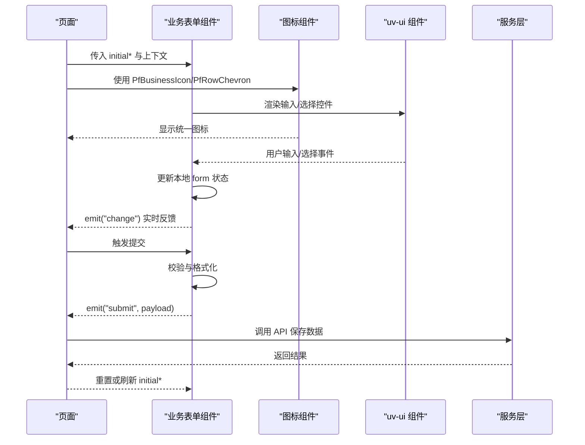
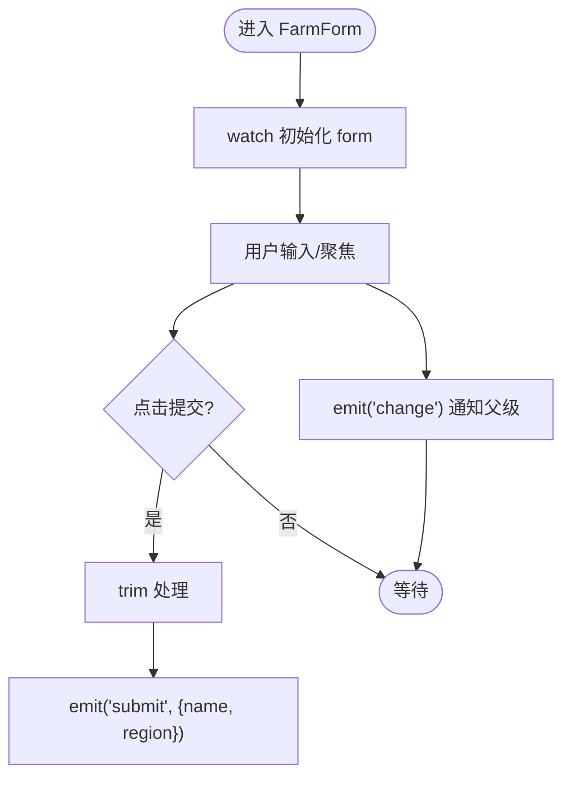
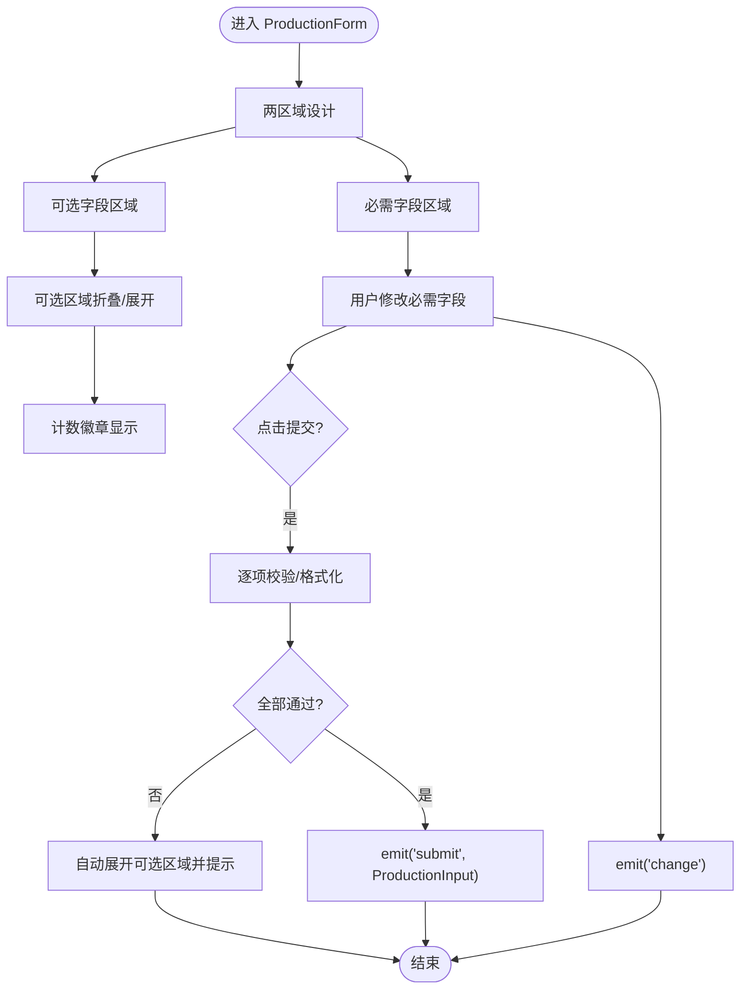
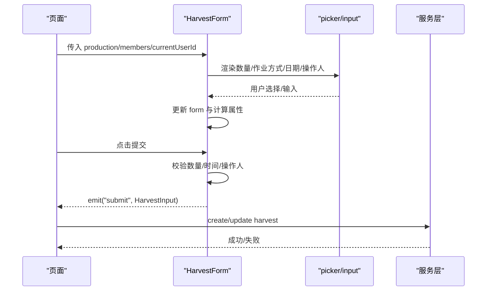
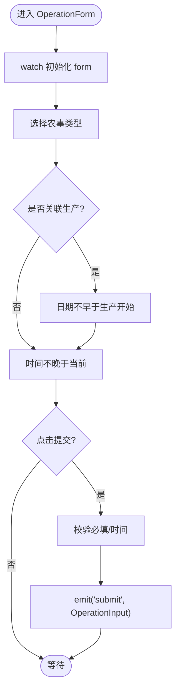
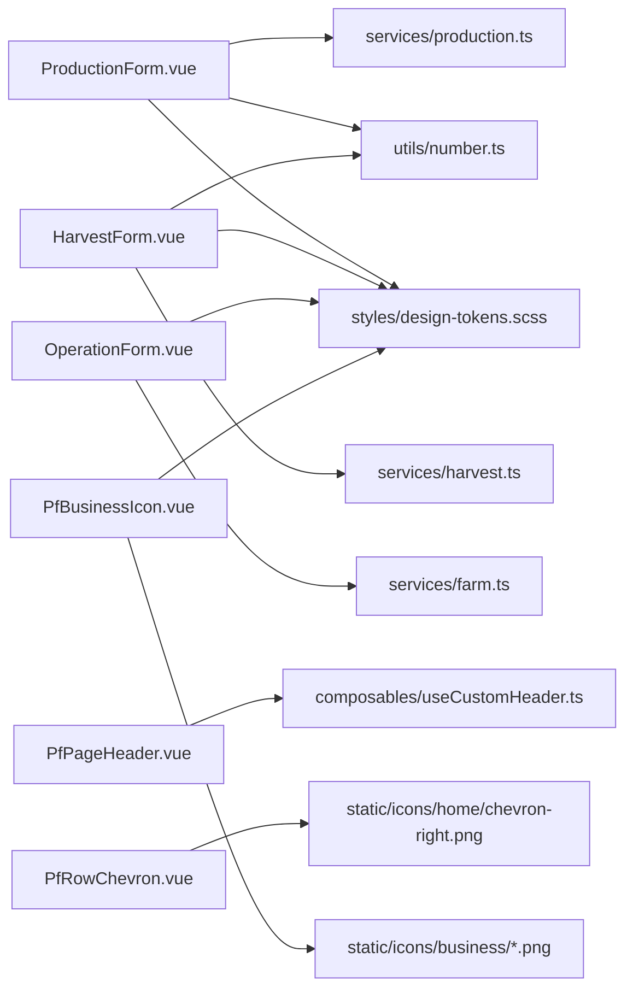

# 组件系统

<cite>
**本文引用的文件**
- [PfBusinessIcon.vue](file://apps/miniapp/src/components/PfBusinessIcon.vue)
- [FarmForm.vue](file://apps/miniapp/src/components/FarmForm.vue)
- [ProductionForm.vue](file://apps/miniapp/src/components/ProductionForm.vue)
- [HarvestForm.vue](file://apps/miniapp/src/components/HarvestForm.vue)
- [OperationForm.vue](file://apps/miniapp/src/components/OperationForm.vue)
- [PlotForm.vue](file://apps/miniapp/src/components/PlotForm.vue)
- [FixedUnitNumberField.vue](file://apps/miniapp/src/components/FixedUnitNumberField.vue)
- [PfPageHeader.vue](file://apps/miniapp/src/components/PfPageHeader.vue)
- [PfRowChevron.vue](file://apps/miniapp/src/components/PfRowChevron.vue)
- [design-tokens.scss](file://apps/miniapp/src/styles/design-tokens.scss)
- [pocket-farm.scss](file://apps/miniapp/src/styles/pocket-farm.scss)
- [production.ts](file://apps/miniapp/src/services/production.ts)
- [harvest.ts](file://apps/miniapp/src/services/harvest.ts)
- [farm.ts](file://apps/miniapp/src/services/farm.ts)
- [number.ts](file://apps/miniapp/src/utils/number.ts)
- [useCustomHeader.ts](file://apps/miniapp/src/composables/useCustomHeader.ts)
- [home/index.vue](file://apps/miniapp/src/pages/home/index.vue)
- [farm/index.vue](file://apps/miniapp/src/pages/farm/index.vue)
- [plots/detail.vue](file://apps/miniapp/src/pages/plots/detail.vue)
- [mine/index.vue](file://apps/miniapp/src/pages/mine/index.vue)
- [harvests/index.vue](file://apps/miniapp/src/pages/harvests/index.vue)
- [farm-plots/index.vue](file://apps/miniapp/src/pages/farm-plots/index.vue)
- [farms/index.vue](file://apps/miniapp/src/pages/farms/index.vue)
- [productions/form.vue](file://apps/miniapp/src/pages/productions/form.vue)
- [productions/edit.vue](file://apps/miniapp/src/pages/productions/edit.vue)
- [00-miniapp-refactor-plan.md](file://docs/refactor/00-miniapp-refactor-plan.md)
</cite>

## 更新摘要
**变更内容**
- 更新了 ProductionForm 组件章节，详细说明两区域设计重构（必需字段+可选字段折叠区域）
- 新增了可选字段区域的计数徽章显示和自动展开功能说明
- 移除了 lockSpeciesInfo 属性的相关描述
- 更新了样式系统使用 CSS 变量和设计令牌的改进
- 更新了组件架构图和使用示例以反映最新变更
- 增强了 PfBusinessIcon 和 PfRowChevron 组件的使用场景说明

## 目录
1. [简介](#简介)
2. [项目结构](#项目结构)
3. [核心组件](#核心组件)
4. [架构总览](#架构总览)
5. [详细组件分析](#详细组件分析)
6. [依赖关系分析](#依赖关系分析)
7. [性能与可维护性](#性能与可维护性)
8. [故障排查指南](#故障排查指南)
9. [结论](#结论)
10. [附录：使用示例与最佳实践](#附录：使用示例与最佳实践)

## 简介
本文件为 Pocket Farm 小程序前端（基于 Vue 3）的组件系统文档，聚焦于表单类业务组件、通用 UI 组件的组织方式与开发规范。内容涵盖：
- 组件分层与职责划分：业务表单组件（如 FarmForm、ProductionForm）、通用输入组件（如 FixedUnitNumberField）、页面级 UI 组件（如 PfPageHeader）。
- 自定义组件开发规范：props 定义、事件处理、插槽使用建议、数据校验与错误提示。
- 组件复用策略：以"受控/非受控"结合、组合式 API、计算属性驱动展示的设计模式。
- 与 uv-ui 集成：主题定制、样式覆盖与一致性设计令牌的使用。
- 组件层次结构与通信机制：父子通信、跨层数据流、与服务层的对接。
- 使用示例与最佳实践：在页面中如何组合与调用这些组件。

**更新** ProductionForm 组件进行了重大重构，从扁平布局改为两区域设计（必需字段+可选字段折叠区域），新增了可选字段区域的计数徽章显示和自动展开功能，移除了 lockSpeciesInfo 属性，改进了样式系统使用 CSS 变量和设计令牌。同时继续完善 PfBusinessIcon 业务图标组件的统一化应用和 PfRowChevron 导航指示器组件的广泛使用。

## 项目结构
组件位于 apps/miniapp/src/components，配合 services 类型定义与工具函数，以及 styles 中的设计令牌，形成清晰的"视图—逻辑—样式"分层。

```mermaid
graph TB
subgraph "组件层"
A["FarmForm.vue"]
B["ProductionForm.vue"]
C["HarvestForm.vue"]
D["OperationForm.vue"]
E["PlotForm.vue"]
F["FixedUnitNumberField.vue"]
G["PfPageHeader.vue"]
H["PfRowChevron.vue"]
I["PfBusinessIcon.vue"]
end
subgraph "服务与工具"
S1["services/production.ts"]
S2["services/harvest.ts"]
S3["services/farm.ts"]
U1["utils/number.ts"]
C1["composables/useCustomHeader.ts"]
end
subgraph "样式"
ST1["styles/design-tokens.scss"]
ST2["styles/pocket-farm.scss"]
end
subgraph "静态资源"
R1["static/icons/business/*.png"]
R2["static/icons/home/chevron-right.png"]
R3["static/icons/home/sprout.png"]
R4["static/icons/home/shovel.png"]
R5["static/icons/home/shopping-basket.png"]
R6["static/icons/home/land-plot.png"]
R7["static/icons/home/list.png"]
R8["static/icons/home/clock-3.png"]
R9["static/icons/home/settings.png"]
R10["static/icons/home/map.png"]
end
A --> F
B --> F
C --> S1
D --> S3
G --> C1
A --> ST1
B --> ST1
C --> ST1
D --> ST1
E --> ST1
F --> ST1
G --> ST1
H --> R2
H --> ST1
I --> R1
I --> ST1
```

**图表来源**
- [PfBusinessIcon.vue:1-100](file://apps/miniapp/src/components/PfBusinessIcon.vue#L1-L100)
- [PfRowChevron.vue:1-17](file://apps/miniapp/src/components/PfRowChevron.vue#L1-L17)
- [FarmForm.vue:1-150](file://apps/miniapp/src/components/FarmForm.vue#L1-L150)
- [ProductionForm.vue:1-686](file://apps/miniapp/src/components/ProductionForm.vue#L1-L686)
- [HarvestForm.vue:1-311](file://apps/miniapp/src/components/HarvestForm.vue#L1-L311)
- [OperationForm.vue:1-364](file://apps/miniapp/src/components/OperationForm.vue#L1-L364)
- [PlotForm.vue:1-242](file://apps/miniapp/src/components/PlotForm.vue#L1-L242)
- [FixedUnitNumberField.vue:1-99](file://apps/miniapp/src/components/FixedUnitNumberField.vue#L1-L99)
- [PfPageHeader.vue:1-130](file://apps/miniapp/src/components/PfPageHeader.vue#L1-L130)

**章节来源**
- [PfBusinessIcon.vue:1-100](file://apps/miniapp/src/components/PfBusinessIcon.vue#L1-L100)
- [PfRowChevron.vue:1-17](file://apps/miniapp/src/components/PfRowChevron.vue#L1-L17)
- [FarmForm.vue:1-150](file://apps/miniapp/src/components/FarmForm.vue#L1-L150)
- [ProductionForm.vue:1-686](file://apps/miniapp/src/components/ProductionForm.vue#L1-L686)
- [HarvestForm.vue:1-311](file://apps/miniapp/src/components/HarvestForm.vue#L1-L311)
- [OperationForm.vue:1-364](file://apps/miniapp/src/components/OperationForm.vue#L1-L364)
- [PlotForm.vue:1-242](file://apps/miniapp/src/components/PlotForm.vue#L1-L242)
- [FixedUnitNumberField.vue:1-99](file://apps/miniapp/src/components/FixedUnitNumberField.vue#L1-L99)
- [PfPageHeader.vue:1-130](file://apps/miniapp/src/components/PfPageHeader.vue#L1-L130)
- [design-tokens.scss:1-74](file://apps/miniapp/src/styles/design-tokens.scss#L1-L74)
- [pocket-farm.scss:1-78](file://apps/miniapp/src/styles/pocket-farm.scss#L1-L78)

## 核心组件
- FarmForm：农场基础信息表单，包含名称与地区字段，支持提交与变更事件。
- ProductionForm：生产记录表单，采用两区域设计（必需字段+可选字段折叠区域），内置复杂校验与格式化，支持可选字段计数徽章和自动展开功能。
- HarvestForm：收获/捕捞/出栏记录表单，自动推导单位与标签，严格数值校验。
- OperationForm：农事作业表单，关联农事类型与可选的生产批次，时间范围校验。
- PlotForm：地块信息表单，支持面积值与单位选择。
- FixedUnitNumberField：带单位的数字输入通用组件，统一交互与样式。
- PfPageHeader：页面头部组件，适配小程序胶囊按钮与返回行为。
- **PfRowChevron：行内箭头图标组件，用于列表导航指示，提供统一的视觉体验。**
- **PfBusinessIcon：业务图标组件，提供统一的业务图标资源管理，支持多种尺寸和变体。**

**章节来源**
- [FarmForm.vue:53-104](file://apps/miniapp/src/components/FarmForm.vue#L53-L104)
- [ProductionForm.vue:259-282](file://apps/miniapp/src/components/ProductionForm.vue#L259-L282)
- [HarvestForm.vue:98-289](file://apps/miniapp/src/components/HarvestForm.vue#L98-L289)
- [OperationForm.vue:83-281](file://apps/miniapp/src/components/OperationForm.vue#L83-L281)
- [PlotForm.vue:72-167](file://apps/miniapp/src/components/PlotForm.vue#L72-L167)
- [FixedUnitNumberField.vue:25-48](file://apps/miniapp/src/components/FixedUnitNumberField.vue#L25-L48)
- [PfPageHeader.vue:20-44](file://apps/miniapp/src/components/PfPageHeader.vue#L20-L44)
- [PfRowChevron.vue:1-17](file://apps/miniapp/src/components/PfRowChevron.vue#L1-L17)
- [PfBusinessIcon.vue:10-35](file://apps/miniapp/src/components/PfBusinessIcon.vue#L10-L35)

## 架构总览
组件采用"页面组合 + 表单组件 + 通用输入 + 服务层"的分层架构：
- 页面负责编排与状态管理，通过 props 向表单组件注入初始值与上下文，监听 submit/change 事件进行数据持久化。
- 表单组件内部维护本地 form 状态，使用 watch 同步外部初始值，使用 computed 派生展示文本与条件渲染。
- 通用输入组件提供一致的交互与样式，减少重复代码。
- 服务层提供类型定义与 HTTP 接口封装，组件仅关注用户交互与数据组装。
- **图标资源统一管理：通过 PfBusinessIcon 和 PfRowChevron 组件集中管理业务图标和导航图标，避免分散的资源引用。**

**图表来源**
- [ProductionForm.vue:259-527](file://apps/miniapp/src/components/ProductionForm.vue#L259-L527)
- [HarvestForm.vue:117-289](file://apps/miniapp/src/components/HarvestForm.vue#L117-L289)
- [OperationForm.vue:96-281](file://apps/miniapp/src/components/OperationForm.vue#L96-L281)
- [PfBusinessIcon.vue:1-100](file://apps/miniapp/src/components/PfBusinessIcon.vue#L1-L100)
- [PfRowChevron.vue:1-17](file://apps/miniapp/src/components/PfRowChevron.vue#L1-L17)
- [production.ts:74-110](file://apps/miniapp/src/services/production.ts#L74-L110)
- [harvest.ts:67-87](file://apps/miniapp/src/services/harvest.ts#L67-L87)

## 详细组件分析

### FarmForm（农场表单）
- 职责：收集农场名称与地区，提供提交与变更事件。
- Props：initialName、initialRegion、submitLabel、loadingText、submitting。
- 事件：submit（携带 name、region）、change（实时变化）。
- 交互：输入框聚焦态边框高亮；提交时透传 loading 状态。
- 数据流：watch 同步初始值到本地 form；@input 触发 change；点击按钮触发 submit。

**图表来源**
- [FarmForm.vue:53-104](file://apps/miniapp/src/components/FarmForm.vue#L53-L104)
- [FarmForm.vue:106-150](file://apps/miniapp/src/components/FarmForm.vue#L106-L150)

**章节来源**
- [FarmForm.vue:1-150](file://apps/miniapp/src/components/FarmForm.vue#L1-L150)

### ProductionForm（生产表单）
- 职责：根据种类与行业动态渲染字段，完成复杂校验与格式化，输出 ProductionInput。
- **更新** 采用两区域设计：必需字段区域（不可折叠）+ 可选字段区域（可折叠，带计数徽章）。
- Props：initialProduction、initialSpecies、initialVariety、initialPlot、showPlotField、plotSelectable、submitLabel、loadingText、submitting。
- **移除** lockSpeciesInfo 属性。
- 事件：submit（ProductionInput）、change、select-plot。
- **新功能**：
  - 可选字段计数徽章：`filledOptionalCount` 计算属性实时显示已填写的可选字段数量
  - 自动展开功能：当存在可选字段内容时自动展开可选区域
  - 折叠交互：通过 `toggleOptionalSection` 方法控制可选区域的展开/折叠
- 关键逻辑：
  - 动态字段：种植标准/方式、预计采收、亩产、株间距、入栏日龄等按行业/方法显示。
  - 校验：必填项、正整数/大于零、日期范围、空值处理。
  - 格式化：数字去除无意义小数位；今日默认日期；单位映射。
- 数据流：watch 同步 initialProduction/Species/Variety；computed 派生标签与显示控制；handleSubmit 校验后 emit。

**图表来源**
- [ProductionForm.vue:259-527](file://apps/miniapp/src/components/ProductionForm.vue#L259-L527)
- [number.ts:1-19](file://apps/miniapp/src/utils/number.ts#L1-L19)

**章节来源**
- [ProductionForm.vue:1-686](file://apps/miniapp/src/components/ProductionForm.vue#L1-L686)
- [number.ts:1-19](file://apps/miniapp/src/utils/number.ts#L1-L19)

### HarvestForm（收获/捕捞/出栏表单）
- 职责：记录收获相关数据，自动推导数量单位与标签，严格数值与时间校验。
- Props：production、members、currentUserId、initialHarvest、submitLabel、loadingText、submitting。
- 事件：submit（HarvestInput）。
- 关键逻辑：
  - 单位推导：根据 initialHarvest 或 production.industry 确定单位与是否整数。
  - 时间校验： harvestedDate >= startedOn；harvestedAt <= now。
  - 数值校验：最多四位小数，整数单位必须为整数。
- 数据流：watch 初始化并绑定成员列表；handleChange 更新 form；handleSubmit 校验后 emit。

**图表来源**
- [HarvestForm.vue:98-289](file://apps/miniapp/src/components/HarvestForm.vue#L98-L289)
- [harvest.ts:67-87](file://apps/miniapp/src/services/harvest.ts#L67-L87)

**章节来源**
- [HarvestForm.vue:1-311](file://apps/miniapp/src/components/HarvestForm.vue#L1-L311)

### OperationForm（农事作业表单）
- 职责：记录农事作业，支持关联生产批次与操作人，时间范围校验。
- Props：productions、members、operationTypes、currentUserId、hasPlot、selectedOperationTypeId、selectedProductionId、initialOperation、submitLabel、loadingText、submitting。
- 事件：submit（OperationInput）、select-operation-type、select-production。
- 关键逻辑：
  - 关联生产：当 hasPlot 为真才可选；日期不得早于生产开始日期。
  - 时间校验：operatedAt <= now。
  - 成员选择：从 members 列表中选择操作人。
- 数据流：watch 初始化并响应 selectedOperationTypeId/selectedProductionId；handleSubmit 校验后 emit。

**图表来源**
- [OperationForm.vue:83-281](file://apps/miniapp/src/components/OperationForm.vue#L83-L281)

**章节来源**
- [OperationForm.vue:1-364](file://apps/miniapp/src/components/OperationForm.vue#L1-L364)

### PlotForm（地块表单）
- 职责：录入地块名称、类型与面积（值+单位），提交结构化数据。
- Props：initialName、initialType、initialAreaValue、initialAreaUnit、submitLabel、loadingText、submitting。
- 事件：submit（name、type、areaValue、areaUnit）、change。
- 关键逻辑：watch 同步初始值；面积值格式化；单位与类型下拉选择。

**章节来源**
- [PlotForm.vue:1-242](file://apps/miniapp/src/components/PlotForm.vue#L1-L242)

### FixedUnitNumberField（带单位数字输入）
- 职责：统一的带单位数字输入，支持占位符、必填标记、值双向绑定。
- Props：label、unit、placeholder、required、value。
- 事件：change（字符串值）。
- 适用场景：ProductionForm、HarvestForm 等需要固定单位与一致样式的数字输入。

**章节来源**
- [FixedUnitNumberField.vue:1-99](file://apps/miniapp/src/components/FixedUnitNumberField.vue#L1-L99)

### PfPageHeader（页面头部）
- 职责：适配小程序自定义导航栏，提供返回与标题/副标题展示。
- Props：title、subtitle、variant、showBack、showTitle、backHandler。
- 逻辑：使用 useCustomHeader 获取状态栏高度与胶囊按钮尺寸，计算 header 样式；默认返回行为 uni.navigateBack。

**章节来源**
- [PfPageHeader.vue:1-130](file://apps/miniapp/src/components/PfPageHeader.vue#L1-L130)
- [useCustomHeader.ts:1-39](file://apps/miniapp/src/composables/useCustomHeader.ts#L1-L39)

### PfRowChevron（行内箭头）
- 职责：展示右箭头图标，用于列表项导航指示，提供统一的视觉体验。
- 实现：使用 image 组件加载 `/static/icons/home/chevron-right.png`，固定尺寸为 30rpx × 30rpx。
- 样式：flex-shrink: 0 确保箭头不被压缩，aspectFit 模式保持图片比例。
- 使用场景：所有可点击行的右侧导航指示，包括首页、农场页、我的页、地块详情页、生产详情页等。

**更新** 该组件是统一的导航指示器，已在多个核心页面中得到广泛应用：
- **生产详情页**：用于查看收获记录、结束养殖、删除记录等操作的导航指示
- **首页**：用于最近活动列表项的导航指示
- **农场页**：用于概览卡片、当前种养列表、生产记录入口的导航指示
- **地块详情页**：用于当前种养、历史种养、生产记录的导航指示
- **地块列表页**：用于地块列表项的导航指示
- **我的页**：用于个人资料、农场管理的导航指示

这种统一的导航指示器确保了跨页面的视觉一致性，提升了用户体验。

**章节来源**
- [PfRowChevron.vue:1-17](file://apps/miniapp/src/components/PfRowChevron.vue#L1-L17)
- [productions/detail.vue:145-171](file://apps/miniapp/src/pages/productions/detail.vue#L145-L171)
- [home/index.vue:72-72](file://apps/miniapp/src/pages/home/index.vue#L72-L72)
- [farm/index.vue:19-66](file://apps/miniapp/src/pages/farm/index.vue#L19-L66)
- [plots/detail.vue:131-205](file://apps/miniapp/src/pages/plots/detail.vue#L131-L205)
- [farm-plots/index.vue:39-39](file://apps/miniapp/src/pages/farm-plots/index.vue#L39-L39)
- [mine/index.vue:14-35](file://apps/miniapp/src/pages/mine/index.vue#L14-L35)

### PfBusinessIcon（业务图标）
- 职责：统一的业务图标组件，提供标准化的图标资源管理和显示。
- 实现：使用 image 组件加载 `/static/icons/business/{name}.png`，支持多种尺寸和变体。
- Props：
  - name：图标名称（sprout、shovel、shopping-basket、land-plot、list、clock-3、settings、map）
  - size：尺寸（normal 56rpx、empty 72rpx、compact 40rpx）
  - variant：变体（contained 背景容器、plain 透明背景）
  - muted：淡化效果（透明度 0.35）
- 样式：使用设计令牌 $pf-color-primary-soft 作为背景色，$pf-radius-control 作为圆角。
- 使用场景：首页功能入口、农场概览、地块详情、收获记录等业务图标展示。

**更新** 该组件是新增的业务图标统一化管理方案，已在多个核心页面中得到广泛应用：
- **首页**：用于开始种养、记农事、记收获、地块管理等主要功能入口
- **农场页**：用于当前种养列表、生产记录入口、空状态展示
- **地块详情页**：用于快速操作按钮、当前种养、历史种养、生产记录入口
- **我的页**：用于农场管理、设置等功能入口
- **收获记录页**：用于收获记录列表项的图标展示
- **农场列表页**：用于空状态展示
- **地块列表页**：用于空状态展示

这种统一的业务图标组件确保了跨页面的视觉一致性和品牌识别度，同时提供了灵活的尺寸和样式配置选项。

**章节来源**
- [PfBusinessIcon.vue:1-100](file://apps/miniapp/src/components/PfBusinessIcon.vue#L1-L100)
- [home/index.vue:14-26](file://apps/miniapp/src/pages/home/index.vue#L14-L26)
- [farm/index.vue:53-72](file://apps/miniapp/src/pages/farm/index.vue#L53-L72)
- [plots/detail.vue:69-91](file://apps/miniapp/src/pages/plots/detail.vue#L69-L91)
- [mine/index.vue:22-28](file://apps/miniapp/src/pages/mine/index.vue#L22-L28)
- [harvests/index.vue:29-29](file://apps/miniapp/src/pages/harvests/index.vue#L29-L29)
- [farm-plots/index.vue:43-43](file://apps/miniapp/src/pages/farm-plots/index.vue#L43-L43)
- [farms/index.vue:45-45](file://apps/miniapp/src/pages/farms/index.vue#L45-L45)

## 依赖关系分析
- 组件对服务的依赖：
  - ProductionForm 依赖 production 类型与 toSpecies 转换。
  - HarvestForm 依赖 harvest 类型与 WorkMethod。
  - OperationForm 依赖 farm 成员列表与 operation 类型。
- 组件对工具的依赖：
  - number.formatNumber 用于数值展示与格式化。
- 组件对样式的依赖：
  - design-tokens.scss 提供语义色、间距、圆角等设计令牌。
  - pocket-farm.scss 提供页面级布局与卡片样式。
- 组件间复用：
  - FixedUnitNumberField 被多个表单复用，保证输入体验一致。
  - PfPageHeader 通过 composables 适配不同平台差异。
  - **PfRowChevron 被多个页面复用，提供统一的导航指示器。**
  - **PfBusinessIcon 被多个页面复用，提供统一的业务图标资源管理。**

**图表来源**
- [ProductionForm.vue:259-527](file://apps/miniapp/src/components/ProductionForm.vue#L259-L527)
- [HarvestForm.vue:98-289](file://apps/miniapp/src/components/HarvestForm.vue#L98-L289)
- [OperationForm.vue:83-281](file://apps/miniapp/src/components/OperationForm.vue#L83-L281)
- [number.ts:1-19](file://apps/miniapp/src/utils/number.ts#L1-L19)
- [design-tokens.scss:1-74](file://apps/miniapp/src/styles/design-tokens.scss#L1-L74)
- [useCustomHeader.ts:1-39](file://apps/miniapp/src/composables/useCustomHeader.ts#L1-L39)
- [PfRowChevron.vue:1-17](file://apps/miniapp/src/components/PfRowChevron.vue#L1-L17)
- [PfBusinessIcon.vue:1-100](file://apps/miniapp/src/components/PfBusinessIcon.vue#L1-L100)

**章节来源**
- [production.ts:1-121](file://apps/miniapp/src/services/production.ts#L1-L121)
- [harvest.ts:1-92](file://apps/miniapp/src/services/harvest.ts#L1-L92)
- [farm.ts:1-121](file://apps/miniapp/src/services/farm.ts#L1-L121)
- [number.ts:1-19](file://apps/miniapp/src/utils/number.ts#L1-L19)
- [design-tokens.scss:1-74](file://apps/miniapp/src/styles/design-tokens.scss#L1-L74)

## 性能与可维护性
- 性能优化建议：
  - 表单组件内部使用 reactive 管理局部状态，避免不必要的重渲染。
  - 使用 computed 派生展示文本与条件渲染，减少模板中复杂逻辑。
  - 数字格式化统一使用 formatNumber，避免重复实现与精度问题。
  - 长列表页面应分页加载，组件仅负责展示与交互。
  - **PfRowChevron 和 PfBusinessIcon 组件使用静态图片资源，避免运行时图标加载开销。**
  - **图标组件使用 computed 缓存图标路径，减少重复计算。**
  - **ProductionForm 的两区域设计减少了初始渲染复杂度，可选字段按需加载。**
- 可维护性建议：
  - 保持 props 最小化且类型明确，必要时提供 withDefaults 默认值。
  - 事件命名清晰：submit、change、select-*，便于页面监听与调试。
  - 将业务常量（枚举映射、标签）集中在组件内或抽取至 utils，避免散落。
  - 样式统一使用设计令牌，避免硬编码颜色与尺寸。
  - **统一使用 PfRowChevron 和 PfBusinessIcon 组件替代分散的图标实现，提高维护效率。**
  - **业务图标名称使用 TypeScript 类型约束，确保类型安全。**
  - **ProductionForm 的两区域设计提高了表单的可维护性，必需字段和可选字段分离清晰。**

## 故障排查指南
- 常见问题与定位：
  - 提交未触发：检查组件是否 emit("submit")，页面是否正确监听。
  - 校验失败：查看 handleSubmit 中的校验分支与 uni.showToast 提示。
  - 单位不正确：确认 HarvestForm 的单位推导逻辑与 initialHarvest/production 的匹配。
  - 日期越界：确保 harvestedDate/operatedDate 不早于生产开始日期且不晚于当前时间。
  - 样式异常：检查是否正确使用 design-tokens.scss 的变量与 :deep() 覆盖 uv-ui 样式。
  - **箭头图标不显示：确认静态资源路径 `/static/icons/home/chevron-right.png` 是否存在。**
  - **业务图标不显示：确认对应的业务图标文件 `/static/icons/business/{name}.png` 是否存在。**
  - **ProductionForm 可选字段不展开：检查 filledOptionalCount 计算属性是否正确计算。**
  - **可选字段计数徽章不显示：确认 optionalExpanded 状态和 filledOptionalCount 的计算逻辑。**
- 调试技巧：
  - 在 handleChange/notifyChange 处打印 form 状态，确认数据流向。
  - 使用浏览器开发者工具或小程序调试器观察组件 props 与事件。
  - 逐步注释校验逻辑，定位具体失败点。
  - **检查 PfRowChevron 和 PfBusinessIcon 组件的图片资源是否正确加载。**
  - **验证 PfBusinessIcon 的 name prop 是否在支持的类型范围内。**
  - **调试 ProductionForm 的可选字段区域状态，检查 optionalExpanded 和 filledOptionalCount。**

**章节来源**
- [ProductionForm.vue:473-527](file://apps/miniapp/src/components/ProductionForm.vue#L473-L527)
- [HarvestForm.vue:248-289](file://apps/miniapp/src/components/HarvestForm.vue#L248-L289)
- [OperationForm.vue:250-281](file://apps/miniapp/src/components/OperationForm.vue#L250-L281)
- [PfBusinessIcon.vue:10-18](file://apps/miniapp/src/components/PfBusinessIcon.vue#L10-L18)

## 结论
Pocket Farm 前端组件系统以 Vue 3 的组合式 API 为核心，围绕表单组件构建了一套高内聚、低耦合的可复用体系。通过 props/事件/计算属性的清晰契约，结合服务层类型与工具函数，实现了稳定的数据流与一致的交互体验。与 uv-ui 的深度集成与设计令牌的统一管理，确保了视觉一致性与主题扩展能力。**ProductionForm 组件的重大重构引入了两区域设计（必需字段+可选字段折叠区域），新增了可选字段计数徽章和自动展开功能，显著提升了用户体验和表单的可操作性。同时，PfBusinessIcon 业务图标组件和完善的 PfRowChevron 导航指示器组件进一步统一了图标资源的视觉表现，已在生产详情页、首页、农场页、地块详情页、我的页等多个核心页面中得到广泛应用，显著提升了用户体验的一致性和品牌识别度。** 遵循本文的开发规范与最佳实践，可在保证可维护性的同时快速扩展新的业务表单与页面。

## 附录：使用示例与最佳实践
- 在页面中使用 FarmForm：
  - 传入 initialName、initialRegion，监听 change 实现实时预览，监听 submit 调用服务层保存。
  - 示例路径参考：[FarmForm.vue:53-104](file://apps/miniapp/src/components/FarmForm.vue#L53-L104)
- 在页面中使用 ProductionForm：
  - **更新** 组件现已采用两区域设计，必需字段始终可见，可选字段可通过折叠区域访问。
  - 传入 initialProduction 或 initialSpecies，按需启用 showPlotField/plotSelectable。
  - 监听 select-plot 打开选择器，监听 submit 组装 Payload 并调用 create/update。
  - **新功能**：可选字段区域会自动显示已填写字段的数量徽章，并在有内容时自动展开。
  - 示例路径参考：[ProductionForm.vue:259-527](file://apps/miniapp/src/components/ProductionForm.vue#L259-L527)、[productions/form.vue:21-34](file://apps/miniapp/src/pages/productions/form.vue#L21-L34)、[productions/edit.vue:20-26](file://apps/miniapp/src/pages/productions/edit.vue#L20-L26)
- 在页面中使用 HarvestForm：
  - 传入 production 与 members，利用组件自动推导单位与标签。
  - 监听 submit 调用 harvest 服务层创建或更新记录。
  - 示例路径参考：[HarvestForm.vue:117-289](file://apps/miniapp/src/components/HarvestForm.vue#L117-L289)
- 在页面中使用 OperationForm：
  - 传入 productions、operationTypes、members，设置 hasPlot 控制关联生产的可用性。
  - 监听 select-operation-type/select-production 打开选择器，监听 submit 保存农事。
  - 示例路径参考：[OperationForm.vue:96-281](file://apps/miniapp/src/components/OperationForm.vue#L96-L281)
- **在页面中使用 PfRowChevron：**
  - 直接引入并使用 `<PfRowChevron />` 组件，无需额外配置。
  - 适用于所有可点击行的右侧导航指示，包括：
    - **生产详情页**：查看收获记录、结束养殖、删除记录等操作
    - **首页**：最近活动列表项
    - **农场页**：概览卡片、当前种养列表、生产记录入口
    - **地块详情页**：当前种养、历史种养、生产记录
    - **地块列表页**：地块列表项
    - **我的页**：个人资料、农场管理
  - 组件会自动处理图片加载和样式，确保 30rpx × 30rpx 的统一尺寸。
  - 示例路径参考：[productions/detail.vue:145-171](file://apps/miniapp/src/pages/productions/detail.vue#L145-L171)、[home/index.vue:72](file://apps/miniapp/src/pages/home/index.vue#L72)、[farm/index.vue:19-66](file://apps/miniapp/src/pages/farm/index.vue#L19-L66)
- **在页面中使用 PfBusinessIcon：**
  - 直接引入并使用 `<PfBusinessIcon name="icon-name" />` 组件。
  - 支持的图标名称：sprout（种植）、shovel（农事）、shopping-basket（收获）、land-plot（地块）、list（列表）、clock-3（时钟）、settings（设置）、map（地图）。
  - 支持的尺寸：normal（56rpx）、empty（72rpx）、compact（40rpx）。
  - 支持的变体：contained（带背景容器）、plain（透明背景）。
  - 支持淡化效果：muted 属性控制透明度。
  - 使用场景：
    - **首页功能入口**：开始种养、记农事、记收获、地块管理
    - **农场概览**：当前种养列表、生产记录入口
    - **地块详情**：快速操作按钮、记录入口
    - **个人中心**：农场管理、设置等功能
    - **空状态展示**：农场列表、地块列表等空状态
  - 示例路径参考：[home/index.vue:14-26](file://apps/miniapp/src/pages/home/index.vue#L14-L26)、[farm/index.vue:53-72](file://apps/miniapp/src/pages/farm/index.vue#L53-L72)、[plots/detail.vue:69-91](file://apps/miniapp/src/pages/plots/detail.vue#L69-L91)
- 与 uv-ui 集成与主题定制：
  - 使用 uv-input、uv-button、uv-icon 等组件，并通过 :deep() 覆盖内部样式。
  - 所有颜色、间距、圆角均使用 design-tokens.scss 的语义变量，确保一致性。
  - 示例路径参考：[design-tokens.scss:28-74](file://apps/miniapp/src/styles/design-tokens.scss#L28-L74)、[pocket-farm.scss:42-78](file://apps/miniapp/src/styles/pocket-farm.scss#L42-L78)
- **图标资源系统最佳实践：**
  - 业务图标统一使用 `/static/icons/business/` 目录下的 PNG 文件。
  - 导航箭头统一使用 `/static/icons/home/chevron-right.png`。
  - 图标尺寸固定为对应组件的标准尺寸，使用 aspectFit 模式保持比例。
  - 避免在页面中直接使用图片路径，优先使用组件封装。
  - 新增图标时需要同时更新 PfBusinessIcon 的类型定义。
- **ProductionForm 两区域设计最佳实践：**
  - **必需字段区域**：包含所有必填项，始终可见且易于访问
  - **可选字段区域**：通过折叠面板组织选填项，减少界面复杂度
  - **计数徽章**：实时显示已填写的可选字段数量，提升用户感知
  - **自动展开**：当存在可选字段内容时自动展开，方便用户编辑
  - **交互优化**：点击可选区域标题可切换展开/折叠状态
- 最佳实践清单：
  - 使用 withDefaults 提供默认 props，增强可读性与健壮性。
  - 使用 defineEmits 明确事件签名，便于类型推断与 IDE 提示。
  - 使用 watch 同步外部初始值，避免状态不一致。
  - 使用 computed 派生展示文本与条件渲染，降低模板复杂度。
  - 统一数值格式化与单位映射，避免重复实现。
  - 使用 uni.showToast 进行即时错误提示，提升用户体验。
  - **统一使用 PfRowChevron 和 PfBusinessIcon 组件替代分散的图标实现，确保视觉一致性。**
  - **业务图标名称使用 TypeScript 类型约束，确保类型安全。**
  - **在生产表单中使用两区域设计，提升用户体验和表单可操作性。**

**章节来源**
- [FarmForm.vue:53-104](file://apps/miniapp/src/components/FarmForm.vue#L53-L104)
- [ProductionForm.vue:259-527](file://apps/miniapp/src/components/ProductionForm.vue#L259-L527)
- [HarvestForm.vue:117-289](file://apps/miniapp/src/components/HarvestForm.vue#L117-L289)
- [OperationForm.vue:96-281](file://apps/miniapp/src/components/OperationForm.vue#L96-L281)
- [PfRowChevron.vue:1-17](file://apps/miniapp/src/components/PfRowChevron.vue#L1-L17)
- [PfBusinessIcon.vue:1-100](file://apps/miniapp/src/components/PfBusinessIcon.vue#L1-L100)
- [productions/form.vue:21-34](file://apps/miniapp/src/pages/productions/form.vue#L21-L34)
- [productions/edit.vue:20-26](file://apps/miniapp/src/pages/productions/edit.vue#L20-L26)
- [productions/detail.vue:145-171](file://apps/miniapp/src/pages/productions/detail.vue#L145-L171)
- [home/index.vue:14-26](file://apps/miniapp/src/pages/home/index.vue#L14-L26)
- [farm/index.vue:53-72](file://apps/miniapp/src/pages/farm/index.vue#L53-L72)
- [plots/detail.vue:69-91](file://apps/miniapp/src/pages/plots/detail.vue#L69-L91)
- [farm-plots/index.vue:43](file://apps/miniapp/src/pages/farm-plots/index.vue#L43)
- [mine/index.vue:22-28](file://apps/miniapp/src/pages/mine/index.vue#L22-L28)
- [harvests/index.vue:29-29](file://apps/miniapp/src/pages/harvests/index.vue#L29-L29)
- [farms/index.vue:45-45](file://apps/miniapp/src/pages/farms/index.vue#L45-L45)
- [design-tokens.scss:28-74](file://apps/miniapp/src/styles/design-tokens.scss#L28-L74)
- [pocket-farm.scss:42-78](file://apps/miniapp/src/styles/pocket-farm.scss#L42-L78)
- [00-miniapp-refactor-plan.md:32-38](file://docs/refactor/00-miniapp-refactor-plan.md#L32-L38)
- [00-miniapp-refactor-plan.md:171-195](file://docs/refactor/00-miniapp-refactor-plan.md#L171-L195)
- [00-miniapp-refactor-plan.md:205-228](file://docs/refactor/00-miniapp-refactor-plan.md#L205-L228)